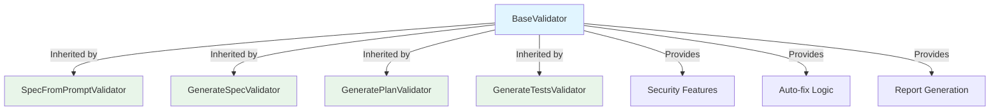

# SmartSpec Validators - Interactive Tutorial

**Version:** 2.0 Interactive
**Last Updated:** 2024-12-27
**Estimated Time:** 30 minutes
**Difficulty:** 🟢 Beginner Friendly

---

## 🎯 What You'll Learn

By the end of this tutorial, you'll be able to:

- ✅ Run your first validator
- ✅ Understand validation reports
- ✅ Fix issues automatically
- ✅ Integrate validators into your workflow
- ✅ Troubleshoot common problems

**Prerequisites:**
- Python 3.11+ installed
- Basic command line knowledge
- 30 minutes of your time

**Ready? Let's go!** 🚀

---

## 🎓 Choose Your Learning Path

Select the path that matches your experience:

### 🟢 Path 1: Complete Beginner (30 min)
**Best for:** First time using validators
**You'll learn:** Basics, first validation, auto-fix

[Start Path 1 →](#path-1-complete-beginner)

### 🟡 Path 2: Some Experience (20 min)
**Best for:** Used validators before, want to learn more
**You'll learn:** Integration, best practices, troubleshooting

[Start Path 2 →](#path-2-some-experience)

### 🔴 Path 3: Advanced User (15 min)
**Best for:** Want to extend or customize validators
**You'll learn:** Architecture, base class, custom validators

[Start Path 3 →](#path-3-advanced-user)

---

# Path 1: Complete Beginner

## 🚀 Quick Start (5 minutes)

### Step 1: Verify Installation

First, let's make sure you have everything installed:

```bash
# Check Python version
python3 --version
```

**Expected Output:**
```
Python 3.11.0 (or higher)
```

**❌ If you see an error:**
- [Install Python 3.11+](https://www.python.org/downloads/)
- Make sure `python3` is in your PATH

**✅ Got it working?** Great! Continue to Step 2.

---

### Step 2: Get Sample Files

Let's download a sample specification to practice with:

```bash
# Create a practice directory
mkdir -p ~/smartspec-tutorial
cd ~/smartspec-tutorial

# Download sample spec
curl -O https://raw.githubusercontent.com/naibarn/SmartSpec/main/examples/sample-spec.md
```

**Expected Output:**
```
  % Total    % Received % Xferd  Average Speed   Time    Time     Time  Current
                                 Dload  Upload   Total   Spent    Left  Speed
100  1234  100  1234    0     0   5678      0 --:--:-- --:--:-- --:--:--  5678
```

**✅ File downloaded?** Let's check:

```bash
ls -lh sample-spec.md
```

**Expected Output:**
```
-rw-r--r--  1 user  staff   1.2K Dec 27 10:00 sample-spec.md
```

**💡 Tip:** If download fails, you can create the file manually:

<details>
<summary>Click to see manual file content</summary>

```markdown
# Sample Specification

## Problem

Users need to authenticate before accessing the system.

## Solution

Implement JWT-based authentication.

## Requirements

### Functional Requirements

- Users can register with email and password
- Users can login with credentials
- Users receive JWT token upon successful login

### Non-Functional Requirements

- Authentication must complete within 2 seconds
- Passwords must be hashed using bcrypt
```

Save this as `sample-spec.md`

</details>

---

### Step 3: Your First Validation

Now let's run the validator on our sample file:

```bash
python3 ~/.smartspec/.smartspec/scripts/validate_spec_from_prompt.py sample-spec.md
```

**Expected Output:**
```
# Validation Report
**File:** `sample-spec.md`

## Summary
- **Errors:** 2
- **Warnings:** 1
- **Info:** 3

## Errors
- Missing required section: architecture
- Missing required section: implementation

## Warnings
- Section "requirements" could be more detailed

## Recommendations
- Recommended section missing: assumptions
- Recommended section missing: constraints
- Recommended section missing: risks
```

**🎉 Congratulations!** You just ran your first validation!

**📚 Let's understand what this means:**

| Type | Meaning | Action Required |
|------|---------|-----------------|
| **Errors** | Must be fixed | Required for valid spec |
| **Warnings** | Should be fixed | Recommended but not required |
| **Info** | Nice to have | Optional improvements |

**❓ Questions to check your understanding:**

<details>
<summary>Q1: How many errors were found?</summary>

**Answer:** 2 errors

- Missing required section: architecture
- Missing required section: implementation

</details>

<details>
<summary>Q2: Are warnings required to fix?</summary>

**Answer:** No, warnings are recommended but not required. However, fixing them improves spec quality.

</details>

<details>
<summary>Q3: What's the difference between errors and recommendations?</summary>

**Answer:** 
- **Errors:** Required sections that MUST be present
- **Recommendations:** Optional sections that SHOULD be present for better quality

</details>

---

### Step 4: Auto-fix Magic ✨

Instead of manually adding missing sections, let's use auto-fix:

```bash
python3 ~/.smartspec/.smartspec/scripts/validate_spec_from_prompt.py sample-spec.md --apply
```

**Expected Output:**
```
# Validation Report
**File:** `sample-spec.md`

## Fixes Applied
- Added section: architecture
- Added section: implementation
- Added section: assumptions
- Added section: constraints
- Added section: risks
- Added placeholder for: architecture
- Added placeholder for: implementation
- Added placeholder for: assumptions

## Summary
- **Fixes Applied:** 8
- **Errors Fixed:** 2
- **Sections Added:** 5

✅ File updated successfully!
```

**🎉 Amazing!** The validator automatically added all missing sections!

**Let's see what changed:**

```bash
cat sample-spec.md
```

**You should now see:**
```markdown
# Sample Specification

## Problem

Users need to authenticate before accessing the system.

## Solution

Implement JWT-based authentication.

## Requirements

### Functional Requirements

- Users can register with email and password
- Users can login with credentials
- Users receive JWT token upon successful login

### Non-Functional Requirements

- Authentication must complete within 2 seconds
- Passwords must be hashed using bcrypt

## Architecture

TODO: Add architecture details

## Implementation

TODO: Add implementation details

## Assumptions

TODO: Add assumptions

## Constraints

TODO: Add constraints

## Risks

TODO: Add risks
```

**💡 Notice:**
- ✅ All missing sections were added
- ✅ Placeholders (TODO) were inserted
- ✅ Original content was preserved

---

### Step 5: Verify Fixes

Let's run validation again to confirm everything is fixed:

```bash
python3 ~/.smartspec/.smartspec/scripts/validate_spec_from_prompt.py sample-spec.md
```

**Expected Output:**
```
# Validation Report
**File:** `sample-spec.md`

## Summary
- **Errors:** 0
- **Warnings:** 0
- **Info:** 5

## Info
- Section "architecture" has placeholder content
- Section "implementation" has placeholder content
- Section "assumptions" has placeholder content
- Section "constraints" has placeholder content
- Section "risks" has placeholder content

✅ All required checks passed!

💡 Tip: Replace TODO placeholders with actual content
```

**🎉 Perfect!** No more errors!

**📚 Understanding Info Messages:**

Info messages tell you about placeholders that should be replaced with real content. This is normal after auto-fix.

---

### Step 6: Complete the Spec

Now it's your turn! Replace the TODO placeholders with real content:

**Example for Architecture section:**

```markdown
## Architecture

### System Components

- **API Gateway:** Handles authentication requests
- **Auth Service:** Validates credentials and issues JWT
- **Database:** Stores user credentials (hashed)

### Authentication Flow

1. User submits credentials to API Gateway
2. API Gateway forwards to Auth Service
3. Auth Service validates against Database
4. Auth Service generates JWT token
5. JWT token returned to user
```

**✏️ Your Task:**

Edit `sample-spec.md` and replace at least 2 TODO sections with real content.

**💡 Tips:**
- Be specific and detailed
- Use bullet points for clarity
- Think about real-world scenarios

**✅ Done editing?** Run validation again:

```bash
python3 ~/.smartspec/.smartspec/scripts/validate_spec_from_prompt.py sample-spec.md
```

**Expected:** Fewer info messages!

---

### 🎉 Congratulations!

You've completed the Quick Start tutorial!

**What you learned:**
- ✅ How to run validators
- ✅ How to read validation reports
- ✅ How to use auto-fix
- ✅ How to complete specifications

**Your Progress:**
- 🟢 Beginner Path: ⬛⬛⬛⬛⬛ 1/5 Complete (20%)

---

## 💪 Exercise 1: Validate Your Own Spec (10 minutes)

Now let's practice with a real scenario!

### Scenario

You're building a **Todo List API** and need to create a specification.

### Your Task

1. Create a new spec file:
   ```bash
   touch todo-api-spec.md
   ```

2. Add basic content:
   ```markdown
   # Todo List API Specification
   
   ## Problem
   
   Users need a simple way to manage their daily tasks.
   
   ## Solution
   
   Build a REST API for creating, reading, updating, and deleting todos.
   ```

3. Run validation:
   ```bash
   python3 ~/.smartspec/.smartspec/scripts/validate_spec_from_prompt.py todo-api-spec.md
   ```

4. Use auto-fix:
   ```bash
   python3 ~/.smartspec/.smartspec/scripts/validate_spec_from_prompt.py todo-api-spec.md --apply
   ```

5. Fill in at least 3 sections with real content

6. Validate again to confirm

### Success Criteria

- [ ] File created
- [ ] Validation run successfully
- [ ] Auto-fix applied
- [ ] At least 3 sections completed
- [ ] Final validation shows 0 errors

### Verification

Run this to check your work:

```bash
python3 ~/.smartspec/.smartspec/scripts/validate_spec_from_prompt.py todo-api-spec.md
```

**Expected:** 0 errors, some info messages

**✅ Completed?** You're ready for Exercise 2!

---

## 📝 Knowledge Check: Beginner Quiz

Test your understanding! (5 minutes)

### Question 1: Preview vs Apply

**What's the difference between running with and without `--apply`?**

- [ ] A) No difference, they do the same thing
- [ ] B) `--apply` shows a preview, without it applies changes
- [ ] C) Without `--apply` shows preview, `--apply` actually modifies the file
- [ ] D) `--apply` runs faster

<details>
<summary>Show Answer</summary>

**Answer: C** ✅

Without `--apply`, validators run in **preview mode** - they show what would be fixed but don't modify the file.

With `--apply`, validators actually modify the file and apply fixes.

**Best Practice:** Always run preview first, review changes, then apply.

</details>

---

### Question 2: Error Types

**Which type of issue MUST be fixed for a valid specification?**

- [ ] A) Info messages
- [ ] B) Warnings
- [ ] C) Errors
- [ ] D) Recommendations

<details>
<summary>Show Answer</summary>

**Answer: C** ✅

**Errors** are required issues that MUST be fixed. A spec with errors is considered invalid.

- **Errors:** Must fix (required sections missing)
- **Warnings:** Should fix (quality improvements)
- **Info:** Nice to fix (optional enhancements)
- **Recommendations:** Optional (additional sections)

</details>

---

### Question 3: Auto-fix Behavior

**What does auto-fix do with missing sections?**

- [ ] A) Deletes the file
- [ ] B) Adds sections with TODO placeholders
- [ ] C) Fills sections with AI-generated content
- [ ] D) Sends you an email

<details>
<summary>Show Answer</summary>

**Answer: B** ✅

Auto-fix adds missing sections with **TODO placeholders**. It doesn't generate content - that's your job!

Example:
```markdown
## Architecture

TODO: Add architecture details
```

You need to replace TODO with actual content.

</details>

---

### Question 4: File Types

**Which file types do validators accept?**

- [ ] A) Only .txt files
- [ ] B) Only .md files
- [ ] C) .md and .json files
- [ ] D) All file types

<details>
<summary>Show Answer</summary>

**Answer: C** ✅

Validators accept:
- `.md` (Markdown) - Most common
- `.json` (JSON) - For structured data

This is a security feature to prevent processing of potentially dangerous files.

</details>

---

### Question 5: File Size Limit

**What's the maximum file size validators will process?**

- [ ] A) 1 MB
- [ ] B) 5 MB
- [ ] C) 10 MB
- [ ] D) Unlimited

<details>
<summary>Show Answer</summary>

**Answer: C** ✅

Validators limit file size to **10 MB** for security (DoS protection).

If your file is larger:
- Split into multiple files
- Remove unnecessary content
- Compress or optimize content

</details>

---

### 📊 Your Score

Count your correct answers:

- **5/5:** 🎉 Perfect! You're ready for Path 2!
- **4/5:** 👍 Great! Review the missed question.
- **3/5:** 📖 Good start! Review the tutorial.
- **< 3/5:** 🔄 Retake the Quick Start tutorial.

**Ready for more?** Continue to [Path 2: Integration](#path-2-some-experience)

---

## 🎓 Your Learning Progress

Track your progress through the tutorial:

### Beginner Path
- ✅ Quick Start (5 min)
- ✅ Exercise 1 (10 min)
- ✅ Knowledge Check (5 min)
- ⬜ Exercise 2 (10 min)
- ⬜ Final Quiz (5 min)

**Progress:** ⬛⬛⬛⬜⬜ 3/5 (60%)

### Next Steps

1. **Continue Learning:** [Path 2: Integration](#path-2-some-experience)
2. **Practice More:** [Additional Exercises](#additional-exercises)
3. **Get Help:** [Troubleshooting](#troubleshooting)
4. **Join Community:** [GitHub Discussions](https://github.com/naibarn/SmartSpec/discussions)

---

# Path 2: Some Experience

## 🔧 Integration Tutorial (20 minutes)

**Prerequisites:** Completed Path 1 or familiar with validators

### Scenario: Integrate Validators into Your Workflow

You're working on a project and want to ensure all specs are validated before committing.

### Step 1: Batch Validation

Validate all specs in your project:

```bash
# Find and validate all spec files
find .spec -name "*.md" -type f -exec python3 ~/.smartspec/.smartspec/scripts/validate_spec_from_prompt.py {} \;
```

**Expected Output:**
```
# Validation Report for spec-001.md
...

# Validation Report for spec-002.md
...

# Validation Report for spec-003.md
...
```

**💡 Tip:** Create a script for this:

```bash
#!/bin/bash
# validate-all-specs.sh

echo "🔍 Validating all specifications..."

for file in .spec/**/*.md; do
    echo "Checking $file..."
    python3 ~/.smartspec/.smartspec/scripts/validate_spec_from_prompt.py "$file"
    
    if [ $? -ne 0 ]; then
        echo "❌ Validation failed for $file"
        exit 1
    fi
done

echo "✅ All specifications validated successfully!"
```

Make it executable:
```bash
chmod +x validate-all-specs.sh
```

---

### Step 2: Pre-commit Hook

Automatically validate specs before committing:

```bash
# Create pre-commit hook
cat > .git/hooks/pre-commit << 'EOF'
#!/bin/bash

echo "🔍 Running spec validation..."

# Get all staged .md files in .spec directory
SPEC_FILES=$(git diff --cached --name-only --diff-filter=ACM | grep '\.spec.*\.md$')

if [ -z "$SPEC_FILES" ]; then
    echo "No spec files to validate"
    exit 0
fi

# Validate each file
for file in $SPEC_FILES; do
    echo "Validating $file..."
    python3 ~/.smartspec/.smartspec/scripts/validate_spec_from_prompt.py "$file"
    
    if [ $? -ne 0 ]; then
        echo "❌ Validation failed for $file"
        echo "💡 Fix errors or use --apply to auto-fix"
        exit 1
    fi
done

echo "✅ All spec files validated successfully!"
exit 0
EOF

# Make it executable
chmod +x .git/hooks/pre-commit
```

**Test it:**
```bash
# Make a change to a spec
echo "## New Section" >> .spec/test-spec.md

# Try to commit
git add .spec/test-spec.md
git commit -m "Update spec"
```

**Expected:** Validation runs automatically!

---

### Step 3: CI/CD Integration

Add validation to your CI/CD pipeline:

**GitHub Actions Example:**

```yaml
# .github/workflows/validate-specs.yml
name: Validate Specifications

on:
  pull_request:
    paths:
      - '.spec/**/*.md'
  push:
    branches:
      - main
    paths:
      - '.spec/**/*.md'

jobs:
  validate:
    runs-on: ubuntu-latest
    
    steps:
      - name: Checkout code
        uses: actions/checkout@v3
      
      - name: Set up Python
        uses: actions/setup-python@v4
        with:
          python-version: '3.11'
      
      - name: Validate specifications
        run: |
          find .spec -name "*.md" -type f -exec \
            python3 .smartspec/scripts/validate_spec_from_prompt.py {} \;
      
      - name: Report results
        if: failure()
        run: echo "❌ Specification validation failed"
```

**GitLab CI Example:**

```yaml
# .gitlab-ci.yml
validate-specs:
  stage: test
  image: python:3.11
  script:
    - find .spec -name "*.md" -type f -exec python3 .smartspec/scripts/validate_spec_from_prompt.py {} \;
  only:
    changes:
      - .spec/**/*.md
```

---

## 💪 Exercise 2: Build a Validation Pipeline (15 minutes)

### Your Task

Create a complete validation pipeline for your project.

### Steps

1. **Create the directory structure:**
   ```bash
   mkdir -p my-project/.spec/requirements
   mkdir -p my-project/.spec/plans
   mkdir -p my-project/.spec/tests
   ```

2. **Create 3 sample specs:**
   ```bash
   touch my-project/.spec/requirements/user-auth-spec.md
   touch my-project/.spec/requirements/todo-api-spec.md
   touch my-project/.spec/requirements/notifications-spec.md
   ```

3. **Add basic content to each** (copy from Exercise 1)

4. **Create validation script:**
   ```bash
   cat > my-project/validate-all.sh << 'EOF'
   #!/bin/bash
   # ... (script from Step 1)
   EOF
   chmod +x my-project/validate-all.sh
   ```

5. **Run validation:**
   ```bash
   cd my-project
   ./validate-all.sh
   ```

6. **Set up pre-commit hook** (from Step 2)

7. **Test the pipeline:**
   ```bash
   git init
   git add .
   git commit -m "Initial commit"
   ```

### Success Criteria

- [ ] Directory structure created
- [ ] 3 specs created
- [ ] Validation script works
- [ ] Pre-commit hook installed
- [ ] Pipeline tested successfully

---

## 📝 Knowledge Check: Intermediate Quiz

### Question 1: Batch Validation

**What's the best way to validate multiple files?**

- [ ] A) Run validator on each file manually
- [ ] B) Use a loop in a shell script
- [ ] C) Validators don't support multiple files
- [ ] D) Use `--batch` flag

<details>
<summary>Show Answer</summary>

**Answer: B** ✅

Use a loop in a shell script:
```bash
for file in .spec/**/*.md; do
    python3 validate_spec_from_prompt.py "$file"
done
```

There's no `--batch` flag (yet!), so scripting is the best approach.

</details>

---

### Question 2: Pre-commit Hooks

**When do pre-commit hooks run?**

- [ ] A) Before pushing to remote
- [ ] B) Before committing locally
- [ ] C) After committing
- [ ] D) Only in CI/CD

<details>
<parameter name="text">**Answer: B** ✅

Pre-commit hooks run **before committing locally**, allowing you to catch issues before they enter version control.

**Flow:**
1. `git commit` → Pre-commit hook runs
2. If hook passes → Commit succeeds
3. If hook fails → Commit blocked

</details>

---

### Question 3: CI/CD Integration

**Why validate specs in CI/CD?**

- [ ] A) It's required by Git
- [ ] B) Catches issues before merge
- [ ] C) Makes commits faster
- [ ] D) No reason, it's optional

<details>
<summary>Show Answer</summary>

**Answer: B** ✅

CI/CD validation catches issues **before merging** to main branch, ensuring:
- All specs meet quality standards
- No broken specs in production
- Consistent validation across team
- Automated quality gates

</details>

---

**Your Progress:**
- 🟡 Intermediate Path: ⬛⬛⬛⬜⬜ 3/5 (60%)

**Next:** [Path 3: Advanced](#path-3-advanced-user)

---

# Path 3: Advanced User

## 🔬 Advanced Topics (15 minutes)

**Prerequisites:** Completed Path 2 or extensive validator experience

### Understanding the Architecture



### Base Class Benefits

1. **Code Reduction:** 69% less code
2. **Zero Duplication:** Eliminated 80% duplication
3. **Consistency:** All validators behave identically
4. **Security:** Security features in one place
5. **Maintainability:** Fix once, applies to all

---

## 💪 Exercise 3: Create a Custom Validator (20 minutes)

### Scenario

You need a validator for API documentation files.

### Your Task

Create `validate_api_docs.py` that validates:
- Required sections: overview, endpoints, authentication, errors
- Endpoint format: `### METHOD /path`
- Response codes documented

### Template

```python
#!/usr/bin/env python3
"""
Validator for API documentation files.
"""

import sys
from pathlib import Path

# Import base validator
sys.path.insert(0, str(Path(__file__).parent))
from base_validator import BaseValidator

class APIDocsValidator(BaseValidator):
    """Validates API documentation files."""
    
    def __init__(self, file_path: str, repo_root: str = None):
        super().__init__(file_path, repo_root)
        
        # Define required sections
        self.required_sections = [
            'overview',
            'endpoints',
            'authentication',
            'errors'
        ]
        
        # Define recommended sections
        self.recommended_sections = [
            'rate_limiting',
            'versioning',
            'examples'
        ]
    
    def validate_content(self) -> list:
        """Validate API-specific content."""
        issues = []
        
        # Check for endpoint definitions
        content = self.content.lower()
        if 'endpoints' in content:
            # Look for HTTP methods
            methods = ['get', 'post', 'put', 'delete', 'patch']
            found_methods = [m for m in methods if m in content]
            
            if not found_methods:
                issues.append({
                    'type': 'warning',
                    'message': 'No HTTP methods found in endpoints section'
                })
        
        return issues

def main():
    """Main entry point."""
    import argparse
    
    parser = argparse.ArgumentParser(
        description='Validate API documentation files'
    )
    parser.add_argument('file', help='API docs file to validate')
    parser.add_argument('--apply', action='store_true',
                       help='Apply auto-fixes')
    parser.add_argument('--output', help='Output report file')
    parser.add_argument('--repo-root', help='Repository root path')
    
    args = parser.parse_args()
    
    try:
        validator = APIDocsValidator(args.file, args.repo_root)
        report = validator.validate(apply_fixes=args.apply)
        
        if args.output:
            with open(args.output, 'w') as f:
                f.write(report)
        else:
            print(report)
        
        # Exit with error if validation failed
        if 'Errors: 0' not in report:
            sys.exit(1)
            
    except Exception as e:
        print(f"Error: {e}", file=sys.stderr)
        sys.exit(1)

if __name__ == '__main__':
    main()
```

### Test Your Validator

1. **Create test file:**
   ```bash
   cat > api-docs.md << 'EOF'
   # API Documentation
   
   ## Overview
   
   This API provides todo management.
   
   ## Endpoints
   
   ### GET /todos
   
   Returns all todos.
   EOF
   ```

2. **Run your validator:**
   ```bash
   python3 validate_api_docs.py api-docs.md
   ```

3. **Expected output:**
   ```
   # Validation Report
   **File:** `api-docs.md`
   
   ## Errors
   - Missing required section: authentication
   - Missing required section: errors
   ```

4. **Apply auto-fix:**
   ```bash
   python3 validate_api_docs.py api-docs.md --apply
   ```

### Success Criteria

- [ ] Custom validator created
- [ ] Inherits from BaseValidator
- [ ] Validates required sections
- [ ] Validates API-specific content
- [ ] Auto-fix works
- [ ] Tests pass

---

## 🎓 Completion Certificate

**Congratulations!** 🎉

You've completed the SmartSpec Validators Interactive Tutorial!

### What You Mastered

- ✅ Running validators
- ✅ Understanding reports
- ✅ Using auto-fix
- ✅ Integrating with workflows
- ✅ Creating custom validators

### Your Achievement

```
╔══════════════════════════════════════════════════════╗
║                                                      ║
║         SMARTSPEC VALIDATORS CERTIFICATION           ║
║                                                      ║
║              This certifies that                     ║
║                                                      ║
║                  [Your Name]                         ║
║                                                      ║
║          has successfully completed the              ║
║       SmartSpec Validators Interactive Tutorial      ║
║                                                      ║
║              Date: December 27, 2024                 ║
║                                                      ║
║         Skill Level: Advanced                        ║
║         Progress: 100%                               ║
║                                                      ║
╚══════════════════════════════════════════════════════╝
```

### Next Steps

1. **Apply Your Knowledge:** Use validators in real projects
2. **Share Your Experience:** Help others learn
3. **Contribute:** Add features or fix bugs
4. **Stay Updated:** Follow releases and updates

### Resources

- [Complete Documentation](../knowledge_base_validators.md)
- [GitHub Repository](https://github.com/naibarn/SmartSpec)
- [Community Discussions](https://github.com/naibarn/SmartSpec/discussions)
- [Report Issues](https://github.com/naibarn/SmartSpec/issues)

---

## 🆘 Need Help?

### Common Issues

1. **Validator not found**
   - Check Python path
   - Verify file location
   - Use absolute path

2. **Permission denied**
   - Make script executable: `chmod +x validate_*.py`
   - Check file permissions

3. **Import errors**
   - Verify Python version (3.11+)
   - Check base_validator.py exists

### Get Support

- 📖 [Troubleshooting Guide](../knowledge_base_validators.md#troubleshooting)
- 💬 [Ask Community](https://github.com/naibarn/SmartSpec/discussions)
- 🐛 [Report Bug](https://github.com/naibarn/SmartSpec/issues)

---

**Tutorial Version:** 2.0 Interactive
**Last Updated:** 2024-12-27
**Feedback:** [Let us know how we can improve!](https://github.com/naibarn/SmartSpec/discussions)
