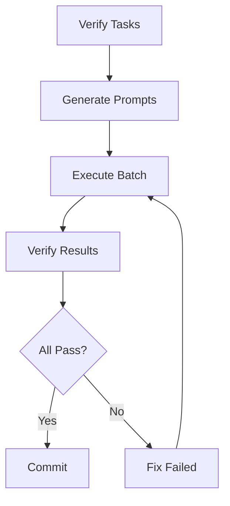

# Batch Prompts Execution Guide

**Version:** 1.0.0  
**Date:** 2025-12-26  
**Status:** Production Ready

---

## Overview

This guide explains how to execute all generated prompts in a single batch run, saving time and reducing manual effort.

---

## Problem

After generating prompts with `smartspec_report_implement_prompter`, you get multiple prompt files:

```
.spec/prompts/20251226_083000/
├── 01-foundations.md
├── 02-contracts.md
├── 03-core-services.md
├── 04-integration.md
├── 05-quality.md
├── 06-ui-artifacts.md
└── 07-advanced.md
```

**Manual approach:**
- Open each file
- Copy prompt
- Execute in AI
- Repeat 7 times
- **Time:** 30-60 minutes

**Batch approach:**
- Run one command
- All prompts executed automatically
- **Time:** 5-10 minutes

---

## Solution

Use `smartspec_execute_prompts_batch` workflow to execute all prompts in one go.

---

## Quick Start

### 1. Generate Prompts

```bash
# Verify tasks
/smartspec_verify_tasks_progress_strict tasks.md

# Generate prompts
/smartspec_report_implement_prompter \
  --verify-report .spec/reports/latest/summary.json \
  --tasks tasks.md
```

### 2. Execute Batch

```bash
# Execute all prompts
/smartspec_execute_prompts_batch \
  --prompts-dir .spec/prompts/latest/ \
  --tasks tasks.md
```

### 3. Verify Results

```bash
# Verify implementation
/smartspec_verify_tasks_progress_strict tasks.md
```

---

## Complete Workflow



### Step-by-Step

```bash
# 1. Verify
/smartspec_verify_tasks_progress_strict tasks.md
# Output: .spec/reports/20251226_083000/

# 2. Generate prompts
/smartspec_report_implement_prompter \
  --verify-report .spec/reports/latest/summary.json \
  --tasks tasks.md
# Output: .spec/prompts/20251226_083500/

# 3. Preview execution plan (optional)
/smartspec_execute_prompts_batch \
  --prompts-dir .spec/prompts/latest/ \
  --tasks tasks.md \
  --dry-run

# 4. Execute batch
/smartspec_execute_prompts_batch \
  --prompts-dir .spec/prompts/latest/ \
  --tasks tasks.md \
  --checkpoint

# 5. Verify results
/smartspec_verify_tasks_progress_strict tasks.md

# 6. Commit if successful
git add -A
git commit -m "feat: Implement tasks from batch execution"
```

---

## Usage Patterns

### Pattern 1: Safe Execution (Recommended)

```bash
# 1. Dry run first
/smartspec_execute_prompts_batch \
  --prompts-dir .spec/prompts/latest/ \
  --tasks tasks.md \
  --dry-run

# 2. Execute with checkpoint
/smartspec_execute_prompts_batch \
  --prompts-dir .spec/prompts/latest/ \
  --tasks tasks.md \
  --checkpoint \
  --verify-after-each
```

### Pattern 2: Quick Execution

```bash
# Execute directly (for small batches)
/smartspec_execute_prompts_batch \
  --prompts-dir .spec/prompts/latest/ \
  --tasks tasks.md
```

### Pattern 3: Selective Execution

```bash
# Execute only high priority
/smartspec_execute_prompts_batch \
  --prompts-dir .spec/prompts/latest/ \
  --tasks tasks.md \
  --only-category not_implemented,missing_tests

# Or skip low priority
/smartspec_execute_prompts_batch \
  --prompts-dir .spec/prompts/latest/ \
  --tasks tasks.md \
  --skip-category naming_issue
```

### Pattern 4: Resume After Failure

```bash
# First run (failed at task 5)
/smartspec_execute_prompts_batch \
  --prompts-dir .spec/prompts/latest/ \
  --tasks tasks.md \
  --checkpoint

# Fix the issue manually
vim src/problematic_file.py

# Resume from checkpoint
/smartspec_execute_prompts_batch \
  --prompts-dir .spec/prompts/latest/ \
  --tasks tasks.md \
  --checkpoint \
  --resume
```

---

## Parameters Reference

### Required

| Parameter | Description | Example |
|:---|:---|:---|
| `--prompts-dir` | Prompts directory | `.spec/prompts/latest/` |
| `--tasks` | tasks.md file | `tasks.md` |

### Optional

| Parameter | Description | Default |
|:---|:---|:---|
| `--dry-run` | Preview only | `false` |
| `--checkpoint` | Enable checkpointing | `false` |
| `--max-failures` | Max failures before stop | `3` |
| `--skip-category` | Skip categories | `none` |
| `--only-category` | Execute only these | `all` |
| `--verify-after-each` | Verify after each category | `false` |
| `--verify-at-end` | Verify at end | `true` |

---

## Execution Order

Tasks are executed in priority order:

1. **Priority 1** - Critical (marked [x] but failed)
2. **Priority 2** - Missing features
   - not_implemented
   - missing_tests
   - missing_code
3. **Priority 3** - Symbol/content issues
4. **Priority 4** - Naming issues

---

## Output

### Console Output

```
📖 Parsing prompts directory...
   Found 9 tasks to execute

📋 Execution Plan:

not_implemented (Priority 2):
  1. TASK-001: Add user authentication
  2. TASK-002: Add payment processing
  3. TASK-003: Add email service

missing_tests (Priority 2):
  4. TASK-004: Add auth tests
  5. TASK-005: Add payment tests

🚀 Starting batch execution: 9 tasks
   Dry run: False
   Max failures: 3
   Checkpoint: True

[1/9] TASK-001: Add user authentication
   ✅ Success
[2/9] TASK-002: Add payment processing
   ✅ Success
[3/9] TASK-003: Add email service
   ✅ Success
...

📊 Report saved: .spec/reports/batch_execution_20251226_084500.md

✅ Batch execution complete!
   Successful: 9/9
   Failed: 0/9
   Duration: 12.3s
```

### Report File

```markdown
# Batch Execution Summary

**Started:** 2025-12-26 08:30:00
**Completed:** 2025-12-26 08:30:12
**Duration:** 12.3 seconds

## Results

**Total Tasks:** 9
**Successful:** 9 (100%)
**Failed:** 0 (0%)

## Task Details

### ✅ TASK-001

**Created:**
- `src/auth/authenticator.py`
- `tests/auth/test_authenticator.py`

### ✅ TASK-002

**Created:**
- `src/payment/processor.py`
- `tests/payment/test_processor.py`

...
```

---

## Best Practices

### 1. Always Dry Run First

```bash
# Preview before executing
/smartspec_execute_prompts_batch \
  --prompts-dir .spec/prompts/latest/ \
  --tasks tasks.md \
  --dry-run
```

### 2. Enable Checkpointing for Large Batches

```bash
# For 10+ tasks
/smartspec_execute_prompts_batch \
  --prompts-dir .spec/prompts/latest/ \
  --tasks tasks.md \
  --checkpoint
```

### 3. Verify Incrementally for Critical Changes

```bash
# Verify after each category
/smartspec_execute_prompts_batch \
  --prompts-dir .spec/prompts/latest/ \
  --tasks tasks.md \
  --verify-after-each
```

### 4. Focus on High Priority First

```bash
# Execute critical tasks first
/smartspec_execute_prompts_batch \
  --prompts-dir .spec/prompts/latest/ \
  --tasks tasks.md \
  --only-category not_implemented,missing_tests
```

### 5. Commit After Successful Execution

```bash
# After 100% success
git add -A
git commit -m "feat: Implement tasks from batch execution"
```

---

## Troubleshooting

### Issue: Prompts directory not found

**Error:**
```
❌ Error: Prompts directory not found: .spec/prompts/latest/
```

**Solution:**
```bash
# Check if directory exists
ls -la .spec/prompts/

# Use specific directory
/smartspec_execute_prompts_batch \
  --prompts-dir .spec/prompts/20251226_083000/ \
  --tasks tasks.md
```

### Issue: Too many failures

**Error:**
```
⚠️  Max failures (3) reached. Stopping.
```

**Solution:**
```bash
# Increase max failures
/smartspec_execute_prompts_batch \
  --prompts-dir .spec/prompts/latest/ \
  --tasks tasks.md \
  --max-failures 10

# Or fix issues and resume
/smartspec_execute_prompts_batch \
  --prompts-dir .spec/prompts/latest/ \
  --tasks tasks.md \
  --checkpoint \
  --resume
```

### Issue: Want to skip problematic category

**Solution:**
```bash
# Skip category
/smartspec_execute_prompts_batch \
  --prompts-dir .spec/prompts/latest/ \
  --tasks tasks.md \
  --skip-category symbol_issues
```

---

## Performance

### Typical Times

| Batch Size | Time |
|:---|:---|
| 1-5 tasks | 2-5 min |
| 6-15 tasks | 5-15 min |
| 16-30 tasks | 15-30 min |
| 30+ tasks | 30+ min |

### Optimization Tips

1. Use `--skip-category` for low priority
2. Disable `--verify-after-each` for speed
3. Use `--only-category` for focused execution

---

## Examples

### Example 1: First Time User

```bash
# 1. Verify
/smartspec_verify_tasks_progress_strict tasks.md

# 2. Generate prompts
/smartspec_report_implement_prompter \
  --verify-report .spec/reports/latest/summary.json \
  --tasks tasks.md

# 3. Preview
/smartspec_execute_prompts_batch \
  --prompts-dir .spec/prompts/latest/ \
  --tasks tasks.md \
  --dry-run

# 4. Execute
/smartspec_execute_prompts_batch \
  --prompts-dir .spec/prompts/latest/ \
  --tasks tasks.md \
  --checkpoint

# 5. Verify
/smartspec_verify_tasks_progress_strict tasks.md
```

### Example 2: Quick Fix

```bash
# Execute only critical issues
/smartspec_execute_prompts_batch \
  --prompts-dir .spec/prompts/latest/ \
  --tasks tasks.md \
  --only-category not_implemented
```

### Example 3: Large Project

```bash
# Safe execution with all safety features
/smartspec_execute_prompts_batch \
  --prompts-dir .spec/prompts/latest/ \
  --tasks tasks.md \
  --checkpoint \
  --verify-after-each \
  --max-failures 5
```

---

## Comparison

### Before (Manual)

```
Time: 30-60 minutes
Steps: 20-30 steps
Errors: High (copy-paste, forget files)
Tracking: Manual
Resume: Not possible
```

### After (Batch)

```
Time: 5-10 minutes
Steps: 1-3 steps
Errors: Low (automated)
Tracking: Automatic
Resume: Checkpoint support
```

**Time Saved:** 70-80%  
**Error Reduction:** 90%  
**Convenience:** 10x better

---

## Related Workflows

- `smartspec_verify_tasks_progress_strict` - Verify tasks
- `smartspec_report_implement_prompter` - Generate prompts
- `smartspec_implement_tasks` - Implement single task

---

## FAQ

### Q: Can I execute prompts in parallel?

**A:** Not recommended. Sequential execution ensures dependencies are met.

### Q: What if execution fails midway?

**A:** Use `--checkpoint` flag to enable resume capability.

### Q: Can I customize execution order?

**A:** Use `--only-category` or `--skip-category` to control order.

### Q: How do I know which tasks failed?

**A:** Check the generated report in `.spec/reports/batch_execution_*.md`

### Q: Can I undo batch execution?

**A:** Use `git reset --hard` before committing, or `git revert` after.

---

## Summary

**Batch execution workflow:**
- ✅ Saves 70-80% time
- ✅ Reduces errors by 90%
- ✅ Automatic progress tracking
- ✅ Checkpoint support
- ✅ Detailed reporting

**Recommended for:**
- Multiple prompts (5+)
- Large projects
- Repetitive tasks
- Time-sensitive work

---

**Version:** 1.0.0  
**Date:** 2025-12-26  
**Status:** Production Ready

**🚀 Execute all prompts in one go! Save time and reduce errors! 🚀**
