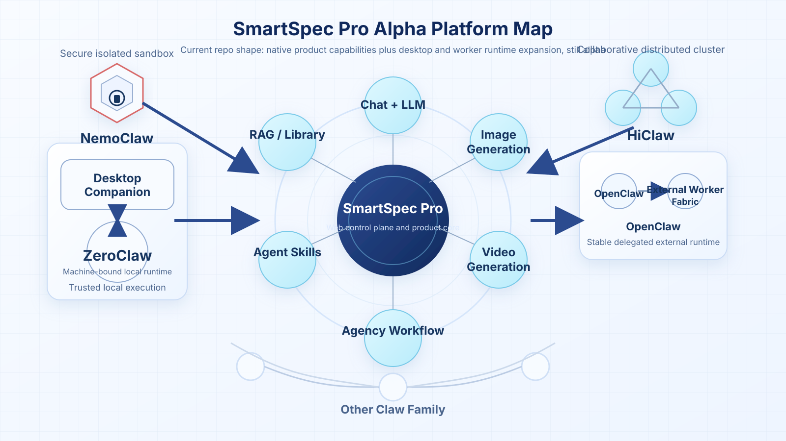
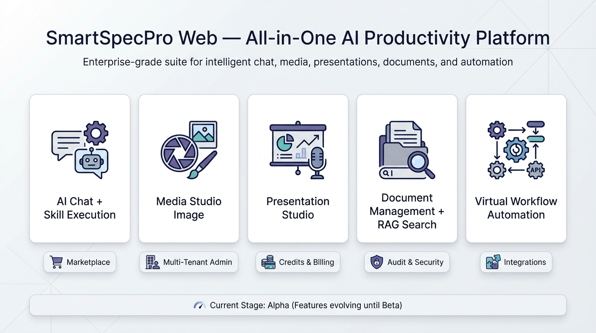
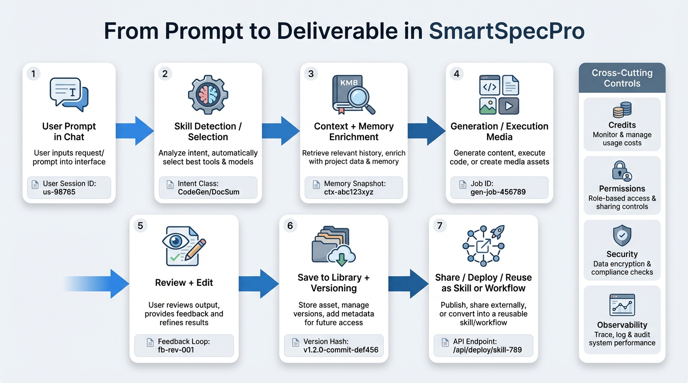
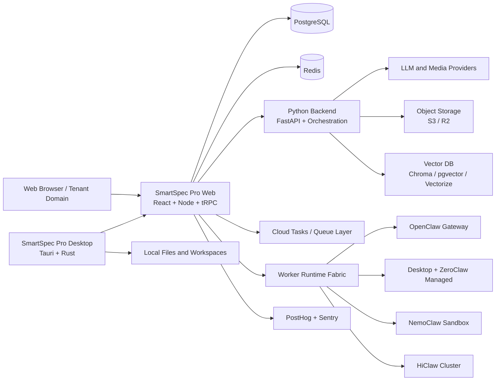
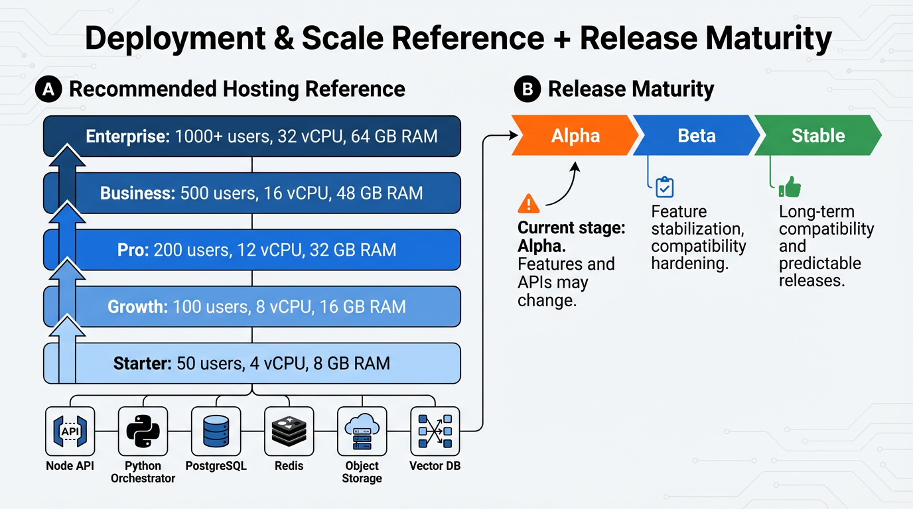

# SmartSpec Pro

[](https://github.com/naibarn/SmartSpecPro/actions/workflows/ci.yml)
[](./LICENSE)
[](#alpha-release-notice)
[](https://turbo.build/repo)
[](https://nodejs.org/)
[](https://www.python.org/)

Today this alpha codebase spans:

- SmartSpec Pro on the web as the main control plane and product surface
- SmartSpec Pro Desktop as a Tauri-based managed desktop host for local execution
- multi-model chat and LLM workspaces
- image, video, and audio generation flows
- library, document intelligence, RAG, and vector search
- agent skills, reusable automation, and agency workflow orchestration
- early worker/runtime fabric support for hybrid local and external execution

This is no longer just a chat UI or a thin automation shell.
It is an evolving alpha platform for AI-native products that need product UX, media workflows, knowledge systems, automation, desktop-side execution, and runtime interoperability in one monorepo.

## Alpha Release Notice

Current version status: **Alpha**.

- The platform is actively evolving and not feature-stable yet.
- Feature behavior, APIs, schemas, UI flows, and infrastructure defaults may change.
- Additional modules may be introduced before the Beta milestone.
- Breaking changes can happen between alpha updates.
- Desktop, worker/runtime, and hybrid execution surfaces are now present, but several lanes are still feature-gated or hardening.

If you plan to use SmartSpecPro in production during alpha, pin commits/tags and test upgrades in staging first.

## Current Alpha Scope

The project supports substantially more than earlier iterations, while still remaining **Alpha**.

Current repo highlights:

- **Chat + LLM**: multi-conversation AI chat, embedded skill execution, context/memory helpers, and model-routed AI interactions
- **Media creation**: image, video, and audio generation with prompt enhancement, model inputs, async task lifecycle, and artifact history
- **Knowledge systems**: document management, versioning, connectors, library workflows, RAG, and vector search across multiple providers
- **Automation**: agent skills, workflow builder, agency-oriented orchestration, workpack lifecycle/readiness surfaces, and workflow-to-skill conversion flows
- **SmartSpec Pro Desktop**: `apps/tauri-shell` now gives the repo a governed desktop foundation for local execution, device enrollment, package sync, local roots, and web-to-desktop handoff
- **Runtime expansion**: the codebase includes worker/runtime fabric primitives for `openclaw_gateway`, `desktop_zeroclaw_managed`, `nemoclaw_sandbox`, and `hiclaw_cluster`
- **Admin and ops**: multi-tenant controls, audit/search, billing and budget policy surfaces, infrastructure monitoring, and health/readiness endpoints

The platform map below is a concise view of the **current alpha shape** of the repo.
It should be read as "implemented foundation plus active hardening", not as a Beta-stable compatibility promise.



## Table of Contents

- [Alpha Release Notice](#alpha-release-notice)
- [Current Alpha Scope](#current-alpha-scope)
- [1. What This Project Delivers](#1-what-this-project-delivers)
- [2. Core Product Areas](#2-core-product-areas)
- [3. Architecture](#3-architecture)
- [4. Technology Stack](#4-technology-stack)
- [5. Repository Structure](#5-repository-structure)
- [6. Quick Start (Step-by-Step)](#6-quick-start-step-by-step)
- [7. Configuration](#7-configuration)
- [8. Recommended Hosting Specs](#8-recommended-hosting-specs)
- [9. Security and Operations](#9-security-and-operations)
- [10. Testing and Quality Gates](#10-testing-and-quality-gates)
- [11. Open Source Contribution Guide](#11-open-source-contribution-guide)
- [12. License](#12-license)

## 1. What This Project Delivers

SmartSpec Pro is designed to be a complete open-source alpha foundation for modern AI-first SaaS products that need more than a single chat screen.

It is built for:

- Product teams that need AI chat + automation + media workflows + knowledge systems in one platform.
- Organizations that need tenant/domain controls, auditability, and role-based administration.
- Builders who want a customizable base that can grow from web-only delivery into hybrid local and external runtime orchestration.



## 2. Core Product Areas

### A. AI Chat With Embedded Skills

- Multi-conversation chat with memory context and conversation summaries.
- Slash-command and auto-detected skill execution from chat.
- Skill-specific settings, cost estimation, artifact outputs, and async skill task tracking.
- Built-in memory management (`entity memories`, context compaction, retrieval helpers).

Key modules:

- `apps/web/client/src/pages/Chat.tsx`
- `apps/web/server/routers/chat.ts`
- `apps/web/server/routers/memory.ts`



### B. Agent Skill Marketplace and Skill Lifecycle

- Public marketplace for discovering, filtering, liking, commenting, and sharing skills.
- Skill categories for image/video/audio/code/document/automation use cases.
- Admin + creator workflows: create, import, review, approve/reject, publish.
- Group sharing controls for enterprise/internal skill distribution.

Key modules:

- `apps/web/client/src/pages/Marketplace.tsx`
- `apps/web/server/routers/marketplace.ts`
- `apps/web/server/routers/skills.ts`
- `apps/web/server/routers/skillRepositories.ts`

### C. Media Studio (Image, Video, Audio)

- Unified generation workspace for image, video, and audio.
- Prompt enhancement, style/VFX controls, reference media support, model-specific dynamic inputs.
- Async task lifecycle: queue, poll status, cancel, fetch result, history, and credits estimation.
- Add generated outputs directly to the document library.

Key modules:

- `apps/web/client/src/pages/MediaStudio.tsx`
- `apps/web/server/routers/media.ts`
- `apps/web/server/services/mediaGenerationService.ts`
- `python-backend/app/api/v1/media_generation.py`


### D. Presentation Studio

- Presentation deck/slide management with a visual editor canvas.
- Asset attach/detach, templates, slide and deck audio tracks.
- Export pipeline with status tracking.
- Version history and point-in-time restore.

Key modules:

- `apps/web/client/src/pages/PresentationEditor.tsx`
- `apps/web/server/routers/presentation.ts`
- `apps/web/server/services/presentationService.ts`
- `apps/web/server/services/presentationExportService.ts`

### E. Document Management + RAG + Vector Search

- File upload, markdown editing, metadata management, sharing permissions.
- Trash and restore workflow with permanent delete controls.
- Version history and restore for document content.
- Federated and semantic-ready search pipeline.
- Google Drive and OneDrive connectors with indexing workflows.
- Vector DB configuration with provider switching and reindex controls.

Vector provider support:

- ChromaDB
- pgvector
- Cloudflare Vectorize

pgvector quick setup:

- Apply `python-backend/migrations/006_pgvector_tenant_rls.py upgrade` to create the `vector` extension, `library_chunk_vectors`, indexes, and RLS policies.
- Set shared envs on the web and Python services: `SMARTSPEC_PROXY_TOKEN`, `PGVECTOR_HOST`, `PGVECTOR_PORT`, `PGVECTOR_DATABASE`, `PGVECTOR_USER`, `PGVECTOR_PASSWORD`.
- Set provider envs: web uses `VECTORDB_PROVIDER`, `VECTORDB_CURRENT_READ_PROVIDER`, `VECTORDB_TARGET_PROVIDER`; Python accepts `LIBRARY_VECTOR_PROVIDER`, `VECTOR_DB_PROVIDER`, or `VECTORDB_PROVIDER`.
- Optional hardening envs: `PGVECTOR_CONNECT_TIMEOUT`, `LIBRARY_PGVECTOR_SEARCH_TIMEOUT_MS`, `LIBRARY_PGVECTOR_CANDIDATE_LIMIT`.
- Reindex existing library items after switching the read/write provider so `library_chunk_vectors` is populated.

Key modules:

- `apps/web/client/src/pages/DocumentManagement.tsx`
- `apps/web/server/routers/library.ts`
- `apps/web/server/routers/googleDrive.ts`
- `apps/web/server/routers/oneDrive.ts`
- `apps/web/server/routers/systemSettings.ts`
- `python-backend/app/orchestrator/vector_store/`

### F. Virtual Workflow Automation and Workpacks

- Visual workflow builder (React Flow) with registry-driven node architecture.
- Compile, execute, monitor status, resume, and dead-letter reprocessing.
- Workflow templates and version history/restore.
- AI-assisted auto-generate and auto-edit.
- Workflow-to-skill conversion pipeline (`analyzeConversion` and `convertToSkill`).
- Workpack intake, lifecycle, readiness, and rollout-gate surfaces for supervised and autonomous operations.
- Readiness signals cover evidence completeness, connector health, trust status, exception severity, and rollback availability.

Key modules:

- `apps/web/client/src/pages/WorkflowEditor.tsx`
- `apps/web/server/routers/workflow.ts`
- `python-backend/app/orchestrator/`
- `apps/web/shared/workpackContracts.ts`
- `apps/web/server/services/workpackReadinessService.ts`

### G. Admin, Multi-Tenant, and Operations

- Admin domains: users, tenants, packages, providers, queues, services, security, audit.
- Domain admin dashboards and funnel analytics.
- Usage analytics, credit/billing controls, and budget policies.
- Health/readiness endpoints and infrastructure observability.

Key modules:

- `apps/web/client/src/pages/Admin*.tsx`
- `apps/web/server/routers/adminOps.ts`
- `apps/web/server/routers/audit.ts`
- `apps/web/server/routers/infrastructure.ts`
- `apps/web/server/services/scaleTier.ts`

### H. SmartSpec Pro Desktop, Desktop Host, and Worker Runtime Fabric (Alpha)

- `apps/tauri-shell` now acts as a managed desktop host for local execution, local roots, package materialization, and web-to-desktop handoff.
- The web side provides the desktop control plane: device registry, rollout-gate evaluation, policy snapshots, package feeds, revocation feeds, workspace profiles, and offboarding plans.
- Managed desktop posture now includes:
  - device-bound enrollment and proof-of-possession checks
  - signed package sync with trust classes and revocation states
  - governed local roots instead of whole-disk discovery by default
  - truthful run labels for local, hybrid, server, and external execution
  - tenant-visible health, presence, workspace profile, and network posture
- Desktop runtime boundaries are more explicit than before:
  - Pi and Agency Swarm are the internal desktop-side runtime labels for managed local execution
  - `desktop_zeroclaw_managed` is the projection identity used when the desktop host joins the worker fabric
  - `openclaw_gateway` is the external delegated runtime path in the current alpha surface
- Runtime family vocabulary currently present in the repo:
  - `openclaw_gateway`
  - `desktop_zeroclaw_managed`
  - `nemoclaw_sandbox`
  - `hiclaw_cluster`
- These runtime and hybrid execution surfaces are still alpha:
  - they expand what the project can do today
  - they are not yet a Beta-stable interoperability contract

Key modules:

- `apps/tauri-shell/src-tauri/src/*`
- `apps/web/shared/desktopHost.ts`
- `apps/web/server/routes/desktopHost.ts`
- `apps/web/shared/workerRuntime.ts`
- `apps/web/server/routes/workerRuntime.ts`
- `apps/web/server/services/workerRegistryService.ts`
- `apps/web/server/services/workerDelegationService.ts`

## 3. Architecture



Design highlights:

- Single web app package hosts frontend and Node API in `apps/web`.
- Desktop Host foundation lives in `apps/tauri-shell`, while web remains the governance and policy control plane.
- Type-safe API layer via tRPC routers.
- Python backend handles heavy orchestration/media/vector operations.
- Worker/runtime fabric adds the current alpha path toward hybrid local and external execution.
- Managed desktop execution separates internal desktop runtimes (Pi and Agency Swarm) from worker-fabric projection/runtime identities such as `desktop_zeroclaw_managed` and `openclaw_gateway`.
- Queue-based execution model for background and long-running workloads.
- Storage abstraction supports local and cloud object backends.

## 4. Technology Stack

| Layer | Primary Tools |
| --- | --- |
| Frontend | React 19, Vite 7, Wouter, TanStack Query, Tailwind CSS, Radix UI, Framer Motion |
| Desktop | Tauri, Rust, desktop execution primitives, local PTY/file/Docker adapters |
| Node API | Express, tRPC, Zod, Drizzle ORM, PostgreSQL, Redis |
| Python Services | FastAPI, Celery, orchestration modules, media pipelines |
| AI Integration | Multi-provider LLM routing, skill runtime, media model routing |
| Runtime Fabric | Typed worker runtime registry, delegated worker sessions, artifact publication, runtime policy |
| Workflow | React Flow, registry-driven node system, execution state store |
| RAG / Search | ChromaDB, pgvector, Cloudflare Vectorize, indexing/reindex pipeline |
| Storage | Local filesystem, S3-compatible storage, Cloudflare R2 |
| Observability | Sentry, PostHog, audit logging, health probes |
| CI/CD | GitHub Actions (`ci`, staging deploy, production deploy, previews) |

## 5. Repository Structure

```text
SmartSpecPro/
|- apps/
|  |- web/                   # Main web product (client + server)
|  `- tauri-shell/           # SmartSpec Pro Desktop / Desktop Host shell
|- python-backend/           # FastAPI + orchestration + media engine
|- control-plane/            # Control plane services
|- docker-status/            # Infra/ops monitoring UI
|- packages/                 # Shared packages
|- docs/                     # Runbooks, launch, SLA, incident guides
|- docker-compose*.yml       # Infra and environment presets
`- run-services.sh           # Service lifecycle helper
```

## 6. Quick Start (Step-by-Step)

### Prerequisites

- Node.js 20+
- npm and pnpm
- Python 3.11+
- Docker + Docker Compose

### Option A: Full Docker-Based Development

1. Clone and enter the repository:

```bash
git clone https://github.com/naibarn/SmartSpecPro.git
cd SmartSpecPro
```

2. Create environment files:

```bash
cp .env.example .env
cp apps/web/.env.example apps/web/.env
cp python-backend/.env.example python-backend/.env
```

3. Start the stack:

```bash
docker compose -f docker-compose.dev.yml up -d
```

4. Open the app:

- Web: `http://localhost:3000`
- Python backend: `http://localhost:8001`
- Flower (if enabled): `http://localhost:5555`

### Option B: Hybrid Local Development (Faster Iteration)

1. Start infrastructure only:

```bash
docker compose up -d postgres redis chromadb
```

2. Install JavaScript dependencies:

```bash
npm install
cd apps/web && pnpm install && cd ../..
```

3. Run DB migration for web:

```bash
cd apps/web
pnpm db:push
cd ../..
```

4. Start web app:

```bash
cd apps/web
pnpm dev
```

5. Start Python backend (new terminal):

```bash
cd python-backend
pip install -r requirements.txt
uvicorn app.main:app --reload --host 0.0.0.0 --port 8000
```

### Desktop / Hybrid Execution (Alpha)

Desktop and hybrid runtime lanes are present in this repo, but they are still rollout-gated during alpha.

Useful commands:

```bash
cd apps/tauri-shell
npm test
```

```bash
cd apps/tauri-shell
npm run tauri:dev
```

Reference docs:

- `apps/web/docs/help/en/desktop-host.md`
- `apps/web/docs/help/en/desktop-host-managed-mode.md`
- `apps/web/docs/help/en/desktop-releases.md`

## 7. Configuration

Minimum required variables for a usable setup:

| Area | Variables |
| --- | --- |
| Core auth | `JWT_SECRET`, `LLM_ENCRYPTION_KEY` |
| Database | `DATABASE_URL` |
| Cache/queues | `REDIS_URL` |
| API routing | `PYTHON_BACKEND_URL`, `OAUTH_SERVER_URL` |
| Storage | `STORAGE_TYPE`, `S3_*` or `R2_*` (optional for cloud storage) |
| AI providers | `OPENAI_API_KEY`, `ANTHROPIC_API_KEY`, `OPENROUTER_API_KEY`, etc. |
| Billing (optional) | `STRIPE_SECRET_KEY`, `STRIPE_WEBHOOK_SECRET` |
| Observability (optional) | `VITE_SENTRY_DSN`, `POSTHOG_API_KEY` |

Browser Sentry is disabled by default on `localhost` and in `development`
mode even if `VITE_SENTRY_DSN` is present. Set `VITE_SENTRY_ALLOW_DEV=true`
only when you intentionally want to test frontend Sentry locally.

Reference files:

- Root: `.env.example`
- Web: `apps/web/.env.example`
- Python: `python-backend/.env.example`

Feature-flagged alpha surfaces:

- Tenant-scoped rollout flags live in `apps/web/shared/featureFlags.ts`.
- Desktop/runtime flags such as `desktopHostEnabled`, `desktopPackageSync`, `desktopAgencyRuntime`, `desktopWorkerProjection`, `openClawExternalRuntime`, `nemoClawSecureWorkerPool`, and `hiClawClusterRuntime` stay explicitly gated during alpha rollout.
- Workpack rollout is also gated through `workpacksEnabled`, `workpackAutonomousPilot`, and `workpackOpsConsole`.

## 8. Recommended Hosting Specs

SmartSpecPro includes built-in scale tier profiles (`apps/web/server/services/scaleTier.ts`).

### Self-Hosted Baseline Tiers

| Tier | Target Concurrent Users | Recommended Host CPU | Recommended Host RAM |
| --- | --- | --- | --- |
| Starter | 50 | 4 vCPU | 8 GB |
| Growth | 100 | 8 vCPU | 16 GB |
| Pro | 200 | 12 vCPU | 32 GB |
| Business | 500 | 16 vCPU | 48 GB |
| Enterprise | 1000+ | 32 vCPU | 64 GB |

### Cloud Run-Oriented Reference (from internal tier presets)

| Tier | Node API | Python Orchestrator |
| --- | --- | --- |
| Growth | 1 vCPU / 1 GiB, 1-3 instances | 1 vCPU / 1 GiB, 1-3 instances |
| Pro | 2 vCPU / 1 GiB, 1-5 instances | 2 vCPU / 2 GiB, 1-4 instances |
| Business | 2 vCPU / 2 GiB, 2-8 instances | 2 vCPU / 2 GiB, 1-6 instances |
| Enterprise | 4 vCPU / 4 GiB, 3-15 instances | 4 vCPU / 4 GiB, 2-10 instances |



### Recommended Managed Services

- PostgreSQL: Neon or managed Postgres compatible with Drizzle/Alembic migrations.
- Redis: Upstash or managed Redis for queue and rate-limit workloads.
- Object storage: Cloudflare R2 or S3-compatible service.
- Vector store: pgvector (recommended for production) or Cloudflare Vectorize.
- Queueing: Google Cloud Tasks (supported in Node queue dispatch module).

## 9. Security and Operations

Security controls already present in the codebase:

- API key and sensitive setting encryption (`AES-256-GCM` pattern in service layer).
- CSRF origin checks for state-changing routes.
- Security headers (CSP, HSTS, X-Frame-Options, no-sniff).
- Role-based protected procedures (`protectedProcedure`, `adminProcedure`, domain-admin procedures).
- Audit logging and operational search endpoints.
- Readiness/liveness endpoints (`/healthz`, `/readyz`) for orchestrators.
- Proof-of-possession desktop enrollment with shared-secret and Ed25519-backed verification paths.
- Desktop device posture reporting for storage protection and attestation mode.
- Signed desktop package sync, trust classification, package revocation, and restricted/quarantined states.
- Signed desktop update verification and rollout-gate checks for managed desktop releases.
- Governed local roots, device disable/quarantine actions, and offboarding cleanup planning for desktop execution.

Managed desktop security posture is intentionally conservative during alpha: web remains the control plane, managed desktop traffic can stay gateway-bound, and high-power local capabilities are feature-gated until rollout evidence is ready.

Operational docs:

- `docs/launch-checklist.md`
- `docs/sla-targets.md`
- `docs/incident-response-plan.md`
- `docs/runbooks/`

## 10. Testing and Quality Gates

Web:

```bash
cd apps/web
pnpm check
pnpm test
pnpm test:coverage
```

Python:

```bash
cd python-backend
pytest
ruff check app/
```

Desktop:

```bash
cd apps/tauri-shell
npm test
```

Cross-stack alpha verification:

```bash
npm --prefix apps/web test && npm --prefix apps/tauri-shell test && pytest python-backend/tests -q
```

Repository CI:

- Workflow file: `.github/workflows/ci.yml`
- Includes Python tests, web tests, coverage artifacts, and Turbo build/typecheck.
- Desktop/Tauri quality gates also exist locally and should be run for desktop host or hybrid runtime changes.

## 11. Open Source Contribution Guide

1. Fork this repository.
2. Create a feature branch.
3. Keep changes scoped and add/extend tests.
4. Run quality gates locally before opening a PR.
5. Open a PR with:
   - problem statement
   - architecture impact
   - testing evidence
   - migration notes (if schema/config changes)

Recommended first contribution areas:

- New workflow templates
- Additional marketplace skills
- New media model adapters
- RAG indexing/search improvements
- UI/UX enhancements in dashboard and editors

## 12. License

This project is released under the MIT License. See [LICENSE](./LICENSE).
