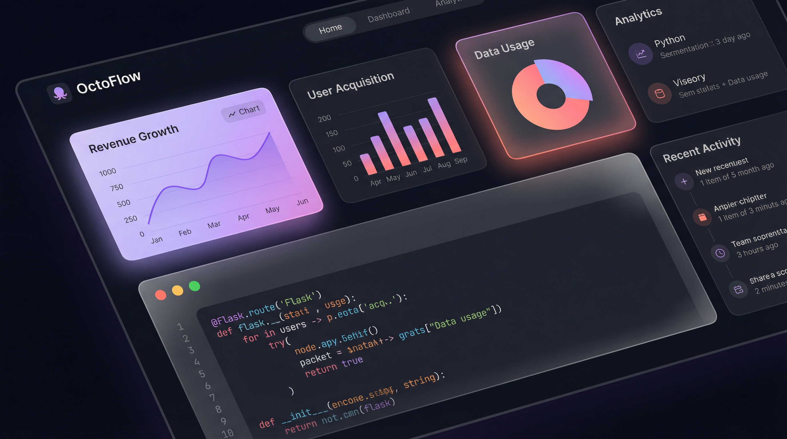
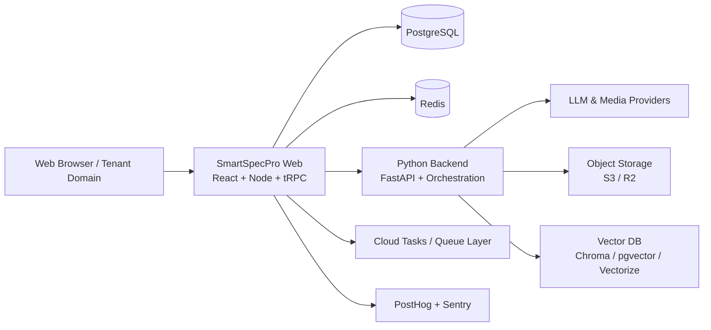

# SmartSpecPro Web

[](https://github.com/naibarn/SmartSpecPro/actions/workflows/ci.yml)
[](./LICENSE)
[](#alpha-release-notice)
[](https://turbo.build/repo)
[](https://nodejs.org/)
[](https://www.python.org/)

SmartSpecPro Web is an end-to-end AI productivity platform for teams that need more than a chat UI.  
It combines agent skills, media creation, presentation editing, document intelligence (RAG + vector search), and virtual workflow automation in one product.

Production showcase: [https://smartaihub.app](https://smartaihub.app)



## Alpha Release Notice

Current version status: **Alpha**.

- The platform is actively evolving and not feature-stable yet.
- Feature behavior, APIs, schemas, UI flows, and infrastructure defaults may change.
- Additional modules may be introduced before the Beta milestone.
- Breaking changes can happen between alpha updates.

If you plan to use SmartSpecPro in production during alpha, pin commits/tags and test upgrades in staging first.

## Table of Contents

- [Alpha Release Notice](#alpha-release-notice)
- [1. What This Project Delivers](#1-what-this-project-delivers)
- [2. Core Product Areas](#2-core-product-areas)
- [3. Architecture](#3-architecture)
- [4. Technology Stack](#4-technology-stack)
- [5. Repository Structure](#5-repository-structure)
- [6. Quick Start (Step-by-Step)](#6-quick-start-step-by-step)
- [7. Configuration](#7-configuration)
- [8. Recommended Hosting Specs](#8-recommended-hosting-specs)
- [9. Security and Operations](#9-security-and-operations)
- [10. Testing and Quality Gates](#10-testing-and-quality-gates)
- [11. Open Source Contribution Guide](#11-open-source-contribution-guide)
- [12. License](#12-license)

## 1. What This Project Delivers

SmartSpecPro Web is designed to be a complete open-source foundation for modern AI-first SaaS products.

It is built for:

- Product teams that need AI chat + automation + media workflows in one system.
- Organizations that need tenant/domain controls, auditability, and role-based administration.
- Builders who want a production-grade base that can be customized, rebranded, and extended.

## 2. Core Product Areas

### A. AI Chat With Embedded Skills

- Multi-conversation chat with memory context and conversation summaries.
- Slash-command and auto-detected skill execution from chat.
- Skill-specific settings, cost estimation, artifact outputs, and async skill task tracking.
- Built-in memory management (`entity memories`, context compaction, retrieval helpers).

Key modules:

- `apps/web/client/src/pages/Chat.tsx`
- `apps/web/server/routers/chat.ts`
- `apps/web/server/routers/memory.ts`

### B. Agent Skill Marketplace and Skill Lifecycle

- Public marketplace for discovering, filtering, liking, commenting, and sharing skills.
- Skill categories for image/video/audio/code/document/automation use cases.
- Admin + creator workflows: create, import, review, approve/reject, publish.
- Group sharing controls for enterprise/internal skill distribution.

Key modules:

- `apps/web/client/src/pages/Marketplace.tsx`
- `apps/web/server/routers/marketplace.ts`
- `apps/web/server/routers/skills.ts`
- `apps/web/server/routers/skillRepositories.ts`

### C. Media Studio (Image, Video, Audio)

- Unified generation workspace for image, video, and audio.
- Prompt enhancement, style/VFX controls, reference media support, model-specific dynamic inputs.
- Async task lifecycle: queue, poll status, cancel, fetch result, history, and credits estimation.
- Add generated outputs directly to the document library.

Key modules:

- `apps/web/client/src/pages/MediaStudio.tsx`
- `apps/web/server/routers/media.ts`
- `apps/web/server/services/mediaGenerationService.ts`
- `python-backend/app/api/v1/media_generation.py`

### D. Presentation Studio

- Presentation deck/slide management with a visual editor canvas.
- Asset attach/detach, templates, slide and deck audio tracks.
- Export pipeline with status tracking.
- Version history and point-in-time restore.

Key modules:

- `apps/web/client/src/pages/PresentationEditor.tsx`
- `apps/web/server/routers/presentation.ts`
- `apps/web/server/services/presentationService.ts`
- `apps/web/server/services/presentationExportService.ts`

### E. Document Management + RAG + Vector Search

- File upload, markdown editing, metadata management, sharing permissions.
- Trash and restore workflow with permanent delete controls.
- Version history and restore for document content.
- Federated and semantic-ready search pipeline.
- Google Drive and OneDrive connectors with indexing workflows.
- Vector DB configuration with provider switching and reindex controls.

Vector provider support:

- ChromaDB
- pgvector
- Cloudflare Vectorize

Key modules:

- `apps/web/client/src/pages/DocumentManagement.tsx`
- `apps/web/server/routers/library.ts`
- `apps/web/server/routers/googleDrive.ts`
- `apps/web/server/routers/oneDrive.ts`
- `apps/web/server/routers/systemSettings.ts`
- `python-backend/app/orchestrator/vector_store/`

### F. Virtual Workflow Automation

- Visual workflow builder (React Flow) with registry-driven node architecture.
- Compile, execute, monitor status, resume, and dead-letter reprocessing.
- Workflow templates and version history/restore.
- AI-assisted auto-generate and auto-edit.
- Workflow-to-skill conversion pipeline (`analyzeConversion` and `convertToSkill`).

Key modules:

- `apps/web/client/src/pages/WorkflowEditor.tsx`
- `apps/web/server/routers/workflow.ts`
- `python-backend/app/orchestrator/`

### G. Admin, Multi-Tenant, and Operations

- Admin domains: users, tenants, packages, providers, queues, services, security, audit.
- Domain admin dashboards and funnel analytics.
- Usage analytics, credit/billing controls, and budget policies.
- Health/readiness endpoints and infrastructure observability.

Key modules:

- `apps/web/client/src/pages/Admin*.tsx`
- `apps/web/server/routers/adminOps.ts`
- `apps/web/server/routers/audit.ts`
- `apps/web/server/routers/infrastructure.ts`
- `apps/web/server/services/scaleTier.ts`

## 3. Architecture



Design highlights:

- Single web app package hosts frontend and Node API in `apps/web`.
- Type-safe API layer via tRPC routers.
- Python backend handles heavy orchestration/media/vector operations.
- Queue-based execution model for background and long-running workloads.
- Storage abstraction supports local and cloud object backends.

## 4. Technology Stack

| Layer | Primary Tools |
| --- | --- |
| Frontend | React 19, Vite 7, Wouter, TanStack Query, Tailwind CSS, Radix UI, Framer Motion |
| Node API | Express, tRPC, Zod, Drizzle ORM, PostgreSQL, Redis |
| Python Services | FastAPI, Celery, orchestration modules, media pipelines |
| AI Integration | Multi-provider LLM routing, skill runtime, media model routing |
| Workflow | React Flow, registry-driven node system, execution state store |
| RAG / Search | ChromaDB, pgvector, Cloudflare Vectorize, indexing/reindex pipeline |
| Storage | Local filesystem, S3-compatible storage, Cloudflare R2 |
| Observability | Sentry, PostHog, audit logging, health probes |
| CI/CD | GitHub Actions (`ci`, staging deploy, production deploy, previews) |

## 5. Repository Structure

```text
SmartSpecPro/
|- apps/
|  |- web/                   # Main web product (client + server)
|  `- desktop/               # Desktop app (optional companion)
|- python-backend/           # FastAPI + orchestration + media engine
|- control-plane/            # Control plane services
|- docker-status/            # Infra/ops monitoring UI
|- packages/                 # Shared packages
|- docs/                     # Runbooks, launch, SLA, incident guides
|- docker-compose*.yml       # Infra and environment presets
`- run-services.sh           # Service lifecycle helper
```

## 6. Quick Start (Step-by-Step)

### Prerequisites

- Node.js 20+
- npm and pnpm
- Python 3.11+
- Docker + Docker Compose

### Option A: Full Docker-Based Development

1. Clone and enter the repository:

```bash
git clone https://github.com/naibarn/SmartSpecPro.git
cd SmartSpecPro
```

2. Create environment files:

```bash
cp .env.example .env
cp apps/web/.env.example apps/web/.env
cp python-backend/.env.example python-backend/.env
```

3. Start the stack:

```bash
docker compose -f docker-compose.dev.yml up -d
```

4. Open the app:

- Web: `http://localhost:3000`
- Python backend: `http://localhost:8001`
- Flower (if enabled): `http://localhost:5555`

### Option B: Hybrid Local Development (Faster Iteration)

1. Start infrastructure only:

```bash
docker compose up -d postgres redis chromadb
```

2. Install JavaScript dependencies:

```bash
npm install
cd apps/web && pnpm install && cd ../..
```

3. Run DB migration for web:

```bash
cd apps/web
pnpm db:push
cd ../..
```

4. Start web app:

```bash
cd apps/web
pnpm dev
```

5. Start Python backend (new terminal):

```bash
cd python-backend
pip install -r requirements.txt
uvicorn app.main:app --reload --host 0.0.0.0 --port 8000
```

## 7. Configuration

Minimum required variables for a usable setup:

| Area | Variables |
| --- | --- |
| Core auth | `JWT_SECRET`, `LLM_ENCRYPTION_KEY` |
| Database | `DATABASE_URL` |
| Cache/queues | `REDIS_URL` |
| API routing | `PYTHON_BACKEND_URL`, `OAUTH_SERVER_URL` |
| Storage | `STORAGE_TYPE`, `S3_*` or `R2_*` (optional for cloud storage) |
| AI providers | `OPENAI_API_KEY`, `ANTHROPIC_API_KEY`, `OPENROUTER_API_KEY`, etc. |
| Billing (optional) | `STRIPE_SECRET_KEY`, `STRIPE_WEBHOOK_SECRET` |
| Observability (optional) | `VITE_SENTRY_DSN`, `POSTHOG_API_KEY` |

Reference files:

- Root: `.env.example`
- Web: `apps/web/.env.example`
- Python: `python-backend/.env.example`

## 8. Recommended Hosting Specs

SmartSpecPro includes built-in scale tier profiles (`apps/web/server/services/scaleTier.ts`).

### Self-Hosted Baseline Tiers

| Tier | Target Concurrent Users | Recommended Host CPU | Recommended Host RAM |
| --- | --- | --- | --- |
| Starter | 50 | 4 vCPU | 8 GB |
| Growth | 100 | 8 vCPU | 16 GB |
| Pro | 200 | 12 vCPU | 32 GB |
| Business | 500 | 16 vCPU | 48 GB |
| Enterprise | 1000+ | 32 vCPU | 64 GB |

### Cloud Run-Oriented Reference (from internal tier presets)

| Tier | Node API | Python Orchestrator |
| --- | --- | --- |
| Growth | 1 vCPU / 1 GiB, 1-3 instances | 1 vCPU / 1 GiB, 1-3 instances |
| Pro | 2 vCPU / 1 GiB, 1-5 instances | 2 vCPU / 2 GiB, 1-4 instances |
| Business | 2 vCPU / 2 GiB, 2-8 instances | 2 vCPU / 2 GiB, 1-6 instances |
| Enterprise | 4 vCPU / 4 GiB, 3-15 instances | 4 vCPU / 4 GiB, 2-10 instances |

### Recommended Managed Services

- PostgreSQL: Neon or managed Postgres compatible with Drizzle/Alembic migrations.
- Redis: Upstash or managed Redis for queue and rate-limit workloads.
- Object storage: Cloudflare R2 or S3-compatible service.
- Vector store: pgvector (recommended for production) or Cloudflare Vectorize.
- Queueing: Google Cloud Tasks (supported in Node queue dispatch module).

## 9. Security and Operations

Security controls already present in the codebase:

- API key and sensitive setting encryption (`AES-256-GCM` pattern in service layer).
- CSRF origin checks for state-changing routes.
- Security headers (CSP, HSTS, X-Frame-Options, no-sniff).
- Role-based protected procedures (`protectedProcedure`, `adminProcedure`, domain-admin procedures).
- Audit logging and operational search endpoints.
- Readiness/liveness endpoints (`/healthz`, `/readyz`) for orchestrators.

Operational docs:

- `docs/launch-checklist.md`
- `docs/sla-targets.md`
- `docs/incident-response-plan.md`
- `docs/runbooks/`

## 10. Testing and Quality Gates

Web:

```bash
cd apps/web
pnpm check
pnpm test
pnpm test:coverage
```

Python:

```bash
cd python-backend
pytest
ruff check app/
```

Repository CI:

- Workflow file: `.github/workflows/ci.yml`
- Includes Python tests, web tests, coverage artifacts, and Turbo build/typecheck.

## 11. Open Source Contribution Guide

1. Fork this repository.
2. Create a feature branch.
3. Keep changes scoped and add/extend tests.
4. Run quality gates locally before opening a PR.
5. Open a PR with:
   - problem statement
   - architecture impact
   - testing evidence
   - migration notes (if schema/config changes)

Recommended first contribution areas:

- New workflow templates
- Additional marketplace skills
- New media model adapters
- RAG indexing/search improvements
- UI/UX enhancements in dashboard and editors

## 12. License

This project is released under the MIT License. See [LICENSE](./LICENSE).
