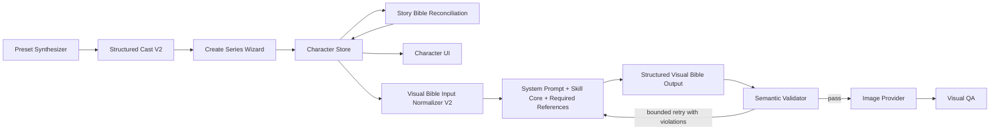

# Vertical Drama Character Narrative Role and Skill-First V2 Design

## Status

Approved direction: Approach A — additive canonical role fields, a versioned Visual Bible
contract, legacy normalization, and skill-owned final prompts.

## Problem Statement

The current character pipeline stores occupation, social function, and narrative importance
in one free-text `role` field. Examples such as `ซีอีโอหญิง` and
`อดีตทหารบอดี้การ์ด` reach the Character Visual Bible runtime without identifying whether
the character is the heroine, hero, antagonist, second lead, or supporting cast. Runtime
keyword inference consequently maps important characters to `other`, which weakens lead
design rules, archive comparisons, role readability, and prompt quality.

The Visual Bible skill is loaded, but its large instruction body is treated as a single
probabilistic prompt. Current schemas validate shape more strongly than behavior. A model
can therefore return a syntactically valid generic portrait while omitting a user request,
misreading the role, or drifting into a repeated stereotype. A later render-time marker
block attempts to repair this by appending the user's instruction outside the skill. That
block is visible in the UI, is not a natural image prompt, and violates the required
skill-first ownership boundary.

## Goals

1. Persist an authoritative narrative role from series creation onward.
2. Keep narrative role, visual subtype, occupation, and story description separate.
3. Let AI assign roles automatically while allowing users to edit them in the UI.
4. Display clear Thai role labels such as นางเอก, พระเอก, ตัวร้าย, and ตัวประกอบ.
5. Pass structured role, generation, continuity, and reference-lock facts into the Visual
   Bible skill without relying on array order or keyword inference.
6. Make the skill the sole author of every image-provider prompt.
7. Enforce role fit, user-request compliance, identity continuity, age safety, and
   anti-clone behavior with deterministic validation and bounded skill retries.
8. Upgrade the complete skill bundle and its fixtures, examples, schemas, help, tests, and
   verification script according to the supplied production-grade change specification.
9. Migrate existing projects conservatively without destroying current role text.

## Non-Goals

- Replacing image providers or changing credit accounting.
- Redesigning unrelated episode, video-prompt, or audio workflows.
- Guessing important roles silently when evidence is insufficient.
- Adding a second external prompt composer after the skill.

## Approved Architecture

The database owns facts, the skill owns creative prompt composition, and deterministic
code owns validation. Code may normalize legacy data and report validation failures, but
it must not add creative prose to a prompt returned by the skill.

## 1. Canonical Character Model

### 1.1 Separate role concepts

Add fields rather than repurposing the existing column immediately:

- `narrativeRole`: broad story function.
- `roleTier`: detailed role and life-stage subtype used by visual design.
- `occupation`: profession, status, or social function.
- `roleVisualIntent`: structured first impression, audience response, warning level,
  screen presence, emotional access, and prohibited reading.
- Existing `role`: retained during migration as a compatibility/display field. New code
  must not use it as the authoritative narrative-role source.

`narrativeRole` values:

- `protagonist`
- `co_protagonist`
- `antagonist`
- `secondary_lead`
- `supporting`
- `ensemble`
- `minor`

`roleTier` follows the production specification and includes gender-neutral leads, female
and male leads, child/teen leads, second leads, open and hidden antagonists, rivals,
parents, elders, students, interns, memorable support, background cast, same-person
variants, age-stage variants, twins, and `other`.

Shared enums, Thai labels, English labels, role grouping, age constraints, and legacy
aliases must live in one shared contract module. Server and client code consume this
module instead of maintaining separate keyword tables.

### 1.2 Authority and precedence

The durable character record is authoritative. Story Bible and Preset outputs are inputs
to that record, not alternate sources that may drift indefinitely. If Story Bible produces
a refined role, reconciliation updates the roster through an explicit rule:

1. Preserve a user-confirmed role.
2. Otherwise accept a valid structured AI role.
3. Never replace a known lead/antagonist with `other` or `minor` without explicit user
   action.
4. Record low-confidence classification as `needs_role_review`.

Variants and twins inherit narrative role only when they represent the same story person.
A distinct twin character receives its own role, with an optional suggested default.

### 1.3 Database and migration

Use an additive migration. Do not overwrite the old `role` value. Backfill in this order:

1. Existing structured Story Bible character facts.
2. Existing approved Character DNA or persisted role tier.
3. Character description, premise, and relationship facts through the structured role
   classifier contract.
4. Conservative legacy aliases as supporting evidence only.
5. `supporting`/`other` plus `needs_role_review=true` when confidence is insufficient.

The migration must be idempotent, tenant-scoped, observable, and safe to rerun. It must
not promote a character to protagonist from a weak occupation keyword.

## 2. Creation and Reconciliation Flow

### 2.1 Preset Synthesizer

Upgrade its character output from free-text `{name, role, description}` to a structured
cast object carrying at least `narrativeRole`, `roleTier`, `occupation`, age, description,
and confidence/evidence. Examples in the synthesizer skill must stop teaching occupational
text as the narrative role.

### 2.2 Create Series Wizard

Keep structured cast data in wizard state and submit it directly. A text representation
may remain for legacy display/import, but it cannot be the primary transport. The wizard
shows the canonical Thai role label and allows correction before creation.

### 2.3 Character seeding and Story Bible

Character seeding persists every structured field atomically. Story Bible output uses the
same shared enum and returns refinements with character IDs. Reconciliation writes valid
updates back to the durable character roster while respecting user-confirmed fields.

### 2.4 Other creation paths

Manual creation, update, variant, twin, and AI variant-planner routes use the same input
schema. They may request an AI suggestion, but the saved value is always a canonical enum.
No route may create a production character with an unvalidated narrative role.

## 3. Character UI

Each character card displays two distinct chips:

- Primary narrative chip: for example `นางเอก`, `พระเอก`, `ตัวร้ายชายแฝงตัว`,
  `พระรอง`, or `ตัวประกอบเด่น`.
- Secondary occupation/status chip: for example `ซีอีโอหญิง` or `บอดี้การ์ด`.

The character editor adds an accessible narrative-role selector grouped by leads,
antagonists, second leads, supporting cast, age/life stage, and variants. The selector
updates the durable record and displays an `AI กำหนด` or `ผู้ใช้ยืนยันแล้ว` state.

The generation area adds structured controls for framing, face direction, eye direction,
pose, expression, wardrobe, hairstyle, makeup, accessories, background, lighting, and a
free-form supplementary instruction. Reference controls expose purpose, reference type,
lock mode, lock strength, preserve fields, and allowed changes.

Warnings appear before generation for contradictory states such as full-appearance lock
with a new wardrobe request, face-and-hair lock with a hairstyle change, unsafe child
styling, hidden antagonist with overt villain cues, or a missing target in current cast.

## 4. Visual Bible Contract V2

### 4.1 Versioned input

Add `contract_version: 2` and require:

- `target_character`
- `character_design_context`
- `continuity_controls`
- `output_options`

Production mode requires a target character. Strict contract objects use
`additionalProperties: false`; optional extensions live under an explicit `extensions`
object. A V1 normalizer maps legacy inputs to V2 before validation.

`target_character` contains authoritative ID, name, narrative role, role tier, age,
occupation, class/world facts, emotional engine, attractive contradiction, narrative
promise, signature behavior, costume grammar, and prohibited drift.

`generation_request` contains structured visual choices and retains a bounded
`custom_instruction` for requirements that do not fit a dedicated field.

### 4.2 References and locks

Replace the ambiguous all-or-nothing reference behavior with `reference_assets` and
`reference_lock`:

- `face_identity_only`
- `face_and_hair`
- `face_hair_makeup`
- `full_appearance`
- `resemblance_only`
- `style_only`
- `custom`

Approved DNA separates immutable identity, semi-mutable identity, and mutable styling.
Legacy `has_own_reference_image` and `face_source_reference` remain accepted through the
normalizer and are marked deprecated.

### 4.3 Precedence

The skill and validator use this exact order:

1. Safety and age appropriateness.
2. Explicit target identity facts.
3. User-selected reference lock.
4. Approved immutable Character DNA.
5. Explicit generation request.
6. Role-specific design logic.
7. Series DNA and preset identity.
8. Creative interpretation.

Conflicts are never dropped silently. The output reports applied, reinterpreted, dropped,
and conflicting instructions.

## 5. Skill-First Prompt Ownership

The SmartSpec runtime uses lowercase `skill.md` as the canonical executable skill source,
because that is the application skill-pack convention and the file referenced by the
runtime bundle. Uppercase `SKILL.md` becomes a generated compatibility mirror and must be
byte-for-byte equivalent after frontmatter normalization; CI fails on drift. The loader
first loads `prompts/system.prompt.md` as the short non-negotiable system layer, then loads
the canonical `skill.md` core and the role/request-specific references selected by the
assembler. Tests prove the exact artifact paths and ordering.

Remove `buildCharacterRenderPrompt`, marker constants, and every
`VD_CHARACTER_CUSTOM_REQUIREMENTS` append path. Preview and generation consume the exact
natural prompt returned by the skill. Approved-preview generation may use the approved
skill output unchanged, but cannot decorate it afterward.

Every prompt type includes the required people count, role, age, identity anchors,
reference scope, face identity, emotional gaze, body language, requested framing,
wardrobe, hair, environment, camera/aspect ratio, continuity, and negative constraints.
Structured generation requests produce explicit required phrases where appropriate, such
as head-to-toe/no-cropped-feet for full body and both-eyes-visible/no-profile for a front
view.

If semantic validation fails, the runtime sends a compact machine-readable violation list
back to the same skill for at most two redesign attempts. The retry asks the skill to
rewrite its own output. No server-authored creative sentence is inserted into the final
provider prompt.

The Visual Bible route receives a model-family floor appropriate for a long structured
contract and role reasoning. Lite-family fallback is allowed only if it passes the same
behavioral gates; otherwise the request fails clearly before an image-provider call.

## 6. Role Intelligence and Diversity

Role rules define audience perception rather than fixed visual stereotypes. Leads require
screen presence, competence, vulnerability, emotional access, narrative promise, and an
attractive contradiction, but are not forced into a single face, light, wardrobe, or pose.
Hidden antagonists must read as credible and trustworthy first, with minimal visual
warning. Second leads must be attractive on a different axis from the primary lead.
Supporting characters follow the 70-20-10 world/personality/memory rule without competing
for protagonist emphasis. Child safety overrides every visual role directive.

Series DNA gains beauty realism, facial diversity, social and regional world, costume
world, chemistry pattern, and prohibited repetition. The signature registry tracks recent
face markers, hair, props, gestures, silhouettes, archetypes, role patterns, and chemistry
patterns. Similarity reporting covers both current cast and recent series.

The skill internally evaluates three directions: archetype-fit, contrast-first, and
unconventional-but-valid. Lead thresholds, instruction compliance, reference compliance,
uniqueness, and no-role-drift rules are enforced by output validation. A redesign may run
at most twice.

## 7. Output, Validation, and Visual QA

`character_design_dna` is mandatory and non-null. Keep legacy prompt strings additively
for current consumers while adding structured prompt objects and these reports:

- `instruction_resolution`
- `reference_lock_report`
- `role_readability`
- `similarity_risk`
- `image_qa_checklist`

Deterministic server-owned evidence remains normalized before creative validation. The
validator checks candidate count, score thresholds, role match, archive status, required
prompt semantics, reference scope, child safety, solo-person constraints, and immutable
DNA fingerprints.

After image generation, a visual-QA boundary evaluates identity consistency, role fit,
age fit, framing, wardrobe, hair, people count, and continuity. It returns pass, revise,
or reject with scores and a revision request. A revision request goes back through the
Visual Bible skill; it is never concatenated directly to the image prompt. Provider or QA
failure preserves the approved DNA and returns a clear retryable state.

## 8. Skill Bundle Structure

Keep the core runtime instructions concise and procedural. Move detailed role matrices,
reference-lock semantics, anti-clone rules, and example catalogs into directly linked
reference files. The runtime assembler loads only required references for the selected
role and request while always loading mandatory safety, precedence, contract, and prompt
ownership rules. This prevents a very large generic prompt from overpowering the current
character facts.

Update the full bundle:

- runtime skill file and system prompt
- input, output, and UI schemas
- input/output contract references
- Thai and English help
- fixtures and normalized fixtures
- at least 20 production examples from the supplied specification
- tests manifest
- verification script with JSON Schema and semantic assertions
- maintenance/reference documentation required by the runtime

No standalone README, changelog, or duplicate guide is added.

## 9. Failure Handling and Observability

- Invalid or missing target role fails before a paid image call.
- Low-confidence legacy classification is visible and user-correctable.
- Schema errors identify exact paths without exposing full prompts or private story text.
- Skill retry telemetry records contract version, role tier, violation codes, model
  family, attempt count, and outcome.
- Prompt provenance records the skill bundle/version and proves no external composer
  modified the provider prompt.
- Reference conflicts return structured warnings instead of silently ignoring input.
- Provider and QA failures remain retryable and never mutate approved identity facts.

## 10. Testing Strategy

### Contract and migration

- Empty V2 input fails.
- Missing target role or age fails.
- Unknown strict fields fail.
- Legacy V1 input normalizes deterministically.
- Existing role text is preserved while canonical fields are backfilled.
- Backfill is idempotent and ambiguous characters are marked for review.

### End-to-end role flow

- Preset structured role survives wizard serialization, creation, database read, Story
  Bible reconciliation, DTO mapping, UI editing, and Visual Bible input.
- A heroine with occupation `CEO` reaches the skill as `lead_female`, not `other`.
- User-confirmed role is not overwritten by later AI refinement.
- Manual, variant, twin, and age-stage routes obey the same contract.

### Skill behavior

- Character DNA, three-direction evidence, scores, and required reports are mandatory.
- Full-body, front-facing, wardrobe, hair, lighting, and background requirements occur in
  the skill-authored primary prompt.
- Face-only lock permits intentional hair/wardrobe changes.
- Full-appearance lock rejects conflicting changes.
- Hidden villains avoid overt villain coding.
- Leads are not forced into repeated soft/bright or suit/arms-crossed stereotypes.
- Children reject adult-glamour terms.
- Supporting characters do not receive unjustified lead-level presence.

### Prompt ownership and runtime

- Runtime loads the system prompt and active skill artifact.
- Mandatory sections cannot be truncated from the assembled request.
- Preview prompt equals the prompt submitted to the provider.
- No marker block or external creative suffix exists.
- Semantic failure causes a bounded skill retry and no provider call.
- Approved preview remains skill-authored and unchanged.

### UI and visual QA

- Thai role labels and occupation labels render separately.
- Role selector persists and round-trips canonical values.
- Conflict warnings are keyboard-accessible and readable on desktop and tablet.
- Visual QA catches identity, role, age, framing, people-count, wardrobe, and hair drift.

## 11. Rollout and Compatibility

1. Ship additive schema and shared contracts first.
2. Deploy readers that understand both V1 and V2.
3. Upgrade Preset, wizard, seeding, Story Bible, manual routes, UI, and Visual Bible input.
4. Run tenant-scoped idempotent backfill and surface review-required records.
5. Enable V2 skill output and semantic enforcement behind a reversible feature flag.
6. Compare prompt compliance, retry rate, latency, cost, and QA pass rate.
7. Remove the external marker composer only when skill-first parity tests pass; the final
   release must not retain both mechanisms.
8. Deprecate legacy input fields only after production consumers are verified.

Rollback disables V2 generation routing while preserving additive database fields and
backfilled values. No rollback deletes canonical role data.

## 12. Security and Cost Considerations

User free text and reference metadata remain untrusted data and are never treated as
system instructions. URLs and attachments use existing tenant authorization and media
access boundaries. Strict schemas limit injection and contract drift. Audit data excludes
full prompts and signed asset URLs.

The design adds no external service or dependency. A stronger planning model and bounded
skill retries may increase planning cost, while fewer failed image generations and better
first-pass compliance should reduce total media cost. Telemetry must make this trade-off
measurable.

## 13. Acceptance Criteria

The work is complete only when:

1. Every active character has a valid canonical narrative role or an explicit review
   state.
2. UI clearly distinguishes narrative role from occupation and allows role correction.
3. The exact canonical role reaches the Visual Bible V2 target character.
4. The skill bundle, schemas, runtime loader, fixtures, examples, tests, and verification
   script agree on one contract version.
5. Image-provider prompts are authored only by the skill and contain no external marker
   block or creative suffix.
6. Structured generation requests and reference-lock scopes are semantically enforced.
7. Character DNA, anti-clone, role readability, instruction resolution, and QA reports are
   present and valid.
8. Required lead, antagonist, second-lead, support, child, elder, twin, age-stage, and
   face-only/full-appearance reference tests pass.
9. Existing projects remain readable and retain their original role/occupation text.
10. Focused server, shared-contract, UI, migration, skill verification, type-check, and
    end-to-end tests pass without incorporating unrelated dirty-worktree changes.

## Alternatives Rejected

- Replacing the existing role column immediately is cleaner but creates a breaking
  migration and difficult rollback.
- Classifying role only at prompt-generation time leaves the result non-authoritative and
  inconsistent across calls.
- Keeping the external requirement block hides failures in the skill and violates prompt
  provenance.
- Relying on a larger model without schema and semantic enforcement improves probability
  but does not create a production guarantee.
