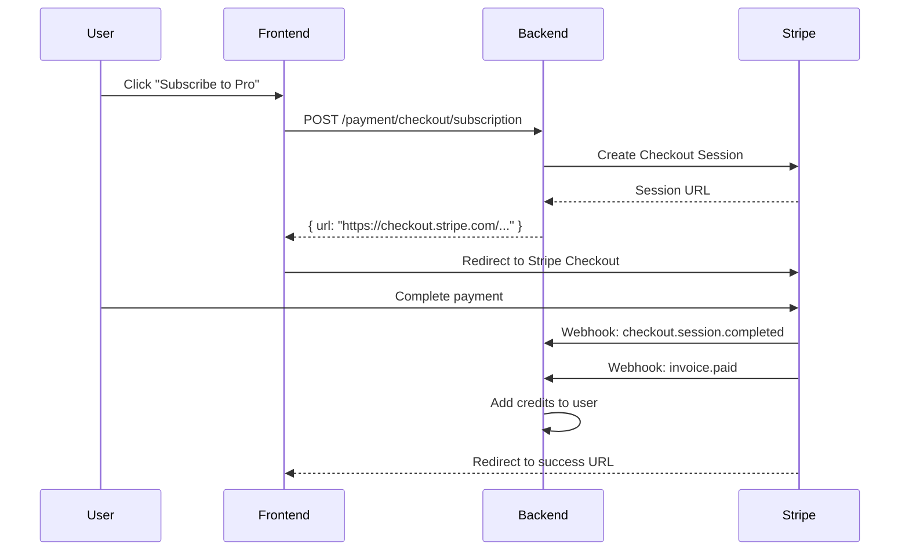
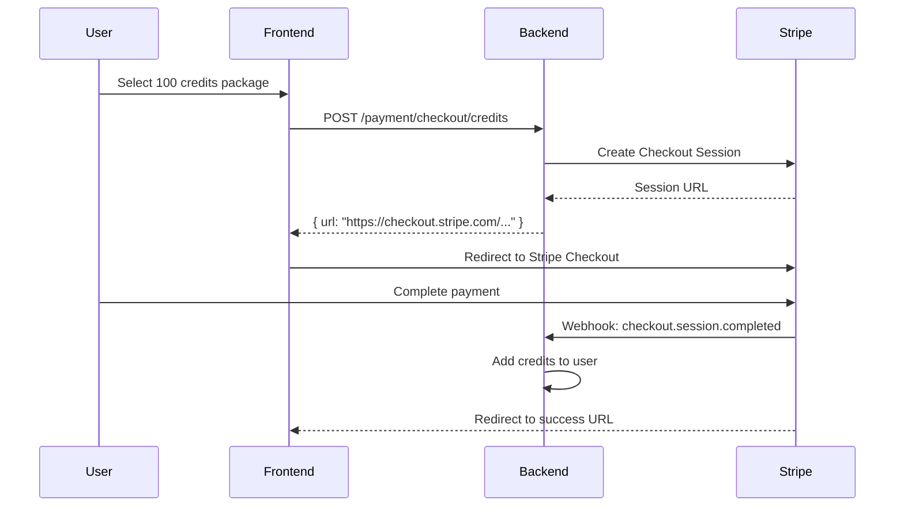

# SmartSpec Pro - Payment & Credits System Guide

## Overview

SmartSpec Pro ใช้ระบบ **Credits** สำหรับการใช้งาน AI Generation โดยมี Stripe เป็น Payment Provider หลัก

## Architecture

```
┌─────────────────────────────────────────────────────────────────┐
│                        Frontend (Desktop App)                    │
├─────────────────────────────────────────────────────────────────┤
│  CreditsDashboard  │  SubscriptionPlans  │  PaymentForm          │
│  TransactionHistory│                     │                       │
└─────────────────────────────────────────────────────────────────┘
                              │
                              ▼
┌─────────────────────────────────────────────────────────────────┐
│                        Backend API                               │
├─────────────────────────────────────────────────────────────────┤
│  /api/payment/*     │  /api/credits/*    │  /api/webhooks/*      │
└─────────────────────────────────────────────────────────────────┘
                              │
              ┌───────────────┼───────────────┐
              ▼               ▼               ▼
        ┌─────────┐    ┌───────────┐   ┌──────────────┐
        │ Stripe  │    │ PostgreSQL│   │ Cloudflare   │
        │   API   │    │  Database │   │     R2       │
        └─────────┘    └───────────┘   └──────────────┘
```

## Credits System

### Credit Costs

| Operation | Base Credits | Notes |
|-----------|--------------|-------|
| Image Generation | 1.0 | +50% for HD, +100% for 4K |
| Video Generation | 5.0 | +100% if duration > 5 seconds |
| Audio Generation | 0.5 | Per 30 seconds of audio |
| Storage | 0.01 | Per GB per month |

### Subscription Plans

| Plan | Monthly Credits | Price | Features |
|------|-----------------|-------|----------|
| **Free** | 10 | $0 | Image generation, Community support |
| **Pro** | 500 | $29/mo | All generation types, Priority queue, API access |
| **Enterprise** | 5,000 | $199/mo | Custom models, SLA, Dedicated support |

### Credit Packages (One-time Purchase)

| Package | Credits | Price | Bonus |
|---------|---------|-------|-------|
| Starter | 50 | $5 | - |
| Basic | 100 | $9 | +5 |
| Standard | 250 | $20 | +15 |
| Pro | 500 | $35 | +40 |
| Business | 1,000 | $60 | +100 |
| Enterprise | 5,000 | $250 | +750 |

## API Endpoints

### Payment Endpoints

```
GET  /api/payment/config
     - Get Stripe publishable key

POST /api/payment/checkout/subscription
     - Create subscription checkout session
     - Body: { plan: "pro", interval: "monthly" }

POST /api/payment/checkout/credits
     - Create credits purchase checkout session
     - Body: { credits_amount: 100 }

GET  /api/payment/subscription
     - Get current subscription details

POST /api/payment/subscription/cancel
     - Cancel subscription
     - Body: { subscription_id: "sub_xxx", at_period_end: true }

POST /api/payment/subscription/change-plan
     - Change subscription plan
     - Body: { subscription_id: "sub_xxx", new_plan: "enterprise" }

POST /api/payment/billing-portal
     - Create Stripe Billing Portal session
     - Body: { return_url: "https://..." }

GET  /api/payment/payment-methods
     - List saved payment methods

GET  /api/payment/invoices
     - Get invoice history
```

### Credits Endpoints

```
GET  /api/credits/balance
     - Get current credits balance

GET  /api/credits/transactions
     - Get transaction history
     - Query: ?page=1&limit=20&type=usage

GET  /api/credits/usage/summary
     - Get usage summary by type

GET  /api/credits/usage/daily
     - Get daily usage for charts

GET  /api/credits/usage/models
     - Get usage by AI model

GET  /api/credits/plans
     - Get available subscription plans
```

## Stripe Integration

### Environment Variables

```env
# Stripe API Keys
STRIPE_SECRET_KEY=sk_test_xxx
STRIPE_PUBLISHABLE_KEY=pk_test_xxx
STRIPE_WEBHOOK_SECRET=whsec_xxx

# Price IDs (create in Stripe Dashboard)
STRIPE_PRICE_PRO_MONTHLY=price_xxx
STRIPE_PRICE_PRO_YEARLY=price_xxx
STRIPE_PRICE_ENTERPRISE_MONTHLY=price_xxx
STRIPE_PRICE_ENTERPRISE_YEARLY=price_xxx
```

### Webhook Events

Configure webhook endpoint in Stripe Dashboard:
- URL: `https://your-domain.com/api/webhooks/stripe`
- Events to listen:
  - `checkout.session.completed`
  - `customer.subscription.created`
  - `customer.subscription.updated`
  - `customer.subscription.deleted`
  - `invoice.paid`
  - `invoice.payment_failed`
  - `payment_intent.succeeded`

### Payment Flow

#### Subscription Checkout



#### One-time Credits Purchase



## Cloudflare R2 Storage

### Configuration

```env
CLOUDFLARE_R2_ACCESS_KEY_ID=xxx
CLOUDFLARE_R2_SECRET_ACCESS_KEY=xxx
CLOUDFLARE_R2_BUCKET_NAME=smartspec-media
CLOUDFLARE_R2_ENDPOINT=https://account-id.r2.cloudflarestorage.com
CLOUDFLARE_R2_PUBLIC_URL=https://pub-xxx.r2.dev
```

### Usage

```python
from app.core.r2_config import get_r2_client

r2 = get_r2_client()

# Upload file
url = r2.upload_file(
    file_path="/path/to/image.png",
    key="generations/user123/image_001.png",
    content_type="image/png",
)

# Generate presigned URL
presigned_url = r2.generate_presigned_url(
    key="generations/user123/image_001.png",
    expires_in=3600,  # 1 hour
)

# Delete file
r2.delete_file("generations/user123/image_001.png")
```

## Frontend Components

### CreditsDashboard

Main dashboard showing:
- Available credits
- Usage statistics
- Daily usage chart
- Recent transactions

### SubscriptionPlans

Plan comparison and upgrade UI:
- Plan cards with features
- Monthly/yearly toggle
- Comparison table

### PaymentForm

Credit purchase form:
- Pre-defined packages
- Custom amount input
- Secure checkout

### TransactionHistory

Transaction list with:
- Filtering by type
- Search functionality
- Pagination
- Export option

## Security Considerations

1. **Webhook Verification**: Always verify Stripe webhook signatures
2. **Idempotency**: Handle duplicate webhook events gracefully
3. **Error Handling**: Log errors but return 200 to prevent retries
4. **PCI Compliance**: Never handle raw card data - use Stripe Checkout
5. **API Keys**: Store in environment variables, never in code

## Testing

### Test Cards (Stripe Test Mode)

| Card Number | Scenario |
|-------------|----------|
| 4242424242424242 | Successful payment |
| 4000000000000002 | Card declined |
| 4000000000009995 | Insufficient funds |
| 4000002500003155 | Requires authentication |

### Webhook Testing

Use Stripe CLI for local testing:

```bash
# Install Stripe CLI
brew install stripe/stripe-cli/stripe

# Login
stripe login

# Forward webhooks to local server
stripe listen --forward-to localhost:8000/api/webhooks/stripe
```

## Troubleshooting

### Common Issues

1. **Webhook signature verification failed**
   - Check `STRIPE_WEBHOOK_SECRET` is correct
   - Ensure raw request body is used for verification

2. **Credits not added after payment**
   - Check webhook logs in Stripe Dashboard
   - Verify `user_id` is in checkout session metadata

3. **Subscription not showing**
   - Check customer metadata has `user_id`
   - Verify subscription status is "active"

### Logs

Check application logs for:
- `Received Stripe webhook` - Webhook received
- `Checkout completed` - Payment successful
- `Subscription activated` - Subscription active
- `Credits fulfilled` - Credits added to user
