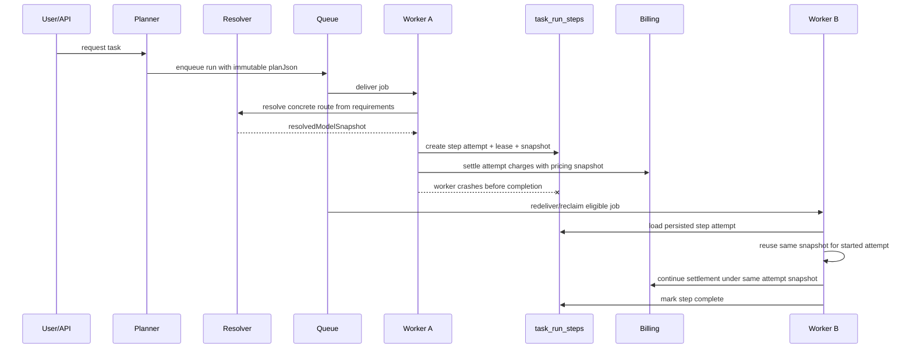

# 037 — Task-First Execution Intelligence & Autonomous Work Runtime

Version: 1.0
Date: 2026-03-11
Status: Proposed
Audience: Product, Architecture, Backend (Node + Python), Frontend, Billing
Depends on: Spec 027 (AgencySwarm), Spec 034 (AgencyResultEnvelope / ResultRouter), Spec 035 (Auto Draft & Content Automation Engine)

---

## 1. Executive summary

SmartSpecPro needs to evolve from a "chat-first" system into a **task-first execution platform**.

The old assumption was:

1. user chats with an LLM
2. the LLM replies with text
3. the system calls more tools, more skills, and more follow-up prompts
4. the user keeps steering until the work is done

That assumption is now incomplete.

Modern LLMs increasingly support:

- long context windows
- built-in tools such as web search, file search, code execution, and computer use
- background / asynchronous execution
- structured outputs
- multi-step work completion inside a single model-run loop
- better delegation / handoff patterns across specialized agents

This means many user requests should no longer be treated as "conversation turns". They should be treated as **work orders**:

- "create a finished presentation"
- "research and deliver a report with sources"
- "build a working website draft"
- "analyze these files and return a completed output artifact"

This spec proposes a new platform capability:

**Task-First Execution Intelligence**

The platform should:

1. infer what the user actually wants delivered
2. choose the right execution strategy automatically
3. choose the best enabled LLM model automatically, balancing capability and cost
4. use single-run completion when possible
5. escalate to tools, skills, agency-swarm, workflows, or sandbox execution only when necessary
6. return finished artifacts, not only conversational text
7. charge credits correctly for every LLM/tool/background step

This is not just "better model selection". It is a runtime shift:

- from `conversation model` to `task execution policy`
- from `skill defaultModel` to `capability-aware model routing`
- from `chat reply` to `artifact-producing execution`
- from `admin hardcoding every path` to `system-guided routing over enabled models and tools`

---

## 2. Why now

### 2.1 Market and model shift

Recent platform capabilities from major providers show a clear direction:

- OpenAI's Responses API positions responses as the main interface for conversations, tools, structured outputs, background execution, MCP, and computer use
- OpenAI's Agents SDK formalizes agent loops, handoffs, and guardrails as first-class runtime primitives
- Google's Gemini model line exposes million-token-class context, structured outputs, search grounding, code execution, and caching
- Anthropic's Claude tool-use stack supports web search, code execution, text editing, computer use, extended thinking, and model-specific tool guidance

The product implication is direct:

**the platform should optimize for "what work needs to be completed", not "which chat model did the user happen to select".**

### 2.2 Product implication for SmartSpecPro

SmartSpecPro already has multiple systems that can produce finished outputs:

- skills
- media generation
- AI draft / presentation generation
- AgencySwarm orchestration
- sandbox execution
- library / RAG / browser automation

But they are not yet unified behind a single runtime that decides:

- whether the task should be solved by one strong model run
- whether web search is required
- whether long context is required
- whether agency-swarm is required
- whether the result should be a deck, website, file bundle, report, or plain text

---

## 3. Background: current codebase state

### 3.1 What already exists

| Component | Current state | Notes |
|-----------|---------------|-------|
| LLM provider registry | `llm_providers` + `model_provider_map` | supports enabled providers, model mapping, pricing, context length |
| Multi-provider routing | `llmRouter.ts` | resolves provider candidates for a model |
| Responses API proxy | `apps/web/server/_core/responsesRoutes.ts` | supports web search/tool loops/background-compatible response flow |
| Skill registry | `packages/skills`, `skillRegistry.ts` | supports `llmModelId`, `preferredProviderId`, `strictProviderPin` |
| Chat skill execution | `apps/web/server/routers/chat.ts` | executes `llm-only`, `python`, and media skills |
| Structured LLM calls | `callLLMStructured.ts` | schema-validated LLM calls with credit deduction |
| AI presentation engine | `aiPresentationService.ts` | already creates real slide decks via a multi-phase pipeline |
| AgencySwarm | Spec 027 + Python services | already supports agent/swarm and tool orchestration |
| Agency orchestrator | `python-backend/app/services/agency_orchestrator.py` | already supports mixed graph execution above plain agents |
| Agency tool bridge | `python-backend/app/services/agency_tools.py` | already bridges internal tools, browser, web search, skill executor |
| Sandbox runtime | OpenSandbox integration | already supports secure code/browser/file/media execution |

### 3.2 What is missing

| Gap | Impact |
|-----|--------|
| No task-first runtime layer | chat, skill, draft, and agency execution are still separate entry paths |
| No unified model capability registry | the system knows context length, but not a normalized set of capabilities per model |
| No execution strategy planner | no central decision between direct completion, responses/tools, agency, workflow, or sandbox |
| No skill execution policy model | skills can pin a model, but cannot express nuanced routing policies |
| Chat skill path still behaves conversation-first | skill model can be overridden by conversation model in current routing |
| Responses route billing is not skill-aware | current source type is browser-oriented for some paths |
| No central artifact-oriented task contract | outputs are still fragmented across chat text, skills, presentation engine, and agency artifacts |
| No system-wide budget-aware auto model selection | user/admin still must know too much about models |

---

## 4. Problem statement

SmartSpecPro currently has three limitations that will become more severe as models improve:

### 4.1 Model selection is too manual

Users often know:

- what they want

But do not know:

- which model supports web search
- which model supports large context
- which model supports tool use well
- which model is overkill for the task
- which model is too weak for the task

Admins also cannot realistically hand-configure perfect routing for every future model and task class.

### 4.2 Execution strategy is too static

Today many flows are predetermined:

- chat = conversational completion
- `llm-only` skill = direct chat completion
- presentation draft = fixed multi-phase pipeline
- agency = explicit agency path

But future requests need dynamic choice:

- some tasks should finish in one strong model run
- some should use one model run plus built-in tools
- some should branch into existing draft/presentation pipelines
- some should escalate into agency-swarm only if the task truly needs decomposition

### 4.3 Billing will become fragile if runtime becomes smarter without a billing redesign

As soon as the runtime can:

- auto-switch models
- retry across providers
- use built-in web search
- invoke multiple agents
- move long tasks into background mode

the billing system must remain correct across:

- each model call
- each tool cost
- each retry/fallback attempt
- each structured sub-run
- each agency handoff

If billing is not centralized, SmartSpecPro will either undercharge, overcharge, or misclassify usage.

---

## 5. Goals

1. Introduce a **Task-First Execution Runtime** that chooses execution strategy based on the requested outcome, not only the UI entry point.
2. Introduce **capability-aware auto model selection** across enabled models.
3. Support **direct artifact completion** for tasks that can be finished by a strong model in one run or one model-managed tool loop.
4. Preserve and integrate existing systems: skills, AgencySwarm, AI Draft, sandbox, browser automation, RAG, and media generation.
5. Add **skill execution policies** so skills can express routing intent without forcing rigid hardcoded models.
6. Ensure **every LLM/tool/background step is billed correctly** and traceably.
7. Make the system robust when providers/models change over time.
8. Keep admin configuration useful but not mandatory for every task-routing decision.

---

## 6. Non-goals

1. Replacing AgencySwarm.
2. Replacing the existing AI draft / presentation engine.
3. Forcing all tasks into single-model execution.
4. Building vendor-specific logic paths in product code for every model family.
5. Letting the runtime silently use unlimited expensive models without budget controls.
6. Removing explicit user control completely; advanced users may still override policy where allowed.

---

## 7. Core principles

### 7.1 Task-first, not model-first

The user selects an outcome:

- report
- slides
- website
- code artifact
- media prompt
- workflow edit

The runtime selects:

- strategy
- model
- tools
- handoffs
- background mode

### 7.2 Strongest simple path wins

Prefer:

- one powerful model run that finishes the work

Over:

- many small orchestrated calls

Unless the orchestrated path is materially safer, cheaper, or more reliable.

### 7.3 Escalate only when necessary

Use the lightest path that can satisfy the task:

1. direct completion
2. direct completion with built-in tools
3. direct completion with internal function tools
4. specialized skill
5. existing deterministic pipeline
6. agency-swarm
7. workflow/sandbox-heavy execution

### 7.4 Capability and cost must be balanced together

The runtime should not always choose the strongest model.

It should choose the **lowest-cost enabled option that is likely to succeed** within policy.

### 7.5 Billing is part of runtime correctness

Execution is not correct if credits are not tracked correctly.

---

## 8. Proposed architecture

### 8.1 New runtime layer

Add a new platform service:

`TaskExecutionPlanner`

Responsibilities:

1. interpret user intent
2. estimate task complexity and artifact target
3. inspect enabled model capabilities
4. inspect skill/agency/tool options
5. choose execution strategy
6. choose effective model(s)
7. emit a normalized execution plan

### 8.2 New runtime output

Every planned execution should be represented as a normalized structure:

```ts
type ModelRequirements = {
  reasoningTier?: "low" | "medium" | "high" | "frontier";
  minContextWindow?: number | null;
  needsVision?: boolean;
  needsStructuredOutput?: boolean;
  supportsTools?: boolean;
  supportsWebSearch?: boolean;
  supportsCodeExecution?: boolean;
  maxLatencyMs?: number | null;
  maxCostUsd?: number | null;
  reliabilityTier?: "best_effort" | "balanced" | "reliable" | "mission_critical";
  preferredProfiles?: Array<"cheap" | "balanced" | "reliable" | "premium">;
  allowedFallbackProfiles?: Array<"cheap" | "balanced" | "reliable" | "premium">;
  disallowedModels?: string[];
};

type ResolvedModelSnapshot = {
  provider: string;
  providerRouteId: number;
  model: string;
  profile: "cheap" | "balanced" | "reliable" | "premium";
  selectorVersion: string;
  catalogSnapshotVersion: string;
  capabilitySnapshotVersion: string;
  pricingVersion: string;
  pricingSource: string;
  usdToCreditsRateSnapshot: string;
  minimumChargeApplied: boolean;
  estimatedMaxCharge?: number | null;
  resolvedAt: string;
  reason:
    | "matched_requirements"
    | "tenant_override"
    | "system_override"
    | "run_override"
    | "fixed_policy"
    | "hybrid_policy"
    | "fallback_timeout"
    | "fallback_provider_outage"
    | "fallback_schema_failure"
    | "fallback_budget_policy"
    | "fallback_quality_escalation";
  immutableScope: "step_attempt";
};

type TaskExecutionPlan = {
  planVersion: string;
  plannerVersion: string;
  taskType:
    | "chat_reply"
    | "research_report"
    | "presentation_deck"
    | "website_build"
    | "workflow_edit"
    | "document_analysis"
    | "media_prompt"
    | "code_artifact";

  strategy:
    | "direct_completion"
    | "responses_with_builtin_tools"
    | "responses_with_internal_tools"
    | "skill_execution"
    | "deterministic_pipeline"
    | "agency_swarm"
    | "sandbox_execution";

  modelSelectionMode: "requirements" | "fixed" | "hybrid";
  modelRequirements: ModelRequirements;
  preferredProviderId?: number | null;
  plannedCapabilities: string[];
  plannedTools: string[];
  usedSkillSlug?: string | null;
  usedAgencyId?: string | null;
  requiresBackground: boolean;
  expectedArtifacts: string[];
  routeReason: string;
  precedenceWinner:
    | "system_policy"
    | "tenant_policy"
    | "run_override"
    | "entrypoint_contract"
    | "skill_or_agency_policy"
    | "planner_auto"
    | "conversation_default"
    | "global_fallback";
  routeMode: "explicit" | "policy" | "automatic";
  approvalPolicy: {
    mode: "none" | "tenant_preapproved" | "user_preapproved" | "prompt_user";
    scope: "read_only" | "tool_use" | "browser" | "sandbox" | "external_side_effect";
    escalationThreshold?: "same_profile" | "higher_profile" | "higher_budget_band" | "any_new_attempt";
  };
  estimatedCredits?: number | null;
  reservationPolicy?: "estimate_only" | "soft_reserve" | "hard_stop" | "degrade" | "ask_user";
  reservationUpperBound?: number | null;
  budgetClass: "cheap" | "balanced" | "quality_first";
};
```

This plan becomes the canonical bridge between:

- chat
- skills
- agency
- presentation
- billing
- audit

`preferredProviderId` is an optional routing hint only.

It must not be treated as a partial provider lock when:

- tenant or system policy disallows that route
- the hinted provider does not satisfy capability requirements
- route health or approval policy requires a different choice

### 8.2.1 Example TaskExecutionPlan

Example for a user request such as:

- "Research current competitors and return a finished slide deck"

```json
{
  "planVersion": "2026-03-11.2",
  "plannerVersion": "task-planner-v1",
  "taskType": "presentation_deck",
  "strategy": "deterministic_pipeline",
  "modelSelectionMode": "requirements",
  "modelRequirements": {
    "reasoningTier": "high",
    "minContextWindow": 64000,
    "needsStructuredOutput": true,
    "supportsTools": true,
    "supportsWebSearch": true,
    "preferredProfiles": ["balanced", "reliable"],
    "allowedFallbackProfiles": ["premium"],
    "maxCostUsd": 0.08,
    "reliabilityTier": "reliable"
  },
  "preferredProviderId": 3,
  "plannedCapabilities": ["web_search", "structured_outputs", "long_context"],
  "plannedTools": ["responses.web_search", "presentation.generateAIDraft"],
  "usedSkillSlug": null,
  "usedAgencyId": null,
  "requiresBackground": true,
  "expectedArtifacts": ["deck", "citations"],
  "routeReason": "Task requests a finished research-backed deck; deterministic presentation pipeline offers higher artifact reliability than free-form completion.",
  "precedenceWinner": "planner_auto",
  "routeMode": "automatic",
  "approvalPolicy": {
    "mode": "none",
    "scope": "read_only",
    "escalationThreshold": "higher_profile"
  },
  "estimatedCredits": 180,
  "reservationPolicy": "soft_reserve",
  "reservationUpperBound": 240,
  "budgetClass": "balanced"
}
```

This example is illustrative. Production plans may include additional execution metadata, but every runtime path should normalize into this shape.

### 8.2.2 Example ResolvedModelSnapshot

Execution-time step-attempt state should persist the concrete route separately from the immutable plan:

```json
{
  "provider": "openai",
  "providerRouteId": 42,
  "model": "gpt-5.2",
  "profile": "balanced",
  "selectorVersion": "2026-03-11.1",
  "catalogSnapshotVersion": "catalog-2026-03-11T10:14:00Z",
  "capabilitySnapshotVersion": "caps-2026-03-11T10:14:00Z",
  "pricingVersion": "2026-03-01",
  "pricingSource": "internal_catalog",
  "usdToCreditsRateSnapshot": "tenant-rate-v12",
  "minimumChargeApplied": false,
  "estimatedMaxCharge": 0.08,
  "resolvedAt": "2026-03-11T10:15:00Z",
  "reason": "matched_requirements",
  "immutableScope": "step_attempt"
}
```

### 8.2.3 Example TaskExecutionPlan for `website_build`

Example for a user request such as:

- "Build me a landing page for this product and return a deployable bundle"

```json
{
  "planVersion": "2026-03-11.2",
  "plannerVersion": "task-planner-v1",
  "taskType": "website_build",
  "strategy": "responses_with_internal_tools",
  "modelSelectionMode": "requirements",
  "modelRequirements": {
    "reasoningTier": "medium",
    "minContextWindow": 32000,
    "needsStructuredOutput": true,
    "supportsTools": true,
    "preferredProfiles": ["balanced"],
    "allowedFallbackProfiles": ["reliable", "premium"],
    "maxCostUsd": 0.06,
    "reliabilityTier": "balanced"
  },
  "preferredProviderId": null,
  "plannedCapabilities": ["structured_outputs", "tool_use"],
  "plannedTools": ["website.bundle_builder", "artifact.save_bundle"],
  "usedSkillSlug": null,
  "usedAgencyId": null,
  "requiresBackground": true,
  "expectedArtifacts": ["website_bundle", "preview_manifest"],
  "routeReason": "Task requests a finished website artifact; internal tools can produce a deployable bundle without agency decomposition.",
  "precedenceWinner": "planner_auto",
  "routeMode": "automatic",
  "approvalPolicy": {
    "mode": "prompt_user",
    "scope": "external_side_effect",
    "escalationThreshold": "higher_budget_band"
  },
  "estimatedCredits": 120,
  "reservationPolicy": "soft_reserve",
  "reservationUpperBound": 180,
  "budgetClass": "balanced"
}
```

### 8.2.4 Example TaskExecutionPlan for `agency_swarm`

Example for a user request such as:

- "Research this market, propose positioning, and return a finished launch brief with citations and a website draft"

```json
{
  "planVersion": "2026-03-11.2",
  "plannerVersion": "task-planner-v1",
  "taskType": "research_report",
  "strategy": "agency_swarm",
  "modelSelectionMode": "requirements",
  "modelRequirements": {
    "reasoningTier": "high",
    "minContextWindow": 128000,
    "needsStructuredOutput": true,
    "supportsTools": true,
    "supportsWebSearch": true,
    "preferredProfiles": ["reliable", "premium"],
    "allowedFallbackProfiles": ["premium"],
    "maxCostUsd": 0.18,
    "reliabilityTier": "reliable"
  },
  "preferredProviderId": null,
  "plannedCapabilities": ["web_search", "structured_outputs", "tool_use", "multi_artifact_coordination"],
  "plannedTools": ["responses.web_search", "artifact.save_report", "website.bundle_builder"],
  "usedSkillSlug": null,
  "usedAgencyId": "market-launch-agency",
  "requiresBackground": true,
  "expectedArtifacts": ["research_report", "website_bundle"],
  "routeReason": "Task benefits from decomposition across research, synthesis, and artifact production roles with coordinated review.",
  "precedenceWinner": "planner_auto",
  "routeMode": "automatic",
  "approvalPolicy": {
    "mode": "prompt_user",
    "scope": "external_side_effect",
    "escalationThreshold": "higher_budget_band"
  },
  "estimatedCredits": 260,
  "reservationPolicy": "soft_reserve",
  "reservationUpperBound": 360,
  "budgetClass": "quality_first"
}
```

### 8.2.5 Plan versioning rule

Because `TaskExecutionPlan` is persisted into run state, every plan must carry:

- `planVersion`
- `plannerVersion`

Compatibility rule:

- workers may execute older plan versions only if they explicitly support them
- resume/retry must not silently reinterpret an old stored plan using a new incompatible shape

If a worker cannot safely execute the stored plan version, it must not guess.

Recommended first-wave behavior:

- move the run into a terminal or operator-visible failure state such as `failed` with a machine-readable incompatibility code
- record that the failure was due to unsupported `planVersion`
- require either:
  - explicit plan regeneration
  - or an explicit migration path that writes a new plan version as a separate audited action

Silent in-place mutation of the old plan to "make it work" should be forbidden.

### 8.2.6 Plan mutability contract

`task_runs.planJson` should be treated as the immutable execution-intent document for the run.

Recommended rule:

- planning writes intent-level fields such as:
  - `taskType`
  - `strategy`
  - `modelSelectionMode`
  - `modelRequirements`
  - precedence/approval/reservation intent
- fields named `planned*` describe intended capabilities/tools, not observed runtime usage
- execution must not rewrite the stored intent contract in-place once the run starts
- execution-time enrichments should be written into step-attempt records and billing records

If the system needs to record execution-time additions at run scope, it should do so in:

- explicit sibling fields on `task_runs`
- or an append-only execution metadata structure

not by silently mutating the original plan contract in a way that changes replay/resume semantics.

### 8.3 Execution strategies

#### Strategy A — `direct_completion`

Use when:

- task is self-contained
- no web freshness required
- no external tools required
- one model can produce the final output directly

Examples:

- translation
- summarization
- simple product review
- simple slide outline
- one-shot code scaffold

#### Strategy B — `responses_with_builtin_tools`

Use when:

- a single model can likely finish the task if given built-in tools
- task may need web search, code execution, file search, or computer use
- the model can manage the loop internally

Examples:

- up-to-date research brief
- analyze files + produce report
- browse, gather evidence, and return a sourced answer
- execute code or edit files within a model-managed loop

#### Strategy C — `responses_with_internal_tools`

Use when:

- a strong model should orchestrate internal SmartSpecPro tools directly
- internal tools are enough to finish the work

Examples:

- create presentation deck via internal presentation tool
- call internal website scaffold tool
- call RAG + skill + artifact save tool in one model-managed run

#### Strategy D — `skill_execution`

Use when:

- a specialized skill already expresses the task best
- the skill is more reliable than generic planning
- output format is bounded

Examples:

- prompt engineering skills
- reviewer/writer skills
- workflow editor skill

#### Strategy E — `deterministic_pipeline`

Use when:

- an existing production pipeline already provides stronger guarantees than free-form agenting

Examples:

- `generateAIDraft()` for presentation decks
- media generation pipelines
- import/export flows

#### Strategy F — `agency_swarm`

Use when:

- the task genuinely benefits from decomposition, delegation, role separation, or multi-branch reasoning
- multiple tools / skills / retrieval passes are needed
- result quality depends on planning + coordination, not only one strong completion

Examples:

- deep research across multiple sources and artifact types
- multi-role project generation
- complex website/app generation with planning, implementation, and review roles

#### Strategy G — `sandbox_execution`

Use when:

- the task requires secure code or browser execution outside the model-managed built-in tools
- system policy requires isolation

Examples:

- privileged browser workflows
- file transformation
- custom code generation + verification inside sandbox

---

## 9. Model Intelligence Layer

### 9.1 New capability model

Current model registry already knows:

- canonical model ID
- provider-route mapping
- price
- context length

It must be extended to know normalized capability flags such as:

```ts
type ModelRouteCapability = {
  modelId: string;
  providerId: number;
  providerModelId: string;
  apiStyle: "chat-completions" | "responses" | string;
  supportsResponses: boolean;
  supportsStructuredOutputs: boolean;
  supportsWebSearch: boolean;
  supportsFileSearch: boolean;
  supportsFunctionTools: boolean;
  supportsCodeExecution: boolean;
  supportsComputerUse: boolean;
  supportsVision: boolean;
  supportsBackground: boolean;
  supportsPromptCaching: boolean;
  supportsLongContext: boolean;
  maxContextTokens: number | null;
  qualityTier: "small" | "standard" | "strong" | "frontier";
  costTier: "free" | "low" | "medium" | "high";
  latencyTier: "fast" | "balanced" | "slow";
};
```

### 9.1.1 Canonical model vs provider-route capability

The planner must distinguish between:

- **canonical model preference**
  - "I prefer Claude Sonnet class quality for this task"
- **provider-route capability**
  - "this enabled provider route for this model supports Responses, background mode, and computer use"

This distinction is critical because many modern capabilities are not just properties of a model family. They are properties of:

- provider
- endpoint style
- account configuration
- beta feature exposure

Therefore:

- planner-facing capability checks must be evaluated at the `model_provider_map` route level
- a canonical model may map to multiple provider routes with different capabilities
- the planner may prefer a canonical model first, then choose the best enabled provider route that satisfies the required capability set

### 9.2 Where capability data should live

Preferred design:

- keep provider/model mapping in `model_provider_map`
- add normalized capability metadata either:
  - as new columns where stable and queryable
  - or as a structured JSON capability block with validated normalization rules

Recommendation:

- stable query-critical fields as columns
  - `contextLength`
  - `supportsResponses`
  - `supportsStructuredOutputs`
  - `supportsWebSearch`
  - `supportsFunctionTools`
  - `supportsCodeExecution`
  - `supportsComputerUse`
  - `supportsBackground`
- richer hints as JSON
  - `notes`
  - `betaHeaders`
  - `vendorCapabilitySource`

Minimum additional route-level fields recommended:

- `supportsResponses`
- `supportsBackground`
- `supportsWebSearch`
- `supportsFunctionTools`
- `supportsCodeExecution`
- `supportsComputerUse`
- `supportsStructuredOutputs`
- `capabilityVersion`
- `capabilityLastVerifiedAt`

### 9.3 Capability source of truth

Capability metadata should be refreshed from:

1. admin-maintained overrides
2. provider sync/import metadata
3. code-maintained normalizers

The system must support:

- vendor docs changing
- beta capabilities appearing/disappearing
- models being enabled/disabled at runtime

---

## 10. Skill execution policy redesign

### 10.1 Problem

Today skills can express:

- `defaultModel`
- `llmModelId`
- `preferredProviderId`
- `strictProviderPin`

This is too rigid for future runtime needs.

### 10.2 Capability-first skill policy model

Add optional policy fields to skill metadata / DB:

```yaml
execution_policy:
  mode: requirements | fixed | hybrid
  allow_conversation_override: false
  preferred_strategy: direct_completion | responses_with_builtin_tools | agency_swarm | deterministic_pipeline
  requirements:
    reasoning_tier: medium
    min_context_window: 64000
    needs_structured_output: true
    supports_tools: true
    supports_web_search: false
    max_latency_ms: 12000
    max_cost_usd: 0.08
    reliability_tier: balanced
  preferred_profiles:
    - balanced
    - reliable
  allowed_fallback_profiles:
    - premium
  disallowed_models:
    - legacy-x
  budget_class: balanced
  overrideable_by_tenant: true
  fallback_policy:
    max_model_escalations: 2
    allow_provider_failover: true
    timeout_action: degrade
    provider_outage_action: resolve_new_route
    schema_failure_action: retry_same_snapshot_then_escalate
  fixed_model:
    model: null
    provider: null
```

Guiding rule:

- skills should declare intent, capability needs, and budget/reliability shape
- runtime should resolve the concrete model
- fixed model names should be the exception, not the default

### 10.3 Policy modes

#### `requirements`

Skill declares capability/budget requirements only.

Good for:

- general-purpose skills
- environments with multiple providers
- long-lived skills that should survive model churn

#### `fixed`

Always use the configured model/pin.

Good for:

- tightly tuned skills
- compliance-sensitive paths
- vendor-specific media prompt behavior

#### `hybrid`

Skill primarily declares requirements, but may pin a specific model for one narrow path.

Good for:

- important production skills
- presentation and research skills
- tasks with one compliance-sensitive branch

### 10.4 Resolution timing and immutability

Recommended lifecycle:

1. planning stores capability requirements, preferred profiles, and budget envelope
2. execution resolves a concrete provider route and model
3. when a step attempt starts, the resolved snapshot becomes immutable for that attempt

This gives the system:

- flexibility when catalog/provider availability changes
- reproducibility for retry and resume
- correct billing and audit

### 10.5 What must be snapshotted

At minimum, every started step attempt must persist:

- resolved provider
- resolved model
- selected profile
- selector version
- pricing version
- pricing source
- USD-to-credit rate snapshot
- minimum charge behavior
- resolution reason
- immutable scope

### 10.6 Tenant override and allow/block rules

Skill policy must remain subordinate to:

- system safety policy
- tenant/org allowlists and blocklists
- explicit approved run overrides

A skill may prefer a capability profile, but must not force a route blocked by tenant or system policy.

### 10.7 Immediate chat fix

As a prerequisite, skill invocation from chat must stop letting `conversation.model` override the skill policy by default.

Rule:

- direct chat message: conversation model applies
- skill invocation: skill execution policy applies

This is required before higher-level auto-routing can be trusted.

---

## 11. Entrypoint precedence and override rules

### 11.1 Why precedence must be explicit

Task-first routing must not create ambiguity between:

- explicit user choices
- explicit admin-enforced policy
- skill policy
- agency policy
- automatic planner decisions

Without a precedence matrix, rollout will create regressions and inconsistent behavior between chat, skills, agencies, and deterministic pipelines.

### 11.2 Precedence order

Recommended precedence from highest to lowest:

1. **system safety / compliance policy**
   - provider deny rules
   - sandbox-required policy
   - approval-required policy
2. **tenant / organization policy**
   - model allowlists
   - model blocklists
   - budget and approval policy
3. **explicit run override**
   - force model profile
   - force strategy
   - disable auto mode
4. **explicit entrypoint contract**
   - explicit skill invocation
   - explicit agency invocation
   - explicit draft/presentation flow
5. **skill or agency execution policy**
6. **planner automatic decision**
7. **conversation default model**
8. **global fallback default**

### 11.3 Required entrypoint rules

#### Direct chat

- Default: planner may run in lightweight mode
- If no task/artifact intent is detected, use normal conversation behavior

#### Explicit skill invocation

- Skill execution policy applies
- Conversation model must not override unless the skill policy explicitly permits it

#### Explicit agency invocation

- Agency entry contract applies first
- Planner may still choose model/budget envelope inside the agency run unless the agency is explicitly pinned

#### Explicit deterministic flow

- Existing presentation/draft/workflow flows may bypass planner strategy selection if the UI contract requires the deterministic path
- Planner may still supply model and budget hints where the deterministic flow accepts them

### 11.4 Override semantics

Every run should record:

- whether route/model was explicit or automatic
- which layer won the precedence decision
- which higher-priority layers suppressed lower-priority options
- whether a tenant/system rule forced a different resolved route than the skill originally preferred

This must be written into runtime telemetry and `task_runs.planJson`.

---

## 12. Task planning and model selection algorithm

### 12.1 Inputs

The planner should consider:

- user message
- attachments / files / images / URLs
- invoked skill
- invoked agency
- expected output type
- tenant/admin policy
- enabled models
- provider health
- model capabilities
- cost/budget policy

### 12.2 Planning stages

#### Stage 1 — Infer requested outcome

Infer:

- target artifact
- freshness requirement
- likely need for tools
- need for large context
- need for decomposition

#### Stage 2 — Estimate complexity

Complexity buckets:

- `simple`
- `moderate`
- `high`
- `orchestrated`

Signals:

- prompt length
- file count and token estimate
- multi-artifact output
- explicit request for latest/current research
- required browsing or code execution
- request for finished deliverable

#### Stage 3 — Candidate strategy selection

Generate candidate strategies ordered from simplest to strongest:

1. direct completion
2. responses with built-in tools
3. skill execution
4. deterministic pipeline
5. agency swarm
6. sandbox-heavy path

#### Stage 4 — Candidate model filtering

From enabled models only, filter by:

- required capabilities
- context window
- provider health
- tenant policy
- route compatibility

#### Stage 5 — Scoring

Score by:

- success likelihood
- cost
- latency
- artifact reliability
- route maturity

#### Stage 6 — Plan selection

Pick the best-scoring plan.

### 12.3 Scoring principle

Recommended weighted logic:

`score = success_weight - cost_penalty - latency_penalty + route_fit_bonus + artifact_reliability_bonus`

Default bias:

- prefer cheaper model if success likelihood remains above threshold
- prefer deterministic pipeline over free-form agentic path when artifact fidelity matters
- prefer one strong model run over agency decomposition for bounded tasks

### 12.4 Model resolver contract

The planner should not bind a model name too early.

Recommended split:

- planning resolves `taskType`, `strategy`, `modelRequirements`, budget class, and fallback envelope
- execution resolves the concrete provider route and model for the step attempt

Resolver inputs:

- `modelRequirements`
- enabled provider-route catalog
- tenant/system policy
- route health
- current budget envelope
- runtime needs for the chosen strategy

Resolver outputs:

- `resolvedModelSnapshot`
- `resolutionReason`

Resolver determinism rule:

- given the same requirement set, policy inputs, and compatible catalog snapshot, the resolver should produce the same route decision
- if any of those inputs differ, the new snapshot must record why the result changed
- the snapshot must include catalog/capability snapshot identifiers so replay and audit can explain why a later resolution differs

Catalog snapshot retention rule:

- the identifiers recorded in `ResolvedModelSnapshot` must refer to durable stored snapshots, not ephemeral cache keys
- the system must retain enough catalog/capability snapshot history to explain billing and routing for any task still within audit or dispute windows
- if historical snapshot payloads are pruned, the system must at minimum retain immutable summaries sufficient to explain:
  - enabled route set
  - capability flags
  - pricing source/version
  - tenant-visibility constraints

### 12.5 Retry, resume, and fallback semantics

Rules to lock in:

- retry inside the same step attempt:
  - use the same `resolvedModelSnapshot`
- new attempt created by fallback policy:
  - may resolve a new model/route
  - must persist a new snapshot and reason
- resume of an old run:
  - if the step already started, reuse the existing snapshot
  - if the step did not start, execution may resolve again under current compatible policy

Fallback policies should distinguish:

- timeout
- provider outage
- schema / structured output failure
- budget exhaustion
- explicit quality escalation

Approval timing rule:

- if a fallback or escalation could cross a higher budget/profile threshold, the system should first resolve the candidate route
- then compare the resolved snapshot against approval and budget policy
- if the resolved route requires approval, execution must move to `waiting_approval` before that new attempt starts
- the already-started attempt keeps its original immutable snapshot

### 12.6 Anti-loop and escalation guardrails

The runtime must prevent routing loops such as:

- skill -> planner -> same skill -> planner
- model A -> model B -> model A
- repeated premium escalation without a terminal condition

Recommended controls:

- `attemptedModels[]`
- `visitedStrategies[]`
- `visitedSkillSlugs[]`
- `maxModelEscalations`
- `maxPlanningDepth`

Same-skill re-entry should be disallowed unless an explicit contract permits it.

### 12.7 Optional planner-judge model

The first version should rely mostly on heuristics plus policy.

An optional future step may use a cheap planner model to compare candidate plans when ambiguity is high.

Important billing rule:

- if planner-judge is used, it is billable and must be recorded as planner overhead

---

## 13. Direct artifact completion

### 13.1 Principle

The system should support tasks where the runtime returns completed work, not just advice.

Examples:

#### Presentation

User asks:

- "Create a finished 8-slide presentation on X with research and visuals"

Runtime may choose:

- direct strong model + internal presentation tool
- or deterministic draft pipeline
- or agency-swarm if the brief is broad and multi-source

Deliverable:

- editable deck
- citations / research notes
- optional media tasks

#### Website

User asks:

- "Create a landing page for this product"

Runtime may choose:

- direct model completion returning a website artifact
- model + internal code/file tool path
- agency-swarm if role separation adds value
- sandbox path if verification/build is needed

Deliverable:

- code bundle
- preview artifact
- deployment/package handoff

#### Research pack

User asks:

- "Research competitors and return a finished report"

Runtime may choose:

- responses with web search + file search + structured output
- agency-swarm if multiple sub-questions and synthesis stages are needed

Deliverable:

- report artifact
- sources
- summary

### 13.2 Minimum artifact contracts

The planner must not select an artifact-producing strategy unless the output contract for that artifact type is known and validatable.

Recommended minimum contracts:

#### `research_report`

- `summary`
- `sections[]`
- `citations[]`
- `artifactRef`
- `confidence`

#### `presentation_deck`

- `deckId` or deck creation request contract
- `slideCount`
- `artifactRefs[]`
- `citations[]` when research-backed
- `deferredMediaJobs[]` when media generation is asynchronous

#### `website_build`

- `bundleManifest`
- `entryFiles[]`
- `previewTarget`
- `buildInstructions`
- `artifactRefs[]`

#### `code_artifact`

- `bundleManifest`
- `targetRuntime`
- `fileSet[]`
- `executionHints`
- `artifactRefs[]`

The exact schemas may evolve by feature, but the planner must know whether a candidate strategy can satisfy the minimum contract.

### 13.3 Product requirement

The runtime must treat these as first-class tasks:

- `presentation_deck`
- `website_build`
- `research_report`
- `workflow_edit`
- `document_analysis`

They must not be artificially downgraded into ordinary assistant chat responses.

---

## 14. Integration with AgencySwarm

### 14.1 Role of AgencySwarm in the new runtime

AgencySwarm remains a key execution strategy, but not the only one.

It should be used when the planner determines the task benefits from:

- specialized roles
- decomposition
- review loops
- multi-agent delegation
- long-running coordination

### 14.2 New relationship

Instead of:

- user explicitly chooses agency first

Move toward:

- planner may choose agency-swarm when task complexity warrants it

This does not remove explicit agencies. It adds an intelligent routing layer above them.

### 14.3 Agency compatibility requirement

Agencies must become compatible with:

- effective model selection from planner
- shared budget envelope
- artifact-oriented outputs
- per-run billing metadata
- routeReason / strategy metadata

### 14.4 Direct vs agency criteria

Use direct completion when:

- one model can likely complete the task
- artifact schema is bounded
- tool path is shallow

Use agency when:

- role specialization materially improves result quality
- task includes planning + execution + review
- multiple tools or sub-artifacts must be coordinated

---

## 15. Integration with presentation and website generation

### 15.1 Presentation generation

SmartSpecPro already has a real presentation generation engine.

The runtime should choose between:

1. `direct completion + internal presentation tool`
2. `generateAIDraft()` deterministic pipeline
3. `agency-swarm + draft/presentation tools`

Decision factors:

- does the user want a polished deck fast
- does the task need multi-source research
- does the task need layout/media/audio pipeline
- is the request bounded enough for direct completion

### 15.2 Website/app generation

This spec introduces the requirement that website/app generation become a first-class artifact outcome.

Phase 1 may only plan and route.

Phase 2+ may add:

- internal code artifact tool
- repository/file bundle output
- sandbox verification
- preview/deploy hooks

The key requirement is architectural:

**the runtime must not assume the final answer is always conversational text.**

---

## 16. Billing and credit correctness

### 16.1 Central rule

All execution paths must charge credits through a common billing layer.

That includes:

- direct chat completion
- skill LLM runs
- responses API runs
- built-in web search cost
- tool-driven model loops
- background responses
- agency agent calls
- fallback attempts
- planner-judge calls

### 16.2 Required billing metadata

Every charge must record:

- `userId`
- `conversationId` if any
- `skillSlug` if any
- `agencyId` if any
- `taskRunId`
- `sourceType`
- `strategy`
- `effectiveModel`
- `provider`
- `inputTokens`
- `outputTokens`
- `costUsd` when provider supplies it
- `creditsDebited`
- `creditRateVersion`
- `usdToCreditsRateSnapshot`
- `pricingVersion`
- `pricingSource`
- `minimumChargeApplied`
- `toolCostType` when applicable
- `attemptIndex`

These values must be execution-time snapshots, not derived later from the current catalog.

### 16.3 Billing classification

Introduce better source classification for task runtime, such as:

- `task_runtime`
- `task_planner`
- `skill`
- `agency`
- `browser_automation`
- `presentation_generation`
- `website_generation`
- `web_search`

Avoid misclassifying skill-initiated or task-initiated Responses API charges as browser-only usage.

### 16.4 Retry and fallback policy

If runtime retries or switches models/providers:

- every real upstream call must be billed
- the user-visible run should aggregate the total
- audit must preserve per-attempt detail

### 16.5 Credit reservation and settlement

The runtime must define how credits are handled before, during, and after execution.

Recommended model:

1. **Preflight estimate**
   - planner computes a cost band and expected upper bound
2. **Soft reservation**
   - reserve a budget envelope for the run when the strategy is async, multi-step, or agency-based
3. **Incremental settlement**
   - each real upstream call settles against the reservation
4. **Final reconciliation**
   - release unused reserved budget or mark overage according to policy

This is necessary for:

- background runs
- retries
- tool loops
- agency escalation
- long-running artifact generation

### 16.6 Reservation policy

Recommended first-wave policy:

- simple synchronous direct-completion runs:
  - no hard reservation, estimate only
- responses/tool loops:
  - soft reservation based on budget band
- deterministic pipelines and agency runs:
  - soft reservation with upper bound

If a run exhausts its reserved budget:

- stop if policy says `hard_stop`
- degrade to cheaper strategy if policy says `degrade`
- request confirmation if policy says `ask_user`

The chosen behavior must be explicit in the execution plan.

### 16.7 Example billing timeline

Illustrative flow for an async research-to-deck task with one retry:

1. Planner estimates `180` credits and soft-reserves `240`.
2. Attempt 1 runs web research via Responses and settles `40`.
3. Attempt 1 runs structured synthesis and settles `55`.
4. Deck generation fails after consuming `20`; attempt 1 total settled = `115`.
5. Runtime creates retry attempt linked by `retryOfTaskRunId`.
6. Attempt 2 reuses existing research artifacts, runs cheaper deterministic deck generation, and settles `45`.
7. Run succeeds with total settled `160`.
8. Remaining reserved credits `80` are released.

Ledger expectations:

- the reservation is visible as a pending budget envelope, not a final charge
- each upstream attempt is recorded separately with `attemptIndex`
- reused artifacts are not billed twice
- user-visible billing shows one task run with aggregated actual usage
- audit can reconstruct both attempt-level and final-settlement history

### 16.8 Pricing snapshot rule

Billing reconciliation must use the pricing and credit-conversion snapshots captured at resolve/execute time.

It must not depend on:

- current provider pricing
- current tenant credit multipliers
- current model catalog metadata

### 16.9 Budget guard

Before execution starts, the planner should estimate:

- likely cost band
- whether planner overhead is justified
- whether to degrade to a cheaper strategy

For example:

- do not send trivial translation requests to a frontier tool-heavy model
- do not spawn agency-swarm for tasks that a balanced model can finish directly

---

## 17. Data model changes

### 17.1 Model capability schema

Extend LLM model metadata to support normalized capabilities.

### 17.2 Skill execution policy

Extend `skills` and `packages/skills` metadata to support execution policy.

### 17.3 Task run tracking

Introduce a new execution-trace concept:

`task_runs`

Recommended fields:

- `id`
- `userId`
- `tenantId`
- `conversationId`
- `entrypoint` (`chat`, `skill`, `agency`, `presentation`, `workflow`, etc.)
- `planVersion`
- `plannerVersion`
- `taskType`
- `strategy`
- `planJson`
- `status`
- `stateReason`
- `idempotencyKey`
- `parentTaskRunId`
- `retryOfTaskRunId`
- `attemptCount`
- `lastHeartbeatAt`
- `claimedByWorker`
- `leaseExpiresAt`
- `queuedAt`
- `cancelledAt`
- `failureCode`
- `estimatedCredits`
- `reservedCredits`
- `reservationStatus`
- `reservationReleasedAt`
- `actualCredits`
- `lastApprovalSatisfiedAt`
- `artifactSummaryJson`
- `startedAt`
- `completedAt`

`lastApprovalSatisfiedAt` should mean:

- the latest timestamp at which a required approval affecting this run was satisfied

It should not be interpreted as:

- proof that every step/attempt was approved
- a replacement for attempt-level approval decision records

`task_runs` is the source of truth for run-level execution state.

Queues are delivery mechanisms only and must never be the only place where model resolution or lease ownership exists.

### 17.4 Step attempts and resolved model snapshots

Because concrete model selection becomes immutable at step-attempt scope, the runtime should persist child records such as:

- `task_run_steps`
- or `task_run_attempts`

Recommended fields:

- `id`
- `taskRunId`
- `stepKey`
- `attemptIndex`
- `status`
- `resolvedModelSnapshotJson`
- `attemptedModelsJson`
- `fallbackReason`
- `approvalDecisionMode`
- `approvalDecisionScope`
- `approvalDecisionReason`
- `reservationSnapshotJson`
- `inputArtifactRefs`
- `outputArtifactRefs`
- `claimedByWorker`
- `leaseExpiresAt`
- `startedAt`
- `completedAt`

These records, not worker memory, should be the source of truth for:

- concrete model/provider choice
- pricing snapshot
- whether fallback already happened
- whether retry should reuse or replace the snapshot
- which approval decision applied to that concrete attempt

### 17.5 Task run state machine

`task_runs.status` must be a real state machine, not a free-form text field.

Recommended states:

- `planned`
- `queued`
- `running`
- `waiting_tool`
- `waiting_background`
- `waiting_approval`
- `succeeded`
- `failed`
- `cancelled`
- `partial`

Required semantics:

- transitions must be append-only in audit history
- retries create either child task runs or explicit retry linkage
- artifact creation must be idempotent across retries
- final success/failure must be distinguishable from partial completion
- worker lease ownership must prevent duplicate execution after crash or restart

### 17.6 Worker lease and reclaim semantics

Recommended rules:

- a worker must claim a run or step with a lease expiry
- heartbeats extend the lease
- another worker may reclaim only after lease expiry
- reclaim must reuse the persisted snapshot for any already-started step attempt
- reclaim must not create a new model resolution unless a new attempt is explicitly opened

### 17.6.1 Reference sequence



### 17.7 Artifact linkage

Reuse / align with Spec 034 artifact tracking so finished outputs can be attached to:

- messages
- agency runs
- presentation decks
- future website/code artifacts

---

## 18. Security and approval gates for autonomous tool use

### 18.1 Principle

The planner must not be allowed to escalate into browser/computer-use/sandbox execution without respecting approval boundaries.

### 18.2 Required gates

The execution plan must mark whether a chosen strategy requires:

- no approval
- tenant-level preapproval
- per-user approval
- per-run explicit confirmation

### 18.3 High-risk strategy classes

At minimum, these require explicit policy handling:

- `responses_with_builtin_tools` when using computer use or code execution
- `responses_with_internal_tools` when tools mutate external or persistent state
- `sandbox_execution`
- browser automation over non-allowlisted domains
- website/code artifact generation that writes files or triggers deploy actions

### 18.4 Approval result in plan

`TaskExecutionPlan` should include an approval policy, not a final execution-time approval decision:

```ts
approvalPolicy: {
  mode: "none" | "tenant_preapproved" | "user_preapproved" | "prompt_user";
  scope: "read_only" | "tool_use" | "browser" | "sandbox" | "external_side_effect";
  escalationThreshold?: "same_profile" | "higher_profile" | "higher_budget_band" | "any_new_attempt";
};
```

Ordering rules must be explicit:

- profile order:
  - `cheap < balanced < reliable < premium`
- any move to a strictly higher profile counts as `higher_profile`
- canonical budget-band order:
  - `cheap < balanced < quality_first`
- any move to a strictly higher budget band counts as `higher_budget_band`
- if product budget bands ever diverge from these labels, the resolver must compare against the canonical ordered budget-band table, not ad hoc string matching
- when a numeric budget envelope is available, numeric budget checks should take precedence over string-tier comparisons

The planner may propose a strategy, but execution must fail closed if the approval gate is unmet.

### 18.5 Waiting approval behavior

If a run enters `waiting_approval`:

- the current reservation hold policy must be explicit
- the current step snapshot must remain immutable
- resume must reuse the same snapshot if the step already started
- any premium fallback candidate must be checked against approval policy before a new attempt is opened
- the concrete approval decision for that new attempt must be stored on the step-attempt record, not retroactively rewritten into the original plan intent
- timeout behavior must be defined as one of:
  - release reservation and cancel
  - keep reservation until expiry and allow resume
  - require re-approval and re-resolution before a new attempt

---

## 19. User experience requirements

### 19.1 For normal users

The user should be able to say:

- "make me a finished deck"
- "research this and return a report"
- "build me a website draft"

without knowing:

- model names
- provider differences
- context limits
- web search support
- agency selection

### 19.2 For power users

Power users may still:

- pin a model
- force a strategy
- disable auto mode
- set a budget tier

### 19.3 For admins

Admins should configure:

- enabled models/providers
- optional capability overrides
- optional routing preferences
- budget and safety policies

Admins should not be required to handcraft perfect routing for every task.

---

## 20. Rollout plan

### Phase 1 — Foundation correction

1. Skill invocations in chat stop being overridden by conversation model.
2. Add centralized execution policy resolution for skill runs.
3. Normalize billing metadata for skill and responses paths.
4. Introduce explicit precedence rules.

### Phase 2 — Capability registry

1. Add normalized model capabilities.
2. Store capabilities at provider-route level, not only model-family level.
3. Build enabled-model introspection API for planner and resolver use.
4. Add capability-first skill execution policy metadata.

### Phase 3 — Planner and task runtime

1. Add `TaskExecutionPlanner`.
2. Add execution-time `modelResolver`.
3. Add `task_runs` plus step-attempt state for immutable execution snapshots.
4. Add strategy selection, model scoring, and plan/version compatibility handling.
5. Add task state machine, worker lease/reclaim semantics, and idempotency contracts.
6. Add reservation/settlement accounting plus pricing/catalog snapshot persistence.

### Phase 4 — Direct completion paths

1. Route suitable tasks to Responses/tool-based single-run execution.
2. Add internal artifact tools for presentation/code/report outputs.
3. Reuse ResultEnvelope and artifact tracking.
4. Validate direct artifact outputs against minimum contracts.

### Phase 5 — Agency integration

1. Let planner escalate to AgencySwarm automatically.
2. Pass requirement intent, budget policy, and resolved snapshot context into agency runs.
3. Aggregate billing and artifacts across the agency run.
4. Respect approval gates, tenant policy, and step-attempt snapshot semantics during escalation.

### Phase 6 — Advanced auto mode

1. Optional planner-judge model for ambiguous tasks.
2. Better outcome prediction from historical success/cost telemetry.
3. Smarter route learning over time.

---

## 21. Acceptance criteria

1. Skill invocation in chat uses skill execution policy by default.
2. Skills declare model requirements/profile by default instead of hard-pinning a model name.
3. Planner can inspect only enabled models and score them by capability/cost.
4. Execution resolves a concrete model/provider route from requirements and persists an immutable snapshot for each started step attempt.
5. Resolved snapshots include catalog/capability and pricing identifiers needed for replay, audit, and billing.
6. Billing is correct and auditable across all new runtime paths using pricing and credit-rate snapshots.
7. `task_runs.planJson` remains a stable intent contract while execution enrichments are persisted separately.
8. Incompatible stored plan versions fail closed and surface a regeneration/migration path instead of being silently rewritten.
9. Presentation/report tasks can be represented as artifact-oriented task runs rather than only chat replies.
10. Planner respects precedence, approval gates, tenant allow/block policy, and canonical budget/profile ordering.
11. Approval policy is stored at plan level while approval decisions are stored at attempt level.
12. Async and retried runs remain idempotent and reuse persisted snapshots correctly after worker reclaim.
13. Runtime can choose among direct completion, Responses/tools, skill execution, deterministic pipeline, and AgencySwarm.

---

## 22. Risks and mitigations

| Risk | Impact | Mitigation |
|------|--------|------------|
| Over-engineering planner logic too early | slows delivery | start heuristic-first, planner-judge later |
| Wrong model selected for edge cases | poor output / wasted credits | keep override hooks, log routeReason, add telemetry |
| Billing drift across new execution paths | financial and trust issues | centralize charge adapter before expanding routes |
| Capability metadata becomes stale | planner makes bad decisions | combine sync import + admin override + tests |
| Too many tasks route into expensive frontier models | high cost | enforce budget tiers and degrade rules |
| Agency overuse for simple tasks | latency and cost inflation | simple-path-first scoring |
| Single-run direct completion produces invalid artifacts | product reliability issue | use deterministic pipelines when artifact fidelity matters |
| Route-level capability mismatch across providers | planner selects unsupported path | store and validate capability at provider-route level |
| Async retries duplicate artifacts or charges | operational and financial errors | task state machine + idempotency key + settlement contract |
| Auto-escalation crosses approval boundaries | security and trust issue | explicit approval policy in plan, attempt-level approval decisions, fail-closed execution |
| Historical catalog drift makes old resolutions unreproducible | audit and support gaps | retain catalog/capability snapshots referenced by resolved attempts |
| Ambiguous budget-tier ordering causes inconsistent approval behavior | policy drift and unexpected escalation | define canonical ordered budget bands and use them everywhere |

---

## 23. Open questions

1. Should task planning happen only server-side, or should the client receive a preflight preview of chosen strategy and estimated credits?
2. Should user-facing UI expose "Auto / Fast / Best Quality / Cheapest" as budget-class presets?
3. Should planner decisions be cached per conversation or recomputed on every request?
4. For website/code artifacts, should the first canonical format be a file bundle manifest or a sandbox workspace snapshot? (Recommendation: file bundle manifest first.)
5. Should agency-swarm receive one planner-selected model per run, or a role-specific model map per agent?

---

## 24. Research inputs

This spec is informed by current official platform documentation reviewed on March 11, 2026:

- OpenAI Responses API and migration guidance: Responses supports built-in tools, conversations, structured outputs, and `background` execution; OpenAI positions Responses as the successor to Assistants and highlights web search, file search, MCP, and computer use.
- OpenAI Agents SDK: defines agents, handoffs, tool loops, and guardrails as core primitives.
- Google Gemini model docs: Gemini 2.0 Flash exposes a 1,048,576 token input limit and capabilities such as code execution, function calling, structured outputs, search grounding, and caching across Gemini model lines.
- Anthropic model and tool docs: Claude models differentiate by tool complexity fit, support web search/code execution/computer use/tool use, and document context/cost trade-offs including long-context variants.

Representative source links:

- https://platform.openai.com/docs/api-reference/responses/retrieve
- https://platform.openai.com/docs/assistants
- https://platform.openai.com/docs/guides/tools/file-search
- https://openai.github.io/openai-agents-python/
- https://openai.github.io/openai-agents-python/handoffs/
- https://ai.google.dev/gemini-api/docs/models/gemini-v2
- https://ai.google.dev/gemini-api/docs/caching/
- https://ai.google.dev/pricing
- https://docs.anthropic.com/en/docs/models-overview
- https://docs.anthropic.com/en/docs/agents-and-tools/tool-use/implement-tool-use
- https://docs.anthropic.com/en/docs/agents-and-tools/tool-use/web-search-tool
- https://docs.anthropic.com/en/docs/agents-and-tools/tool-use/code-execution-tool
- https://docs.anthropic.com/en/docs/build-with-claude/computer-use

---

## 25. Recommended next spec or implementation follow-up

After this spec, implementation should likely split into three execution tracks:

1. **Track A — Runtime correction**
   Fix skill model override behavior and centralize billing metadata.
2. **Track B — Capability and planning foundation**
   Add model capabilities, task planner, and `task_runs`.
3. **Track C — Direct artifact completion**
   Add presentation/report/website execution strategies that return finished artifacts.
