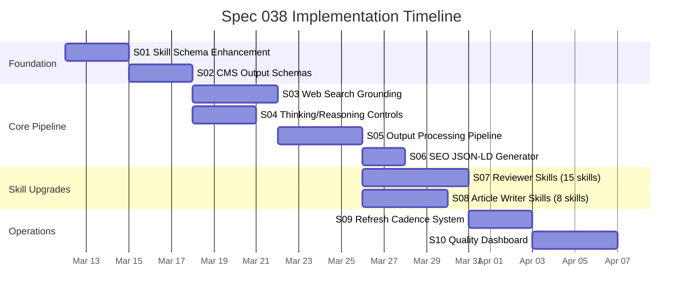

# Spec 038: Citation-Gated Content Quality & Multi-Model Publishing Intelligence

**Status**: Proposed
**Created**: 2026-03-11
**Author**: AI Orchestra
**Priority**: High
**Depends on**: Spec 037 (Task-First Execution Intelligence) — sections 01-02 implemented

---

## 1. Problem Statement

SmartSpecPro มี article writers 8 สาย และ product reviewers 15 หมวดที่ผลิตเนื้อหาภาษาไทยคุณภาพ แต่ยังขาดระบบ **citation-gated publishing** ที่จะ:

1. **บังคับให้ทุก claim สำคัญมีหลักฐานอ้างอิง** — ลด hallucination และเพิ่มความน่าเชื่อถือ
2. **ติดตามความสดของข้อมูล** — `last_verified_at` + refresh cadence เพื่อไม่ให้เนื้อหาล้าสมัย
3. **สร้าง structured output** (ArticleCMS.v1 / ProductReviewCMS.v1) ที่เชื่อมต่อ CMS ได้ทันที
4. **ใช้ประโยชน์จาก model features ใหม่** — web search grounding, thinking levels, structured outputs ที่ Gemini 3.1, GPT-5.4, Opus 4.6, Sonnet 4.6, Kimi 2.5 รองรับ
5. **ปฏิบัติตาม SEO best practices** — JSON-LD structured data, disclosure, E-E-A-T signals ตาม Google Search Central

### ผลกระทบหากไม่ทำ

- เนื้อหามี hallucination ที่ตรวจไม่พบจนถูก publish
- ข้อมูลราคา/สเปคล้าสมัยโดยไม่มีกลไกตรวจจับ
- ไม่ได้ rich results จาก Google เพราะไม่มี structured data
- เสียโอกาสลดต้นทุน LLM ผ่าน caching/batch/thinking control
- ทีม CMS ต้อง copy-paste จาก markdown ด้วยมือ

---

## 2. Goals & Non-Goals

### Goals

| # | Goal | Measurable Target |
|---|------|-------------------|
| G1 | ทุก article/review มี claim ledger + citations | 100% skills มี output schema ที่บังคับ claims[] |
| G2 | Web search grounding เปิดเป็น default สำหรับ content skills | ≥ 80% ของ critical claims มี web-grounded evidence |
| G3 | SEO structured data ถูกสร้างอัตโนมัติ | JSON-LD valid ผ่าน Rich Results Test |
| G4 | Thinking/reasoning control ตาม task complexity | ลดต้นทุน token ≥ 20% สำหรับงาน outline/draft |
| G5 | Refresh cadence ป้องกันเนื้อหาล้าสมัย | 0 เนื้อหาที่ claim สำคัญ > 30 วัน ไม่ถูก re-verify |
| G6 | Disclosure compliance อัตโนมัติ | 100% review ที่มี affiliate มี disclosure |

### Non-Goals (Phase 1)

- Domain-specific fact-check APIs (Crossref, NVD, FAOSTAT) — Phase 2
- Computer use สำหรับ verify/publish อัตโนมัติ — Phase 2
- Full CMS integration (auto-publish) — Phase 2
- Batch article generation workflow — Phase 2
- Agent swarm สำหรับ parallel article production (Kimi-style) — Phase 2

---

## 3. Architecture Overview

```
┌─────────────────────────────────────────────────────────────┐
│                    Skill Definition Layer                     │
│  skill.md + execution_policy + output.schema.json            │
│  (new: requires_web_search, requires_citations,              │
│   thinking_level_hint, output_format: "cms_json")            │
└───────────────────────┬─────────────────────────────────────┘
                        │
┌───────────────────────▼─────────────────────────────────────┐
│                  Task Execution Planner                       │
│  classifyTask() → infer requirements                         │
│  (enhanced: thinking_level, web_search, structured_output)   │
└───────────────────────┬─────────────────────────────────────┘
                        │
┌───────────────────────▼─────────────────────────────────────┐
│                    Model Resolver                             │
│  filterByCapabilities() → selectByStrategy()                 │
│  (enhanced: enforce web_search + structured_output caps)     │
└───────────────────────┬─────────────────────────────────────┘
                        │
┌───────────────────────▼─────────────────────────────────────┐
│               LLM Call Layer (per provider)                   │
│  ┌──────────┐ ┌──────────┐ ┌────────┐ ┌────────┐ ┌───────┐ │
│  │ Gemini   │ │ OpenAI   │ │ Claude │ │ Kimi   │ │ Other │ │
│  │thinking_ │ │reasoning.│ │adaptive│ │instant/│ │       │ │
│  │level     │ │effort    │ │thinking│ │thinking│ │       │ │
│  │google_   │ │web_search│ │web_    │ │$web_   │ │       │ │
│  │search    │ │          │ │search  │ │search  │ │       │ │
│  └──────────┘ └──────────┘ └────────┘ └────────┘ └───────┘ │
└───────────────────────┬─────────────────────────────────────┘
                        │
┌───────────────────────▼─────────────────────────────────────┐
│              Output Processing Pipeline (NEW)                │
│  1. Parse LLM output (markdown + JSON blocks)                │
│  2. Extract claims → build claim ledger                      │
│  3. Validate citations coverage                              │
│  4. Generate SEO metadata + JSON-LD                          │
│  5. Enforce quality gates before "publish"                    │
└───────────────────────┬─────────────────────────────────────┘
                        │
┌───────────────────────▼─────────────────────────────────────┐
│                    Audit + Storage                            │
│  providerUsageLog (existing) + content_artifacts (new)       │
│  claims[], citations[], last_verified_at, quality_score      │
└─────────────────────────────────────────────────────────────┘
```

---

## 4. Implementation Sections

### Section 01: Skill Schema Enhancement — `execution_policy` + `output_format`
### Section 02: Claim Ledger & Citations Output Schema
### Section 03: Web Search Grounding Integration for Skills
### Section 04: Provider-Specific Thinking/Reasoning Controls
### Section 05: Output Processing Pipeline (claim extraction + validation)
### Section 06: SEO Structured Data Generation (JSON-LD)
### Section 07: Reviewer Skills Upgrade (scoring, comparison, FAQ)
### Section 08: Article Writer Skills Upgrade (citations, SEO)
### Section 09: Refresh Cadence & Content Staleness Detection
### Section 10: Quality Dashboard & KPI Tracking

---

## 5. Detailed Section Specifications

---

### Section 01: Skill Schema Enhancement

**Goal**: ขยาย skill frontmatter ให้ประกาศ requirements สำหรับ web search, citations, output format, thinking level ได้

**Affected Files**:
- `packages/skills/src/types.ts` — SkillDefinition type
- `packages/skills/src/parseFrontmatter.ts` — parser
- `apps/web/skills/*/skill.md` — all skills (frontmatter update)

**Changes**:

```yaml
# New frontmatter fields (additive, backward compatible)
execution_policy:
  requires_web_search: true          # skill needs web grounding
  requires_citations: true           # output must include citations
  requires_structured_output: true   # output must be valid JSON
  thinking_level_hint: "medium"      # minimal/low/medium/high
  output_format: "cms_article"       # cms_article | cms_review | markdown | json
  max_tokens_hint: 8000              # budget guidance for planner

content_quality:
  citation_required_for: ["critical", "major"]  # claim importance levels
  min_citation_coverage: 0.8         # 80% of critical claims need evidence
  disclosure_required: true          # enforce disclosure block
  refresh_cadence_days: 30           # auto-flag stale content
```

**Type additions** (packages/skills/src/types.ts):

```typescript
export interface SkillExecutionPolicy {
  requires_web_search?: boolean;
  requires_citations?: boolean;
  requires_structured_output?: boolean;
  thinking_level_hint?: "minimal" | "low" | "medium" | "high";
  output_format?: "cms_article" | "cms_review" | "markdown" | "json";
  max_tokens_hint?: number;
}

export interface SkillContentQuality {
  citation_required_for?: ("critical" | "major" | "minor")[];
  min_citation_coverage?: number;
  disclosure_required?: boolean;
  refresh_cadence_days?: number;
}
```

**Backward compatibility**: ทุก field เป็น optional — skills เดิมทำงานได้ปกติ

**Tests**: Unit test ใน `packages/skills/src/__tests__/` — parse frontmatter ที่มี/ไม่มี fields ใหม่

---

### Section 02: Claim Ledger & Citations Output Schema

**Goal**: สร้าง output schema มาตรฐาน 2 แบบ (ArticleCMS.v1, ProductReviewCMS.v1) ที่ skill สามารถใช้ได้

**New Files**:
- `packages/skills/src/schemas/ArticleCMS.v1.schema.json`
- `packages/skills/src/schemas/ProductReviewCMS.v1.schema.json`
- `packages/skills/src/schemas/shared-definitions.json` (claims, citations, disclosures)
- `packages/skills/src/validators/cmsOutputValidator.ts`

**ArticleCMS.v1 Core Fields**:

```typescript
interface ArticleCMSOutput {
  locale: "th-TH" | "en-US";
  title: string;
  slug: string;
  summary: string;
  seo: {
    meta_title: string;
    meta_description: string;
    keywords: string[];
  };
  body_markdown: string;
  tables?: { title: string; format: "markdown" | "csv"; data: string }[];
  media?: { type: "image" | "chart" | "video" | "pdf"; source: string; license: string; alt_text_th?: string }[];
  claims: ClaimEntry[];
  citations: CitationEntry[];
  last_verified_at: string; // ISO datetime
  refresh_policy?: { cadence_days: number; triggers?: string[] };
  disclosures: {
    ai_assisted: boolean;
    affiliate: boolean;
    sponsored: boolean;
    notes_th?: string;
  };
}

interface ClaimEntry {
  claim_id: string;
  text: string;
  importance: "critical" | "major" | "minor";
  verification_status: "verified" | "partially_verified" | "unverified";
  last_verified_at: string;
  evidence: {
    source_type: "web" | "doi" | "api" | "pdf" | "internal_doc";
    title: string;
    url_or_id?: string;
    quote?: string;
    retrieved_at: string;
  }[];
}

interface CitationEntry {
  citation_id: string;
  title: string;
  url_or_id: string;
  retrieved_at: string;
}
```

**ProductReviewCMS.v1 extends ArticleCMS.v1** with:

```typescript
interface ProductReviewCMSOutput extends Omit<ArticleCMSOutput, 'body_markdown'> {
  product: {
    brand: string;
    model: string;
    category: string;
    market: "TH" | "GLOBAL";
    price?: { currency: "THB"; amount: number; price_checked_at: string };
  };
  review: {
    title: string;
    summary: string;
    verdict: string;
    pros: string[];       // min 2
    cons: string[];       // min 2
    who_should_buy: string;
    who_should_avoid: string;
    scoring: {
      overall: number;    // 0-10
      rubric: { dimension: string; score: number; notes: string }[];
    };
    comparison_table_markdown?: string;
    faq?: { q: string; a: string }[];
    body_markdown: string;
  };
  structured_data_jsonld: string;  // Product + Review schema
  disclosures: ArticleCMSOutput['disclosures'] & {
    methodology: string;  // "ทดลองใช้จริง X วัน" etc.
  };
}
```

**Validator** (`cmsOutputValidator.ts`):
- Validate output JSON against schema
- Check citation coverage: (claims with evidence / total critical claims) ≥ min_citation_coverage
- Check disclosure completeness
- Return `{ valid: boolean; errors: string[]; coverage: number }`

**Integration**: skill executor calls validator after LLM response when `output_format` is `cms_*`

---

### Section 03: Web Search Grounding Integration for Skills

**Goal**: เมื่อ skill มี `requires_web_search: true` ระบบจะเปิด web search tool ให้อัตโนมัติ พร้อมส่ง citations กลับ

**Affected Files**:
- `apps/web/server/routers/skills.ts` — skill execution route
- `apps/web/server/_core/responsesRoutes.ts` — add web_search tool injection
- `apps/web/server/_core/llmRoutes.ts` — add google_search grounding for Gemini
- `apps/web/server/services/searchResultCache.ts` — citation extraction enhancement

**How It Works**:

```
Skill has requires_web_search: true
  │
  ├─ OpenAI / Kimi → Responses API with tools: [{ type: "web_search" }]
  │   └─ Response includes sources[] → extract to citations[]
  │
  ├─ Gemini → google_search grounding tool
  │   └─ Response includes groundingMetadata.citations → extract to citations[]
  │
  ├─ Claude → web search tool (built-in)
  │   └─ Response includes cited sources → extract to citations[]
  │
  └─ Other → fallback: no web search, mark citations as "unverified"
```

**System prompt injection** (prepended when web search active):
```
คุณต้องอ้างอิงแหล่งข้อมูลสำหรับทุก claim ที่สำคัญ
- ใช้เครื่องมือ web search เพื่อค้นหาข้อมูลล่าสุด
- ทุก claim ระดับ critical/major ต้องมี evidence จากแหล่งที่ตรวจสอบได้
- ระบุ URL, ชื่อแหล่ง, และวันที่ดึงข้อมูลในส่วน citations
```

**Citation extraction utility** (new function in searchResultCache.ts):
```typescript
export function extractCitationsFromToolResults(
  toolResults: ToolResult[],
  provider: string
): CitationEntry[]
```

**Tests**: Mock web search responses for each provider, verify citation extraction

---

### Section 04: Provider-Specific Thinking/Reasoning Controls

**Goal**: Map task complexity → provider-specific thinking parameters เพื่อลด cost/latency สำหรับงานง่าย และเพิ่ม reasoning depth สำหรับงานซับซ้อน

**Affected Files**:
- `apps/web/server/services/taskExecutionPlanner.ts` — add thinking level to plan
- `apps/web/server/_core/llmRoutes.ts` — pass provider-specific params
- `apps/web/server/_core/responsesRoutes.ts` — pass reasoning controls

**Mapping Table**:

```typescript
const THINKING_LEVEL_MAP = {
  // Task complexity → provider params
  simple: {
    gemini: { thinking_level: "minimal" },
    openai: { reasoning: { effort: "low" } },
    claude: { thinking: { type: "adaptive", budget_tokens: 1024 } },
    kimi: { mode: "instant" },
  },
  moderate: {
    gemini: { thinking_level: "medium" },
    openai: { reasoning: { effort: "medium" } },
    claude: { thinking: { type: "adaptive", budget_tokens: 4096 } },
    kimi: { mode: "thinking" },
  },
  complex: {
    gemini: { thinking_level: "high" },
    openai: { reasoning: { effort: "high" } },
    claude: { thinking: { type: "adaptive", budget_tokens: 16384 } },
    kimi: { mode: "thinking" },
  },
} as const;
```

**Skill-level override**: `thinking_level_hint` ใน frontmatter จะ override task planner

**Use cases**:
- **Outline/draft** → simple/low → ลด cost ~50-80%
- **Research + synthesis** → complex/high → เพิ่ม reasoning depth
- **JSON formatting** → simple/low → ไม่ต้องคิดเยอะ

**Estimated cost savings**: 20-40% สำหรับ mixed workload (จาก thinking control เพียงอย่างเดียว)

---

### Section 05: Output Processing Pipeline

**Goal**: สร้าง post-processing pipeline ที่แปลง LLM output เป็น validated CMS JSON

**New Files**:
- `apps/web/server/services/contentOutputProcessor.ts`
- `apps/web/server/services/claimExtractor.ts`
- `apps/web/server/services/seoMetadataGenerator.ts`

**Pipeline Steps**:

```
LLM Response (markdown + JSON blocks)
  │
  ▼
Step 1: Parse output format
  ├─ If output_format=cms_*: expect JSON, validate against schema
  └─ If markdown: extract structured data from semantic markers
  │
  ▼
Step 2: Extract claims (claimExtractor.ts)
  ├─ Parse claims[] from JSON output
  ├─ Or extract from markdown (<!-- CLAIM:importance:text --> markers)
  └─ Assign claim_id, check importance level
  │
  ▼
Step 3: Match citations to claims
  ├─ Link evidence[] in each claim to citations[]
  └─ Calculate citation coverage ratio
  │
  ▼
Step 4: Quality gate check
  ├─ coverage ≥ min_citation_coverage? → pass
  ├─ all critical claims verified? → pass
  └─ disclosure complete? → pass
  │
  ▼
Step 5: Generate SEO metadata (if missing)
  ├─ meta_title from title (≤60 chars)
  ├─ meta_description from summary (≤160 chars)
  └─ keywords from content analysis
  │
  ▼
Step 6: Generate JSON-LD (for reviews)
  ├─ Product schema from product{}
  ├─ Review schema from review{}
  └─ Offer schema from price{}
  │
  ▼
Step 7: Return processed output + quality report
  {
    content: ArticleCMSOutput | ProductReviewCMSOutput,
    quality: {
      citation_coverage: 0.85,
      claims_total: 12,
      claims_verified: 10,
      claims_unverified: 2,
      quality_gate_passed: true,
      seo_complete: true,
      jsonld_valid: true
    }
  }
```

**Integration point**: `skillExecutor.ts` calls `processContentOutput()` after LLM response

---

### Section 06: SEO Structured Data Generation

**Goal**: สร้าง JSON-LD อัตโนมัติสำหรับ Product/Review/Article content ตาม Google structured data guidelines

**New File**:
- `apps/web/server/services/jsonLdGenerator.ts`

**Templates**:

```typescript
// For product reviews
function generateProductReviewJsonLd(review: ProductReviewCMSOutput): string {
  return JSON.stringify({
    "@context": "https://schema.org",
    "@type": "Product",
    "name": `${review.product.brand} ${review.product.model}`,
    "brand": { "@type": "Brand", "name": review.product.brand },
    "category": review.product.category,
    "review": {
      "@type": "Review",
      "reviewRating": {
        "@type": "Rating",
        "ratingValue": review.review.scoring.overall,
        "bestRating": 10,
        "worstRating": 0
      },
      "name": review.review.title,
      "reviewBody": review.review.summary,
      "positiveNotes": {
        "@type": "ItemList",
        "itemListElement": review.review.pros.map((p, i) => ({
          "@type": "ListItem", position: i + 1, name: p
        }))
      },
      "negativeNotes": {
        "@type": "ItemList",
        "itemListElement": review.review.cons.map((c, i) => ({
          "@type": "ListItem", position: i + 1, name: c
        }))
      }
    },
    ...(review.product.price && {
      "offers": {
        "@type": "Offer",
        "priceCurrency": review.product.price.currency,
        "price": review.product.price.amount
      }
    })
  }, null, 2);
}

// For articles
function generateArticleJsonLd(article: ArticleCMSOutput): string {
  return JSON.stringify({
    "@context": "https://schema.org",
    "@type": "Article",
    "headline": article.title,
    "description": article.summary,
    "dateModified": article.last_verified_at,
    "inLanguage": article.locale
  }, null, 2);
}
```

**Validation**: ใช้ Google Rich Results Test API หรือ local schema validation

---

### Section 07: Reviewer Skills Upgrade

**Goal**: อัพเกรด reviewer ทั้ง 15 ตัวให้รองรับ ProductReviewCMS.v1

**Affected Skills** (15 ตัว):
1. `electronics-reviewer`
2. `beauty-skincare-reviewer`
3. `food-grocery-reviewer`
4. `fashion-clothing-reviewer`
5. `home-appliance-reviewer`
6. `household-product-reviewer`
7. `baby-kids-reviewer`
8. `health-wellness-reviewer`
9. `hobby-craft-reviewer`
10. `home-decor-textile-reviewer`
11. `sports-outdoor-reviewer`
12. `pet-products-reviewer`
13. `agriculture-garden-reviewer`
14. `hardware-renovation-reviewer`
15. `real-estate-reviewer`

**Changes per skill**:

A. **Frontmatter** — เพิ่ม:
```yaml
execution_policy:
  requires_web_search: true
  requires_citations: true
  requires_structured_output: true
  thinking_level_hint: "medium"
  output_format: "cms_review"
content_quality:
  citation_required_for: ["critical", "major"]
  min_citation_coverage: 0.7
  disclosure_required: true
  refresh_cadence_days: 30
```

B. **skill.md Output Format section** — เพิ่ม CMS JSON mode:
```markdown
### Output Format

When `response_mode` is "cms_json", output a single JSON object conforming to ProductReviewCMS.v1:

```json
{
  "locale": "th-TH",
  "product": { "brand": "...", "model": "...", ... },
  "review": {
    "title": "...",
    "summary": "...",
    "verdict": "...",
    "pros": ["...", "..."],
    "cons": ["...", "..."],
    "who_should_buy": "...",
    "who_should_avoid": "...",
    "scoring": {
      "overall": 8.5,
      "rubric": [
        { "dimension": "คุณภาพวัสดุ", "score": 9, "notes": "..." },
        { "dimension": "ความคุ้มค่า", "score": 8, "notes": "..." }
      ]
    },
    "comparison_table_markdown": "| Feature | รุ่นนี้ | คู่แข่ง |\n|...",
    "faq": [{ "q": "...", "a": "..." }],
    "body_markdown": "..."
  },
  "claims": [...],
  "citations": [...],
  "last_verified_at": "2026-03-11T00:00:00Z",
  "disclosures": { ... },
  "structured_data_jsonld": "..."
}
```

When `response_mode` is "markdown" (default), output readable Thai article as before.
```

C. **Input schema** — เพิ่ม fields:
```json
{
  "response_mode": {
    "type": "string",
    "enum": ["markdown", "cms_json"],
    "default": "markdown"
  },
  "disclosure_type": {
    "type": "string",
    "enum": ["none", "affiliate", "sponsored", "provided_for_review"]
  },
  "price_thb": {
    "type": "number",
    "description": "ราคาปัจจุบัน (บาท)"
  },
  "price_checked_at": {
    "type": "string",
    "format": "date",
    "description": "วันที่ตรวจสอบราคา"
  }
}
```

D. **Scoring rubric per category** (default dimensions):

| Category | Default Rubric Dimensions |
|----------|--------------------------|
| electronics | ประสิทธิภาพ, คุณภาพจอ/เสียง, แบตเตอรี่, ความคุ้มค่า, การออกแบบ |
| beauty-skincare | ส่วนผสม, ประสิทธิผล, เนื้อสัมผัส, ความคุ้มค่า, ความอ่อนโยน |
| food-grocery | รสชาติ, คุณค่าอาหาร, ส่วนผสม, ความคุ้มค่า, บรรจุภัณฑ์ |
| fashion-clothing | วัสดุ, ตัดเย็บ, ความพอดี, ความคุ้มค่า, ความทนทาน |
| home-appliance | ประสิทธิภาพ, การประหยัดไฟ, ความเงียบ, ความคุ้มค่า, ความทนทาน |
| real-estate | ทำเล, คุณภาพก่อสร้าง, สิ่งอำนวยความสะดวก, ความคุ้มค่า, ศักยภาพลงทุน |
| (others) | คุณภาพ, การใช้งาน, ความคุ้มค่า, ความทนทาน, ความพึงพอใจรวม |

**Implementation strategy**: สร้าง template ใช้ร่วมกัน แล้วเพิ่ม category-specific rubric

---

### Section 08: Article Writer Skills Upgrade

**Goal**: อัพเกรด article writers 8 ตัวให้รองรับ ArticleCMS.v1

**Affected Skills** (8 ตัว):
1. `general-article-writer`
2. `business-article-writer`
3. `education-article-writer`
4. `lifestyle-article-writer`
5. `marketing-article-writer`
6. `documentary-script-writer`
7. `creative-story-writer`
8. `parenting-article-writer`

**Changes per skill** (คล้าย Section 07 แต่ใช้ ArticleCMS.v1):

A. **Frontmatter** — เพิ่ม execution_policy + content_quality

B. **Output Format** — เพิ่ม CMS JSON mode ด้วย ArticleCMS.v1

C. **Input schema** — เพิ่ม:
```json
{
  "response_mode": { "type": "string", "enum": ["markdown", "cms_json"], "default": "markdown" },
  "seo_keywords": { "type": "array", "items": { "type": "string" } },
  "target_audience": { "type": "string" }
}
```

D. **Citation requirements by category**:

| Category | min_citation_coverage | thinking_level_hint |
|----------|----------------------|---------------------|
| general | 0.6 | medium |
| business | 0.8 | high |
| education | 0.8 | high |
| lifestyle | 0.5 | low |
| marketing | 0.6 | medium |
| documentary | 0.9 | high |
| creative-story | 0.0 (fiction) | medium |
| parenting | 0.9 | high |

**Note**: `creative-story-writer` ไม่ต้อง citation (fiction) แต่ยังรองรับ cms_json format

---

### Section 09: Refresh Cadence & Content Staleness Detection

**Goal**: ระบบตรวจจับเนื้อหาที่ข้อมูลล้าสมัย และแจ้งเตือน/auto-trigger refresh

**New Files**:
- `apps/web/server/services/contentStalenessChecker.ts`
- `apps/web/server/jobs/contentRefreshJob.ts` (BullMQ job)

**Database** (new table):
```sql
CREATE TABLE content_artifacts (
  id SERIAL PRIMARY KEY,
  tenant_id TEXT NOT NULL,
  user_id INTEGER NOT NULL,
  skill_slug TEXT NOT NULL,
  output_format TEXT NOT NULL,        -- 'cms_article' | 'cms_review' | 'markdown'
  content_json JSONB,                 -- ArticleCMS or ProductReviewCMS
  quality_score JSONB,                -- { citation_coverage, claims_total, ... }
  last_verified_at TIMESTAMPTZ,
  refresh_cadence_days INTEGER DEFAULT 30,
  next_refresh_at TIMESTAMPTZ,
  status TEXT DEFAULT 'active',       -- 'active' | 'stale' | 'archived'
  created_at TIMESTAMPTZ DEFAULT NOW(),
  updated_at TIMESTAMPTZ DEFAULT NOW()
);

CREATE INDEX idx_content_artifacts_stale
  ON content_artifacts (next_refresh_at)
  WHERE status = 'active';
```

**Staleness checker**:
```typescript
// Run as BullMQ repeating job every 6 hours
async function checkStaleness() {
  const stale = await db.query(
    `UPDATE content_artifacts
     SET status = 'stale'
     WHERE next_refresh_at < NOW()
       AND status = 'active'
     RETURNING id, skill_slug, tenant_id`
  );
  // Notify via existing notification system
  for (const item of stale) {
    await notifyContentStale(item);
  }
}
```

**Refresh flow**:
1. Job marks content as `stale`
2. UI shows badge/notification
3. User can click "Refresh" → re-run skill with same inputs + web search
4. New output replaces old, `last_verified_at` updated
5. (Future: auto-refresh in background)

---

### Section 10: Quality Dashboard & KPI Tracking

**Goal**: Dashboard แสดง content quality metrics ตาม KPI ที่กำหนด

**New Files**:
- `apps/web/client/src/pages/ContentQualityDashboard.tsx`
- `apps/web/server/routers/contentQuality.ts` (tRPC router)

**KPIs displayed**:

| KPI | Source | Visualization |
|-----|--------|---------------|
| Claim accuracy rate | Sampling audit (manual) | % gauge |
| Citation coverage | content_artifacts.quality_score | % bar per skill |
| Post-publish correction rate | Manual tracking | Trend line |
| Structured data validity | JSON-LD validation | Pass/fail count |
| Time-to-publish | Timestamps | Avg duration |
| Token cost per piece | providerUsageLog | Cost breakdown |
| Cache hit rate | Redis metrics | % gauge |
| Median age of facts | last_verified_at | Days (heatmap) |
| Refresh SLA compliance | next_refresh_at vs actual | % met |
| Stale content count | content_artifacts WHERE status='stale' | Count + list |

**tRPC endpoints**:
```typescript
contentQuality.getOverview    // summary stats
contentQuality.getBySkill     // per-skill breakdown
contentQuality.getStaleList   // list of stale content
contentQuality.getCostBreakdown // token costs by skill
```

---

## 6. Implementation Order & Dependencies



**Critical Path**: S01 → S02 → S03 → S05 → S07/S08 → S09 → S10

**Parallel tracks**:
- S04 (thinking controls) can run parallel with S03
- S06 (JSON-LD) can run parallel with S07/S08
- S07 and S08 can run in parallel

---

## 7. Risk Assessment

| Risk | Impact | Likelihood | Mitigation |
|------|--------|------------|------------|
| Web search adds latency (2-5s per call) | Medium | High | Cache results, use only for critical claims, background mode |
| LLM fails to follow CMS JSON schema | High | Medium | Fallback to markdown, add schema validation + retry |
| Structured output not supported by all models | Medium | Medium | Graceful degradation: markdown + post-processing extraction |
| Token cost increases from web search + longer prompts | Medium | High | Thinking level control offsets cost; batch for non-urgent |
| Breaking change for existing UI consumers | High | Low | output_format defaults to "markdown", opt-in for cms_json |
| Schema evolution (v2 needed later) | Low | Medium | Version field in schema, migration utilities |

---

## 8. Testing Strategy

| Section | Test Type | Description |
|---------|-----------|-------------|
| S01 | Unit | Parse frontmatter with new fields, backward compat |
| S02 | Unit | Validate sample outputs against CMS schemas |
| S03 | Integration | Mock web search, verify citation extraction per provider |
| S04 | Unit | Map complexity → thinking params, verify per provider |
| S05 | Unit + Integration | Pipeline steps: claim extraction, coverage calc, quality gate |
| S06 | Unit | JSON-LD generation, schema validation |
| S07 | Integration | Run reviewer with cms_json mode, validate output |
| S08 | Integration | Run article writer with cms_json mode, validate output |
| S09 | Unit | Staleness detection, BullMQ job scheduling |
| S10 | Integration | tRPC endpoints return correct data |

---

## 9. Migration Plan

### Phase 1: Foundation (Sections 01-06) — ไม่มี breaking changes
- ทุก field ใหม่เป็น optional
- skills เดิมทำงานปกติ (default: markdown mode)
- ระบบใหม่ opt-in ผ่าน `response_mode: "cms_json"`

### Phase 2: Skill Upgrades (Sections 07-08) — backward compatible
- เพิ่ม frontmatter + output format section ให้ทุก skill
- Default ยังเป็น markdown
- CMS JSON เป็น option ที่ user เลือกได้

### Phase 3: Operations (Sections 09-10) — new features
- content_artifacts table (new, ไม่กระทบ existing tables)
- Dashboard page (new route, ไม่กระทบ existing pages)

### Rollback
- ลบ frontmatter fields → skills กลับเป็น markdown-only
- ลบ output processing → LLM output ส่งตรง
- content_artifacts table → DROP TABLE (ไม่กระทบ core data)

---

## 10. Cost & Performance Estimates

| Feature | Additional Cost | Latency Impact |
|---------|----------------|----------------|
| Web search grounding | $0.005-0.01 per search call | +2-5s per call |
| Thinking level control | -20-40% token cost (savings) | -50-80% latency for simple tasks |
| Structured output | ~0% (same tokens) | ~0% |
| Output processing pipeline | ~0% (local processing) | +100-200ms |
| JSON-LD generation | ~0% (local) | +10ms |
| Content staleness job | ~0% (DB query) | Background (no user impact) |

**Net effect**: ลดต้นทุนรวม ~15-30% เนื่องจาก thinking control savings > web search costs

---

## 11. Success Criteria

| Metric | Target | Measurement |
|--------|--------|-------------|
| Skills with CMS output support | 23/23 (100%) | Schema validation test |
| Critical claims with citations | ≥ 80% | content_artifacts.quality_score |
| JSON-LD validity | 100% pass | Rich Results Test |
| Token cost reduction | ≥ 20% | providerUsageLog comparison |
| Stale content (> 30 days) | 0 active items | content_artifacts query |
| Disclosure compliance | 100% when applicable | Output validation |
| Time-to-publish (cms_json) | < 60s | Timestamp tracking |
