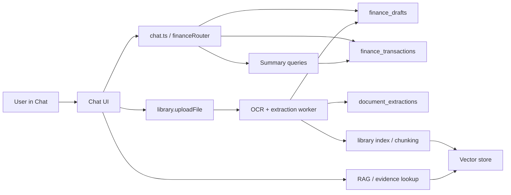

# 078 - Private Personal Finance with OCR and RAG

Version: 1.0
Date: 2026-04-09
Status: Proposed
Depends-on: 055-chat-memory-vector-rag, 075-unified-web-desktop-agent-platform
Audience: Product, Chat UX, Web Control Plane, Library/RAG, OCR/Document Pipeline, Data, Security, QA

---

## 1. Executive summary

SmartSpecPro should let one user keep a **private daily income/expense ledger inside chat** while still using the platform's existing library, memory, and RAG foundations.

The core product rule is isolation:

- personal chats are locked to `projectId = "personal"` and owned by the creating user
- work chats continue to use existing project IDs
- finance records, document artifacts, memory, and retrieval must never mix personal and work by accident

The first release is deliberately draft-first:

1. the user writes a natural-language expense or income entry in chat
2. OCR or LLM extraction converts it into a structured draft
3. the user confirms or edits the draft
4. only confirmed records affect summaries and analytics
5. uploaded documents are indexed for evidence retrieval with hard tenant/project/scope filters

This is an extension of the current repo, not a new standalone product.

---

## 2. Problem statement

SmartSpecPro already has the primitives needed for this feature, but they are still generic:

- chat conversations already carry a `projectId`
- memory retrieval already keys off `projectId`
- library documents already support upload, indexing, chunking, and allowed-scope filtering
- the UI already has a strong chat surface that can host richer cards and actions

What is missing is a **finance-specific private workflow** with explicit domain separation:

- no locked personal finance namespace
- no structured draft-confirm flow for money entries
- no OCR pipeline for receipts / invoices / document images
- no source-of-truth model for confirmed transactions vs draft extraction
- no hard retrieval policy that guarantees personal and work data stay isolated

Without this feature, users can still chat about finance, but the experience is fragile:

- entries are easy to mistype
- receipts are hard to interpret manually
- summaries can become inconsistent
- personal and work evidence can leak into the same context if filters are not enforced

---

## 3. Goals

### 3.1 Functional goals

- Let users record income and expense entries through chat.
- Let users define recurring finance rules.
- Add OCR-assisted drafting for uploaded receipt / invoice / expense documents.
- Support a private personal finance mode with `projectId = "personal"`.
- Keep personal and work finance data isolated at storage and retrieval time.
- Show daily and monthly summaries in the chat experience.
- Let users search and cite supporting documents from the existing library/RAG stack.

### 3.2 Non-functional goals

- Draft-first and human-confirmed for all money-moving records.
- Database-calculated totals only.
- Deterministic retrieval filtering before ranking.
- Owner-only personal data by default.
- Backward compatible with the current chat, memory, and library behavior.

---

## 4. Non-goals

- Do not add automatic bank or card synchronization in v1.
- Do not build a full general accounting package.
- Do not turn SmartSpecPro into a tax preparation system.
- Do not make `fileParseTool.ts` the OCR engine.
- Do not replace the current library or memory subsystems.
- Do not expose personal finance data to work chats unless the user explicitly duplicates a confirmed record into a work project.
- Do not make the vector provider choice part of this feature's product contract.

---

## 5. Repo-grounded interpretation

### 5.1 Current chat baseline

The current chat surface already supports conversation creation, updates, and project scoping:

- `apps/web/client/src/components/chat/ChatView.tsx`
- `apps/web/client/src/components/chat/ChatSidebar.tsx`
- `apps/web/client/src/components/chat/CreationMenu.tsx`
- `apps/web/server/routers/chat.ts`

This feature should extend those surfaces with finance-specific actions and personal-mode locking rather than introducing a second chat system.

### 5.2 Current memory baseline

Project-scoped memory already exists through:

- `apps/web/server/services/memoryService.ts`
- `apps/web/server/routers/memory.ts`

That makes `projectId = "personal"` a practical domain anchor for all personal finance conversations and memory.

### 5.3 Current library / RAG baseline

The repo already has a solid document system:

- `apps/web/server/routers/library.ts`
- `apps/web/server/services/libraryService.ts`
- `apps/web/drizzle/schema.ts`

Important existing primitives:

- `library_items`
- `library_chunks`
- `library_index_jobs`
- `allowed_scopes` on items and chunks
- sandbox-dispatched parsing for complex file types in `library.uploadFile`

This feature should reuse those primitives for receipts, invoices, and other finance evidence.

### 5.4 Existing file parsing baseline

`apps/web/server/routers/fileParseTool.ts` handles CSV / XLSX / TXT style parsing.

It should remain a separate utility for tabular import flows, not become the OCR path for receipts.

---

## 6. Locked product decisions

1. `projectId = "personal"` is a reserved personal finance namespace, resolved per user rather than shared at the tenant level.
2. Personal finance is owner-only by default.
3. Personal chats cannot be retargeted to a work project by editing `projectId`.
4. Work finance remains tied to the existing project model and project permissions.
5. OCR and LLM extraction are assistive only.
6. All confirmed totals and summaries come from the database.
7. Drafts must be confirmed before they become authoritative transactions.
8. Retrieval must hard-filter by `tenant_id + project_id + allowed_scopes` before similarity ranking.
9. Personal and work documents may share the same storage substrate, but never the same retrieval scope unless the user explicitly copies data.

### 6.1 Personal namespace ownership

- `projectId = "personal"` is a reserved personal finance namespace that is resolved per user, not per tenant.
- The effective personal access key is `tenant_id + owner_user_id + project_id`.
- Personal conversations, drafts, transactions, recurring rules, document extractions, and evidence links must always carry `owner_user_id`.
- Tenant admins and other users must not gain access to another user’s personal finance data through normal application flows.
- Any personal finance request that lacks a matching `owner_user_id` must fail closed.

---

## 7. Proposed architecture



### 7.1 Flow summary

- Free-form text becomes a structured draft.
- OCR documents become a structured draft plus evidence artifact.
- Confirmation promotes the draft into a confirmed transaction.
- Confirmed documents are chunked and indexed for retrieval.
- Summaries are computed from confirmed transactions only.

### 7.2 Source-of-truth matrix

| Data | Source of truth |
|---|---|
| Confirmed amounts and balances | `finance_transactions` |
| Pending structured extraction | `finance_drafts` |
| OCR text and layout evidence | `document_extractions` |
| Supporting document storage | `library_items` and object storage |
| Retrieval filters | `tenant_id + project_id + allowed_scopes` |

---

## 8. Data model

### 8.1 Finance transactions

`finance_transactions` stores confirmed monetary records.

Suggested fields:

- `id`
- `tenant_id`
- `project_id`
- `owner_user_id`
- `confirmed_from_draft_id`
- `idempotency_key`
- `source_hash`
- `type` (`income`, `expense`, `transfer`)
- `amount_minor`
- `currency`
- `occurred_at`
- `category_code`
- `merchant_name`
- `note`
- `source` (`chat_text`, `ocr_document`, `recurring_rule`, `import`)
- `confidence`
- timestamps
- soft-delete fields if needed by retention policy

Rules:

- `amount_minor` is required and must use minor units.
- `currency` is required, with `THB` as the default for Thai tenants unless overridden.
- `project_id` must be preserved from the conversation or document context.
- summary buckets must use the active user or tenant timezone, not raw server time
- personal finance writes must reject any payload whose `owner_user_id` does not match the authenticated user

### 8.2 Finance drafts

`finance_drafts` stores unconfirmed extracted payloads.

Suggested fields:

- `id`
- `tenant_id`
- `project_id`
- `owner_user_id`
- `idempotency_key`
- `source_hash`
- `payload_json`
- `missing_fields`
- `source_message_id`
- `source_library_item_id`
- `status`
- `expires_at`
- timestamps

Rules:

- drafts are not authoritative balances
- drafts may be updated repeatedly until confirmed or expired
- confirmation creates or updates the final transaction row
- duplicate drafts created from the same source hash and idempotency key must collapse into one draft record

### 8.3 Recurring rules

`finance_recurring_rules` stores scheduled finance templates.

Suggested fields:

- `id`
- `tenant_id`
- `project_id`
- `owner_user_id`
- `type`
- `amount_minor`
- `currency`
- `category_code`
- `merchant_name`
- `schedule_json` or `rrule`
- `timezone`
- `start_date`
- `end_date`
- `next_run_at`
- `auto_confirm`
- `status`
- timestamps

Rules:

- recurring rules must not silently create confirmed charges in v1 unless the user explicitly opts into auto-confirm
- scheduled runs should create drafts first by default

### 8.4 Document extractions

`document_extractions` stores OCR and structured extraction traceability.

Suggested fields:

- `id`
- `tenant_id`
- `project_id`
- `owner_user_id`
- `library_item_id`
- `ocr_provider`
- `mime_type`
- `file_hash`
- `page_count`
- `ocr_text`
- `ocr_json`
- `extracted_json`
- `confidence_json`
- timestamps

Rules:

- OCR text is treated as untrusted input
- raw extraction payloads are retained for audit and correction

### 8.5 Finance-document links

`finance_transaction_documents` links confirmed transactions to supporting documents.

Suggested fields:

- `transaction_id`
- `library_item_id`
- `role` (`receipt`, `invoice`, `statement`, `supporting`)
- timestamps

### 8.6 Library project scoping uplift

This feature should add first-class `projectId` storage to finance-related library artifacts where needed so that personal and work evidence can be filtered without relying on metadata-only conventions.

At minimum:

- `library_items` should carry `project_id`
- `library_chunks` should mirror the parent item's `project_id`
- `library_index_jobs` should carry the source `project_id` for audit and routing

`allowed_scopes` remains the denormalized ACL cache used for fast filtering.

### 8.7 Ownership and legacy scope handling

- personal finance records, drafts, and evidence must always be queryable only by the owning user
- work finance records must remain subject to the existing project membership and permission model
- any finance-related request that resolves to a row missing `owner_user_id`, `tenant_id`, or `project_id` must fail closed instead of guessing
- legacy library rows without a project scope must stay in compatibility mode and must not be treated as personal finance evidence until they are explicitly migrated
- legacy library rows with ambiguous ownership must be excluded from personal finance retrieval by default

---

## 9. Chat UX and flow

### 9.1 Entry points

The chat UI should expose:

- `New Chat`
- `New Chat (Personal)`
- finance quick actions such as `Add expense`, `Add income`, and `Attach receipt`

### 9.2 Personal chat behavior

When the user opens `New Chat (Personal)`:

- the conversation is created with `projectId = "personal"`
- the project selector is hidden or locked
- the header shows a personal badge
- the conversation cannot be retargeted to a work project from the UI

### 9.3 Draft cards

Every parsed finance entry should render as a draft card with:

- type
- date
- amount
- currency
- category
- merchant
- confidence
- missing fields
- confirm / edit / discard actions

### 9.4 OCR cards

Uploaded receipts and invoices should show:

- upload progress
- OCR processing state
- extracted fields
- clarification prompts when confidence is low
- a link to the original document

### 9.5 Summary cards

The chat should be able to render:

- today summary
- month-to-date summary
- category breakdown
- recurring due soon
- pending drafts

Summaries must be sourced from the database, not generated numerically by the model.

---

## 10. OCR and extraction pipeline

### 10.1 Supported inputs in v1

- receipt photos in `image/jpeg`, `image/png`, `image/webp`, and supported mobile image formats such as `image/heic`
- expense screenshots in the same allowlist
- invoice / receipt PDFs in `application/pdf`
- optionally, multi-image batches when the total batch stays within the configured cap

Default caps:

- 25 MB per OCR upload
- 25 pages per PDF
- 10 images per batch

Hard rejects:

- archives and container formats
- Office documents
- HTML, SVG, and scriptable formats
- password-protected or encrypted PDFs
- any file whose MIME type and magic bytes do not match
- any upload above the default 25 MB cap
- any PDF above the default 25-page cap

### 10.2 Pipeline steps

1. user uploads a document in chat
2. SmartSpecPro stores the file as a library item
3. an async OCR job extracts text and layout
4. a structured extractor converts OCR output into finance fields
5. the system creates a draft with confidence and missing-field metadata
6. the user confirms or edits the draft
7. the confirmed item links back to the evidence document
8. the document is chunked and indexed for retrieval

### 10.3 Extraction rules

- If a field is missing or uncertain, the system must ask a targeted clarification question instead of inventing data.
- The extractor must always return a schema-valid payload.
- `amount_minor`, `currency`, and `occurred_at` are required for confirmation.
- Category assignment is a suggestion, not an immutable fact, until the user confirms it.

### 10.4 Safety rules

- OCR text must never be treated as instructions.
- The system prompt and extraction prompt must remain separate from OCR content.
- Invalid extraction output must be rejected and re-run or sent to manual review.
- OCR and parsing workers must run with bounded memory, wall-clock time, and temporary storage.
- The OCR pipeline must fail closed if tenant policy forbids outbound content transfer to a cloud OCR or LLM provider.
- OCR logs must never include raw full-document text unless explicitly redacted for a debug-only, access-controlled path.

---

## 11. RAG and isolation

### 11.1 Retrieval intent

RAG in this feature is for:

- finding supporting receipts and invoices
- finding prior confirmed documents
- finding linked evidence for a transaction
- answering finance questions with citations to documents

RAG is **not** the source of truth for totals.

### 11.2 Isolation rule

Every retrieval query must filter by:

- `tenant_id`
- `project_id`
- `allowed_scopes`
- `owner_user_id` when the effective scope is personal

The filter must be applied before ranking.

```sql
WHERE tenant_id = :tenant_id
  AND project_id = :project_id
  AND allowed_scopes && :user_scopes
  AND (
    project_id <> 'personal'
    OR owner_user_id = :user_id
  )
```

### 11.3 Personal vs work retrieval

- personal chats may only retrieve personal evidence
- work chats may only retrieve work evidence for the active project
- the system must never "helpfully" widen scope across domains

### 11.4 Memory behavior

Personal chats should use the existing project-scoped memory path so that personal context is shared across personal sessions but remains separate from work sessions.

---

## 12. API contract

### 12.1 tRPC procedures

Add a `financeRouter` with procedures such as:

- `parseTextToDraft`
- `parseDocumentToDraft`
- `confirmDraft`
- `updateDraft`
- `voidTransaction`
- `listTransactions`
- `getDailySummary`
- `getMonthlySummary`
- `createRecurringRule`
- `pauseRecurringRule`
- `resumeRecurringRule`
- `listLinkedDocuments`

### 12.2 Draft payload shape

The structured draft contract should include at least:

- `projectId`
- `type`
- `amountMinor`
- `currency`
- `occurredAt`
- `categoryCode`
- `merchantName`
- `note`
- `confidence`
- `needsClarification`
- `missingFields`

Example:

```json
{
  "projectId": "personal",
  "type": "expense",
  "amountMinor": 18000,
  "currency": "THB",
  "occurredAt": "2026-04-09T12:34:00+07:00",
  "categoryCode": "transport.taxi",
  "merchantName": "Grab",
  "note": "Taxi to office",
  "confidence": 0.94,
  "needsClarification": false,
  "missingFields": []
}
```

### 12.3 Worker contract

Heavy OCR and extraction work should run through the existing async job pattern used for library indexing and complex document processing.

The worker contract should carry:

- `tenant_id`
- `project_id`
- `library_item_id`
- `source_message_id` if applicable
- `job_type`
- `idempotency_key`
- `source_hash`
- `mime_type`
- `page_count`

The worker must reject any job that does not resolve to a single owning user and a single tenant/project scope.

### 12.4 Summary contract

Summary endpoints must return computed numbers such as:

- income total
- expense total
- net total
- category breakdown
- pending draft count
- recurring due count
- the timezone used for daily and monthly bucket boundaries

The model may turn those numbers into readable prose, but it must not invent the numbers.

### 12.5 Authorization and idempotency matrix

| Procedure | Personal scope | Work scope | Idempotency rule |
|---|---|---|---|
| `parseTextToDraft` | owner-only | project write access | same normalized text may dedupe by source hash |
| `parseDocumentToDraft` | owner-only | library read/write access for the source document scope | require `idempotencyKey` and `fileHash` |
| `confirmDraft` | owner-only | project write access | single commit per draft, repeated calls return the same transaction |
| `updateDraft` | owner-only | project write access | versioned updates only |
| `voidTransaction` | owner-only | project delete/void access | action must be repeat-safe |
| `listTransactions` | owner-only | project read access | read-only |
| `getDailySummary` | owner-only | project read access | read-only |
| `getMonthlySummary` | owner-only | project read access | read-only |
| `createRecurringRule` | owner-only | project write access | rule body should be deduped by schedule hash |
| `pauseRecurringRule` / `resumeRecurringRule` | owner-only | project write access | repeat-safe |
| `listLinkedDocuments` | owner-only | same ACL as the source transaction/document | read-only |

Rules:

- `parseDocumentToDraft` and `confirmDraft` must accept an idempotency key and must return the same logical result when retried
- `confirmDraft` must fail closed if the draft owner, tenant, or project does not match the authenticated caller
- `listTransactions`, `getDailySummary`, and `getMonthlySummary` must never broaden scope beyond the authenticated user’s permitted personal or project scope

---

## 13. Security, privacy, and retention

### 13.1 Privacy baseline

- Personal finance data is owner-only by default.
- Personal data is not surfaced in work contexts by default.
- Personal records should not be shareable accidentally through generic project-sharing behavior.
- Tenant admins, support staff, and other non-owners must not see personal finance data through normal application flows.

### 13.2 Audit requirements

Audit logs should capture:

- receipt upload
- OCR start and completion
- extraction success or failure
- draft creation
- draft confirmation
- transaction deletion or voiding
- retention / purge actions

### 13.3 Prompt-injection defense

OCR content is untrusted input.

The system must:

- keep system prompts separate from OCR text
- validate structured outputs before write paths
- never allow document text to override project scope or access scope
- never allow OCR text to alter authorization claims, retention policy, or routing policy

### 13.4 Retention

Retention should be policy-driven, with a sensible default that keeps the original document and OCR evidence as long as the related finance record remains active or within the configured retention window.

When a user deletes personal finance data, the associated drafts, document links, and derived OCR artifacts should follow the same retention policy.

### 13.5 Database backstop

Service-layer filters are necessary but not sufficient.

Row-level security or an equivalent database backstop should protect finance tables and library retrieval tables so a missed application filter does not expose personal data.

The backstop policy should enforce:

- personal rows require `owner_user_id = current_user`
- work rows require tenant membership and project membership or an equivalent ACL check
- finance drafts, transactions, and document links must never be readable if tenant/project ownership is ambiguous

### 13.6 Migration and backfill policy

- new finance tables should be created with strict ownership fields from day one
- legacy library rows without `project_id` should remain in compatibility mode until they are reindexed or remediated
- personal finance evidence should be backfilled with `project_id = "personal"` and the correct `owner_user_id` before strict personal retrieval is enabled
- any legacy document that cannot be confidently attributed to one user must stay excluded from personal finance retrieval
- the rollout must not switch personal retrieval to hard enforcement until the backfill passes verification

### 13.7 Provider and egress policy

- cloud OCR or LLM processing may be used only if tenant policy explicitly allows outbound processing of finance documents
- approved OCR and LLM providers should be configurable per tenant or deployment policy
- if outbound processing is not allowed, the pipeline must fail closed or use a locally approved OCR path
- raw OCR text, extracted fields, and finance documents are sensitive data and must be encrypted at rest and redacted in logs whenever possible
- prompts sent to external providers must include only the minimum data needed for extraction or classification

---

## 14. Rollout plan

### Phase 1: text-only finance drafts

- add finance tables and router
- support natural-language income/expense drafting
- confirm / edit / discard flow
- daily and monthly summaries from the database

### Phase 2: personal isolation

- add `New Chat (Personal)`
- lock `projectId = "personal"`
- add server-side guards so personal chats cannot be retargeted
- add tests for cross-domain isolation

### Phase 3: OCR-assisted receipts

- connect document upload to OCR extraction
- create finance drafts from documents
- support clarification prompts for low-confidence fields

### Phase 4: RAG evidence lookup

- chunk and embed confirmed documents
- add evidence lookup in chat
- ensure all retrieval uses tenant/project/scope filters

### Phase 5: hardening

- add retention controls
- add richer audit reporting
- add regression coverage for security and isolation rules

### Verification matrix

- personal ownership isolation tests for two users in the same tenant
- server-side reject tests for personal `projectId` tampering
- OCR MIME / size / page limit tests
- sandboxed OCR worker tests for malformed and oversized inputs
- duplicate upload and duplicate confirmation idempotency tests
- RAG retrieval tests that prove personal and work evidence do not cross
- retention and purge tests for drafts, transactions, and linked documents
- RLS / ACL regression tests for finance tables and document retrieval tables

---

## 15. Success criteria

- The user can create a `New Chat (Personal)` conversation and the conversation is locked to `projectId = "personal"`.
- The user can write a plain-language income or expense entry and receive a structured draft.
- The user can upload a receipt or invoice and receive OCR-assisted draft fields.
- The user can confirm a draft and see it reflected in daily and monthly summaries.
- The user can record recurring finance rules and see upcoming schedule state.
- Personal chats only retrieve personal evidence, and work chats only retrieve work evidence.
- Monthly totals are computed from the database and remain stable regardless of model output.
- Existing chat, memory, and library behavior continues to work outside the finance flow.

---

## 16. Current limitations

This feature deliberately stops short of a full accounting product.

Known limitations for v1:

- no bank statement sync
- no payment-network reconciliation
- no tax filing workflow
- no automatic cross-domain migration between personal and work finance data
- no vendor-specific OCR lock-in in the product contract

Those can be considered later follow-on features once the private finance core is stable.
