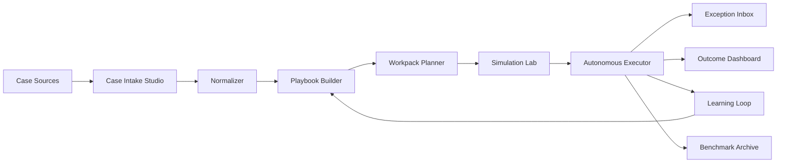

# 079 - Autonomous Work Transformation Platform

Version: 1.1
Date: 2026-04-10
Status: Proposed
Depends-on: 075-unified-web-desktop-agent-platform, 037-Task-First-Execution-Intelligence, 032-Browser-Automation-Copilot, 033-Browser-Automation-Policy, 045-HybridSkillOrchestrator, 064-skill-maintenance-lifecycle, 077-distributed-worker-fabric-completion
Audience: Product, Web Control Plane, Chat UX, Workflow, Skills, Agency, Desktop Host, Runtime, Security, Admin, QA

---

## 1. Executive summary

SmartAIHub should evolve from a strong collection of execution primitives into a platform that can absorb real routine work, transform it into reusable automation assets, and run that work with human involvement only where policy or consequence truly requires it.

This feature defines that product layer.

Feature 037 already decides how a task should execute.
Feature 075 already unifies web and desktop execution surfaces.
Feature 079 adds the missing product abstraction above them: the **Workpack**.
Feature 080 later builds persistent role agents and an always-on control room on top of this layer.
Feature 079 intentionally stops at the reusable automation unit and its lifecycle.

A Workpack is a versioned bundle of:

- a real business process or case
- a normalized playbook
- the required skills, workflows, browser packs, and agent roles
- connector mappings and policy controls
- test fixtures, replay data, and evaluation targets
- rollout and trust metadata

The product goal is not "more chat with more tools."
The product goal is:

- ingest a real case or SOP
- convert it into a reusable workpack
- simulate and validate it
- promote it to supervised or autonomous execution
- learn from every run
- reduce human-in-the-loop touches to exceptions, irreversible boundaries, and regulated actions

In short:

- Workflow is how the machine executes.
- Skill is one reusable capability.
- Agency is multi-agent coordination.
- Workpack is the product wrapper that turns routine work into something the system can own end-to-end.

---

## 2. Problem statement

The repository already has many of the ingredients needed for autonomous work, but they are still fragmented across surfaces:

- `teamBlueprints.ts` and `browserSkills.ts` are still mostly generic
- `workflowWorkerRuntimeNodeTypes.ts` only exposes a very small worker node vocabulary
- `hybridOrchestration.ts` covers a useful hybrid stage model, but not a product-level workpack lifecycle
- `browserPolicy.ts` and `liveBrowser.ts` already understand action classes, approvals, and human handoff, but only in browser-centric terms
- `skillStudioService.ts` and `skillUpgradeApplier.ts` already support create/improve loops, but not a full case-to-workpack transformation loop
- `automation/contracts.ts` still models browser_rpa, workflow, agency, and hybrid, but not a higher-level autonomy bundle
- `desktop_worker_fabric.rs` already has service identity, approval mode, budget attribution, and token rotation, but not a broader workpack-centric rollout model

The result is a platform that can help with work, but not yet a platform that can reliably replace routine work across professions.

The missing layer is a product concept that can:

1. ingest a messy real-world case
2. convert it into a structured reusable automation artifact
3. choose the best runtime path automatically
4. keep humans out of the happy path
5. preserve strong trust, policy, and audit boundaries

Without this layer, the system risks staying a powerful assistant instead of becoming an autonomous work platform.

---

## 3. Goals

1. Turn raw business routines, SOPs, case studies, screenshots, chat threads, and documents into reusable workpacks.
2. Provide domain-specific playbooks for routine work in finance, HR, support, sales ops, procurement, legal ops, customer success, operations, and executive support.
3. Let the system choose the smallest safe execution path automatically, rather than forcing users to manually micromanage every step.
4. Minimize human-in-the-loop involvement to exceptions, drift, irreversible actions, and regulated boundaries.
5. Add simulation, dry-run, and replay before autonomous rollout.
6. Add a learning loop that improves skills, workflows, browser packs, connector maps, and policy thresholds from real runs.
7. Add a benchmark archive so successful workpacks can be cloned and reused.
8. Expose the autonomy layer through UI surfaces that are easy to understand for non-technical operators.
9. Preserve the existing web, workflow, agent, browser, and desktop surfaces instead of replacing them.
10. Keep trust, provenance, and auditability strong enough for enterprise rollout.
11. Provide reusable execution units that future persistent role agents can own as recurring routines without bypassing policy or replay requirements.

---

## 4. Non-goals

1. This feature does not promise unrestricted autonomy in every domain.
2. This feature does not remove approvals for payments, secret handling, privileged admin changes, legal finalization, or other irreversible actions.
3. This feature does not replace Feature 037's task planner.
4. This feature does not replace Feature 075's unified web + desktop host model.
5. This feature does not replace browser automation or live browser collaboration.
6. This feature does not require every domain to be solved in the first release.
7. This feature does not create a second chat product or a second workflow system.
8. This feature does not silently promote unverified outputs into trusted shared surfaces.
9. This feature does not define the persistent role roster, always-on team monitor, or month-scale AI organization operating model; those belong to Feature 080.

---

## 5. Current-codebase fit

| Existing area | Current truth | Gap this feature fills |
|---|---|---|
| `apps/web/shared/teamBlueprints.ts` | Only a handful of broad blueprints exist today, mostly creative, research, presentation, and engineering-oriented | Add profession-specific blueprints for routine operations work |
| `apps/web/shared/browserSkills.ts` | Only five generic browser presets exist | Add browser packs for repetitive office work such as invoice handling, support triage, CRM updates, procurement, and HR flows |
| `apps/web/shared/workflowWorkerRuntimeNodeTypes.ts` | Only dispatch, wait, publish, and reindex worker runtime nodes exist | Add intake, classify, route, approval, evaluate, retry, and handoff nodes |
| `apps/web/shared/orchestration/hybridOrchestration.ts` | A usable intake/explore/validate/approval/commit model already exists | Reuse it as the stage model for workpack execution where human review is needed |
| `apps/web/shared/browserPolicy.ts` | Browser action classes, sensitivity classes, approval envelopes, and audit metadata already exist | Extend the same policy vocabulary to workpack-level boundary decisions |
| `apps/web/shared/liveBrowser.ts` | Browser sessions already model waiting, takeover, human control, and approval states | Reuse the same human-control semantics for browser-heavy workpacks |
| `apps/web/server/services/skillStudioService.ts` | Skill creation and improvement loops already exist | Use them for workpack-generated skill upgrades and derived skills |
| `apps/web/server/services/skillUpgradeApplier.ts` | Skill contract snapshots and recommendations already exist | Feed post-run learning back into the improvement pipeline |
| `apps/web/server/routers/workflow.ts` | Workflow analysis, conversion to skill, and template publishing already exist | Compile workpacks into workflows, skills, and reusable templates |
| `apps/web/shared/automation/contracts.ts` | Execution intents are still browser_rpa, workflow, agency, and hybrid | Extend intent modeling to workpack-level execution |
| `apps/tauri-shell/src-tauri/src/desktop_worker_fabric.rs` | Desktop worker mode, approval mode, budget attribution, and token rotation are already modeled | Reuse these controls for autonomous desktop execution and workpack trust |
| `apps/tauri-shell/src-tauri/src/package_sync.rs` and `package_materializer.rs` | Signed package trust, compatibility, and revocation are already enforced | Use them if workpacks are materialized as signed desktop bundles |

This feature should not invent a completely separate runtime model when the repo already has enough building blocks to compile a workpack into existing surfaces.

---

## 6. Locked product decisions

1. **Workpack is the canonical product unit.**
   - A workpack is the user-facing bundle that turns a real routine into something reusable and executable.
   - A workpack may compile into workflows, skills, browser packs, desktop packages, or agency graphs.

2. **Case -> playbook -> workpack -> run -> benchmark is the lifecycle.**
   - Raw materials become a playbook.
   - A playbook becomes a versioned workpack.
   - A workpack becomes runs.
   - Stable runs become benchmark packs.

3. **Human-in-the-loop must be exception-only.**
   - Humans should intervene only at policy boundaries, drift points, or irreversible steps.
   - Routine steps should not require repeated confirmations.

4. **The execution planner should move approvals to the narrowest possible boundary.**
   - The system should execute the safe portion automatically and stop only at the exact consequence boundary that needs review.

5. **Every autonomous workpack needs a policy profile, connector map, fixtures, and evaluation target.**
   - No workpack should be allowed into autonomous mode without a replayable validation path.

6. **Dry-run and replay are mandatory before autonomous promotion.**
   - Simulation is not optional for new packs.
   - Promotion to lights-out execution must be evidence-backed.

7. **Mature workpacks should be able to run with no human touches on the happy path.**
   - The system must support real end-to-end automation for repeatable, low-risk work.

8. **Unknown, low-confidence, or drifted states fail closed.**
   - If the system cannot safely continue, it must open a structured exception instead of guessing.

9. **Trust-tainted outputs do not silently escape their trust boundary.**
   - Outputs from unverified or local-only workpacks should remain constrained until policy allows promotion.

10. **Rollout must start with low-risk, high-volume work.**
    - The first operational domains should be routine and rule-bound, not high-stakes and heavily regulated.

---

## 7. Autonomous work lifecycle

### 7.1 Lifecycle stages

- **Case intake**: ingest SOPs, case studies, chat threads, screenshots, spreadsheets, screen captures, browser captures, and documents.
- **Normalization**: extract the process objective, actors, systems, inputs, outputs, control points, and risk boundaries.
- **Playbook build**: convert the case into a structured, reusable process template.
- **Workpack planning**: resolve the playbook into runtime paths, connector maps, policy envelopes, and evaluation fixtures.
- **Simulation**: dry-run the pack against fixtures or masked historical data.
- **Pilot**: run with narrow blast radius and close observation.
- **Autonomous execution**: run end-to-end within policy and trust constraints.
- **Learning**: record outcomes, failures, drift, and intervention patterns.
- **Benchmarking**: publish stable workpacks as reusable benchmark packs.

### 7.2 Source of truth model

| Artifact | Purpose | Canonical source |
|---|---|---|
| Case source | Raw user-provided material | Uploaded files, chat threads, traces, or captures |
| Playbook | Structured process model | Case intake and normalization output |
| Workpack | Deployable automation bundle | Versioned playbook plus runtime, policy, and connector metadata |
| Run | One execution instance | Event trace, artifacts, and approvals |
| Exception | Human step-up item | Exception inbox record |
| Benchmark pack | Reusable success pattern | Promoted workpack version plus fixtures and metrics |

---

## 8. Product surfaces

| Surface | Purpose | Required behavior |
|---|---|---|
| Case Intake Studio | Turn raw process materials into structured drafts | Accept files, threads, screenshots, and traces; produce playbook and workpack drafts |
| Playbook Library | Browse reusable process templates | Filter by profession, task shape, connector needs, risk tier, and maturity |
| Workpack Detail | Inspect one executable bundle | Show policy, connectors, fixtures, history, and promotion state |
| Run Control Room | Watch active and completed executions | Show status, checkpoints, exception states, and replay links |
| Exception Inbox | Resolve blocked or ambiguous steps | Group items by reason code and recommend the next safe action |
| Replay Lab | Dry-run and replay workpacks | Compare expected vs actual and surface drift |
| Connector Schema Studio | Map workpack fields to external systems | Validate auth, permissions, and schema drift before rollout |
| Outcome Dashboard | Measure the value of automation | Show ROI, intervention rate, success rate, and time saved |
| Chat, Agency, Workflow, Desktop entrypoints | Start or resume workpacks from existing surfaces | Preserve context and avoid creating a new parallel product path |

The product should feel like one work control plane, not a bunch of disconnected tools.

---

## 9. Functional requirements

### 9.1 Case Intake Studio

- The studio must accept SOP documents, case studies, screenshots, spreadsheets, chat exports, browser traces, screen recordings, and workflow exports.
- The intake flow must work with local file intelligence where available so the user does not need an upload-first cloud workflow.
- The system must extract:
  - goal
  - actors
  - target systems
  - trigger conditions
  - inputs and outputs
  - recurring steps
  - exceptions and failure modes
  - policy constraints
  - data sensitivity
  - connector requirements
  - evaluation criteria
- The studio must produce a structured playbook draft and a workpack draft.
- The studio must attach confidence to extracted fields so the system knows what it inferred and what it knows for sure.
- If confidence is too low, the system should ask targeted clarifying questions instead of forcing the user to rebuild the whole draft manually.
- The intake output must keep traceability back to the original source materials.
- The intake flow should also generate sample fixtures and regression cases where possible.

### 9.2 Industry Playbook Library and browser packs

- The library must provide curated first-wave playbooks for:
  - finance operations
  - HR operations
  - support operations
  - sales operations
  - procurement
  - legal operations
  - customer success
  - operations
  - executive support
  - content operations
- Each playbook must expose:
  - target outcome
  - required connectors
  - likely exceptions
  - default risk tier
  - default autonomy mode
  - sample fixtures
  - benchmark status
  - maturity level
- The browser-facing presets must expand beyond the current generic presets into profession-specific packs such as:
  - invoice reconciliation
  - ticket triage
  - CRM update
  - vendor comparison
  - leave and onboarding flows
  - contract review summary
  - renewal follow-up
  - purchase order handling
  - daily ops summary
- Users must be able to clone, customize, and republish packs.
- Workpacks may be shared across teams only when trust and policy allow it.

### 9.3 Autonomous execution router

- The router must use the task-first planner as the root decision engine.
- The router must choose the lowest-cost path likely to succeed, such as:
  - direct skill execution
  - deterministic workflow
  - browser session
  - hybrid orchestration
  - agency swarm
  - desktop-local runtime
  - worker fabric
- The planner must emit a normalized execution plan that includes:
  - autonomy mode
  - risk tier
  - expected artifacts
  - runtime preference
  - fallback runtime
  - step-up boundaries
  - connector requirements
  - replay requirements
- The router must batch approvals at consequence boundaries rather than asking the user to approve every small step.
- The router must support background runs and resumable control-room views.
- The router must support scheduled or event-triggered launches initiated by persistent role agents without creating a parallel trust model.
- The router must preserve truthful run labels so web, desktop, browser, and worker outputs remain consistent.
- The router must prefer automation over human prompts whenever the work is already validated and safe.

### 9.4 Exception and approval inbox

- Every blocked, ambiguous, or policy-sensitive step must land in a single inbox.
- Each exception item must include:
  - machine-readable reason code
  - human-readable summary
  - related workpack and run
  - source context
  - risk class
  - suggested next action
  - replay or remediation link
- The inbox must support:
  - approve
  - reject
  - retry
  - downgrade autonomy
  - remap connector
  - regenerate workpack
  - escalate to admin
  - mark as false positive
- The inbox must distinguish transient operational failures from real policy boundaries.
- Approval state must be context-bound and time-boxed, not a blanket pass for unrelated future runs.
- Browser-heavy exceptions should reuse `liveBrowser` and `browserPolicy` status vocabulary where that is already the product truth.

### 9.5 Simulation, dry-run, and replay lab

- Every new workpack must be simulatable before it can be promoted to autonomous rollout.
- Simulation must support:
  - fixture-based dry runs
  - masked historical data
  - synthetic sample inputs
  - trace replay from prior runs
- Replay must compare expected vs actual:
  - steps
  - side effects
  - approvals
  - outputs
  - connector responses
- The lab must surface:
  - drift
  - missing permissions
  - schema mismatch
  - page layout changes
  - policy hotspot areas
  - exception clusters
- If simulation reveals unrecoverable ambiguity, the system must fail closed and route the case to the exception inbox.

### 9.6 Learning loop and benchmark publishing

- The platform must generate improvement proposals from successful and failed runs.
- Improvement proposals may target:
  - skills
  - browser packs
  - workflows
  - connector maps
  - prompts
  - fixtures
  - policy thresholds
  - UI copy
- The feature should reuse `skillStudioService.ts` and `skillUpgradeApplier.ts` as the learning substrate instead of inventing a parallel improvement loop.
- Stable workpacks should be promotable into benchmark packs with sample inputs, outputs, and evaluation rules.
- Benchmark packs must be versioned and cloneable.
- Low-risk improvements may be auto-applied when policy allows; higher-risk changes must remain reviewable.
- The learning loop should aim to reduce future human interventions, not merely improve output text.

### 9.7 Connector schema mapping studio

- The platform must support mapping canonical workpack fields to external systems such as CRM, ERP, HRIS, help desk, email, calendar, spreadsheet, document management, and procurement tools.
- The studio must support:
  - schema discovery
  - sample payload capture
  - field-to-field mapping
  - validation against live connector schemas
  - auth scope inspection
  - side-effect classification
- Connector setup must be treated as a first-class product surface rather than a hidden technical step.
- Mappings must surface missing permissions or expired auth as structured exceptions.
- The system must avoid broad write permissions when a narrower connector scope will do.

### 9.8 Outcome and ROI dashboard

- The dashboard must show:
  - completion rate
  - intervention rate
  - exception rate
  - success rate
  - rollback rate
  - cost per completed item
  - estimated time saved
  - throughput per workpack
  - policy block frequency
  - promotion velocity
- Metrics must be sliceable by:
  - workpack
  - team
  - profession
  - connector
  - runtime
  - risk tier
  - policy profile
- The dashboard must highlight repeated manual work that should be converted into a new workpack.
- The dashboard should also recommend when a workpack is ready to move from supervised to autonomous mode.

### 9.9 Human-in-loop policy and trust tiers

- The feature must reuse the existing policy vocabulary where possible instead of inventing a parallel approval universe.
- Human involvement should be limited to:
  - first-time case review when the system lacks confidence
  - new connector grant
  - irreversible or externally visible action
  - ambiguous inference below threshold
  - legal, security, health, or regulated finance boundary
  - repeated failure or drift
- Mature low-risk workpacks should be able to run end-to-end without a human touching every step.
- Approval decisions must be revocable, time-boxed, and context-bound.
- Trust-tainted outputs must not automatically escape their trust boundary until a policy-backed promotion occurs.
- High-risk domains should start in draft or supervised mode and only graduate after simulation, evidence, and policy review.

### 9.10 Backward compatibility and rollout

- Existing chat, workflow, agency, browser, and desktop surfaces must continue to work.
- The workpack layer must sit above those surfaces, not replace them.
- The first rollout must be tenant-gated.
- The first rollout should focus on low-risk, high-volume work where the system can reduce human effort quickly.
- Existing workflow-to-skill and browser automation paths must remain valid building blocks.

---

## 10. Data model

This feature does not have to force a single schema design on day one, but it does need stable conceptual objects.

| Entity | Purpose | Notes |
|---|---|---|
| `case_source` | Raw input material | Files, threads, URLs, screenshots, traces, and captures |
| `playbook` | Normalized process description | Human-readable and machine-readable process model |
| `workpack` | Deployable automation bundle | Versioned composition of playbook, runtime, policy, and connectors |
| `workpack_version` | Immutable revision | Stores evaluation state, rollout state, and trust metadata |
| `workpack_run` | One execution instance | Tracks progress, outputs, approvals, and artifacts |
| `workpack_exception` | Human step-up or failure item | Binds run context to the exception inbox |
| `simulation_run` | Dry-run or replay result | Records fixture-based validation and drift findings |
| `connector_map` | External schema mapping | Field mappings, auth scope, and permission posture |
| `benchmark_pack` | Reusable success pattern | Cloneable, versioned, and evaluable workpack variant |
| `metric_snapshot` | ROI and autonomy telemetry | Used by the dashboard and promotion logic |

The product should treat a workpack as the main user-facing unit, even if the implementation stores it as a composition of existing workflow, skill, agent, and connector records.

---

## 11. Integration points

### 11.1 Planner and routing

- Feature 037 is the root runtime planner.
- Feature 079 should extend that planner with workpack-specific execution intent.
- The planner should not create a parallel decision engine when the current runtime planner can be extended.

### 11.2 Workflow and skill conversion

- `apps/web/server/routers/workflow.ts` already supports workflow analysis and workflow-to-skill conversion.
- Feature 079 should extend that path so a workpack can compile into:
  - a workflow
  - a skill or skill set
  - a browser pack
  - a published template or benchmark pack

### 11.3 Browser and live-browser surfaces

- `apps/web/shared/browserPolicy.ts` already defines action classes, sensitivities, approvals, and audit metadata.
- `apps/web/shared/liveBrowser.ts` already defines browser-session waiting, takeover, approval, and human-control states.
- Feature 079 should reuse these instead of inventing a separate browser handoff model.

### 11.4 Agency and hybrid orchestration

- `apps/web/shared/orchestration/hybridOrchestration.ts` already has a useful intake/explore/validate/approval/commit stage model.
- Feature 079 should use that model whenever a workpack needs mixed workflow, swarm, and human stages.
- Hybrid runs should remain an implementation tool, not the top-level product abstraction.

### 11.5 Skills and improvement loop

- `apps/web/server/services/skillStudioService.ts` and `apps/web/server/services/skillUpgradeApplier.ts` should be the improvement backbone.
- Workpack runs should be able to propose skill patches, fixture updates, or workflow revisions directly into those flows.

### 11.6 Desktop trust and package sync

- `apps/tauri-shell/src-tauri/src/desktop_worker_fabric.rs` already provides the concepts needed for execution identity, approval mode, budget attribution, and token rotation.
- `apps/tauri-shell/src-tauri/src/package_sync.rs` and `package_materializer.rs` already enforce trust class and compatibility checks for signed packages.
- If a workpack is materialized locally, it must pass through the same trust and revocation rules.

### 11.7 Automation Copilot

- `apps/web/server/routers/automationCopilot.ts` can remain the browser-heavy execution surface.
- Feature 079 should use it as one path inside the larger workpack execution system, not as the only automation abstraction.

### 11.8 Persistent role agents and control room

- Feature 080 should treat the workpack as the canonical execution unit for recurring role work.
- Persistent role agents should launch, monitor, and learn through workpack runs instead of bypassing workpack policy, replay, or benchmark state.
- Role-level autonomy should narrow to a workpack family, connector scope, and risk envelope rather than granting unconstrained freeform execution.

---

## 12. Security and governance

- The feature must preserve tenant isolation and device trust inherited from Feature 075.
- Connector scopes must be explicit and least-privileged.
- Workpacks that touch payment, auth, admin privilege, or other irreversible actions must remain gated.
- Every approval, denial, exception, and override must be audit-logged.
- Replays must preserve provenance so the platform can explain what happened and why.
- Unknown or drifted states must fail closed rather than auto-escalate.
- Trust class must travel with a workpack, its runs, and its published outputs.
- A workpack should never silently acquire new outbound permissions just because a run succeeded once.
- High-risk outputs must stay tainted until a deliberate promotion path clears them.

The system should aim for autonomy by narrowing the safe envelope, not by weakening the envelope.

---

## 13. Rollout phases

### Phase 1 - Foundation

- case intake
- playbook library
- simulation lab
- exception inbox
- basic workpack detail view

Exit criteria:

- users can ingest a routine case and see a structured draft
- users can simulate before execution
- all failures land in a structured inbox

### Phase 2 - Supervised production

- low-risk domain packs
- browser skill packs for office workflows
- connector schema mapping studio
- limited autonomous runs with boundary approvals

Exit criteria:

- the system can complete repetitive work with only exception-based human touches
- replay and simulation are routine before rollout

### Phase 3 - Autonomous rollout

- mature benchmark packs
- auto-promotion rules
- learning loop recommendations
- stronger outcome analytics

Exit criteria:

- selected workpacks can run end-to-end without a human on the happy path
- autonomous promotion is evidence-backed and reversible

### Phase 4 - Cross-domain scale

- broader profession packs
- shared benchmark archive
- cross-team clone and publish flows
- pack-based ROI ranking and discovery

Exit criteria:

- the platform can absorb new routine workflows faster than it can hand-code one-off automations

---

## 14. Acceptance criteria

1. A user can submit a SOP, case study, screenshot, or workflow export and receive a structured playbook plus workpack draft.
2. The system can recommend a domain pack or generate one from the case.
3. The system can simulate the workpack before any autonomous rollout.
4. The system can replay a prior run and show where the outcome diverged.
5. The system can run low-risk routine work with only exception-based human intervention.
6. The exception inbox groups all blocked or ambiguous items with clear reason codes and replay links.
7. The dashboard shows measurable ROI, intervention rate, and autonomy maturity.
8. The system can publish stable workpacks as benchmark packs for reuse.
9. Existing chat, workflow, agency, browser, and desktop flows continue to work.
10. High-risk or unknown actions still fail closed.

---

## 15. Open questions

1. Which domain packs should ship first in the first production rollout?
2. What default autonomy thresholds should each risk tier use?
3. Should benchmark packs be shareable across teams only, or also across tenants with explicit trust policy?
4. Should workpacks be stored as a dedicated persisted entity, or compiled from existing workflow/template records and metadata?
5. Which connector families are mandatory for the first low-risk rollout?

---

## 16. Final decision statement

SmartAIHub should standardize on this end-state:

- Web is the control plane.
- Desktop is the local execution-rich surface.
- Task planning decides how to execute.
- Workpacks decide what repeatable business routine should be automated.
- Skills, workflows, browser packs, and agent graphs are implementation tools inside the workpack.
- Human-in-the-loop is reserved for exceptions, drift, and consequence boundaries.
- Stable workpacks can run end-to-end with minimal or no human touches on the happy path.
- Persistent role agents, when added, should own recurring work through workpacks rather than inventing a second automation object.

This is the clearest practical path from the current codebase to a platform that can genuinely absorb routine work across professions.
