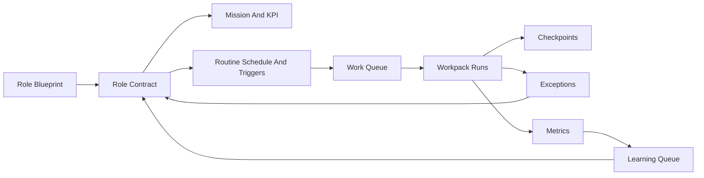

# 080 - Autonomous Team Monitor And Persistent Role Agents

Version: 1.1
Date: 2026-04-10
Status: Proposed
Depends-on: 075-unified-web-desktop-agent-platform, 079-autonomous-work-transformation-platform, 051-team-room-reuse-chat-pipeline, 052-agency-swarm-full-capability, 053-agency-agentic-intelligence, 036-LiveBrowserExperience, 037-Task-First-Execution-Intelligence, 045-HybridSkillOrchestrator, 049-enterprise-notification-system, 064-skill-maintenance-lifecycle, 077-distributed-worker-fabric-completion
Audience: Product, Teams UX, Monitoring, Agency, Workflow, Runtime, Desktop Host, Security, Admin, QA

---

## 1. Executive summary

SmartAIHub should evolve from a product that can run tasks into a product that can operate a persistent AI organization.

Feature 079 defines the reusable automation unit: the **Workpack**.
Feature 080 defines the persistent operator layer above it: the **Role Agent** and the **Autonomous Team Monitor**.

The product outcome is:

- configure AI roles such as CEO support, HR operations, sales operations, storekeeping, finance operations, procurement, and customer support
- give each role a mission, recurring responsibilities, KPI targets, authority boundaries, and allowed workpack families
- let those roles communicate, delegate, and execute routine work continuously
- keep human involvement limited to consequence boundaries, new grants, repeated drift, or regulated actions
- improve the quality of work over time through replay, benchmarking, and gated self-improvement

This feature is not a request for one immortal chat thread or one infinite process.
Persistent autonomy should be **logical continuity with checkpoints, queues, schedules, and recovery**, not fragile month-long sessions.

The system should be able to run day and night, for weeks or months, because it can:

- wake on schedule or event
- resume from checkpoints
- detect drift or stalls
- recover safely
- route exceptions
- keep improving within policy

---

## 2. Problem statement

The repository already has strong ingredients for multi-agent work, but the current experience is still closer to bounded project runs than continuous operational ownership.

Current gaps:

- team roles are still generic and are not modeled as profession-grade recurring responsibilities
- rooms support collaboration, but not durable role contracts, recurring routines, or long-horizon objective tracking
- run controls are bounded by rounds, minutes, and manual advancement rather than durable operational continuity
- monitoring is run-centric and infra-centric, not role-centric and KPI-centric
- existing browser packs, workflow nodes, and blueprints are too generic for department-grade routine work
- skill improvement exists, but it is not yet tied to persistent role promotion, routine quality, and role-level maturity

Without this layer, SmartAIHub can automate many jobs, but it still falls short of being a native AI operating model where virtual workers own daily responsibilities with minimal supervision.

---

## 3. Goals

1. Introduce persistent role agents that can own recurring responsibilities across departments.
2. Provide a control-room monitor where operators can configure, observe, and govern AI roles as if they were an organization chart.
3. Let role agents talk to each other, delegate tasks, and coordinate through structured communication instead of ad hoc prompts.
4. Support schedule-driven and event-driven routine work, not just one-off jobs.
5. Keep human-in-the-loop limited to narrow, high-value boundaries.
6. Improve quality over time through replay, benchmark comparison, and gated self-improvement.
7. Preserve strong trust, budget, connector, and audit boundaries.
8. Avoid extra manual installation requirements by using SmartAIHub-managed web, desktop-host, and worker-fabric paths.
9. Survive long-running operation through checkpoints, watchdogs, resume flows, and idempotent routines.
10. Reuse Feature 079 workpacks as the canonical execution unit for role-owned work.

---

## 4. Non-goals

1. This feature does not promise unrestricted AGI-like autonomy.
2. This feature does not replace Feature 079 workpacks.
3. This feature does not remove approvals for payments, privileged admin changes, legal finalization, or other irreversible actions.
4. This feature does not require users to install OpenClaw, Python, Agency Swarm, or other extra runtimes manually.
5. This feature does not require one always-running in-memory process per role.
6. This feature does not allow a role agent to silently expand its own permissions, budgets, or connector grants.
7. This feature does not make "CEO" or other role labels equivalent to unlimited authority.
8. This feature does not create a second monitoring stack disconnected from existing team, run, and monitoring surfaces.

---

## 5. Current-codebase fit

| Existing area | Current truth | Gap this feature fills |
|---|---|---|
| `apps/web/server/services/teamService.ts` | Teams already have member definitions, autonomy defaults, and policy JSON envelopes | Add persistent role contracts, mission ownership, KPI targets, and allowed workpack families |
| `apps/web/server/routers/teamRoom.ts` | Rooms already support team and auto-team collaboration with intent routing | Add structured role-to-role communication, handoff types, and durable operational threads |
| `apps/web/server/routers/teamRun.ts` | Runs already support pause, resume, advance, and stop policies | Add persistent continuity, checkpoint/resume, watchdog recovery, and schedule/event triggers |
| `apps/web/client/src/components/orchestrator/RunMonitorPanel.tsx` | A live run monitor already exists | Expand to a role-centric control room with roster, mission status, KPI health, autonomy, and drift signals |
| `apps/web/server/routers/monitoring.ts` and `monitoringService.ts` | Monitoring already tracks events, snapshots, stuck checks, and alerts | Add role-level health, backlog, SLA, quality, and promotion telemetry |
| `apps/web/server/routers/workpack.ts` and workpack services | Feature 079 now exposes workpack detail, replay, readiness, promotion, rollout, and incident controls | Reuse those surfaces as the execution substrate and avoid inventing a second autonomy gate stack |
| `apps/web/shared/featureFlags.ts` and `tenantFeatureFlags.ts` | Tenant flags now expose `workpacksEnabled`, `workpackAutonomousPilot`, and `workpackOpsConsole` | Role autonomy must inherit those gates instead of introducing a parallel rollout taxonomy |
| `apps/web/client/src/pages/Workpack*.tsx` and admin rollout panels | Dedicated workpack control-plane and ops-console views already exist | Role monitor should deep-link into existing replay, exception, connector, and readiness surfaces |
| `apps/web/shared/teamBlueprints.ts` | Team blueprints exist but are broad and creative/research heavy | Add profession-grade role blueprints for operations departments |
| `apps/web/shared/browserSkills.ts` | Browser presets are generic | Add role-specific routine packs for daily operational work |
| `apps/web/shared/workflowWorkerRuntimeNodeTypes.ts` | Worker node vocabulary is still small | Add routine lifecycle nodes such as classify, route, approve, retry, handoff, and evaluate |
| `apps/web/server/services/skillStudioService.ts` and `skillUpgradeApplier.ts` | Improvement loops already exist | Add role-level learning queues, promotion gates, and safe auto-improvement rules |
| `apps/tauri-shell/src-tauri/src/desktop_worker_fabric.rs` | Desktop worker fabric already models identity, approval, budget, and token rotation | Reuse it for managed always-on local execution without requiring external installs |

Feature 080 should extend the current team stack rather than replace it.

---

## 6. Locked product decisions

1. **Role Agent is the canonical persistent worker identity.**
   - A role agent represents a durable business function, not a one-off run.

2. **Workpack remains the canonical execution unit.**
   - Role agents own routines and objectives.
   - Workpacks execute the bounded work safely.

3. **Persistence is logical, not process-bound.**
   - A role agent must survive restart, deploy, device loss, and queue recovery through checkpoints and durable state.

4. **Human-in-the-loop must stay exception-first.**
   - Humans should not babysit normal work.
   - They should step in only when policy, ambiguity, or consequence requires it.

5. **Every role agent needs an explicit authority envelope.**
   - Mission, KPI, connector scope, budget, write scope, autonomy tier, and escalation rules must be defined.

6. **Role-to-role communication must be typed and attributable.**
   - Internal communication is not an unbounded chat cloud.
   - Messages and handoffs must carry purpose, priority, provenance, and related work context.

7. **Self-improvement is evidence-backed and fail-closed.**
   - Low-risk changes may auto-apply only within policy.
   - Higher-risk changes require review, replay, or promotion gates.

8. **No-install managed posture is mandatory.**
   - The preferred product path must use SmartAIHub-managed web, desktop-host, and worker-fabric capabilities.

9. **Unknown, drifted, or low-confidence states fail closed.**
   - The system must open an exception, lower autonomy, or pause the routine instead of guessing.

10. **Role labels do not override safety policy.**
    - A "CEO agent" can coordinate priorities and summarize decisions, but it still cannot bypass payment, admin, or legal controls.

11. **Role-agent autonomy must inherit workpack rollout gates.**
    - A role routine may not outrun the tenant's `workpacksEnabled`, `workpackAutonomousPilot`, `workpackOpsConsole`, readiness, replay, or incident posture.

12. **Role monitoring should aggregate existing workpack evidence.**
    - Feature 080 should reuse workpack telemetry, replay, readiness, and incident records instead of creating a parallel ledger that can drift.

---

## 7. Relationship to Feature 079

| Concern | Feature 079 owns | Feature 080 owns |
|---|---|---|
| Case ingestion and normalization | Case -> playbook -> workpack lifecycle | Select which role should own the resulting routine |
| Execution unit | Workpack, workpack version, simulation, benchmark | Attach workpacks to role contracts and recurring routines |
| Exception handling | Exception inbox and replay links | Role-level triage, escalation, and staffing view |
| Improvement substrate | Skill, workflow, and pack improvement loop | Role maturity, promotion gates, and safe routine auto-tuning |
| Product monitor | Workpack detail and run control room | Organization monitor, role roster, and persistent control room |
| Runtime continuity | Run replay and background run support | Checkpointing, wakeups, watchdogs, and long-horizon continuity |

The boundary rule is simple:

- Feature 079 answers: "What reusable unit of work should be automated, and how do we prove it is safe?"
- Feature 080 answers: "Which AI role owns that work continuously, and how do we monitor it over time?"

---

## 8. Role operating model

### 8.1 Canonical objects

| Object | Purpose |
|---|---|
| Role Blueprint | Reusable starting template for one business function |
| Role Agent | Persistent AI identity assigned to a business function |
| Role Contract | Mission, KPI, authority envelope, schedule, and allowed workpack families |
| Routine | Recurring responsibility tied to a trigger or schedule |
| Work Queue | Active backlog of role-owned work items |
| Checkpoint | Durable continuity state used for resume and recovery |
| Handoff | Structured delegation from one role to another |
| Promotion Gate | Evidence-backed change in autonomy or authority posture |

### 8.2 First-wave role families

The first production role families should be low-risk, high-volume, and operationally repetitive:

- executive support
- HR operations
- sales operations
- customer support
- storekeeping and inventory coordination
- procurement coordination
- finance operations
- customer success operations

High-stakes, regulated, or externally binding roles should start in assisted or supervised modes even if the label sounds senior.

---

## 9. Product surfaces

| Surface | Purpose | Required behavior |
|---|---|---|
| Autonomous Team Monitor | Organization-wide control room | Show role roster, mission status, autonomy tier, backlog health, current activity, and exceptions |
| Role Agent Detail | Inspect one virtual worker | Show contract, routines, connectors, KPI, budget, memory posture, checkpoints, and learning queue |
| Mission Planner | Define what each role is responsible for | Model goals, KPI targets, routine ownership, escalation, and success definitions |
| Routine Scheduler | Configure recurring work | Support cron-like schedules, event triggers, SLAs, quiet hours, and recovery windows |
| Internal Comms Stream | Observe typed role-to-role communication | Show requests, handoffs, escalations, blockers, summaries, and approvals |
| Exception And Approval Inbox | Resolve blocked work | Reuse Feature 079 exception flows with role-aware context |
| Improvement Queue | Review role learning proposals | Show suggested workpack, skill, policy, or prompt updates with evidence |
| Replay And Shift Review | Inspect recent operational behavior | Replay runs, compare checkpoints, and review quality drift over time |

The monitor should feel like an AI operations center, not just a prettier run log.

---

## 10. Functional requirements

### 10.1 Role blueprint catalog

- The system must provide reusable blueprints for department-grade roles.
- Each blueprint must define:
  - role purpose
  - default mission
  - KPI categories
  - allowed workpack families
  - typical connectors
  - authority envelope defaults
  - exception patterns
  - default autonomy tier
- Blueprints must separate:
  - role title
  - practical authority
  - regulated boundaries
- A "CEO" blueprint should default to planning, review, prioritization, and cross-team coordination, not unrestricted external side effects.

### 10.2 Role contract and authority envelope

- Every activated role agent must have a contract that includes:
  - mission statement
  - owned routines
  - KPI and SLA targets
  - autonomy tier
  - budget policy
  - connector grants
  - allowed write scopes
  - approved workpack families
  - escalation contacts
  - quiet hours or restricted windows where relevant
- The contract must be versioned.
- Contract changes that expand power must be reviewable and audit-logged.
- The system must support different autonomy by routine, not only one autonomy flag for the whole role.
- A role contract may only approve workpack families that are already available to the tenant's workpack rollout posture.
- A role routine may request lower autonomy than the underlying workpack allows, but it may never request higher autonomy than the underlying workpack readiness state permits.
- Every routine must declare a workpack resolution policy:
  - `pinned_version`
  - `follow_benchmark_track`
  - `follow_latest_ready_in_family`
- Resolution must fail closed if no eligible workpack version satisfies:
  - tenant rollout posture
  - role contract authority envelope
  - current workpack readiness and incident state
  - trust and benchmark requirements
- A routine must not auto-adopt a newly promoted workpack version if the new version expands:
  - connector scope needs
  - side-effect class ceiling
  - budget envelope
  - regulated boundary exposure
- Every routine must define a rollback baseline so version resolution can return to the last safe workpack version or benchmark track after freeze, regression, or incident.

### 10.3 Routine programs, schedules, and triggers

- Role agents must support recurring routines triggered by:
  - time schedules
  - inbox polling
  - queue thresholds
  - connector events
  - exception follow-up timers
  - KPI breach conditions
- Each routine must bind to one or more workpack families.
- The scheduler must prevent duplicate or overlapping unsafe executions.
- Long-running daily operations should be modeled as many resumable routine cycles, not one infinite monolithic run.
- The canonical scheduler posture must be:
  - durable and persisted, not in-memory only
  - queue-backed, not dependent on one immortal process
  - lease-based for multi-node safety
  - idempotent for duplicate trigger delivery
- Every schedule or event wake must materialize a durable routine-cycle queue item before execution begins.
- Each routine must declare a concurrency policy:
  - `singleton`
  - `allow_overlap`
  - `partitioned_by_key`
- Duplicate wake events must coalesce through an idempotency key derived from role, routine, trigger window or event key, and selected workpack target.
- Multi-node deployment must rely on lease claiming or equivalent durable ownership semantics so only one worker owns a given routine cycle at a time.

### 10.4 Persistent execution model

- Every role agent must emit durable checkpoints containing:
  - current objective state
  - active queue summary
  - routine cursors
  - recent decisions
  - pending approvals
  - next wake conditions
- The platform must support:
  - heartbeat monitoring
  - watchdog restart
  - idle wakeup
  - safe resume after deploy or crash
  - stale-run quarantine
  - idempotent retry
- A role agent must be considered healthy only if its checkpoint freshness, queue progress, and error rate remain within policy.
- Every routine cycle must create a durable `role_routine_run` record that captures:
  - trigger source
  - selected workpack family
  - resolved workpack version
  - current cycle state
  - linked workpack run ids
  - checkpoint pointer
  - recovery status
- A checkpoint must always point to the active or last completed `role_routine_run`, not float independently of execution context.
- The system must be able to answer "what is this role doing now?" from `role_routine_run`, `role_checkpoint`, and linked workpack runs without reconstructing state from raw logs alone.

### 10.5 Autonomous Team Monitor

- The monitor must show for every role:
  - current status
  - autonomy tier
  - mission health
  - backlog depth
  - exception count
  - KPI trend
  - budget burn
  - last checkpoint
  - last successful outcome
  - current blockers
- The default layout should include:
  - left rail for role roster
  - center pane for mission timeline, queue, and conversation
  - right rail for health, policy, budget, and drift
  - lower pane for exceptions, learning queue, and replay shortcuts
- Operators must be able to pause one routine, one role, or the entire org slice without tearing down unrelated roles.

### 10.6 Role-to-role communication and delegation

- Internal communication must support typed intents such as:
  - request
  - handoff
  - escalate
  - dependency block
  - status summary
  - approval request
  - shared finding
- Each communication item must attach:
  - sender role
  - recipient role
  - related workpack or routine
  - priority
  - due state
  - provenance
- Freeform discussion is allowed, but actions may only be taken from attributable, typed messages or owned routines.
- Before delegated work can execute, the platform must evaluate a delegation authorization matrix that confirms:
  - the sender role is allowed to issue that delegation intent
  - the recipient role contract allows that class of work
  - the referenced workpack family is approved for the recipient routine
  - the resulting connector scopes do not exceed either role envelope
  - the resulting side-effect class does not exceed either role ceiling
  - the action remains attributable to a concrete typed message or owned routine
- If any delegation authorization check fails, execution must fail closed into an exception, approval, or incident path.
- Delegation transfers responsibility for one bounded task or routine cycle, not permanent authority expansion.

### 10.7 Memory and continuity

- Role agents must maintain:
  - role memory for long-lived preferences and known patterns
  - operational memory for active queues and current cycle state
  - shared organization memory for cross-role reference material
- Memory must preserve provenance and trust class.
- Memory compaction must keep enough structure for safe resume without forcing unbounded prompt growth.
- The platform must distinguish durable knowledge from temporary speculation.

### 10.8 Self-improvement and growth

- Role agents must propose improvements from:
  - successful runs
  - failed runs
  - repeated exceptions
  - KPI misses
  - drift detections
- Improvement proposals may target:
  - workpack selection rules
  - workpack versions
  - skill updates
  - browser packs
  - connector maps
  - prompts
  - policy thresholds
  - UI guidance
- Low-risk improvements may auto-apply only when:
  - replay still passes
  - benchmark score does not regress
  - authority envelope is unchanged
  - tenant policy allows auto-apply
- Role agents must not self-promote to broader authority without a promotion gate.
- Auto-applied improvements must not change the routine resolution policy, rollback baseline, or approved workpack family set without explicit review.

### 10.9 Human-in-the-loop minimization

- Human involvement should be limited to:
  - new connector grants
  - irreversible or externally binding actions
  - repeated low-confidence ambiguity
  - regulated boundaries
  - dangerous drift
  - role contract expansion
- Operators should review exceptions and promotions, not micromanage normal routine steps.
- The product should optimize for "human-on-the-boundary" instead of "human-on-every-task."

### 10.10 Safety, authority, and anti-runaway controls

- The platform must support:
  - emergency stop at tenant, org, role, and routine levels
  - budget ceilings
  - connector scope ceilings
  - side-effect class ceilings
  - loop detection
  - repeated-failure circuit breakers
  - drift-triggered downgrade
  - silent-period alerts for critical roles
- A role agent must never grant itself new secrets, new connector scopes, or broader budgets.
- Inter-role delegation must never be used to smuggle an action across a policy boundary.

### 10.11 Native managed runtime and no-install posture

- The preferred execution path must use existing SmartAIHub surfaces:
  - web control plane for orchestration and visibility
  - Desktop Host for managed local execution when locality is needed
  - worker fabric for distributed durable execution where appropriate
- The product should not require the user to stand up an external agent runtime manually just to get persistent role autonomy.
- If an external runtime is used, it must remain optional and policy-explicit.

### 10.12 KPI and outcome model

- The monitor must show:
  - throughput
  - intervention rate
  - exception rate
  - SLA hit rate
  - backlog age
  - quality score
  - replay pass rate
  - improvement velocity
  - autonomy promotion status
- KPI views must support slicing by:
  - role
  - department
  - routine
  - workpack family
  - runtime
  - connector
  - risk tier
- Role autonomy gates must distinguish:
  - hard blocks that prevent autonomous execution
  - downgrade triggers that reduce autonomy tier
  - promotion minima that must be met before expanding autonomy
- The minimum gate table must include:
  - workpack readiness blocked -> autonomous execution blocked
  - active workpack incident or promotion freeze -> routine paused or downgraded
  - replay pass rate below policy threshold over a rolling window -> downgrade one autonomy tier
  - exception rate above policy threshold over a rolling window -> promotion blocked and review required
  - repeated KPI misses over a policy-defined streak -> downgrade to supervised review
  - checkpoint freshness outside heartbeat policy -> quarantine until safe resume review
- Threshold values may be tenant-configurable, but these gate categories must exist in product defaults and remain audit-visible.

### 10.13 Workpack rollout inheritance

- Feature 080 must consume Feature 079 rollout state rather than inventing a second rollout gate system.
- Role-controlled autonomous execution must remain blocked when:
  - `workpacksEnabled` is false for the tenant
  - `workpackAutonomousPilot` is false for the tenant
  - the selected workpack family is not readiness-approved
  - the selected workpack is under incident stop or promotion freeze
- The role monitor must surface:
  - underlying workpack readiness blockers
  - current workpack incident state
  - replay and benchmark posture for the routines a role depends on
- Role-level emergency stop must fan into existing workpack incident controls rather than creating a disconnected kill-switch path.
- Workpack family resolution for a role routine must follow this order:
  - contract-pinned version when present
  - approved benchmark track when configured
  - latest readiness-approved version in family
  - otherwise fail closed
- Any automatic change in resolved workpack version must:
  - create a new routine-cycle boundary
  - be audit-logged
  - preserve a rollback target
  - inherit the lower of the role routine autonomy and resolved workpack autonomy posture

---

## 11. Data model

| Entity | Purpose | Notes |
|---|---|---|
| `role_blueprint` | Reusable role starter | Defines category, scope, and default envelopes |
| `role_agent` | Persistent AI worker identity | One logical worker for one business function |
| `role_contract` | Authority and mission definition | Versioned, reviewable, and auditable |
| `role_workpack_binding` | Version-resolution policy | Binds family, resolution mode, and rollback baseline |
| `role_routine` | Recurring responsibility | Binds schedule or event trigger to workpack family |
| `role_routine_run` | One routine cycle | Links trigger, resolved workpack version, and current cycle state |
| `role_checkpoint` | Resume state | Used for recovery and long-horizon continuity and points to routine-run context |
| `role_message` | Structured internal communication | Typed, attributable, and linked to work context |
| `role_handoff` | Cross-role delegation record | Tracks ownership transfer and outcome |
| `role_metric_snapshot` | KPI and health telemetry | Used by the monitor and promotion logic |
| `role_exception_binding` | Role-aware exception view | Links role ownership to Feature 079 exceptions |
| `role_improvement_proposal` | Learning recommendation | Can target packs, skills, prompts, or policy |
| `role_promotion_gate` | Autonomy or authority change decision | Evidence-backed and reversible |

---

## 12. Integration points

### 12.1 Workpack execution

- Feature 079 workpacks must be the default execution substrate for recurring role work.
- Role agents should select from approved workpack families instead of inventing freeform execution paths for routine work.
- `role_routine_run` records must preserve the selected workpack version and linked workpack run ids so the role layer stays explainable and auditable.

### 12.2 Team rooms and messaging

- Existing team room concepts should evolve into durable role threads and typed internal communication streams.
- Room history should remain viewable as part of role accountability and replay.

### 12.3 Run monitor and monitoring services

- Existing run telemetry should feed the role monitor.
- The role monitor should aggregate many workpack runs into one operational role view.

### 12.4 Desktop Host and worker fabric

- Desktop Host should be the preferred managed path for local role work such as file-heavy and app-heavy routines.
- Worker fabric should carry long-running distributed work where server-side or remote execution is the better fit.

### 12.5 Browser and live-browser surfaces

- Browser-heavy routines should reuse existing browser policy and live-browser approval semantics.
- Browser takeover remains an exception path, not the default operating mode.

### 12.6 Skill improvement lifecycle

- Role learning proposals should reuse the existing skill-maintenance lifecycle rather than invent a second patch pipeline.
- Role promotion must depend on replay and benchmark evidence, not prompt confidence alone.

### 12.7 Workpack rollout, readiness, and incidents

- The role layer should consume the existing workpack readiness, rollout-gate, and incident-control services as the first implementation substrate.
- The Autonomous Team Monitor should aggregate role posture from:
  - workpack readiness summaries
  - workpack telemetry summaries
  - workpack exception bindings
  - workpack incident controls
  - tenant feature-flag rollout posture
- Role autonomy must downgrade automatically when the underlying workpack substrate downgrades, freezes, or enters incident stop.

---

## 13. Security and governance

- Tenant isolation, trust class, device trust, and package trust inherited from Feature 075 must remain intact.
- Role agents must operate under least privilege.
- Every contract change, promotion, approval, exception, and auto-applied improvement must be audit-logged.
- Sensitive role memories must respect trust class and connector boundaries.
- Role-to-role communication must not become an ungoverned covert channel for policy bypass.
- If the system cannot explain why an action is allowed, it should not take the action.

Safe autonomy should come from tighter envelopes and better evidence, not from looser controls.

---

## 14. Rollout phases

### Phase 1 - Role monitor foundation

- role blueprint catalog
- role contract model
- role-aware monitor
- typed internal communications
- basic checkpoints and watchdogs
- consume existing workpack readiness and rollout state instead of building parallel gates

Exit criteria:

- operators can create department-grade role agents
- role status, checkpoint freshness, and exception posture are visible in one control room

### Phase 2 - Routine ownership

- routine scheduler
- event triggers
- workpack family binding
- role-aware exception routing
- department KPI views
- deep links from role monitor into existing workpack replay, exception, connector, and readiness surfaces

Exit criteria:

- selected roles can complete daily recurring routines with exception-only human intervention

### Phase 3 - Guarded autonomy and self-improvement

- replay-backed improvement proposals
- promotion gates
- auto-apply for low-risk routine tuning
- drift-triggered downgrade
- role autonomy inherited from workpack rollout and incident posture

Exit criteria:

- mature roles improve without unsafe self-expansion
- repeated human interventions decrease measurably over time

### Phase 4 - Long-horizon operating scale

- multi-department coordination
- org-level emergency controls
- stronger SLA and backlog analytics
- durable month-scale operation with restart tolerance

Exit criteria:

- selected departments can run continuously for extended periods through checkpoint/resume, not fragile immortal sessions

---

## 15. Acceptance criteria

1. An operator can create persistent AI roles for at least executive support, HR operations, sales operations, and storekeeping.
2. Each role can be assigned recurring responsibilities with schedules or event triggers.
3. Each role can own approved Feature 079 workpacks as its routine execution path.
4. The monitor shows role status, KPI trend, exception count, checkpoint freshness, and autonomy tier in one place.
5. Role agents can communicate and hand off work through typed, attributable messages.
6. The system can recover a role after restart or crash from durable checkpoints without losing routine continuity.
7. Humans only need to intervene for bounded exceptions, promotions, or authority changes.
8. Low-risk improvement proposals can be auto-applied only when replay and benchmark evidence still pass.
9. No extra manual external runtime installation is required for the preferred managed path.
10. High-risk or unexplained actions still fail closed.
11. The role layer respects tenant workpack rollout flags and never enables autonomous role execution when the workpack substrate is still gated off.
12. Role-level emergency stop and incident views reuse underlying workpack incident controls and do not split safety state across two systems.

---

## 16. Open questions

1. Which role families should be first-wave production defaults after executive support, HR ops, sales ops, and storekeeping?
2. Should role contracts live as first-class persisted entities, or be layered on top of existing team records initially?
3. Which implementation backend should host the canonical durable scheduler first, given that lease, idempotency, and durable queue semantics are now locked?
4. Which default threshold values should ship first for KPI misses, replay pass rate, exception rate, and checkpoint freshness?
5. How much role-to-role communication should be retained in hot context versus archived with checkpoints?

---

## 17. Final decision statement

SmartAIHub should standardize on this end-state:

- Workpacks are the reusable automation unit.
- Role agents are the persistent owners of recurring work.
- The Autonomous Team Monitor is the control room for AI organizations.
- Persistence comes from durable state, checkpoints, queues, and recovery, not fragile endless sessions.
- Human oversight stays narrow and high-value.
- Safe autonomy grows through replay, evidence, promotion gates, and least privilege.

This is the clearest path from today's bounded team runs to a native AI operating model that can genuinely take over routine departmental work with minimal human babysitting.
