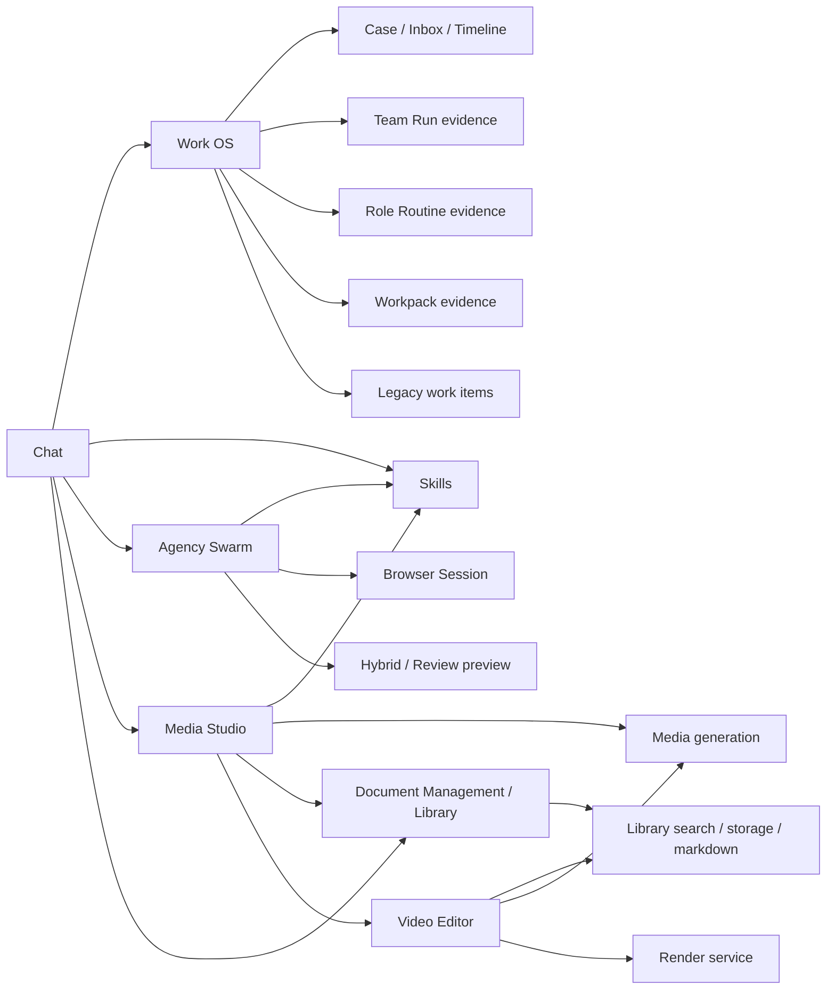

# Relationship Map: Work OS, Chat, Skills, Agency Swarm, Media Studio, Document Management, and Video Editor

This document captures the current runtime and data relationships between the major work surfaces in this feature area.

## Executive Summary

- `Chat` is the primary orchestration entry point for normal user intent.
- `Work OS` is the governance and evidence layer. It aggregates requests, cases, tasks, approvals, exceptions, outcomes, SLAs, and timeline evidence.
- `Skills` is the shared capability registry and execution layer.
- `Agency Swarm` is a multi-agent execution and review surface that can also export work into reusable skills.
- `Media Studio` is the media-generation workbench that reuses the shared skills and media pipelines.
- `Document Management` is the canonical library surface for documents and shared assets.
- `Video Editor` is a specialized consumer of media and library assets, backed by a dedicated render service.

The system is therefore best understood as:

- one orchestration entry point (`Chat`)
- one governance plane (`Work OS`)
- multiple execution surfaces (`Skills`, `Agency`, `Media Studio`, `Video Editor`)
- one canonical content layer (`Document Management` / `Library`)

## High-Level Flow

## Direct Relationships

### Chat

Chat is the central user-facing router.

- Skill detection and skill routing are handled directly in `ChatView`.
- Intent routing can escalate to agency or hybrid flows.
- Media generation models and library assets are available inside the chat surface.
- Document OCR assistance is available from the chat surface for attachments.
- Chat can present Work OS entry points for tracked work creation.

Relevant code:

- [ChatView.tsx](/home/dev/projects/SmartSpecPro/apps/web/client/src/components/chat/ChatView.tsx)
- [Chat.tsx](/home/dev/projects/SmartSpecPro/apps/web/client/src/pages/Chat.tsx)

### Work OS

Work OS is the canonical case ledger and evidence aggregator.

- It links request, case, task, approval, exception, outcome, SLA, and timeline records.
- It joins `team_run` and `role_routine` evidence into the same case timeline.
- It still preserves legacy work item events and workpack evidence.
- It is a governance console, not a direct executor for media or document workflows.

Relevant code:

- [workOsService.ts](/home/dev/projects/SmartSpecPro/apps/web/server/services/workOsService.ts)
- [AdminWorkOsDashboard.tsx](/home/dev/projects/SmartSpecPro/apps/web/client/src/pages/AdminWorkOsDashboard.tsx)
- [AdminMonitoring.tsx](/home/dev/projects/SmartSpecPro/apps/web/client/src/pages/AdminMonitoring.tsx)

### Skills

Skills are the shared execution primitive used by multiple surfaces.

- Chat uses skill detection and prompt enhancement.
- Media Studio uses skills for prompt enhancement and custom execution.
- Team runs can resolve and execute a real skill for a run turn.
- Agency tooling can export subgraphs as skills.

Relevant code:

- [publicSkillsApi.ts](/home/dev/projects/SmartSpecPro/apps/web/server/routes/publicSkillsApi.ts)
- [skillRegistry.ts](/home/dev/projects/SmartSpecPro/apps/web/server/services/skillRegistry.ts)
- [ChatView.tsx](/home/dev/projects/SmartSpecPro/apps/web/client/src/components/chat/ChatView.tsx)
- [MediaStudio.tsx](/home/dev/projects/SmartSpecPro/apps/web/client/src/pages/MediaStudio.tsx)
- [teamRunSkillExecutor.ts](/home/dev/projects/SmartSpecPro/apps/web/server/services/teamRunSkillExecutor.ts)
- [ExportAsSkillDialog.tsx](/home/dev/projects/SmartSpecPro/apps/web/client/src/components/agency/ExportAsSkillDialog.tsx)

### Agency Swarm

Agency is a multi-agent execution environment with review and preview flows.

- It runs its own stream and browser-session flow.
- It exposes review, hybrid preview, and browser command interactions.
- It reuses skills as a shared execution substrate.
- It can produce a reusable skill definition from a subgraph, although that export path is currently present as a component but not yet wired into the builder UI.

Relevant code:

- [AgencyChat.tsx](/home/dev/projects/SmartSpecPro/apps/web/client/src/pages/AgencyChat.tsx)
- [AgencyBrowser.tsx](/home/dev/projects/SmartSpecPro/apps/web/client/src/pages/AgencyBrowser.tsx)
- [AgencyBuilder.tsx](/home/dev/projects/SmartSpecPro/apps/web/client/src/pages/AgencyBuilder.tsx)
- [ExportAsSkillDialog.tsx](/home/dev/projects/SmartSpecPro/apps/web/client/src/components/agency/ExportAsSkillDialog.tsx)

### Media Studio

Media Studio is the specialized generation workspace for image, video, and audio.

- It reuses the shared skills registry.
- It can call the media generation API directly.
- It can attach and search library assets.
- It can hand off render work to the video editor service.

Relevant code:

- [MediaStudio.tsx](/home/dev/projects/SmartSpecPro/apps/web/client/src/pages/MediaStudio.tsx)
- [videoEditorService.ts](/home/dev/projects/SmartSpecPro/apps/web/client/src/services/videoEditorService.ts)

### Document Management

Document Management is the canonical library and document-editing surface.

- It owns list/search/upload/import/share/reindex flows.
- It is the source of truth for documents, folders, public share links, and markdown editing.
- Chat and Media Studio both query the library as a shared asset layer.

Relevant code:

- [DocumentManagement.tsx](/home/dev/projects/SmartSpecPro/apps/web/client/src/pages/DocumentManagement.tsx)

### Video Editor

Video Editor is a specialized consumer of the library and media systems.

- It uses the media library service to fetch/download generated assets.
- It uses the video render service to create render jobs.
- It persists projects through `videoEditorProjects`.
- It depends on the same shared library assets that Media Studio and Document Management expose.

Relevant code:

- [VideoEditorPhase3.tsx](/home/dev/projects/SmartSpecPro/apps/web/client/src/components/videoeditor/VideoEditorPhase3.tsx)
- [videoEditorService.ts](/home/dev/projects/SmartSpecPro/apps/web/client/src/services/videoEditorService.ts)

## Relationship Matrix

| Source | Targets | Relationship type |
| --- | --- | --- |
| Chat | Work OS | Direct entry + orchestration |
| Chat | Skills | Direct detection / enhancement / execution |
| Chat | Agency Swarm | Direct escalation / hybrid routing |
| Chat | Media Studio | Direct media prompt and execution path |
| Chat | Document Management / Library | Direct search + attachment path |
| Work OS | Team Run / Role Routine / Workpack / Legacy events | Evidence aggregation |
| Skills | Chat / Media Studio / Team Run / Agency tooling | Shared capability registry |
| Agency Swarm | Skills | Shared execution substrate |
| Agency Swarm | Browser Session | Direct runtime integration |
| Media Studio | Skills / Media APIs / Library / Video Editor | Shared generation workspace |
| Document Management | Library / Google Drive / OneDrive / Presentation / Workbench | Canonical storage and editing |
| Video Editor | Media / Library / Render service | Specialized consumer |

## What Is Direct vs Indirect

### Direct

- `Chat` directly calls skill detection, analyze-intent, prompt enhancement, media models, library search, and document OCR helpers.
- `Work OS` directly builds the case timeline from multiple event sources.
- `Media Studio` directly calls skills and media generation mutations.
- `Video Editor` directly uses the media library service and render service.
- `Agency` directly uses browser session, preview token, and skill-driven flows.

### Indirect

- `Work OS` does not directly execute media generation or document editing. It only tracks and aggregates the result.
- `Document Management` is shared as a library substrate, not as an orchestration layer.
- `Agency` can become a skill producer, but that export path is not yet wired through the builder UI.

## Current Integration Gaps

These are the main gaps still visible in the current codebase:

1. `Work OS` is not yet the runtime controller for media/document/video jobs. It is still primarily a ledger and console.
2. `ExportAsSkillDialog` exists, but it is not currently imported by `AgencyBuilder`, so the agency-to-skill export bridge is incomplete in the UI.
3. `Video Editor` consumes media/library assets, but it is not yet orchestrated through Work OS evidence or case lifecycle in a first-class way.
4. `Document Management` and `Media Studio` share assets, but their linkage is pragmatic rather than unified under a single content orchestration contract.

## Practical Reading Order

If you want to understand the system quickly, read in this order:

1. `Chat`
2. `Work OS`
3. `Skills`
4. `Agency Swarm`
5. `Media Studio`
6. `Document Management`
7. `Video Editor`

That matches the order in which work tends to enter, get routed, and then land in one of the specialized execution surfaces.
