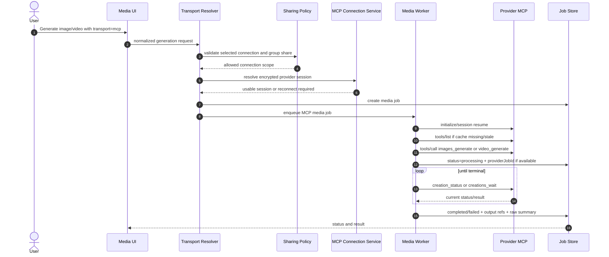

# Feature 121: MCP Connect for User and Group Media Provider Accounts

**Version:** 1.2.0
**Date:** 2026-06-18
**Status:** Draft
**Builds on:** Feature 043 (Public API & External Agent Gateway), Feature 057 (MCP Security Context Optimization), Feature 071/074 (MCP platform access), Feature 110 (Magnific Media Provider Models)
**Principle:** Add user-managed remote MCP connections as an optional media generation transport alongside the existing gateway/API path, starting with Magnific and Higgsfield.

---

## 1. Goal

SmartSpecPro must let each user connect external MCP servers from media providers and use those connected accounts to generate images and videos. This is an additional option beside the existing provider API gateway path.

This feature is **hybrid by design**:

- `gateway_api` remains fully supported and remains the default for existing jobs, provider API keys, backend batch work, public API calls, and automation that needs strict server-side control.
- `mcp` is added as a second transport for user-connected provider accounts, provider-native creative workflows, account history access, and OAuth-based provider usage.
- The v1 scoped UI/automation surfaces must be able to use either transport without forking the media generation experience into two unrelated products; non-v1 surfaces stay on `gateway_api` until explicitly expanded.
- No existing API/gateway provider should regress, disappear, or silently change billing behavior when MCP Connect is enabled.

Initial supported providers:

- **Magnific MCP**: `https://mcp.magnific.com`
- **Higgsfield MCP**: `https://mcp.higgsfield.ai/mcp`

Users manage connections from their own profile/settings page. After a one-time OAuth/sign-in flow succeeds, SmartSpecPro can invoke provider MCP tools immediately during image/video generation, subject to the user's own provider credits and provider limits.

Tenant/group sharing is required. A user may share a connected MCP account with selected groups so other users in those groups can use the same provider account for generation.

### 1.1 V1 Scope

V1 is intentionally narrow. Implement MCP Connect only where it directly improves the current media creation workflows:

- **Media Studio**: manual image/video generation with explicit transport and connection selection.
- **Auto Storyboard Review**: automated storyboard clip/image generation flow that originates from Media Studio/production planning.
- **Marketplace Capture**: product/marketplace-driven media generation where captured product context feeds image/video prompts.
- **Storyboard Review**: storyboard video generation and regeneration from reviewed storyboard prompts.

Everything else remains on `gateway_api` in v1, even if the shared router contract is designed to support future expansion.

### 1.2 Future Expansion

The following surfaces are explicitly out of v1 implementation scope but should remain compatible through `gateway_api` defaults:

- Presentation canvas property panel regeneration.
- Video Editor direct generation.
- Presentation Article Generator image/video generation.
- Generic workflow nodes and workflow execution.
- Work automation / production jobs outside Auto Storyboard Review.
- Public REST media API transport selection.
- Public SmartSpecPro MCP tool transport selection.
- Admin queue/audit UI beyond minimal transport metadata display for v1 jobs.

---

## 2. Non-Goals

- Do not replace the existing REST/API gateway path.
- Do not expose raw provider OAuth tokens, refresh tokens, MCP session IDs, or provider account identifiers to clients.
- Do not hardcode provider tool schemas beyond seed provider metadata. The provider MCP `tools/list` response is the runtime source of truth.
- Do not support arbitrary unaudited MCP servers in v1. Only allow provider templates approved by SmartSpecPro admins.
- Do not auto-share a user's provider account. Sharing is explicit and revocable.
- Do not retrofit every media generation surface in v1. Non-v1 surfaces must continue to work through the existing gateway/API path.

---

## 3. Product Requirements

### 3.1 Profile MCP Connections

Add a profile/settings area where a user can:

- view connected media MCP providers;
- add a connection from an approved provider list;
- complete the provider's OAuth/sign-in flow;
- test connection health and account balance where the MCP server exposes it;
- refresh/reconnect an expired connection;
- disconnect and revoke local access;
- set a default media transport preference: `gateway_api`, `mcp`, or `ask_each_time`;
- choose a default provider connection for image and video generation.

### 3.2 Media Generation Option

In v1, the four scoped image/video generation surfaces must expose or inherit a transport choice:

- **Gateway API**: existing SmartSpecPro gateway/API path.
- **MCP Connect**: use a selected connected provider account.

The same normalized SmartSpecPro generation request should drive both transports. The adapter maps normalized fields into either API endpoint parameters or MCP tool arguments.

Default behavior:

- If no transport is specified, use `gateway_api` to preserve current behavior.
- If the user chooses `mcp` and has exactly one eligible personal/shared connection for the selected provider/asset type, use that connection.
- If multiple eligible MCP connections exist, show a connection picker.
- If no eligible MCP connection exists, show a connect/reconnect action instead of hiding the generate button.
- If a v1 surface cannot safely expose a picker, it must pass through the user's profile/default workflow connection and return a clear `connection_required` error when no default exists.
- Non-v1 surfaces do not expose MCP controls yet and must continue to submit as `gateway_api`.

Transport/connection resolution priority:

1. Explicit per-job selection from the current UI surface.
2. Surface-scoped batch/default connection saved on the current storyboard/review/marketplace run.
3. User personal default for the selected provider and asset type.
4. Single eligible shared connection only when the surface is configured to allow shared defaults.
5. `ask_each_time` preference forces the UI to show a picker and prevents automatic MCP submission.
6. If no eligible MCP connection is resolved, return `connection_required` for MCP requests or use `gateway_api` only when transport was omitted.

Shared connections must never silently override a user's personal default. If both personal and shared defaults are eligible, personal default wins unless the user explicitly chooses the shared connection.

### 3.3 Group Sharing

Connection owners can share an MCP connection with selected groups.

Sharing controls must include:

- group selection;
- allowed asset types: image, video, or both;
- optional model/tool allowlist;
- optional credit/use budget at SmartSpecPro tracking layer;
- optional max concurrent jobs for the shared connection;
- share enabled/disabled state;
- audit-visible owner, group, and actor identity for every use.

Shared users can use the connection but cannot see secrets, OAuth tokens, raw provider sessions, or manage the provider account unless they own the connection.

### 3.4 First-Provider Capabilities

Magnific requirements:

- OAuth-backed remote MCP connection.
- Use `tools/list` to discover available tools.
- Prefer `images_generate` for image generation and `video_generate` for video generation when present.
- Use `creation_status` or `creations_wait` for async completion when available.
- Support browsing/reusing creations later, but v1 only requires generation and status.

Higgsfield requirements:

- Connect to `https://mcp.higgsfield.ai/mcp`.
- Sign in through the user's Higgsfield account.
- Support image and video generation.
- Treat generation as async; the worker polls provider results through MCP.
- Preserve support for provider-specific creative capabilities such as cinematic presets, product videos, Soul character workflows, and previous generation references when exposed by `tools/list`.

---

## 4. Architecture

### 4.1 Recommended Model

Use a hybrid API + MCP model:

- Existing gateway/API remains the production default for backend-controlled batch jobs, strict provider API calls, and high-control automation.
- MCP Connect is an additional user-account transport for provider-native creative workflows, agent-style generation, account history access, and provider accounts where OAuth is preferred over API keys.
- Transport selection is resolved at the SmartSpecPro media boundary, not by duplicating each UI flow into separate API-only and MCP-only screens.
- Both transports must write into the same task/result/history surfaces for v1 jobs wherever possible so users can compare jobs and retry/fallback without learning a separate queue.

### 4.2 Components

| Component | Responsibility |
|---|---|
| MCP Provider Registry | Approved provider templates, endpoints, auth type, supported asset types, expected tool hints |
| MCP Connection Service | Create, store, refresh, test, disconnect, and audit user connections |
| MCP OAuth Broker | Handles OAuth authorization/callback for provider MCP servers |
| MCP Session Store | Encrypted token/session storage, expiry, reauth state |
| MCP Tool Discovery Cache | Caches `tools/list` and input schema hashes per provider connection |
| Media Transport Resolver | Chooses `gateway_api` vs `mcp` based on request/user/group policy |
| MCP Media Adapter | Maps normalized generation requests to provider MCP tools |
| Shared Connection Policy Service | Enforces owner/group sharing rules |
| Media Job Worker | Executes MCP calls asynchronously and polls/waits for completion |
| Audit/Usage Logger | Records connection, sharing, generation, status, error, and budget events |

### 4.3 V1 Codebase Integration Matrix

The implementation must cover only the four v1 surfaces below. Start with the shared tRPC media boundary so these surfaces add transport/connection metadata without reimplementing provider calls.

| Surface | Existing path | Required MCP Connect behavior |
|---|---|---|
| Media Studio | `apps/web/client/src/pages/MediaStudio.tsx` uses `trpc.media.generateImageAsync` and `trpc.media.generateVideoAsync` | Add visible transport selector, connection picker, reconnect state, provider credit warning, and task badges showing API vs MCP |
| Auto Storyboard Review | `apps/web/client/src/pages/MarketplaceCaptureProductDetail.tsx`, `apps/web/server/routers/marketplaceCapture.ts`, `apps/web/server/services/marketplaceAutoReviewService.ts`, and production execution handoff through `scheduleProductionExecution` / `reconcileProductionExecution` | Use the selected/default transport only for scoped storyboard image/video generation jobs; persist transport metadata on run/stage output, generated media task IDs, and Storyboard Review handoff; show transport and provider credit source in batch/progress UI |
| Marketplace Capture | Product detail/media panel flows in `apps/web/client/src/pages/MarketplaceCaptureProductDetail.tsx` and marketplace capture router/service procedures that start or advance product-context media generation | Preserve product context in `extraParams`; allow transport selection/defaults only for marketplace-origin image/video jobs; display provider account used for each generated asset; keep capture evidence immutable and separate from MCP connection policy |
| Storyboard Review | `apps/web/client/src/pages/StoryboardReviewPage.tsx`, `apps/web/server/routers/videoEditorProjects.ts`, and shared storyboard review workspace helpers such as `apps/web/client/src/lib/storyboardReviewWorkspace.ts` | Preserve storyboard task model fields and add `transport/mcpConnectionId/sharedGroupId` to each submitted generation task; keep manual/imported review drafts on `gateway_api` unless the user explicitly selects MCP |

### 4.4 Future Integration Matrix

These surfaces are not implemented in v1. They must remain backward compatible by omitting `transport`, which defaults to `gateway_api`.

| Surface | Existing path | Future behavior |
|---|---|---|
| Presentation canvas property panel | `apps/web/client/src/presentation-canvas/components/PropertyPanel.tsx` regenerates selected image/video elements | Later: respect saved element transport metadata and offer compact connection picker |
| Video Editor | `apps/web/client/src/components/videoeditor/VideoEditorPhase3.tsx` generates images/videos for editor assets | Later: reuse transport resolver and show provider account in progress state |
| Presentation Article Generator | `apps/web/client/src/components/presentation/PresentationArticleGeneratorDialog.tsx` generates supporting images and slot videos | Later: use bundle/workflow default transport and show credit source in batch progress |
| Generic workflow nodes | `apps/web/client/src/components/workflow/config/DynamicNodeConfig.tsx` and workflow execution services | Later: add transport and optional connection fields to media node config |
| Work automation / production jobs | `apps/web/server/services/workAutomationExecutionService.ts` and production execution jobs | Later: use workflow owner/default connection only when explicitly configured |
| Public REST API | `apps/web/server/routes/publicMediaApi.ts` | Later: add MCP transport only after API-key policy and delegated connection rules are designed |
| Public SmartSpecPro MCP tools | `apps/web/server/_core/mcpRegistry.ts` exposes `smartspec.media.generate_image/video` | Later: add optional `transport` and `mcp_connection_id` |
| Admin queue/audit views | `apps/web/client/src/pages/AdminQueueMedia.tsx`, `AdminAuditLogs.tsx` | V1 may display transport metadata for scoped jobs only; richer filters can come later |

### 4.5 Existing Pattern Alignment

UI and services should reuse local patterns:

- Settings integration panels should follow the OAuth popup/status pattern used by Google Drive and OneDrive panels.
- Group sharing should reuse `user_groups`, `group_members`, `groups.list`, and active-membership semantics rather than creating a parallel group system.
- Media model controls should continue using `configJson.inputFields`, `apiConfig`, and `extraParams` for API models. MCP tool schemas should be adapted into the same dynamic input field layer where practical.
- Media task/result history should add `transport`, `mcpConnectionId`, `connectionOwnerUserId`, `actorUserId`, and `groupId` metadata instead of creating a separate MCP-only history.

### 4.6 Generation Flow



---

## 5. Normalized Request Contract

The media UI and workflow engine should submit a stable request shape. Provider adapters are responsible for transformation.

```ts
type MediaTransport = "gateway_api" | "mcp";
type MediaAssetType = "image" | "video";

interface MediaGenerationRequest {
  provider: "magnific" | "higgsfield" | string;
  // Defaults to gateway_api when omitted for backward compatibility.
  transport?: MediaTransport;
  mcpConnectionId?: string;
  // Required only when using a group-shared connection and the actor belongs
  // to multiple groups that can access the same connection.
  sharedGroupId?: number;
  assetType: MediaAssetType;
  prompt: string;
  negativePrompt?: string;
  model?: string;
  aspectRatio?: string;
  resolution?: string;
  durationSec?: number;
  fps?: number;
  seed?: number;
  guidance?: number;
  style?: Record<string, unknown>;
  referenceImages?: Array<{ url: string; role?: string }>;
  referenceVideos?: Array<{ url: string; role?: string }>;
  outputFormat?: string;
  // Existing callers may omit this; the router/service should derive one from
  // the request/job context where absent.
  idempotencyKey?: string;
}

interface MediaGenerationResult {
  jobId: string;
  provider: string;
  transport: MediaTransport;
  mcpConnectionId?: string;
  connectionOwnerUserId?: number;
  actorUserId?: number;
  sharedGroupId?: number;
  assetType: MediaAssetType;
  status: "queued" | "processing" | "completed" | "failed" | "cancelled";
  providerJobId?: string;
  previewUrls: string[];
  outputUrls: string[];
  warnings: string[];
  credits?: {
    providerReported?: number;
    smartspecTracked?: number;
  };
  rawProviderSummary?: Record<string, unknown>;
}
```

Mapping rules:

- `assetType=image` maps to an image generation MCP tool, initially `images_generate` when available.
- `assetType=video` maps to a video generation MCP tool, initially `video_generate` when available.
- Optional fields must be sent only if supported by the discovered tool `inputSchema`.
- Unsupported normalized fields should produce a validation error before provider execution unless a safe provider default exists.
- Store a schema hash with each job so support can trace which provider schema was used.
- Existing requests that omit `transport` must execute exactly as they do today through the gateway/API path.

### 5.1 Router and Service Contract

The first implementation should extend the existing async tRPC media procedures used by the scoped surfaces rather than creating a parallel UI-only path:

- `media.generateImageAsync`
- `media.generateVideoAsync`
- `media.getTask`
- `media.listTasks`
- `media.cancelTask`

Add optional input fields:

```ts
transport?: "gateway_api" | "mcp";
mcpConnectionId?: string;
sharedGroupId?: number;
idempotencyKey?: string;
```

Rules:

- The zod schemas must default `transport` to `gateway_api` when omitted.
- `mcpConnectionId` is rejected unless `transport === "mcp"`.
- `sharedGroupId` is rejected unless the selected connection is shared to that group and the actor is an active member.
- Existing `apiConfig` and `extraParams` remain valid for `gateway_api`.
- For `mcp`, `apiConfig` remains internal/derived metadata only; provider-specific MCP arguments come from normalized fields plus filtered `extraParams`.
- `generateImageAsync` and `generateVideoAsync` remain the primary async API for Media Studio and other UI surfaces.
- Synchronous `media.generateImage` and `media.generateVideo` are out of v1 MCP scope. They must continue to use `gateway_api`; if a caller passes `transport: "mcp"` later, return `transport_not_supported_for_sync` rather than falling back silently.
- Public REST and public SmartSpecPro MCP tools are out of v1 MCP transport scope. Existing clients that omit transport remain unchanged and keep using `gateway_api`.

### 5.2 Settings/Profile Connection Contract

Add a dedicated authenticated tRPC router for MCP connection management. Naming can follow local router conventions, but v1 must expose these capabilities:

| Procedure | Purpose |
|---|---|
| `mcpConnections.listProviderTemplates` | Return enabled provider templates, supported asset types, and feature-flag state |
| `mcpConnections.listConnections` | Return actor-visible personal and shared connections with safe labels and health metadata |
| `mcpConnections.startOAuth` | Create signed OAuth state/nonce and return provider authorization URL |
| `mcpConnections.completeOAuth` | Server-side callback handler that validates state/nonce and stores encrypted session reference |
| `mcpConnections.testConnection` | Health-check provider session, refresh tools/schema cache, and return safe status |
| `mcpConnections.reconnect` | Start OAuth reconnect for expired/revoked connection |
| `mcpConnections.disconnect` | Revoke/disable connection and block new jobs |
| `mcpConnections.updateDefaults` | Set per-user image/video defaults and `ask_each_time` preference |
| `mcpConnections.listShares` | Return owner-managed share rules for a connection |
| `mcpConnections.updateShare` | Create/update/disable a group share with owner acknowledgement |
| `mcpConnections.listUsage` | Return redacted owner/admin/actor-visible usage events with pagination |

Rules:

- All procedures require authenticated user context and tenant isolation.
- Public REST API and public SmartSpecPro MCP tools must not expose these connection-management procedures in v1.
- Responses must include only safe connection labels, provider key, health state, supported asset types/tools/models, owner display label, group label, and policy metadata.
- Responses must never include OAuth tokens, refresh tokens, provider session IDs, raw `tools/list` payloads, or raw provider account payloads.
- `listUsage` must paginate and filter by connection, actor, group, asset type, status, and date range.
- `updateShare` must validate active group membership/admin rights through existing group models and must reject cross-tenant groups.
- `disconnect` must set connection status to `revoked` or `disabled` before attempting provider-side revocation so SmartSpecPro blocks new jobs even if provider revocation fails.

### 5.3 Media Task Metadata

Every media task created by either transport must persist enough metadata for polling, retry, audit, and UI display:

```ts
interface MediaTaskTransportMetadata {
  transport: "gateway_api" | "mcp";
  provider: string;
  model?: string;
  mcpConnectionId?: string;
  connectionOwnerUserId?: number;
  actorUserId: number;
  sharedGroupId?: number;
  mcpToolName?: string;
  mcpSchemaHash?: string;
  providerJobId?: string;
  fallbackFromTransport?: "mcp";
  fallbackReason?: string;
  creditPolicy: "smartspec_credits" | "provider_credits_tracked";
}
```

If existing task/result JSON fields are sufficient, add tests proving this metadata survives create, poll, reload, list, and cancel for v1 surfaces. If not, add a migration before implementation proceeds.

Cancel semantics:

- `media.cancelTask` must mark the SmartSpecPro job cancelled immediately when the actor is authorized.
- If the provider MCP tool exposes cancellation, the worker should attempt provider-side cancel and record the outcome.
- If provider-side cancel is not supported or fails after the local cancel, SmartSpecPro must keep the local job cancelled, stop polling when safe, and audit `provider_cancel_unsupported` or `provider_cancel_failed`.
- Cancelling a queued MCP job must release local concurrency slots and tracked usage reservations.
- Cancelling a processing MCP job must release SmartSpecPro-side concurrency slots, but provider credits may still be consumed; UI must show this risk for MCP video jobs.
- Retries after cancel must create a new idempotency scope unless the previous provider call never started.

### 5.4 Credit Policy

V1 policy must be explicit and visible:

- `gateway_api`: keep current SmartSpecPro credit reservation/deduction/refund behavior unchanged.
- `mcp`: provider credits are consumed by the connected Magnific/Higgsfield account. SmartSpecPro does **not** deduct media generation credits by default in v1.
- SmartSpecPro must still track MCP usage events, estimated provider cost when exposed, job count, concurrency, and optional owner/group usage budgets.
- If a tenant wants to charge SmartSpecPro credits for MCP usage later, that is a separate policy flag and must be shown before generation.
- The UI must label the credit source as either `SmartSpecPro credits` or `{Provider} account credits`.
- Fallback from `mcp` to `gateway_api` is allowed only when the user/policy approves the credit-source change.

---

## 6. Data Model

Names are proposed. Implementation should align with existing Drizzle naming conventions and tenant/group schema.

### 6.1 `mcp_provider_templates`

Approved provider templates.

| Field | Type | Notes |
|---|---|---|
| `id` | uuid/string | Primary key |
| `providerKey` | text | `magnific`, `higgsfield` |
| `displayName` | text | Provider label |
| `mcpUrl` | text | Remote MCP endpoint |
| `authType` | text | `oauth` in v1 |
| `allowedAssetTypes` | json | image/video |
| `expectedToolHints` | json | e.g. `images_generate`, `video_generate` |
| `isEnabled` | boolean | Global rollout control |
| `createdAt`, `updatedAt` | timestamp | Audit fields |

Constraints and indexes:

- unique `providerKey`;
- unique `mcpUrl`;
- index `isEnabled`;
- changes to `expectedToolHints` must invalidate compatible `mcp_tool_schema_cache` rows by schema hash or cache timestamp.

### 6.2 `user_mcp_connections`

User-owned provider connections.

| Field | Type | Notes |
|---|---|---|
| `id` | uuid/string | Primary key |
| `tenantId` | string | Tenant isolation |
| `ownerUserId` | int | Connection owner |
| `providerTemplateId` | string | FK to template |
| `displayName` | text | User-defined label |
| `status` | text | `connected`, `requires_reauth`, `disabled`, `revoked`, `error` |
| `encryptedTokenRef` | text | Reference to encrypted OAuth/session payload |
| `providerAccountLabel` | text nullable | Safe label only, never raw secret |
| `providerAccountHash` | text nullable | Stable provider account/user hash for duplicate detection, never raw provider ID when sensitive |
| `tokenExpiresAt` | timestamp nullable | Expiry hint for proactive reconnect/refresh |
| `scopes` | json nullable | Granted provider scopes/capabilities, redacted to safe labels |
| `lastErrorCode` | text nullable | Last safe error code |
| `lastErrorAt` | timestamp nullable | Last safe error timestamp |
| `lastHealthCheckAt` | timestamp nullable | Health status |
| `lastToolDiscoveryAt` | timestamp nullable | Tools cache freshness |
| `defaultForImage` | boolean | Per-owner default |
| `defaultForVideo` | boolean | Per-owner default |
| `createdAt`, `updatedAt`, `revokedAt` | timestamp | Lifecycle |

Constraints and indexes:

- FK `providerTemplateId` to `mcp_provider_templates.id`;
- index `(tenantId, ownerUserId, status)`;
- index `(tenantId, providerTemplateId, status)`;
- index `(tenantId, providerTemplateId, providerAccountHash)` for duplicate-account warnings;
- index `tokenExpiresAt` for proactive health/reconnect checks;
- at most one active default image connection per `(tenantId, ownerUserId, providerTemplateId)` when `defaultForImage = true`;
- at most one active default video connection per `(tenantId, ownerUserId, providerTemplateId)` when `defaultForVideo = true`;
- revoked connections must keep audit metadata but must not be returned as eligible connections.

### 6.3 `mcp_connection_group_shares`

Explicit group sharing.

| Field | Type | Notes |
|---|---|---|
| `id` | uuid/string | Primary key |
| `tenantId` | string | Tenant isolation |
| `connectionId` | string | FK to `user_mcp_connections` |
| `groupId` | integer | FK to existing `user_groups.id` |
| `enabled` | boolean | Share switch |
| `allowedAssetTypes` | json | image/video |
| `allowedTools` | json nullable | Optional allowlist |
| `allowedModels` | json nullable | Optional allowlist |
| `dailyUseLimit` | int nullable | SmartSpecPro-side budget counter |
| `concurrencyLimit` | int nullable | Per shared connection limit |
| `requiresVideoApproval` | boolean | Require owner approval before shared users run video jobs |
| `dailyWindowTimezone` | text nullable | Defaults to tenant timezone, then owner timezone, then UTC |
| `createdByUserId` | int | Usually owner/admin |
| `createdAt`, `updatedAt`, `disabledAt`, `deletedAt` | timestamp | Audit/lifecycle fields |

Constraints and indexes:

- FK `connectionId` to `user_mcp_connections.id`;
- FK `groupId` to existing `user_groups.id`;
- unique active share per `(tenantId, connectionId, groupId)` where `deletedAt` is null;
- index `(tenantId, groupId, enabled)`;
- index `(tenantId, connectionId, enabled)`;
- disabling or deleting a share must block new jobs immediately while preserving past usage events.

Budget and concurrency semantics:

- `dailyUseLimit` counts SmartSpecPro-tracked generation starts by share, not provider invoices.
- The reset window uses `dailyWindowTimezone`; if null, resolve tenant timezone, then owner timezone, then UTC.
- Budget reservation must be atomic with job creation to prevent parallel overuse.
- Failed jobs still count unless provider execution never started.
- Cancelled queued jobs release the reservation; cancelled processing jobs remain counted because provider credits may already be consumed.
- `concurrencyLimit` counts queued and processing jobs for the shared connection and releases on terminal state.
- `requiresVideoApproval = true` is mandatory for shared video access in v1 unless tenant policy explicitly disables per-video approval.
- Owner approval is recorded as a usage event and must bind to connection, share, actor, asset type, prompt hash, and expiry.

### 6.4 `mcp_tool_schema_cache`

Runtime tool/schema cache.

| Field | Type | Notes |
|---|---|---|
| `id` | uuid/string | Primary key |
| `providerTemplateId` | string | Provider template |
| `connectionId` | string nullable | Optional per-connection override |
| `toolName` | text | MCP tool name |
| `inputSchema` | json | Raw schema |
| `schemaHash` | text | Deterministic hash |
| `lastSeenAt` | timestamp | Cache timestamp |
| `expiresAt` | timestamp | TTL |

Constraints and indexes:

- index `(providerTemplateId, toolName)`;
- index `(connectionId, toolName)` when connection-specific schemas are cached;
- index `expiresAt` for cache refresh scans;
- unique current schema per `(providerTemplateId, connectionId, toolName, schemaHash)`.

### 6.5 `mcp_connection_usage_events`

Audit and usage trail.

| Field | Type | Notes |
|---|---|---|
| `id` | uuid/string | Primary key |
| `tenantId` | string | Tenant isolation |
| `connectionId` | string | Used connection |
| `ownerUserId` | int | Provider account owner |
| `actorUserId` | int | User who triggered the job |
| `groupId` | integer nullable | Existing `user_groups.id` when usage comes from a shared group |
| `mediaJobId` | string nullable | Internal job |
| `provider` | text | Provider key |
| `toolName` | text nullable | MCP tool used |
| `assetType` | text | image/video |
| `eventType` | text | connect/share/generate/status/error/revoke |
| `status` | text | outcome |
| `metadata` | json | Redacted structured details |
| `createdAt` | timestamp | Event time |

Constraints and indexes:

- index `(tenantId, connectionId, createdAt)`;
- index `(tenantId, ownerUserId, createdAt)`;
- index `(tenantId, actorUserId, createdAt)`;
- index `(tenantId, groupId, createdAt)` for shared-account reporting;
- index `mediaJobId` for support traceability;
- `metadata` must be redacted before write and must not store raw OAuth tokens, provider session IDs, raw prompt references, or full provider responses.

### 6.6 `mcp_shared_video_approvals`

Owner approval record for shared video jobs.

| Field | Type | Notes |
|---|---|---|
| `id` | uuid/string | Primary key |
| `tenantId` | string | Tenant isolation |
| `connectionId` | string | FK to `user_mcp_connections` |
| `shareId` | string | FK to `mcp_connection_group_shares` |
| `groupId` | integer | Existing `user_groups.id` |
| `ownerUserId` | int | Provider account owner |
| `actorUserId` | int | Shared user requesting video generation |
| `assetType` | text | Must be `video` in v1 |
| `promptHash` | text | Hash of generation prompt/request summary |
| `requestSummary` | json | Redacted provider/model/duration/reference summary |
| `status` | text | `pending`, `approved`, `denied`, `expired`, `used` |
| `expiresAt` | timestamp | Short approval window |
| `usedMediaJobId` | string nullable | Job that consumed approval |
| `createdAt`, `updatedAt` | timestamp | Audit fields |

Rules:

- Approval records must not store raw prompt text, raw reference URLs, or provider secrets.
- One approval can be consumed by one media job only.
- Approval expiry defaults to 30 minutes.
- Approval consumption must be atomic with job creation.
- Denied/expired approvals must not reveal provider account details to the requester.

---

## 7. Authorization and Sharing Rules

Rules must be fail-closed.

1. A connection can be used by its owner.
2. A non-owner can use a connection only if:
   - the connection belongs to the same tenant;
   - the connection status is `connected`;
   - the actor is currently an active member of a shared group through `group_members.status = "active"`;
   - the group share is enabled;
   - requested asset type/tool/model is allowed by the share policy;
   - connection-level concurrency and usage limits allow the job.
3. Only the owner or tenant admin can create/update/delete share rules.
4. Shared users cannot edit OAuth/session settings, reconnect, revoke, or view provider account private details.
5. Every shared usage event must record both `ownerUserId` and `actorUserId`.
6. Revoking a connection immediately disables owner and shared usage for new jobs.
7. Removing a user from a group immediately blocks new jobs through that group share. Running jobs may complete, but retries and follow-up tasks must re-check membership.
8. Creating or enabling a group share requires explicit owner acknowledgement that group members may consume the owner's provider account credits.
9. Group members must see a non-secret label such as `{Provider} account shared by {Owner display name}` and a credit-source label before generation.
10. Connection owners must be able to view usage grouped by actor, group, asset type, provider tool, date, and job status.
11. Tenant admins may view policy/audit metadata for shared usage but must not receive provider secrets or raw provider account session data.
12. Tenant admins can force-disable MCP Connect or group sharing for a tenant. Admin force-disable blocks new jobs immediately, leaves existing jobs to finish or fail according to normal cancellation rules, and writes an audit event.
13. In v1, shared video generation requires owner approval per job by default. A tenant admin may allow budget-only shared video access later through an explicit tenant policy flag, but the default beta behavior is per-job approval for shared video.

---

## 8. UI/UX Requirements

MCP Connect should feel like an additional account/transport option, not a separate product.

### 8.1 Settings / Profile

Add an `MCP Connect` panel under the existing Settings integrations area. It should follow the current integration panel pattern used by Google Drive and OneDrive:

- disconnected state with provider cards and `Connect` buttons;
- popup/OAuth flow with polling after popup close;
- connected state with status, provider account label, connection health, last checked time, and provider credit/balance if exposed;
- tabs or sections for `Overview`, `Tools`, `Sharing`, `Usage`, and `Settings`;
- reconnect state for expired/revoked OAuth;
- disconnect confirmation dialog;
- first-use disclosure with checkbox before enabling connect;
- per-user defaults for image/video transport and provider connection;
- group sharing editor using existing `groups.list` data.

The group sharing editor should show:

- selected groups with member count and actor role;
- allowed asset type toggles for image/video;
- optional model/tool allowlist controls;
- daily use limit and concurrency limit inputs;
- warning that shared users will consume the provider account's credits;
- explicit owner acknowledgement before first enabling a share, and again when increasing allowed asset types, limits, or video access;
- usage summary grouped by actor, group, date, asset type, status, and estimated provider cost when available;
- a “Private” state when no group is selected, matching existing marketplace sharing behavior.

### 8.2 Media Studio

Media Studio must expose transport selection near the model/provider controls:

- use a compact segmented control or select: `Gateway API` / `MCP Connect`;
- show the active credit source beside the Generate button;
- show connection picker only when `MCP Connect` is selected;
- include personal and shared connections in the picker, with badges such as `Owner`, `Shared`, group name, provider, and health;
- show connect/reconnect CTA inline when no eligible connection exists;
- preserve current model/dynamic-field UX for gateway API models;
- for MCP models/tools, adapt discovered `inputSchema` into the existing dynamic input field renderer where practical;
- hide raw MCP tool schema in normal mode; allow advanced/debug view only for admins or developer-mode users;
- show task badges and history filters for `API` vs `MCP`;
- make fallback from MCP to API visible before submission or as an explicit retry action after failure.

### 8.3 Auto Storyboard Review

Auto Storyboard Review must support MCP Connect only when the storyboard batch is created from a scoped flow:

- use the transport and connection selected in Media Studio or the storyboard setup step;
- show a single batch-level transport and provider-credit summary;
- record transport metadata per generated storyboard task;
- if the selected MCP connection becomes unavailable mid-batch, stop scheduling new clips and surface reconnect/fallback options.

### 8.4 Marketplace Capture

Marketplace Capture must support MCP Connect only for product-context image/video generation in v1:

- preserve marketplace product context in generation metadata;
- show whether generated assets used `Gateway API` or a named MCP connection;
- prevent marketplace evidence or scraped content from changing transport, connection, group share, or credit policy;
- keep product capture/sharing settings separate from MCP connection sharing settings, while reusing the same group list UI pattern.

### 8.5 Storyboard Review

Storyboard Review must support MCP Connect for video generation/regeneration from reviewed prompts:

- inherit transport metadata from the storyboard review draft when present;
- allow changing transport/connection for selected storyboard tasks before generation;
- show provider account, transport, and credit source in the generation progress state;
- preserve existing `gateway_api` behavior when metadata is missing.

### 8.6 Future Surface UX

Presentation canvas, Video Editor, Presentation Article Generator, generic workflow nodes, public API docs, and public SmartSpecPro MCP tool docs should not show MCP controls in v1. They may mention future support only in internal notes, not in user-facing controls.

### 8.7 Required UI States

Each relevant UI must handle:

- loading provider templates;
- empty provider list;
- not connected;
- OAuth popup blocked;
- connected;
- expired/reconnect required;
- provider credit exhausted or unknown;
- group share denied;
- no eligible connection for selected asset type/model;
- schema discovery loading/error;
- fallback available/not available;
- disabled by feature flag or tenant policy.

---

## 9. Security Requirements

- Encrypt OAuth tokens, refresh tokens, provider session data, and MCP session identifiers at rest using the existing secret management/encryption pattern.
- Never send provider secrets or raw session payloads to the browser.
- OAuth authorization must use signed `state`, nonce, short TTL, same-tenant/user binding, and replay protection.
- OAuth callback routes must validate redirect origin, provider template, state, nonce, tenant, and initiating user before storing any session reference.
- Provider redirect URIs must be allowlisted through existing Admin Settings/provider configuration UI or derived from the canonical app URL setting; user-supplied redirect URLs and MCP-specific env-file edits are not accepted.
- Popup callback responses must return only a success/error status and connection-safe label; token material stays server-side.
- Token refresh and reconnect flows must rotate stored session references when the provider supports rotation.
- Disconnect/revoke must mark SmartSpecPro connection status immediately and attempt provider-side revocation when the provider exposes it.
- Redact raw MCP responses before persisting `rawProviderSummary`.
- Validate all reference image/video URLs using the existing SSRF-safe URL validation pattern before forwarding to provider MCP tools.
- Prevent prompt/tool injection from modifying transport choice, connection ID, owner ID, group policy, budget, or destination.
- Cache `tools/list` with TTL and schema hash; refresh on schema mismatch or provider validation errors.
- Treat MCP tool descriptions and provider-returned content as untrusted external data.
- Implement idempotency at SmartSpecPro job level to avoid duplicate generations on MCP transport retries.
- Separate transport retry from tool retry; do not blindly replay `tools/call` after network uncertainty.
- Rate limit connection creation, OAuth callback attempts, health checks, and generation requests.
- Add audit events for connect, reconnect, disconnect, share create/update/delete, generation start, generation completion, failure, rate limit, and policy deny.
- Include an explicit disclosure before first connect: provider account credits may be consumed by SmartSpecPro jobs, and shared connections let selected group members consume that provider account.

Retention and privacy:

- Usage/audit events follow the existing tenant audit retention policy, with a minimum beta retention of 180 days unless tenant policy is stricter.
- Redacted `rawProviderSummary` is retained for 30 days by default and then purged or compacted to safe status/error codes.
- MCP tool schema snapshots are retained for 90 days or the latest 10 schema hashes per provider/tool, whichever is smaller.
- OAuth state/nonce records expire after 10 minutes and are deleted or marked consumed after callback.
- Prompt hashes and reference URL hashes may be retained for audit, but raw prompt/reference payloads must follow existing media job privacy rules and must not be copied into MCP usage events.

---

## 10. Error Handling

| Error | Expected Behavior |
|---|---|
| OAuth expired/revoked | Mark connection `requires_reauth`; block new jobs; tell user to reconnect |
| Provider MCP unavailable | Mark job retryable until budget exhausted; surface provider outage message |
| Tool missing | Refresh `tools/list`; if still missing, mark provider capability unavailable |
| Schema mismatch | Refresh schema cache and revalidate; do not submit unsafe arguments |
| Group share denied | Return authorization error without revealing connection details |
| Provider credit exhausted | Mark connection health warning; show provider credit/account message if safe |
| Async timeout | Move job to failed/stalled state with retry/dead-letter metadata |
| Duplicate idempotency key | Return existing job/result rather than creating a second provider generation |

---

## 11. Rollout Plan

Feature flags:

- `mcp_connect_enabled`
- `mcp_connect_magnific_enabled`
- `mcp_connect_higgsfield_enabled`
- `mcp_connect_group_sharing_enabled`
- `mcp_media_studio_enabled`
- `mcp_auto_storyboard_review_enabled`
- `mcp_marketplace_capture_enabled`
- `mcp_storyboard_review_enabled`
- `mcp_media_image_enabled`
- `mcp_media_video_enabled`
- `mcp_tool_schema_cache_enabled`
- `mcp_auto_fallback_to_gateway_api_enabled`
- `mcp_provider_credits_tracked_enabled`

Flag behavior:

- Global `mcp_connect_enabled` must be true before any MCP UI or server path is enabled.
- Provider flags gate both connection creation and generation eligibility for that provider.
- Surface flags gate only their named v1 surfaces; disabled surfaces continue omitting `transport` and therefore use `gateway_api`.
- Group sharing requires both `mcp_connect_group_sharing_enabled` and the selected surface flag.
- If a flag turns off after jobs are queued, running jobs may complete, but new retries/follow-up jobs must re-check flags.

Rollout phases:

1. **Internal alpha**: Settings connection management + Media Studio Magnific image generation only, no sharing.
2. **Scoped provider beta**: Media Studio image/video for Magnific and Higgsfield, still no sharing.
3. **Scoped workflow beta**: enable Auto Storyboard Review, Marketplace Capture, and Storyboard Review for selected tenants.
4. **Group sharing beta**: enable sharing for trusted internal groups with strict budgets on the four v1 surfaces only.
5. **Limited production**: allow selected customer tenants to connect and share for v1 surfaces.

Fallback rule:

- If MCP fails and the request does not require user-scoped provider history/account context, SmartSpecPro may offer fallback to gateway/API.
- Fallback must be visible in the job timeline and audit log. It must not silently switch provider accounts or consume different credits without user or policy approval.
- Single-item jobs may offer an explicit `Retry with Gateway API` action after showing the credit-source change.
- Batch jobs such as Auto Storyboard Review and Storyboard Review must stop scheduling new pending items when MCP becomes unavailable, keep completed items as-is, and ask for batch-level approval before retrying remaining items through `gateway_api`.
- A batch may contain mixed transports only when the user confirms the fallback for the remaining items; mixed batches must show per-item transport badges and batch-level summary counts.
- Marketplace Capture fallback must preserve product/run/evidence metadata and must not let scraped evidence or product payloads select the fallback policy.

---

## 11.1 Implementation Work Breakdown

Implementation should proceed in small vertical slices and keep `gateway_api` behavior green after each slice.

1. **Schema and seed data**
   - Add provider templates for Magnific and Higgsfield.
   - Add MCP connection, share, tool cache, and usage event tables with constraints/indexes from Section 6.
   - Add migration tests or schema assertions for tenant/group FK and indexes.
2. **Connection service and OAuth broker**
   - Implement provider-template validation, signed OAuth state/nonce, callback handling, encrypted session references, reconnect, disconnect, health check, and safe provider account labels.
   - Add audit events for connect/reconnect/disconnect and OAuth failures.
   - Implement Settings/Profile connection-management tRPC procedures before enabling UI controls.
3. **Transport resolver and MCP media adapter**
   - Extend async media request schemas with optional `transport`, `mcpConnectionId`, `sharedGroupId`, and `idempotencyKey`.
   - Default omitted transport to `gateway_api`.
   - Add MCP tool discovery, schema filtering, async status polling, idempotency, and redacted provider summaries.
4. **Settings/Profile UI**
   - Add `MCP Connect` integration panel following existing Google/OneDrive popup/status patterns.
   - Add personal defaults, group sharing, owner acknowledgement, and usage summary.
5. **Media Studio vertical slice**
   - Add transport selector, connection picker, credit-source label, reconnect CTA, task badges, and history metadata.
   - Verify image and video jobs work through both `gateway_api` and `mcp`.
6. **Scoped workflow slice**
   - Add transport metadata propagation for Auto Storyboard Review, Marketplace Capture, and Storyboard Review only.
   - Keep future surfaces on implicit `gateway_api`.
   - Add batch fallback behavior and per-item transport summaries.
7. **Audit, observability, and rollout**
   - Add metrics/log labels, operator-safe metadata display, docs, and staged feature flags.
   - Run focused regression gates before enabling group sharing.

---

## 12. Testing Requirements

### Unit Tests

- Provider registry allows only approved MCP URLs.
- Connection service encrypts token/session refs and never returns raw secrets.
- Transport resolver chooses `gateway_api` vs `mcp` according to request and defaults.
- Media router defaults omitted `transport` to `gateway_api`.
- Media router rejects `mcpConnectionId` when `transport` is not `mcp`.
- Media router forwards transport metadata into task metadata.
- Settings/Profile connection router returns safe labels and never returns raw provider session data.
- Transport resolver applies deterministic priority for explicit selection, surface default, personal default, shared default, and `ask_each_time`.
- `gateway_api` jobs keep existing credit reservation/refund behavior.
- `mcp` jobs track provider-credit usage without deducting SmartSpecPro media credits by default.
- Sharing policy allows owner usage.
- Sharing policy allows same-tenant group member usage.
- Sharing policy denies cross-tenant usage.
- Sharing policy denies non-member usage.
- Sharing policy denies removed/pending group members.
- Sharing policy enforces asset type, tool/model allowlists, use limit, and concurrency limit.
- Sharing policy enforces owner approval for shared video jobs in v1.
- Sharing policy blocks new jobs when tenant admin force-disables MCP Connect or group sharing.
- Budget reservations are atomic and release correctly for queued cancel vs processing cancel.
- MCP adapter filters arguments by discovered `inputSchema`.
- Schema cache refreshes on TTL expiry and schema mismatch.
- Idempotency prevents duplicate MCP jobs.
- Schema migrations create required FKs, unique constraints, partial/default indexes, and soft-delete/revoke behavior.
- Retention jobs purge/compact redacted provider summaries, OAuth state records, and old schema snapshots according to policy.

### Integration Tests

- User connects Magnific MCP, discovers tools, starts image job, polls completion.
- User connects Magnific MCP, starts video job, polls completion.
- User connects Higgsfield MCP, starts image job, polls completion.
- User connects Higgsfield MCP, starts video job, polls completion.
- Shared group member can generate using a shared connection without seeing secrets.
- Revoked share blocks future use immediately.
- Revoked provider connection blocks owner and shared use.
- Expired OAuth marks connection `requires_reauth`.
- Provider 429/5xx follows bounded retry/backoff.
- Provider cancel supported path records provider cancel result.
- Provider cancel unsupported path keeps local job cancelled and records audit metadata.
- Media Studio can submit image/video through `gateway_api` unchanged.
- Media Studio can submit image/video through `mcp` with selected personal connection.
- Media Studio can submit image/video through `mcp` with selected group-shared connection.
- Auto Storyboard Review uses selected/default MCP connection and records transport per task.
- Marketplace Capture product-context generation preserves marketplace context and cannot let evidence override transport policy.
- Storyboard Review generation/regeneration can use MCP connection metadata and falls back to `gateway_api` only with explicit approval.
- Presentation canvas, Video Editor, Presentation Article Generator, workflow nodes, Public REST API, and public SmartSpecPro MCP media tools remain backward compatible by omitting transport and using `gateway_api`.
- Auto Storyboard Review stops pending items when MCP becomes unavailable and resumes remaining items through `gateway_api` only after approval.
- Marketplace Capture fallback preserves product/run/evidence metadata and cannot be controlled by scraped payload content.
- Owner usage summary includes group member usage without exposing provider secrets.
- Tenant admin force-disable blocks new MCP jobs while preserving `gateway_api` jobs.
- Shared video job waits for owner approval and expires safely when approval is not granted.

### Security Tests

- Raw tokens/session IDs are absent from API responses, logs, audit metadata, and UI state.
- Cross-tenant connection IDs cannot be enumerated or used.
- Actor cannot bypass group sharing by submitting a connection ID directly.
- Prompt content cannot override selected connection, transport, group policy, or output destination.
- Reference URLs are SSRF-validated before provider execution.
- Web/API error messages do not leak provider token state or private provider account details.
- Fallback from `mcp` to `gateway_api` cannot happen silently when credit source changes.
- OAuth state/nonce replay fails.
- OAuth callback for a different tenant/user/provider template fails.
- Usage events do not contain raw prompts, raw reference URLs, provider account IDs, token refs, or raw provider responses.

### UI Tests

- Settings integrations tab renders `MCP Connect` provider cards, empty state, connect state, expired state, and disconnect dialog.
- Group sharing editor lists only actor-visible same-tenant groups.
- Group sharing editor stores integer `groupId` values matching `user_groups.id`.
- Media Studio transport selector is keyboard accessible and mobile safe.
- Connection picker distinguishes personal and shared connections with clear badges.
- Generate button disabled/error helper appears when `mcp` is selected but no eligible connection exists.
- Task/history cards display transport and credit source.
- Auto Storyboard Review and Storyboard Review batch progress show one transport/credit summary for the batch.
- Marketplace Capture media generation shows provider account and transport without mixing it into product sharing settings.

### E2E Release Gates

Before enabling beta tenants, add or extend Playwright coverage for:

- Settings/Profile: connect provider -> see connected state -> disconnect/reconnect state.
- Settings/Profile: owner shares connection to group -> group member sees eligible shared connection -> owner sees usage.
- Settings/Profile: tenant admin force-disables sharing -> group member no longer sees eligible shared connection.
- Media Studio: generate image/video with `gateway_api` unchanged.
- Media Studio: generate image/video with personal MCP connection.
- Media Studio: generate image/video with group-shared MCP connection.
- Auto Storyboard Review: start scoped batch with MCP, see batch credit source, stop pending items on connection failure, approve fallback for remaining items.
- Marketplace Capture: product detail generation keeps product context and transport/account labels separate from product sharing controls.
- Storyboard Review: selected tasks can regenerate with MCP, preserve gateway default when no metadata exists, and show explicit fallback confirmation.
- Mobile and desktop layouts for Settings/Profile, Media Studio, Marketplace Capture Product Detail, and Storyboard Review have no overlapping controls or clipped transport labels.

---

## 13. Observability

Metrics:

- `mcp_connection_connect_success_rate`
- `mcp_connection_reauth_rate`
- `mcp_generation_success_rate`
- `mcp_generation_failure_rate_by_provider`
- `mcp_generation_p50_p95_latency`
- `mcp_provider_429_rate`
- `mcp_schema_change_events`
- `mcp_shared_connection_usage_count`
- `mcp_shared_connection_policy_denied_count`
- `mcp_fallback_to_gateway_api_count`
- `mcp_provider_credit_exhausted_count`
- `mcp_generation_by_surface_count`

Metrics for generation, fallback, policy denied, and latency must include `originSurface` labels using `media_studio`, `auto_storyboard_review`, `marketplace_capture`, `storyboard_review`, or `unknown`.

Structured logs should include:

- `provider`
- `transport`
- `originSurface` with one of `media_studio`, `auto_storyboard_review`, `marketplace_capture`, `storyboard_review`, or `unknown`
- `connectionId`
- `ownerUserId`
- `actorUserId`
- `groupId`
- `toolName`
- `schemaHash`
- `assetType`
- `jobId`
- `providerJobId`
- `attemptCount`
- `errorClass`
- `latencyMs`
- `creditPolicy`

All logs must redact secrets and raw prompt/reference payloads according to existing privacy rules.

---

## 14. Provider Notes

### Magnific

Current docs describe Magnific MCP as a remote streamable HTTP MCP server at `https://mcp.magnific.com` with OAuth sign-in and shared provider credits. Tool names include account, creations, image, video, audio, 3D, folder, and space tools. For v1, SmartSpecPro should depend on live `tools/list` discovery and use image/video generation plus status/wait tools only.

Useful docs:

- Magnific MCP docs: https://docs.magnific.com/modelcontextprotocol
- Magnific MCP landing page: https://www.magnific.com/mcp
- Magnific API docs: https://docs.magnific.com/introduction

### Higgsfield

Current Higgsfield MCP docs expose the connector URL `https://mcp.higgsfield.ai/mcp`, sign-in through a Higgsfield account, async generation, provider credit usage, and access to image/video generation, cinematic presets, product video workflows, character training, virality tooling, and previous generation history. SmartSpecPro should start with image/video generation and treat advanced tools as optional capabilities discovered from `tools/list`.

Useful docs:

- Higgsfield MCP: https://higgsfield.ai/mcp

---

## 15. Implementation Notes

- Prefer reusing existing media job records if they already support provider/transport metadata. Add MCP-specific fields only where required.
- Keep provider MCP adapters separate from REST/API provider adapters.
- Use the existing Public API/media generation request shape where possible so UI and workflow code do not fork.
- Add a small provider registry seed for Magnific and Higgsfield.
- Make `MCP Connect` hidden unless both global and provider-specific feature flags are enabled.
- Add admin/tenant UI controls before enabling group sharing in production; provider setup and tenant rollout must be configurable through existing settings UI, not by editing env files.
- Add support docs in Thai and English before beta rollout.
- Update media tRPC input schemas before changing UI callers so existing surfaces can pass transport metadata consistently.
- Defer public docs and generated OpenAPI transport fields until public API transport support enters scope.
- Add minimal admin/audit visibility for `transport`, `provider`, `originSurface`, and `creditPolicy` for v1 jobs; richer filters can come later.
- Keep old saved workflow nodes and media element metadata valid by treating missing transport as `gateway_api`.

---

## 16. Open Questions

Resolved for v1:

- Tenant admins can force-disable MCP Connect and group sharing for a tenant.
- Shared video generation requires owner approval per job by default in v1.
- Retention defaults are defined in Section 9 and may be tightened by tenant policy.

Future questions:

1. Should arbitrary custom MCP URLs be allowed later for enterprise tenants, or should v1/v2 remain provider-template only?
2. Should provider balance/credit checks be mandatory before every MCP video job, or cached with short TTL to reduce provider calls?
3. Should later versions support tenant-paid SmartSpecPro credit overlays for MCP usage, or keep MCP billing purely provider-account based?
