# Feature 162 — Vertical Drama B-roll Media Intelligence and Worker-first Editing

**Status:** Proposed — implementation-ready design, PoC-first rollout<br>
**Date:** 2026-08-25<br>
**Primary owner:** Vertical Drama / Worker App / Media Pipeline
**Dependencies:** Feature 160 visual source and B-roll contracts, Feature 163 Worker App shell and Series binding, Worker App runtime, `@smartspec/remotion-render`, managed media storage

## 1. Executive decision

Add a Worker-first media preprocessing layer for Vertical Drama B-roll. The
browser expresses intent and reviews results; the Worker App performs probing,
analysis, GPU/CPU media processing, encoding, and QC; Remotion consumes only a
verified derived artifact and its manifest.

The source-footage boundary is explicitly local to the Worker App device. A
user-selected Series media folder is a local workspace on the computer where
the Worker App is installed; original video/image bytes are never uploaded to
the SmartAIHub server or R2 merely because they were discovered. The Worker
copies or receives uploads into that local workspace, performs probe, analysis,
dead-air editing, subject-aware reframing, encoding, and QC locally, and only
then uploads a verified derived artifact, manifest, preview, and approved
analysis metadata to R2/server storage. `SeriesID` is the project boundary in
the first release.

For ComfyUI-backed work, the production transport is **MCP-primary**: the
Worker App acts as a controlled MCP client and invokes the Official
`comfy-mcp` server, which in turn drives `comfy-cli` and ComfyUI. SmartAIHub
still owns job admission, tenant policy, workflow policy, billing, artifact
publication, and QC. Direct ComfyUI HTTP calls are an internal implementation
detail of `comfy-mcp`, not a browser or Worker production contract. A pinned
MCP tool manifest, capability probe, and versioned compatibility matrix are
required before a Worker may claim a ComfyUI job.

The feature exposes three user modes:

| Mode | What the user controls | What the system does |
|---|---|---|
| `guided` | Source, trim, focus, crop, motion, audio | Deterministic Worker processing using the explicit settings |
| `ai_assisted_review` | Goal and constraints; review proposed plan | LLM proposes a typed edit plan, Worker renders only after user approval |
| `automated_ai` | Goal, policy, budget and approval threshold | LLM proposes a typed edit plan; server validates it; Worker renders and auto-applies only when policy and QC gates pass |

`guided` is the default. `automated_ai` is opt-in per user/Series/episode/shot and
must never bypass the existing source-role, tenant, rights, duration, or
storage checks.

### Current runtime boundary

HyperFrames is a legacy/optional renderer and is not required by the current
Feature 162 media path. Local ingest, analysis, preprocessing, encoding, QC,
and derived-artifact publication use the Worker-selected native or Managed WSL
FFmpeg/FFprobe toolchain. Generated shot video uses the negotiated ComfyUI MCP
lane. HyperFrames may be reintroduced later as an independently gated renderer
when its runtime is production-ready.

## 2. Problem and desired outcome

Uploaded media is source material, not necessarily a render-ready B-roll clip.
Typical inputs include landscape video that must become 9:16, portrait video
with the subject outside the center, long footage containing dead air or
multiple scenes, frozen/blurred sections, and still images that need controlled
motion. Sending these inputs directly to the timeline produces bad crops,
awkward pauses, unstable framing, or clips that exceed the shot budget.

For each B-roll binding, the system must be able to:

1. inspect the source without changing the canonical upload;
2. find technically and semantically usable ranges;
3. fit the selected range into the authoritative shot duration budget;
4. keep the intended subject visible in a 9:16 frame with smooth movement;
5. turn a still image into a deterministic video artifact with subtle motion;
6. produce a new managed-media artifact on the Worker;
7. prove which source, analysis, plan, processor, model and settings produced it;
8. let the user review, override, retry, or replace the result;
9. keep Remotion focused on timeline/composition rather than raw-media repair.

The system must not claim that a clip is ready merely because an input URL
exists. Readiness requires a stored derived artifact, a valid manifest, and
technical QC.

## 3. Scope

### In scope

- Worker App job family for per-shot B-roll preprocessing.
- Media-specific `Media Workspace` surfaces mounted by Feature 163 for one
  local footage workspace per SeriesID: local folder scan, local upload,
  processing policy, queue, QC, and publication to managed storage. Feature
  163 owns the Sidebar, Series selector, binding wizard, and global Quick
  Actions that reach these surfaces.
- Local-only source-footage ingestion: copy-to-folder and Worker App upload
  both land on the Worker device before any processing; server-side source
  upload is not a fallback path for this feature.
- Typed generated-shot video path using an approved start frame, ordered
  reference-frame pack, optional last-frame/reference video/audio, and a
  capability-resolved Local AI Gateway route.
- Official ComfyUI MCP client/adapter, versioned workflow/model capability
  registry, GPU scheduler admission, execution correlation, output ingestion,
  and generated-shot QC; local MiniMax H3 is optional and probe-gated.
- MCP tool-manifest negotiation and
  MCP-primary execution/recovery for local, LAN, remote, and Cloud routes.
- Admin workflow policy configuration with per-operation defaults, allowed
  user override rules, version pinning, fallback/approval policy, and audit.
- User workflow selection at shot intent resolution time, including a compact
  per-shot override and a compatibility-filtered nine-shot batch override.
- Image-to-video motion rendering: push in, pull out, pan, and optional depth
  parallax when a valid depth map exists.
- Video trim and usable-range selection within a shot budget.
- Audio silence/dead-air analysis plus visual black/frozen/duplicate-frame
  analysis.
- Subject-aware vertical reframing with face/person/object/user-focus priority.
- Scene/keyframe analysis and optional semantic labels/embeddings.
- Automated AI editing mode with a schema-constrained LLM planner.
- Series-scoped media metadata index and vector retrieval for grounded draft
  generation and B-roll recommendations.
- Guided and AI-assisted UI for source selection, focus, trim, motion, preview,
  approval, progress, QC findings, retry, and artifact replacement.
- Durable artifact/version/cache contract and Remotion manifest integration.
- GPU capability detection, resource policy, CPU fallback policy, and metrics.
- Tenant/user/rights/storage validation inherited from existing B-roll contracts.
- Tests, benchmark fixtures, failure taxonomy, rollout flags, and auditability.

### Out of scope

- Replacing Remotion timeline, subtitle, transition, overlay, or final episode
  composition.
- Generating new story/script content.
- Editing the canonical uploaded media in place.
- Arbitrary LLM shell, FFmpeg, filesystem, browser, or code execution.
- Fully autonomous publishing of source media to public Gallery.
- Server-side processing of original footage or server-side transcoding before
  Worker publication.
- Training or installing a MiniMax H3 model/checkpoint as part of this feature;
  the feature only defines the adapter and capability contract.
- Training a new vision model or requiring Mojo for the first production path.
- Replacing Feature 160's distinction between `reference`, `scene_anchor`,
  `b_roll_still`, and `b_roll_footage`.

## 4. Existing contracts to preserve

The implementation must extend, not fork, the existing boundaries:

- `specs/feature/160-vertical-drama-prompt-expansion-and-visual-source-assets/`
  remains the source-role and B-roll binding authority.
- `apps/web/server/services/verticalDramaBrollService.ts` remains responsible
  for role separation, exact bounds, stale revisions, and timeline projection.
- `apps/web/shared/verticalDramaSeries/visualSource.ts` remains the shared
  visual-source type/schema boundary.
- `apps/web/shared/workerRuntime.ts` remains the shared Worker capability and
  job-contract boundary; browser code must not import Node-only executors.
- `packages/remotion-render/src/remotionRenderVideoSchema.ts` and
  `renderVideoJob.ts` remain the Remotion render contract and artifact pipeline.
- `apps/worker-app` remains the execution boundary for local files, bundled
  FFmpeg/FFprobe, runtime capability, device authorization, and artifact upload.
- Managed storage references, checksums, short-lived download/upload URLs, and
  server-side tenant ownership checks remain mandatory.

The new preprocessing artifact is an explicit projection consumed by a B-roll
binding. It is not a new kind of image reference and it does not silently
replace a generated primary episode clip.

## 5. Target architecture

```mermaid
flowchart LR
  A[Shot + story intent + duration budget] --> B[Series Media Workspace]
  B --> C[Worker-local footage root / Worker upload]
  C --> D[Local scan + fingerprint + probe]
  D --> E[Server validation + job enqueue]
  E --> F[Worker claim]
  F --> G[Local scene/audio/visual analysis]
  G --> H{Editing mode}
  H -->|guided| I[Validated explicit plan]
  H -->|AI assisted / automated| J[LLM planner from bounded local analysis]
  J --> K[Schema + domain + budget validation]
  K --> L{Review policy}
  L -->|needs approval| M[UI review]
  M --> I
  L -->|auto approved| I
  I --> N[Local GPU/CPU preprocess + encode]
  N --> O[Local technical QC + manifest]
  O --> P[Upload verified derived artifact to R2]
  P --> Q[Series metadata + vector index]
  Q --> R[Shot B-roll binding / grounded draft]
  R --> S[Remotion timeline/composition]
```



For generated shot video, the unified execution boundary is:

```text
Drama Shot Intent
  -> Local AI Gateway (typed operation/capability selection)
  -> ComfyUI Workflow Registry + Model Registry
  -> Worker GPU scheduler + ComfyUI MCP adapter
  -> start/reference materialization
  -> generated shot artifact + QC
  -> Media Intelligence Worker (FFmpeg I/O, subject reframe, dead-air, color)
  -> optional MojoProcessor for measured hot paths
  -> Remotion composition and final episode artifact
```

The responsibilities are intentionally separated: Python/server code controls
policy, validation, job state, orchestration, and the durable metadata/vector
index; the Worker App owns the local source root, source bytes, FFmpeg/ffprobe,
local analysis, GPU/CPU processing, and the upload boundary; AI/VLM/LLM
components understand or generate within registered operations; ComfyUI owns
graph-based generation behind the Official ComfyUI MCP boundary; Mojo is an optional accelerator
behind the same `MediaProcessor` interface; and Remotion only composes approved
managed media. No layer may bypass tenant authorization, the Worker resource
lease, the local-root allowlist, the post-QC publication gate, or the artifact
manifest. The server may receive only bounded probe/analysis metadata and
verified derived outputs for this source-footage flow; it must not request or
fetch the original local path.

### 5.1 Unified shot asset resolver and execution targets

Every shot resolves visual requirements through one server-authoritative
`ShotAssetResolver`. It receives the shot intent, authoritative duration,
continuity state, visual-source snapshot, privacy policy, and available Worker
capabilities. It produces a typed `ShotAssetResolution` rather than choosing a
provider in the browser:

```text
approved generated/real asset
  -> approved start frame/reference pack when generation is required
  -> local B-roll segment and derived artifact when editorial footage exists
  -> local ComfyUI generation when capability and privacy allow
  -> approved provider/cloud route when policy allows
  -> needs_review / blocked when no safe route satisfies the contract
```

The resolver must preserve Feature 160 semantic roles and must never silently
convert a `reference` into B-roll, a B-roll segment into a generation
reference, or a generated primary shot into a B-roll binding. A user can make
such a conversion only through an explicit action that creates a new typed
projection and records the source artifact/revision.

At episode level, `EpisodeResourcePlan` is computed before a nine-shot batch:

```text
episode/shot revisions, target durations, asset requirements
  -> estimated analysis/generation/preprocess jobs
  -> estimated VRAM/RAM/disk/GPU minutes and provider credits
  -> model/workflow affinity and concurrency plan
  -> per-shot queue priority, approval gates, and fallback policy
```

The plan is advisory until each shot is validated at submission time. A later
capability change, resource shortfall, privacy change, or stale shot revision
must invalidate the affected plan rather than dispatching with old assumptions.

Supported execution targets are capability records, not UI assumptions:

| Target | Required evidence | Permitted role |
|---|---|---|
| native Windows Worker | authorized device, GPU/encoder/runtime probe | local ComfyUI and media processing |
| WSL2 Worker | WSL health, GPU pass-through, disk/workspace probe | local ComfyUI and media processing |
| LAN GPU Worker | authenticated Worker registration, network reachability, capability snapshot | remote local execution |
| ComfyUI Cloud/remote | approved endpoint, route/privacy policy, signed output handling | remote workflow execution |
| external provider | model capability, privacy/credit policy, managed-media response | fallback generation only |

The default route is the lowest-cost authorized target that satisfies the
capability and privacy contract. Route changes are visible before submission
and recorded after execution. ComfyUI is an execution engine and workflow
viewer for operators, not a required end-user UI.

### 5.2 Human approval checkpoints

The production path has explicit checkpoints, each with an immutable revision:

1. **Casting/character/reference pack** — identity and appearance references
   are approved or marked user-supplied.
2. **Storyboard and shot intent** — shot duration, action, camera, and visual
   requirements are approved.
3. **Start frame/keyframe** — exactly one start frame per generated shot is
   approved; a contact sheet is only a planning surface, not the final input.
4. **Generated shot video** — output passes technical/identity/scene QC and is
   approved or enters review.
5. **B-roll preprocessing** — derived artifact passes technical/reframe/audio
   QC and is explicitly bound to the shot.
6. **Final episode** — Remotion receives only the approved snapshot/artifact
   set and final gate can reject stale or missing media.

`guided` may allow the user to bypass an AI proposal, but it may not bypass
ownership, capability, artifact, or QC gates. `automated_ai` may auto-advance
only the checkpoints explicitly enabled by policy; it must stop at the first
failed or low-confidence checkpoint.

### 5.3 Local AI Gateway contract

All local/remote AI calls use a versioned Gateway operation envelope. Initial
operations are:

```text
generate_image
generate_video
image_to_video
reference_to_video
upscale
remove_background
create_depth
create_mask
analyze_image
```

Each operation accepts `operationVersion`, tenant/series/shot context,
authorized asset manifest, prompt/settings, capability requirements, privacy
and fallback policy, resource profile, idempotency key, and approval state. It
returns `gatewayJobId`, selected route/provider/model/workflow, normalized
inputs, capability snapshot, resource reservation, progress cursor, artifact
references, QC state, cost ledger reference, and typed failure codes. The
Gateway may choose local ComfyUI, WSL2, LAN/remote Worker, ComfyUI Cloud, or an
approved external provider, but the caller receives the same domain contract.

Route selection considers model/workflow availability, required start/reference
capabilities, VRAM/RAM/disk, queue/health, data residency, rights/disclosure,
estimated credits, latency policy, and fallback allowance. The Gateway never
returns a provider URL as a ready artifact; it returns a managed artifact
reference after server-side ingest and verification.

The Workflow Registry is the source of truth for graph templates and contains
workflow ID/version, input/output schema, node/model requirements, model
compatibility, target profiles, safety limits, resource estimates, route
support, probe fixture, checksum, owner, deprecation date, and rollback link.
The Model Registry contains model ID/type/version/hash, source/license state,
local or remote availability, VRAM/RAM estimate, supported operations,
quantization/precision, runtime requirements, and health/probe status. A model
or workflow cannot be selected merely because a catalog row exists.

The LLM is a planner, not the media executor. It receives bounded shot context,
analysis summaries, candidate segment IDs, and representative frames only when
the configured privacy policy allows it. It returns a plan referencing known
IDs and normalized values. The server rejects unknown IDs, unbounded times,
unsupported operations, cross-tenant references, and plans exceeding the shot
budget before a Worker is allowed to render.

### 5.4 MCP-primary ComfyUI transport contract

The Worker App must use a versioned `ComfyMcpAdapter` for ComfyUI-backed
production jobs. The adapter launches or connects to an approved Official
`comfy-mcp` server and communicates through the MCP client protocol. The Worker
must not expose a general-purpose MCP client to the browser or let an LLM call
ComfyUI tools without a SmartAIHub job lease.

```text
SmartAIHub typed job
  -> Worker claim + resource lease
  -> ComfyMcpAdapter
  -> MCP server/tool manifest negotiation
  -> server_info + capability discovery
  -> input staging + workflow validation
  -> run/watch/wait/cancel/fetch outputs
  -> managed artifact upload + QC
```

The minimum MCP tool capability groups are:

```text
connect / server_info
workflow discovery / template slots / validation
node and model discovery / dependency inspection
input staging
run / wait / watch / cancel / queue reconciliation
output retrieval
```

The registry must record the exact MCP server version, `comfy-cli` version,
tool names, tool schemas, transport (`stdio` or approved remote MCP), ComfyUI
target identity, and capability probe result. A tool may be used only when its
schema is present in the negotiated manifest and matches the adapter contract.
Unknown, downgraded, or newly introduced tools fail closed or use an explicitly
approved compatibility path.

MCP transport does not replace SmartAIHub orchestration. The server continues
to own idempotency, tenant/rights checks, cost reservation, GPU scheduling,
workflow policy, progress mapping, artifact ingest, QC, and recovery. MCP job
handles are implementation evidence and must be correlated with the durable
SmartAIHub job; they are never the sole source of domain state.

Local MCP runs through a Worker-managed `comfy-mcp` subprocess. LAN/remote
targets use only an authenticated, allowlisted MCP configuration. Comfy Cloud
MCP is a separate route with explicit privacy, credential, credit, and artifact
ingest policy. Direct HTTP endpoints may be used only inside the approved MCP
implementation or an isolated diagnostic probe, never as the normal Worker
execution contract.

### 5.5 Workflow policy and resolution boundary

Workflow choice has two authorities with a strict precedence order:

```text
Admin policy/default
  -> user override, only when policy allows
  -> server capability resolver
  -> immutable WorkflowResolution snapshot
  -> Worker/MCP execution
```

The browser and LLM may express intent or select an allowlisted workflow ID,
but neither may submit raw graph JSON, arbitrary MCP tool arguments, custom node
URLs, or an unregistered model. The server resolves and freezes the actual
workflow only after it has checked policy, input roles, live MCP capabilities,
resource admission, privacy, and fallback rules.

Each operation has an independently configurable policy. Initial operations are
`generate_image`, `generate_video`, `image_to_video`, `reference_to_video`,
`broll_preprocess`, `shot_video_generation`, `create_depth`, `create_mask`,
`analyze_image`, `remove_background`, and `upscale`. An operation policy
contains:

```text
defaultWorkflowId + defaultWorkflowVersion
selectionMode: locked | admin_default_user_override | auto_resolve
allowedWorkflowIds / deniedWorkflowIds
allowedRoutes: local_mcp | remote_mcp | comfy_cloud_mcp | provider
allowUserOverride, allowBatchOverride
requiredCapabilityProfile
fallbackPolicy and privacy/data-residency policy
approvalPolicy and cost/resource limits
```

Admin policy changes are versioned. Existing queued/running jobs retain their
resolved snapshot; new submissions use the new policy. A queued job may be
blocked before claim if its snapshot is no longer admissible, but it is never
silently rewritten. A running job continues with its frozen snapshot unless a
separate safety/lease cancellation is required. A policy cannot make a
previously published artifact invalid, but it can stop new claims or require a
new resolution when a workflow is deprecated or a capability contract changes.

## 6. User modes and policy

### 6.1 Guided mode

The user selects a source and can set:

- target profile: initially `9:16`, 1080x1920, 30 fps;
- shot allocation: derived from the authoritative shot/timeline duration;
- source in/out or a detected usable range;
- focus mode: `auto_subject`, `face`, `person`, `object`, `user_region`, or
  `balanced_multi_subject`;
- motion preset for still images;
- crop/reframe strength and safe-margin preference;
- audio: preserve, mute, or preserve only within the selected range;
- dead-air policy: keep, mark, trim leading/trailing, or allow automated range
  selection;
- color normalization preset and disclosure/attribution label.

The Worker produces a preview artifact first when requested, then a final
artifact after the user confirms the plan.

### 6.2 AI-assisted review mode

The user provides a natural-language goal such as “ใช้ช่วงที่ผู้หญิงเดินออกจาก
ร้านกาแฟ ให้เห็นใบหน้าและไม่เอาช่วงเงียบต้นคลิป” plus optional constraints.

The system:

1. runs deterministic analysis;
2. supplies only candidate metadata and representative frames to the configured
   planner;
3. receives a typed `BrollEditPlan`;
4. validates and displays the plan with reasons, confidence, estimated cost,
   warnings, and exact in/out/focus values;
5. requires approval before rendering;
6. renders and runs QC on the Worker.

This mode is the recommended first AI release because it makes automation
explainable and correctable.

### 6.3 Automated AI mode

The user enables automated application at project/episode/shot level and sets:

- maximum processing cost/credits per shot and per episode;
- whether cloud vision/LLM is allowed;
- whether raw frames may leave the Worker;
- minimum plan confidence;
- minimum technical QC score;
- low-confidence action: pause for review, use guided fallback, or fail;
- whether auto-apply is allowed only for non-audio B-roll;
- whether the original source audio must always be muted.

Auto-apply is allowed only when all of these pass:

- plan schema and domain validation;
- source ownership, rights, disclosure, and revision checks;
- shot budget and output-profile checks;
- required Worker capability and GPU policy;
- plan confidence threshold;
- output technical QC threshold;
- no unresolved warnings marked blocking;
- no stale source/shot revision between planning and publishing.

Otherwise the artifact becomes `needs_review` and the binding is not silently
activated.

## 7. Automated AI editing design

### 7.1 Planner inputs

The planner receives a versioned `BrollPlanningContext` containing:

- tenant-scoped shot/scene ID and authoritative shot budget;
- story/shot intent, dialogue summary, continuity constraints, and target look;
- source asset IDs and immutable source fingerprints;
- probe metadata: dimensions, rotation, fps, duration, streams, codec;
- scene boundaries and candidate ranges;
- audio silence intervals and transcript/voice-activity summary when enabled;
- visual QC intervals: black, frozen, duplicate, blur, corruption;
- subject tracks and confidence intervals;
- representative thumbnails with frame/time IDs, subject labels, and privacy
  redaction state;
- available motion/reframe/normalization operations and their limits.

The planner must not receive raw filesystem paths, presigned credentials,
tenant secrets, arbitrary shell text, or unrestricted source URLs.

### 7.2 Planner output

The canonical output is a schema-validated `BrollEditPlan`:

```json
{
  "planVersion": "broll-edit-plan.v1",
  "mode": "automated_ai",
  "sourceAssetId": "asset_123",
  "sourceFingerprint": "sha256:...",
  "shotId": "shot_42",
  "target": {
    "aspectRatio": "9:16",
    "width": 1080,
    "height": 1920,
    "fps": 30,
    "durationMs": 6200
  },
  "selection": {
    "sourceStartMs": 18400,
    "sourceEndMs": 24600,
    "candidateRangeId": "range_07",
    "reasonCodes": ["subject_match", "dialogue_safe", "no_leading_dead_air"]
  },
  "focus": {
    "priority": "face",
    "trackId": "person_02",
    "safeMargin": 0.12,
    "fallback": "hold_last_valid_then_safe_center"
  },
  "motion": {
    "kind": "subtle_push_in",
    "intensity": 0.08,
    "easing": "ease_in_out"
  },
  "audio": { "policy": "mute" },
  "normalization": { "lookPresetId": "drama_natural_01" },
  "confidence": 0.91,
  "explanation": "เลือกช่วงที่ subject อยู่ใน safe area และไม่มีช่วงเงียบต้นคลิป"
}
```

The schema must use enums and bounded numeric values. It must reject arbitrary
filter graphs, arbitrary commands, unregistered model names, unknown source or
track IDs, negative/NaN times, and plans that exceed the destination budget.

### 7.3 Planner loop

The first version may support one bounded planning round plus one repair round:

1. `analyze_source` returns candidate metadata;
2. `propose_edit_plan` returns a plan;
3. server validator returns structured violations if invalid;
4. planner may repair only the invalid fields once;
5. server accepts or moves the job to review/failure.

Do not implement an open-ended agent loop. Every round consumes budget and is
recorded for audit and cost accounting.

The design follows the same useful pattern exposed by current tool-using agent
systems: models can return structured function/tool calls, but the application
executes and validates them. OpenAI documents JSON-schema function tools and
strict schema adherence; Anthropic documents `input_schema`, client-side tool
execution, `tool_result`, and strict tool use. These patterns support the
planner boundary but do not authorize arbitrary code execution.

### 7.4 Generated shot video: start frame, reference frames, and B-roll boundary

The storyboard has two related but different media paths:

```text
Shot intent + approved start frame + ordered references
  -> video generation (ComfyUI/local or provider adapter)
  -> generated primary shot video
  -> technical/identity/scene QC
  -> Media Intelligence preprocessing
  -> Remotion shot composition

Attached real media + semantic B-roll intent
  -> Media Intelligence preprocessing
  -> derived B-roll artifact
  -> B-roll binding inside the shot
```

`Generate shot video` must never silently become `Prepare B-roll`, and a
generated primary shot video must not be stored as a `b_roll_still` or
`b_roll_footage` source. The two paths may share Worker, GPU scheduler, managed
media, QC, and artifact infrastructure, but their artifact types, approvals,
lineage, and binding semantics remain distinct.

The canonical shot-generation input is a typed `ShotVideoGenerationRequest`:

```json
{
  "contractVersion": "vertical-drama-shot-video.v1",
  "shotId": "shot_03",
  "shotRevision": 7,
  "intent": {
    "prompt": "ผู้หญิงเดินออกจากร้านกาแฟในช่วงเย็น สีหน้าเร่งรีบ",
    "durationMs": 6200,
    "target": {"aspectRatio": "9:16", "width": 1080, "height": 1920, "fps": 30},
    "camera": {"framing": "medium_full", "movement": "slow_dolly_out"}
  },
  "startFrame": {
    "assetId": "asset_start_03",
    "revision": 2,
    "fingerprint": "sha256:...",
    "role": "start_frame"
  },
  "references": [
    {"assetId": "asset_character_01", "revision": 4, "sourceSemanticRole": "reference", "conditioningRole": "character_identity", "order": 1},
    {"assetId": "asset_costume_01", "revision": 1, "sourceSemanticRole": "reference", "conditioningRole": "costume", "order": 2},
    {"assetId": "asset_cafe_01", "revision": 3, "sourceSemanticRole": "scene_anchor", "conditioningRole": "scene_location", "order": 3}
  ],
  "lastFrame": null,
  "model": {"provider": "comfyui", "modelId": "minimax-h3", "workflowId": "vertical_drama_shot_reference_to_video_v1"},
  "resourcePolicy": {"gpu": "gpu_required", "fallback": "cloud_provider"}
}
```

Input roles are explicit and immutable for the generation attempt:

- `start_frame`: exactly one approved first-frame/cinematic anchor for the shot;
  it defines the initial composition, subject placement, visual state, and
  aspect-ratio preparation.
- `last_frame`: optional end-frame boundary, only when the selected capability
  advertises native support. It is not treated as an ordinary reference.
- `reference_frame`: supplementary conditioning input. It may describe
  character identity, costume, location, prop, lighting, or continuity and
  must carry a semantic role, revision, order, and fingerprint.
- `reference_video` and `reference_audio`: optional conditioning inputs for a
  capability that explicitly supports them; they are not B-roll sources.
- `b_roll_still` and `b_roll_footage`: editorial source roles used after or
  alongside shot generation, never silently promoted to conditioning input.

The server must resolve and authorize every asset by tenant, user, series,
shot, and revision before it creates the Worker job. The Worker receives an
asset manifest and short-lived materialization references, not browser-local
paths or long-lived provider credentials. The exact ordered manifest is stored
with the job and output artifact so a retry cannot silently change identity or
continuity.

The example above represents a request after capability resolution. A raw
`modelId: minimax-h3` from the catalog is not sufficient to select a local
ComfyUI route; the server must attach a valid workflow/version and successful
worker capability-probe result first.

The request schema has these invariants before queueing:

- `tenantId`, `userId`, `seriesId`, `episodeId`, `shotId`, `shotRevision`,
  `idempotencyKey`, and `contractVersion` are server-owned fields; the client
  may request them but cannot broaden their scope.
- `startFrame.assetId` is a managed media identity. `fingerprint` and
  `revision` must match the authoritative row at submission time. A raw
  `file://`, browser blob URL, provider URL, or filesystem path is invalid.
- Every reference carries `sourceSemanticRole`, `conditioningRole`, `order`,
  `assetId`, `revision`, `fingerprint`, `rightsState`, and `disclosureState`.
  `conditioningRole` is constrained to `character_identity`, `costume`,
  `scene_location`, `prop`, `lighting`, `continuity`, or `user_selected`.
- The normalized request has bounded prompt length, duration, width/height,
  fps, reference counts, total input bytes, and output bytes. All times and
  numeric values are finite, non-negative, and within the registered target
  profile. Unknown roles, duplicate orders, duplicate assets, or cross-tenant
  assets are rejected.
- The server derives the attachment route and provider payload from the
  capability snapshot. A provider adapter may map the manifest to fields such
  as `first_frame_url`, `last_frame_url`, `reference_image_urls`,
  `reference_video_urls`, or `reference_audio_urls`; the UI and domain contract
  never depend on those provider-specific names.
- `privacyPolicy`, `fallbackPolicy`, `creditPolicy`, and `approvalPolicy` are
  persisted with the request. A fallback that changes data residency or cost
  class requires an allowed policy and an explicit disclosure before submit.

The normalized attachment manifest is the single source of truth for retries,
provider adapters, ComfyUI input substitution, QC, billing, and audit. A
provider-specific request is a derived projection and must never become the
canonical shot input.

### 7.5 Start-frame and reference-frame assembly

Start-frame creation follows the existing Vertical Drama start-frame contract:
one selected, durable start-frame asset per shot, or a contact-sheet planning
step that produces one approved asset for each of the nine shots. The selected
asset is revisioned and must be available to the generation Worker before
submission. If the start frame is missing, deleted, unauthorized, stale, or
not approved, generation is blocked with `START_FRAME_REQUIRED`.

The reference pack is assembled deterministically in this order unless the
user changes it explicitly:

1. approved character identity/reference pack;
2. costume and appearance lock;
3. scene/location and key prop references;
4. shot-specific or adjacent-shot continuity references;
5. user-selected additional references.

The resolver deduplicates by asset fingerprint, preserves role and order, and
applies the selected model capability limits before creating a job. It must
not silently drop overflow references. If the user selects more references
than the route supports, the UI must show which items will be excluded and
require an explicit selection or a model/workflow change.

The reference pack also carries the source snapshot/fingerprint and a rights
decision. An asset may be visible in the picker but still be ineligible for
generation when its rights, disclosure, retention, or tenant ownership state
is not ready. The server must recheck those states after queue wait and before
materialization because a signed URL or approval can expire while the job is
queued.

For the current MiniMax H3 provider contract in this repository, routing is
derived from attachments: one or two images use image-to-video semantics,
three or more images use reference-to-video-multi-image semantics, and video
or audio references use their corresponding reference route. The first image
is the start-frame candidate only when the selected route defines it that way;
the server must pass an explicit typed `start_frame` and ordered reference
manifest rather than relying on array position alone. The MiniMax H3
image-to-video route derives framing from the first frame and may ignore
`aspect_ratio`, so the start frame must be normalized to the target 9:16 canvas
before submission and the UI must disclose that the setting is frame-derived.

### 7.6 Capability resolver and MiniMax H3 policy

Model/provider selection is capability-based, not a hard-coded model-name
branch. Each registered model/workflow advertises:

```text
supportsStartFrame, supportsLastFrame
supportsReferenceImages, maxReferenceImages
supportsReferenceVideos, maxReferenceVideos
supportsReferenceAudio, maxReferenceAudio
supportedAspectRatios, aspectRatioBehavior
supportedDurations, resolutions, fps
requiredWorkflowId, workflowVersion, nodeRequirements
identity/scene conditioning behavior
```

`aspectRatioBehavior` is one of `honored`, `derived_from_start_frame`, or
`unsupported`. A request is rejected or rerouted when the selected capability
cannot honor a required contract; it is never made to appear successful by
dropping an input.

The current repository registers MiniMax H3 through a Kie/provider model
catalog. That provider model ID must not be interpreted as proof that a local
ComfyUI installation contains a MiniMax H3 checkpoint or compatible custom
node. Local MiniMax H3 support is an optional adapter enabled only when a
ComfyUI worker passes all of the following checks:

- the registered workflow version exists and validates against the installed
  node/model manifest;
- the node advertises the exact start/reference inputs and output contract;
- a capability probe completes with a small test asset and target profile;
- the Worker reports sufficient VRAM, disk, encoder, and concurrency capacity;
- the output passes duration, aspect, decode, and identity/scene smoke QC.

If any check fails, the resolver uses the configured Kie/provider route or
another compatible local/cloud route. The UI labels the actual route as
`ComfyUI local`, `ComfyUI Cloud`, or the provider name and records it in
lineage; it must not display “MiniMax H3 on ComfyUI” from a model ID alone.

### 7.7 ComfyUI MCP workflow and Worker contract

SmartAIHub owns a versioned Workflow Registry and passes a typed workflow
request to the Worker. The Worker/ComfyUI MCP adapter is responsible for MCP
session/tool negotiation, asset materialization, workflow-slot substitution,
validation, queue submission, progress, cancel, output retrieval, and durable
upload. LLM output and UI state never contain raw ComfyUI node graphs as an
executable authority.

Initial workflow IDs are planning targets:

```text
vertical_drama_shot_i2v_v1
vertical_drama_shot_i2v_start_last_v1
vertical_drama_shot_reference_to_video_v1
vertical_drama_shot_reference_to_video_audio_v1
vertical_drama_broll_preprocess_v1
vertical_drama_create_depth_v1
vertical_drama_create_mask_v1
vertical_drama_image_analysis_v1
vertical_drama_upscale_v1
```

Every workflow record includes input schema, output schema, supported model and
node checksums, capability declaration, target profiles, safety limits,
timeout, expected resource profile, MCP tool requirements, and
rollback/previous version. The adapter resolves registered workflow slots,
validates the graph through MCP, invokes the negotiated MCP run tool, and
records the returned execution ID together with the SmartAIHub job ID. Queue
state is pollable and resumable; live watch/progress events are an enhancement,
not the sole source of truth.

The generated-shot Worker stages are:

```text
queued
materializing_start_frame
materializing_reference_pack
validating_capability
waiting_for_gpu
submitting_workflow
running_workflow
ingesting_output
technical_qc
identity_scene_qc
media_intelligence_preprocess
publishing_artifact
awaiting_approval | succeeded | needs_review | failed | canceled
```

### 7.7A. Existing Worker-runtime compatibility and ComfyUI I/O

The implementation must extend the existing Worker runtime vocabulary rather
than inventing a parallel claim/report protocol:

| Existing boundary | Feature 162 extension |
|---|---|
| `hermesTaskCorrelationOperationValues.comfy_workflow_run` | carry the child ComfyUI execution correlation for a typed shot-video parent job |
| `comfyui-workflow-run` capability | add `mediaKind: video`, workflow/model/node requirements, and the shot-video output schema; a dedicated `comfyui-video-workflow-run` family may be introduced only if the shared capability registry requires separate admission |
| `COMFY_WORKFLOW_RUN_PROGRESS_STAGES` | add shot-specific stages/metadata without changing terminal semantics |
| Worker claim/report/upload/complete/fail/release tools | reuse for job lease, progress, artifact upload, terminal report, and recovery |
| `apps/worker-app` workspace/runtime readiness | add video workflow, model, encoder, VRAM, and node capability facts |
| `vertical_drama_shot_video_generation` | remain the domain parent contract and preserve the shot/approval/artifact lineage |

The child execution correlation records `smartaihubJobId`, `workerJobId`,
`comfyPromptId`/execution ID, `workflowId`, `workflowVersion`, `capabilityProbeId`,
attempt number, and terminal mapping. It must not contain secrets, raw paths,
provider URLs, or the full prompt graph in browser-facing status.

Input materialization is route-specific but typed:

- **Local/self-hosted ComfyUI:** the Worker downloads authorized managed assets
  into an isolated job workspace, validates checksum, uploads or links them
  through the allowed ComfyUI input mechanism, and supplies only generated
  workspace-relative filenames/subfolders to the allowlisted workflow. The
  workflow may not read outside the workspace or call arbitrary network URLs.
- **ComfyUI Cloud/remote/provider:** the adapter mints short-lived, scoped
  fetch URLs or uses the remote asset API according to that route's contract;
  it never sends a local path. Data residency, expiration, and provider egress
  are recorded in the route decision.
- **Output ingest:** the adapter accepts only declared output types, verifies
  content type/size/checksum/decodability, copies output into managed storage,
  and rejects path traversal, undeclared files, HTML/error bodies, placeholder
  URLs, and provider URLs that are not durably ingested.

The ComfyUI MCP adapter must support MCP session negotiation, submit, wait/watch,
progress enhancement, cancel, reconnect, timeout, and queue/job reconciliation.
The MCP job/status tool is the transport source, while the adapter's durable
SmartAIHub job state remains the domain source of truth. A duplicate submit is
prevented by the SmartAIHub idempotency key; if the remote execution ID is
unknown after a network failure, the adapter must reconcile MCP job state and
the target queue/history before deciding whether to requeue.

Workflow graphs are allowlisted by registry ID/version and validated through
the negotiated MCP validation/discovery tools against the installed node/model
manifest. User-provided graphs, arbitrary custom nodes, unregistered partner
nodes, dynamic URLs, and direct tool calls are blocked by default. Custom nodes
run in the Worker/ComfyUI sandbox with explicit file/network permissions and
pinned checksums; a node may not receive SmartAIHub secrets.

The output artifact is `vertical_drama_shot_video` with a
`shot_video_manifest`. It stores start-frame/reference fingerprints and roles,
prompt/settings hash, provider/model/workflow/version, ComfyUI execution ID,
actual node/model checksums, output checksum, QC evidence, and any derived
Media Intelligence artifact. It is eligible for Remotion only after the
required QC and approval policy pass.

### 7.7B. Workflow Registry, Admin Policy, and Resolution snapshot

The Workflow Registry is not only a catalog. It is the allowlist consumed by
the Admin Workflow Policy and the server-side resolver. A workflow is eligible
only when its registry status is `enabled`, its route is permitted by policy,
and its MCP capability requirements pass on the selected Worker.

The resolver must return a durable `WorkflowResolution` before dispatch:

```text
resolutionId
operation
policyId + policyVersion
requestedWorkflowId/version or auto intent
resolvedWorkflowId/version
selectionSource: admin_default | user_override | auto_resolve | fallback
selectionReasonCodes
rejectedCandidates[] with safe reason codes
route + mcpServerVersion + comfyCliVersion
workerId + capabilityProbeId
inputContractHash + inputManifestHash
resourceReservationId
resolvedAt + expiresAt
```

Resolution precedence is deterministic:

1. Reject policy-forbidden user requests.
2. If policy is `locked`, use only the pinned admin workflow/version.
3. If an allowed user override exists, validate and rank that requested
   workflow before the admin default.
4. Otherwise evaluate the admin default.
5. For `auto_resolve`, rank approved candidates by capability fit, model/node
   availability, privacy route, resource fit, cost/latency, and QC benchmark.
6. Revalidate the winner immediately before Worker dispatch; a stale probe,
   changed input revision, MCP tool mismatch, or policy version change creates
   a new resolution instead of silently switching graphs.

The UI shows the resolved label and reason, while technical MCP/tool versions
remain behind a details disclosure. A user can choose a different workflow only
from the server-provided compatible candidates. Selecting a workflow never
means that the user can edit its raw graph in the storyboard.

### 7.8 Generated-shot QC, preprocessing, and recovery

Generated primary shot video passes four gates before it can be used:

1. **Technical QC** — decodable video, target dimensions/aspect, duration
   tolerance, fps/time base, non-empty frames, no black/frozen/corrupt output,
   and expected audio policy.
2. **Start-frame continuity QC** — first usable frames remain within configured
   composition/subject tolerance of the approved start frame.
3. **Reference/identity QC** — character, costume, location, and other
   selected reference roles meet the configured confidence thresholds; the
   approved start frame remains the comparison anchor.
4. **Story/shot QC** — prompt, action, camera, emotion, continuity, and target
   duration are semantically compatible with the shot intent.

After these gates, the clip may enter the same Worker-first Media Intelligence
pipeline as real footage: dead-air/audio policy, scene and visual checks,
subject-aware reframe, color normalization, optional depth/mask, and final
managed artifact creation. Preprocessing may adapt a generated clip for the
editorial 9:16 shot, but it must preserve the generated source artifact and
lineage.

Failures use stable typed codes such as `REFERENCE_LIMIT_EXCEEDED`,
`CAPABILITY_MISMATCH`, `COMFYUI_WORKFLOW_UNAVAILABLE`,
`COMFYUI_NODE_MODEL_MISMATCH`, `SHOT_VIDEO_TECHNICAL_QC_FAILED`,
`SHOT_VIDEO_IDENTITY_QC_FAILED`, `SHOT_VIDEO_SCENE_QC_FAILED`,
`VRAM_BUDGET_EXCEEDED`, and `STALE_GENERATION_INPUT`. Retry may reuse the
same immutable input manifest, but a changed start frame, reference revision,
prompt, workflow, model, or target creates a new artifact revision and never
overwrites a ready result.

### 7.9 Shot-generation UI additions inside the nine-shot storyboard

The existing media-intelligence drawer gains a separate `สร้างวิดีโอ Shot`
section so users can understand whether they are generating the primary shot
or preparing B-roll. Each shot card may show a compact status projection:

```text
Shot 03 · 8.0s
Shot video: Ready · ComfyUI local · MiniMax H3 · QC ผ่าน
Start frame: Approved v2 · References: 3 · 9:16 frame-derived
B-roll: Needs review
[ดู/สร้าง Shot video] [จัดการ B-roll]
```

The shot drawer adds these regions before the existing B-roll editor:

- **Generation intent** — shot prompt, duration, camera/movement, target
  profile, and whether the output is draft, approval-required, or auto-apply.
- **Start frame** — approved preview, revision, 9:16 safe-area preview,
  replace/reselect action, and explicit warning when the selected model derives
  framing from the first frame.
- **Reference pack** — role-labeled thumbnails for character, costume, scene,
  prop, continuity, and user-added references; drag/reorder, remove, inspect
  provenance, and show the route/limit that will be used.
- **Model and execution route** — local ComfyUI workflow/version, provider
  fallback, capability notices, estimated GPU/VRAM/time, and the actual route
  selected after validation.
- **Generation plan/QC** — show resolved route, attachment manifest, expected
  output, start-frame/identity/scene QC thresholds, and the approval action.

The primary actions are explicit:

```text
[บันทึกชุดอ้างอิง] [สร้างวิดีโอ Shot]
[สร้างใหม่จาก revision นี้] [ดู artifact/QC]
```

Changing a reference, start-frame revision, prompt, route, or target marks the
generation input stale and requires a new attempt. `Prepare B-roll` remains a
separate action below it and uses the source-role picker and Media Intelligence
controls already defined in this spec. Batch generation across nine shots
inherits per-shot capability and privacy policy, limits concurrency through the
GPU scheduler, and reports each shot independently.

### 7.10 Scheduler, cache, and reproducibility rules

Add `vertical_drama_shot_video_generation` and
`comfyui-workflow-run` to the Worker capability/resource matrix. The resource
profile includes GPU required/preferred, estimated VRAM, RAM, disk, model
affinity, workflow version, encoder, expected duration, priority, and fallback
route. The scheduler owns admission across shot generation, B-roll analysis,
ComfyUI model loading, Mojo processors, encoding, and Remotion preparation; no
lane may reserve GPU memory outside the lease.

The generation cache key includes:

```text
shot revision + intent/prompt hash + start-frame fingerprint/revision
+ ordered reference manifest fingerprint/revisions
+ last-frame fingerprint/revision
+ provider/model/workflow/version + capability snapshot
+ target profile + processor/QC policy
```

Cache hits are allowed only when every input and capability is equivalent.
Approved start/reference packs may be reused, but the server must revalidate
ownership and managed-media availability before materialization. Worker restart
or ComfyUI reconnect resumes or safely requeues by SmartAIHub job ID and
idempotency key; it must not create an untracked duplicate artifact.

## 8. Media analysis and processing pipeline

### Stage A — Ingest and probe

- Resolve the `SeriesID`-bound local source root from the Worker App's
  allowlist. The root must be on the device executing the job and must not be a
  server path, mounted server share, or arbitrary path supplied by the browser.
- Discover only stable files inside the selected root or its approved relative
  subfolders. A file that is still being copied is deferred until its size and
  modified time remain stable for the configured settle interval.
- Fingerprint the local source with size, modified time, media probe, and
  SHA-256. Deduplicate unchanged files; a changed file creates a new immutable
  source revision.
- Run FFprobe and reject unsupported/corrupt streams early.
- Normalize rotation/orientation metadata before geometry decisions.
- Preserve the original source on the Worker device. Do not upload the source
  bytes to the server or R2 during ingest. The source fingerprint and bounded
  probe metadata may be sent to the server for job coordination.

### Stage B — Efficient analysis

- Sample frames adaptively instead of sending every frame to a vision model.
- Detect scene candidates using content/histogram/adaptive differences.
- Detect black/near-black and duplicate/frozen frames.
- Detect blur/exposure anomalies and frame corruption.
- Run `silencedetect` when an audio stream exists; distinguish silence from
  dialogue pauses and from a deliberately muted source.
- Optional transcript/voice activity analysis is a separate capability and is
  never required for a mute-only B-roll path.
- Run subject/face/object detection and tracking on a bounded frame sample.
- Generate candidate usable ranges with reasons and confidence.

The implementation may use FFmpeg filters for silence/black/crop diagnostics,
PySceneDetect-style adaptive/content/histogram detectors for scene candidates,
and a GPU-capable tracker/segmenter selected through the Worker capability
profile. Library choice remains replaceable behind `MediaProcessor` interfaces.

### Stage C — Range selection

The range selector must account for:

- destination shot budget and optional lead-in/out padding;
- scene boundaries, not cutting through a detected hard cut unless explicitly
  allowed;
- dead-air intervals and dialogue safety;
- subject presence and track confidence;
- visual QC penalties;
- semantic match to shot intent;
- continuity with adjacent B-roll when available.

The selector returns one or more immutable candidate ranges. A selected range
is source-time based; the derived output always has an explicit destination
duration. If no range satisfies the minimum confidence and duration, the job
must become `needs_review`, not silently choose center crop or the first frames.

### Stage D — Subject-aware 9:16 reframe

Reframe priority is:

1. explicit user focus region;
2. explicit track ID from the approved plan;
3. face/person/object priority from the shot intent;
4. weighted multi-subject compromise;
5. safe center fallback only with a warning.

The crop trajectory is generated as bounded keyframes or a normalized path:

```json
{
  "trajectoryVersion": "reframe.v1",
  "points": [
    {"frame": 0, "x": 0.42, "y": 0.50, "scale": 1.05, "confidence": 0.94},
    {"frame": 90, "x": 0.46, "y": 0.49, "scale": 1.08, "confidence": 0.88}
  ],
  "fallback": "hold_last_valid_then_safe_center",
  "smoothing": {"maxDeltaPerFrame": 0.012, "easing": "cubic_in_out"}
}
```

Required behavior:

- no frame-to-frame jitter;
- no subject clipping beyond configured safe margins;
- hold or ease when tracking confidence drops;
- handle subject entry/exit and occlusion;
- flag impossible multi-subject framing instead of pretending it is correct;
- preserve a user focus override through reprocessing unless the source
  revision changes.

### Stage E — Still-image motion

For a still B-roll input, render a new MP4 artifact with:

- explicit target dimensions, fps, duration, and codec profile;
- safe crop rectangle derived from focus and target ratio;
- deterministic motion seed from asset fingerprint + plan hash;
- bounded zoom range and pan velocity;
- optional depth/mask path only when its provenance and confidence are valid;
- no motion when the user selects `static`;
- technical QC on the generated video.

Supported first-release presets:

| Preset | Behavior | Default safety |
|---|---|---|
| `subtle_push_in` | slow zoom toward focus | 4–8% scale change |
| `subtle_pull_out` | slow zoom away from focus | 4–8% scale change |
| `slow_pan_horizontal` | bounded left/right pan | no edge exposure |
| `slow_pan_vertical` | bounded up/down pan | no edge exposure |
| `depth_parallax` | foreground/background offset | requires valid depth/mask |
| `static` | hold image | no transform |

### Stage F — Encode and QC

- Prefer a verified hardware encoder when the Worker capability and output
  profile support it; record the actual encoder used.
- CPU encoding is allowed only under the selected fallback policy and must be
  visible to the user as degraded/slow processing.
- Normalize pixel format, time base, audio policy, and keyframe behavior.
- Probe the output again.
- Verify duration, dimensions, fps, decodability, frame count, non-empty file,
  and expected audio presence/absence.
- Re-run black/frozen/blur checks on the output.
- Reject output if the reframe path creates excessive crop instability.

### 8.1 Series Media Workspace and local-footage publication

The first-release project boundary is `tenantId + seriesId`. Each Series may
have one or more named local roots across authorized Worker devices, but one
root mapping is active per Worker/Series pair. The root is selected in the
Worker App and is never inferred from a server filesystem path.

#### Local source lifecycle

```text
local_root_configured
  -> discovered
  -> stable_and_fingerprinted
  -> locally_probed
  -> locally_analyzed
  -> plan_ready
  -> locally_processed
  -> local_qc_passed
  -> uploading_derived_artifacts
  -> server_verified
  -> published_to_series
  -> indexed_for_series_ai
```

The original file remains local and immutable throughout this lifecycle. A
source is not considered a Series media asset until the Worker has produced a
verified derived artifact and the server has accepted its manifest. Failed,
rejected, or abandoned local work may be purged from the Worker workspace by
the user or an explicit retention policy; it must not remove a previously
published R2 artifact.

#### Supported input methods

1. **Copy to folder:** the user copies footage into the Series folder on the
   Worker device and selects `Scan now` or enables a bounded watcher.
2. **Worker App upload:** the user selects files in the Worker App. The bytes
   are written to the selected local Series root (or a local staging folder)
   and then enter the same scan/fingerprint pipeline. This is not a browser
   upload to server storage.
3. **Web-initiated handoff:** an optional Drama Series page action may request
   an upload through the authenticated Worker bridge/deep link. The browser
   sends the file to the paired Worker, the Worker writes it locally, and the
   server receives only the resulting job/metadata. If no authorized Worker is
   connected, the action is blocked with an actionable message; it must not
   silently fall back to R2 source upload.

#### Local root policy

```text
rootId, workerId, seriesId
displayName, localPathFingerprint, relativeWorkspacePath
permissionState, lastScanAt, watcherState
maxDepth, maxFiles, allowedExtensions, maxFileSizeBytes
sourceRetentionPolicy, derivedRetentionPolicy
```

The server stores the opaque root identity and policy snapshot, not a usable
absolute local path. The Worker stores the actual path in its protected local
configuration. Every job revalidates that the resolved path is inside the
Worker's approved root allowlist. Symlinks, path traversal, hidden system
folders, and roots outside the approval are rejected.

#### Batch processing policy

The Media Workspace submits one typed batch intent containing:

```text
seriesId
rootId or localUploadBatchId
sourceRevisionIds
deadAirPolicy: keep | suggest | trim_leading_trailing | auto_trim_with_review
targetPolicy: preserve_original | subject_aware_9x16
focusPolicy: auto | person | face | object | manual_region | multi_subject
analysisLevel: technical | editorial | full_ai
shotBudgetPolicy: reusable_segments | constrain_to_selected_shot | both
automationPolicy: guided | ai_assisted_review | automated_ai
outputPolicy: derived_only | derived_and_preview | derived_and_manifest
```

The Worker may process multiple files concurrently only within the declared
GPU, CPU, memory, disk, and encoder limits. Each output is independently
idempotent on source fingerprint + source revision + plan hash + processor
version + target profile. A retry creates a new derived revision and never
overwrites the original or a previously approved derived artifact.

#### Server publication boundary

After local processing and QC, the Worker uploads only:

- verified `broll_ready_9x16`, normalized, or editorial-segment media;
- poster/contact-sheet/waveform previews required by the UI;
- checksum-backed manifest and QC report;
- bounded analysis metadata, transcript/scene/subject evidence according to
  privacy policy;
- optional embedding/index payload or an index request referencing the
  published Series asset.

The server verifies tenant, user, `seriesId`, checksum, MIME, duration,
dimensions, manifest schema, rights/disclosure, and artifact lineage before
writing R2 references and linking the asset to the Series source pack. The
server never marks a raw local file as ready merely because the Worker sent a
filename or a local path.

#### Series media metadata and vector index

Use additive tables rather than overloading the generic chat attachment
columns:

| Table | Responsibility |
|---|---|
| `vertical_drama_media_roots` | Series/Worker root mapping and local-only policy |
| `vertical_drama_media_ingest_items` | discovered file, fingerprint, source revision, and ingest status |
| `vertical_drama_media_analysis_revisions` | probe, scenes, silence, transcript, subjects, objects, labels, model versions |
| `vertical_drama_media_derivatives` | derived artifact, transform plan, QC, manifest, and source lineage |
| `vertical_drama_media_index_runs` | Series index version, embedding model, counts, status, and retry state |

Published media continues to reference the existing `media_assets`, source
pack, source segment, and B-roll binding contracts. The new records must carry
`tenantId`, `seriesId`, `mediaAssetId`, `sourceRevision`, `derivedRevision`,
`storageKey`, `checksumSha256`, `rightsStatus`, `analysisVersion`, and
`indexStatus`.

Vector entries are created at asset-summary, scene/segment, and transcript
chunk granularity. Each vector metadata record includes at least:

```text
tenantId, seriesId, sourceAssetId, mediaAssetId, segmentId, revision
sourceStartMs, sourceEndMs, semanticRole, rightsStatus, artifactStatus
analysisVersion, embeddingModel, evidenceStorageKey
```

The Series retriever must filter by tenant and Series before ranking. Draft
generation consumes evidence records with asset IDs and source time ranges;
vector similarity alone is never permission to auto-bind a B-roll clip.

## 9. Worker job contract

Introduce a dedicated capability/job family, tentatively:

- capability: `vertical-drama-broll-preprocess`;
- intent: `vertical_drama_broll_preprocess`;
- contract version: `vertical-drama-broll-preprocess.v1`;
- artifact types: `broll_derived_video`, `broll_manifest`, `broll_analysis`,
  `broll_qc_report`, `broll_preview`.

Add a separate batch media-workspace job; do not overload the generic
`local_folder_ingest` contract with Drama-specific semantics:

- capability: `vertical-drama-media-workspace`;
- job type: `vertical_drama_media_ingest`;
- intent: `vertical_drama_media_ingest`;
- contract version: `vertical-drama-media-ingest.v1`;
- execution location: Worker-local source root and Worker-local staging only;
- artifact types: `media_probe_manifest`, `media_analysis_manifest`,
  `media_derived_video`, `media_derived_image`, `media_preview`,
  `media_qc_report`.

The Rust Worker dispatcher must explicitly classify and execute this job type;
an unknown-job failure or a server-only scheduler test is not an
implementation. The job owns scan, stable-file detection, fingerprinting,
probe, scene/audio/subject analysis, plan resolution, local processing, local
QC, derived-artifact upload, server publication, and Series index triggering.
The existing generic `local_folder_ingest` remains available for other desktop
workloads and may share safe root-resolution and upload primitives.

The batch contract must include:

```text
tenantId, userId, seriesId, rootId, workerId
localSourceManifest[]: relativePath, size, modifiedAt, sha256, sourceRevision
inputMode: copy_to_folder | worker_upload | web_worker_handoff
deadAirPolicy, targetPolicy, focusPolicy, analysisLevel
automationPolicy, shotBudgetPolicy, outputPolicy
localWorkspacePolicy, maxFiles, maxDepth, diskBudgetBytes
gpuPolicy, fallbackPolicy, processorVersion
idempotencyKey, traceId, contractVersion
```

In this server-owned job contract, `tenantId` and `userId` are persisted
authority/attribution fields populated by the server after Feature 163 resolves
the Worker principal. They are not accepted as authority from the Worker App
request. The Worker-facing submission contains `seriesId`, `rootId`, the
validated binding/policy revision, and an opaque server job reference; the
server may include a redacted attribution snapshot for audit, but the Worker
must not use it to select another tenant, user, Series, or local root.

The contract must never contain a server-fetchable original URL, arbitrary
absolute local path, browser-supplied R2 key, or long-lived Worker credential.
The Worker may send a bounded local-source manifest for coordination; source
bytes cross the device boundary only through the verified derived-artifact
publication stage.

The same Worker boundary also owns generated shot video, but it uses a separate
typed contract and artifact family:

- capability: `vertical-drama-shot-video` and `comfyui-workflow-run`;
- intent: `vertical_drama_shot_video_generation`;
- contract version: `vertical-drama-shot-video.v1`;
- artifact types: `vertical_drama_shot_video`, `shot_video_manifest`,
  `shot_video_qc_report`, `shot_video_preview`.

The shot-video payload includes the validated `ShotVideoGenerationRequest`,
start-frame asset/revision/fingerprint, ordered reference manifest, optional
last-frame/reference video/audio manifest, workflow/model/capability snapshot,
target profile, GPU/resource policy, fallback policy, idempotency key, and
approval policy. A shot-video job may enqueue downstream Media Intelligence
preprocessing only after generated-shot QC succeeds; it must not mutate the
input media or B-roll binding directly.

Workflow selection is represented explicitly and is never inferred from a
display label:

```text
workflowRequest:
  operation
  requestedWorkflowId/version (optional)
  selectionMode
  userOverrideReason (optional)
  inputContractHash
workflowPolicySnapshot:
  policyId/version
  defaultWorkflowId/version
  allowedWorkflowIds
  allowedRoutes
  approval/fallback/resource limits
workflowResolution:
  resolutionId
  resolvedWorkflowId/version
  selectionSource
  selectionReasonCodes
  rejectedCandidates
  route + MCP/tool/runtime versions
  capabilityProbeId + inputManifestHash
```

Admin policy changes do not mutate a submitted job. A queued job may be
revalidated against the policy version recorded in its snapshot; if the policy
is no longer valid, the job moves to `workflow_resolution_required` and must be
resolved again with an explicit audit event. A completed artifact retains the
policy and resolution that produced it.

The contract must include:

```text
tenantId, userId, seriesId, episodeId, shotId
sourceAssetId, sourceFingerprint, sourceRevision
editingMode, automationPolicy, privacyPolicy
shotBudgetMs, targetProfile, explicitIntent
analysisPolicy, plan or plannerRequest
gpuPolicy, fallbackPolicy, outputPolicy
idempotencyKey, traceId, contractVersion
```

The same rule applies to generated-shot jobs: `tenantId`/`userId` are
server-owned ledger fields. A Worker or LLM cannot provide or alter them, and
the Worker UI never treats them as a selectable context.

Worker progress stages:

```text
queued
claimed
staging_input
probing
analyzing
planning
resolving_workflow
awaiting_workflow_choice
validating_mcp_capabilities
awaiting_review
rendering
encoding
qc
publishing_artifact
succeeded
needs_review
failed
canceled
```

Media Workspace jobs additionally expose these domain stages:

```text
resolving_local_root
scanning_local_files
waiting_for_file_stability
fingerprinting
probing_local_media
analyzing_local_media
planning_ranges_and_reframes
processing_local_derivatives
local_qc
uploading_verified_derivatives
publishing_series_assets
triggering_series_index
```

The browser receives counts, stage, percent, safe filenames, and bounded
status messages only. It never receives the local absolute path, source bytes,
raw command line, or unredacted local diagnostic output.

For ComfyUI-backed jobs, progress additionally records the SmartAIHub job ID,
MCP session/server/tool-manifest version, ComfyUI prompt/execution ID, workflow
ID/version, queue position when known, and whether progress came from polling,
watch, or a live event. Browser-facing events remain sanitized and never expose
the raw workflow graph, local paths, MCP credentials, or provider credentials.

Progress events must expose stage, bounded percent, trace/job ID, GPU mode,
cache hit/miss, current operation, and a safe message. Do not expose local
paths, credentials, raw prompts containing private data, or arbitrary command
lines to the browser.

Domain stages and transport statuses are deliberately different and must be
mapped at the server boundary:

| Feature 162 domain state | Existing Worker transport state | Artifact/binding effect |
|---|---|---|
| `queued`, `waiting_for_gpu` | `queued` | no artifact; no binding |
| `claimed`, `materializing_*`, `validating_capability` | `claimed` or `preparing` | no ready artifact |
| `submitting_workflow`, `running_workflow`, `technical_qc`, `identity_scene_qc`, `media_intelligence_preprocess` | `running` | provisional outputs only |
| `publishing_artifact` | `uploading` or `publishing` | artifact not ready until server verifies |
| `awaiting_approval`, `needs_review` | `completed` with domain review state | artifact may be previewed but cannot be auto-bound |
| `succeeded` | `completed` with domain ready state | ready artifact may be applied after revision check |
| `failed` | `failed` | no ready artifact; cost/lease settlement runs |
| `canceled` | `canceled` | no ready artifact; cancellation confirmation and settlement required |

The UI displays the domain state and preserves the transport state for
diagnostics. It must not infer `Ready` from `completed` alone, and a transport
`completed` event without a verified artifact manifest is a publication error.

The job is idempotent on source fingerprint + plan/settings hash + processor
version + target profile. Repeated submissions return the existing active or
ready artifact when all inputs match.

## 10. Artifact and binding model

The derived artifact record should contain at least:

```text
artifactId
tenantId, userId, seriesId, episodeId, shotId
sourceAssetId, sourceFingerprint, sourceRevision
parentSegmentId, parentSegmentRevision, sourceStartMs, sourceEndMs
analysisRevision, planHash, processorVersion, modelVersions
editingMode, targetProfile, durationMs
storageKey, checksumSha256, contentType
manifestStorageKey, previewStorageKey, qcReportStorageKey
status, warnings, createdAt, expiresAt/retentionPolicy
```

For a Series Media Workspace artifact, also record:

```text
rootId, workerId, inputMode, sourceRelativePathLabel
sourceRevision, localSourceFingerprint, localSourceSizeBytes
analysisRevision, derivativeKind, publicationId
seriesIndexRunId, indexStatus, sourceRetentionPolicy
```

`sourceRelativePathLabel` is a display-safe relative label, not a usable
absolute path. The `localSourceFingerprint` proves lineage but does not make
the original source available to the server. The durable media URL/storage key
must point only to a verified derived artifact uploaded after local QC.

The manifest must include:

- source and derived fingerprints;
- source in/out and destination duration;
- crop/reframe trajectory or still-motion transform;
- focus/track provenance and confidence;
- audio and color policy;
- output dimensions/fps/codec/encoder;
- QC summary and blocking findings;
- planner model/provider/version, if AI was used;
- user overrides and approval actor/time, if applicable.

For `shot_video_manifest`, add:

- shot intent/prompt hash and target profile;
- workflow policy ID/version, workflow resolution ID, selection source, and
  user override reason when applicable;
- approved start-frame asset/revision/fingerprint and preparation transform;
- ordered reference assets with semantic roles, order, revisions, and
  fingerprints;
- optional last-frame/reference video/reference audio manifest;
- resolved provider, model, ComfyUI workflow/version, capability snapshot,
  MCP server/tool/runtime versions, execution ID, node/model checksums, and
  actual route;
- technical, start-frame continuity, identity/reference, and story/shot QC
  findings plus approval state.

Generation and preprocessing artifacts also carry a durable cost ledger:

```text
costReservationId, policyId, estimatedCredits, reservedCredits
actualCredits, gpuMs, providerUnits, settlementStatus
reservationOwner, settledAt, refundOrDebtReason
```

The server reserves cost once per idempotency key before a billable provider or
GPU job is admitted, settles only from a terminal execution result, and refunds
or records an explicit debt/partial-failure reason when work is canceled or
fails before output. A Worker retry, provider reconnect, or browser refresh
must not create a second reservation. The artifact and job audit records keep
the same cost ledger reference.

Managed-media retention is explicit: source artifacts are immutable, derived
revisions remain recoverable until the configured retention/approval window,
and garbage collection may remove only unreferenced derived blobs after an
audited mark-and-sweep pass. It must not delete a source, an approved start
frame/reference, a bound artifact, or an artifact needed by a historical
episode revision.

For local-footage projects, retention has two independent domains:

1. **Worker-local source retention:** the original footage and local staging
   cache remain on the Worker device according to the user's local policy. The
   server cannot purge or retrieve them. A Worker removal/revocation event
   marks the source as unavailable but does not invalidate an already published
   derived artifact.
2. **Managed derived retention:** R2 artifacts, manifests, previews, and
   published analysis remain governed by server retention and reference counts.
   Garbage collection may remove only unreferenced derived artifacts after an
   audited mark-and-sweep pass.

A B-roll binding references `artifactId` and artifact revision in addition to
the existing source/segment snapshot. Binding activation must reject stale
artifact/source/shot revisions. Retrying creates a new artifact revision and
does not delete the previous artifact until retention/garbage-collection rules
allow it.

For `b_roll_footage`, the adapter must preserve Feature 160's exact segment
semantics: the derived artifact is linked to its immutable parent segment and
parent segment revision, and the manifest records the exact source in/out. If
the existing binding schema cannot represent an artifact-backed segment, add a
typed artifact-backed segment projection; do not overload an image reference or
drop `segmentId`/`segmentRevision` validation.

## 11. UI contract

Feature 163 owns the Worker App shell, Sidebar, screen routing, global Series
context, local-root binding flow, and global Quick Actions. This feature owns
the media-specific contract rendered inside that shell: intake, inventory,
analysis, editing plan, review/QC, processing, and published-asset behavior.
The two specs must be implemented together for a usable Worker-first media
workflow; this feature must not recreate a second top-level navigation system.

### 11.0 Media Workspace media-specific surfaces (hosted by Feature 163)

Feature 163 provides the top-level **Media Workspace** menu, selected Series
context, local folder binding, and Quick Actions. The Media Workspace is the
operational home for local footage; it is not hidden inside the nine-shot
storyboard and it is not a server file browser. Feature 162 defines the
following media-specific child surfaces and their processing semantics.

Feature 163 exposes the host routes and global controls. The media-specific
child surfaces are:

```text
Media Workspace
 ├─ Intake / local footage folders
 ├─ Inventory
 ├─ AI plan
 ├─ Review and QC
 ├─ Processing
 └─ Published Series assets
```

Series selection, folder binding, Processing Queue, and Worker storage/GPU
diagnostics are Feature 163 screens or global controls. Their media-specific
states and actions are consumed here through the shared Series/root/job
context.

#### Folder setup

After Feature 163's binding wizard has selected and authorized a native folder,
the user can manage its media intake through the Worker App file picker. The UI
shows the local path only on the Worker device, for example:

```text
Series: My Drama Series
Local footage folder: D:\Drama\My-Series\footage
Device: Worker-01
Permission: Granted · Local only
Last scan: 2 minutes ago
```

The web application receives only `rootId`, display name, Worker identity,
permission state, scan counts, and safe relative labels. It must not render a
server link to the local path or imply that the folder exists on R2.

#### Local upload

`Upload files` opens the Worker App's native file picker and writes selected
files to the configured local Series folder or a protected local staging
folder. Upload progress is local-device progress. The Worker then runs the
same stable-file, fingerprint, probe, analysis, processing, and QC pipeline as
copy-to-folder ingestion. The server is notified only after a derived artifact
is ready to publish.

If the action is initiated from the web app, the UI must show the paired Worker
target and hand the bytes to that Worker over the authenticated Worker bridge.
No active Worker means the upload action is disabled with `ต้องเปิด Worker App
ก่อนอัปโหลด` and never falls back to a server upload.

#### Inventory and review

The inventory supports:

- `Discovered`, `Analyzing`, `Needs review`, `Processing`, `Ready`, `Published`,
  `Failed`, and `Excluded` filters;
- duplicate and changed-file indicators;
- original duration/dimension/audio badges without exposing a server URL;
- side-by-side original/derived preview after local processing;
- scene, dead-air, black/frozen, subject-track, and QC timeline markers;
- focus selection for person/face/object/manual region;
- bulk policy selection for dead-air and 9:16 conversion;
- `Process selected`, `Approve`, `Reprocess`, `Exclude`, `Publish to Series`,
  and `Retry failed` actions.

`Publish to Series` is the only action that crosses the device boundary. It
uploads the verified derived media and manifest to R2, creates/updates the
Series media records, triggers the Series vector index, and makes the asset
available to the Drama Series source picker. The original remains local.

#### Worker-local safety states

The menu must visibly distinguish:

```text
Local source available · processing locally · not uploaded
Derived artifact ready · waiting for approval/publication
Uploading verified artifact to R2
Published to Series · original remains local
Source unavailable · previously published artifacts remain usable
```

The UI must never label a discovered local file as `Ready` until local QC and
server publication verification both pass.

### 11.1 Episode-level storyboard layout

The feature is added to the existing `VerticalDramaEpisodePage` and
`VerticalDramaStoryboardPanel`, which already render the episode's nine shots.
Do not create a separate B-roll page for the normal workflow.

Add an episode-level B-roll toolbar above the nine-shot grid:

```text
Episode 01 · Storyboard
9 shots · Ready 4 · Needs review 2 · Processing 1 · Missing 2

[วิเคราะห์สื่อทั้งหมด] [สร้าง B-roll ที่ขาด] [AI จัดการแบบตรวจสอบก่อน]
```

The toolbar also shows a compact workflow-policy summary when the episode has
generated-shot work, for example `Workflow: ตามค่า Admin · 4 ตัวเลือกพร้อมใช้`.
It is informational only; workflow selection belongs to the selected shot
drawer or the bounded batch action, not to a permanent toolbar control.

The summary counts are derived from the latest server-authoritative artifact
state, not from local component state. A shot with no B-roll requirement is
shown as `Not required`, not as `Missing`.

The grid remains the primary navigation. Selecting a shot highlights it and
opens the media-intelligence drawer without navigating away or losing the
storyboard scroll position.

### 11.2 Compact nine-shot card contract

Do not place a full editor in all nine cards. Each card contains a compact B-roll
projection below the existing shot image/video and prompt controls:

```text
SHOT 03 · 8.0s
ฉาก: ร้านกาแฟ / ผู้หญิงเดินออกจากร้าน

[B-roll preview] ผู้หญิงเดินออกจากร้าน
ช่วงต้นฉบับ 00:18.40–00:24.60 · ใช้ 6.20s
9:16 · Subject tracked · QC ผ่าน

Shot video: Draft · Workflow: Admin default

[จัดการสื่อ] [เปลี่ยน] [นำออก]
```

When no B-roll is bound:

```text
B-roll ยังไม่ได้จัดเตรียม
[เลือกสื่อ] [ให้ AI ช่วยเลือก]
```

When an artifact is blocked or stale, show a text status and action:

```text
ต้องตรวจสอบ: Subject หลุดกรอบช่วงท้ายคลิป
[เปิดแก้ไข] [ใช้เวอร์ชันก่อนหน้า]
```

Each card must expose, as text and accessible metadata:

- shot number and authoritative `duration_seconds`;
- semantic role: `b_roll_still` or `b_roll_footage`;
- source/derived artifact title and revision;
- source in/out or still display duration;
- destination B-roll allocation and overflow;
- reframe/motion/QC status;
- generated-shot route/workflow status and whether it is an Admin default,
  user override, or auto-resolved choice;
- Worker/GPU job status when processing;
- actions: manage, replace, remove, inspect artifact.

The compact card reuses `VerticalDramaShotBrollPanel`; its existing select/change
behavior remains available, but the new intelligence drawer is the primary
editing path. No provider URL is rendered as ready media when the durable
managed artifact is missing or expired.

### 11.3 Shot Media Intelligence drawer

`จัดการสื่อ` opens a right-side drawer on desktop and a full-screen sheet on
mobile. The drawer is scoped to one shot and contains these regions:

```text
┌──────────────────────────────┬────────────────────────────┐
│ 9-shot storyboard             │ Shot 03 Media Intelligence │
│                              │ 8.0s · B-roll budget 6.2s  │
│ [01] [02] [03] [04] ...      │                            │
│                              │ [Original] [Processed]     │
│                              │        9:16 preview        │
│                              │  subject box / safe frame  │
│                              │                            │
│                              │ Mode · Source · Timeline   │
│                              │ Motion · AI plan · QC      │
└──────────────────────────────┴────────────────────────────┘
```

The drawer header shows shot number, shot duration, B-roll allocation, source
role, artifact revision, and Worker/GPU readiness. It must provide `Close`,
`Cancel changes`, and focus restoration to the invoking card.

The preview region supports:

- `Original`, `Processed`, and `Compare` views;
- 9:16 safe-area overlay;
- face/person/object bounding boxes and selected track ID;
- focus point/region;
- crop trajectory visualization;
- visible warnings when a subject exits the safe area;
- static preview when reduced motion is enabled.

The preview is a proxy or signed managed-media URL appropriate for the browser;
the browser must not receive local Worker paths or long-lived credentials.

### 11.4 Mode and intent controls

The drawer begins with a mode selector:

```text
โหมดการจัดสื่อ

● Guided
  ฉันกำหนดช่วงและ focus เอง

○ AI-assisted review
  AI เสนอแผน แต่ฉันต้องตรวจสอบก่อน

○ Automated AI
  ใช้แผนอัตโนมัติเมื่อผ่าน policy และ QC
```

`Guided` is the default. Selecting an AI mode shows privacy route, estimated
credits/time, GPU requirement, and auto-apply policy before the user submits.
Automated mode is not silently enabled by a project-wide batch action.

For Guided mode, expose:

- target profile (`9:16`, width, height, fps);
- B-roll allocation and shot budget;
- focus mode: `auto_subject`, `face`, `person`, `object`, `user_region`,
  `balanced_multi_subject`;
- safe margin and crop/reframe strength;
- audio: preserve, mute, or preserve only inside the selected range;
- dead-air policy: keep, mark, trim leading/trailing, or allow automatic range
  selection;
- still motion preset and intensity;
- color/look preset and disclosure label.

Every submitted value is stored as an explicit preprocessing intent and is
included in the idempotency/settings hash.

#### 11.4A. Generated shot input controls

The same drawer includes a clearly separated `Shot video generation` section.
It must not reuse B-roll labels for generated primary shot media. The UI
contains:

- `VerticalDramaShotVideoGenerationPanel` for intent, prompt, duration,
  camera, target profile, approval mode, route, and generation action;
- `VerticalDramaShotStartFramePicker` for the one approved start frame,
  revision/fingerprint, 9:16 preparation preview, replace, and stale state;
- `VerticalDramaShotReferencePackEditor` for role-labeled reference frames,
  optional reference video/audio, order, deduplication, provider limits, and
  capability warnings;
- `VerticalDramaShotGenerationRouteCard` for local ComfyUI workflow/version,
  provider fallback, GPU/VRAM estimate, and actual resolved route;
- `VerticalDramaShotVideoQcPanel` for technical, start-frame, identity,
  scene/story QC, approval, retry, and artifact lineage.

The minimum interaction is:

```text
[Start frame: Approved v2] [References: Character · Costume · Scene]
[Route: ComfyUI local / MiniMax H3] [Workflow: reference_to_video_v1]
Notice: 3 images select reference-to-video; 9:16 is derived from first frame

[บันทึกชุดอ้างอิง] [สร้างวิดีโอ Shot]
```

Workflow selection is deliberately a two-step disclosure rather than a
permanent control on the nine-shot card:

```text
1. User completes intent + start/reference inputs
2. User presses [ตรวจสอบ Workflow]
3. Server returns resolved workflow, route, capability, reason, and warnings
4. User optionally opens [เปลี่ยน Workflow]
5. User selects one compatible allowlisted candidate
6. Server re-resolves and freezes the choice on [สร้างวิดีโอ Shot]
```

The panel displays the Admin policy state in plain language:

```text
Workflow สำหรับ Shot นี้
● ใช้ค่าเริ่มต้นของ Admin
  vertical_drama_shot_reference_to_video_v1 · ComfyUI local
  เหตุผล: รองรับ Start frame + Reference 3 ภาพ + 9:16

[เปลี่ยน Workflow]  (ถ้า policy อนุญาต)
```

When a user opens the chooser, show only compatible candidates as compact
cards containing workflow name, route, supported input roles, duration/profile
limits, estimated GPU/time/credits, quality badge, and a short reason. Put
node names, MCP tool versions, checksums, and raw IDs in an expandable
`รายละเอียดทางเทคนิค` section. Do not expose a graph canvas or raw JSON in the
normal creator flow.

The chooser has three visible states:

- `ล็อกโดย Admin` — show the selected workflow and why it is locked; no change
  control is rendered.
- `ค่าเริ่มต้นของ Admin` — show the default with an optional compatible
  `เปลี่ยน Workflow` action.
- `ระบบเลือกอัตโนมัติ` — show the selected candidate and a `ดูตัวเลือกอื่น`
  action when policy permits.

The choice point is after the input manifest is complete but before credit/GPU
admission. This lets the resolver evaluate the actual start frame/reference
count, prevents a misleading workflow list, and avoids reserving resources for
an invalid selection. Changing a workflow after a job has started is disabled;
the user must cancel/retry as a new resolution. A changed workflow, route,
input, or policy creates a new attempt and never overwrites a ready artifact.

The episode toolbar offers a secondary batch action:

```text
[ใช้ Workflow กับ shots ที่เลือก]
```

It opens a compact compatibility summary and applies only to selected shots
whose input contracts match. Incompatible shots remain unchanged and show a
per-shot reason. Batch override never changes the Admin default or policy; it
creates a per-shot user override snapshot.

The UI must show the exact attachment manifest before submission. For an
image-to-video route, it explains first/last-frame behavior and the
frame-derived aspect-ratio limitation. For a reference-to-video route, it
explains that references condition identity/scene/style and are not guaranteed
to be temporal first/last boundaries. If a local ComfyUI workflow is not
capability-probed, the local option is disabled with a correction action; the
provider fallback remains visible and selectable according to privacy policy.

The generated shot card shows `Draft`, `Generating`, `QC`, `Needs review`, or
`Ready` independently from the B-roll status. `Apply to Shot` only activates a
QC-approved `vertical_drama_shot_video` artifact; `จัดการ B-roll` opens the
existing B-roll path. A start-frame/reference change invalidates the pending
generation plan and requires an explicit resubmission.

### 11.5 Source picker and semantic roles

The source region extends `VerticalDramaShotVisualSourcePicker` and groups
sources by explicit role and modality:

```text
[ทั้งหมด] [ภาพนิ่ง] [วิดีโอ] [พร้อมใช้] [ต้องวิเคราะห์] [ถูกบล็อก]

[poster] ร้านกาแฟเดินออกมา
video · 1920x1080 · 32.0s · analysis ready
creator-owned · disclosure ready · 6 candidate ranges
[ใช้กับ Shot นี้]
```

Each source card shows thumbnail/poster, title, image/video type, dimensions,
duration, origin, rights/disclosure, analysis status, and candidate-range count.
The picker must keep `scene_anchor`, `reference`, `b_roll_still`, and
`b_roll_footage` visibly distinct; selecting a reference never silently creates
a B-roll binding.

### 11.6 Video timeline and usable-range editor

For video sources, combine the existing
`VerticalDramaFootageSegmentEditor` with a visual timeline:

```text
00:00 ─ scene 1 ─ silence ─ scene 2 ─ blur ───── 00:32
                     ▲ candidate A       ▲ candidate B

Selected: 00:18.40 – 00:24.60 · Destination: 6.20 / 8.00s
```

Markers must include scene cuts, silence/dead air, black frames, frozen frames,
blur, subject lost, and candidate ranges. Provide both scrubber and numeric In
/Out fields. The editor must show whether a silence marker is being kept,
trimmed, or merely flagged.

If the selected range exceeds the shot budget, block save and offer:

```text
ช่วงที่เลือกยาวเกินพื้นที่ของ Shot 03 อยู่ 1.4 วินาที
[ลดช่วงอัตโนมัติ] [เลือกช่วงใหม่]
```

The exact source segment, parent segment revision, audio policy, and destination
duration must be visible before binding.

### 11.7 Focus/reframe editor

The focus editor displays the source frame with the target 9:16 window. Users
can choose a detected face/person/object or draw a `user_region`. The selected
focus must remain visible in `Original`, `Processed`, and `Compare` views.

When tracking confidence drops, the UI explains the fallback trajectory:

```text
ช่วง 00:23.80–00:24.60: ไม่พบ subject ต่อเนื่อง
ระบบจะค้างตำแหน่งล่าสุด แล้วคืนสู่ safe centerอย่างนุ่มนวล
```

The UI must never imply that the crop is subject-aware when the system used a
center-crop fallback. That fallback is explicitly warned and requires user
approval for automated mode.

### 11.8 Still-image motion editor

For `b_roll_still`, replace the video range controls with:

```text
Motion preset
[Subtle push in] [Subtle pull out]
[Slow pan left → right] [Slow pan right → left]
[Depth parallax] [Static]

Intensity: ─────●────
Duration: 6.2s · Focus: Face
[สร้าง Preview] [สร้างไฟล์วิดีโอจริง]
```

Show whether depth/mask data is available and why `Depth parallax` is disabled
when provenance or confidence is insufficient. The output is a new derived MP4
artifact; the source image remains unchanged.

### 11.9 AI plan review

AI-assisted and automated modes show a plan review card before final binding:

```text
AI แนะนำช่วงนี้

เหตุผล:
- พบผู้หญิงอยู่ในกรอบต่อเนื่อง 6.2 วินาที
- ไม่มี dead air ช่วงต้น
- ไม่พบ black/frozen frame
- เหมาะกับคำอธิบายของ Shot 03

ความมั่นใจ 91% · ประมาณ 38 วินาที · GPU พร้อมใช้งาน

[แก้ไขรายละเอียด] [ยอมรับและสร้าง] [ยกเลิก]
```

The review must expose proposed source range, focus track, motion, audio,
confidence, cost/time estimate, privacy route, warnings, and per-field override.
`ai_assisted_review` always requires approval. `automated_ai` may auto-apply
only after the plan and output QC pass the configured policy; otherwise it stops
in `needs_review` with the same review UI.

### 11.10 Job, artifact, and QC panel

While the Worker runs, show a stepper:

```text
✓ Staging input
✓ Probing
✓ Analyzing
● Rendering 64%
○ Encoding
○ QC
```

Also show GPU/CPU mode, cache hit/miss, current operation, estimated remaining
time, cancel, and retry. On completion show artifact revision, checksum-backed
readiness, QC findings, and `Apply to Shot`.

Artifact actions are:

- `Apply to Shot` — creates/updates the explicit B-roll binding;
- `Compare revision` — switches preview only, never mutates history;
- `Use previous revision` — restores a prior ready artifact;
- `Retry` — creates a new idempotent attempt;
- `Revert binding` — removes the active binding without deleting canonical media.

### 11.11 Batch controls for nine shots

The episode toolbar supports selecting shots and running bounded operations:

```text
เลือกช็อต: ☑ 01  ☑ 02  ☐ 03  ☑ 04 ...

[วิเคราะห์ทั้งหมด] [สร้าง Preview] [สร้าง B-roll ที่ขาด]
[AI-assisted review] [ส่งงานเข้า Worker]
[ใช้ Workflow กับ shots ที่เลือก]
```

The batch result is per-shot and never hides partial failure:

```text
Shot 01  Ready
Shot 02  Needs review
Shot 03  Processing 64%
Shot 04  No usable range
Shot 05  Ready
```

Batch submission must not force automated auto-apply. It inherits the selected
policy for each shot, limits GPU concurrency through the Worker scheduler, and
allows canceling queued work without canceling already-ready artifacts.

### 11.12 Component map and ownership

| Surface | Proposed component | Ownership |
|---|---|---|
| episode toolbar/counts | `VerticalDramaEpisodeBrollBatchToolbar` | episode page/workspace |
| nine-shot compact projection | `VerticalDramaShotBrollPanel` | storyboard panel |
| source role picker | `VerticalDramaShotVisualSourcePicker` | source picker |
| drawer shell | `VerticalDramaBrollMediaIntelligenceDrawer` | storyboard/episode integration |
| mode and policy | `VerticalDramaBrollModeSelector` | drawer |
| preview/focus overlay | `VerticalDramaBrollFocusPreview` | drawer |
| video analysis timeline | `VerticalDramaBrollAnalysisTimeline` | drawer |
| still motion controls | `VerticalDramaBrollMotionEditor` | drawer |
| footage numeric/audio editor | `VerticalDramaFootageSegmentEditor` | drawer |
| AI plan review | `VerticalDramaBrollPlanReview` | drawer |
| Worker/artifact/QC | `VerticalDramaBrollJobStatus` | drawer |
| generated shot intent | `VerticalDramaShotVideoGenerationPanel` | shot drawer |
| start-frame picker | `VerticalDramaShotStartFramePicker` | shot drawer |
| reference pack editor | `VerticalDramaShotReferencePackEditor` | shot drawer |
| generation route/capability | `VerticalDramaShotGenerationRouteCard` | shot drawer |
| generated shot QC | `VerticalDramaShotVideoQcPanel` | shot drawer |

Keep server mutations and polling in the page/workspace container. Child
components receive typed data and callbacks, matching the existing presentational
pattern. Do not add more orchestration logic to the already-large storyboard
card component than is needed to open the drawer and display its projection.

### 11.13 State matrix and recovery

The UI must cover:

- no source, source loading, unsupported/corrupt source;
- analysis queued/running/partially available;
- no GPU, GPU unavailable, GPU busy, CPU fallback selected;
- AI provider unavailable, privacy blocked, quota/cost blocked;
- candidate ranges found/no usable range;
- valid plan, invalid plan, low-confidence plan, awaiting approval;
- rendering, QC warning, QC failure, ready artifact;
- stale source/shot revision, canceled job, retrying job;
- artifact ready but not bound, bound and timeline overflow;
- managed media unavailable or unauthorized.

Every blocked state needs a correction action or honest explanation. No state may
silently fall back from AI to center crop or silently publish a degraded artifact.
The drawer preserves unsaved intent across a retry and restores focus to the
invoking shot card after close.

### 11.14 Responsive and accessibility contract

- Desktop 1440px+: nine-shot grid remains primary; drawer is 380–460px wide
  with player, timeline, and QC regions visible without hiding the primary
  action.
- Tablet 768–1279px: storyboard uses two columns; drawer is an overlay or
  collapsible side panel; the selected shot remains visible in the background.
- Mobile 360–767px: one-column shot list; drawer becomes a full-screen sheet;
  controls are stacked; timeline supports horizontal scroll.
- Use numeric In/Out fields as a scrubber alternative.
- Keyboard-operable mode selector, focus controls, timeline fields, approval,
  cancel, retry, replace, remove, and batch selection.
- Label media players, dialogs, status regions, and progress updates; restore
  focus when the drawer closes.
- Use text plus icon/status, never color alone; expose confidence and warnings
  to assistive technology.
- Respect reduced-motion for preview and crop trajectory animation.

Reuse existing Vertical Drama storyboard/media/assembly primitives, semantic
tokens, status badges, and Thai-first copy. Do not introduce a separate visual
language, raw color system, or a second source-of-truth for shot state.

### 11.15 UI/UX planning and browser-proof contract

#### Target user / JTBD

- **Role:** creator/editor or episode editor working in the existing Vertical
  Drama episode workspace.
- **Goal:** prepare or generate usable media for each of nine storyboard shots,
  while understanding exactly which frame/reference assets, route, GPU job,
  QC result, and B-roll binding are active.
- **Entry point:** existing `VerticalDramaEpisodePage` /
  `VerticalDramaStoryboardPanel`, not a separate ComfyUI page.
- **Success outcome:** every shot has an explicit `Not required`, `Needs input`,
  `Generating`, `Needs review`, or `Ready` state; approved media can be bound
  without stale, role-confused, or invisible fallback behavior.

#### Existing pattern reference and reuse decision

Targeted repository search found the canonical patterns in Feature 160 and the
current Vertical Drama UI:

- `specs/feature/160-vertical-drama-prompt-expansion-and-visual-source-assets/sections/section-07-ui-and-browser-flow.md`
  for source-role grouping, source cards, segment editor, stale CAS, focus
  restoration, Thai-first copy, and browser evidence;
- `apps/web/client/src/components/VerticalDramaStoryboardPanel.tsx` for the
  nine-shot grid and compact shot projection;
- `apps/web/client/src/components/VerticalDramaShotVisualSourcePicker.tsx` for
  semantic source-role selection;
- `apps/web/client/src/components/VerticalDramaFootageSegmentEditor.tsx` for
  exact video bounds and audio policy;
- existing start-frame/episode workspace controls for approval and durable
  start-frame state.

**Decision: reuse.** Generated-shot controls extend the existing drawer,
source-card, status, dialog/sheet, and segment-editor patterns. They diverge
only by adding a role-specific start-frame/reference-pack editor because the
existing B-roll editor cannot represent generation conditioning without
semantic ambiguity. No new ComfyUI graph editor is exposed to ordinary users.

#### Surface inventory

| Surface | Existing owner | Feature 162 addition |
|---|---|---|
| episode storyboard | `VerticalDramaEpisodePage` / `VerticalDramaStoryboardPanel` | nine-shot status projection and batch resource summary |
| shot card | `VerticalDramaShotBrollPanel` | independent shot-video and B-roll states |
| media drawer/sheet | storyboard/episode integration | generation intent, start frame, references, route, QC, B-roll tabs |
| source picker | `VerticalDramaShotVisualSourcePicker` | explicit conditioning-vs-editorial role filter |
| start frame | existing start-frame controls | approved revision picker and stale/replacement flow |
| generated artifact | new typed shot-video panel | preview, approval, QC, retry, apply-to-shot |
| batch action | episode toolbar | bounded nine-shot generation/preprocess with per-shot results |
| workflow summary | shot card + drawer | compact Admin/default/override badge and resolution status |
| workflow chooser | shot drawer | compatible user override after intent/input completion |
| batch workflow override | episode toolbar/dialog | apply one compatible workflow to selected shots with per-shot results |
| Admin workflow policy | Admin settings | operation defaults, allowlist, lock/override, fallback, version, audit |

#### Component API and ownership

| Component | Proposed path | Owns | Receives/calls |
|---|---|---|---|
| `VerticalDramaShotVideoGenerationPanel` | existing Vertical Drama episode components | intent form and submit/review actions | typed shot-generation state; `onSubmitGeneration` |
| `VerticalDramaShotStartFramePicker` | existing start-frame UI extension | one approved start-frame revision | authorized start-frame options; `onSelectRevision` |
| `VerticalDramaShotReferencePackEditor` | new presentational drawer component | role/order/remove/reorder draft only | reference candidates; `onChangePack` |
| `VerticalDramaShotGenerationRouteCard` | new presentational drawer component | capability and fallback disclosure | server-resolved route/capability snapshot |
| `VerticalDramaShotWorkflowChooser` | new presentational drawer component | compatible workflow candidates and user override | policy snapshot, candidate resolutions; `onSelectWorkflow` |
| `VerticalDramaShotVideoQcPanel` | new presentational drawer component | QC findings/approval controls | artifact manifest/QC; `onApprove`, `onRetry`, `onApply` |
| `VerticalDramaWorkflowResolutionPanel` | new presentational drawer component | resolved workflow, reason, warnings, technical details | `WorkflowResolution`; `onReResolve` |
| `VerticalDramaEpisodeWorkflowBatchOverride` | episode toolbar/dialog | compatibility-filtered batch override | selected shots, candidates; `onApplyBatchOverride` |
| episode workspace container | existing page/workspace owner | queries, mutations, polling, stale checks, batch orchestration | server-authoritative tRPC/API state |
| Admin Workflow Policy Console | admin settings | policy/default/allowlist/version/audit configuration | typed policy mutations; capability probes |

Child components must not mint URLs, resolve tenant ownership, choose a model
from a raw ID, submit ComfyUI graphs or MCP tools, settle credits, or mutate
bindings directly. The container receives typed server state and passes
callbacks; all workflow mutations revalidate policy, shot revision, input
manifest, and live capability on the server.

#### State matrix

| State | Expected UI | Required behavior |
|---|---|---|
| loading | skeleton/status region | no generation or binding action until authoritative state loads |
| no start frame | blocked card with select/create action | show `START_FRAME_REQUIRED`; never choose an arbitrary frame |
| references incomplete | missing-role warning | show required/optional roles and exact capability limits |
| route unavailable | disabled route with correction/fallback | disclose why and whether fallback changes privacy/cost |
| workflow locked by Admin | resolved workflow with lock explanation | no chooser; show policy reason and technical details disclosure |
| workflow default | compact default badge and `เปลี่ยน Workflow` | open compatibility-filtered chooser only when policy allows |
| user workflow override | `Custom workflow` badge and resolution details | persist per-shot override; re-resolve before dispatch |
| workflow resolution stale | stale banner with changed policy/probe/input reason | block submit and require `ตรวจสอบ Workflow` again |
| queued/waiting GPU | queue position/resource estimate | cancel queued work; preserve intent and reservation state |
| generating | stage stepper and progress | show route, workflow, job/execution IDs in safe form, cancel/retry |
| QC review | findings grouped by gate | require approval or correction; never apply silently |
| ready unbound | preview plus `Apply to Shot` | bind only matching shot/revision and artifact snapshot |
| stale input | stale banner and diff | show changed start/reference/shot revision and require resubmit |
| partial batch | per-shot result list | ready shots remain usable; failed shots remain actionable |
| unauthorized/expired media | blocked media state | no provider URL fallback; reauthorize/reselect action |

#### Responsive matrix

| Viewport | Expected behavior |
|---|---|
| mobile 390x844 | full-screen sheet, one-shot context, stacked controls, horizontal timeline/reference scroll |
| tablet 768x1024 | two-column storyboard with overlay sheet; selected shot remains identifiable |
| desktop 1440x900 | nine-shot grid plus 380–460px drawer; primary action and QC visible |
| small-mobile 360x800 | same sheet with compact sections and numeric timeline fields; no horizontal page overflow |
| laptop 1024x768 | collapsible drawer and shortened preview; preserve primary actions above fold |
| wide-desktop 1280x800 | dense grid/drawer layout without clipping status or action controls |

#### Accessibility acceptance

- Keyboard path covers shot selection, drawer/sheet open/close, tabs, start-frame
  selection, reference reorder/remove, timeline numeric fields, route choice,
  workflow chooser, technical-details disclosure, approval, cancel, retry,
  apply, and batch selection.
- Dialog/sheet traps focus while open, returns focus to the invoking shot action,
  and announces stage/status changes through a polite live region.
- Every thumbnail, icon-only action, progress state, player, timeline marker,
  focus track, warning, and QC finding has an accessible name or text equivalent.
- Do not use color alone for route, status, confidence, or QC outcome. Respect
  reduced-motion by replacing animated crop/reference previews with static
  frames and text trajectory details.

#### Copy and localization contract

- Thai-first creator language with English fallback; keep technical IDs in a
  details disclosure, not as the primary label.
- Required labels include `Start frame`, `Reference frames`, `Route`,
  `Workflow`, `GPU`, `QC`, `Shot video`, and `B-roll` with distinct meanings.
- Error copy must state cause and correction, e.g. `ยังไม่มี Start frame ที่
  อนุมัติสำหรับ Shot นี้`, `Reference เกินขีดจำกัดของ workflow`, or `ComfyUI
  ไม่พร้อมและ policy ไม่อนุญาต fallback`. Workflow labels must distinguish
  `ค่าเริ่มต้นของ Admin`, `เลือกเอง`, `ระบบเลือกอัตโนมัติ`, and `ล็อกโดย Admin`.
- Avoid promising completion from queue submission; use `กำลังรอ Worker`,
  `กำลังสร้าง`, `รอตรวจสอบ`, and `พร้อมใช้งาน` according to server state.

#### Browser evidence required

Record route-level evidence in `orchestra/ui-browser-evidence.md` or the
feature implementation evidence file using the canonical viewports above. The
minimum evidence covers nine-shot mixed states, generation drawer/sheet,
reference reorder, stale input, queue/cancel/retry, QC blocking, focus
restoration, keyboard path, reduced motion, no horizontal overflow, and no new
console errors. If browser tooling, a running server, managed-media fixture,
or authorized Worker is unavailable, mark the affected check `SKIPPED` with
the blocker; never call it a pass.

### 11.16 Admin Workflow Policy Console

Admin configuration is a separate policy surface from the creator storyboard.
Admins configure operation defaults and permissions without editing ComfyUI
graph JSON. The server remains the authority for policy validation and
resolution.

The Admin page lists one row per operation:

```text
Operation                 Default                                  User choice
B-roll preprocess         vertical_drama_broll_preprocess_v1        Allowed
Shot image-to-video       vertical_drama_shot_i2v_v1                Allowed
Shot reference-to-video   vertical_drama_shot_reference_to_video_v1 Allowed
Create depth              vertical_drama_create_depth_v1            Locked
```

Each operation editor contains:

- default workflow and pinned version;
- selection mode: `locked`, `admin_default_user_override`, or `auto_resolve`;
- allowed/denied workflow IDs and routes;
- required input/capability profile;
- fallback route and privacy/data-residency policy;
- approval mode, GPU/VRAM/disk/time/credit limits;
- whether user overrides and batch overrides are allowed;
- deprecation/rollout status and rollback version;
- live probe summary for each Worker/ComfyUI target;
- last policy version, editor, timestamp, and audit history.

The workflow candidate table shows `Enabled`, `Probe passed`, `MCP/tool
compatible`, `Model/node ready`, `VRAM profile`, `Quality benchmark`, and
`Last checked`. A catalog entry with no successful live probe cannot be selected
as a default. Admin may save a policy as `disabled/needs repair`, but that
policy cannot admit jobs.

Policy actions are:

```text
[บันทึก policy ใหม่] [ทดสอบ capability] [ดู resolution ตัวอย่าง]
[เปรียบเทียบ workflow] [ปิดการใช้งาน] [ย้อนกลับ version ก่อนหน้า]
```

The console previews the impact before saving: affected operations, workers,
routes, queued jobs, privacy disclosures, expected cost/time, and whether
existing jobs keep their frozen resolution. Saving creates an immutable policy
revision and an audit event. It does not rewrite existing job inputs, artifacts,
or historical episode output.

Admin may mark a workflow `recommended`, but recommendation never overrides
capability, privacy, resource, or user-override policy. Admin UI and API reject
arbitrary MCP tool names, raw graph payloads, unpinned versions, and workflow
IDs outside the registry.

## 12. LLM/provider and privacy policy

The planner provider is an adapter, not a domain dependency. Supported routes
may include:

- managed cloud LLM/VLM with metadata-only mode;
- local Worker LLM/VLM when the runtime declares the capability;
- deterministic/no-LLM guided mode.

For local-footage ingestion, the source bytes remain on the Worker device by
default. Cloud LLM/VLM routes may receive only bounded analysis metadata and
approved low-resolution evidence after the user's privacy policy allows it;
they must not receive the original local file or a usable local path. A
local-only policy blocks any provider route that would require source egress.
If a requested analysis cannot be completed locally, the job becomes
`privacy_policy_blocked` or `needs_review`; it does not upload the source as an
implicit fallback.

Provider selection must record provider/model/version and policy consent. The
default cloud route sends metadata and low-resolution representative frames,
not the original media. Raw-frame upload requires explicit policy permission.
Local-only mode must reject non-loopback local endpoints unless a future policy
gate explicitly allows them.

This generic planner rule does not weaken the local-footage boundary: for
`vertical_drama_media_ingest`, original source frames and source video are not
uploaded to a cloud provider or server. Local Worker analysis may produce
bounded evidence locally; only policy-approved derived evidence may be sent for
planning after source processing.

The planner may call only registered application tools such as:

```text
get_shot_context
list_candidate_ranges
get_frame_evidence
propose_broll_edit_plan
repair_broll_edit_plan
```

The application executes the tools and validates all returned values. Do not
expose `bash`, arbitrary code execution, unrestricted filesystem access, or raw
FFmpeg command construction to the planner.

## 13. GPU and runtime policy

Worker registration/readiness must report capability facts, not guesses:

- GPU vendor/device and visible memory class;
- compute backend and model runtime availability;
- hardware encoder availability and actual encoder names;
- FFmpeg/FFprobe versions and required filters;
- model files/checksums and processor version;
- disk floor, temporary workspace capacity, and concurrency;
- browser/Remotion capabilities separately from media-AI capabilities.

Policies:

- Guided and AI modes request a GPU-capable Worker by default for subject
  analysis, tracking, and media rendering; CPU fallback is an explicit user or
  project policy, not a silent downgrade.
- Generated shot video and ComfyUI workflow execution request a GPU lease with
  model/workflow affinity, estimated VRAM, temporary disk, encoder, and
  concurrency requirements. The lease covers model loading through output
  upload; a second job must not overcommit the same VRAM reservation.
- The scheduler accounts for start-frame/reference materialization,
  ComfyUI inference, B-roll preprocessing, optional Mojo acceleration, and
  encoding as one resource plan. It may queue a downstream stage until the
  upstream lease is released or explicitly reserve a bounded handoff.
- `gpu_required`: job queues until a compatible Worker is available;
- `gpu_preferred`: use GPU when available, otherwise explicit CPU degraded path;
- `cpu_allowed`: deterministic low-cost operations may run on CPU;
- `no_fallback`: failure if the selected capability is unavailable.

For a local ComfyUI route, readiness must include MCP server/tool-manifest,
`comfy-cli`, workflow/node/model, and target health checks, not only an HTTP
health check. A Worker that is online but lacks the selected MiniMax
H3-compatible workflow is `capability_unavailable` and cannot claim the job. A
provider fallback is allowed only when the request privacy policy and route
policy permit it. Direct ComfyUI HTTP readiness is not sufficient evidence for
claiming an MCP-primary job.

The first release must not assume that browser GPU, inference GPU, and FFmpeg
encoder GPU are the same capability. Record them separately and benchmark each
lane. Mojo remains optional and can implement a processor interface only after
parity tests and production-representative benchmarks.

## 14. Failure taxonomy and recovery

Use stable failure codes, for example:

```text
SOURCE_NOT_FOUND
SOURCE_UNAUTHORIZED
LOCAL_ROOT_NOT_CONFIGURED
LOCAL_ROOT_REVOKED
LOCAL_PATH_OUTSIDE_ALLOWLIST
LOCAL_FILE_NOT_STABLE
LOCAL_FILE_CHANGED_DURING_READ
LOCAL_DISK_BUDGET_EXCEEDED
SOURCE_CHECKSUM_MISMATCH
SOURCE_UNSUPPORTED
GPU_CAPABILITY_UNAVAILABLE
MODEL_UNAVAILABLE
START_FRAME_REQUIRED
REFERENCE_ASSET_UNAUTHORIZED
REFERENCE_LIMIT_EXCEEDED
CAPABILITY_MISMATCH
COMFYUI_UNAVAILABLE
COMFY_MCP_UNAVAILABLE
COMFY_MCP_PROTOCOL_MISMATCH
COMFY_MCP_TOOL_UNSUPPORTED
COMFYUI_WORKFLOW_UNAVAILABLE
COMFYUI_NODE_MODEL_MISMATCH
WORKFLOW_POLICY_FORBIDDEN
WORKFLOW_OVERRIDE_INVALID
WORKFLOW_RESOLUTION_REQUIRED
WORKFLOW_RESOLUTION_STALE
WORKFLOW_VERSION_UNAVAILABLE
VRAM_BUDGET_EXCEEDED
SHOT_VIDEO_TECHNICAL_QC_FAILED
SHOT_VIDEO_IDENTITY_QC_FAILED
SHOT_VIDEO_SCENE_QC_FAILED
ANALYSIS_FAILED
NO_USABLE_RANGE
PLAN_SCHEMA_INVALID
PLAN_DOMAIN_INVALID
PLAN_BUDGET_EXCEEDED
PRIVACY_POLICY_BLOCKED
SOURCE_UPLOAD_FORBIDDEN
DERIVED_PUBLICATION_SCHEMA_INVALID
SERIES_INDEX_TRIGGER_FAILED
RENDER_FAILED
ENCODE_FAILED
OUTPUT_QC_FAILED
STALE_SOURCE_REVISION
STALE_SHOT_REVISION
STALE_GENERATION_INPUT
ARTIFACT_PUBLISH_FAILED
```

Recovery rules:

- retry transient download, Worker lease, provider 429/5xx, and upload errors
  with bounded backoff and the same idempotency key;
- retry ComfyUI reconnect/queue interruption only when the execution ID and
  input manifest are recoverable; otherwise requeue once with the same
  idempotency key and preserve the original failure evidence;
- do not silently switch from local ComfyUI to a cloud/provider route when the
  shot contains private references. The selected privacy/fallback policy must
  permit the route and the UI must disclose it before submission;
- do not retry deterministic schema, rights, ownership, or budget failures;
- keep canonical source and prior ready artifact intact;
- allow a user to select a prior artifact revision;
- mark unfinished artifacts as recoverable/orphaned for cleanup, never as ready;
- cancel must stop the active process when safe and report whether termination
  was confirmed.

## 15. Observability and cost

Record per operation:

```text
traceId, jobId, artifactId, tenantId, seriesId, episodeId, shotId
processor, provider, model, operation, durationMs
gpuDevice, gpuMs, cpuMs, peakMemoryBytes, encoder
cacheHit, sampledFrames, inferenceCount, estimatedCredits
comfyExecutionId, workflowId, workflowVersion, capabilityProbeId
comfyMcpServerVersion, comfyCliVersion, mcpTransport, mcpToolManifestHash
routeDecision, fallbackReason, costReservationId, settlementStatus
sourceBytes, outputBytes, warnings, failureCode
```

For local-footage jobs, also record privacy-safe operational facts:

```text
rootId, workerId, inputMode, sourceFileCount, sourceBytesProcessed
localSourceReadBytes, derivedBytesUploaded, sourceUploadBytes
localDiskPeakBytes, localCacheHit, publicationStatus
```

`sourceUploadBytes` must be zero for this feature. Logs and telemetry must not
contain the absolute local path, source filename when policy disallows it, raw
media bytes, or source-derived secrets.

Dashboards and logs must answer:

- Which stage is slowest?
- Which users/episodes consume the most GPU and AI credits?
- How often does automated mode require review?
- How often does subject tracking lose the target?
- How often does QC reject an artifact?
- How much work is saved by cache hits?
- What percentage of jobs use CPU fallback?
- Which workflows/models fail capability probes or produce the most QC rejects?
- Which jobs changed route or data-residency class through fallback?
- Are reserved credits settled exactly once across retries, cancellation, and
  Worker restart?

### 15.1 Operational SLO, timeout, and operator runbook

Every job family has bounded limits stored in the workflow/resource profile:

```text
claimTtl, queueTtl, materializationTimeout, executionTimeout
idleHeartbeatTimeout, cancelGracePeriod, uploadTimeout, artifactRetention
maxAttempts, retryBackoff, maxConcurrentJobs, maxOutputBytes
```

The server and Worker use one versioned timeout/retry policy. A client poll
timeout never cancels a job. A queue TTL moves a job to `expired` with an
actionable reason and releases any cost/VRAM reservation. A Worker drain first
stops new claims, allows safe active jobs to finish or checkpoint, and reports
which jobs were requeued. ComfyUI model unload/restart is allowed only after
the scheduler confirms no active dependent execution.

The operator runbook must cover: Comfy MCP unavailable, MCP tool/schema drift,
ComfyUI unavailable, workflow/node/model drift, VRAM/OOM, disk pressure, stuck
queue, remote-provider outage, signed
URL expiry, orphaned artifact, cost settlement mismatch, and Worker restart.
Each runbook action must identify whether it is safe to retry, requires a
capability refresh, requires user review, or must stop the route. No runbook
may advise deleting canonical media or bypassing tenant/approval checks.

## 16. Caching and invalidation

Cache keys must include all inputs that affect correctness:

```text
sha256(source bytes)
+ source revision
+ analysis policy/version
+ model versions
+ target profile
+ shot budget
+ edit plan/settings hash
+ workflow policy/resolution snapshot
+ processor version
+ output policy
```

For generated shot video, the key additionally includes:

```text
shot revision + intent/prompt hash
+ start-frame fingerprint/revision
+ ordered normalized reference-manifest fingerprint/revisions
+ optional last-frame/reference video/audio fingerprints
+ provider/model/workflow/version + capability-probe snapshot
+ route/privacy/fallback policy + QC policy
```

Cacheable outputs include probe metadata, keyframes, scene boundaries, silence
intervals, subject tracks, embeddings, depth/masks, candidate ranges, QC, and
derived artifacts. A source revision, model/processor version, target profile,
or plan change invalidates dependent artifacts. Cache records are tenant-scoped
and must not become a cross-tenant media oracle.

## 17. Testing and benchmark requirements

### Contract/unit tests

- mode/policy validation and default guided mode;
- strict plan schema rejects unknown IDs, commands, unbounded values, and
  budget overflow;
- Local AI Gateway operation envelope, route selection, capability negotiation,
  provider projection, managed-artifact response, and failure normalization;
- source fingerprint/revision and tenant/rights validation;
- deterministic idempotency and cache key behavior;
- still-motion trajectory bounds and deterministic seed;
- reframe smoothing, confidence loss, occlusion, and multi-subject fallback;
- silence/black/frozen/blur interval normalization;
- output manifest and QC gate;
- artifact revision/stale binding/retry/cancel semantics;
- provider privacy policy and local-only endpoint validation;
- worker capability admission and GPU/CPU policy;
- start-frame/reference-pack role, order, revision, ownership, and stale-input
  validation;
- capability routing for image-to-video versus reference-to-video, including
  MiniMax H3 attachment limits and frame-derived aspect-ratio disclosure;
- ComfyUI MCP workflow registry schema, MCP tool-manifest negotiation,
  node/model capability probe, prompt/execution ID correlation, reconnect,
  cancel, output manifest, and idempotency;
- Admin Workflow Policy schema, default/lock/override/auto-resolve semantics,
  policy versioning, audit, rollback, and queued-job snapshot behavior;
- user workflow override validation, compatible-candidate ranking, resolution
  snapshot freezing, stale-resolution rejection, and batch override scoping;
- generated-shot artifact lineage and separation from B-roll source/binding;
- normalized attachment-manifest projection to ComfyUI/provider payloads without
  losing roles/order, plus rights/disclosure recheck after queue wait;
- exactly-once cost reservation/settlement across duplicate submission, retry,
  reconnect, cancellation, provider fallback, and Worker restart;
- retention/garbage-collection rules preserve source, approved references, bound
  artifacts, and historical revisions;
- failure-code mapping and bounded retry.

Additional compatibility/security tests:

- shared schema version negotiation rejects unsupported workflow/contract
  versions and accepts only declared backward-compatible revisions;
- Feature 160 source-role, snapshot, segment-revision, disclosure, and active
  binding invariants remain valid when a generated artifact is projected into a
  shot;
- fake Official Comfy MCP fixture covers stdio session/tool negotiation,
  server_info, upload/materialize, workflow-slot setting, validation, run/wait,
  prompt/execution correlation, queue reconciliation, watch loss, cancel,
  malformed node errors, undeclared output, path traversal, and duplicate
  submission. Any HTTP fixture is only an internal MCP-server test double, not
  a Worker direct-API contract;
- MCP compatibility fixtures cover missing/renamed tools, unsupported tool
  schema, comfy-cli floor mismatch, server restart, remote-target mismatch,
  and safe fail-closed behavior;
- capability probe fixtures cover missing node, wrong model hash, insufficient
  VRAM, unsupported reference count, unsupported aspect behavior, stale probe,
  and healthy local/WSL2/LAN/remote targets;
- cost-ledger fixtures prove exactly-once reserve/settle/refund/debt behavior
  under retry, cancel, fallback, Worker restart, and browser refresh;
- retention/GC fixtures prove bound/historical/reference artifacts survive and
  only unreferenced derived blobs are eligible for collection.
- local-root fixtures prove path allowlisting, symlink rejection, stable-file
  settling, changed-file revisioning, duplicate detection, disk-budget
  enforcement, and source-upload-bytes remaining zero;
- `vertical_drama_media_ingest.v1` fixtures prove the Rust Worker dispatcher
  executes the full local scan/probe/process/QC/publication contract rather
  than only accepting a server-side scheduler record;
- publication fixtures prove only verified derived artifacts are uploaded to
  R2, the original local file is never requested by the server, SeriesID
  ownership is checked, and a Series index run is triggered idempotently.

### Integration tests

- image → motion MP4 → managed artifact → shot binding → Remotion manifest;
- landscape video → subject-aware 9:16 artifact;
- long video with leading/trailing/middle dead air → selected usable range;
- source with multiple scenes → candidate range and exact trim;
- automated AI plan → validation → Worker render → QC → needs-review/auto-apply;
- approved start frame + ordered character/costume/scene references → resolved
  route → ComfyUI/provider generation → technical/start-frame/identity/scene
  QC → managed `vertical_drama_shot_video` artifact;
- unauthorized, stale, expired, or rights-blocked start/reference inputs are
  rejected both before queueing and immediately before materialization;
- duplicate/retried/canceled shot-generation jobs settle one cost reservation
  and preserve the canonical manifest and prior ready artifact;
- one/two image references and three-plus image references select the expected
  MiniMax H3 route; reference overflow, unsupported last-frame, and invalid
  local ComfyUI capability are blocked or explicitly rerouted;
- generated primary shot video enters Media Intelligence preprocessing without
  becoming a B-roll binding, and both artifact lineages remain inspectable;
- copy-to-folder input and Worker App upload input produce the same canonical
  source revision and derived-artifact contract;
- a local 16:9 footage file is processed on the Worker device, the original
  file remains local, only the QC-passed subject-aware 9:16 derivative is
  uploaded to R2, and the published artifact is linked to the correct SeriesID;
- published asset metadata is indexed by SeriesID and a draft-generation query
  returns grounded asset/segment/time-range evidence for B-roll recommendation;
- stale source or shot revision during a running job;
- GPU unavailable under each fallback policy;
- duplicate job submissions and Worker restart/lease recovery.
- Comfy MCP job/queue reconciliation after network loss with unknown remote
  execution ID, including the internal ComfyUI history bridge where the MCP
  server exposes it;
- nine-shot batch admission under VRAM contention, Worker drain, model unload,
  and partial provider outage;
- route fallback with privacy/data-residency/cost policy denial and approval;
- migration/rollback compatibility for old B-roll artifacts and drafts that do
  not yet contain generated-shot fields.

### UI/browser scenarios

Add focused component and browser coverage for the existing episode route:

1. Render all nine shot cards with correct `Ready`, `Needs review`,
   `Processing`, `Missing`, and `Not required` counts.
2. Open Shot 03's media-intelligence drawer from its card, preserve the
   storyboard scroll position, close it, and restore focus to the invoking
   action.
3. Select a video source, wait for metadata, inspect scene/silence/QC markers,
   enter numeric In/Out values, and reject an over-budget range.
4. Select a still image, choose a motion preset, create a preview, and show the
   resulting artifact as separate from the original source.
5. Select a focus track, display the 9:16 safe area and trajectory, and expose a
   visible warning when tracking falls back to safe center.
6. Run AI-assisted review, verify the proposed range/focus/reason/confidence
   card, edit one field, approve, and observe Worker progress through QC.
7. Run Automated AI with a low-confidence or failed-QC fixture and verify that
   the system stops at `needs_review` without activating the binding.
8. Run a nine-shot batch with mixed outcomes and verify partial progress,
   bounded concurrency, cancel of queued work, and preservation of ready
   artifacts.
9. Verify mobile 360x800/390x844 sheet layout, tablet 768x1024 layout, and
   desktop 1440x900 drawer/grid layout without horizontal overflow.
10. Verify keyboard alternatives for scrubber, focus selection, approval,
    cancel, retry, replace, remove, and batch selection; verify reduced-motion
    preview behavior and accessible status announcements.
11. Open a shot's generation panel, select an approved start frame and ordered
    character/costume/scene references, verify the exact manifest and capability
    notice, submit, and observe ComfyUI/provider job progress through generated
    shot QC.
12. Change the start-frame or reference revision while a generation is queued
    or ready and verify stale-input handling, new artifact revision, preserved
    prior artifact, and no accidental B-roll binding.
13. Disable local ComfyUI MiniMax H3 capability or fail its probe and verify the
    UI explains the disabled route and applies only an allowed disclosed
    fallback.
14. Open the Worker App Media Workspace, select a local folder for a Series,
    verify that the web surface receives only root identity/status, copy a
    footage file into the folder, scan it, and observe the local-only status.
15. Use Worker App `Upload files`, verify the bytes land in the local Series
    folder/staging area, process the file, and confirm no server source-upload
    record or source URL is created before publication.
16. Process a file with dead air and a non-centered moving subject; review the
    timeline/focus trajectory, approve the derivative, publish it, and verify
    the R2 artifact, SeriesID linkage, manifest, QC, and vector-index status.
17. Disconnect/revoke the Worker after publication and verify that the derived
    R2 artifact remains usable while the original local source is correctly
    shown as unavailable.
14. Open a shot with an Admin-locked workflow and verify no user chooser is
    shown, then open an Admin-default policy and verify the compact
    `เปลี่ยน Workflow` action appears only after intent and input completion.
15. Choose a compatible user workflow, verify the resolution reason and
    warnings, submit, and confirm the job freezes the workflow/version/policy
    snapshot; change the policy or probe afterward and verify the running job
    is not rewritten.
16. Apply a workflow to selected shots from the episode toolbar and verify only
    compatible shots receive overrides while incompatible shots remain unchanged
    with per-shot reasons.
17. Open the Admin Workflow Policy Console, create a default, preview impact,
    save a version, roll back, and verify audit history plus queued-job snapshot
    behavior.

Browser evidence must record pass/fail/skipped honestly and include console
errors, focus behavior, overflow, managed-media readiness, and the exact test
fixture/job state. A local component test is not evidence that a real Worker,
GPU, signed URL, or deployed artifact path works.

### Benchmark fixtures

1. 1080p landscape person walking, 10 seconds, 30 fps;
2. 4K B-roll with multiple scenes, 30–60 seconds;
3. portrait video with subject moving across the frame;
4. still image with and without depth/mask;
5. mixed episode with image, real video, AI video, and audio silence;
6. multi-subject scene where one subject leaves the safe area.
7. nine-shot generation set with one approved start frame per shot, three
   ordered reference roles, ComfyUI queue contention, reconnect, and mixed QC.

Compare production-representative Python/native implementation, GPU inference,
hardware/software encoding, cache hit/miss, and CPU fallback. Do not claim Mojo
benefit from an unoptimized Python loop. Enable a Mojo processor only after the
same fixtures pass parity tests and the benchmark shows meaningful end-to-end
benefit after transfer/initialization overhead.

Benchmark gates must report p50/p95 latency, throughput, peak VRAM/RAM, CPU/GPU
utilization, transfer/initialization time, output checksum/quality parity,
queue wait, and cost per ready artifact. A Mojo or alternate local workflow is
production-eligible only when it meets the configured parity thresholds and
shows a documented end-to-end improvement over the optimized Python/native/
FFmpeg baseline; otherwise the feature flag remains disabled.

## 18. Implementation phases

### Phase 0 — Contract and evidence

- Define shared schemas, failure codes, artifact manifest, capability family,
  and feature flags.
- Define the start-frame/reference-frame role contract, model capability
  resolver, Workflow Registry, Admin Workflow Policy, user override contract,
  immutable WorkflowResolution, and ComfyUI MCP/provider execution
  correlation.
- Pin and probe the supported `comfy-mcp`/`comfy-cli` compatibility matrix;
  define the Worker MCP client lifecycle, tool-manifest contract, and fake MCP
  fixture before any production generation job is enabled.
- Add fixture media and pure validation tests.
- Confirm the exact Worker claim/report/upload seam before implementation.

### Phase 1 — Guided deterministic Worker baseline

- Add the Worker App `Media Workspace` menu, Series selector, native local
  folder picker, local upload, scan/stability/fingerprint pipeline, local
  inventory, queue, storage diagnostics, and local-only status states.
- Implement the real Rust Worker dispatcher/executor for
  `vertical_drama_media_ingest.v1`, including local FFmpeg/FFprobe execution,
  GPU/CPU analysis, derived processing, local QC, and verified-artifact upload.
- Add Series media root/ingest/analysis/derivative/index-run persistence and
  server publication checks. The server must receive no original source bytes
  or usable local path.
- Add subject-aware 9:16, dead-air policy, still-motion, and bounded segment
  processing to the batch Media Workspace before connecting it to per-shot
  B-roll binding.
- Add Series-scoped metadata/vector indexing and grounded evidence retrieval;
  draft generation must cite asset/segment/time-range evidence.
- Add approved start-frame selection and ordered reference-pack assembly for a
  generated shot, with a provider route first if local ComfyUI is not yet
  capability-probed.
- Add the ComfyUI MCP client/adapter, MCP health/tool-manifest/capability probe,
  typed workflow-slot submission, progress/reconnect/cancel, output ingestion,
  and generated-shot QC seam. Direct ComfyUI HTTP execution remains disabled in
  the production Worker path.
- Probe, scene/keyframe analysis, silence/visual QC, explicit trim, still
  motion, subject-aware reframe, output artifact, and Remotion manifest.
- Add guided UI, Admin Workflow Policy defaults, resolution preview, and
  artifact/job status. User override remains off until policy tests pass.
- No LLM auto-apply yet.

### Phase 2 — AI-assisted review

- Add planner adapter, bounded planning context, strict plan schema, explainable
  review UI, approval, and one repair round.
- Allow the planner to propose start-frame/reference roles and a model/workflow
  intent, but keep asset authorization, workflow selection, MCP capability
  resolution, and submission in the server/Worker boundary. The planner never
  receives arbitrary MCP tools or raw graph authority.
- Add privacy/provider controls and planner cost telemetry.

### Phase 3 — Automated AI policy

- Add opt-in auto-apply, confidence/QC thresholds, cost ceilings, low-confidence
  review queue, and episode-level batch processing.
- Keep `automated_ai` disabled by default behind a feature flag until review
  metrics and rollback behavior are proven.

### Phase 4 — Optimization

- Benchmark GPU inference/encoding and cache effectiveness.
- Add optional local ComfyUI MiniMax H3-compatible workflow, MCP tool/schema
  upgrades, TensorRT/ONNX/native acceleration, or Mojo only where capability
  probes, parity tests, and measured end-to-end benefit justify maintenance
  cost.

### 18.1 Provisioning, compatibility, and rollout gates

The feature requires a versioned runtime bundle/manifest for each local target:

```text
workerRuntimeProtocol
comfyMcpVersion
comfyCliVersion
mcpToolManifestHash
mcpTransport
comfyuiVersion
workflowRegistryVersion
modelRegistryVersion
customNodeChecksums
modelChecksums/licenseState
ffmpeg/ffprobe/encoder versions
mojoProcessorVersion (optional)
```

Workers must advertise this manifest during registration/readiness. The system
must not silently download a model, custom node, runtime, or license-restricted
asset. Installation/update is an explicit Worker maintenance action with
checksum, disk/VRAM preflight, rollback to the previous bundle, and a drain
policy for active jobs. A workflow is unavailable until its declared manifest
and capability probe pass. A Worker cannot claim a ComfyUI job until the MCP
server/tool manifest and `comfy-cli` compatibility floor also pass.

Use independent rollout controls:

| Flag | Default | Gate |
|---|---|---|
| `verticalDramaShotVideoGeneration` | off | schema, fake-Comfy-MCP contract, provider route, artifact/QC tests |
| `verticalDramaComfyUiMcpRoute` | off | healthy MCP/tool-manifest/local/WSL2/LAN probe, sandbox/output tests, canary Worker |
| `verticalDramaMiniMaxH3Workflow` | off | exact node/model/workflow probe and representative video QC |
| `verticalDramaWorkflowPolicyConsole` | off | Admin default/lock/override/audit tests and impact preview |
| `verticalDramaWorkflowUserOverride` | off | compatible chooser, stale-resolution, batch-scope and browser tests |
| `verticalDramaShotReferencePackUi` | on behind episode capability | UI/browser states and stale/reorder tests |
| `verticalDramaAutomatedAiApply` | off | review-rate, QC-reject, rollback, cost and audit metrics |
| `verticalDramaMojoProcessor` | off | parity and end-to-end benchmark thresholds |

Rollout proceeds from fixtures to one internal tenant, then a canary Worker,
then a bounded tenant cohort. Every stage has a kill switch that stops new
claims while preserving existing artifacts and allowing safe recovery. Rollback
disables the route/workflow flag and leaves historical artifacts readable; it
does not delete models, source media, or approved results.

## 19. Acceptance criteria

- [ ] Guided mode processes an attached still image into a verified MP4 with
  selected duration and non-static motion.
- [ ] When integrated with Feature 163, the Worker App's Media Workspace
  provides the media-specific intake, inventory, processing, review/QC, and
  published-asset surfaces for a selected Series/root context; Series
  selection, binding, Sidebar, and global Quick Actions pass through the
  Feature 163 contracts.
- [ ] Original footage is read and processed on the Worker device; no original
  source bytes, server-fetchable source URL, or usable absolute local path is
  uploaded to the server/R2 before derived-artifact publication.
- [ ] Copy-to-folder and Worker App upload enter the same fingerprint,
  revision, analysis, processing, QC, and publication pipeline.
- [ ] The real Rust Worker dispatcher claims and executes
  `vertical_drama_media_ingest.v1`; a server scheduler record alone is not
  considered completion.
- [ ] Guided mode processes a long video into an exact shot-budget range without
  mutating the source.
- [ ] 16:9/other aspect inputs become 9:16 with subject-aware smooth reframing;
  center crop is only an explicit warned fallback.
- [ ] Leading/trailing dead air, frozen/black/blur intervals, and scene cuts are
  visible in analysis; any automated keep/trim decision is explicit in the
  approved plan and cannot bypass a user keep policy.
- [ ] Every ready artifact has checksum, manifest, source/plan/model/processor
  lineage, and technical QC.
- [ ] Only a locally QC-passed derived artifact is uploaded to R2 and linked to
  the correct `SeriesID`; the server verifies checksum, manifest, ownership,
  rights, dimensions, duration, and artifact lineage before publication.
- [ ] Published asset metadata includes scene, silence/dead-air, subject/object,
  transcript/analysis version, source time ranges, and derived transform data.
- [ ] The Series vector index is tenant-safe, SeriesID-filtered, idempotent,
  revision-aware, and returns grounded asset/segment/time-range evidence to
  draft generation and B-roll recommendation.
- [ ] Automated AI mode can propose a valid edit plan from bounded evidence,
  explain its choices, and stop for review when confidence or policy fails.
- [ ] No LLM can execute arbitrary shell/filesystem/FFmpeg operations.
- [ ] GPU-required, GPU-preferred, CPU-allowed, and no-fallback behavior is
  observable and tested.
- [ ] Stale source/shot revisions prevent binding and preserve prior artifacts.
- [ ] Remotion receives a derived managed artifact and manifest, never an
  unverified raw provider URL as the final B-roll source.
- [ ] Existing Feature 160 source-role and exact-segment semantics remain valid.
- [ ] The episode Storyboard shows nine-shot B-roll counts and compact per-shot
  status without forcing nine full editors onto the page.
- [ ] The selected shot opens a drawer/sheet with source roles, 9:16 preview,
  focus/reframe, timeline/dead-air, still motion, AI review, Worker progress,
  artifact revisions, and QC actions.
- [ ] Batch actions support mixed nine-shot outcomes, bounded Worker
  concurrency, queued cancellation, and preservation of ready artifacts.
- [ ] Browser UI covers loading, empty, blocked, review, progress, QC, retry,
  stale, and ready states with keyboard, focus restoration, reduced motion, and
  responsive support at the specified viewports.
- [ ] Automated mode is opt-in and can be disabled per project/episode/shot.
- [ ] A shot can select exactly one approved start frame and an ordered,
  role-labeled reference pack with tenant/revision/fingerprint validation.
- [ ] The capability resolver selects image-to-video, start/last-frame, or
  reference-to-video only when the selected provider/workflow advertises the
  required inputs and limits; no reference is silently dropped.
- [ ] MiniMax H3 provider routing discloses attachment-derived route changes and
  frame-derived 9:16 behavior; a model ID alone cannot enable local ComfyUI.
- [ ] A capability-probed ComfyUI workflow can receive start/reference assets,
  run through the Worker GPU scheduler via the MCP-primary adapter, correlate
  execution/job IDs, recover progress, and publish a checksum-backed
  generated-shot artifact.
- [ ] A Worker refuses to claim a ComfyUI job when the MCP server, tool
  manifest, `comfy-cli` compatibility floor, or required MCP tool schema is
  unavailable; no direct HTTP fallback is used in the production path.
- [ ] Admin can configure a default workflow and version per operation, lock or
  allow user/batch overrides, constrain routes/capabilities/fallbacks, preview
  impact, audit changes, and roll back policy revisions.
- [ ] A user sees the resolved workflow after intent and input completion,
  before resource/credit admission, and can select only a compatible
  allowlisted workflow when policy permits.
- [ ] Locked Admin workflows hide the chooser; Admin-default and auto-resolve
  policies expose a compact chooser in the Shot Inspector/Side Panel without
  adding a full selector to every storyboard card.
- [ ] A user workflow choice is persisted as a per-shot override and frozen in
  `WorkflowResolution`; policy/probe/input changes make the resolution stale
  and require explicit re-resolution rather than silent switching.
- [ ] Episode-level batch workflow override applies only to compatible selected
  shots, reports per-shot rejection reasons, and never changes the Admin policy
  or unrelated shots.
- [ ] Local, remote, and provider input/output materialization use route-specific
  scoped URLs or isolated workspace files; paths, secrets, undeclared outputs,
  placeholder URLs, and unregistered graphs/nodes are rejected.
- [ ] ComfyUI WebSocket loss, Worker restart, timeout, cancel, and unknown
  execution ID reconcile through poll/history/queue without duplicate submit or
  duplicate cost settlement.
- [ ] Generated-shot technical, start-frame continuity, identity/reference,
  and story/shot QC gates run before the artifact is applied to the shot.
- [ ] Generated primary shot video and prepared B-roll have separate artifact
  types, UI actions, bindings, lineage, approvals, and revision recovery.
- [ ] The nine-shot storyboard exposes start frame, reference count/roles,
  route/workflow, GPU state, generated-shot QC, and B-roll state independently.
- [ ] A server-authoritative `ShotAssetResolver` preserves Feature 160 roles,
  chooses among approved/local B-roll/local generation/provider routes, and
  requires an explicit typed projection for any cross-role reuse.
- [ ] A nine-shot `EpisodeResourcePlan` estimates GPU/VRAM/RAM/disk/credit
  demand and is revalidated at dispatch when capability or revisions change.
- [ ] Windows, WSL2, LAN Worker, remote/Cloud ComfyUI, and external-provider
  targets are represented by capability records with route/privacy disclosure,
  not hard-coded browser assumptions.
- [ ] Character/reference, storyboard, start frame, generated shot, B-roll,
  and final episode approval checkpoints have immutable revision/audit state.
- [ ] Runtime/workflow/model/custom-node manifests are versioned, checksum/
  license-checked, capability-probed, rollbackable, and never silently
  installed or downloaded by a generation request.
- [ ] Shared timeout/retry/queue/lease policy covers server, Worker, ComfyUI,
  provider, upload, cancellation, and retention behavior; operator runbook
  actions are documented for each terminal failure class.
- [ ] Contract fixtures prove backward compatibility for existing Feature 160
  B-roll artifacts and drafts without generated-shot fields.
- [ ] Rollout flags can disable local ComfyUI, MiniMax H3, automated apply, or
  Mojo independently without making existing approved artifacts unreadable.
- [ ] Cost reservation, GPU lease, artifact publication, and approval audit
  metrics are available before enabling an external/provider or automated route.

## 20. Proposed implementation map

These are planning targets, not permission to change all files in this spec:

- Shared schemas/contracts: `apps/web/shared/verticalDramaSeries/` and
  `apps/web/shared/workerRuntime.ts` or a dedicated neutral package.
- Server job/artifact service: `apps/web/server/services/` beside existing
  `verticalDramaBrollService.ts` and interactive-job patterns.
- Shot generation/start-frame/reference resolver: existing
  `verticalDramaStartFrame.ts`, shot/video generation services, and a dedicated
  typed service for `ShotVideoGenerationRequest` and capability resolution.
- Local AI Gateway: a typed adapter boundary for `generate_image`,
  `generate_video`, `image_to_video`, `reference_to_video`, analysis, and
  capability discovery; it must route to ComfyUI or an approved provider
  without leaking provider-specific payloads into the storyboard UI.
- Server routes: `verticalDramaEpisodes.ts` / `verticalDramaSeries.ts`, with
  tenant and shot-revision checks at the mutation boundary.
- Worker claim/execution: `apps/worker-app/src-tauri/`, runtime sidecar, and a
  dedicated media-intelligence executor rather than the Remotion composition
  itself. Add explicit job classification for
  `vertical_drama_media_ingest`; do not treat the current generic
  `local_folder_ingest` scheduler path as proof of Worker execution.
- Worker App media UI: `apps/worker-app/src/` and Tauri commands/state for the
  Feature 162 Media Workspace child screens, native local upload/staging,
  scan queue, local inventory, review/QC, and publication. Feature 163 owns
  the Sidebar, Series context, binding wizard, global Quick Actions, and
  storage/GPU screen. The Worker UI owns the usable local path; the web UI
  receives only safe projections.
- Worker-local media pipeline: a protected local workspace manager,
  fingerprint/stability scanner, FFprobe/FFmpeg adapter, scene/silence/visual
  analyzer, subject/object tracker, reframe planner, encoder, local QC, and
  verified-derived-artifact uploader. Each component must be injectable for
  fixture tests and must not mutate source files.
- ComfyUI integration: a Worker-side Official ComfyUI MCP client/adapter,
  MCP server/tool-manifest negotiation, `comfy-mcp`/`comfy-cli` compatibility
  probe, Workflow Registry/Model Registry, typed workflow input/output schemas,
  and SmartAIHub job ID ↔ MCP/ComfyUI execution ID correlation. Keep local
  MCP, Comfy Cloud MCP, and Kie/provider adapters behind the same capability
  interface; direct ComfyUI HTTP is not the production Worker contract.
- Workflow policy/resolution: Admin operation policy service, versioned
  defaults/allowlists, compatibility-filtered user override resolver,
  immutable `WorkflowResolution`, policy audit, impact preview, rollback, and
  nine-shot batch override mutations.
- Persistence/migration: additive job-input, normalized-manifest, generated
  artifact, approval, cost-ledger, capability-probe, and workflow/model
  registry records; add the Series media root/ingest/analysis/derivative/index
  run records from §8.1; preserve old B-roll/draft rows and verify Drizzle
  journal, transaction, rollback, and no-cascade behavior before implementation.
- Runtime packaging/operations: Worker runtime manifest, ComfyUI/custom-node/
  model installation and rollback seam, scheduler drain/health endpoints,
  route kill switches, operator runbook, and dashboards/alerts.
- Python/GPU analysis: `python-backend/app/` behind a versioned processor
  interface; no direct browser dependency. Use Python/GPU only through the
  Worker job boundary or an explicitly authenticated local analysis lane; the
  server must not fetch original local footage.
- Series media index/draft evidence: server media-index service plus the
  existing vector provider/pgvector metadata filter, with SeriesID/tenant
  namespace, revision-aware upsert/delete, and evidence records consumed by
  draft generation.
- Remotion projection: `packages/remotion-render/` only for manifest consumption
  and final composition integration.
- UI: existing Vertical Drama B-roll picker/editor/timeline components and the
  episode workspace, reusing existing media/assembly states.
- Tests: shared contract, server service/router, Worker runtime, Python media
  processor, integration fixtures, and focused browser coverage.

## 21. Research basis

The following sources informed the design and should be rechecked before
implementation because provider/library behavior can change:

- OpenAI function calling and strict JSON-schema tools:
  <https://developers.openai.com/api/docs/guides/function-calling>
- Anthropic tool use, application-executed client tools, `input_schema`, and
  strict tool use: <https://platform.claude.com/docs/en/agents-and-tools/tool-use/overview>
- FFmpeg filters including `silencedetect`, `silenceremove`, `blackdetect`, and
  `cropdetect`: <https://ffmpeg.org/ffmpeg-filters.html>
- PySceneDetect detectors and adaptive/content/histogram strategies:
  <https://www.scenedetect.com/docs/latest/api/detectors.html>
- Ultralytics tracking modes and configurable BoT-SORT/ByteTrack tracking:
  <https://github.com/ultralytics/ultralytics/blob/main/docs/en/modes/track.md>
- Meta SAM 2 video predictor for optional mask propagation:
  <https://github.com/facebookresearch/sam2>
- OpenAI Whisper repository for optional transcription/voice-activity context:
  <https://github.com/openai/whisper>
- WhisperX word-level alignment and VAD/diarization pipeline for optional
  time-ranged transcript evidence: <https://github.com/m-bain/whisperX>
- ComfyUI workflow API overview and asynchronous submit/progress/output model:
  <https://docs.comfy.org/development/cloud/overview>
- ComfyUI server routes, including `/prompt` validation and queue behavior:
  <https://docs.comfy.org/development/comfyui-server/comms_routes>
- Official Comfy MCP capabilities, local/remote scope, MCP tool surface,
  `comfy-cli` compatibility floor, and beta status:
  <https://github.com/Comfy-Org/comfy-mcp>
- Official Comfy MCP registry metadata and current package version:
  <https://github.com/Comfy-Org/comfy-mcp/blob/main/server.json>
- MCP server primitives and control boundaries for prompts, resources, and
  tools: <https://modelcontextprotocol.io/specification/2025-06-18/server/index>
- Comfy Cloud MCP and remote workflow execution documentation:
  <https://docs.comfy.org/agent-tools/mcp>
- ComfyUI versioned API contract principles for pollable, resumable jobs and
  content-addressed assets:
  <https://github.com/Comfy-Org/docs/blob/main/openapi-v2.yaml>
- Current repository MiniMax H3 provider routing and attachment contract:
  `apps/web/drizzle/0217_minimax_h3_mode_routing.sql` and
  `apps/web/client/src/lib/mediaModelInputs.ts`; recheck the provider
  documentation before implementation:
  <https://docs.kie.ai/market/minimax-h3/text-to-video>

Research conclusion: Official Comfy MCP is sufficiently capable to be the
production Worker transport boundary, including workflow execution, job
monitoring, input staging, node/model discovery, validation, and output
retrieval, although it remains beta and requires version/tool probing. MCP is
not a replacement for deterministic domain orchestration, tenant validation,
Admin policy, GPU scheduling, billing, artifact lineage, or post-render QC.
The production contract therefore treats the LLM as a constrained planner, the
server as the Workflow Policy/Resolution authority, the Worker-side Official
Comfy MCP adapter as the only ComfyUI generation executor, and the Media
Intelligence Worker as the only component allowed to publish derived editorial
media. Direct ComfyUI HTTP is retained only behind the Official MCP
implementation or isolated diagnostics, not as a parallel production route.
