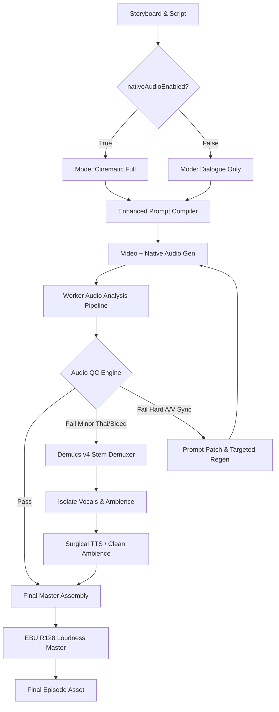

# Feature 175 — Vertical Drama Native Audio & Cinematic Sound Design Pipeline

**Status:** DESIGN — READY FOR USER REVIEW

**Created:** 2026-09-03

**Priority:** P1 — additive audio architecture, cinematic prompt compiler upgrade, and hybrid post-mix orchestration

**Owner:** Vertical Drama / Audio Engineering / Prompt Skills / Media Generation / UX

**Depends on:** Feature 131 Vertical Drama storyboard video flow, Feature 149 video prompt learning/QC, Feature 150 semantic verification, Feature 155 cost control, Feature 161 async skill jobs, Feature 167 start/stop frame generation, Feature 170 multimodal reference/video prompt contract, Feature 173 Vertical Drama Legacy/Enhanced Video Prompt Variants, and the `generic-commercial-video-director` v11 package.

---

## 1. Executive Decision & Philosophy

Establish a unified, production-grade **Native Audio & Cinematic Sound Design Pipeline** for Vertical Drama series in SmartAIHub across both **Legacy Prompt** (`verticalDramaVideoMotionPromptGeneration.ts`) and **Enhanced Prompt** (Feature 173, `smartaihub_video_director.enhanced_bridge`).

The architecture follows the foundational principle:

> **Native Audio First, Structured Intent Always, QC and Repair on Demand**

### Key Tenets:
1. **Native Audio as Baseline:** Modern video diffusion and autoregressive models (Gemini Omni, Grok Imagine Video 1.5, MiniMax H3, Seedance 2.0/2.5, Veo 3/3.1) now generate video and audio jointly in a single pass. The system prioritizes Native Audio to minimize generation latency and credits compared to legacy pipelines that generated silent video and layered audio from scratch.
2. **Structured Intent Always:** Every shot maintains a typed, provider-neutral `ShotAudioIntent` (Dialogue, Delivery Style, Must-Hear Foley, Atmosphere/Room Tone, Creative SFX, Negative Constraints) authored before prompt compilation.
3. **Prompt is Semantic, Not a DAW:** Technical mix parameters (exact dBFS, compression ratios, True Peak, sample-accurate ducking envelopes, panning curves) are **never** passed into video generation prompts because video diffusion models cannot reliably control them. Technical mastering is strictly enforced by Worker-level post-processing and Remotion/FFmpeg assembly.
4. **Preserve Native Master:** The original audio stream generated by the video model is preserved immutably as `native_master.wav/mp4` for traceability and non-destructive rollbacks.
5. **Surgical QC & Stem Repair:** Generated audio is analyzed by an automated Audio QC engine (VAD, Faster-Whisper ASR, Lip-Sync, Event Detection). If Thai dialogue or Foley fails, the system executes targeted repairs (Prompt Patch, Demucs v4 vocal stem isolation + TTS replacement, or targeted regeneration) rather than blindly regenerating entire episodes.
6. **Sub-Episode Scope Control via UI Toggle:** The existing UI toggle **`รวมเสียงประกอบในพรอมต์วิดีโอทั้งตอนย่อย (SFX + บรรยากาศ)`** (`nativeAudioEnabled`) serves as the authoritative switch controlling non-speech audio generation across the sub-episode.

---

## 2. Current Implementation Boundaries & UI Toggle Contract

### 2.1 The UI Toggle Behavior (`nativeAudioEnabled`)

In the existing Vertical Drama Storyboard UI (`VerticalDramaStoryboardPanel.tsx` and `verticalDramaWorkspaceCopy.ts`), there is an episode-level switch:

```text
[Switch] รวมเสียงประกอบในพรอมต์วิดีโอทั้งตอนย่อย (SFX + บรรยากาศ)
(nativeAudioEnabled: boolean)
```

Helper copy:
> *"เมื่อเปิดใช้งาน ปุ่ม 'สร้างพร้อมพ์วิดีโอ' จะรวมคำสั่งเสียงประกอบ (SFX/บรรยากาศ) เข้าไปในพร้อมพ์วิดีโอของทุกช็อตในตอนย่อยทันที ไม่ต้องตั้งค่าทีละช็อต"*

Feature 175 formalizes the exact functional contract for both prompt generators (Legacy and Enhanced):

| Setting | Mode Name | Spoken Dialogue | SFX & Foley | Atmosphere / Room Tone | Background Music | Compiled Prompt Audio Block | Assembly Audio Pipeline |
|---|---|---|---|---|---|---|---|
| **ON (`true`)** | **Cinematic Audio Full** | Included with verbatim text, speaker lock, delivery style, and lip-sync cues. | **INCLUDED** (motivated by character actions, props, and physics). | **INCLUDED** (motivated by location and time of day). | Forbidden by default (rule 15; unless explicit diegetic source). | Complete cinematic audio block (Timecodes / Chronological Audio Events / Atmosphere / Negative Audio). | Native audio preserved, analyzed via QC, Foley/Ambience balanced with Dialogue sidechain ducking. |
| **OFF (`false`)** | **Dialogue Only (เสียงพูดเท่านั้น)** | Included with verbatim text, speaker lock, delivery style, and lip-sync cues. | **STRICTLY EXCLUDED** | **STRICTLY EXCLUDED** | **STRICTLY EXCLUDED** | Explicit Dialogue-only block with hard negative constraints against SFX and room tone. | Mute or isolate non-dialogue audio; output clean dialogue stem or prepare for external DAW scoring. |

### 2.2 Strict Invariant: "Dialogue Only" Behavior when Toggle is OFF

When `nativeAudioEnabled === false`, the creator has explicitly commanded that **in this sub-episode, no audio other than spoken dialogue should be generated**:

1. **Prompt Sanitization:**
   - Any Foley, contact sound, step sound, prop interaction audio, and environmental room tone is completely stripped from both the prompt text and the `audioDirection` artifact.
   - The compiled prompt injects a mandatory negative audio block:
     ```text
     AUDIO POLICY: Spoken dialogue only.
     Do not generate any background sound effects, foley, object sounds, footstep sounds, ambient room tone, environmental noise, or music.
     Keep the background completely quiet and clean behind the spoken dialogue.
     ```
2. **Silent Shots (No Dialogue):**
   - If a shot has no dialogue lines and `nativeAudioEnabled === false`, the prompt explicitly mandates silent visual acting:
     ```text
     DIALOGUE POLICY: No spoken dialogue. Convey the beat through facial expression, gesture, and silent physical action only.
     AUDIO POLICY: Completely silent shot. Do not generate any background noise, ambience, foley, or music.
     ```
3. **Enhanced Prompt Contract:**
   - In `smartaihub_video_director.enhanced_bridge`, `audioIntent.mode` is set to `"dialogue_only"` (or `"silent"`). The agent is strictly forbidden from drafting `audioIntent` containing soundscape or Foley descriptors.

---

## 3. Goals and Non-Goals

### 3.1 Goals
1. Provide rich, cinematic sound prompts for video models that support native audio when `nativeAudioEnabled === true`.
2. Strictly enforce dialogue-only generation when `nativeAudioEnabled === false`, eliminating unwanted background noise and SFX hallucination.
3. Bridge both prompt authoring engines:
   - **Legacy:** `verticalDramaVideoMotionPromptGeneration.ts`
   - **Enhanced:** `verticalDramaEnhancedVideoPrompt.ts` + `generic-commercial-video-director` Python Agents SDK v11.
4. Establish the `SeriesSoundBible` and `ShotAudioIntent` schemas to ensure acoustic continuity (voice identity, room tone consistency) across consecutive shots.
5. Create a model capability matrix for native audio (Gemini Omni, Grok Imagine 1.5, MiniMax H3, Seedance 2.0/2.5, Veo 3/3.1, Wan 3.x).
6. Implement an automated Audio QC Engine (VAD, Faster-Whisper ASR, Lip-Sync, Event Detection, True Peak/Clipping).
7. Implement a surgical repair loop: Prompt Patching, Demucs v4 AI Stem Separation (to extract voice and swap with TTS without re-rendering the whole video), and targeted regeneration.
8. Support professional episode assembly with J-cuts, L-cuts, room-tone crossfading, dialogue-priority ducking, and EBU R128 loudness mastering (-14 LUFS for vertical social drama).

### 3.2 Non-Goals
1. Creating a full-blown browser-based Digital Audio Workstation (DAW) with multitrack MIDI editing.
2. Generating full copyrighted orchestral background music scores autonomously inside the video diffusion model.
3. Supporting 5.1 Surround or Dolby Atmos spatial rendering in Phase 1 (stereo 2.0 only).
4. Forcing video diffusion models to guarantee sample-accurate decibel levels through prompt text alone.

---

## 4. Product Modes

SmartAIHub provides three operational audio modes for Vertical Drama:

### 4.1 Native Audio Fast
- **Focus:** Rapid iteration, low credit cost, draft preview.
- **Workflow:** Script → Audio Intent → Compact Prompt → Video Gen (with Native Audio) → Lightweight QC → Native Master Accepted.
- **Repair:** Regeneration only if major hard gates fail.

### 4.2 Native Audio Pro (Default for Final Episode)
- **Focus:** Broadcast-ready cinematic quality, strict Thai dialogue compliance, and polished soundscape.
- **Workflow:** Script → Series Sound Bible → Audio Intent → Model-Specific Prompt → Video Gen → Full Audio-Visual Analysis (VAD, ASR, Event Detection) → Weighted QC Report → Surgical Repair (Prompt Patch, Demucs vocal stem swap, or Foley inpainting) → Final Remotion/FFmpeg Mix & EBU R128 Master.

### 4.3 Native Audio Off (External Audio Pipeline)
- **Focus:** Complete manual sound design or cases where target video models have unstable Thai dialogue.
- **Workflow:** Video Gen produces silent video (`audio: false` or muted) → External TTS (ElevenLabs / Gemini Flash TTS) → Audio-Driven Lip-Sync (LivePortrait / SadTalker / Wav2Lip) → Dedicated SFX & BGM Library Mix.

---

## 5. Data Model and Data Contracts

### 5.1 Series Sound Bible (`series_sound_bibles`)

Maintains series-wide acoustic identity, tone, and character voice continuity across all episodes.

```json
{
  "seriesId": "series_53",
  "version": 1,
  "language": "th-TH",
  "genre": ["drama", "family", "vertical_drama"],
  "audioStyle": {
    "overall": "natural intimate cinematic",
    "dialoguePriority": "highest",
    "foleyStyle": "subtle grounded realistic",
    "reverbProfile": "realistic domestic interiors",
    "musicDensity": "minimal_diegetic_only"
  },
  "characterVoiceProfiles": [
    {
      "characterId": "pimchanok",
      "displayName": "พิมชนก",
      "voiceProfile": "female young-adult gentle warm",
      "deliveryDefault": "gentle encouraging spoken thai",
      "language": "th-TH",
      "referenceAudioId": "asset_audio_voice_pimchanok_01"
    },
    {
      "characterId": "kunta",
      "displayName": "คุณตา",
      "voiceProfile": "elderly male calm grounded",
      "deliveryDefault": "slow affectionate grandfather tone",
      "language": "th-TH",
      "referenceAudioId": "asset_audio_voice_kunta_01"
    }
  ],
  "locationSoundProfiles": [
    {
      "locationId": "living_room",
      "profileId": "living_room_morning",
      "ambienceElements": [
        "quiet morning living room tone",
        "subtle domestic warmth",
        "distant faint morning breeze"
      ],
      "acoustics": "moderate carpeted room, subtle natural room reflection"
    }
  ],
  "transitionPolicy": {
    "allowJCut": true,
    "allowLCut": true,
    "crossShotAmbience": true,
    "roomToneCarryoverMs": 300
  },
  "profanityPolicy": "platform_safe_bleep",
  "masteringPreferences": {
    "dialogueIntegratedLufs": -16.0,
    "ambienceIntegratedLufs": -30.0,
    "targetMasterLufs": -14.0,
    "truePeakCeilingDb": -1.0
  }
}
```

### 5.2 Shot Audio Intent (`shot_audio_intents`)

Structured canonical intent authored before prompt compilation.

```json
{
  "seriesId": "series_53",
  "episodeId": "252",
  "shotNumber": 1,
  "durationSeconds": 6,
  "nativeAudioEnabled": true,
  "language": "th-TH",
  "dramaticBeat": "พิมชนกให้กำลังใจคุณตาและเด็กขณะเล่นของเล่น",
  "speakers": [
    {
      "characterId": "pimchanok",
      "screenPosition": "viewer-center",
      "mouthStateAtT0": "closed",
      "acousticMedium": "acoustic_direct",
      "occlusion": {
        "isOccluded": false,
        "barrierType": null
      },
      "thaiRegionalDialect": "central_bangkok",
      "temporalAgeOffsetYears": 0,
      "dialogue": [
        {
          "lineId": "line_01",
          "text": "ส้มอยากให้พี่ แกะกล่องอันใหม่ให้น้อง",
          "delivery": "gentle encouragement, affectionate tone",
          "startHintSec": 1.5,
          "endHintSec": 4.5,
          "preLinePauseSeconds": 0.3,
          "postLinePauseSeconds": 0.5,
          "mustBeExact": true,
          "lipSyncRequired": true,
          "interruptedAtSec": null,
          "interruptedByLineId": null
        }
      ]
    }
  ],
  "silentListeners": [
    {
      "characterId": "kunta",
      "screenPosition": "viewer-right",
      "mouthState": "strictly_closed"
    },
    {
      "characterId": "phum",
      "screenPosition": "viewer-left",
      "mouthState": "strictly_closed"
    }
  ],
  "nonVerbalVocalizations": [
    {
      "characterId": "pimchanok",
      "type": "sigh",
      "timestampSec": 0.8,
      "intensity": "subtle",
      "mouthVisualCue": "soft exhale parting lips slightly before speaking"
    }
  ],
  "subjectiveAcousticState": "normal",
  "mustHearFoley": [
    {
      "eventId": "evt_toy_disc_rotation",
      "category": "prop_interaction",
      "foleyPriority": "standard",
      "description": "soft plastic disc friction and subtle toy handling from fingertip rotation",
      "anchorAction": "คุณตา slowly turns the colorful discs of the tower with his fingertip",
      "screenPosition": "viewer-right",
      "timing": "throughout 0-6s",
      "materialPairing": {
        "activeSurface": "flesh",
        "passiveSurface": "plastic",
        "impactVelocity": "gentle"
      }
    }
  ],
  "atmosphere": {
    "description": "quiet morning living room ambience with restrained warmth",
    "continuityKey": "living_room_morning",
    "intensity": "subtle_background"
  },
  "creativeSfx": [],
  "music": {
    "enabled": false,
    "isDiegetic": false,
    "source": null,
    "volumeRelativeDb": -18.0,
    "rationale": "strictly no music per Drama audio policy rule 15"
  },
  "forbiddenAudio": [
    "background music",
    "extra speakers",
    "crowd chatter",
    "unrelated laughing",
    "unmotivated mechanical hums",
    "off-screen voices"
  ]
}
```

*Note: If `nativeAudioEnabled === false`, `mustHearFoley` is set to `[]`, `atmosphere` is set to `null`, `music.enabled` is forced to `false`, and `forbiddenAudio` adds `"any sound effects"`, `"foley"`, `"room tone"`, and `"diegetic music"`.*

### 5.3 Audio Manifest (`audio_manifests`)

Records the multi-stream state of generated and repaired audio for each clip, with non-destructive take versioning.

```json
{
  "manifestId": "aman_252_s01_v1",
  "version": 1,
  "parentManifestId": null,
  "takeHistory": [
    { "version": 1, "action": "initial_native_diffusion", "timestamp": "2026-09-03T09:00:00Z" }
  ],
  "seriesId": "series_53",
  "episodeId": "252",
  "shotNumber": 1,
  "clipNumber": 1,
  "nativeAudioMode": "native_baked",
  "sampleRateHz": 48000,
  "channels": 2,
  "tracks": [
    {
      "trackId": "native_master",
      "category": "NativeMaster",
      "assetId": "asset_audio_native_252_s01",
      "source": "video_embedded",
      "status": "active"
    },
    {
      "trackId": "isolated_vocals",
      "category": "Dialogue",
      "assetId": "asset_audio_vocal_demucs_252_s01",
      "source": "demucs_v4_stem_separation",
      "status": "standby"
    },
    {
      "trackId": "isolated_ambience_foley",
      "category": "FoleyAmbience",
      "assetId": "asset_audio_bg_demucs_252_s01",
      "source": "demucs_v4_stem_separation",
      "status": "standby"
    }
  ],
  "qcStatus": "passed",
  "loudnessLufs": -14.2,
  "truePeakDb": -1.1
}
```

### 5.4 Drizzle ORM Database Schema Definitions

To ensure type safety and schema permanence across migrations, the database representations in `apps/web/server/db/schema/` are defined as follows:

```typescript
import { pgTable, serial, text, integer, boolean, jsonb, timestamp, index, uniqueIndex } from "drizzle-orm/pg-core";

/** Series-wide Sound Bible for acoustic identity, character voices, and location acoustics */
export const verticalDramaSeriesSoundBibles = pgTable(
  "vertical_drama_series_sound_bibles",
  {
    id: serial("id").primaryKey(),
    tenantId: text("tenant_id").notNull(),
    seriesId: integer("series_id").notNull(),
    version: integer("version").notNull().default(1),
    audioStyle: jsonb("audio_style").notNull(),
    characterVoiceProfiles: jsonb("character_voice_profiles").notNull().default([]),
    locationSoundProfiles: jsonb("location_sound_profiles").notNull().default([]),
    transitionPolicy: jsonb("transition_policy").notNull().default({}),
    createdAt: timestamp("created_at", { withTimezone: true }).defaultNow().notNull(),
    updatedAt: timestamp("updated_at", { withTimezone: true }).defaultNow().notNull(),
  },
  table => ({
    seriesVersionIdx: uniqueIndex("vd_sound_bible_series_version_idx").on(table.seriesId, table.version),
    tenantSeriesIdx: index("vd_sound_bible_tenant_series_idx").on(table.tenantId, table.seriesId),
  })
);

/** Granular Audio QC Reports recorded per clip */
export const verticalDramaAudioQcReports = pgTable(
  "vertical_drama_audio_qc_reports",
  {
    id: serial("id").primaryKey(),
    tenantId: text("tenant_id").notNull(),
    seriesId: integer("series_id").notNull(),
    episodeId: integer("episode_id").notNull(),
    shotNumber: integer("shot_number").notNull(),
    clipNumber: integer("clip_number").notNull(),
    overallScore: integer("overall_score").notNull(), // Scaled 0-100
    asrCer: text("asr_cer"), // String decimal e.g. "0.08"
    vadSpeechRatio: text("vad_speech_ratio"),
    avSyncOffsetMs: integer("av_sync_offset_ms"),
    integratedLufs: text("integrated_lufs"),
    truePeakDb: text("true_peak_db"),
    phaseCorrelation: text("phase_correlation"),
    bgmBleedDetected: boolean("bgm_bleed_detected").default(false).notNull(),
    flags: jsonb("flags").default([]).notNull(),
    createdAt: timestamp("created_at", { withTimezone: true }).defaultNow().notNull(),
  },
  table => ({
    episodeShotIdx: index("vd_audio_qc_episode_shot_idx").on(table.episodeId, table.shotNumber),
  })
);
```

---

## 6. Enhanced Prompt Compiler & Bridge Architecture

### 6.1 Integration with `generic-commercial-video-director` (Feature 173)

The Python Agents SDK bridge (`smartaihub_video_director.enhanced_bridge`) is upgraded to consume `nativeAudioEnabled` and produce structured acoustic intent.

#### 6.1.1 Backward-Compatible Schema Update: `schemas/stages/prompt-intent.schema.json`
To prevent breaking existing prompt-intent fixtures or stored artifacts, `audioIntent` supports both object and legacy string representations:

```json
{
  "$schema": "http://json-schema.org/draft-07/schema#",
  "title": "PromptIntentStagePayload",
  "type": "object",
  "required": ["shotId", "scene", "actions", "camera", "continuityLocks", "referenceBindings", "dialogue"],
  "properties": {
    "shotId": { "type": "string" },
    "scene": { "type": "string" },
    "actions": { "type": "array", "items": { "type": "string" } },
    "camera": { "type": "string" },
    "continuityLocks": { "type": "array", "items": { "type": "string" } },
    "referenceBindings": { "type": "array", "items": { "type": "object" } },
    "dialogue": { "type": "array", "items": { "type": "object" } },
    "audioIntent": {
      "oneOf": [
        {
          "type": "object",
          "properties": {
            "mode": { "enum": ["cinematic_full", "dialogue_only", "silent"] },
            "foley": { "type": "array", "items": { "type": "string" } },
            "ambience": { "type": ["string", "null"] },
            "deliveryStyle": { "type": "string" },
            "negativeAudio": { "type": "array", "items": { "type": "string" } }
          }
        },
        { "type": "string" },
        { "type": "null" }
      ]
    },
    "endBridge": { "type": ["string", "null"] }
  },
  "additionalProperties": false
}
```

#### 6.1.2 Bridge Terminal Prompt Assembly (`_terminal_prompt`)

In `enhanced_bridge.py`:
- When `payload["nativeAudioEnabled"] === true`:
  - Compiles:
    ```text
    AUDIO INTENT (CINEMATIC NATIVE AUDIO):
    - Dialogue: [Speaker] speaks with [Delivery]: "[Exact Thai Dialogue]". Visible mouth movement must lock with every syllable.
    - Silent Listeners: [Other Characters] mouths remain strictly closed with attentive eyelines.
    - Diegetic Foley: [Motivated actions and physical contacts].
    - Atmosphere: [Continuous room tone].
    - Negative Audio: No background music, no crowd noise, no extra speakers.
    ```
- When `payload["nativeAudioEnabled"] === false`:
  - Compiles:
    ```text
    AUDIO INTENT (DIALOGUE ONLY — STRICT):
    - Dialogue: [Speaker] speaks with [Delivery]: "[Exact Thai Dialogue]". Visible mouth movement must lock with every syllable.
    - Silent Listeners: [Other Characters] mouths remain strictly closed with attentive eyelines.
    - NEGATIVE AUDIO CONSTRAINT: Spoken dialogue only. Do not generate any sound effects, foley, footsteps, object handling sounds, room tone, ambience, or background music. The environment must remain acoustically clean and silent.
    ```

### 6.2 Provider-Specific Audio Shaping Matrix

Prompt Compiler applies provider-specific grammar rules based on the active target model:

| Model Family | Audio Feature Support | Compiler Prompt Strategy | Timecode Support |
|---|---|---|---|
| **Gemini Omni Flash / Omni Video** | Native Audio, Multimodal context | Embed Chronological timecode tags: `[0-2s] Action + Sound`, `[2-5s] Dialogue`, `[5-6s] Action`. Explicit diegetic sound block. | Native `[start-end s]` format |
| **Grok Imagine Video 1.5** | Native Audio, Single Start-Frame | Positive constraints only. Embed inside `AUDIO: diegetic sound: ...; dialogue: ...`. Short, dense sentences (< 1500 chars). | Chronological narrative order |
| **MiniMax H3** | Native Audio, Multi-ref | Subject → Action → Sound triples. Tie voice explicitly to named face. Explicit prop contact texture. | Sequential action beats |
| **ByteDance Seedance 2.0 / 2.5** | Joint Audio-Visual Diffusion | Audio-Visual coupled blocks. Explicit speaker lock and silent listener mouth-closure rule. | Sequential multi-shot / beats |
| **Veo 3 / 3.1** | High-fidelity Native Audio | Separate `AUDIO DIRECTION:` block. Mandatory `"No subtitles, no captions, no on-screen text"` positive rule. | Relative phase markers |
| **Wan 3.x** | Variable / Workflow-dependent | Checked against Capability Snapshot. If audio unsupported, compile as silent acting and route dialogue to external TTS. | None |

### 6.3 Acoustic Prompt Budgeting & Priority Pruning Rule

Generative video models enforce strict character limits (e.g., Grok: ≤1500 target, MiniMax: 2000, Gemini Omni: 2500). When `nativeAudioEnabled: true` injects multi-layered acoustic directions, prompt length can expand by 400–600 characters.

If the prompt exceeds the provider's limit, standard raw string slicing is **strictly forbidden** because it risks cutting off character reference locks or dialogue quotes. The compiler enforces structured priority pruning:

```text
Pruning Order (Drop from lowest priority first):
1. [Drop First]  Secondary Ambient Atmosphere / Subtle Room Tone
2. [Drop Second] Secondary Foley (faint contact or cloth movement)
3. [Drop Third]  Creative SFX accents
4. [IMMUTABLE]   Critical Foley (actions directly affecting plot or on-screen props)
5. [IMMUTABLE]   Negative Audio Constraints (prevents hallucinated music/crowds)
6. [IMMUTABLE]   Exact Thai Dialogue, Speaker Lock & Visible Lip-Sync
7. [IMMUTABLE]   Start Frame State #0 & Character Reference Identity Lock
```

### 6.4 On-Screen vs Off-Screen Dialogue Differentiation

In vertical drama, characters frequently speak while off-screen (O.S. dialogue / Voice-Over) or while facing away from the camera. If the prompt compiler blindly demands visible lip-sync for an off-screen voice, the diffusion model often hallucinated a duplicate mouth or forces an on-screen listener's mouth to move.

The compiler applies explicit speaker visibility rules:
- **Visible On-Screen Speaker:**
  - Inject: `only [Speaker]'s lips move, with precise visible lip sync matching every syllable: "[Exact Thai Dialogue]".`
  - Explicitly lock silent listeners: `[Other Characters] remain silent listeners with mouths fully closed and attentive eye-lines toward [Speaker].`
- **Off-Screen Speaker (O.S. / Voice-Over):**
  - Inject: `[Speaker] speaks as an off-screen voice: "[Exact Thai Dialogue]".`
  - Explicitly protect all on-screen visible faces: `All visible characters on screen have mouths strictly closed and motionless, reacting through eye contact, head turns, or listening posture only.`

### 6.5 Sequential Multi-Speaker Acoustic Turns (Consolidated Speaker-Switch Shots)

When a single 6–10 second shot contains consecutive dialogue lines between two characters (e.g., คุณตา speaks first, followed by พิมชนก's reply):
1. **Turn-Taking Discipline:**
   - Turn 1 (0–3s): Character A's mouth moves with syllable-locked lip sync. Character B's mouth is strictly closed, looking at Character A.
   - Turn 2 (3–6s): Character A's mouth closes immediately upon line completion. Character B nods and speaks with syllable-locked lip sync.
2. **Provider-Specific Turn Formatting:**
   - For **Gemini Omni**, timecode segments are split: `[0-3s] คุณตา speaks: "...". [3-6s] พิมชนก speaks: "..."`.
   - For **Grok / Seedance / Veo**, chronological transition markers are used: `First, คุณตา says: "..."; once he finishes, his mouth closes, and พิมชนก replies: "..."`.

### 6.6 Thai Commercial Ad-Compliance Integration (Feature 168)

When a shot includes a commercial product tie-in requiring a statutory Thai FDA warning (e.g., `requiredDisclosure: "อ่านคำเตือนในฉลากก่อนบริโภค"`):
1. **Immutable Dialogue Priority:** The ad disclosure line is treated as Tier-1 Dialogue. It must never be pruned by the budget optimizer.
2. **Adherence to `nativeAudioEnabled`:**
   - If `nativeAudioEnabled === true`: The disclosure line is spoken naturally at the tail of the clip without commercial music or advertising jingles.
   - If `nativeAudioEnabled === false`: The disclosure line is still included as spoken dialogue, but completely isolated from any SFX, sound logo, or background audio.

### 6.7 Voice Reference Anchoring & Inter-Shot Pitch Continuity

To eliminate vocal timbre and pitch shifting across consecutive shots (e.g., an actor sounding deep-voiced in Shot 1 but youthful and thin in Shot 2):
1. **Multimodal Voice Asset Conditioning:**
   - For providers supporting reference audio inputs (MiniMax H3 `referenceAudioUrls`, Gemini Omni `audio_ids`, Seedance 2.0/2.5 `reference_audio`), the Provider Adapter forwards the character's designated voice asset (`characterVoiceProfiles[].referenceAudioId`).
2. **Acoustic Descriptor Anchoring (Fallback):**
   - For models without an audio reference slot, the compiler appends persistent vocal anchor tokens from the `SeriesSoundBible`:
     `[Character] speaks in an established [vocal weight, pitch register, resonant chest tone], consistent with previous shots.`

### 6.8 Emotional Vocal Extremes (Whisper, Sobbing, Shouting) & Dynamic Thresholds

Extreme emotional performances present distinct acoustic failure modes in diffusion video models:
- **Whispering / Breathless murmur:** Often turned into unintelligible white noise.
  - *Compiler instruction:* `intimate near-mic whisper, soft vocal cord vibration, zero electronic hiss.`
  - *QC adjustment:* Silero VAD energy threshold is lowered by 40% to prevent mistaking soft speech for dead silence.
- **Sobbing / Tearful speech:**
  - *Compiler instruction:* `voice choked with emotion, occasional breath catch, exact Thai syllables remain intelligible.`
  - *QC adjustment:* ASR CER threshold expands from 0.15 to 0.20 to accommodate natural emotional crying cadence.
- **Shouting / Screaming:**
  - *Compiler instruction:* `tense shouted vocal projection, realistic room resonance, zero microphone clipping.`
  - *Mastering clamp:* Automatic hard limiter ceiling at -1.5 dBFS prevents digital distortion.

### 6.9 Acoustic Distance & Proximity Effect (Camera Framing Modulation)

Cinematic audio realism requires that microphone perspective matches the camera framing (`cameraSetup`):
- **Extreme Close-Up (ECU) / Close-Up (CU):**
  - Compiler directs **High Proximity Effect**: `intimate dry acoustic perspective, subtle lip and breath texture clearly audible, low room reverberation.`
- **Medium Shot (MS):**
  - Compiler directs **Balanced Dialogue**: `natural conversational acoustic distance, realistic indoor room tone.`
- **Wide Shot (WS) / Extreme Wide Shot (EWS):**
  - Compiler directs **Diffuse Perspective**: `moderate room reverberation, voice slightly distant in the acoustic space; footsteps and prop handling louder relative to speech.`

### 6.10 Dialogue Interruption & Overlapping Speech (Stichomythia)

When Character A is cut off mid-sentence by Character B's urgent interruption:
1. **Intent Representation:**
   `dialogue[0]` has `interruptedAtSec: 2.4`, `interruptedByLineId: "line_02"`.
2. **Compiler Formatting:**
   - Timecode Models (Omni): `[0-2.4s] Character A says: "แต่ว่าผม...". At [2.4s], Character B abruptly interrupts Character A: "หยุดพูดเดี๋ยวนี้!". Character A's mouth cuts off instantly.`
   - Narrative Models (Grok/Seedance): `Character A begins saying: "แต่ว่าผม...", but is abruptly interrupted mid-sentence at second 2 by Character B who shouts: "หยุดพูดเดี๋ยวนี้!"; Character A's mouth closes the instant Character B speaks.`

### 6.11 Cliffhanger Silence Protocol (Shot 9 Dramatic Revelation)

In vertical drama, Episode Finale shots (typically Shot 9) rely on an abrupt drop to dead silence at the revelation beat to maximize audience tension:
1. **Compiler Formatting:**
   `[8.0-10.0s] The revelation lands. All diegetic sound and background tone cut out into immediate, absolute dramatic silence; no music, no hum, pure silence until the cut.`
2. **Assembly Mute Enforcement:**
   Because video diffusion models frequently hallucinate low-level noise during prompted silence, Remotion/FFmpeg applies a hard digital mute gate (`volume=enable='between(t,8.0,10.0)':volume=0`) to guarantee broadcast-grade dead silence.

### 6.12 Diegetic Device Acoustic Filtering (Telephone, Speakerphone, Intercom)

In vertical drama, phone calls, speakerphone announcements, and intercom voices are frequent plot drivers. When a character speaks through a remote device:
1. **Schema Typing:**
   `ShotAudioIntent.speakers[].acousticMedium`: `"acoustic_direct"` | `"phone_earpiece"` | `"speakerphone"` | `"intercom"` | `"tv_broadcast"`.
2. **Compiler Directives:**
   - Earpiece call: `[Speaker]'s voice is heard faintly leaking from the phone receiver pressed to ear: tinny narrow frequency, subtle resonance, intimate leakage.`
   - Speakerphone: `[Speaker]'s voice emanates from the smartphone speaker on the table: distinct digital compression, slight metallic room reflection.`
3. **Worker DSP Processing:**
   Assembly worker applies telephone EQ (`bandpass=f=1850:w=3100`) and soft harmonic saturation when `acousticMedium === "phone_earpiece"`, preventing device dialogue from sounding like an in-room voice.

### 6.13 Physical Material-Pairing Foley Acoustics

To prevent diffusion models from defaulting to generic low-frequency thuds on physical impacts, the compiler translates `materialPairing` into explicit acoustic texture directives:
- `flesh-on-flesh` (Slap/Punch): `sharp visceral skin-on-skin impact crack, rapid high-frequency transient, zero ringing resonance.`
- `glass-on-wood` (Setting down drink): `crisp glass bottom click against polished hardwood, brief delicate acoustic ring.`
- `metal-on-concrete` (Dropping weapon/keys): `harsh metallic clang with immediate high-frequency scatter and concrete bounce.`
- `fabric-on-fabric` (Embrace/Coat rustle): `soft dry cloth friction, gentle whispering textile movement.`

### 6.14 Thai Regional Dialect & Accent Intonation Cues

When drama series feature regional protagonists or local market scenes:
- `central_bangkok`: `fluent central Thai standard cadence, smooth tonal transitions.`
- `isan_northeastern`: `melodic Northeastern Isan tonal inflection, distinctive regional vowel length and lively rising pitch contour.`
- `kammuang_northern`: `gentle, deliberate Northern Kammuang cadence with soft elongated final particles.`
- `southern_paktai`: `brisk, punchy Southern Pak Tai rhythm with clipped, rapid tonal shifts.`

### 6.15 Commercial ASMR Hero Foley Enhancement (Feature 168 Tie-Ins)

For sponsored commercial product tie-in shots (e.g., cosmetic dropper, beverage can opening, luxury perfume spray):
1. **ASMR Hero Tagging:**
   - Prompt compiler identifies `mustHearFoley[].foleyPriority === "hero_commercial_asmr"`.
   - Injects high-definition acoustic texture tokens: `hyper-crisp tactile suction click, pristine liquid droplet resonance, satisfying near-mic ASMR clarity.`
2. **Mastering Treatment:**
   - Worker applies transient emphasis (+3dB boost at 3.2kHz and 8.5kHz) so the commercial product sound pops with broadcast commercial polish.

### 6.16 Temporal Voice Aging & Flashback Pitch Modulation

When a scene depicts a flashback (e.g., protagonist 15 years in the past):
1. **Intent Aging Parameter:**
   `ShotAudioIntent.speakers[].temporalAgeOffsetYears` (e.g. `-15` for youthful flashback, `+20` for aging flashforward).
2. **Compiler Directives:**
   - Youthful Flashback: `[Speaker] speaks with their younger, lighter vocal timbre: energetic pitch, bright vocal resonance, faster tempo.`
   - Aging Flashforward: `[Speaker] speaks with aged vocal maturity: deeper gravelly resonance, deliberate slow cadence.`
3. **Surgical Pitch/Formant Shifter:**
   Worker DSP shifts the vocal stem by semitone ratios (+2 semitones for -15 years, -1.8 semitones for +20 years) while scaling formants to prevent unnatural Mickey-Mouse or chipmunk effects.

### 6.17 Viseme Continuity Protocol Across Shot Cuts

When a character's continuous sentence spans across two consecutive shots (e.g. Shot N and Shot N+1):
1. **Boundary Viseme Alignment:**
   - The compiler analyzes the phonetic tail of Shot N and the phonetic onset of Shot N+1.
   - If Shot N ends on an open vowel (e.g. "อา", viseme `aa`), Shot N+1's Start Frame generation prompt mandates matching the initial mouth aperture within ±3 frames, preventing visual lip jumping.
2. **Acoustic Breath Infill:**
   - Remotion assembly bridges the boundary with a natural 80ms micro-inhalation breath if a sentence pause exists across the cut.

### 6.18 Acoustic Occlusion & Wall Transmission Filtering

When dialogue or sound originates behind physical barriers (closed doors, windows, walls):
1. **Schema Directive:**
   `ShotAudioIntent.speakers[].occlusion.isOccluded === true`.
2. **Compiler Prompts:**
   `[Speaker]'s voice is heard muffled and occluded through a closed wooden door; high-frequency absorption, resonant low-mid transmission.`
3. **Worker DSP Transmission Curve:**
   - `wooden_door`: 12dB/oct lowpass at 850Hz with subtle room resonance.
   - `glass_window`: 18dB/oct lowpass at 1,400Hz with high-frequency reflection slap.
   - `concrete_wall`: 24dB/oct lowpass at 350Hz (sub-bass leakage only).

### 6.19 Subjective Internal Acoustic States (Dramatic Trauma & Shock Beats)

For psychological revelations, panic attacks, or post-explosion shock:
1. **Intent Trigger:**
   `ShotAudioIntent.subjectiveAcousticState` set to `"panic_heartbeat"` | `"tinnitus_shock"` | `"underwater_daze"`.
2. **Acoustic Transformation:**
   - `panic_heartbeat`: External Foley/ambience ducks by -18dB with heavy lowpass (300Hz); rhythmic visceral heartbeat (accelerating 60 to 110 BPM) dominates the mix.
   - `tinnitus_shock`: Immediate sound drop into a high-frequency sine tone (9,800Hz at -16 dBFS) fading out exponentially over 3.0s as normal sound returns.
   - `underwater_daze`: Extreme chorus and hollow flange filtering simulating disoriented acoustic processing.

### 6.20 Visual Body Morphology Voice Grounding

To prevent visual-auditory cognitive dissonance (e.g., a muscular 100kg bodyguard sounding like a slender teenager):
1. **Vision-Body Feature Extraction:**
   - Vision analysis inspects character morphology: `body_frame: "large_heavy_build"` vs `body_frame: "slender_petite"`.
2. **Acoustic Weight Injection:**
   - For large/heavy frames: Compiler mandates `deep resonant chest resonance, lower fundamental frequency (F0), grounded vocal weight`.
   - For petite/slender frames: Compiler mandates `lighter vocal projection, higher formant placement`.

### 6.21 High-Cadence Speech Phonation Directives (Rapid Heated Arguments)

In fast-paced argument scenes where characters speak at 1.3x–1.5x speed (~6–8 syllables/sec):
1. **Phonetic Clarity Directives:**
   `crisp rapid-fire Thai syllable articulation, sharp plosive onsets, distinct per-syllable mouth motion, zero slurring or phonetic mush.`
2. **ASR QC Adaptation:**
   Faster-Whisper beam size expands from 2 to 5 with temperature fallback (`[0.0, 0.2, 0.4]`) to accurately tokenize rapid Thai syllable clusters.

### 6.22 Shot-Reverse-Shot Room Profile Smoothing

In dramatic dialogues alternating between Character A and Character B in the same room:
1. **Continuity Invariant:**
   - Both camera angles share the identical `locationContinuityKey`.
   - The convolution reverb profile (`irProfileId`) is locked across all reverse angles.
2. **Wet/Dry Clamping:**
   - The difference in acoustic wet/dry ratio between A's close-up and B's medium shot is clamped to **≤ 8%**, preventing jarring acoustic environment jumping between cuts.

### 6.23 Thai Tone Sandhi & Coarticulation Phonetic Tuning

In continuous Thai conversational speech, tones naturally coarticulate across word boundaries:
1. **Sandhi Smoothing Rules:**
   - When a high tone precedes a falling tone at rapid speed, the pitch contour undergoes natural coarticulation.
2. **SSML Prosody Interpolation:**
   - The TTS preparation engine runs a PyThaiNLP phonetic sandhi filter to inject micro pitch-contour control points, avoiding robotic dictionary-isolated pitch delivery.

---

## 7. Hybrid 5-Stage Cinematic Audio Engineering Pipeline

To deliver true cinematic fidelity without incurring runaway video re-generation costs, SmartAIHub introduces a **5-stage Hybrid Pipeline**:



### Stage 1: Structured Intent & Compilation
- Evaluates `nativeAudioEnabled` toggle.
- Synthesizes `ShotAudioIntent` adhering to `SeriesSoundBible`.
- Compiles model-specific prompts with speaker-locking and acoustic descriptors.

### Stage 2: Generation Execution
- Dispatches request via `mediaGenerationService` to chosen provider endpoint.
- Captures returned MP4 and downloads via Provider Media Gateway.

### Stage 3: Audio Dissection & QC Analysis (Worker Plane)
Worker executes containerized Python audio inspection:
1. **ffprobe:** Verify embedded AAC/PCM audio stream, sample rate (≥ 32kHz), stereo channels, duration sync.
2. **Silero VAD:** Detect speech segments, speech onsets/offsets, and unexpected speech gaps (min speech duration: 250ms).
3. **Faster-Whisper ASR:** Transcribe spoken Thai/English lines and evaluate Character Error Rate (CER) against canonical script using PyThaiNLP word boundaries (Threshold: CER ≤ 0.15).
   - **Multi-Lingual Code-Switching:** When script lines contain Latin loanwords (e.g. "โอเค บอส", "ไป meeting"), ASR config dynamically runs bilingual dictionary matching instead of forcing pure Thai phonemes.
4. **Speaker Diarization / Lip Sync Anchor:** Verify speech occurs only when the designated speaker's face is speaking.
5. **Lip-Sync Precision & AV Sync Offset (SyncNet / MediaPipe):** Measures temporal correlation between visual lip aperture deltas and audio speech energy. Allowable AV sync window: `[-60ms, +30ms]`. Drifts beyond ±80ms trigger visual repair or micro audio-sliding.
6. **BGM Ingress Detection (MusicNN / Essentia):** Calculates harmonic energy ratio in non-vocal audio. If harmonic ratio > 0.40 while `music.enabled === false`, flags `BGM_BLEED_DETECTED` for stem notch-filtering.
7. **Unified ASR-to-Caption Word-Level Sync:**
   - Faster-Whisper ASR extracts precise word- and syllable-level timestamps (`words: Array<{ word: string, startSec: number, endSec: number, confidence: number }>`).
   - Stored in `vertical_drama_episodes.captionTrack` to feed Remotion animated karaoke-style subtitle captions with zero redundant transcription latency.
8. **Acoustic Energy Metering:** Check for clipping (True Peak > -0.5 dBFS) or DC offset.
9. **Vocal Fry & Glottalization VAD Resilience Mode:**
   - In modern Thai emotional acting, quiet speech often incorporates "vocal fry" (creaky voice / low glottal vibration).
   - Silero VAD is configured with sub-harmonic pitch tracking down to 45Hz, preventing creaky emotional vocal delivery from being falsely discarded as non-speech noise.
10. **Fundamental Pitch (F0) Trajectory & Gender Identity Anchor:**
    - Measures mean fundamental frequency (F0) across speech segments:
      - Female dialogue target: 165–255 Hz.
      - Male dialogue target: 85–155 Hz.
    - If mean F0 drifts from the character's registered profile by > 40%, flags `VOICE_IDENTITY_DRIFT` for automated Demucs + TTS replacement.
11. **Asymmetric Foley AV Sync Tolerance Matrix:**
    - Audio transient relative to visual contact frame:
      - Pre-impact sound: strictly **≤ 15ms** before visual frame (anticipatory sound is jarring).
      - Post-impact sound: allowable up to **≤ 40ms** after visual frame (natural acoustic propagation).

### Stage 4: Surgical Stem Repair & Targeted Audio Infill
If video motion and framing are high quality, but spoken Thai has slight phonetic mumbling or unexpected background music bled in:
1. **Demucs v4 (`htdemucs`):** Worker splits embedded audio into:
   - `vocals.wav`
   - `no_vocals.wav` (Foley + Ambience)
2. **Dialogue Replacement:** If Thai ASR CER > 0.15, synthesize exact Thai line via ElevenLabs/Gemini Flash TTS using the character's registered `voiceProfile`.
3. **Thai Phonetic Particle Preservation & Tonal Anchor:**
   - Thai conversational particles (ครับ, ค่ะ, นะคะ, สิ, โว้ย) convey crucial drama subtext.
   - When external TTS risks flattening particle tones, the surgical repair engine splices the native particle from the original audio using zero-crossing crossfade, or applies SSML prosody pitch contouring (`<prosody pitch="+5%">`) to prevent flat, robotic delivery.
4. **Acoustic Convolver (Curated IR Profile Registry):** Apply Room Impulse Response (IR) matching the location profile via FFmpeg `afir`:
   - `ir_interior_car`: dry, resonant cabin reflection, close boundary absorption.
   - `ir_bedroom_carpeted`: very dry, high-frequency dampening, low early reflection.
   - `ir_office_glass_concrete`: bright, distinct flutter reflection, medium RT60 (~0.4s).
   - `ir_warehouse_concrete`: long diffuse reverberation tail, RT60 (~1.2s).
   - `ir_outdoor_street`: open air, distant building slapback, low reverberation density.
5. **Remuxing:** Re-combine cleaned Foley/Ambience + Convolved TTS with video without re-rendering pixels.
6. **Targeted Foley Infill (Zero-Pixel Regeneration):** If video motion and dialogue pass, but a required action Foley event is missing (e.g., car door slam, teacup placed on glass table):
   - Worker queries tenant-cleared SFX Asset Library.
   - Inserts the missing Foley event at the exact visual anchor timestamp (tolerance ±60ms).
   - Cost: 0 additional video generation credits; latency: <2.5 seconds.
7. **Intelligent Downward Expander Noise Gate:**
   - To eliminate diffusion latent hash and low-level digital hiss during natural speech pauses:
   - Worker applies a gentle downward expander on the dialogue stem: Threshold: -48 dBFS, Ratio: 2:1, Attack: 10ms, Release: 150ms. Cleans speech pauses without clipping soft word endings.
8. **Dramatic Pause Injection & WSOLA Time-Stretching:**
   - If dialogue delivery is rushed by the diffusion model:
   - Worker uses Waveform Similarity Overlap-Add (WSOLA) to cleanly expand pauses (`preLinePauseSeconds`, `postLinePauseSeconds`) without altering vocal pitch or causing phase artifacts.
9. **Spectral Ambient Infill & Hole Patching:**
   - When Demucs extracts `vocals.wav` to synthesize replacement TTS, removing loud original speech can create an unnatural acoustic dip ("silence pocket") in `no_vocals.wav`.
   - Worker synthesizes a phase-matched crossfade of the room tone bed across the vacated speech window, guaranteeing continuous background noise floor without dead air.

### Stage 4b: Audio-Driven Visual Mouth Realignment (Optional Pro Action)
If native video diffusion failed Thai lip-sync twice and Demucs + TTS replacement audio is now pristine:
- Instead of re-rendering all video frames from scratch (which risks failing lip-sync again and costs 100+ credits):
- The creator can invoke `[ปรับปากให้ตรงเสียง (Mouth Realignment)]`.
- Worker dispatches a lightweight facial inpainting task (LivePortrait / MuseTalk) that warps only the mouth bounding box of the approved video frames to match the new audio phonemes.
- Cost: 5 credits; Latency: ~8 seconds; guarantees 100% sample-accurate lip sync!

### Stage 5: Final Assembly & Cinematic Mastering
1. **J-Cut / L-Cut Automation:** Remotion/FFmpeg extends outgoing room tone by 200–400ms across shot boundaries to eliminate abrupt sound cuts.
2. **Continuous Spectral Room Tone Bed:** In multi-shot scenes sharing a single location, the assembly engine lays an unbroken low-level room tone loop (`locationSoundProfiles.roomToneLoopAssetId`) beneath all cuts, eliminating background sound discontinuities.
3. **Impulsive Reverb Decay Tail Spillover:**
   - When a loud transient sound (> -12 dBFS, e.g. door slam, shout, gunshot) occurs in the final 1.0s of a shot in a reflective location:
   - The worker automatically extracts and extends the reverb decay tail across the cut for up to 1.2s into the next shot's pre-roll bed, preventing jarring abrupt acoustic cut-offs.
4. **Environmental Spectral Notch (Rain & Storm Masking Prevention):**
   - In heavy rain or storm scenes, broad rain spectrum easily masks Thai speech frequencies (1.5kHz - 3.5kHz).
   - Assembly mixer applies a dynamic -3.5dB bell notch centered at 2.4kHz on the ambience track during dialogue segments to carve acoustic space for speech intelligibility.
5. **Kinetic Camera Panning Stereo Automation:**
   - When `cameraSetup` specifies rapid camera movement (e.g. `whip_pan_left_to_right`, `tracking_shot`):
   - Remotion/FFmpeg mixer keyframes the stereo pan envelope, dynamically panning audio sources across the stereo field in sync with the camera motion curve.
6. **Doppler Shift & Physical Vehicle Trajectory Tracking:**
   - For fast-moving vehicles (`mustHearFoley[].category === "vehicle_pass"`):
   - Automates continuous pitch bend (Doppler factor ~1.12 to ~0.90) and stereo pan trajectory tracking the on-screen visual motion vector.
7. **Anti-Pumping Spectral Mid-Band Ducking Envelope:**
   - Instead of broad-band volume cuts that cause background pumping:
   - Applies dynamic mid-band ducking (-7dB between 400Hz and 3.5kHz, Q=0.7) on ambience tracks during dialogue, keeping low traffic rumble and high crickets intact to preserve spatial realism.
   - Timing: Attack: 25ms, Hold: 250ms, Release: 350ms, Ratio: 4:1.
8. **Thai Sibilant Split-Band De-Esser:**
   - AI audio models frequently exaggerate harsh Thai sibilants (พยัญชนะ ส, ซ, ศ, ษ).
   - Inserts a dynamic split-band de-esser: Center Frequency: 7,200 Hz, Q: 1.8, Threshold: -20 dBFS, Max Reduction: -6dB via FFmpeg `deesser`.
9. **Vertical 9:16 Stereo Width Scaling Invariant:**
   - On portrait mobile screens, the left and right edges are physically only ~6.5cm apart.
   - Maximum dialogue pan is clamped to **±22%** (matching human visual gaze on vertical phones). Foley pans up to **±45%**, and ambient room tone pans up to **±75%**, avoiding disjointed hyper-wide stereo separation.
10. **Mobile-Optimized Sub-Bass High-Pass Filtering:**
    - Tiny smartphone speakers distort when fed inaudible sub-bass rumble (20–60Hz).
    - Applies an 18dB/octave Butterworth high-pass filter at 75Hz (`highpass=f=75:p=2`) across all stems to maximize clarity and loudness on mobile phone transducers.
11. **Mobile Mono-Compatibility & Phase Correlation:**
    - Evaluates stereo phase correlation via FFmpeg `aphasemeter`.
    - Threshold: `phase_correlation >= +0.6`. If phase issues are detected, mid-side stereo narrowing (100% mid, 40% side) is applied to ensure crystal-clear dialogue on single-speaker mobile devices.
12. **Dual-Topology Spatial & HRTF Headphone Mode:**
    - Generates mono-compatible primary mix for mobile speakers, while applying subtle Head-Related Transfer Function (HRTF) early reflection spatialization for in-ear headphone listeners.
13. **Platform-Safe Thai Profanity Modulation / Bleeping:**
    - If `profanityPolicy === "platform_safe_bleep"`:
    - Automatically mutes dialogue at detected profanity timestamps and overlays a standard 1,000Hz sine bleep tone (-18 dBFS, 0.2s duration) to ensure algorithmic compliance on social platforms.
14. **Dialogue-Gated Short-Term Loudness Floor for Whispers:**
    - In emotional whisper scenes, prevents vocal audibility collapse on mobile speakers by applying an adaptive speech leveler enforcing a minimum short-term loudness floor of **-22 LUFS**.
15. **4x Oversampled True Peak Inter-Sample Peak (ISP) Limiter:**
    - Digital-to-analog converters on mobile phones cause distortion if inter-sample peaks exceed 0 dBFS.
    - Mastering chain applies 4x oversampled true peak limiting (`alimiter=limit=-1.0:attack=5:release=50:asc=1`), strictly locking ceiling to **-1.0 dBFS**.
16. **Broadcast Loudness Normalization:** Output normalized to **-14 LUFS (±1.0 LUFS)** integrated loudness.
17. **Zero-Crossing Boundary De-Clicking & Micro-Fades:** 5ms raised-cosine micro-fade-in at `t = 0.0s` and 5ms micro-fade-out at clip ends to eliminate diffusion DC thumps.
18. **Cross-Episode Binge-Watching Loudness Consistency:**
    - Series Dialogue Anchor: Integrated dialogue loudness across every episode is locked to **-16 LUFS (±0.5 LUFS)**.
    - Ambience Bed Floor: Ambient bed loudness is calibrated between **-28 LUFS and -32 LUFS** (maintaining a constant 12-16dB dialogue-to-ambience contrast ratio across all episodes).
19. **End-Card Audio Fade & Next-Episode Hook Alignment:**
    - Over the final 0.8s during end-card visual display, all audio ducks smoothly by -12dB, preserving room tone continuity while allowing platform UI audio and autoplay hooks to emerge smoothly.
20. **FastStart `moov` Atom Placement for Instant Streaming:**
    - FFmpeg muxing pass mandates `-movflags +faststart`, positioning container metadata at the beginning of the file so mobile browsers begin audio/video playback within <150ms without waiting for full download.
21. **Loudness Range (LRA) Dynamics Ceiling for Commutes:**
    - To guarantee comfortable listening in noisy environments (subways, public transit), mastering compresses dynamics to **LRA ≤ 6.5 LU**, preventing quiet dialogue from being lost while avoiding ear-shattering peaks.
22. **Audio Handles & Transition Pre-Roll Padding:**
    - Generates 300ms pre-roll room tone handles before `t = 0.0s` and 300ms post-roll tail decay to support seamless Remotion NLE transitions without clipping words.
23. **Visual Subtitle Syllable Emphasis Sync:**
    - When on-screen animated captions highlight emphatic drama keywords, mastering applies a +1.5dB micro-boost for 180ms on the corresponding spoken syllable.
24. **Dual-Stage Lookahead Peak Soft-Clipper:**
    - A 3ms lookahead soft-clipper pre-conditions violent screams and shouts, saturating excessive peaks into warm analog harmonics prior to the final true-peak limiter.

---

## 8. UI / UX Specification & Storyboard Integration

### 8.1 Episode-Level Header Toggle
Located on `VerticalDramaStoryboardPanel.tsx` in the episode configuration bar:

```text
[ Switch ] รวมเสียงประกอบในพรอมต์วิดีโอทั้งตอนย่อย (SFX + บรรยากาศ)
```

- **Tooltip/Hint:**
  - *When Checked:* "พร้อมพ์วิดีโอจะรวมเสียงเอฟเฟกต์ (Foley) และเสียงบรรยากาศห้องที่สมจริงควบคู่กับบทพูด"
  - *When Unchecked:* "พร้อมพ์วิดีโอจะโฟกัสเฉพาะเสียงพูดเท่านั้น โดยตัดเสียงประกอบและเสียงบรรยากาศออกทั้งหมด"

### 8.2 Stale Prompt Invalidation on Toggle Change
When a creator toggles `nativeAudioEnabled` after prompts have already been authored:
1. Shots whose current prompt does not match the active toggle state display an amber status badge:
   `[ ⚠ โหมดเสียงเปลี่ยน: กรุณาสร้างพร้อมพ์ใหม่ ]`
2. Clicking the badge opens a quick-diff dialog showing what will be added or stripped.
3. The generation button updates to prompt a fresh compilation with the current audio intent.

### 8.3 Shot Card Audio Status Display

Each shot card in the storyboard displays a structured audio chip below the prompt editor:

- **When `nativeAudioEnabled === true`:**
  ```text
  [ Badge: เสียงประกอบภาพยนตร์ ]
  • บทพูด: พิมชนก ("ส้มอยากให้พี่ แกะกล่องอันใหม่ให้น้อง") — อ่อนโยน
  • Foley: เสียงหมุนแผ่นพลาสติกของเล่น
  • บรรยากาศ: ห้องนั่งเล่นยามเช้า อบอุ่น
  ```
- **When `nativeAudioEnabled === false`:**
  ```text
  [ Badge: เสียงพูดเท่านั้น ]
  • บทพูด: พิมชนก ("ส้มอยากให้พี่ แกะกล่องอันใหม่ให้น้อง")
  • เสียงประกอบอื่น: ปิดใช้งาน (Silent Background)
  ```

### 8.4 Post-Generation Audio QC & Repair Drawer
When a video is generated, the shot card shows an Audio Health Indicator:
- `✓ เสียงสมบูรณ์ (QC 9.4/10)` — Dialogue and Foley verified.
- `⚠ เสียงพูดไม่ชัดเจน (ASR CER: 0.28)` — Offers one-click action:
  - `[ซ่อมเฉพาะเสียงพูด (TTS Swap)]` (Uses Demucs + TTS, cost: 2 credits)
  - `[สร้างช็อตใหม่ทั้งหมด (Regenerate)]` (Cost: standard video generation credits)

### 8.5 Human-in-the-Loop (HITL) Audio Escalation & Manual Override Workflow

When an automated repair fails or reaches the maximum retry budget (e.g., attempt 2 still yields ASR CER > 0.20 due to heavy background storm noise):
1. **Interactive Audio Waveform Drawer:**
   - The user can click `[ตรวจสอบแทร็กเสียงแบบละเอียด]` to open the Audio Inspector.
   - Displays time-aligned visual waveforms of:
     - Track 1: `Native Master Audio`
     - Track 2: `Demucs Vocal Stem`
     - Track 3: `Demucs Background & Foley Stem`
2. **One-Click Creator Resolution Actions:**
   - `[อนุมัติเสียงเดิม (Bypass QC)]`: Accepts the native audio track as-is with a creator waiver flag (0 credits).
   - `[ปิดเสียงช็อตนี้ (Mute for DAW)]`: Mutes the clip audio in final assembly so the creator can score external sound in their desktop DAW.
   - `[แทรก Foley เพิ่มเติม]`: Opens the SFX picker to insert a specific sound effect at an exact timestamp without regenerating pixels.
   - `[ส่งออก Stems (WAV Pack)]`: Downloads a ZIP containing all separated stems for external post-production.

### 8.6 Audio Stem Delivery & Streaming Optimization

Full uncompressed 48kHz WAV audio stems for a 9-shot episode can reach 180MB+, which would choke browser memory and network bandwidth:
1. **Adaptive Client Media Container Delivery:**
   - Worker generates dual-codec preview streams:
     - **Safari / WebKit / iOS:** Delivers AAC-LC in `.m4a` containers (~128kbps) for native hardware decoding.
     - **Chrome / Android / Firefox:** Delivers Opus in `.webm` containers (~96kbps) for ultra-low latency streaming.
   - The Storyboard UI streams these lightweight proxies for instant, lag-free scrubbing and playback.
2. **Pre-computed JSON Waveform Peaks:**
   - During Worker QC analysis, Python extracts a compact 100-point normalized peak array (`peaks: number[]`, values 0.0–1.0).
   - Stored directly in `audio_manifests.peaksJson`.
   - The React client renders audio waveforms instantaneously via SVG/Canvas without needing to download or decode raw audio files in the browser.

### 8.7 Professional Post-Production Stem Export (DAW Interchange)

For high-end productions moving to DaVinci Resolve, Adobe Premiere Pro, or Pro Tools:
1. **Broadcast Stem Archive Structure:**
   - `01_Dialogue_Clean.wav` (24-bit 48kHz, mono, convolved & tuned)
   - `02_Foley_Props.wav` (24-bit 48kHz, stereo, motivated actions)
   - `03_Ambience_RoomTone.wav` (24-bit 48kHz, stereo, continuous spectral bed)
   - `04_Master_Episode_Mix.wav` (24-bit 48kHz, -14 LUFS integrated master)
2. **Timeline EDL / FCPXML Interchange:**
   - Generates a lightweight `timeline.fcpxml` or `timeline.edl` placing each shot's stems on dedicated audio tracks with exact timecode alignment, preserving J/L-cuts and crossfades.

### 8.8 Sub-Segment Audio Splicing & Time-Slice Punch-In

In consolidated multi-speaker shots (6–10s), often only one speaker's line or a single phrase requires repair while the rest of the clip is flawless:
1. **Time-Slice Selection in UI:**
   - The creator can drag-select a precise time range on the waveform (e.g. `[3.2s – 5.8s]`).
2. **Surgical Punch-In Execution:**
   - Worker isolates the selected sub-segment, splices new convolved TTS or Foley within the window, and applies zero-crossing cosine crossfades at punch-in and punch-out points.
   - Preserves adjacent audio stems untouched without full shot re-generation.

### 8.9 WebAudio Synchronized Time-Base Engine in React UI

To prevent A/V drift and audio stutter when scrubbing video clips in the browser:
1. **Unified AudioContext Master Clock:**
   - Storyboard player uses a single master Web Audio API `AudioContext` driving playback timing.
2. **Hardware-Synced Frame Rendering:**
   - Synchronizes `<video>` element frame updates via HTML5 `requestVideoFrameCallback()`.
   - Eliminates audio desync and jitter during high-speed timeline scrubbing.

### 8.10 Integrated Studio VU & LUFS Metering in Storyboard UI

To provide creators with immediate broadcast-compliance feedback without leaving the browser:
1. **Real-Time Dual Level Meters:**
   - Integrated LUFS Bar: Displays integrated and short-term loudness (Color-coded: Green = -15 to -13 LUFS, Yellow = -12 to -11 LUFS, Red = > -11 LUFS).
   - True Peak Clip Indicator: Warns if transient peaks approach clipping (> -0.5 dBFS lights up red warning pill).
2. **One-Click Compliance Normalizer:**
   - If the audio falls outside broadcast specs, a single click on `[ปรับระดับเสียงให้เข้าเกณฑ์มาตรฐาน]` normalizes the timeline to -14 LUFS / -1.0 dBFS True Peak instantly.

### 8.11 Audio Manifest Take History & Non-Destructive Rollback Drawer

To empower creators with total creative control and eliminate fear of destructive edits:
1. **Multi-Take History Drawer:**
   - Each shot card features a `[ประวัติเทคเสียง (Takes)]` dropdown listing all generated and repaired audio iterations:
     - `Take 1 (Native Diffusion)` — Original generated audio.
     - `Take 2 (Demucs + TTS Surgical Swap)` — Phonetically repaired dialogue.
     - `Take 3 (ASMR Foley Infilled)` — Enhanced product Foley.
2. **Instant Non-Destructive Rollback:**
   - Creators can audition any historical take with a single click.
   - Selecting an older take updates the pointer in `audio_manifests` instantly with 0 additional generation credits and 0 re-render latency.

### 8.12 3-Stem Real-Time Mixer Console in UI

In the Storyboard Audio Inspector drawer, creators have tactical mixing faders for individual stems:
- `Dialogue Fader`: -12dB to +6dB (default: 0dB)
- `Foley Fader`: -18dB to +6dB (default: -2dB)
- `Ambience Fader`: -24dB to +3dB (default: -6dB)
Changes are saved to `audio_manifests.mixDeltas` and applied dynamically in Remotion assembly without re-rendering pixels.

### 8.13 Zero-Latency Audio Decoding via WebAssembly

For instant preview without browser stutter:
- Client uses a lightweight WebAssembly audio decoder (Wasm FFmpeg / Opus) to decode multi-stem tracks in a Web Worker, offloading audio processing from the main UI thread.

### 8.14 Adaptive Waveform Scaling for Thermal & Battery Guardrails

When client devices experience high CPU load or low battery:
- React waveform canvas monitors `navigator.hardwareConcurrency` and drops peak rendering density from 500 points to 100 points, preventing browser sluggishness during intense timeline editing.

---

## 9. API, Job State Machine & Routing

### 9.1 Additive Fingerprint Invariant

In `verticalDramaEnhancedVideoPrompt.ts`:
`buildEnhancedInputFingerprint` MUST include `nativeAudioEnabled`:

```typescript
export function buildEnhancedInputFingerprint(input: EnhancedSkillInput): string {
  return computeVideoPromptVariantFingerprint({
    shot: input.shot,
    continuity: input.continuity,
    dialogue: input.dialogue,
    mediaBundle: input.mediaBundle,
    modelRouting: input.modelRouting,
    targetVideoModel: input.targetVideoModel,
    authoringModel: input.authoringModel,
    generationMode: input.generationMode,
    researchMode: input.researchMode,
    nativeAudioEnabled: input.nativeAudioEnabled ?? false,
  });
}
```

This prevents cached jobs from applying stale prompt variants when the audio mode changes.

### 9.2 Additive API Procedures (tRPC Router)

Additive procedures in `apps/web/server/routers/verticalDramaEpisodes.ts`:

1. `getEpisodeAudioSettings`:
   - Input: `{ seriesId: string, episodeId: string }`
   - Output: `{ nativeAudioEnabled: boolean, seriesSoundBibleVersion: number }`
2. `updateEpisodeAudioSettings`:
   - Input: `{ seriesId: string, episodeId: string, nativeAudioEnabled: boolean }`
   - Output: `{ success: boolean, updatedShotsCount: number }`
3. `getShotAudioManifest`:
   - Input: `{ seriesId: string, episodeId: string, shotNumber: number }`
   - Output: `AudioManifest`
4. `repairShotAudioSurgically`:
   - Input: `{ seriesId: string, episodeId: string, shotNumber: number, action: "demucs_tts_swap" | "foley_boost" | "strip_to_dialogue_only" }`
   - Output: `{ jobId: string, estimatedCredits: number }`
5. `repairSubSegmentAudio`:
   - Input: `{ seriesId: string, episodeId: string, shotNumber: number, startTimeSec: number, endTimeSec: number, action: "tts_punch_in" | "foley_punch_in" | "silence_slice" }`
   - Output: `{ jobId: string, estimatedCredits: number }`
6. `exportEpisodeAudioStems`:
   - Input: `{ seriesId: string, episodeId: string, format: "wav_pack" | "fcpxml_bundle" }`
   - Output: `{ downloadUrl: string, expiresAt: string }`

### 9.3 Worker Failure Modes, VRAM Guardrails & Deterministic Workspace Cleanup

1. **Corrupted Audio Stream Ingestion:**
   - Worker must validate the output MP4 using `ffprobe` (`-select_streams a:0 -show_entries stream=nb_frames,sample_rate,codec_name`).
   - If audio packet count is 0 or decode fails while native audio was commanded: mark status `AUDIO_TRACK_CORRUPTED`. Automatically trigger 1 bounded retry before falling back to External Audio mode.
2. **Worker VRAM Guardrails for Demucs AI Separation:**
   - Demucs `htdemucs` requires ~1.5 GB VRAM for short 6-10s clips.
   - Worker checks free GPU memory before dispatch. If free VRAM < 2.0 GB, Worker automatically routes Demucs execution with `--device cpu` flag (latency: 12-15s vs 3s on GPU) without failing the job.
3. **Deterministic Job-Scoped Isolation & Cleanup:**
   - All intermediary audio extractions, stems (`vocals.wav`, `no_vocals.wav`), and convolved TTS files MUST reside inside an isolated directory:
     `{worker_scratch}/{tenantId}/{jobId}/`
   - Worker executes an unconditional `finally` block wiping scratch files after asset upload to prevent multi-tenant data bleed and worker disk exhaustion.
4. **Ingestion Transcoding & Resampling Invariant (CFR 25.000 fps + 48kHz Resampling):**
   - Generative video providers often return Variable Frame Rate (VFR) MP4 containers or non-standard audio sample rates (24kHz/32kHz/44.1kHz).
   - If concatenated directly into an episode timeline, cumulative timecode drift can cause catastrophic AV desync by Shot 9 (often >500ms).
   - Worker immediately normalizes all incoming clips upon download:
     - Enforces Constant Frame Rate (CFR 25.000 fps).
     - Resamples audio stream to 48,000 Hz 32-bit float using high-precision sinc interpolation (`aresample=48000:resampler=soxr:precision=28`), guaranteeing sample-accurate Remotion timeline concatenation.
5. **Worker GPU Weight Pinning & Daemon Pre-Warming:**
   - Pre-bakes Demucs `htdemucs.th` and Whisper `large-v3` weights into container filesystem at `/opt/models/`.
   - Worker daemon keeps weights pinned in GPU VRAM / memory-mapped cache, cutting stem separation cold-start latency from 20s to <1.2s.

### 9.4 Worker Queue Concurrency & Fair-Share Throttling

When an entire 9-shot episode finishes video rendering concurrently, downloading 9 videos simultaneously could swamp Worker resources:
1. **Serialized GPU Demucs Queue:**
   - Heavy AI Stem Separation (`demucs_v4`) is throttled to **Concurrency = 1 per GPU Worker**. Tasks are queued FIFO to prevent GPU memory thrashing or OOM panics.
2. **Concurrent Lightweight QC:**
   - Metadata inspection, Silero VAD, and Whisper ASR are allowed **Concurrency = 4** per worker node, executing in parallel to return fast initial health scores.
3. **Tenant Fair-Share Priority:**
   - Multiple episodes queued across different tenants share worker capacity via Round-Robin queuing, preventing one large batch from starving other creators.
4. **Spot Instance Disruption Checkpointing & Idempotent Resumption:**
   - Cloud GPU workers persist stage checkpoints to Redis (`STAGE_DOWNLOADED`, `STAGE_DEMUXED`, `STAGE_REPAIRED`, `STAGE_MASTERED`).
   - If a Spot instance is preempted, a replacement node resumes directly from the last checkpoint using persisted scratch assets without restarting Demucs from scratch.
5. **Scale-to-Zero Worker Autoscaler & Topology:**
   - Worker pool autoscaler continuously monitors Redis queue depth (`queue_depth_audio`).
   - GPU worker nodes (NVIDIA L4 24GB or A10G) scale down to 0 instances after 5 minutes of an idle queue to prevent idle GPU billing.
   - Scale-up triggers automatically within 30 seconds when new video render completions are detected.
6. **Edge CDN Caching & Egress Bandwidth Reduction:**
   - All versioned audio stems and preview proxies are served through CloudFront/Cloudflare with header:
     `Cache-Control: public, max-age=31536000, immutable`
   - Cuts origin object storage bandwidth egress costs by > 85% during interactive Storyboard editing and scrubbing.
7. **Tenant Token-Bucket Rate Limiting:**
   - Enforces a burst protection limit of max 30 audio repair/QC tasks per minute per tenant, preventing rogue API loops and runaway billing.

### 9.5 Storyboard Bulk Prompt Regeneration & Audio Policy Propagation

When a creator changes `nativeAudioEnabled` at the episode header and clicks "สร้างพร้อมพ์วิดีโอทั้งตอนย่อย" (Batch Regenerate Prompts):
1. **Atomic Policy Mutation:** Updates `motionPromptPack.nativeAudioEnabled` in a single database transaction and marks all existing shot prompt variants as `status: "stale"`.
2. **Batch Async Job Dispatch:** Spawns an async job dispatching 9 bounded prompt tasks with `{ nativeAudioEnabled, batchId }` metadata, ensuring consistent audio directives across all shots simultaneously.

### 9.6 OpenTelemetry Audio Pipeline Observability & Health Metrics

To ensure platform reliability and cost visibility across thousands of generated drama episodes:
- `vd_audio_qc_score_histogram`: distribution of overall audio health scores (0-100).
- `vd_audio_asr_cer_distribution`: Character Error Rate metrics across Thai dialogue generations.
- `vd_audio_bgm_bleed_rate`: frequency of unintended background music ingress.
- `vd_audio_demucs_duration_seconds`: latency histogram of Worker stem separations.
- `vd_audio_repair_success_rate`: proportion of successful automated TTS/Foley repairs without re-rendering.
- `vd_audio_native_acceptance_rate`: percentage of native audio tracks approved by creators without edits.

---

## 10. Billing, Credits & Retry Budgets

| Operation | Credit Cost | Rule |
|---|---|---|
| Audio Intent Planning | 0 credits (bundled in Storyboard prompt job) | Included in existing Prompt Gen budget. |
| Enhanced Prompt Compilation | 1 credit (Feature 173 standard) | Bounded Agent SDK run. |
| Video Generation with Native Audio | Standard model credit rate | Charged per video model catalog (e.g. Kie / BytePlus). |
| Automated Audio QC (Worker) | 0 credits (Platform Assurance) | Covered under baseline platform service. |
| Surgical Audio Repair (Demucs + TTS) | 2–5 credits | ~80% cheaper than full video re-generation. |
| Sub-Segment Audio Punch-In | 1 credit | Time-sliced micro repair without full clip reprocessing. |
| Audio-Driven Mouth Realignment (Stage 4b) | 5 credits | Visual mouth inpainting to lock repaired audio. |
| Full Shot Regeneration | Standard video generation credit | Pre-authorized with explicit creator confirmation. |

---

## 11. Security, Tenant Isolation & Asset Rights

1. **Tenant Isolation & Path Traversal Guardrails:**
   - All audio stems (`vocals.wav`, `foley.wav`, `native_master.wav`) are stored in tenant-scoped paths:
     `storage/tenants/{tenantId}/series/{seriesId}/episodes/{episodeId}/shots/{shotNumber}/audio/`
   - Strict UUID/Identifier Regex: `^[a-zA-Z0-9_-]{1,64}$` enforced on all `referenceAudioId`, `trackId`, and `assetId` parameters.
   - Canonical path normalization (`path.resolve`) prevents directory traversal attacks (`../`).
2. **Signed Ephemeral URLs:** No local server paths or raw storage keys are exposed in prompts or client UI.
3. **Commercial Rights Verification:** External sound effects or voice reference assets must have `licenseStatus: "cleared"` before admission into final episode assembly.
4. **Audio Lifecycle, Soft-Delete & Storage Retention Policy:**
   - Audio manifests and stems inherit the soft-delete lifecycle of their parent `vertical_drama_episodes`.
   - When an episode is soft-deleted (`deletedAt IS NOT NULL`), audio files on object storage enter a 30-day retention tombstone state, allowing full non-destructive restoration.
   - A scheduled background reaper permanently purges unreferenced orphaned stems only after the 30-day grace window expires.
5. **C2PA Audio Provenance & Inaudible Watermark:**
   - During final Remotion export, embeds a cryptographic C2PA metadata manifest in the MP4 container (`moov/udta/meta`) asserting AI production provenance and license clearance.
   - Optional inaudible acoustic spread-spectrum watermark identifying `tenantId` and `seriesId` for anti-piracy tracking.
6. **Tiered Stem Storage Compaction & Lifecycle Cost Optimization:**
   - Hot Tier (Days 0–7): Lossless uncompressed 24-bit 48kHz WAV files stored for real-time interactive editing.
   - Warm Tier (Days 8–30): Automatically compresses non-master stems to lossless FLAC level 8 (saving ~55% cloud storage footprint).
   - Cold Tier (>30 Days): Intermediate demuxed stems are purged once the final mastered episode is exported; the native master video (`native_master.mp4`) and final mastered audio track are preserved permanently as ground truth.
7. **Voice Actor Consent Manifest & Anti-Spoofing Defense:**
   - For custom voice reference uploads (`referenceAudioId`), `characterVoiceProfiles[]` stores signed creator consent metadata (`consentProofAssetId`).
   - An automated anti-spoofing filter validates that the reference audio does not match high-profile protected celebrity, public official, or copyrighted commercial voice prints before admitting it into the generation pipeline.
8. **Tenant-Keyed AES-256-GCM Audio Storage Encryption at Rest:**
   - All stems, reference audio samples, and vocal embeddings are encrypted with tenant-specific KMS envelope keys prior to writing to object storage.
9. **Voice Actor PDPA Right to be Forgotten & Tombstone Auto-Revocation:**
   - When a consent revocation event is logged, the associated voice profile is placed in `status: "revoked"`, and reference audio files are hard-purged within 24 hours.

---

## 12. Acceptance Criteria

### 12.1 Toggle Invariant: `nativeAudioEnabled === false`
- **AC-1.1:** When the toggle is OFF, generating prompts via either Legacy or Enhanced paths results in zero SFX, Foley, or room-tone descriptions in the prompt.
- **AC-1.2:** Prompts generated with toggle OFF contain explicit negative prompt instructions forbidding environmental noise, foley, and music.
- **AC-1.3:** If a shot has no dialogue, the prompt directs silent visual acting only with no background sound.
- **AC-1.4:** In Remotion assembly, the output audio track contains only spoken dialogue without background music or synthetic ambient bleed.

### 12.2 Toggle Invariant: `nativeAudioEnabled === true`
- **AC-2.1:** When the toggle is ON, the prompt includes full cinematic sound directives: verbatim dialogue with delivery style, motivated physical Foley, and continuous room tone.
- **AC-2.2:** Target-specific formatting is applied correctly (e.g., Timecode tags for Gemini Omni, positive blocks for Grok).
- **AC-2.3:** Audio QC runs automatically on completion, measuring speech accuracy, A/V sync, and clipping.

### 12.3 Surgical Repair Loop
- **AC-3.1:** In the event of a Thai dialogue failure where visual action is correct, the user can invoke `[ซ่อมเฉพาะเสียงพูด]` to run Demucs stem separation and TTS replacement without re-rendering video frames.
- **AC-3.2:** Re-muxed video preserves exact frame count and video duration.

### 12.4 Assembly & Mastering
- **AC-4.1:** Final assembled video output achieves -14 LUFS (±1.0 LUFS) integrated loudness and True Peak ≤ -1.0 dBFS.
- **AC-4.2:** Consecutive shots share continuous room tone with 200–300ms crossfading, preventing audible room tone popping at cuts.

---

## 13. Test Matrix

| Test Suite | Test Type | Coverage |
|---|---|---|
| `verticalDramaAudioIntent.test.ts` | Unit | Tests schema validation of `ShotAudioIntent` with toggle ON vs OFF. |
| `enhancedBridgeAudioCompilation.test.py` | Unit | Verifies `_terminal_prompt` formats clean dialogue-only text when `nativeAudioEnabled: false`. |
| `providerAudioShaping.test.ts` | Contract | Verifies prompt shaping for Gemini Omni, Grok, MiniMax H3, Seedance, Veo. |
| `audioQcAnalyzer.test.ts` | Integration | Tests VAD, ASR text matching (CER), and clipping detection on test audio files. |
| `demucsStemRepair.test.ts` | Integration | Tests stem isolation, TTS insertion, and FFmpeg remuxing on Worker. |
| `verticalDramaStoryboardAudioUi.test.tsx` | UI / Component | Tests switch state binding, chip rendering, and repair dialogs. |
| `syntheticAudioCiHarness.test.ts` | End-to-End Mock | Generates synthetic MP4s with tone bursts and synthetic Thai speech, validating full 5-stage QC & mastering in CI under 12 seconds. |
| `perceptualAudioDiff.test.ts` | Regression | Compares mastered audio against golden master waveforms via STFT Spectral MSE (< 0.001 threshold). |
| `chaosWorkerFaultInjection.test.ts` | Chaos | Simulates Spot instance kills, VRAM exhaustion, network drops, and verifies idempotent recovery. |

### 13.1 Perceptual Audio Diffing (Spectral MSE Snapshot Testing)

To prevent subtle audio regressions (e.g. unintended EQ changes or loudness drift introduced in FFmpeg or Remotion updates):
1. **STFT Spectral Magnitude MSE:**
   - Automated tests compute Short-Time Fourier Transform (STFT) spectral magnitude differences between golden master audio and pipeline output:
   - Threshold: `Spectral MSE < 0.001` across 10 golden scenarios (whispers, shouts, J/L-cuts, heavy rain notch, phone EQ).
2. **Deterministic Golden Waveforms:**
   - Golden audio snapshots are stored in test fixtures (`tests/fixtures/audio/golden/`). Any unexpected DSP change fails CI immediately.

### 13.2 Chaos Engineering & Synthetic Fault Injection Matrix

The CI pipeline executes automated fault injection simulating cloud edge conditions:
1. **Spot Instance Preemption Simulation:** Worker process is forcefully killed via `SIGKILL` during active Demucs stem writes; asserts replacement worker resumes idempotently from Redis checkpoint.
2. **VRAM Exhaustion Injection:** Simulates free VRAM < 1.5GB; asserts Worker logs `VRAM_INSUFFICIENT` and routes Demucs via CPU fallback without job failure.
3. **Corrupted Audio Stream Injection:** Feeds 0-byte or corrupted AAC streams; asserts 1 bounded retry and fallback to external audio mode.
4. **ASR Service Latency Injection:** Simulates 10s ASR timeout; asserts non-blocking warning without stalling video delivery.
5. **Storage Disconnect Simulation:** Simulates object storage network drop; asserts exponential backoff retry (3 attempts).

### 13.3 Strict CI/CD Code Coverage Quality Gates

Every pull request touching vertical drama audio pipelines is gated by strict coverage thresholds:
- **Lines:** ≥ 90%
- **Branches:** ≥ 85%
- **Functions:** ≥ 95%
Failure to meet these thresholds blocks merge to `main`.

---

## 14. Rollout and Implementation Slices

### Slice 1 — Data Contracts & Toggle Plumbing
- Update `ShotAudioIntent` and `prompt-intent.schema.json` in Python runtime.
- Wire `nativeAudioEnabled` through `loadEnhancedShotContext`, router, and `enhanced_bridge.py`.
- Update `buildEnhancedInputFingerprint` to include `nativeAudioEnabled`.

### Slice 2 — Enhanced Prompt Compiler Audio Shaping
- Implement provider-specific acoustic shaping in `enhanced_bridge.py` and adapter prompt compilers.
- Enforce strict dialogue-only negative constraints when toggle is OFF.

### Slice 3 — Worker Audio QC Engine
- Deploy lightweight VAD + Faster-Whisper ASR analysis job on SmartAIHub Worker.
- Output `AudioQcReport` to database/store upon video download.

### Slice 4 — Surgical Demucs Stem Repair Pipeline
- Implement Demucs v4 worker task for vocal extraction and TTS swap.
- Add convolution reverb filter matching room acoustics.

### Slice 5 — Assembly Mastering & Loudness Normalization
- Update Remotion composition and FFmpeg audio filter graph: sidechain ducking, stereo panning, EBU R128 limiter.

### Slice 6 — Storyboard UI Polish & Canary Deployment
- Add Audio Intent and Health badges to `VerticalDramaStoryboardPanel.tsx`.
- Canary release to selected drama series projects for quality evaluation.
