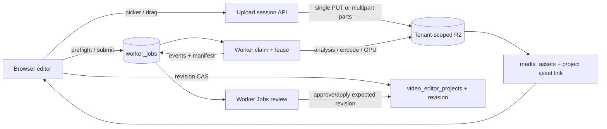

# Feature 184 parity improvement — deep implementation plan

## Objective and chosen solution

This plan closes the eighteen browser-editor gaps reported against the Worker
App. The target is one Web Media Workspace at `/video-editor` with `Bin / สื่อในโปรเจกต์`
as the entry panel, a scrollable multi-track timeline, and one durable
`worker_jobs` control plane (displayed as `คิวงาน Worker`). Editing, preview,
selection, transform authoring and lightweight waveform work stay in the
browser. Probe, VAD/silence analysis, speaker/face/object tracking, AI media,
subtitle alignment, proxy generation, encode, GPU work and final QC become
versioned jobs whose artifacts return to the server for review.

The recommended approach is **shared semantic editor contract + capability
driven adapters**. Reuse the current Phase 3 Web shell, the Worker App's pure
timeline/media algorithms, existing `editor_video_render` envelopes and the
existing R2/media-asset tables. Add browser-facing adapters and typed review
surfaces around them. A UI-only patch would leave uploads, render fidelity and
stale-result safety unsolved; rewriting the Worker UI would duplicate years of
media behavior and create two timelines. The adapter boundary lets Web and
Tauri share fixtures while each platform owns its file, microphone, process and
GPU integration.

The plan is additive. It preserves old `video_editor_projects` reads, existing
`worker_jobs` job families, `/render-jobs` as a query-preserving redirect, and
legacy projects with an explicit migration report. The compact `?legacy=1`
editor is not exposed in default/canary navigation and is retained only as a
time-bounded rollback surface until rollout drain completes. It does not claim
typecheck success (the user requested that typecheck remain deferred because of
memory).

## Source-of-truth and terminology

- `spec.md` is the user contract; `claude-research.md` records repository and
  external evidence; `claude-spec.md` is the synthesized capability contract.
- Persist `worker_jobs` as the database truth. `render` is an operation inside
  a Worker job; the queue/product name is `Worker Jobs` / `คิวงาน Worker`.
- `Transform (ตำแหน่ง/ขนาด)` is the current static transform at a clip time.
  `Keyframes (จุดเปลี่ยนตามเวลา)` are timestamped transform values and an
  interpolation policy. A keyframe never silently changes the base transform.
- A project revision is immutable once a job is submitted. Analysis, render,
  upload and generated-code artifacts always record source revision, algorithm
  or template version, checksum and review status.
- Local paths, expiring URLs, arbitrary SVG scripts, shell commands and
  provider fallbacks are never persisted or executed in the browser/Worker
  contract.

## End-to-end data flow



All Worker-bound asynchronous APIs use a shared envelope (server-only upload,
catalog and subtitle-file export procedures retain typed procedure schemas):

```text
MediaJobEnvelopeV1 {
  jobId, operation, projectId?, revisionId, planHash,
  inputAssets[], capabilityRequirements, outputRoles[],
  options, idempotencyKey, requestedBy, traceId
}
```

The implementation must expose typed procedures for `preflight`, `submit`,
`status`, `cancel`, `retry`, `replay`, `review`, and `apply`; the exact router
names and zod schemas are recorded in Section 01 before code is written.

## Cross-cutting implementation rules

1. **Versioning and CAS.** Every edit command carries `expectedRevision` and a
   client mutation ID. The server rejects stale mutations with a typed conflict
   containing the current revision; duplicate IDs are idempotent.
2. **Capability admission.** The server preflights Worker capabilities and
   queue capacity. Unsupported GPU, Remotion, VAD, diarization, tracking or
   codec features disable submit with a reason; they never silently downgrade.
3. **Artifact safety.** Verify tenant ownership, MIME, size, checksum, duration,
   dimensions, codec and declared role before publication. Keep failed and
   stale artifacts hidden from current Library projections.

   Internal failure categories use stable underscore names such as
   `lease_lost`/`stale_revision`; the current wire contract's `lease-lost`
   spelling is accepted and mapped at the adapter boundary.
4. **Accessibility and responsive behavior.** All new controls are keyboard
   reachable, labelled, focus-visible, screen-reader announced and usable at
   390x844, 768x1024, 1024x768, 1280x800 and 1440x900. Mobile is a review and
   recovery surface; advanced timeline authoring explains why it is disabled.
5. **Performance.** Upload in bounded chunks with resumable state; virtualize
   long asset lists/timeline rows; cache waveform/thumbnail/analysis artifacts;
   keep preview interactions off the server and debounce autosave.
6. **Verification boundary.** Run focused tests, esbuild/build and browser
   evidence. Defer repository-wide TypeScript typecheck. Real R2, microphone,
   GPU, provider credits, Worker claim and production deployment are separate
   gates and must be reported as verified or pending.

7. **Event and replayability.** Every Worker event carries an attempt ID, lease
   token, monotonic sequence and stage progress. Worker callbacks authenticate
   with a server-issued assignment/lease credential (or equivalent signed
   callback proof); the server verifies tenant, job, attempt and expiry before
   accepting events or artifacts. Duplicate or out-of-order callbacks are
   idempotent; a replay references the original revision and plan and is labelled
   exact or equivalent.

8. **Status compatibility.** Reuse the existing `worker_jobs` statuses
   (`queued`, `claimed`, `preparing`, `running`, `uploading`, `publishing`,
   `indexing`, `completed`, `failed`, `canceled`, `expired`). `encoding` is a
   stage event inside `running`, never a new database status. Map
   `worker_job_events.assignmentId` plus `sequence` to attempt fencing and do
   not create a second event ledger.

   `planHash` is derived only from the canonical revision, normalized input
   asset IDs/hashes, operation, typed options, output roles and capability
   requirements. It excludes job/tenant/requester identity, idempotency and
   trace IDs, attempt/lease/callback credentials and signed URLs, allowing
   deterministic retry/replay comparison.

9. **Function parity ledger.** The ledger is checked before implementation,
   after each UI section and at release. A control is complete only when its
   state, keyboard path, persistence behavior and Worker operation (if heavy)
   are linked to a test and evidence artifact.

## Requirement-to-section coverage

| User request | Primary section(s) | Completion signal |
|---|---|---|
| Bin single/multiple R2 upload and default tab | 02 | one/many files reach managed Bin; Bin is selected on route load |
| Keyframes, pin and free video position | 03 | deterministic still/video transform and keyframe fixture |
| Auto pan/zoom and reframe | 03 | revision-pinned focus track with review before merge |
| Quick Silence Cut | 04 | reviewable edit map and CAS apply |
| Extract audio from video track | 04 | derived managed A-track asset with lineage |
| AI Music | 05 | preflight, credit-safe job and A-track artifact |
| Blur bar/object tracking | 06 | approved track renders; unverified interval blocks |
| Microphone recording | 05 | device/MIME/permission matrix and managed recording |
| Speaker analysis/edit plan | 05 | confidence-aware review and revision apply |
| Auto/Manual/GPU render | 07 | capability-admitted mode and Worker manifest |
| MP3 export | 07 | verified audio-only artifact |
| Subtitle creation/import/export | 05 | validated cues, SRT/VTT artifact and explicit sidecar/burn-in |
| Frame/camera/render-like preview | 03, 08 | mode labels and shared evaluator fixture |
| Save current frame | 07, 08 | PNG/JPEG capture or render-still fallback |
| Detailed ruler and many-track scroll | 08 | 20+ track responsive browser evidence |
| Ducking/waveform presets | 04 | bounded envelope and typed filter compilation |
| SVG line/stock symbols | 09 | searchable licensed sanitized catalog |
| AI CSS/React/Three.js preview | 09 | sandboxed manifest preview and render fixture |
| Clear Transform vs Keyframes, zoom/pan | 03 | distinct copy, controls and image/video parity |

Dashboard integration is part of Section 10: the Dashboard's editor entry points
must open `/video-editor`, the queue entry must open `/worker-jobs`, and any old
`/render-jobs` link must preserve query parameters through the alias.

The implementation also maintains a parity ledger for every visible toolbar and
panel. The first ledger row is `Library`, `Bin`, `Media History`, `Audio/Ducking`,
`Ratio`, `History`, `FX/Blur`, `Overlay`, `Camera/Auto Pan-Zoom`, `Worker`,
`Draft AI`, `Silence`, `Text/Subtitle`, `3D Overlay`, `AI Music/Audio`, `Symbols`,
and `AI Code Overlay`. Toolbar rows include play/seek, split, trim, snap,
undo/redo, keyframe, frame guide, preview quality/zoom, track add (video/audio/
overlay/text), save, export and Worker handoff. Each row records source Worker
function, Web component, browser-only behavior, Worker job operation (if heavy),
state matrix, keyboard path and proof artifact. A missing row blocks Section 10
completion even when the main happy path works.

The inventory is also reconciled against the Worker App implementation: media
Bin/local import, Cloud Library, playback/split/trim/resize, ripple/razor,
copy/paste, group/ungroup, compound/decompose, Ken Burns, detach audio,
Subtitle/Text/3D Overlay/Stock SVG/Blur/Voiceover/AI Music/AI Media Studio,
Snap and track M/S/Duck/Volume, Project settings, Save/Open project file,
CapCut draft and Render/Export. Web replacements for local folder browsing,
Explorer actions and absolute local render paths are explicit managed
upload/download flows; they cannot disappear as undocumented omissions.

The `Ratio` row is an explicit control contract: 16:9, 9:16, 1:1 and custom
dimensions update the project canvas with fit/fill/crop preview and a revision
warning; it never silently changes source media. The `History` row restores an
immutable prior revision through a new revision. The `Draft AI` row remains
compatible with existing prompt/draft flows and routes any generation or
analysis to typed Worker jobs, while preserving prompt/version/provenance.

## Section 01 — shared editor, upload and job contracts

Freeze the semantic boundary before changing panels. Add canonical types under
`packages/shared/src/video-editor/` (or the existing shared location if the
package is already present): `NleProjectDocumentV2`, `ClipTransformTrack`,
`KeyframePoint`, `AudioMixMap`, `SubtitleDocument`, `AnalysisArtifact`,
`UploadSession`, `RenderRequest`, `OutputManifest`, capability snapshots and
`MediaJobEnvelopeV1`. Add compatibility parsers for the current Web project,
Worker NLE 1.0.0 and old `MediaJobSpec`.

The current wire document `nle.web.1` and existing `MediaOperation` values
remain readable. `NleProjectDocumentV2` is the enriched internal/revision
schema; its serializer negotiates a Worker-supported version and may emit
`nle.web.1` only through a lossless compatibility projection. If a Worker cannot
represent keyframes, privacy, subtitle, overlay or audio-mix fields, admission
blocks the job and records the unsupported field instead of dropping it.
Web `text` tracks map to wire `subtitle`/text-overlay data only when timing,
styles and speaker metadata are lossless; otherwise preflight blocks or requires
an explicit flattening revision. Track and privacy namespaces are never silently
coerced.

Define operation IDs: `asset_upload`, `probe`, `proxy`, `waveform`, `thumbnail`,
`quick_silence_cut`, `extract_audio`, `ai_music`, `ai_media_studio`,
`record_audio`, `speaker_plan`, `subtitle_align`, `subtitle_export`,
`reframe`, `privacy_track`, `render`, `render_still`, `export_mp3`, `svg_catalog`, and
`code_overlay_preview`. Define output roles,
failure categories, allowed status transitions, immutable hash fields, retry
policy, and the review/apply CAS contract. Unknown major versions, operations,
roles, URLs, local paths, unsafe filter/code fields and duplicate output roles
fail before claim.

The role registry includes `probe`, `proxy`, `waveform`, `thumbnail`,
`silence_edit_map`, `extracted_audio`, `ai_music`, `recording`, `speaker_plan`,
`subtitle_srt`, `subtitle_vtt`, `privacy_track`, `final_video`, `mp3`,
`still_image`, `sanitized_svg`, `code_overlay_manifest` and `capcut_draft`.
Each role declares whether it is an analysis artifact, managed media asset,
sidecar or browser download; a job cannot publish a role to the wrong registry.

Keep user-facing operation IDs separate from existing wire operations through an
explicit adapter table: `quick_silence_cut → media.silence_detect`,
`probe → media.probe`, `proxy → media.proxy`, `waveform → media.waveform`,
`thumbnail → media.thumbnail`,
`speaker_plan → media.speaker_scan + media.transcribe/media.align`,
`subtitle_align → media.align`, `extract_audio → media.audio_extract`,
`audio_mix/ducking → media.audio_mix`,
`reframe → media.reframe`,
`ai_music → server-authorized provider/media task or negotiated media.ai_music`,
`privacy_track → negotiated media.privacy_track`,
`export_mp3 → negotiated media.audio_export`, `render_still → video.render_still`,
`render → video.render`,
`ai_media_studio → existing server-authorized image/video/audio generation
adapters`, and browser `record_audio` → managed upload plus optional normalize
job. `subtitle_export` is a server artifact operation. Add wire operations only
after capability negotiation and old-worker rejection tests. `asset_upload`,
`svg_catalog` and
`capcut_draft_export` remain server/storage or browser-download workflows, not
arbitrary Worker shell operations.

Upload contracts must support `simple` and `multipart` sessions. The server
chooses method using size/config; the client receives object key, part size,
part URLs, expiry, checksum mode and already-uploaded ETags. A browser retry
must resume the same session. Session states are `created`, `uploading`,
`completing`, `completed`, `aborting`, `aborted`, `expired` and `failed`; only
`completed` can create a published asset, and abort/expiry must leave none.

Primary files: shared types/fixtures, `apps/web/server/routers/editorMediaJobs.ts`,
`apps/web/client/src/services/webAssetResolver.ts`, Worker Rust contract
adapters. Tests cover schema acceptance/rejection, hash stability, old payload
projection, upload-session transitions and TypeScript/Rust fixture parity.

## Section 02 — Bin, R2 ingest and media-source panels

Make `Bin / สื่อในโปรเจกต์` the default panel in `VideoEditorPhase3` and retain
Library and Media History as adjacent sources. `ProjectBinPanel` owns one-file
and multi-file picker, drag/drop, paste rejection, per-file progress, retry,
cancel, partial success, duplicate detection and empty/error/expired states.
`MediaLibraryPanel` becomes a source switcher: every managed video/image/audio
item is draggable to a compatible track and has an “เพิ่มเข้า Bin” action.

Replace the current sequential-only upload path with a bounded queue using the
Section 01 session. Call the existing `/api/media-jobs/upload/init` with
compatible `filename/contentType/fileSize` fields plus `projectId`, source hash
and idempotency key. Use a configurable `simpleUploadMaxBytes` (initially 64 MiB)
for one authenticated single PUT; larger files use browser multipart PUT with a
32 MiB default part size constrained to 16–64 MiB. Limit each file to three
active parts and all files to four active parts globally. Persist session ID,
file hash, part state and ETags in IndexedDB scoped by tenant/project/file hash;
signed part URLs are memory-only and reissued on resume, and never become
project state. Normalize the filename to a basename and never use a
browser path in the object key. `/api/media-jobs/upload/complete` validates
size, MIME sniff, checksum, ownership and object existence with a storage HEAD before
creating `media_assets` and `video_editor_project_assets` rows. Multiple files
return per-item results, so one failure cannot hide successful assets.

Session init enforces configured per-file, per-project and per-tenant byte/object
quotas with a typed retryable quota error. Reservations are idempotent and are
released on abort/expiry; a partial multi-file selection may still publish
files whose reservations completed.

The existing `method: "presigned"` response is adapted to the new `simple`
method. The current fallback response that only says `method: "multipart"`
without a session is incomplete for the new Bin; replace it with a resumable
multipart session while keeping the old endpoint behavior for legacy clients.

Add server-side range/thumbnail/probe access through managed-media authorization
and preserve source hash, dimensions, duration, rotation, color and audio-stream
metadata. A local-only reference must be explicitly imported or linked to a
Worker bridge; it cannot be uploaded implicitly.

Use a global browser upload semaphore in addition to the per-file part limit,
and a scheduled server sweeper for expired multipart sessions. Configure R2 CORS
for exact authenticated origins, signed PUT headers and exposed `ETag` response
header. When a browser cannot
calculate a streaming checksum, the server computes it while validating the
completed object before publication.

UI contract: target is a creator assembling a project from mixed sources;
surfaces are Bin list, upload dropzone, source tabs, asset card, upload queue,
and drag target highlighting. States include empty, permission denied,
uploading, paused, retrying, partial success, duplicate, unsupported, expired,
selected and offline. Cards expose keyboard “add to V1/A1”, file type/size and
progress. Desktop shows source drawer beside timeline; tablet stacks drawer;
mobile shows Bin and upload/recovery sheet. Browser proof must exercise one and
multiple files with mocked R2 sessions and a real authenticated staging upload
when available.

Primary files: `ProjectBinPanel.tsx`, `MediaLibraryPanel.tsx`,
`VideoEditorPhase3.tsx`, `webAssetResolver.ts`, `mediaJobs.ts`, `storage.ts`,
schema/migration if indexes are required. Do not remove the existing generated
source or Media History capability.

The first code change in this section is a regression fix in
`VideoEditorPhase3.tsx`: change the initial `sidebarView` from the current
`mediaHistory` value to `bin`, and add a route-load test. Replace the current
`ProjectBinPanel`/`MediaLibraryPanel` `localPath` callback with a managed asset
reference plus an authenticated playback resolver. Existing desktop workspace
downloads remain behind an explicit legacy adapter and are never serialized into
the Web project or Worker envelope. Runtime preview blobs may exist in memory,
but persistence strips `path`, `originalPath` and `localPath`; the saved asset
reference is `{ namespace: "media_asset", id }` (or another managed namespace).

## Section 03 — Transform, Keyframes, timeline placement and camera controls

Create one pure `transformTrack` reducer and make the distinction visible in
the UI. Transform fields (x, y, scale, rotation, opacity, crop, anchor) edit the
current base/evaluated value. Keyframes add a point at the playhead, pin a
selected point, choose interpolation (`hold`, `linear`, `easeInOut`), move its
time, edit values, delete it, or jump the playhead to it. The inspector must
show whether a value comes from base Transform or an evaluated Keyframe and
provide “bake to base” only as an explicit action.

Normalize clip-local time to `[0,1]` while retaining source/project timestamps;
sort points, collapse near-duplicate times within epsilon, clamp finite numeric
values, and preserve unknown future fields. The same track applies to still
images and video clips. Pointer drag, resize handles, numeric fields, undo/redo,
and keyboard nudging all dispatch the same command. `PreviewPlayer` evaluates
the track at the playhead; the Worker render adapter evaluates the same fixture
algorithm so preview and output cannot diverge.

Add Camera controls for free pan/zoom, fit/fill, anchor, face focus and
auto-pan/auto-zoom. A generated focus track is a reviewable artifact; it never
overwrites manual keyframes without approval. “Pin” means pinning a keyframe to
the timeline/inspector for editing, while “lock” means locking a track against
edits; copy must make this distinction explicit. Product/focus pins also expose
add, seek, delete-all, show/hide and hide-while-previewing controls; marker
visibility never changes rendered pixels or silently mutates transform data.
When automatic focus/reframe is requested, it uses the `reframe` Worker job
adapter and returns a revision-pinned `focus_track` artifact for review.

UI contract: surfaces are preview overlay, Transform inspector, Keyframe strip,
track header and Camera panel. State matrix covers no clip, image/video
selected, unsaved transform, keyframe at playhead, interpolation edit, locked
track, auto-focus pending/failed, and stale generated focus. Use labelled sliders
and numeric inputs, keyboard arrow/shift nudging, visible handles and live
announcements. At mobile, preview and selected keyframe review remain available;
multi-point editing is disabled with an explanation. Browser proof covers a
still image and a video with two keyframes, scrubbing, save/reload and rendered
fixture comparison.

Primary files: `transformKeyframes.ts`, `OverlayPanel.tsx`, `PreviewPlayer.tsx`,
timeline reducers, `SmartCameraPanel.tsx`, shared fixtures, Worker transform
evaluator. Tests cover interpolation, epsilon replacement, clamping, undo,
pointer/numeric parity, still/video parity and revision conflicts.

## Section 04 — Quick Silence Cut, Extract Audio and ducking

Port the Worker App's waveform/review flow into a browser panel named
`ตัดความเงียบ`. Browser code requests `quick_silence_cut` with threshold,
minimum silence, padding, channel and VAD mode; Worker returns a versioned list
of silent/keep ranges, waveform metadata and confidence. The UI renders a
zoomable waveform, allows include/exclude, padding and split edits, previews the
proposed map, and applies it only after review to a new revision. It must show
“analysis unavailable” rather than silently cutting when the source has no
detectable audio.

Port the Worker presets `ธรรมชาติ`, `Shorts`, `Jump Cut` and `พอดแคสต์` as
named parameter bundles. A preset edits only the review draft; Analyze and
explicit approval are still required. Manual cut markers and the dead-air
highlight have independent visibility toggles.

Provide `undo applied cut` as an inverse edit-map command that creates another
revision and keeps the original analysis artifact. Extracted audio never mutates
the source video clip; it creates a derived asset/clip with an explicit source
time offset and alignment report.

`แยกเสียง` offers source video, output format/sample rate/channel, placement on
an A-track and lineage to the source clip. Browser MediaStream extraction is
used only for supported local preview; durable extraction uses an
`extract_audio` Worker job and publishes a managed audio asset. Trim/speed/time
mapping and channel metadata are preserved.

Extend `AudioDuckingPanel` with sidechain source, target tracks, threshold,
ratio, attack, release, lookahead, floor and presets (`speech`, `music`,
`balanced`, `custom`). Show editable gain envelopes over the waveform, peak/RMS
meters and an audibility warning. The envelope is persisted as an audio mix map
and compiled to typed FFmpeg filters at render time; optional loudness QC
records integrated loudness/true-peak using an EBU R128 profile (or configured
equivalent) in the manifest. Raw filter strings are not accepted from the
client. Ducking respects track mute, solo and lock semantics;
locked tracks can be inspected but their mix map cannot be changed until
unlocked.

UI contract: panel, waveform review sheet, audio-track context menu, ducking
inspector and preset controls. States include no audio, analysis queued/running,
review changes, applied, stale, extracted, recording conflict and render
preview. Controls have labelled dB/seconds units, keyboard range support and
non-colour indicators. Desktop shows waveform aligned with ruler; tablet uses a
bottom sheet; mobile is review-only. Browser/unit evidence covers silence edge
cases, split edits, missing stream, extraction lineage and envelope bounds.

Primary files: `SilenceDetectionPanel/Dialog.tsx`, `AudioDuckingPanel.tsx`,
Worker `media_pipeline.rs`/audio engine, `editorMediaJobs.ts`, shared audio
contracts and FFmpeg adapter tests.

## Section 05 — AI Music, microphone recording, speaker analysis and subtitles

Add an `AI Music` panel that collects prompt, duration, BPM/key, mood,
instrumentation, loop/fade and usage consent. A preflight displays provider,
estimated credits and policy result; submit creates an `ai_music` job. Returned
audio is an immutable managed asset with provenance and can be previewed or
placed on an A-track. Provider failure, safety rejection, quota and duplicate
submit have typed recovery actions. No provider call is made during local unit
tests.

Preserve the existing AI Media Studio entry for transparent-image generation,
image-referenced video with one to three references and audio drafts. Each
request uses a typed, credit/consent-checked job and managed assets; the Web UI
shows media type, reference count and provenance rather than routing it silently
through AI Music. The server creates the canonical `worker_jobs` control record
even when an existing provider task performs the generation, so status,
cancel/retry and artifact review remain in one queue.

Add `อัดเสียง` using `navigator.mediaDevices.getUserMedia({audio})`,
`enumerateDevices` after permission, a device picker, input meter, channel/
sample-rate controls, countdown, pause/resume, retake/discard-take, optional
monitor playback and upload progress.
Choose a MIME supported by `MediaRecorder.isTypeSupported`; collect chunks and
close the stream on stop/unmount. Browser recording is a managed upload with
lineage, capture latency and an explicit source/project time offset so the
resulting A-track is synchronized. An optional Worker normalize/transcode job
must preserve that offset. Permission denied,
device unplugged, unsupported codec, no input and background tab are explicit
errors. Device IDs are session-only; persist a user-facing device label, not a
raw device ID or path. Do not claim every microphone works until the
secure-context device matrix is exercised.

`วิเคราะห์ผู้พูดและวางแผนตัดต่อ` submits `speaker_plan` for ASR/diarization,
returns speakers, segments, confidence, proposed cuts, subtitle cues and
optional silence/shot plan. The UI exposes stages (`ingest → ASR → diarization
→ plan → review`) and allows the user to rename/merge speakers,
edit ranges and accept individual operations. Applying the plan uses expected
revision and creates an audit record; low confidence remains un-applied.

Subtitle creation supports manual cues, SRT/VTT import and export, ASR
alignment, speaker/style mapping, safe-area preview and burned-in versus
sidecar output. Export validates encoding, timebase/frame-rate conversion and a
metadata-safe filename before producing a managed SRT/VTT artifact or deliberate
local download. The subtitle document is validated for monotonic times, overlap
policy and style allowlist; render inclusion is explicit. Generated cues carry a
`generated` provenance badge and remain distinct from user-approved text until
the user accepts them.

UI contract: five panels or tabs (AI Music, AI Media Studio, Voice Recorder,
Speaker Plan and Subtitle) share a job-status/review component. Include
loading/permission/provider/credit/recording/analysis/stale/error/success states,
keyboard operation, live meter announcements and transcript focus. Desktop
supports full editing, tablet supports capture/review, mobile supports record,
rename and status. Browser evidence uses fake `MediaDevices`/`MediaRecorder` and
fixture ASR results; provider and real microphone proof remain environment gates.

Primary files: new `AiMusicPanel.tsx`, `AiMediaStudioPanel.tsx`,
`VoiceRecorderPanel.tsx`, `SpeakerPlanPanel.tsx`, `SubtitleEditorPanel.tsx`,
`editorMediaJobs.ts`,
`media_pipeline.rs`, notification/credit services and shared documents.

## Section 06 — Blur/object tracking and privacy-safe overlays

Build `FX / Blur` with manual regions, region shape/feather/strength, clip-local
keyframes and a “track face/object” action. A tracking job returns a confidence-
scored region track with source revision and model version. The UI shows every
low-confidence or missing interval, permits correction, and requires explicit
approval before render. If a requested privacy region has no verified manual or
approved track, preflight fails closed; it must never silently render unblurred.

Use the same Transform/Keyframe primitives for region motion but keep privacy
regions in a separate track namespace. Preview applies a browser blur/mosaic
effect; Worker compiles only typed blur/crop/drawbox options. Region coordinates
are normalized and clamped to the active media dimensions. Include a privacy
review checklist in the render dialog and persist model/version/confidence.

UI contract: FX tab, region handles, tracking progress/review list and render
privacy gate. States cover no region, manual/keyframed, tracking, low confidence,
approved, rejected, stale and locked. Handles have keyboard alternatives and
screen-reader descriptions; colour is supplemented with labels/patterns. At
mobile show review/status; editing is deferred. Browser evidence covers a
manual blur and an approved/missing tracking interval; Worker fixture verifies
fail-closed behavior.

Primary files: new/extended `BlurPanel.tsx`, `PreviewPlayer.tsx`,
`editorMediaJobs.ts`, `media_pipeline.rs`, privacy validation and render
preflight services.

## Section 07 — Render modes, GPU admission, MP3 and frame export

Replace the current MP4-only export dialog with a preflight-first `Render &
Export` surface. Modes are:

- **Auto** — server deterministically prefers an advertised GPU profile when the
  codec is eligible; otherwise it selects Remotion for subtitle/React/Three.js/
  effect composition and FFmpeg for typed cut/audio/dead-air plans. If both CPU
  engines are eligible, composition/effect/overlay/subtitle/privacy work selects
  Remotion and a plain cut/audio/dead-air document selects FFmpeg. Return a
  reason code, capability snapshot timestamp and selected profile before submit.
- **Manual → Remotion** — full NLE composition including subtitles, symbols,
  code overlays, blur, ducking, keyframes and transitions.
- **Manual → FFmpeg** — normal render, dead-air/silence render, or audio-only
  output with typed filter options.
- **GPU** — explicit capability request with codec/profile and a fail-closed
  reason when no fresh compatible Worker is available.

Every request pins project revision, plan hash, dimensions/fps, audio mix,
subtitle mode, privacy approval, output role/container/codec, GPU preference,
idempotency key and estimate. Server admission checks worker capability,
credits, asset readiness and unresolved review gates. Worker adapters compile
the canonical document to Remotion composition or allowlisted FFmpeg argv and
return a manifest plus QC. GPU completion records the worker ID, device,
driver/runtime, encoder and selected profile. Progress events include stage ID,
attempt, lease and monotonic sequence, and follow `preflight → queued → running
→ encoding → uploading → publishing → completed` with cancel/retry/replay and
stale-result review.

The existing `buildCanonicalWorkerProject` reports unsupported effects,
transitions, overlay/text tracks and unresolved assets. Treat a non-empty report
as a preflight blocker for any output that would lose those fields; show the
field list and offer a compatible Remotion/Worker capability or an explicit
user-approved flattening operation that creates a new revision.

Add `Export MP3` with bitrate/sample-rate/channel metadata and optional range;
use FFmpeg/audio provider, verify the resulting MIME/checksum and publish a
downloadable managed artifact. Add `Save current frame to image` as a local
preview action for instant capture with requested color profile, pixel dimensions
and PNG/JPEG settings, and a `render_still` Worker path when render-faithful
overlays/subtitles/effects are requested. Both expose output dimensions, format
and progress/error.

UI contract: mode cards, preflight checklist, estimate/credit consent, progress
drawer, result review and artifact actions. Desktop is full; tablet supports
preflight/status; mobile supports status/download only. Keyboard focus order,
live progress, clear mode labels and no silent fallback are acceptance criteria.

Primary files: `ExportDialog.tsx`, `VideoEditorPhase3.tsx`,
`editorMediaJobs.ts`, `workerArtifactService`, Worker executor/provider modules,
FFmpeg/Remotion fixtures, media history/library projection and notification
service. Do not run paid/provider or GPU tests without an explicit test target.

## Section 08 — Preview modes, rulers and timeline scale

Unify the preview toolbar with three explicit modes: `กรอบ` (editor frame and
safe-area guides), `มุมกล้อง` (camera/transform overlay and focus path), and
`เหมือน Render` (render-faithful composition using the same document evaluator;
heavy effects may show a queued approximation label). Fit, 25/50/100% and
quality controls must not change the project document. Add frame-guide presets,
safe-area/center/grid toggles, aspect ratio display, pixel dimensions, crop
bounds and reduced-motion behavior. Custom canvas dimensions must be positive
integers within configured width/height and pixel-area limits, with a typed
validation error for invalid values. The Project settings control also exposes
resolution and FPS/timebase as revision-aware commands with explicit source
media preservation.

Replace the coarse ruler with an adaptive ruler that selects major/minor tick
spacing from zoom and frame rate, labels timecode and frame number, marks
keyframes/clip boundaries/silence regions, shows snap targets/indicators, and
keeps playhead/timeline scroll in sync. Timeline rows remain virtualized and
vertically scrollable for any number
of V/A/overlay/text tracks; horizontal scrolling preserves the ruler header and
track labels. Track headers expose add, rename, lock, mute, solo, visibility and
scroll-to-selected commands.

`Save current frame` captures the preview canvas at device-pixel ratio, chooses
PNG/JPEG and downloads or adds a managed image only when requested. Preserve
the selected color profile and pixel dimensions, and explicitly exclude frame
guides, camera handles, rulers and other editor chrome from every render output.
Handle
cross-origin media by using authenticated same-origin blobs or route to the
`render_still` job; never return a falsely complete blank image.

UI contract: preview toolbar, guide overlay, ruler, timeline viewport, track
header and frame-capture dialog. State matrix includes loading, no clips,
playing/paused, mode/zoom/quality, horizontal/vertical scroll, many tracks,
capture pending/success/failure and stale render approximation. Controls are
keyboard operable (Space, arrows, Home/End, zoom shortcuts), have focus rings
and announce timecode. Required browser evidence covers 360x800, 390x844,
768x1024, 1024x768, 1280x800 and 1440x900 screenshots plus a 20-track fixture.

Primary files: `PreviewPlayer.tsx`, `VideoEditorPhase3.tsx`, timeline/ruler
components, `transformKeyframes.ts`, frame capture service and tests.

## Section 09 — Symbols/SVG catalog and AI CSS/React/Three.js overlays

Add a `Symbols / Stock SVG` panel backed by a versioned catalog of line icons,
arrows, callouts, UI symbols and common media marks. Search/filter by shape,
stroke, fill, license and aspect ratio; insert as an overlay with editable
colour/size/rotation/opacity and transform/keyframes. Store source ID, license,
catalog version and sanitized SVG hash. Reject scripts, event handlers, external
references, data exfiltration, unbounded paths and disallowed filters. Keep a
small bundled baseline catalog and allow server-published catalog updates.

Add `AI Code Overlay` with a skill-first prompt flow: the user chooses CSS,
React or Three.js, describes the effect, sees an estimated cost/policy result,
and receives a declarative `OverlayManifest` plus source preview. CSS is
property-allowlisted; React/Three.js code is never executed in the main app.
Render a sandboxed iframe with a strict CSP and time/DOM/resource limits, show
console/errors, allow controlled prop/code edits with validation, approve/revert,
and persist prompt/model/template versions. Use a separate opaque origin (or
equivalent isolated Worker render origin), strict `postMessage` schema and no
credential-bearing cookies. Remotion receives only the validated manifest and a
compiled asset, not arbitrary code. Three.js manifests allow only approved
geometry, material, camera, loader and keyframe primitives with deterministic
seed/dependency versions. External references and SSRF-like URLs are rejected.

Resolve the selected skill through the existing
`apps/web/server/services/skillCapabilityManifestService.ts` and its manifest
schema. Persist the resolved skill slug/hash and template version in the job
and overlay artifact so a later render cannot silently use a different skill.

UI contract: catalog drawer, symbol inspector, AI prompt/result tabs, sandbox
preview and approval sheet. Include empty/loading/rate-limit/policy-rejected/
invalid-manifest/runtime-error/approved states. Keyboard search/insertion and
screen-reader names are required. Desktop shows preview beside timeline;
tablet stacks; mobile shows catalog/status. Browser evidence uses malicious SVG
and code fixtures to prove sanitization and sandbox isolation, then snapshots a
valid overlay.

Primary files: new `SymbolCatalogPanel.tsx`, `CodeOverlayPanel.tsx`, sanitizer/
manifest schemas, server catalog/AI-job router, sandbox component and Remotion
overlay adapter. AI calls remain mocked in unit tests and gated in staging.

## Section 10 — persistence migration, results UX, rollout and proof

Add only additive schema/migration changes needed for revision metadata,
upload sessions/parts, analysis artifacts, audio mix maps, subtitle documents,
privacy tracks, generated overlay manifests, render output roles and
project-job links. Use JSON schema version fields for extensible documents and
preserve unknown fields during migration. Index tenant/project/status/hash and
add tombstones so late Worker callbacks cannot resurrect deleted assets.

The current schema already has revisions, project assets, project-job links and
generic `worker_artifacts`; the next migration after the latest migration
recorded in the Drizzle journal (0289 is present in the current worktree, so the
next number may be 0290) adds the missing
`video_editor_upload_sessions`, `video_editor_upload_parts` and
`video_editor_analysis_artifacts` tables. Sessions store method, object key,
size/MIME/checksum, part size/ETags, expiry/status and idempotency. Analysis
rows store kind, source asset IDs, source revision, algorithm/model version,
checksum, confidence, review decision, applied revision and Worker job ID.
Render outputs and generated manifests remain in `worker_artifacts`/revision
documents with typed metadata; do not create a second artifact registry.
The migration columns are explicit: upload sessions store `id`, tenant/project/
user, source hash, object key, method, size/MIME, part size, checksum
expectation, status, idempotency, reserved bytes/object count, expiry and
lifecycle timestamps; upload parts
store session, part number, ETag, size/checksum and status with unique
`(sessionId, partNumber)`; analysis rows store tenant/project/revision/job links,
kind, source asset IDs, algorithm/model version, artifact JSON, checksum,
confidence, review decision, applied revision and timestamps. Since
`video_editor_projects` currently has no tenant column, the implementation must
enforce authenticated tenant membership plus revision/asset-link tenant equality
in one transaction, adding a project tenant column only if the ownership join
cannot guarantee that invariant.

Complete result UX on `/worker-jobs`: operation-specific labels, Thai/English
copy, filters, reconnect, selected-job details, artifact QC, review/apply with
expected revision, cancel/retry/replay and Library/Media History publication.
Keep `/render-jobs` query parameters and selected job intact while redirecting.
Expose stale-result and capability explanations in the editor, and keep failed
artifacts private.

Rollout gates: internal `web_beta`, tenant canary, then default. Monitor upload
success/partial rate, revision conflicts, queue wait, Worker execution/QC,
duplicate credits, stale applications, browser errors and `/render-jobs` alias
hits. Roll back the feature flag before schema cleanup; retain Worker App and
source/plan/runtime references through the replay/retention window.

Before deleting or archiving a project, block when active jobs exist or cancel
and fence them transactionally. Run migration dry-run, rollback rehearsal and
artifact-retention checks before enabling the next cohort.

Proof matrix must include focused web/server tests, Rust contract tests,
esbuild/build, mocked upload/recording/provider tests, authenticated browser
screenshots, real staging R2 multipart, one real Worker claim/lease/artifact
round trip, FFmpeg/Remotion/GPU capability cases, privacy fail-closed case,
cross-tenant/path/SVG/sandbox security, billing idempotency and rollback drill.
Typecheck remains explicitly deferred; deployment/restart and paid-provider
proof are listed as pending until an environment owner runs them.

Performance proof includes a 20-track fixture with ruler/timeline interaction
remaining responsive under the agreed frame budget, bounded virtualized-row
memory, cached waveform/thumbnail reuse and upload concurrency respecting the
global semaphore.

## Risks and stop conditions

- Do not change `video_editor_projects` or `worker_jobs` names without impact
  analysis; add adapters and migrations first.
- Stop a render submit when revision, asset, privacy, subtitle or capability
  checks are stale; let the user review or retry.
- Stop publication on checksum/MIME/dimension/QC mismatch, and stop blur/code
  rendering when safety or sandbox guarantees are absent.
- Preserve unrelated dirty worktree changes. Stage only this planning/feature
  scope when implementation begins.
