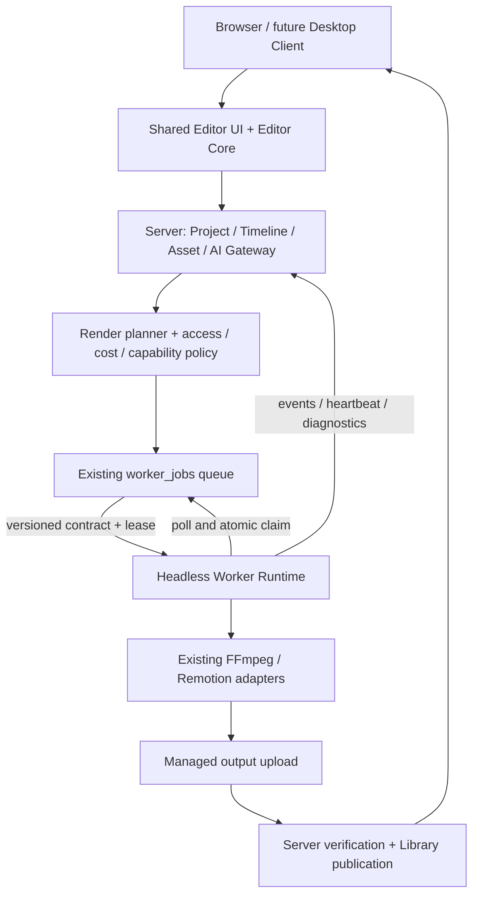

# Feature 184 — Web Video Editor Migration & Headless Worker Architecture

**Status:** Core Web → Worker render slice delivered; advanced parity, runtime proof, migration and deployment gates remain pending
**Version:** 1.0
**Date:** 2026-09-09
**Source:** เอกสารผู้ใช้ “SmartAIHub Specification 01 — Web Video Editor Migration & Headless Worker Architecture” วันที่ 2026-09-09 และ source ใน working tree ณ วันที่ตรวจ
**Owners:** Web Editor, Media Platform, Worker Runtime
**Related:** Feature 133 (Video Intelligence), 179 (Speaker-aware), 180 (Voice/Audio/Dubbing)

## 1. ผลลัพธ์และขอบเขตที่ยืนยัน

ย้าย Video Editor ที่พัฒนาใน Worker App มาเป็น editor หลักบนเว็บ โดย reuse ความสามารถของ Worker editor ไม่ใช่พัฒนาต่อบน editor เว็บรุ่นเก่า ให้ browser ทำ editing/interactive preview ส่วนงาน compute หนักสร้าง job บน server ให้ Worker ดึงไปทำ และส่งผลลัพธ์กลับเป็น managed artifacts ที่ผู้ใช้เปิดจากเว็บและ Library ได้

แยกคำว่า “ของเดิม” ให้ชัด:

1. **Legacy Web Editor:** `VideoEditorPage` → `components/videoeditor/VideoEditor` ที่ `/video-editor` จะถูกแทนที่ด้วย editor ที่ย้ายจาก Worker และเลิกใช้เป็น product entry หลัง cutover
2. **Legacy Worker Editor:** `MediaWorkspaceHost` / `MediaVideoEditorPlayer` คงไว้ชั่วคราวตามเอกสารแนบ เป็นทางกลับระหว่าง migration; ไม่ลบทันที
3. **Video Studio / Video Intelligence:** เป็นอีก authoring flow ห้ามลบทิ้งเพียงเพราะชื่อเกี่ยวกับวิดีโอ; reuse service/compiler ได้เมื่อพิสูจน์ความเข้ากันได้

สเปกนี้อนุญาตการวางแผนแทนที่ legacy web UI แต่ไม่อนุญาตลบ project, asset, render history หรือ shared capability ที่ flow อื่นยังใช้ การลบ source legacy web ทำหลัง import/parity และ dependency audit ผ่าน ส่วนการลบ Worker UI เป็น release ถัดไปตาม gate ใน §16

### Goals

- Web-first editor มีความสามารถเทียบ Worker ปัจจุบัน; UI/skill/policy แก้จาก server/web release ได้
- Canonical project/timeline อยู่ server เปิดต่าง browser/session ได้
- เปลี่ยนหน้าแสดงคิวจาก `/render-jobs` เป็น canonical `/worker-jobs` เพื่อให้ครอบคลุม media processing ทุกประเภท; คง `/render-jobs` เป็น compatibility alias ชั่วคราว และไม่สร้าง queue/control plane คู่ขนาน
- Worker เป็น headless executor สำหรับ jobs ใหม่นี้ ไม่ต้องเปิด editor หรือ browser ค้าง
- รองรับ proxy, capability scheduling, asset locality, diagnostics และ replay
- Final render reuse FFmpeg/Remotion runtime ผ่าน adapter; เตรียม GPU provider ในอนาคต

### Non-goals

- Semantic Scene Score, EDL, B-roll Intelligence และ render graph optimizer รุ่นใหม่
- Full CUDA pipeline, local AI orchestration ใหม่ และการ rewrite sidecar ทั้งหมด
- การยกเลิก Worker job families อื่น เช่น local LLM; ข้อห้ามในสเปกนี้บังคับ media execution lane ใหม่ ไม่ใช่ลบความสามารถทั้ง Worker
- การสร้าง Windows/macOS wrapper และ installer ครบชุดใน migration นี้; ต้องวาง process boundary รองรับไว้

## 2. Repository baseline และข้อจำกัดของหลักฐาน

ตรวจจาก source เท่านั้น ไม่ใช่ production proof; working tree มีงานแก้ค้างรวมทั้ง Worker, scheduler, schema และ videoProjects จึงต้อง re-inventory ก่อนเริ่ม implementation และไม่ย้อนทับงานเหล่านั้น

| จุดปัจจุบัน | Source ที่ตรวจ | ผลต่อการ implement |
|---|---|---|
| Legacy web route | `apps/web/client/src/App.tsx`, `pages/VideoEditorPage.tsx` | คง `/video-editor` และปรับ route ให้เปิด editor ใหม่ |
| Web editor model/service | `apps/web/client/src/types/videoEditor.ts`, `services/videoEditorService.ts`, `services/mediaJobClient.ts` | มี model/adapter เดิม ต้องสำรวจ consumers ก่อน retire |
| Worker authoring UI | `apps/worker-app/src/screens/media-workspace/MediaVideoEditorPlayer.tsx`, `MediaWorkspaceHost.tsx`, `MultiTrackTimeline.tsx` | เป็น baseline การย้าย; ยัง import Tauri โดยตรง |
| Worker timeline logic | `timelineEdits.ts`, `mediaWorkspaceTimeline.ts`, `audioDuckingEngine.ts` ใน directory เดียวกัน | แยก pure logic และ characterization tests ก่อน port |
| Worker persistence | `apps/worker-app/src/types/nleProject.ts`, `screens/media-workspace/projectPersistence.ts`, `useProjectAutosave.ts` | NLE 1.0.0 ยังมี sourcePath/sourceUrl/local file; ต้อง migrate |
| Existing web persistence | `apps/web/drizzle/schema.ts` (`video_editor_projects`), `apps/web/server/routers/videoEditorProjects.ts` | มีตาราง/CRUD ที่ใช้งานกับ Video Editor และ Storyboard/Media Studio อยู่แล้ว; ต้อง reuse หรือขยายอย่างมี compatibility ห้ามสร้าง project store ซ้ำโดยไม่พิสูจน์ migration need |
| Sidecar entry | `apps/worker-app/src-tauri/src/commands.rs`, `worker_executor.rs`, `worker_loop.rs` | reuse executor; แยก dependencies ต่อ Tauri/AppHandle เมื่อจำเป็น |
| Neutral Video Studio model | `apps/web/shared/videoIntelligence/projectSchemas.ts`, `server/routers/videoProjects.ts`, `server/services/videoProjectRepo.ts`, `videoProjectCompiler.ts` | เป็นคนละ model กับ NLE; ห้ามอ้างว่าใช้แทนกันได้โดยตรง |
| Queue/scheduler | `apps/web/server/services/workerSchedulerService.ts`, `apps/web/drizzle/schema.ts` | มี worker_jobs, capabilities, retry, idempotency และ lease อยู่แล้ว |
| Worker transport | `apps/web/server/routes/workerRuntime.ts` | มี heartbeat, jobs/claim, events, references และ artifact upload endpoints |
| Artifact/monitor | `apps/web/server/services/workerArtifactService.ts`, `workerJobMonitorService.js` | reuse publish และ terminal reconciliation; completion ต้องสัมพันธ์กับ artifact จริง |

SocratiCode tools ไม่พร้อมใช้งานใน session ที่เขียนสเปก จึงใช้ targeted shell search/read แทน รายการนี้เป็นจุดเริ่ม impact analysis ไม่ใช่ inventory ทุก command ที่ครบแล้ว

## 3. Architecture decision

เลือก **extract + adapters + queue เดิม** เพราะรักษา Worker feature investment และ contracts เดิมได้:

- ไม่เลือก copy Worker UI ทั้งก้อนเข้าเว็บ เพราะจะติด local paths/Tauri และ direct sidecar calls
- ไม่เลือกขยาย legacy web editor ให้เทียบ Worker ใหม่ตั้งแต่ต้น เพราะจะสร้าง implementation ซ้ำและเสี่ยง feature drift
- ไม่เลือก browser final rendering เป็น default เพราะงาน encode ยาวต้องไม่ผูกกับอายุ tab



Worker เป็นฝ่าย pull งานจาก server; Web ไม่เรียก localhost worker และ server ไม่ต้องเปิด inbound port ไปเครื่องผู้ใช้ ใช้ polling เดิมเป็น transport หลัก; SSE/WebSocket ใช้เพื่อแจ้ง status ได้แต่ไม่เป็นเจ้าของ durable queue

## 4. Responsibility matrix

| Operation | Browser | Server | Worker |
|---|---|---|---|
| Timeline trim/split/move/resize, selection, undo/redo | optimistic local state | validate/persist revisions | ไม่เป็นเจ้าของ state |
| Project load/save/import/export JSON | file selection/download, import review | canonical snapshots, schema migration | อ่าน legacy local file ผ่าน explicit import bridge ได้ |
| Asset upload/Library selection | upload + progress | tenant ownership, metadata, upload authorization | local ingest/download/cache/upload |
| Proxy playback, text/subtitle/image preview | HTML media, Remotion Player, bounded overlays | signed preview access | สร้าง proxy เมื่อจำเป็น |
| Waveform/thumbnails/probe | แสดงผล cache; metadata เบื้องต้นไม่ authoritative | enqueue/store result | authoritative extraction/probe |
| Silence cut/reframe | visualize, tweak, review/apply edit map | validate intent/version | VAD/face/speaker/active speaker analysis, deterministic processing |
| Voice recording | browser microphone เมื่อผู้ใช้อนุญาต | ingest recorded asset | transcode/analyze เมื่อจำเป็น |
| Skills, translation, AI overlay generation, cloud TTS/media | input/review/credit confirmation | gateway/provider keys/policy/billing | local typed inference เฉพาะ capability ที่อนุมัติ |
| Final render/mix/encode/QC measurement | submit/status/cancel/download | immutable plan, scheduling, QC interpretation/publication | FFmpeg/Remotion/hardware encode, raw measurements |

Browser ทำ bounded computation ได้เมื่อยกเลิกได้และไม่ทำให้ editing ค้าง แต่ heavy/long-running analysis ต้องส่ง job ห้าม fallback ไป encode หนักบน server HTTP request หรือใน browser โดยเงียบ ๆ เมื่อ Worker ไม่พร้อม

## 5. Feature parity และ UI contract

Phase 0 ต้องสร้าง parity matrix จาก source + walkthrough ของ Worker รุ่น baseline ที่ระบุ commit/runtime version แต่ละ row ต้องมี source symbol, fixture, target owner, automated/browser/runtime evidence และสถานะ verified/partial/blocked ห้ามนับเพียงมีปุ่มว่า parity ผ่าน

กลุ่ม mandatory:

- Timeline: multi-track video/B-roll/voice/music/SFX/subtitle, trim/split/move/resize, locked/muted tracks, snap/selection, zoom/seek, undo/redo
- Visual: transforms/crop/reframe, image/text/SVG/blur/privacy overlays, React/CSS/Three.js/canvas overlays, compound clips, Ken Burns และ transitions/keyframes ที่พบจาก inventory
- Audio/subtitles: volume, fades, ducking, recording, word timing/style, import/export captions, silence/dead-air review และ edit maps
- Feature 179/180: speaker review/mapping, subtitle-first workflow, localization, consented voices, TTS/alignment/mix/QC ตาม capability เดิม; ไม่บังคับ pipeline ลำดับเดียว
- Assets/projects: Library + uploads, media pool, save/load/autosave/recovery, legacy project import, CapCut draft export ที่เดิมรองรับ
- Output: render profile, preflight/cost confirmation, submit/progress/cancel/retry, output playback/download/Library, diagnostics

UI ใหม่อยู่ `/video-editor`; project deep link ใช้ `/video-editor?projectId=<id>` และต้องเปิดได้จาก Library/ผลลัพธ์เดิม URL เดิมที่มี asset/project parameters ต้องมี compatibility resolver

States ที่ต้องออกแบบและทดสอบ: empty, loading, uploading, missing/relink asset, proxy pending/failed, unsaved/saving/saved, save conflict/offline recovery, no eligible worker, queued/running/uploading/publishing, completed/failed/canceled/expired และ permission denied

ถ้าไม่มี Worker ที่เหมาะสมยัง edit/save ได้ แต่ submit ต้องแสดงสาเหตุ รอใน queue ได้เฉพาะผู้ใช้ยอมรับ wait policy ที่ server กำหนด พร้อม expiry/cancel; ห้ามแสดงว่า render เริ่มแล้ว

ต้องมี keyboard controls/focus, accessible labels, dark/light และ responsive layout; desktop/laptop เป็น full editing surface, tablet/mobile ต้องโหลด/ตรวจโปรเจกต์ ดูสถานะ และไม่ทำ state สูญหาย ข้อจำกัด advanced editing ต้องแสดงชัด

## 6. Shared packages และ platform adapters

Target logical boundaries (เพิ่ม workspace packages เฉพาะเมื่อ extraction จำเป็น; ใช้ npm ตาม repository):

```text
packages/timeline-model/    # canonical NLE schemas, migrations, validators
packages/editor-core/       # reducers, commands, undo, time mapping; no DOM/Tauri
packages/editor-ui/         # browser-compatible React timeline/player/panels
packages/render-contracts/  # job/plan/result schemas + fixtures for TS/Rust
```

Dependencies: UI → core → model; UI/server/worker bridge → contracts; core/model/contracts ห้าม import app implementation หรือ Tauri ไม่ย้ายทุก package พร้อมกันหากทำเป็น safe slices ได้

PlatformAdapter รองรับ `selectFiles`, `importAssets`, `downloadExport`, `notify`, optional recording/capture integration โดย browser คืน File/asset selection ไม่ใช่ absolute filesystem path แยก server client ออกจาก adapter เพื่อให้ desktop wrapper ก็ใช้ server save และ queue เหมือนเว็บ

`invoke`, `convertFileSrc`, filesystem, plugin-dialog, reveal-file และ native credentials ต้องอยู่ desktop adapter เท่านั้น Web build ตรวจ static/transitive imports ว่าไม่มี Tauri runtime dependency; local blob URL ใช้ชั่วคราวก่อน ingest ไม่ persist

UI extraction ต้องรักษาพฤติกรรมเดิมก่อน redesign; การเขียน UI ใหม่ตาม Astryx workflow ใน AGENTS.md ไม่เป็นเหตุให้ rewrite ทุก component ที่ย้ายโดยไม่จำเป็น

## 7. Canonical project / timeline / concurrency

ใช้ **versioned NLE document** ที่รักษา semantics ของ `SmartSpecProjectDraft` เป็น authoring model ใหม่ ไม่บังคับยัด track-based NLE ลง scene-based VideoProjectDocument ของ Feature 133 โดยสูญเสียข้อมูล

Logical persistence ต้องใช้ `video_editor_projects` เป็นฐานของ Web Video Editor ที่มีอยู่แล้ว (รักษา `videoEditorProjects` router/consumers เดิม) และเพิ่มคอลัมน์ที่จำเป็นอย่างปลอดภัยหรือ companion tables เช่น `video_editor_project_revisions` (immutable document/hash/reason/actor), `video_editor_project_assets` (asset linkage) และ project-job relation ที่อ้าง `worker_jobs.id` การเพิ่ม `tenantId/currentRevision/schemaVersion` ต้องมี migration/backfill ที่กำหนด owner และ compatibility ชัดเจน ถ้าตารางเดิมไม่เหมาะกับ field ใดให้สร้าง companion table ที่ผูกด้วย `video_editor_projects.id` แทนการสร้าง `editor_projects` ซ้ำ ชื่อ physical/schema migration ต้องตรวจชนกับตารางจริงก่อนสร้าง และห้ามเปลี่ยน `videoProjects` scene model/router ให้รับ NLE แบบ implicit

Canonical document ต้องมี project ID, schema version, rational fps/timebase, canvas, tracks/clips, media references, markers, render settings, approved edit maps, speaker/subtitle/voice metadata และ migration provenance ทุก persisted media source อ้าง managed asset ref ไม่อ้าง path/URL

- แยก `schemaVersion` ออกจาก `timelineVersion` (monotonic revision)
- Editing offsets เก็บ integer milliseconds ตาม model เดิม พร้อม rational source timestamp mapping; quantize frame ตาม explicit rounding rule ใน compiler เพียงจุดเดียว ไม่สะสม float drift
- Source trim, playback speed, nested clips, variable frame rate และ proxy mapping ต้องมี golden timing fixtures
- Save ทุกครั้งส่ง `expectedTimelineVersion`, `clientMutationId`, document/typed mutation
- Server validate ownership + schema แล้ว compare-and-swap revision และ insert snapshot ใน transaction เดียว
- Stale version ตอบ domain code `TIMELINE_VERSION_CONFLICT` พร้อม latest revision และ fetchable canonical document; ห้าม last-write-wins
- Duplicate mutation ID/payload คืนผลเดิม; ID เดิมต่าง payload ตอบ conflict
- Undo/redo เป็น local command history บน canonical revision; undo แล้ว save เป็น revision ใหม่ ห้ามลด revision number
- Autosave debounce 500–1500 ms, serialize in-flight save และไม่ให้ response เก่าทับ state ใหม่; explicit save ต้อง flush pending edits
- IndexedDB recovery เก็บ unsynced draft ตาม tenant/user/project/baseRevision; หลัง reconnect ให้ review/rebase หาก conflict ไม่เขียนทับ canonical อัตโนมัติ และแยก/ล้าง session cache เมื่อ logout
- Restore snapshot สร้าง revision ใหม่ด้วย expected version และรักษา snapshot ต้นทาง
- Render ต้อง save/resolve conflict ก่อน และ pin exact revision; background result เก่าห้าม auto-apply ทับ timeline ที่เปลี่ยนแล้ว

Field mapping จาก input เดิมต้องเป็น explicit และตรวจได้: project/settings/canvas → project header + format, tracks/clips → canonical tracks/clips, mediaPool/sourcePath/sourceUrl → managed `editor_project_assets` + discriminated asset refs, silent regions/analysis → approved edit-map artifacts, speaker/subtitle/voice metadata → typed review metadata, export settings → versioned render profile การแปลงต้องรักษา unknown fields ใน immutable source/provenance แม้ target ยังไม่รองรับ และต้องมี mapping version ที่เลือก deterministic ได้

Time policy ต้องประกาศใน `timeline-model`: timeline position เป็น integer milliseconds, source media เป็น presentation timestamp ตาม source timebase, และการ quantize ไป frame/output ใช้ rounding rule เดียวที่ compiler ตอนปลายทางเท่านั้น VFR, speed, trim, nested clips และ audio sample boundaries ต้องมี source/output mapping fixture; ห้ามแปลง VFR เป็น CFR หรือ resample audio เงียบ ๆ โดยไม่มี metadata และ tolerance ที่ยอมรับ

## 8. Import และ data migration

รองรับ input อย่างน้อย Worker NLE 1.0/1.0.0 และ legacy web VideoEditorProject; Feature 133 ใช้ explicit conversion เฉพาะ supported subset และไม่แก้ source project

Pipeline: detect format → validate limits → preserve immutable original → preview migration report → resolve/upload/relink assets → convert → validate round trip → save new canonical project

- Worker sourcePath/mediaPool.filePath/originalSourceVideo แปลงเป็น asset ref ผ่าน explicit local ingest/upload; เว็บขอเลือกไฟล์ใหม่หรือใช้ Worker import bridge ที่ผู้ใช้เลือก ห้ามอ่าน arbitrary path จาก browser
- Asset identity ใช้ hash/size และ explicit mapping ไม่เดาจาก basename อย่างเดียว; reject symlinks/path traversal นอก allowlisted workspace/storage pool
- External sourceUrl ต้องผ่าน server ingest policy; ไม่ยอมให้ render contract ดาวน์โหลด URL อิสระ
- Missing media ทำ placeholder พร้อม relink action; block final render จน resolve ครบ
- Unsupported fields เช่น transition/code/compound mapping ต้องรายงานและรักษา original; ห้าม silently drop หรือ flatten แบบ irreversible ถ้ายังไม่มี equivalent ให้ import เป็น review-required ไม่อ้าง parity ผ่าน
- Import idempotent ตาม source hash + migration version + project scope; retry ไม่สร้าง duplicate assets/projects
- CapCut export ใช้ platform download/packaged export; local absolute paths ต้อง relink/manifest ไม่ export broken references โดยเงียบ
- เก็บ legacy data และอ่าน snapshot ได้ตลอด rollback window; ไม่มี destructive migration/drop column ใน feature นี้

## 9. Asset locality และ proxy

Asset refs ใช้ existing managed-media ID types ผ่าน discriminated ref เช่น `media_asset`, `library_item`, `worker_artifact`; ห้ามใช้ bare ID ที่ไม่บอก namespace หรือสมมติ UUID แทน numeric IDs เดิม

Default cloud mode: browser/Worker upload → managed storage (R2) → verified metadata/hash → asset ref → eligible workers

Organization-local mode: registered storagePool ID + normalized relative path + content hash อยู่ใน privileged asset record; timeline เก็บเพียง asset ref Scheduler hard-filter tenant/org และ authorized pool capability ทุก input; worker mount path เป็น local config ไม่ส่งจาก browser

Browser เล่น NAS path ไม่ได้ จึงต้องมี proxy บน R2 หรือ authenticated organization proxy gateway ที่ browser เข้าถึงได้ ถ้าองค์กรไม่อนุญาตแม้แต่ proxy ออกนอกสถานที่ต้องใช้ gateway; หากไม่มีให้รายงาน preview unavailable และห้าม fallback public URL การ replay ไป test worker ต้องมี pool access จริง

Proxy job profile: H.264 720p/1080p, yuv420p, AAC, short GOP/fast seek; เก็บ profileVersion, sourceHash, proxyHash, duration, source/proxy timestamp map, rotation/color metadata และ audio alignment Original เป็น authoritative สำหรับ render ห้ามนำ proxy ไป final render แทนโดยไม่มี user-approved draft profile

Proxy dedupe ตาม tenant + source hash + profile version; waveform/thumbnails เป็น managed derived artifacts มี provenance เดียวกัน ต้อง invalidate เมื่อ source เปลี่ยน Browser streaming รองรับ authenticated range requests/URL refresh/CORS โดย server ไม่ persist expiring URL ใน document

## 10. MediaExecutionContract v1

ชื่อ protocol `smartaihub.media.job`, version `1.0`; เป็น **envelope extension ของ worker_jobs เดิม** ไม่ใช่ transport/queue ชุดใหม่ Existing job types เช่น `remotion_render_video`, FFmpeg assembly, speaker-aware และ unified audio ต้องผ่าน mapping/adapter ไม่ rename payload breaking change โดยงานใหม่เก็บ envelope ใน `worker_jobs.inputJson`, capability requirements ใน `capabilityRequirementsJson`, execution-only controls ใน `instructionsJson` และผล verified ใน `outputJson`; ห้ามสร้างสถานะหรือ queue truth ซ้ำในตาราง/บริการใหม่โดยไม่มีเหตุผลที่บันทึกไว้

Required logical fields:

| Field | Constraint |
|---|---|
| contract/version | strict schema; negotiate supported major/minor before claim |
| jobId/projectId/timelineVersion/traceId | server assigned/bound; revision immutable |
| tenant scope | server-derived; client/Worker claim เปลี่ยน tenant ไม่ได้ |
| operation | allowlisted typed operation; no shell/Python expression |
| inputs | asset refs + expected hashes/metadata; no reusable signed URL |
| renderPlan | immutable stage graph, provider/profile/template versions, hash |
| requiredCapabilities/resourceLimits | hard requirements, timeout, RAM/VRAM/disk/concurrency |
| outputs | declared roles, formats, server-owned destination policy |
| verification | required probe/QC measurements, expected bounds/tolerances |
| retryPolicy/policy | explicit transient errors, max attempts/backoff, approval/billing scope |

Execution attempt แยกจาก immutable payload: attempt ID, worker ID, lease token/expiry, renewed signed URLs และ timestamps อยู่ attempt context การ renew URL ไม่เปลี่ยน contract hash

Initial operation registry:

| Logical operation | Executor / integration |
|---|---|
| `media.probe`, `media.thumbnail`, `media.waveform`, `media.proxy` | bounded FFmpeg/ffprobe adapters |
| `media.silence_detect`, `media.reframe` | existing interactive/silence/speaker runtime extracted adapter |
| `media.speaker_scan`, `media.transcribe`, `media.align`, `media.audio_mix` | route Feature 179/180 typed contracts; preserve their approval policy |
| `video.render` | planner selects NativeFFmpegProvider / RemotionProvider, adapter to existing job types |

Phase 0 ต้อง map ทุก direct processing command รวม `worker_app_detect_silence_custom`, `worker_app_process_media_interactive` และ nested panel commands; file picker/reveal-file ไม่กลายเป็น shell job

RenderProvider มี `canExecute(stage, capability)` และ `execute(stage, context)`; Native/GPU FFmpeg share operation core, GPU provider เป็น future extension Plan ระบุ stages/dependencies/intermediates ชัดเจนและ worker ไม่เลือก business strategy เอง

TS และ Rust validate fixtures เดียวกันและ reject unsupported versions/unknown unsafe fields ไม่มี arbitrary command/code execution escape hatch เพื่อแก้ compatibility

### 10.1 Contract envelope และ operation registry

เพื่อไม่ให้ `jobType` ที่เป็น string เปิดช่องให้แต่ละ client ตั้งชื่อหรือ payload เอง ให้ media lane มี allowlist ที่ version-control ใน `render-contracts`:

| `operation` | New editor job type | Required output / next stage |
|---|---|---|
| `media.probe` | `editor_media_probe` | verified media metadata |
| `media.proxy` | `editor_media_proxy` | proxy artifact + source/proxy map |
| `media.waveform` | `editor_media_waveform` | waveform artifact |
| `media.thumbnail` | `editor_media_thumbnail` | thumbnail/contact-sheet artifact |
| `media.silence_detect` / `media.reframe` / `media.speaker_scan` | `editor_media_analysis` with allowlisted `analysisKind` | typed analysis artifact, review required |
| `video.render` | `editor_video_render` | declared final output artifacts |

Existing `remotion_render_video`, FFmpeg assembly, speaker-aware และ unified-audio `jobType` ยังคงเป็น compatibility families ที่มี explicit adapter mapping; ห้าม rename หรือให้ new editor ส่ง payload ของ family เดิมโดยเดา shape เอง เมื่อ adapter ไม่รองรับ version ให้ fail validation ก่อน claim

Canonical envelope ต้องตรวจด้วย schema เดียวกัน:

ตัวอย่างนี้แสดง execution context เพื่อให้เห็นการผูก attempt; `execution.attemptId` และ lease metadata ถูกตัดออกก่อนคำนวณ `contractHash` ส่วน fields ที่อยู่ระดับ envelope เป็น immutable job contract

```json
{
  "contract": "smartaihub.media.job",
  "version": "1.0",
  "jobId": "job_123",
  "projectId": "prj_123",
  "timelineVersion": 37,
  "operation": "video.render",
  "contractHash": "sha256:...",
  "inputs": [{ "assetRef": { "namespace": "media_asset", "id": "..." }, "sha256": "..." }],
  "stages": [{ "id": "render", "dependsOn": ["proxy"], "operation": "video.render" }],
  "renderPlan": { "profileVersion": "...", "provider": "remotion", "planHash": "sha256:..." },
  "requiredCapabilities": ["remotion"],
  "resourceLimits": { "timeoutSeconds": 3600, "diskBytes": null, "memoryBytes": null },
  "outputs": [{ "role": "final_video", "mime": "video/mp4" }],
  "verification": { "probe": true, "qcProfileVersion": "..." },
  "retryPolicy": { "maxAttempts": 2, "backoff": "exponential" },
  "execution": { "attemptId": "attempt_1" }
}
```

`attemptId`, lease data and renewed signed URLs are execution metadata and are not included in the immutable `contractHash`; `null` resource limits mean the deployment's explicitly recorded profile, never an implicit unlimited value. The server is the only writer of `jobId`, tenant, project revision, plan hash and output destination. Worker registration and claim must first negotiate the supported protocol major/minor and operation versions; an unknown major or unsupported operation is a structured validation failure (`failureCategory=validation`, DB status `failed`), never a retry loop.

## 11. API, scheduling และ lifecycle

Proposed authenticated user API namespace `editorProjects`: create/get/list/save/restore/importPreview/importCommit; `editorMediaJobs`: preflight/submit/get/list/cancel/retry/replay/applyResult ชื่อ procedure เป็น target design ไม่ใช่ endpoint ที่มีแล้ว

ทุก procedure ต้องมี typed input/output และ error envelope โดยอย่างน้อยมี `UNAUTHENTICATED`, `FORBIDDEN`, `NOT_FOUND`, `VALIDATION_FAILED`, `TIMELINE_VERSION_CONFLICT`, `IDEMPOTENCY_CONFLICT`, `CAPABILITY_UNAVAILABLE`, `QUOTA_EXCEEDED`, `JOB_NOT_CANCELLABLE` และ `STALE_RESULT`. Error ต้องมี stable code, redacted message, traceId และ retryability; ห้ามให้ raw worker stderr หรือ provider secrets กลับไปยัง browser

ตัวอย่าง submit contract:

```text
preflightMediaJob({projectId, expectedTimelineVersion, operation, options})
  -> {planHash, pinnedRevision, estimate, requiredCapabilities, expiresAt}
submitMediaJob({projectId, expectedTimelineVersion, planHash, approvalRef, idempotencyKey})
  -> {jobId, attemptId?, state, pinnedTimelineVersion, deduped, traceId}
```

Server ต้องตรวจ authorization ของ project, asset, output และ approval reference ใน procedure เดียวกับการสร้าง queue record; UI ไม่ควรถือว่า estimate หรือ approval จาก revision อื่นใช้ได้

Submit รับ project ID, exact expected revision, operation/options, idempotency key และ approval reference จาก preflight Server revalidate asset access, capabilities, estimated cost/approval bounds และ current revision; สร้าง immutable snapshot/plan + queue record อย่าง atomic หรือ transactional outbox ผลตอบ `{jobId, timelineVersion, state, deduped}`

Preflight estimate ผูก revision/plan hash มี expiry; เปลี่ยน input/cost ต้องยืนยันใหม่ Billing ใช้ existing reserve/reconcile ไม่ deduct ทุก poll/duplicate submit; automatic infra retry ห้ามคิด paid generation ซ้ำ Manual retry/replay แสดง estimate และสร้าง linked job/attempt ใหม่ตาม policy

Credit lifecycle ต้องระบุเป็น idempotent state machine ต่อ logical job: `not_required → reserved → consumed|released`, และ `reserved → released` เมื่อ queue admission, validation, capability, cancellation ก่อน execution หรือ permanent failure ไม่ผ่าน; execution ที่ได้ผลตาม policy จึง reconcile เป็น `consumed` การ reserve เกิดหลัง auth/asset/capability/queue-capacity validation และผูกกับ `idempotencyKey + planHash` duplicate poll/callback ห้ามสร้าง reservation ใหม่ งานฟรีต้องบันทึก `not_required` เพื่อให้ audit ครบ

Reuse Worker HTTP endpoints ใน `workerRuntime.ts`:

- `/api/workers/:workerId/heartbeat`
- `/api/workers/:workerId/jobs/claim`
- `/api/worker-jobs/:jobId/events`
- `/api/worker-jobs/:jobId/references/urls`
- `/api/worker-jobs/:jobId/artifacts/init-upload` และ `/artifacts/complete`

Scheduler hard eligibility ก่อน scoring: authenticated tenant/org pool, user/department permissions, contract/runtime/tool capability, resource limits, storage access, worker health และ available slots แล้วจึง rank load, cache/asset affinity, priority/aging และ reliability GPU vendor name อย่างเดียวไม่พิสูจน์ encoder readiness; probe codec/driver และ refresh หลัง runtime/driver/FFmpeg/sidecar update

Capability registration มี `observedAt`, `expiresAt`, `capabilitySnapshotHash`, supported contract/operation versions และ resource availability; snapshot หมดอายุหรือขัดกับ worker runtime release ให้ hard-ineligible จน heartbeat/doctor refresh สำเร็จ Scheduler ต้องมี bounded queue capacity, per-tenant concurrency/quota, weighted fairness และ aging เพื่อไม่ให้ priority หรือ tenant เดียว starve งานอื่น และต้องตอบ `QUEUE_CAPACITY_EXCEEDED` ก่อนหักเครดิต/สร้างงานหากรับงานเพิ่มไม่ได้

Claim ต้อง atomic และมี lease fencing; worker renew heartbeat ระหว่าง render/upload ไม่ใช่เฉพาะก่อนเริ่ม สถานะ DB เดิมคงใช้ lowercase:

| Execution stage จาก Spec 01 | worker_jobs status |
|---|---|
| RECEIVED | claimed |
| VALIDATING / ACQUIRING_ASSETS | preparing |
| EXECUTING / VERIFYING | running + explicit stage |
| UPLOADING | uploading |
| server commit / Library index | publishing / indexing |
| COMPLETED | completed |
| FAILED_* | failed + structured failure category |
| CANCELLED / lease exhaustion | canceled / expired ตาม policy เดิม |

Queue เริ่ม `queued`; stage events มี monotonic sequence/progress และ attempt ID ออกแบบ at-least-once delivery + idempotent effects ไม่อ้าง exactly-once execution

- Stale/expired lease callbacks และ upload completion ต้องถูก reject; old worker ห้ามชนะ retry ใหม่
- Timeout/offline: mark attempt lost, watchdog requeue ตาม bounded retry policy; hard-limit validation/capability failure ไม่ retry วน
- Cancel queued ทำ atomic terminal transition; cancel running ส่ง cancel request และหยุด process tree ตาม grace timeout ห้าม publish หลัง cancel ชนะ race
- Retry upload ได้โดยไม่ render ใหม่ถ้า verified local output/checkpoint ยังอยู่และ lease ยังใช้ได้; otherwise new attempt ตาม policy
- Dependency failure/cancel propagate ไป dependent stages; no unresolved job ค้าง pending ตลอดไป
- Stage DAG ต้องเก็บ dependency result/checksum และ transition ของแต่ละ stage แบบ durable; stage ที่ไม่จำเป็นจาก render plan ถูก `skipped` พร้อมเหตุผล ไม่ค้าง `pending` แบบไม่มี owner
- Allowed job transitions ต้องตรวจ server-side: `queued→claimed|canceled|expired`, `claimed→preparing|failed|expired`, `preparing→running|failed|canceled|expired`, `running→uploading|failed|canceled|expired`, `uploading→publishing|failed|canceled|expired`, `publishing→indexing|completed|failed`, `indexing→completed|failed`; Worker ส่ง event ที่ข้าม transition หรือใช้ stale attempt ต้องได้ conflict และไม่มี side effect
- Status UI ใช้ server snapshot เป็น truth; event stream reconnect แล้ว reconcile, terminal state reset pending pointer เฉพาะเมื่อยังอ้าง job เดิม

## 12. ผลลัพธ์กลับ server และ apply semantics

Worker upload ผ่าน existing artifact protocol ไป destination ที่ server อนุญาต สำหรับไฟล์ใหญ่ใช้ streaming/multipart/resume ไม่ base64 ทั้งไฟล์ใน callback

Completion manifest ต้องมี job/attempt/lease, role, storage artifact ID, checksum, size, MIME, codec, dimensions/duration, measurements และ provenance Server ตรวจ actual uploaded object/metadata และ authorization ก่อน mark verified ห้ามเชื่อ local path หรือข้อความ “render success” อย่างเดียว

Manifest validator ต้อง reject duplicate roles, undeclared output roles, checksum/size mismatch, artifact tenant mismatch และ output ที่อยู่นอก destination policy โดยบันทึก `verifiedAt`, verifier version และ `verificationWarnings`. Publication unique key คือ `(jobId, role, artifactChecksum)` และ Library linkage ต้องใช้ transaction/idempotency key เดียวกัน เพื่อให้ callback ซ้ำหรือ reconnect ไม่สร้าง output ซ้ำ

Publish transaction/reconciliation ต้องสร้าง output reference + Library item แบบ idempotent และสัมพันธ์กับ job เดียวกัน `completed` หลัง required artifacts verify และ publication สำเร็จเท่านั้น หาก indexing ล้มเหลวแสดง publishing/indexing recovery โดยไม่ render ซ้ำหรือสร้าง Library ซ้ำ

Server สร้าง user notification/event เมื่อ job เข้า terminal stateหรือ recovery state โดยอ้าง status snapshot จาก server; notification ที่ส่งซ้ำต้อง dedupe ด้วย `(jobId, terminalState, revision)`. การแจ้งเตือนไม่มีสิทธิ์เปลี่ยน job state และต้องเคารพ tenant/user notification settings

Render revision N เสร็จขณะ timeline เป็น N+1 ให้แสดง “ผลลัพธ์จาก revision N” พร้อมเปิด/download ไม่แก้ timeline ล่าสุด Analysis/subtitle/reframe results ต้อง review/apply ผ่าน expected version; ภาพ/เสียง/identity/consent ที่ผู้ใช้เลือกไว้ห้ามถูก background result ทับ

## 13. Security และ executable overlays

- Per-worker credentials, rotation/revoke, tenant/org binding ใช้ระบบ auth เดิม; authorization บังคับทุก job/asset/project/result/diagnostic endpoint
- User write APIs ใช้ repository session/auth และ CSRF/origin protection ตามมาตรฐานของเว็บ (ห้ามพึ่งเพียง hidden route); อ่าน/เขียนต้องมี rate limit แยก และ submit/import/render มี per-user/tenant quota พร้อม `Retry-After` เมื่อถูกจำกัด Worker control endpoints ใช้ worker credential/lease แยกจาก user session และไม่รับ credential ของผู้ใช้ใน job payload
- Signed input/output access อายุสั้นและ scoped job/attempt; logs/bundles ต้อง redact tokens, provider keys, signed query strings และ local personal paths
- Job operations allowlist + strict typed options; construct argv ภายใน executor ไม่ส่ง shell string, Python code หรือ raw FFmpeg filtergraph จาก client
- Working directory แยก job/attempt; canonical path containment, symlink/archive traversal/SSRF checks, disk/time/RAM limits และ bounded stdout/stderr
- LLM/cloud AI keys อยู่ server เท่านั้น; worker local inference รับ typed artifacts/models ที่อนุญาต ไม่ตัดสิน semantic importance หรือเรียก cloud provider เอง
- Overlay เป็น trust boundary แยก: legacy generated React/CSS/Three.js ไม่ใช่ “deterministic safe JSON” ต้อง compile/validate เป็น versioned overlay artifact; prohibit remote imports/network/filesystem/process access, sandbox preview ด้วย CSP/isolated origin และ final render ด้วย isolated runtime/resource limits
- ห้ามแก้ข้อห้าม arbitrary code โดยแอบใส่ source code ใน render command Overlay authoring source เก็บเป็น untrusted project data ได้ แต่ executor ใช้ vetted artifact/template เท่านั้น; ถ้า sandbox ยังพิสูจน์ไม่ได้ block overlay render และยังไม่ผ่าน parity gate
- Revoke สิทธิ์ asset/worker ระหว่าง queue/execute ต้อง recheck ตอน issue URL และ publish; browser/server URLs ไม่เปิด tenant data สู่ public

## 14. Diagnostics, replay และ retention

### 14.1 Naming และ route migration

ชื่อ canonical ของหน้านี้คือ **Worker Jobs** เพราะคิวเดียวกันรองรับงานมากกว่า render เช่น proxy, probe, waveform, thumbnail, silence/reframe/speaker analysis, audio และ final render การเปลี่ยนชื่อนี้เป็นการเปลี่ยนชื่อ product surface ไม่ใช่การเปลี่ยน `worker_jobs` table, `jobId`, job state หรือ `/api/worker-jobs/*` protocol

| บริบท | ชื่อที่ใช้ | กติกา |
|---|---|---|
| English route/page key | `Worker Jobs` / `/worker-jobs` | canonical สำหรับ code, deep link, telemetry และ documentation ใหม่ |
| Thai page title | `คิวงานประมวลผลของฉัน` | ชื่อหลักที่ผู้ใช้เห็นบนหน้าแทน `งานเรนเดอร์ของฉัน` |
| Thai navigation/short label | `คิวงาน Worker` | ใช้เมื่อพื้นที่แสดงผลสั้น; อธิบายใต้ชื่อว่า “ติดตามงานที่ส่งให้ Worker ประมวลผล” |
| Operation-specific label | `งานเรนเดอร์วิดีโอ`, `งานสร้าง Proxy`, `งานวิเคราะห์สื่อ`, `งานประมวลผลเสียง` | ใช้ตาม `operation`/`jobType`; คำว่า “เรนเดอร์” สงวนไว้สำหรับ render จริง |
| Deprecated route/label | `/render-jobs`, `Render Jobs`, `งานเรนเดอร์ของฉัน` | ใช้เป็น alias/history compatibility เท่านั้น และห้ามใช้เป็นชื่อใหม่ใน navigation หรือข้อความใหม่ |

Route migration ต้องทำตามลำดับนี้:

1. เพิ่ม authenticated route `/worker-jobs` และให้ `Worker Jobs` เป็น canonical page metadata/title; query เช่น `jobId`, `projectId`, `status`, `operation` ต้องคงความหมายเดิม
2. ให้ `/render-jobs` redirect แบบ client/server ที่รักษา query parameters ไป `/worker-jobs` พร้อม marker ว่าเป็น legacy alias; ห้ามสร้างหน้าแยกหรือ copy status store สองชุด
3. เปลี่ยน internal links, dashboard cards, breadcrumbs, help text, telemetry event names และ test selectors ที่สร้างใหม่ให้ใช้ `worker-jobs`; อ่านลิงก์เก่าและ historical diagnostic URL ได้ต่อจนพ้น deprecation window
4. คง API `/api/worker-jobs/*` และ DB `worker_jobs` ตามเดิม ไม่ rename physical table หรือ job IDs เพียงเพราะเปลี่ยนชื่อหน้า
5. วัด alias hit-rate, canonical page visits, broken deep-link rate และ support/error reports แยกตาม cohort; ลบ alias ได้เมื่อไม่มี unresolved external links และผ่าน rollback drill ตาม §16

Initial rename inventory จาก source ที่ตรวจพบ:

| จุดที่ต้องตรวจ/เปลี่ยน | กติกา |
|---|---|
| `apps/web/client/src/App.tsx` route `/render-jobs` | เพิ่ม `/worker-jobs` เป็น canonical route และเก็บ alias redirect |
| `apps/web/client/src/pages/RenderJobsPage.tsx` | เปลี่ยน page metadata, heading, empty/loading/error copy และ test IDs ที่สร้างใหม่; ชื่อ component เดิมคงได้ชั่วคราวถ้ายังมี consumer |
| `apps/web/client/src/pages/Dashboard.tsx` และ navigation | เปลี่ยน card/nav label และ href ใหม่เป็น `Worker Jobs` / `/worker-jobs` |
| `apps/web/client/src/components/videoStudio/RenderPanel.tsx`, `verticalDramaWorkspaceCopy.ts`, `VerticalDramaStoryboardPanel.tsx` | เปลี่ยนลิงก์/ข้อความนำทางเป็น Worker Jobs; คงข้อความ “งานเรนเดอร์” เฉพาะเมื่ออธิบาย operation render |
| `apps/web/client/src/pages/__tests__/RenderJobsPage.test.tsx` และ route/link tests | เพิ่ม alias/query/label assertions; ไม่ลบ regression ของ historical render jobs |
| server diagnostics/test fixtures ที่มี `dashboardUrl` หรือข้อความ render job | เปลี่ยน URL ใหม่เมื่อเป็น page link; คง operation-specific logs และ payload compatibility |

การค้นหาและเปลี่ยนชื่อภายในต้องแยก page/route vocabulary ออกจาก `jobType` และข้อความ error ของ render operation ห้ามทำ global string replacement ที่ทำให้ “render job” ใน audit, billing หรือ provider diagnostics สูญความหมาย

หน้า `Worker Jobs` ต้องมี filter/group ตาม operation และแสดงคำอธิบายที่ไม่จำกัดเฉพาะ render พร้อม deep link กลับ editor ไม่สร้าง status truth อีกชุด

เก็บ job/trace/attempt ID, project revision, runtime/worker/OS/tool versions, CPU/RAM/GPU/driver, capability snapshot, exact contract/render plan/hash, asset IDs/hashes, stages/start/end, exit code, bounded stderr, warnings, peak memory/VRAM และ output metadata ฟิลด์ที่วัดไม่ได้เก็บ unavailable ไม่ปลอมเป็นศูนย์

Diagnostics UI มี overview/stages/logs/error class/runtime/output, redacted bundle download, retry/replay และ move worker โดย move คือ cancel/fence attempt เดิม + new eligible attempt ไม่ย้าย lease กลาง execution

Replay เป็น job ใหม่อ้าง `replayOfJobId` พร้อม immutable original contract/hash และ runtime pin ถ้า runtime unavailable/asset hash เปลี่ยน/ไม่มี storage pool access ให้ explicit blocked ไม่อ้าง exact replay การ replay แบบ equivalent runtime ต้อง labeled แยก ไม่รับประกัน bit-identical encode ข้าม hardware

Admin replay ต้องมี tenant-scoped authorization/audit และ cost approval สำหรับ paid work เช่นเดียวกับ user; internal test worker ไม่ได้สิทธิ์ข้าม tenant โดยอัตโนมัติ

Retention: pin source + plan + approved overlay/runtime references ตลอด declared replay window; แสดง replayableUntil และ unavailable reason หลัง expiry งาน local-only ต้องประกาศ locality limitation Cleanup ลบ cache/orphan multipart/intermediates ตาม TTL หลัง terminal แต่ไม่ลบ project originals/outputs ที่ยังมี retention/reference

Retention และ deletion policy ต้องระบุเป็นค่าคอนฟิกที่ audit ได้ (`sourceRetention`, `artifactRetention`, `diagnosticRetention`, `replayWindow`, `orphanUploadTtl`) พร้อม owner และ legal/data-residency override; ห้ามใช้ค่า default ที่ไม่ประกาศในแต่ละ deployment ผู้ใช้ลบ/archived project ได้เฉพาะเมื่อไม่มี active job หรือมี explicit cancel policy และระบบเก็บ tombstone/authorization audit เพื่อไม่ให้ stale callback สร้าง asset กลับมา

## 15. Headless runtime และ product separation

Phase แรกแยก executor context ออกจาก Tauri UI แล้วเรียก sidecar เดิมผ่าน adapter ไม่ย้าย FFmpeg implementation กลับไป web server

Target worker process มี config/auth/capability reporter/poll loop/cache/executor/upload/logging โดยไม่มี timeline UI dependency รันเป็น background service/daemon ตาม OS lifecycle และทำงานต่อหลังปิด browser/desktop client รวมถึงไม่หยุดเพราะ renderer process ของ Tauri ปิด

Desktop Client ในอนาคตเป็น web wrapper + native file picker/capture/notifications; Worker Runtime เป็น process แยก Installer อาจเสนอ runtime เป็น optional component แต่ service lifecycle/start/stop/update ไม่ผูก editor mount/unmount Runtime update drain active jobs หรือ checkpoint/cancel ตาม policy ไม่ kill กลางงานเงียบ ๆ

## 16. Rollout, replacement และ rollback

`video_editor_mode = legacy_worker | web_beta | web_default` ควบคุม migration cohort; default เริ่ม legacy_worker; precedence emergency rollback > authorized per-user override > tenant > global และ evaluate server-side

Flag นี้ไม่ทำให้ legacy web กลายเป็น final fallback: ก่อน cutover legacy web route ยังรักษาได้ชั่วคราว สำหรับ cohort ใหม่ route เปิด ported editor เมื่อผ่าน default gate จึงเอา legacy web entry/component ที่ไม่มี consumers ออก ใช้ project import รองรับผู้ใช้เดิม

ลำดับ rollout: internal web_beta → tenant/user cohorts → web_default → legacy Worker deprecation หลังผ่าน telemetry; keep Legacy Worker อย่างน้อย 1 stable release cycle และ ≥30 วัน stable web usage การลบ Worker UI ทำ scheduled major release แยกโดยคง emergency launch path ในช่วง deprecation

Default gate:

- ≥95% parity ตาม inventory ที่ freeze denominator และมีหลักฐาน; critical editing/save/import/render/asset/security flows ต้อง 100% ไม่ใช้ค่าเฉลี่ยกลบ data-loss feature
- ทุก feature ที่ยังไม่ parity ระบุ fallback/impact ชัดและห้าม retire capability นั้น; privacy blur/consent/locked tracks ไม่ถือ optional
- ≥30 วัน stable usage; render failure rate ไม่สูงกว่า legacy บน cohorts/profile/input complexity ที่เทียบกันได้ ไม่พอ sample ให้ขยายเวลา
- Save/restore/conflict/proxy/diagnostics/replay และ UI-close headless proof ผ่าน
- ไม่มี unresolved data-loss, duplicate charge, cross-tenant exposure หรือ silent field dropping
- Migration success/support/relink telemetry ผ่าน release review; ไม่รวมการ import ที่ partial ว่า success

Rollback ปิด cohort flag/หยุด new submissions ที่ไม่รองรับ คง jobs ที่ lease ถูกต้องทำต่อได้ เปิด last-known-good web build หรือ Legacy Worker เฉพาะ project version ที่อ่านได้; backward export ต้องผ่าน compatibility report ถ้าอ่านไม่ได้ให้ server snapshot read-only ไม่ downgrade สูญข้อมูล ห้าม drop schema/jobs/assets เพื่อ rollback

ก่อนเปิด cohort ใหม่ต้องมี canary dashboard/alert สำหรับ save conflict, import loss, proxy failure, queue wait, render failure, duplicate publication, credit reconciliation และ cross-tenant denial พร้อม owner/on-call threshold ที่ release review อนุมัติ หาก metric หรือ data-integrity alert ข้าม threshold ให้หยุด rollout และคืน flag ตาม precedence ใน section นี้; การเปลี่ยน default ต้องเป็น config migration ที่ย้อนกลับได้และต้องทดสอบ flag cache invalidation ทุก server instance

## 17. Implementation work packages และ exit gates

| Phase | งานที่ต้องส่ง | Exit / dependency |
|---|---|---|
| 0 — Baseline/contracts | command inventory, parity matrix, schema/import fixtures, threat boundaries, protocol mapping, current dirty-source baseline | ทุก operation มี owner/contract หรือ explicit blocker; ก่อนแก้ shared exports ทำ impact analysis |
| 1 — Durable server/headless vertical slice | project CAS/revisions, media envelope over queue เดิม, claim/capability/fencing, executor adapter, upload/publish | API submit → real Worker FFmpeg → Library, ไม่เปิด editing UI; existing job-family regression ผ่าน |
| 2 — Browser editor MVP | extracted core/UI/platform adapter, load/save/import, asset/proxy, trim/split/subtitles/basic overlays, status/cancel | browser create/edit/save/reload/render/result E2E; no Tauri runtime dependency |
| 3 — Full parity | advanced tracks/overlays/audio/undo, Feature 179/180 panels/adapters, migration round trips | ≥95% measured + 100% critical; unsupported rows ไม่หายจาก matrix |
| 4 — Fleet/replay/service hardening | scoring/affinity/local pools, diagnostics/replay, independent process lifecycle, chaos/resource recovery | cross-worker authorized execution, local storage eligibility, stale lease/upload failure/headless proof |
| 5 — Default replacement | cohort rollout, data migration telemetry, `/worker-jobs` naming/route migration, legacy entry retirement, rollback drill | §16 gates ผ่าน; legacy web ถูกแทน, Worker Jobs alias ยังย้อนกลับได้ และ Legacy Worker ยัง emergency compatible |

Hard capability/access/lease/artifact checks ต้องมีตั้งแต่ Phase 1 ไม่รอ Phase 4; Phase 4 เพิ่ม fleet optimization และ full operational coverage Project persistence/schema owner ต้องเป็น single writer ระหว่าง implementation เพื่อลด migration conflicts

ทุก phase ส่ง focused code/test/evidence และอัปเดต parity/contract matrix ห้ามถือ spec นี้เป็น authorization ให้ deploy, consume paid generation หรือ migrate production data โดยอัตโนมัติ

Definition of done ของทุก work package ต้องแนบ: changed contract/schema version, migration/backfill dry-run result (ถ้ามี), auth/tenant test evidence, fixture IDs, operational runbook/rollback note, telemetry fields/dashboard owner และ list ของ skipped checks; review ที่มีแต่ mocked worker ไม่ถือว่าเป็น headless execution proof

## 18. Validation และ acceptance tests

| ID | Scenario | Pass criteria |
|---|---|---|
| AC-01 | Worker NLE + legacy web import | clips/tracks/timing/styles/metadata preserved, original retained, unresolved fields/assets visible |
| AC-02 | Pure browser session | full core edit/save/preview ไม่มี Tauri/global/native path dependency |
| AC-03 | Two tabs save same revision | หนึ่งสำเร็จ อีกอัน conflict; no lost update; stale response ไม่ทับ newer local draft |
| AC-04 | Offline/refresh/restore | recover unsynced draft, explicit conflict handling, restore สร้าง new revision |
| AC-05 | Double submit/network retry | one logical job/reservation, changed payload with same key rejected |
| AC-06 | Real FFmpeg + Remotion output | exact pinned revision renders, verified managed output appears once in Library |
| AC-07 | Proxy VFR/speed/trim/audio mapping | seek/source boundaries และ lip/subtitle alignment อยู่ใน approved tolerance fixtures |
| AC-08 | No Worker/missing codec/VRAM/pool | reason shown, hard eligibility enforced, no silent browser/server heavy fallback |
| AC-09 | Offline Worker/duplicate delivery | fenced attempt, bounded retry, old callback cannot complete newer job |
| AC-10 | Cancel during execute/upload/publish | atomic winner, no unauthorized late publication or permanent pending UI |
| AC-11 | R2 timeout/low disk/corrupt output | classified failure/resumable policy, no false completed/no duplicate output |
| AC-12 | Close browser/Desktop Client | independent runtime continues and status/result recover from server after reopen |
| AC-13 | Cross-tenant ID/path/URL/overlay attacks | denied before execution/publication; secrets absent from diagnostic export |
| AC-14 | Analysis result from old revision | review available, stale apply rejected, user choices preserved |
| AC-15 | Replay on eligible test Worker | exact inputs/versions or explicit unavailable; linked job + audit + bounded billing |
| AC-16 | Existing render families and features | Remotion/Vertical Drama/Feature 179/180 jobs, cancellation and outputs remain compatible |
| AC-17 | Default/rollback | same route opens new editor, old projects accessible, flag rollback preserves data/jobs |
| AC-18 | Worker Jobs naming/route migration | `/worker-jobs` shows `คิวงานประมวลผลของฉัน`, old `/render-jobs` deep links preserve query context through alias redirect, operation labels cover non-render jobs, and API/DB/job IDs remain unchanged |

Proposed quality targets (ต้อง calibrate โดยบันทึก reference hardware/browser/media fixtures ใน Phase 0 ก่อนใช้เป็น release benchmark):

- 1080p proxy, 10-minute project, 200 clips: timeline interaction p95 ≤100 ms บน reference laptop; seek-to-preview p95 ≤500 ms หลัง warm cache
- Autosave acknowledgment p95 ≤2 s หลัง debounce บน normal test network; zero lost acknowledged revisions ใน concurrency/restart fault suite
- Timing golden tests: cut/seek boundary error ≤1 output frame และ audio alignment error ≤20 ms เมื่อ profile รองรับ; mismatched/unsupported source ต้อง explicit fail/report
- Cancellation acknowledged ≤5 s เมื่อ Worker online และ process termination ≤15 s ตาม configured grace; watchdog/lease tests ใช้ bounded simulated clock
- Telemetry แยก queue wait, execution, upload, publication, proxy latency และ failure category; ห้ามรวม queued wait เป็น render compute latency

Test layers: unit reducers/schemas/migration/time map/eligibility; integration CAS/queue/leases/artifacts/billing; actual sidecar FFmpeg/Remotion; authenticated browser E2E; chaos offline/R2/disk/codec; Windows/macOS headless lifecycle ก่อนประกาศ platform support

Contract tests ต้องรันกับ canonical JSON fixtures ข้าม TypeScript/Rust และตรวจ unknown-field rejection, version negotiation, replay hash, event ordering และ allowed-transition table; property/fuzz tests ครอบคลุม timeline bounds, path/URL/overlay input และ idempotency keys Browser E2E ต้องตรวจ keyboard/focus, responsive states, reconnect และ notification รวมถึงผลลัพธ์จาก revision เก่า ส่วน load/latency benchmark ต้องเก็บ hardware/browser/media fixture manifest ไม่รายงานตัวเลขจากเครื่องที่ไม่ระบุ

Repository ใช้ npm; implementation ต้องใช้ scripts ที่ตรวจจาก package.json ณ เวลานั้น ตัวอย่าง focused verification paths เดิม:

```bash
npm --workspace apps/web test -- --run server/services/__tests__/workerSchedulerService.test.ts server/services/__tests__/workerArtifactService.test.ts
npm --workspace apps/web test -- --run server/routers/__tests__/videoProjects.render.test.ts
```

เพิ่ม tests สำหรับ feature ใหม่ตาม phases; browser-facing Vitest ใช้ `--environment jsdom` Rust executor ต้องมี contract/lease/artifact tests และ real sidecar smoke แยกจาก mocked unit tests Full web build, browser proof, worker packaging, runtime execution, migration dry-run และ deployment ต้องรายงานแยกกัน

## 19. ADR และ Spec 02 boundary

- ADR-184-01: Worker editor เป็น source of feature parity; แทน legacy web editor ที่ route เดิม
- ADR-184-02: Canonical NLE แยก schema จาก Feature 133 โดย explicit adapters ไม่ lossy replacement
- ADR-184-03: Extend existing worker_jobs/transport/artifact lifecycle; no second render queue
- ADR-184-04: Web/Server control and intelligence, Worker deterministic media execution
- ADR-184-05: Immutable revision/plan + leased attempts + idempotent publication
- ADR-184-06: Asset IDs/proxy mapping แทน persisted local paths/expiring URLs
- ADR-184-07: Retain Legacy Worker through measurable migration gate; independent headless runtime
- ADR-184-08: Replay requires retained inputs/runtime/locality and scoped authorization

Spec 02 เริ่มต่อได้เมื่อ Phase 2–3 พร้อม โดย consume canonical project, job contracts, provider abstraction และ approval boundaries ของ feature นี้ สำหรับ semantic editing/EDL/B-roll/AI QC/GPU optimization ห้ามเพิ่ม policy/LLM logic กลับลง Worker UI

## 20. Specification verification record

### Requirement traceability จากเอกสารแนบ

| เอกสารแนบ | ส่วนที่รับผิดชอบในสเปกนี้ |
|---|---|
| §1–4 summary, goals, non-goals, principles | §1–4 และ ADR-184-01 ถึง ADR-184-04 |
| §5–9 target migration, Web UI, timeline, assets, proxy | §5–9, AC-01 ถึง AC-04, AC-07 |
| §10–17 contract, capability, scheduler, lifecycle, adapters/providers | §10–11, §15, AC-05–AC-12 |
| §18–20 observability, replay, security | §12–14, AC-09–AC-15 |
| §21–22 product separation and legacy deprecation | §15–16, AC-12, AC-17, AC-18 |
| §23–27 phases, tests, acceptance, ADR, dependency on Spec 02 | §17–19 และ AC-01–AC-18 |

Traceability ใช้ตรวจว่าทุก requirement ในเอกสารแนบมี owner/acceptance หรือถูกระบุเป็น non-goal/blocked; การมีข้อความในตารางนี้ไม่แทน evidence จาก implementation

- อ่านเอกสารผู้ใช้ครบหัวข้อ 1–27 และตรวจ source entrypoints/model/queue/transport ที่ระบุใน §2
- ตรวจความต่าง legacy web vs legacy Worker, NLE vs scene model, uppercase lifecycle vs existing DB statuses และ organization-local preview access แล้วกำหนด adapter/migration rules ในสเปก
- ผ่านการ review 30 รอบแบบแยก lens ครอบคลุม scope/traceability, migration/timebase, asset/proxy, contract/API/auth, queue/scheduler/lease, billing/artifact, diagnostics/replay/retention, UX/rollout และ verification; follow-up naming review เพิ่มเติมหลังการเปลี่ยนชื่อ; ledger อยู่ที่ `orchestra/web-video-editor-spec-20260909/review-rounds.md`
- ช่องว่างที่พบระหว่าง review ถูกแก้ในเอกสารทันที ได้แก่ field mapping/time policy, job allowlist/envelope, typed errors/CSRF/rate limits, credit lifecycle, capability freshness/fairness/backpressure, durable transitions, artifact idempotency, notification dedupe, retention/tombstones, canary gates และ cross-language evidence
- หลังเริ่ม implementation มีการตรวจเทียบ implementation กับสเปกซ้ำ 10 รอบที่ `implementation/reviews/implementation-vs-spec-review-10-rounds-20260909.md`; แก้ local gaps เรื่อง Worker `mediaPool`/trim mapping, canonical IDs/timing/markers, operation/analysis-kind allowlist, status transitions, media-plan DAG/hash, asset URL/path/MIME, analysis executor, artifact context, CAS input และ rollout config พร้อมแยก runtime gaps เป็น BLOCKED/PENDING
- รอบ deep-plan สร้างเอกสารโดยไม่เรียก provider หรือรัน paid job; implementation slice ที่ทำต่อภายหลังบันทึกแยกไว้ใน `implementation/evidence/feature-184-manifest.md` และไม่ถือเป็น production proof
- Acceptance criteria ที่ต้องใช้ Worker/sidecar/browser/database/deployment ยังเป็นข้อกำหนดและมีสถานะ BLOCKED/PENDING ตาม evidence manifest; focused local tests ของ implementation slice บันทึกไว้ใน `implementation/evidence/local-proof-20260909.md`
