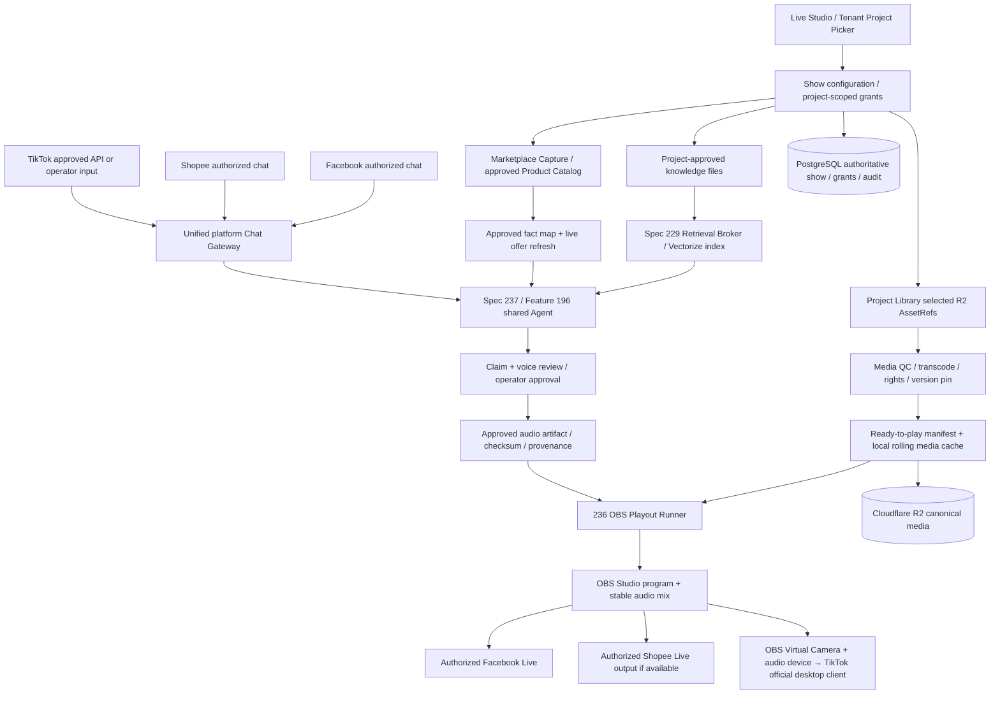

# Spec 236 — AI Live Commerce & Project Library Broadcast Engine

> **Normative intent:** A Project-scoped AI live studio. Assemble previously approved videos from multiple accessible SmartAIHub Projects and Library into a continuously replenished, locally cached playout buffer; use OBS for one stable program feed; connect eligible Facebook/Shopee/TikTok distribution and authorized chat; request *approved spoken answers* from the shared Realtime Multimodal Agent in Spec 237. Do not create a second Voice Agent, RAG, permission system, billing ledger or durable job authority.

## 0. Scope, boundaries and release profile

- **P0**: tenant Project selection, rights-checked Library video picker, playlist and deterministic 180-second ready-to-play buffer, OBS safe-boundary transition, manual Q&A WAV fixture, Facebook authorized test output, safety fallback and operator UI.
- **P1**: Project RAG and Marketplace Capture mapping; Spec 237 voice co-host; approved chat connectors for Facebook and Shopee in parallel; TikTok official desktop Virtual Camera + separate monitored audio bridge; 2+ approved destinations if account capability permits.
- **P2**: assisted AI show planning and automatic library selection; scalable dedicated media relay or separately composited per-platform programs *only if* measured demand warrants; approved native shopping controls; enterprise tenancy.
- No automatic checkout, speculative inventory or price, undocumented chat scraping, automated third-party login/2FA, unreviewed AI product claims, autonomous unsupervised high-risk public speech, compulsory lip-sync or provider-specific vendor lock-in.
- **Number gate:** Registry/main/PR/worktree check before registration/merge. If 236 or 237 is occupied, stop and allocate available IDs consistently; do not overwrite any earlier spec.
- **Deployed-code gate:** Spec 224 is currently in progress, and the actual DB migration state has not been independently certified in this conversation. This spec cannot approve production schema changes or treat planned contract descriptions as implemented APIs. Read the deployed migrations, journal and owner evidence before additive DDL. Spec 213 live browser certification status does not silently become an OBS readiness receipt.

## 1. Canonical component ownership

| Concern | Canonical owner | 236 responsibility only |
|---|---|---|
| Existing Project/Library asset identity, rights, R2 objects | Library / Spec 220 / Spec 233 | Read-only Project media references, scoped grants, asset availability and playout cache |
| Media generation and editing | SmartAIHub Media Studio / Video Editor | Request existing completed assets; invoke production only for replenishment when authorized |
| Production semantic retrieval | Spec 229 + existing Cloudflare Vectorize | Bind permitted knowledge-source revisions to show; never build an independent RAG |
| Conversation, planning, Tool resolver, realtime voice | Feature 196 + Spec 237 | Ask for signed spoken-answer artifact under live_show mode |
| Durable render/transcode/TTS job state | Existing `worker_jobs` Feature 186/195 | Idempotent job submission, subscribe to status; no new global job ledger |
| Real-time OBS/AV control | Spec 236 Live Playout Controller on registered Runner | Serialized media actions, safe interrupt, local cache and continuity |
| Authorization/approval | Spec 220 + existing approvals | Enforce show/asset/voice/publish receipts and revoke gracefully |
| Credits/usage | Spec 207 existing economic authority | Attribute media, inference, TTS, broadcast compute and egress; do not dual-charge |
| Issue/alert | Spec 228 | Emit incidents/health signals; no separate incident truth |
| Cloudflare transition | Spec 232 | Consume currently deployed transport; independent media plane stays online |

`worker_jobs` is durable work authority for render, transcription, transcoding, validation, indexing, scheduled show preparation and auditable tool effects. **It is not the clock, audio-packet queue, every word event or frame scheduler.** The OBS controller has local ephemeral media state and durable 236-specific receipts, not competing universal execution authority.

## 2. End-to-end architecture



Cloudflare Workers handle API, tenant access, signaling, status, coordination and short HTTP actions; managed PostgreSQL via Hyperdrive remains SoT; Vectorize is retrieval projection; R2 is media store. **Do not run OBS, persistent encoders or long-lived media sessions inside stateless Workers.** Use a registered Windows Runner or an explicitly provisioned persistent media VM. An optional Cloudflare Realtime SFU may help multi-user preview, *not* substitute RTMP distribution or OBS.

## 3. Project selection and source-of-truth composition

At show creation choose `tenant_id`, `live_project_id`, `show_owner`, `project_media_refs[]`, `knowledge_scope`, `catalog_scope`, `destinations[]`, `operator`, `locales`, `on_air_policy` and an immutable `show_revision`. Project references may span other projects only through explicit cross-project, same-tenant grants; cross-tenant access is denied unless a product-level published asset entitlement is established. No implicit admin visibility into private projects.

Three separately governed source groups:

1. **Library/Project videos:** immutable media version IDs, R2 key, origin Project, rights/licensing, consent/voice likeness, moderation/QC state, checksum, duration, orientation, caption track, audio profile, linked SKU, approved cut boundaries and revocation state. A thumbnail or manifest is not proof that media bytes can be read.
2. **Project Knowledge:** explicitly selected Library files or approved Project RAG collections; file versions pinned per show. Use Spec 229 index/retrieval under tenant, project, principal, source-set and SKU constraints; raw files remain in R2; PostgreSQL controls ACL/version/current source. Reject not-indexed, stale, unapproved or revoked facts until ingested/certified.
3. **Marketplace Capture / product catalog:** integrate with *verified existing* capture/catalog APIs once actual schemas and authorization are inspected. Normalize captured SKU/listing/product attributes, media rights and source URLs into a proposed Product Evidence Adapter. Captured descriptions are **untrusted supplier/marketplace data**, not automatically approved on-air facts. Obtain current price/promo/stock from authoritative platform/store endpoints and attach freshness TTL. When platform-specific offers differ, only broadcast safe shared claims; native cart/pin is platform-specific.

Do not claim an integration is implemented solely because prior planning documents named Marketplace Capture. Verify live deployed API, schema, account entitlements and test fixtures at implementation preflight; if absent, ship an approved product CSV/manual review adapter behind a feature flag without cloning a catalog.

## 4. Library playlist and rolling buffer — mandatory new first-class feature

### 4.1 Compilation

`show_revision` owns a versioned `playlist_revision`; each entry has `asset_version_ref`, `origin_project`, `playlist_order`, `clip_in/out`, `safe_pause_points`, `linked_product_id`, `fallback_asset_ref`, `operator_approval`, `prepared_media_ref`, `normalized_duration`, `rights_expiry`, `qc_signature`. Preserve mapping from the original Library asset to every derivative render and broadcast occurrence.

The playlist compiler shall validate MIME/container and codecs on target Runner; preflight network retrieval using short-lived permitted URLs; verify file hash and rights; transcode/render via existing media jobs when needed; normalize video resolution/fps/time base, loudness, audio channels and caption safe areas. AI-selected clips are proposals pending at least the configured content/publication review. The original guideline's P0 baseline is **480×854 portrait at 25 fps** (configurable after actual platform quality/ingest testing); alternative landscape or HD outputs require per-destination encoder/bitrate certification, and source clips of mixed aspect ratio use an approved crop/letterbox rule rather than an uncontrolled stretch.

A long video may be split only at confirmed safe speech/visual boundaries. **Never assume arbitrary timeline splits create closed-mouth pauses.** Unsupported transitions should play the entire current approved segment before Q&A. Independent product overlays may update without re-rendering the clip.

### 4.2 Buffer invariants

- `PENDING` (library selection) → `FETCHING` → `QC_PENDING` → `PREPARED` → `LOCAL_VERIFIED` → `RESERVED` → `ON_AIR` → `CONSUMED` or `REJECTED/REVOKED`.
- **180 seconds target** of contiguous, approved, *local-verified* next-playable video, **90 seconds warn** and **20 seconds fallback guard** as configurable initial defaults, not a compulsory viewer delay. Do not count R2-only, in-transcode, failed, unauthorized, expired or out-of-order clips as playable seconds.
- Atomic write `.partial` → `.ready` after checksum, ffprobe and fsync/rename where supported. A playout process must not read a half-downloaded video. Cache contains at least one complete verified fallback loop and independent operator-approved evergreen library content; enforce cache quota and disk-pressure thresholds.
- Producer fills ahead from selected Project Library, not an infinite auto-generative dependency. Refill jobs may request a new approved render via existing Media Studio only when explicitly permitted and within budget. If all eligible video is used, policy may `LOOP_APPROVED`, `PAUSE_TO_FALLBACK` or `STOP_AFTER_NOTICE` with operator-selected behavior; prohibit hidden unbounded repetition.
- During show, `append`, `reorder-unplayed`, `remove-unplayed`, `switch_project`, `change_product` use compare-and-set playlist revisions and preflight gates. No mutation of actively airing segment bytes. If a source is revoked, immediately bar future start and transition safely out of current content under rights policy; kill immediately when legally/security required, even if visually abrupt.
- Cloud unavailable: continue with signed, nonexpired cached manifest and approved local media within scoped offline lease; deny new unsourced spoken facts, payment/offer claims and unsafe state transitions; reconcile audit on reconnect.

### 4.3 Local playout timeline

`show_epoch + playlist_revision + segment_sequence + media_hash` uniquely identify intended clip. Serialized OBS command lane persists next cursor before interrupt, waits for actual media-completed callback (verified timeout only as fallback), switches `SALE → LISTEN → QA → RESUME`, and starts the exact next segment. On controller restart, inspect actual OBS scene, stream status, media source and session epoch before acting. Never blindly replay scene commands or restart all destinations. No two audible speaking voices; duck/mute tested end-to-end. If QA or audio artifact expires before safe boundary, discard and continue `SALE`.

## 5. Spec 237 Live Co-host speech contract

Spec 236 **does not** own voice-session cognition, provider token issuance, provider-specific audio rendering or Tool policy. It submits `LiveQuestionContext` to Feature 196 / Spec 237 with `{show, tenant, project, source_scope_digest, product_snapshot, destination_applicability, observed_product_context, question_provenance, freshness_deadline, approval_policy}`. For a live chat message, the provider's microphone ingress is *not* needed; chat text enters normalized Command Gateway and the shared Agent generates a vetted text+speech response.

`ApprovedOnAirSpeech` must contain: question ID; final normalized Thai answer; supported fact IDs + source revisions; pricing/inventory freshness receipt if used; source-set hash and project grant; claims-policy verdict; operator or certified-policy approval ID; voice consent; WAV/PCM artifact checksum; duration; expiration; destination applicability; provider usage receipt and `answer_id` idempotency key. Do not accept `draft_audio` or a provider's raw, unmoderated speech stream as public broadcast speech.

Spec 237 renders and validates speech off-air while OBS continues presenter clips. Once `READY_TO_AIR`, 236 requests safe-boundary interrupt and revalidates product, project grant, promotion TTL, replay rights and content expiry **immediately before audible playback**. For live output, prefer a fully prepared 5–25 second file with deterministic OBS completion; private user voice mode may use full-duplex WebRTC. Streaming broadcast voice is P2 only after chunk-level safety, mixing, cancel/recovery and no-leak certification.

## 6. Platform distribution and chat

OBS is the media program generator, **not** a universal authorized chat API. Two separate adapter families:

- `LiveDistributionAdapter`: Facebook RTMP(S), Shopee approved external encoder where the particular account supports it, TikTok official LIVE Studio/Shop LIVE Manager via OBS Virtual Camera **plus separate monitored virtual audio device**. Optional multiplexer/relay requires real licensing and destination health observations.
- `PlatformInteractionAdapter`: officially granted Meta comments, approved Shopee Livestream Management app/comments and TikTok approved access if granted; otherwise explicitly tagged operator-assisted input. No undocumented private endpoint, cookie scraping, bypass of app review, or assumption that TikTok LIVE Studio exposes a public comment API.

Capabilitiy manifest per *tenant/account/destination*: `can_stream`, `can_read_chat`, `can_pin`, `can_fetch_offer`, `can_manage_live`, `ai_content_permitted`, tested formats, permissions evidence, expiry and `approval_verified`. A demo RTMP key from another market does not prove a Thai seller is enabled. OBS stream-connected is not equivalent to all platform viewer-side sessions live; independently confirm every destination.

Dedup messages per `(tenant, platform, live_id, message_id)`; preserve platform timestamp, estimated delay, viewed SKU confidence and viewer privacy. Never accidentally attribute a Shopee shopper by name on Facebook. Multi-channel output shares one spoken answer: if a claim is platform-specific, identify the channel explicitly *only if that audience can safely hear it*; otherwise answer generally or run separately composited programs.

## 7. States, contracts and data (illustrative additive schema)

`PREPARING → PREFLIGHT → READY → STARTING → SALE → INTERRUPT_PENDING → LISTEN → QA → RESUME → SALE`, with `DEGRADED`, `FALLBACK`, `MANUAL`, `STOPPING`, `ENDED`, `RECOVERY`. State transitions use epoch, expected prior state, serialized command sequence, observed OBS acknowledgement and append-only receipt.

Proposed tables or existing-table extension *subject to actual schema inventory*: `live_shows`, `live_show_sources`, `live_playlist_revisions`, `live_playlist_entries`, `live_media_preparations`, `live_asset_cache_receipts`, `live_destinations`, `live_platform_capabilities`, `live_product_mappings`, `live_questions`, `live_speech_artifacts`, `live_playout_events`, `live_operator_actions`. Unique keys for source asset versions, question ingest, authorized voice render, airing receipt and start/stop intents. Keep product/catalog tables as existing-owned; a live show references them, not copies master data.

Example API under existing `/v1/live` namespace: `POST /shows`, `POST /shows/{show}/sources`, `POST /shows/{show}/playlist:compile`, `POST /shows/{show}/assets:append`, `POST /shows/{show}/preflight`, `POST /shows/{show}/start-intent`, `POST /shows/{show}/emergency-hold`, `POST /shows/{show}/stop`, `GET /shows/{show}/buffer`, `GET /shows/{show}/destinations`, `GET /shows/{show}/timeline`. All mutation actions enforce ownership, approval, idempotency, revision and role; actual deployed route compatibility is discovered before adding endpoints.

The documented data model is a **design proposal**. No DDL may run until canonical migrations (including prior unresolved sequencing issues), branch state and Spec 224 economic certification/deployment dependencies are independently checked. Favor expansion-only migrations and independently enabled feature flags.

## 8. UI/UX and operator controls

One Live Studio page with mobile/tablet responsive support and six working views:

1. **Project & Sources:** select live Project; browse permitted other-Project Library clips with provenance/rights; select RAG files/collections and Marketplace Capture SKU/listing subsets; evidence coverage, indexing state and factual approval badge.
2. **Show Builder / Timeline:** AI-proposed run-of-show, drag-optional reorder, active SKU context, clip duration and safe Q&A boundaries, per-item preview and captions, append while running with revision controls.
3. **Buffer Monitor:** `prepared_seconds`, contiguous local-verified seconds, R2 download, active transcodes, last-playable cursor, 180/90/20 thresholds, fallback clip, disk quota, cache outage mode and per-source failures.
4. **On-Air Director:** OBS program preview, on-air clip, next safe cut, single-speech audio meters, voice-agent health, question queue, approve/skip, manual audio mute, emergency hold and per-platform start/stop.
5. **Destinations & Commerce:** Facebook/Shopee/TikTok capability/approval/ingest/chat/offer state independently; cross-platform price-conflict warnings; real platform LIVE status and official native shopping-console action where API not supported.
6. **Audit & Economics:** what asset and product fact were broadcast, whose approval, which voice was used, per-platform session health, CPU/GPU/egress and credits consumed, incident links to Spec 228.

Roles: tenant owner, project owner, live admin, operator, moderator, content reviewer and read-only observer. Permissions for content access, product claims, voice likeness, stream publish and emergency stop are independent. Emergency stop/mute remains locally available during cloud outages.

## 9. Operational safety / recovery

- Independent health checks for R2/local cache, available media seconds, OBS websocket, OBS output, real destination, platform chat lag, market offer freshness, provider TTS, approval latency, node disk/memory and CPU/GPU.
- Failure policy: RAG/voice/chat fails → continue presenter, no fabricated speech; video buffer below hard threshold → approved fallback without restarting healthy streams; OBS control disconnect → existing OBS continues, no blind commands; RTMP destination down → independent retry/alert without interrupting other outputs; TikTok virtual audio down → block TikTok launch/alert or supervised stop while independent channels stay on.
- `show_epoch` fencing must prevent a reconnected old Runner from controlling a new show or speaking a previously expired answer. Secure OBS WebSocket on localhost, credentials in existing secrets service, trusted outbound Runner channel; never expose OBS control socket publicly.
- On-air use requires visible AI/prerecorded presenter disclosure per approved policy. Voice/avatar rights and product images/footage licenses checked on every reused Project clip. Explicit policy review per platform/country; do not infer AI Live permission from ability to start video.

## 10. Work packages and independent rollout

| WP | Scope | May proceed when | Acceptance receipt |
|---|---|---|---|
| P236.0 | Registry/schema/API/read-only inventory; Project Library and Marketplace Capture contract discovery; original guideline regression fixtures | Immediately, separate from unfinished Spec 224 | Validated source contract and collision-free tentative ID |
| P236.1 | Project Library picker + rights/cross-project access + deterministic playlist and media QC | 236.0; signed assets | Version-pinned manifest, cache hashes, approved preview |
| P236.2 | Local OBS Runner + rolling 180s buffer + safe-boundary resume and fallback | 236.1; supervised OBS staging | 100 interruptions, 60-minute continuity test |
| P236.3 | Facebook authorized live path + status + manual comment adapter | Approved real test account | Platform viewer-side confirmation and safe stop |
| P236.4 | Spec 237 approved spoken-answer contract + Project RAG + Marketplace Catalog | Spec 237 P0/P1 deployed and source review | Supported facts and approved WAV through OBS |
| P236.5 | Shopee approved API/RTMP and TikTok desktop bridge in parallel behind account-specific flags | Independent platform authorizations | Per-destination permission and media/chat capability receipt |
| P236.6 | Multistream reliability/economics and optional canary | 236.2–236.5 as individually applicable | Isolated destination outage drills and cost accounting |

Tracks may run concurrently, but no individual destination is released before *its* gate is satisfied. Do not wait for Shopee/TikTok access before shipping an authorized Facebook path; do not infer a platform is supported by the existence of an adapter mock.

## 11. Measurable production acceptance

- 60-minute staging Facebook run with at least 20 scheduled co-host QA insertions and **zero scene-change-induced OBS output restarts**; viewer-side delivery measured separately. 90-minute multi-destination rehearsal when and only when all requested account approvals are available.
- 100 boundary pause/resume cycles without skipped/duplicated prepared clips, interrupted words or simultaneous speech. Restart controller during an active OBS output and reconcile exact next cursor.
- 1,000-asset mixed-Project fixture including inaccessible/revoked/unlicensed/partially downloaded/expired videos: no unauthorized or corrupt bytes on air. Append/reorder 100 queued clips during active playout without modifying the currently airing asset.
- Simulated R2 outage and render outage with initially 180s prepared: monitor actual playable buffer, enter safe fallback on depletion, never confuse storage/object availability with local readiness.
- 500 synthetic mixed-platform comments with duplicates, timestamp skew, stale product context, injected instructions and conflicting pricing; no cross-tenant read, platform identity collision or incorrect claim.
- 100 approved product FAQ fixtures (including unavailable price and cross-platform price disagreement): zero unsupported claims in tested on-air output, verified source and version receipts, operator emergency hold and TTS failure recovery.
- Actual account approval/AI-content eligibility and OBS+audio test on every released platform. No fictitious `LIVE_CONFIRMED` solely from OBS output status.
- Budget guard, credits reservation/settlement through existing economic API and replay-safe refund/cleanup under fault injection; add production smoke and cost limits after target environment is benchmarked.

## 12. Explicit source references and implementation caveats

Original provided guideline: `AI Co-Host Live Commerce — Technical Specification v1.0`; prior companion: `SmartAIHub_AI_Live_Commerce_Multiplatform_Spec_v1_1.md`. Preserve safe pause, 180/90/20 reserve, no RTMP restart, operator takeover, OBS WebSocket v5, provider-neutral AI Co-host and output disclosure, but supersede its assumption that source video is principally generated per show: **Project Library is first-class input.**

Technical references to verify on implementation date:
- OBS WebSocket v5: https://github.com/obsproject/obs-websocket/blob/master/docs/generated/protocol.md
- OBS Virtual Camera: https://obsproject.com/kb/virtual-camera-guide
- OBS multiple RTMP outputs: https://obsproject.com/forum/resources/multiple-rtmp-outputs-plugin.964/
- TikTok Shop Thailand LIVE Manager guide: https://seller-th.tiktok.com/university/essay?knowledge_id=7921660338882305
- Shopee API access and current Thai AI Live terms: recheck the actual authorized seller/partner console and current terms rather than trusting archived announcements as sufficient permission.

---

# R2 normative hardening — 12 completed cross-spec review passes (2026-09-24)

The following requirements are **normative amendments** to Sections 0–12, not optional commentary. Where a prior R1 example conflicts with R2, R2 takes precedence. Spec 236 remains the **media/playout and distribution owner**; Spec 237 remains the **Feature-196 realtime modality and vetted spoken-artifact owner**. Proposed endpoints/tables remain contingent on an actual deployed-repository inventory. Companion files: `AUDIT_12_PASSES_236_237.md`, `CROSS_SPEC_IMPACT_236_237.md`, `contracts/*.schema.json`, and `IMPLEMENTATION_HANDOFF_236_237.md`.

## 13. Pass 1 — Ownership, API discovery and backward compatibility

Before code changes, capture a **deployed contract inventory** (commit SHA, migration journal, OBS version, Feature 196 ingress, Feature 195/186 `worker_jobs`, Library asset reference API, Marketplace Capture read surface, Spec 229 retrieval, Spec 207 billing and approval interfaces). Classify each dependency `DEPLOYED_CERTIFIED | DEPLOYED_UNVERIFIED | PLANNED_ONLY | ABSENT`. Adapter calls to `PLANNED_ONLY/ABSENT` are blocked with a named owner and test fixture; a spec document is not runtime evidence. Existing text Chat, Library, Marketplace Capture and Spec 224 implementations must behave identically with both feature flags off. A Spec 236 local OBS media controller is not a second global orchestration authority. **Acceptance:** baseline integration snapshots and feature-disabled regression suite pass before any write-enabled canary. Registry/main/PR/worktree conflict preflight for IDs 236 and 237 is a separate required gate.

## 14. Pass 2 — Library provenance, cross-project permissions and revocation

Define `LiveSourceGrant` with `tenant_id`, show owner, `source_project_id`, immutable `asset_version_ref`, R2 object version/digest, allowed live destinations, commercial and derivative rights, image/voice likeness grants, music territory/time limits, expiry, grant revision and granting principal. Cross-project use requires an explicit scoped grant; publication of an asset to Library **never** implies unlimited live-broadcast rights. Every preparation and future clip start verifies an active grant and unexpired asset/license policy. Store a **derivative lineage DAG** from source asset to normalized/prepared asset, captions, thumbnail and OBS occurrence. On revocation: reject all queued/future segments; evict local prepared copies according to policy; invalidate affected preview links and unplayed voice artifacts through Spec 237. For rights that require immediate global takedown, do **not** offer offline playout: require a live control channel, with emergency mute/hold and operator escalation if unreachable. Other eligible preapproved content may use a short renewable offline grant whose expiration is enforced locally; never claim that an offline Runner learned about an unseen revocation instantly. **Acceptance:** 100 cross-project entitlement/revoke/expiry cases and offline-partition scenarios, with zero unauthorized future starts after the Runner receives revocation or lease expiry.

## 15. Pass 3 — Deterministic buffer scheduling and cache integrity

Define `ready_contiguous_seconds(t)` as the sum of durations of **the next sequential unplayed entries** from current playout cursor which are `LOCAL_VERIFIED`, rights-valid, QC-approved, checksum-matched, and locally readable at `t`; stop counting at the first gap. A `RESERVED` currently airing clip is tracked separately; an optional noncontiguous-ready number is diagnostic only. Buffer target/warn/guard remain 180/90/20 seconds **of ready contiguous future footage**, not network queue length or audience delay. Each media preparation uses a dedicated existing `worker_jobs` job; duplicate worker completions settle once into a prepared-asset digest, then an atomic Runner cache manifest transaction. Each cache entry is validated by media probe plus cryptographic hash *after* final rename; cache eviction pins active, next and fallback files and prioritizes nonreserved least-recently-needed derivatives. Prepared assets may not be counted from R2 alone or before OS cache/disk admission succeeds. If refill throughput is persistently below play rate, show `DEPLETION_FORECAST`, move to approved evergreen/repeat/fallback under operator policy, and never promise indefinite unique clips from a 180-second reserve. **Acceptance:** interrupted downloads, wrong hash, missing next entry, disk full, parallel refill, slow network, and asset-revocation fault injection.

## 16. Pass 4 — Safe editorial assembly and exact continuation

A playlist entry declares `sequence_id`, `asset_version_ref`, `prepared_sha256`, start/end PTS or frame range, silence/closed-mouth verification evidence where applicable, `safe_interrupt_after`, linked canonical product **and variant**, content/moderation approval, rights expiry and deterministic successor. Media transcoding shall normalize **constant playback clock/time base**, audio sample rate/channel layout and seekable keyframes; 480×854/25 fps is an initial quality profile only. Q&A may interrupt only after a verified approved boundary; if none exists, finish the clip or use a separately approved full-screen product/silence transition. Before a cut, persist `(show_epoch, playlist_revision, current_sequence_id, next_sequence_id, next_media_hash, interruption_intent_id)` then atomically reserve the speech answer. A playlist append that does not affect the imminent cursor should not invalidate approved speech; an active product/context change must invalidate it. **`show_revision` advances only for material show-level changes (Project/source grants, approval policy, voice profile, program audience and other security-relevant settings). `playlist_revision` advances for future timeline edits; `product_context_revision` advances for the actively presented product/variant. A harmless future-only playlist append must not spuriously advance `show_revision`.** The controller shall correlate OBS media completion to the input **and media generation**, not assume that a late `MediaInputPlaybackEnded` event refers to the new clip. **Acceptance:** 1,000 randomized play/swap/reorder/safe-interrupt traces; 100 restart/resume sequences; no skipped/repeated clip except explicit operator replay.

## 17. Pass 5 — Product truth and catalog reconciliation

A show binds a versioned **Product Evidence Set**: canonical SKU, exact variant/quantity/unit, Project-approved document/file versions, approved claims and their supporting fact IDs, authoritative owner/manufacturer/manual references where present, normalized Marketplace Capture listing mappings, and explicit destination-offer applicability. Marketplace Capture is a potentially stale **evidence ingress**, never current stock/price truth nor automatic permission to repeat efficacy/testimonial copy. A fact is publishable only after a category-specific reviewer/policy attests provenance, scope, validity window and allowed destinations. Prices/promotions/availability require an entitled authoritative refresh at answer time and again before OBS starts speech, or else the answer must remove those claims. Do not substitute a similar variant simply because Vectorize ranks it highly: exact SKU/variant retrieval before Spec 229 semantic expansion, with PostgreSQL ACL and fact-version recheck after retrieval. A selected Project RAG document disappearing or changing invalidates any **unplayed** answer citing it. When platforms disagree about terms, speak neutral shared facts and direct viewers to the relevant official in-app product card; a multi-RTMP fan-out does not create per-platform speech isolation. **Acceptance:** conflicting variants, stock race, revoked documents and cross-platform coupon fixtures; zero unsupported on-air claims in certified test corpus.

## 18. Pass 6 — Formal 236↔237 handshake, revalidation and ambiguous effects

Both implement the **same versioned schemas** under `contracts/`: `LiveQuestionContext v2` is a request, not permission to publish; `ApprovedOnAirSpeech v2` is a **signed, immutable, reviewed audio-artifact offer**, not proof it has aired. Bind answer to `tenant_id,project_id,show_id,show_epoch,show_revision,question_id,answer_id,product_context_revision,source_set_digest,source_scope_grant_ref,required_destination_digest,policy_version,approval_receipt_ref,voice_grant_ref,audio_sha256,expires_at`. The `playlist_revision` and safe-boundary position live in the *separate playout reservation*, so adding an unrelated future clip does not needlessly expire approved speech. On `reserve`, `pre-air check`, `start`, and `complete`, 236 verifies the version, trusted issuer/audience, grant/approval, exact product context, **actual currently broadcasting destination set**, fact/offer TTL and original audio hash; do not trust caller-supplied `READY_TO_AIR` text alone. Claim the answer once using the existing show-specific receipt ledger and show-epoch fencing. If media-playback acknowledgment is lost, record `AIRING_UNCERTAIN` and require observation/operator reconciliation; do not automatically replay the answer or falsely record `COMPLETED`. Separate retries for artifact fetch and OBS command transport from retries that could cause audible duplication. **Acceptance:** 100 signed-contract positive/negative fixtures shared with 237, 100 duplicate callbacks, expired approvals and wrong-destination tests.

## 19. Pass 7 — OBS, output monitoring and independent platform health

Probe the *deployed* OBS and obs-websocket 5.x request/event manifest at Runner pairing, including actual media-source plugin behavior, stream output state and source-reload semantics. The controller has **one serialized OBS mutation actor** scoped by `show_epoch` and Runner lease, with per-command idempotency and observed-state reconciliation. Claim an exclusive `(runner_id, obs_instance_id)` owner lease for the show; a second concurrent show may use a distinct OBS instance, not mutate the current instance through another actor. Required public audio order at the safe cut: mute the presenter → enter `LISTEN` → load cohost source muted → enter `QA` and verify presenter mute → unmute and start the verified WAV → wait for actual matching completion → mute cohost before resuming presenter. OBS acknowledgments are necessary but alone do not establish viewer-side playback; record uncertain state when observation is lost. `GetStreamStatus` proves only the OBS output queried; a multi-RTMP plugin, relay and TikTok desktop client need **separate observer receipts**. Define `destination_state = UNCONFIGURED | PERMISSION_PENDING | PREPARED | INGEST_CONNECTED | PLATFORM_LIVE_CONFIRMED | DEGRADED | DISCONNECTED | STOPPED | UNKNOWN`; user-facing LIVE requires platform confirmation or explicitly documented verification method and age. TikTok OBS Virtual Camera transports **video only**: verify dedicated monitored audio input, microphone privacy, echo/loop prevention, hotplug/reconnect, A/V sync and desktop-client operator login. Do not say that camera connection authorizes live streaming or chat access. A Shopee RTMP route remains disabled until the specific account exposes an authorized ingest. Endpoints with failed policy or access may be independently excluded; never silently route their feed through an unapproved workaround. **Acceptance:** per-output drop drills while other destinations remain broadcasting, TikTok silent-audio fault and real-platform viewer-side confirmation.

## 20. Pass 8 — Security, privacy, rights, anti-injection and emergency actions

All viewer messages and marketplace pages are untrusted; sandbox text retrieval, strip tool directives in quoted data, block cross-project fact exposure, audit tool intent and never let an OBS Browser Source fetch privileged internal APIs using long-lived browser credentials. Use short-lived Runner-bound media URLs or authenticated proxy, **no raw R2 keys or OBS WebSocket password in browser, prompt, log or MCP result**. Preserve viewer pseudonyms per platform/live; cross-platform replay of a viewer's name/avatar requires explicit lawful entitlement, otherwise use anonymous paraphrase. Always display an accurate prerecorded/AI disclosure on approved destination feeds and review the **account/market-specific** AI content/commerce rules. Emergency `HARD_MUTE` must be local and operable even if the cloud control plane is unavailable; `EMERGENCY_HOLD` swaps to a preapproved slate; `STOP_DESTINATION` is independent per authorized output when supported. Distinguish a stop *intent* from an observed stop and alert on partial failure. **Acceptance:** injection/permission/revocation fixtures, leak-free exported diagnostics, offline local kill-switch and external stop confirmation.

## 21. Pass 9 — Failure recovery, offline leases and economics

Persist a monotonic append-only show event stream plus transactional outbox in existing PostgreSQL, but keep subsecond audio/video scheduling **on the Runner**; existing `worker_jobs` owns render/transcode/fact sync/TTS jobs and long-running approved effects. On Runner restart reconcile signed show lease, current OBS scene/input/output, prepared clip hashes, cursor and uncertain airing receipts; never send an `OBS StartStream` blindly. During cloud outage use **nonexpired signed offline play policy** only for approved cached video and an allowlisted evergreen message; deny new AI QA, stock/promo quotes, unapproved project switches and remote financial actions. Require operator-presence policy and a configurable maximum unattended broadcasting duration; insufficient disk/network/CPU triggers controlled fallback. Cost admission/settlement uses Spec 207 reference for each durable paid job and measured encoder/relay egress, provider audio seconds and parallel destinations; retry/resume must not duplicate a logical charge. Track stream-hours and bandwidth per destination; a primary RTMP reconnect is not proof multioutput recovered. **Acceptance:** 60-minute cloud outage drill only when the offline-lease policy allows it, controller crash during QA, duplicate job delivery and no double-bill tests.

## 22. Pass 10 — UI/UX, operations and observability

Expose a **single source-of-truth operator timeline**: current on-air clip/variant, next media cursor, verified contiguous local seconds and depletion forecast, read-only origin Project/asset rights, prepared Q&A text/fact links, audio duration and checksum, chat provenance, per-destination LIVE receipt age, OBS VU/meters, output transport health, emergency controls and clear `UNKNOWN/UNCERTAIN` badges. A stale UI event must not override an epoch-newer view; websocket reconnect obtains a canonical PostgreSQL snapshot and replays from last event sequence. UI is responsive on phones/tablets; media generation is asynchronous and never stalls OBS. Accessibility: keyboard control for operator hard mute, screen-reader action labels, captions and visually distinguishable live/preview/manual states. Alerts route into existing Spec 228; no second alert owner. Retention policy and export/delete requests cover viewer chat and optional QA audio, while immutable compliance receipts use scoped redaction. **Acceptance:** operator task test on desktop/mobile, simulated disconnect/resubscription, 100-revision timeline edits and emergency mute under local/cloud outage.

## 23. Pass 11 — Quantitative release gates and platform policy

Promote **independently per destination and tenant**: verify owner/operator permissions, live-stream route, chat scope if claiming automated chat, allowed AI-synthetic-content policy, paid commerce approval if required, current disclosure, source media rights, measured Thai audio route and a real viewer-side broadcast receipt. Run a **60-minute single-destination** staging broadcast and **90-minute multidestination** staging only for authorized channels; inject >=20 Q&A safe-boundary changes, >=100 clean pause/resume cycles, >=500 deduplicated synthetic chat events, 100 factual QA including high-risk negative cases, forced TTS/OBS/provider/network failures. Desired test outcomes: no OBS scene-triggered primary stream restart, no two speech tracks, no unsupported factual claim in the defined fixtures, no cross-tenant leak, zero false VERIFIED receipts. Observe reconnect time, actual buffer exhaustion, per-destination audio gap/lip-sync and p95 answer prep; do not misstate proposed targets as service guarantees. Any inaccessible external platform is `NOT_TESTED/NOT_APPROVED`, not a block on an independently approved channel. **Acceptance:** immutable rehearsal evidence pack and named release owner per destination.

## 24. Pass 12 — Deployment gates, migration and implementable handoff

Implement `P236.0` read-only repository/registry/schema/rights inventory and deterministic mock OBS first; `P236.1` media/cache and fixture Q&A; `P236.2` Runner OBS and Facebook authorized staging; `P236.3` Project RAG/catalog approved-fact integration; `P236.4` Spec237 signed speech handshake; `P236.5` independent approved Shopee/TikTok route; `P236.6` resilience/economics/multistream certification. Every package defines code owner, feature flag, input fixture, negative tests, metrics and rollback. Preserve the Spec 212 design/corpus baseline and current Spec 224 worktree, original WorkPackages and Final Verify; neither is runtime proof by itself. Do not apply shared-schema migrations until actual journal replay and approval evidence are verified; if blocked, use interface-only/staging local state and report `DDL_BLOCKED`, not a guessed migration. Registry collision requires a new joint numbering decision for 236/237 and a traceable alias, never overwriting an occupied spec. P1 automated question output remains manual-approved until a **separate Spec237 policy gate** is certified; earlier prose about low-risk auto-approval is future opt-in only. Store source/contract hashes and replayable contract fixtures so post-upgrade incompatibilities fail closed instead of silently speaking an unreviewed answer.

**R2 media outcome:** The Library-to-OBS playout path can progress without shipping real-time AI first, and Realtime Agent private voice can progress without shipping a live platform. The only public-speech bridge is a tested `ApprovedOnAirSpeech v2` artifact with fresh verified facts, explicit media rights, exact product context, all-current-destination applicability and an independent 236 OBS airing receipt.

---

# R3 Production-Closure Addendum — 12 additional audit passes

> **Normative precedence:** Sections 25–36 are R3 requirements. They supersede conflicting R1/R2 examples while preserving the ownership boundaries above. R3 does not claim implementation or production certification.

## 25. Pass 13 — Viewer-time context, chat latency and product-observation binding

A live question MUST NOT be bound only to the product currently visible in OBS when SmartAIHub receives the comment. Distribution latency differs by destination and can change during a show. Introduce a `BroadcastObservationWindow` carrying `destination_id`, platform live ID, observed platform timestamp, local ingest timestamp, estimated end-to-end latency range, candidate segment sequence(s), candidate product-context revision(s), and confidence. The answer compiler may proceed automatically only when the SKU/variant is uniquely resolved or the generated answer explicitly names the product without asserting ambiguous price/promotion facts. If two plausible product contexts remain, ask for clarification, defer, or answer only shared facts.

Maintain one monotonic server timeline and a separately observed OBS/program timeline; never compare wall clocks without recorded offset/uncertainty. NTP/clock-health is part of preflight. A platform reconnect or latency jump invalidates cached latency assumptions. **Acceptance:** replay synthetic comments at ±0–45 second destination delays across product transitions; zero wrong-SKU price/promotion speech in the fixture corpus.

## 26. Pass 14 — Active/standby Runner, split-brain prevention and media-plane failover

Production MAY run a warm standby Runner/OBS node, but only one node may own a `(show_id, show_epoch, playout_lease_epoch)` mutation lease. A standby may prefetch/cache media and validate OBS scene inventory, but MUST NOT start public output, mutate scenes, or play co-host audio until it receives a newly fenced lease. Lease transfer requires control-plane decision plus destination-specific recovery policy; stale runners are denied even if they retain local files or WebSocket access.

A failover is not transparent by definition: destination RTMP/TikTok desktop sessions may require reconnect or human confirmation. UI must distinguish `CONTROL_FAILOVER_READY`, `MEDIA_FAILOVER_REQUIRES_RESTART`, and `DESTINATION_HUMAN_ACTION_REQUIRED`. Never run simultaneous active outputs to the same platform live session unless the platform explicitly supports redundant ingest and that mode is certified. **Acceptance:** kill active controller before/after scene mutation and before/after QA playback; standby never duplicates speech or publishes with stale epoch.

## 27. Pass 15 — Backpressure, overload policy and graceful quality degradation

Define bounded queues for chat ingest, moderation, retrieval, answer review, TTS preparation, media downloads and transcodes. Each queue has capacity, age SLO, shedding policy and operator-visible reason. Chat overload prefers clustering and sampling repetitive low-value questions; it must never shed emergency operator controls, current buffer refill, revocation events or stop/mute actions. When LLM/TTS capacity degrades, continue presenter content rather than accumulate stale answers.

Video-buffer protection outranks speculative AI generation: reserve local disk/network/CPU for already approved next-playable media before optional render/transcode work. Encoder resource saturation must not be worsened by background AI jobs on the same node. **Acceptance:** 10× synthetic comment burst plus simultaneous media refill; buffer stays above hard guard or enters deterministic fallback, and no stale Q&A is aired after queue-age expiry.

## 28. Pass 16 — Contract/version compatibility and rolling-deploy safety

Every cross-service envelope MUST carry `schema_version`, producer build/version and minimum consumer capability. R3 defines `LiveQuestionContext v3`, `ApprovedOnAirSpeech v3`, and `PreAirPlaybackReservation v1`. During rolling deployment, producer and consumer negotiate a documented compatibility matrix; unknown mandatory fields or unsupported higher major versions fail closed. Additive optional fields are tolerated only when canonical validation says they are optional.

Database and API rollout follows expand → dual-read/shadow-validate where needed → promote → contract. Do not require a flag-day upgrade of Cloud control plane, Runner and browser UI. R2 speech artifacts may remain readable for audit but are not newly issued once R3 is promoted. **Acceptance:** N-1/N mixed-version fixtures prove either safe compatibility or explicit block; no silent field drop for tenant/show/product/audience/approval bindings.

## 29. Pass 17 — Local cache confidentiality, revocation and secure deletion semantics

Project video, product media and approved speech cached on Runner are private tenant assets. Cache records include tenant, project, source revision, rights expiry, offline-lease expiry, encryption-at-rest state and last authorized use. Use OS/account isolation and encrypted volume or application-level encryption appropriate to the deployment; never expose reusable R2 signed URLs in logs. Cache index access is scoped to the registered Runner identity.

Revocation immediately removes future eligibility and schedules local purge. If a file is currently open/on-air, follow the stronger of rights/legal/security stop policy; otherwise finish only if policy explicitly permits. Secure deletion on SSD/cloud volumes cannot be guaranteed as physical erasure; record logical deletion and rely on encrypted-key destruction/storage lifecycle rather than claiming impossible forensic wipe. **Acceptance:** revoke cross-project asset during online and offline-lease states; no new start after revocation and no asset appears in another tenant's cache index.

## 30. Pass 18 — Platform capability/policy freshness and emergency kill switches

`live_platform_capabilities` are time-bounded evidence, not timeless configuration. Each capability carries source, account, region, app/review status, tested software/API version, `verified_at`, `valid_until`, and policy-review owner. Preflight refuses expired capability evidence for publish, AI-content permission, chat automation or commerce actions. Platform policy changes can disable a destination independently without blocking unrelated approved destinations.

Provide three kill scopes: `MUTE_AI_ONLY`, `HOLD_PROGRAM`, and `STOP_DESTINATION` plus `STOP_ALL`. Local operator paths for mute/hold must remain available when cloud control is unavailable. All kill actions are higher priority than ordinary queue processing and generate durable receipts after reconnect. **Acceptance:** inject expired capability and emergency-stop races; public effect obeys most restrictive current state.

## 31. Pass 19 — Editorial continuity, repetition control and provenance-aware reuse

The playlist compiler tracks semantic/editorial metadata: topic, product, campaign, call-to-action class, recent-air history, minimum repeat interval and incompatibility rules. Automatic refill MUST NOT create an accidental infinite loop of the same persuasive clip, outdated promotion, conflicting before/after claim, or duplicated intro/outro. Reuse across Projects requires explicit rights and must preserve original provenance.

When a show switches product/campaign, unplayed cached clips whose `product_context_revision` no longer matches move to `INELIGIBLE_FOR_CURRENT_CONTEXT` rather than silently remaining next in queue. **Acceptance:** 3-hour simulated show with source exhaustion and product switches; bounded repetition and zero stale-promotion clip starts.

## 32. Pass 20 — A/V clock, loudness, drift and device-hotplug certification

Normalize prepared media to certified container/codec/time-base/audio sample rate and loudness profile. Track actual segment duration from probed media, not catalog metadata alone. Measure OBS program A/V drift and co-host audio start/end against program clock; establish warn/block thresholds from staging measurements. A virtual audio-device restart or Windows device renumbering must invalidate the TikTok audio readiness receipt until loopback is retested.

Use one public speech bus and one isolated private/operator bus; no desktop-monitor feedback path. **Acceptance:** 90-minute broadcast, repeated QA insertions, device hotplug/restart and sample-rate mismatch fixtures with no double audio, unbounded drift or silent destination falsely shown healthy.

## 33. Pass 21 — SLOs, error budgets, capacity and cost envelopes

Define measured SLOs per layer: contiguous local buffer seconds; cache fetch/transcode p95; OBS mutation ack p95; Q&A approval age; destination live-confirmation freshness; chat ingest lag; TTS preparation latency; operator emergency mute latency; failed/uncertain airing rate. SLO breach policy chooses degrade/hold/stop and is not merely dashboard decoration.

Capacity planning records uplink Mbps per output, encoder sessions, CPU/GPU headroom, disk IOPS/cache size, media egress and provider spend per live hour. Credits bill logical effects once and distinguish preproduction, realtime inference/TTS and continuous broadcast infrastructure. **Acceptance:** publish benchmark sheet for target Runner hardware/network and enforce admission/concurrency limits derived from evidence rather than hardcoded marketing assumptions.

## 34. Pass 22 — Untrusted media/chat defense, prompt injection and data exfiltration prevention

Treat captions, subtitles, OCR/transcripts, marketplace descriptions, viewer chat and metadata inside uploaded video as untrusted data. They cannot redefine system/tool policy, request secrets, alter destination credentials or grant cross-project access. Any model used for clip selection or moderation receives least-privilege data and no raw platform secrets. Tool output shown to the Agent is schema-normalized and provenance-tagged.

Do not read abusive/private chat aloud by default; sanitize question display and spoken paraphrase. Detect attempts to make the co-host reveal hidden prompt, project-private facts, internal pricing, access tokens or other viewers' data. **Acceptance:** malicious subtitle/OCR/chat fixtures attempting instruction override and exfiltration; zero unauthorized tool invocation/data disclosure.

## 35. Pass 23 — Disaster recovery, backup/restore and audit integrity

Back up authoritative show configuration, playlist revisions, source grants, question/answer provenance and playout receipts using existing PostgreSQL/R2 policies. A restore creates a new `show_epoch`; it never resumes a historical public live session automatically. Media cache is reconstructable and not the only copy of canonical assets. Test restoration of audit evidence separately from restarting a broadcast.

High-value public-action receipts SHOULD be tamper-evident through append-only sequencing plus cryptographic digest chaining or existing equivalent audit service; this is integrity evidence, not a replacement for database backup. **Acceptance:** restore from backup into staging, verify provenance graph and prove no old start/QA intent can execute in the new epoch.

## 36. Pass 24 — Model-based state tests, chaos tests and release rollback

Create executable state-machine/property tests for show state, playlist cursor, media cache, answer lifecycle, destination state and lease fencing. Invariants include: at most one active playout owner; at most one public speech item audible; no aired answer without current preair reservation; no segment consumed twice except explicit replay; no destination reported confirmed-live from OBS status alone; no stale grant survives revocation.

Chaos suite: control-plane loss, R2 partial download, DB retry, duplicated webhook, clock skew, OBS WebSocket drop, media-ended event loss, disk-full, TTS timeout, provider 429, destination disconnect, active Runner death and operator kill during every transition. Rollback is feature-flag/version scoped; never roll back schema by destructive down-migration while a newer Runner may still write. **Acceptance:** invariant suite and chaos matrix are release-blocking for P236.5+; failures produce deterministic recovery state and evidence.

### R3 cross-spec preair reservation contract

Before any public answer is audible, Spec 236 creates a short-lived `PreAirPlaybackReservation` after inspecting current observed audience, product context, grants, OBS state and next safe boundary. The reservation binds:

```text
tenant_id / project_id / show_id / show_epoch
question_id / answer_id
product_context_revision
observed_destination_digest
source_scope_grant_ref
approved_audio_sha256
safe_boundary_segment_sequence
not_before / expires_at
playout_lease_epoch
reservation_nonce
```

Spec 236 validates `ApprovedOnAirSpeech v3` against this reservation immediately before opening the public speech bus. A destination-set change, product-context change, approval/source revocation, show epoch change, lease transfer or reservation expiry invalidates it and requires reevaluation. `AIRING` is written only after OBS reports start under the same reservation; `COMPLETED` only after observed end. Missing end receipt becomes `AIRING_UNCERTAIN`, never optimistic completion.

**R3 236 outcome:** The broadcast engine now closes temporal-context, HA, overload, compatibility, local-cache privacy, policy freshness, editorial, A/V drift, SLO/cost, injection, DR and chaos-test gaps while keeping OBS/media control separate from Feature 196 cognition and Spec 237 realtime interaction.
