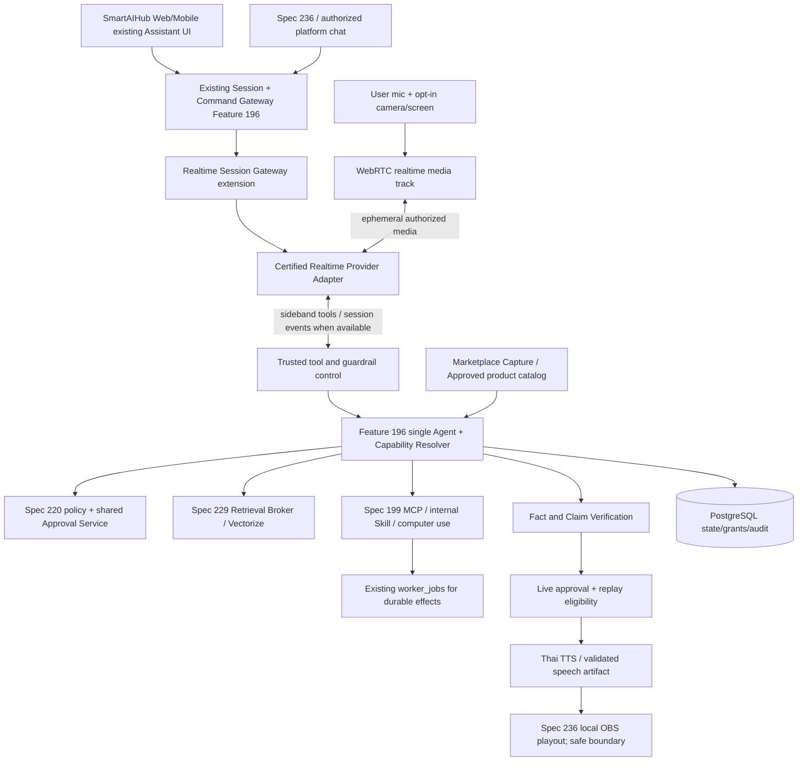
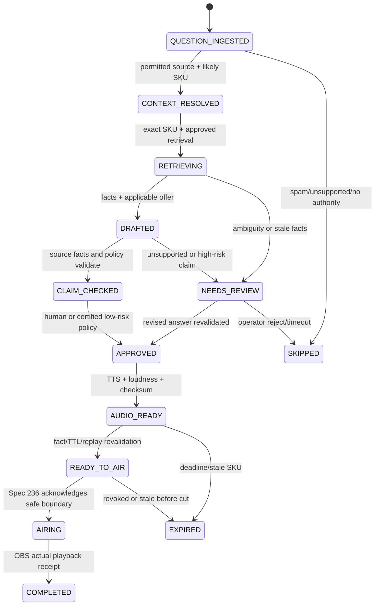

# Spec 237 — Realtime Multimodal Agent: Shared Voice, Camera, Screen & Live Co-host

> **Design thesis:** Voice is a transport and interaction modality of SmartAIHub's existing Feature 196 Agent, not a parallel AI product. The same trusted Agent can have a private full-duplex WebRTC conversation with a user inspecting a room on camera, call approved tools to search products or create an early design, and act as a *review-gated* off-camera voice co-host for a Spec 236 Project-based live-commerce show. `worker_jobs` remains canonical for durable Tool/media tasks, not raw real-time audio/video frames.

## 0. Architectural and operational invariants

1. **Exactly one Agent/Goal Orchestrator authority:** Feature 196 retains intent interpretation, context, capability resolution, reasoning/tool selection and conversational history. Add `realtime_voice`, `camera_session`, `screen_session` and `live_cohost` interaction profiles as adapters. Do not fork a Voice Agent Runtime or separate live-commerce brain.
2. **Reuse deployed authorization and action mediation:** Existing Spec 220 RBAC/ABAC, approvals, MCP Gateway 199, External Agent Gateway 200, Runner integration and economic authority 207. All side-effectful tools must traverse the established capability gateway; a model's tool-call JSON never grants permission.
3. **Reuse retrieval:** Spec 229 is the only production Retrieval Broker; use Cloudflare Vectorize as reconstructable semantic index and managed PostgreSQL as rights/source truth; R2 stores original Library files. No second private vector store, direct provider unscoped file-search index or SQLite/D1 product truth.
4. **Reuse durable work:** Feature 186/195 `worker_jobs` is canonical for render, catalog sync, transcode, long-running workflow, Tool result and retries; synchronous read-only short tools may execute inline under bounded budgets and trace; do not persist each audio frame as a `worker_job`.
5. **Separation between spoken private conversations and public broadcast:** Full-duplex natural, interruptible speech can be directly heard by a consenting private user. Public live commerce MUST validate text, provenance, current facts, approval and destination applicability before any generated audio reaches OBS; no raw unreviewed speech stream on public outputs.
6. **Server owns secrets and effects:** Realtime provider client key ephemeral and narrowly scoped; provider-side sideband/control where supported; all marketplace, RAG and tool credentials stay on trusted backend. Device camera/screen use explicit consent and a visible stop control.
7. **No implementation claim from spec:** Inspect actual deployed Feature 196, Session Gateway, Realtime Provider Adapter, versioned authorization APIs, Marketplace Capture schema and Spec 229 ingress before coding. Planned architecture is not evidence of running endpoints. Do not alter in-progress Spec 224 WorkPackages, migrations or Final Verify.

## 1. Goals and two execution profiles

### 1.1 Private interactive agent (GENERAL_REALTIME)

- Browser or supported mobile/tablet user launches an authenticated Realtime session from the *existing SmartAIHub Chat/Assistant UI*, not a new siloed app.
- Speak naturally with low perceived delay; voice activity detection, turn-taking, optional barge-in/interruption, captions and visible microphone mute.
- The user can explicitly grant camera or screen capture, ask Agent to describe visible objects, assess renovation constraints, search supplier/catalog items, compose a preliminary concept or issue an approved image/video generation job via existing Skills/Media Studio.
- Agent can switch between voice/text, attach project documents and transfer long tasks into `worker_jobs` without losing parent conversation and authorization context. Capture performance on low-bandwidth mobile devices with camera pause, lower frame-sampling or voice-only fallback.

### 1.2 Live-commerce co-host (LIVE_COHOST)

- Spec 236 creates show under a chosen Project, links selected Project Library video playlist and approves one or more Project RAG collections/files plus Marketplace Capture/catalog SKU mappings.
- Live viewer's *text* comment (authorized Facebook/Shopee/TikTok adapter or explicitly tagged operator input) enters the same Feature 196 normalized Command Gateway. The viewer is **not** impersonated as an authenticated SmartAIHub user and never inherits the merchant's tool privileges.
- Agent uses the configured approved product evidence and current catalog facts to produce a short, claim-checked Thai answer; text is reviewed by policy or human, then a certified Thai voice adapter renders a playable audio artifact. Only the signed, verified `ApprovedOnAirSpeech` artifact can be queued by Spec 236 for OBS safe-boundary playback.
- `LIVE_COHOST` never uses unrestricted direct provider-to-OBS audio and never asks the Realtime provider to become the stream controller. It can reuse the provider family or speech tools of `GENERAL_REALTIME`, but deliberately trades some latency for public-broadcast claim enforcement.
- Operator may also speak privately to the Agent via WebRTC (backstage); backstage mic audio must be physically/logically isolated from the OBS program mix except for explicitly approved operator talkback.

## 2. Reference architecture and media/control separation



**Media transport:** Browser/provider WebRTC for user audio and, only where certified, image frames or video frame samples. The application backend brokers session initialization, permission tokens, Tool execution and durable transcript metadata. A managed TURN service handles difficult NAT situations where needed. A multiparty/SFU product is optional for shared room-viewing or live producer collaboration, **not** needed simply to connect one browser to one Realtime provider. Cloudflare Realtime SFU and TURN are candidates subject to measured region-level RTT, vendor terms and pricing. They are independent of the RTMP/Virtual Camera output owned by Spec 236.

**Control transport:** Session Gateway maintains session epoch, status, command correlation, transcript summary cursor and provider connection ownership. Use provider-supported sideband server control for private Tool calls; otherwise a trusted server proxy with equivalent authority. Never assume all vendors implement the same control protocol.

**Durability boundary:** PostgreSQL stores session metadata, project/source grants, tool intents, approvals, relevant transcript/event references, cost summary and expiry. R2 may store only opt-in retained media. Ephemeral jitter buffers, VAD, image sampling and low-latency audio transport remain local/provider/RTC state. Only long-running work crosses existing `worker_jobs`; a WebRTC reconnect is *not* a new persistent Job Graph by itself.

## 3. Realtime Provider Adapter contract

The provider adapter is an extension/implementation of the established SmartAIHub inference routing/provider family (Spec 231), selected through supported capabilities. Do **not** route native audio semantics through a generic text-only OpenAI-compatible proxy unless contract tests prove full parity.

```ts
type RealtimeCapability = {
  providerId: string;
  deploymentId: string;
  transport: ('webrtc'|'websocket')[];
  duplexAudio: boolean;
  turnDetection: ('server_vad'|'semantic_vad'|'manual')[];
  supportsInterrupt: boolean;
  textInput: boolean;
  imageInput: boolean;
  screenFrameInput: boolean;
  nativeVideoTrackInput: boolean; // never infer from supportsImage
  toolCalls: boolean;
  serverSideControl: 'sideband'|'trusted_proxy'|'none';
  transcriptEvents: boolean;
  explicitSessionClose: boolean;
  voiceLocales: string[];
  codecProfiles: string[];
  maxSessionSeconds?: number;
  maxAudioCostPerMinute?: number;
  dataResidencyProfile: string;
  certifiedAt: string;
  certificationEvidenceRef: string;
};

interface RealtimeProviderAdapter {
  getCapabilities(): Promise<RealtimeCapability>;
  createEphemeralConnection(authorizedSessionRef: string): Promise<{url?: string; credentialRef: string; expiresAt: string}>;
  attachTrustedControl(sessionRef: string): Promise<void>;
  sendInput(sessionRef: string, inputRef: string): Promise<void>;
  requestResponse(sessionRef: string, boundedContextRef: string): Promise<string>;
  cancelResponse(sessionRef: string, responseRef: string): Promise<void>;
  updateSessionContext(sessionRef: string, approvedDigest: string): Promise<void>;
  closeSession(sessionRef: string): Promise<void>;
}
```

These are **design interfaces**, not claims that existing SmartAIHub code already has these exact method names. Capability probe checks deployed endpoint and voice locale (especially Thai), prompt/tool fidelity, current pricing, audio event ordering, pause/interrupt behavior, transcription quality, image support and server authorization. Provider/model hot-swap happens only at a safe conversation boundary with user confirmation where continuity/privacy materially changes; never silently discard history or expose restricted frames to a fallback provider.

Initial candidate: OpenAI Realtime API supports speech-to-speech, WebRTC and tool calls and documents server-side sideband control; actual model IDs and GA event schema must be discovered on implementation date rather than hard-coded. Other providers remain optional behind the same conformance suite. A conventional `ASR → Feature 196 text Agent → verified TTS` chain is a valid fallback and is the preferred **LIVE_COHOST** path when safety requires full answer inspection.

## 4. Session Gateway and canonical context envelope

```json
{
  "session_id": "realtime-session-opaque",
  "session_epoch": 4,
  "tenant_id": "tenant-opaque",
  "principal_id": "operator-or-user-opaque",
  "conversation_id": "existing-conversation-opaque",
  "project_id": "project-opaque",
  "mode": "GENERAL_REALTIME",
  "provider_profile_ref": "certified-profile-ref",
  "scope_digest": "allowed-canonical-sources-revision",
  "tool_grants_ref": "approved-least-privilege-grants",
  "media_permissions": {"microphone": true, "camera": false, "screen": false},
  "billing_budget_ref": "budget-opaque",
  "expires_at": "2026-09-23T15:15:00Z",
  "status": "CONNECTED"
}
```

State model: `CREATED → AUTHORIZED → NEGOTIATING → CONNECTED → ACTIVE → DEGRADED/RECONNECTING → SUSPENDED/ENDING → CLOSED/EXPIRED`. Each session has a monotonic epoch; lost clients revoke fresh capture/signaling but prior media provider session is separately terminated/reconciled. Late control callbacks from a previous epoch never speak to a newer session or execute tools. `conversation_id` remains canonical Feature 196 history key; `session_id` is merely a transport incarnation. An expired project/source grant invalidates subsequent retrieval immediately even if provider context still contains prior summary; do not carry private cached facts into a different Project without reauthorization.

Auth: current logged-in user and Project ownership, or delegated service identity *with explicitly scoped Live Co-host privileges* for a Spec 236 show. For live chat, source is normalized external viewer comment; principal is the **authorized tenant Agent service**, not the external viewer. One user/operator consent is not blanket permission to activate microphone/camera/screen in later sessions. Prevent session fixation, replay, leaked ephemeral credentials and cross-tenant provider room connection. Enforce concurrency and spend before ephemeral credential issuance.

## 5. Modality capture, camera/screen safety and user experience

- Device microphone, camera and screen each have a separate explicit browser/native consent and visible active indicator. Screen capture must use platform-mediated permission; no invisible background desktop recording. `stop`, mute and camera-off are always accessible; an app-side stop should release local tracks and invalidate outgoing frames promptly.
- Start P0 image interaction with explicit snapshots or rate-limited opt-in sampled frames, bounded size/resolution and freshness; some provider endpoints accept images but **not native continuous video**. `supportsImage` does not imply `supportsVideo`. Native continuous video can be added only after endpoint conformance and end-to-end cost/security measurement.
- Include capture source kind, frame timestamp, user-selected crop/region where possible, image hash, source project scope, transport path and processing/retention policy in the evidence envelope. Never infer precise measurements or engineering safety from uncalibrated room camera imagery; ask for dimensions or permit approved measurement tool.
- Private room example: user says "ช่วยดูห้องนี้ อยากวางโต๊ะกับชั้นแบบไหน" while camera permission is on; Agent grounds visual observations, asks for missing room dimensions, uses an *approved* Project/Marketplace catalog, creates a concept/thumbnail via authorized Media Studio job after cost approval and links results back to the same project conversation. Clearly label conceptual renderings, estimates and unverified fit.
- Privacy: redact captured notifications/private tabs/passwords where possible in screen-sharing UI; opt-in frame retention, configurable expiration, provider egress policy/region and deletion requests. Do not persist raw live audio/video or public-chat identities by default. A transcript may be retained only according to project-specific consent and configured retention.
- Accessibility/mobile: push-to-talk alternative, live captions with explicit partial/final state, device switch, Bluetooth headsets, reconnect with voice-only downgrade, mobile background/foreground handling and graceful loss of camera permission.

## 6. Project-scoped knowledge and Marketplace Capture in one answer path

At show setup, Spec 236 binds one canonical `live_project_id` with three explicitly selectable *source groups*:

**A. Project files/RAG:** versioned approved files, seller FAQ, return/shipping policy, user-owned product manuals, usage and specifications; selected Library permissions checked through Spec 220. Spec 229 Retrieval Broker provides exact SKU/field retrieval first and Vectorize-assisted semantic search second. Only retrieve currently approved, in-scope fact IDs and cited source revisions; vector matches alone do not authorize use.

**B. Marketplace Capture:** read existing verified imported product listings/catalog *if actually deployed*. Resolve capture/import source URL, owner, timestamp, source permission, canonical SKU and platform listing mapping. Product images/descriptions/variants may help candidate retrieval. Captured marketing phrases, reviews and third-party pages remain untrusted and are not broadcast as true without merchant review and applicable claim substantiation. Price, shipping fee, promotion and stock require fresh authoritative platform/store validation or explicit qualified language. Do not build a parallel `marketplace_products` SoT table when one already exists.

**C. Live current state:** show product and clip being displayed, expected segment timeline, per-platform viewer latency, current destination capabilities, selected safe claims and final on-air price/promo TTL. A chat message arriving "รุ่นนี้ลดไหม" cannot be attached blindly to the *current OBS segment* when the viewer's platform has 10–30 seconds of delivery latency. Use observed segment, product cues and explicit SKU; if ambiguous, ask for model ID or skip rather than guess.

Knowledge selection UI must show "Selected Project Files", "Approved Product Catalog", "Source Coverage", "SKU mappings", "Offer Freshness" and "Unverified Claims" separately. The user may add/remove a source **only with scope revision and ACL recheck**; no mid-stream provider prompt update may bypass an existing owner review or prior-tool approval. Unindexed newly selected files show `PENDING_INDEX` rather than fake readiness.

### 6.1 Unified evidence envelope

```ts
interface ProductEvidence {
  tenantId: string; projectId: string;
  canonicalSku: string;
  origin: 'project_file'|'approved_catalog'|'authorized_live_api'|'marketplace_capture';
  sourceRef: string; sourceRevision: string;
  factId: string; factValue: string; factType: string;
  approvedByRef?: string; approvedAt?: string;
  validUntil?: string; retrievedAt: string;
  authoritativeFor: ('identity'|'materials'|'size'|'price'|'stock'|'promotion'|'shipping'|'returns')[];
  platformApplicability: string[];
  aclDecisionRef: string; retrievalTraceRef: string;
}
```

A Marketplace Capture price snapshot has no authority as a "price now" statement unless the source's freshness and platform authorization rules explicitly allow it. Embedding metadata includes project/source revision, approved fact identity and revocation invalidation. Material changes to product claims trigger re-review; invalidated sources should remove eligibility of cached repeat FAQ audio.

## 7. Shared agent tool interface and approval boundaries

All modes use existing Feature 196 `capability.search/describe/invoke/status/result` family through shared capability resolver and external MCP gateway where applicable. Proposed logical capabilities (map to actual registry, do not mint duplicates):

| Logical capability | Class | Policy before action |
|---|---|---|
| `product.lookup_approved_facts` | Read | Scope+SKU+source-version+Project ACL |
| `product.check_live_offer` | Fresh read | Platform account entitlement/rate-limit, API freshness, destination applicability |
| `project.library.search` | Read | User+Project permission and retention policy |
| `media.generate_concept` | Paid side effect | User approval, credit reservation, scene provenance, watermark/preview policy |
| `shopping.open_official_listing` | Low-risk link | Current listing source, official URL allowlist, platform context |
| `live.prepare_spoken_answer` | Live publication staging | Source facts, claim checker, voice right, operator/policy approval |
| `live.publish_approved_audio` | External/public effect | Only Spec 236 Playout Controller with signed `READY_TO_AIR` receipt; manual or certified delegation |
| `computer_use.perform_action` | Potential side effect | Existing Spec 208/213 permission, user consent and target allowlist; no certification bypass |

Tool input is untrusted even when derived from live viewer comments or marketplace pages; strip instructions embedded in data, schema-validate args, check scope at *execution time*, record per-tool idempotency and audit. Read tools can be auto-run within explicit policy. Actions that spend credits, write customer/shop data, publish public content, open paid orders, alter listing or execute computer/browser operations need category-specific approval. Voice confirmation of a destructive action should use a second on-screen explicit confirmation if misheard commands present material risk.

Provider sideband, client and retry paths can all see the same tool-call event. Designate **backend Tool Dispatcher as sole effect owner**; repeated provider event IDs do not cause duplicate orders or generation jobs. An error speaking "done" is not evidence of completed Tool execution.

## 8. Live-commerce voice answer lifecycle and public speech gate



The private Realtime model may generate natural speech immediately. **For public live speech the required implementation sequence is:** receive viewer text → normalize/moderate/dedupe → resolve product/time context → retrieve *approved* SKU facts → fetch authoritative offer where needed → generate **text** draft with `fact_ids` and claim-level support → deterministic/source-aware validation + category policy → operator approval initially → synthesize Thai audio file → verify transcript-to-audio text correspondence, permitted voice, 48-kHz OBS-compatible normalized output, duration/checksum → publish signed artifact reference to Spec 236 → safe boundary → recheck expiry/offer/applicability → OBS play and verify. No raw provider speech bypasses this gate.

`ApprovedOnAirSpeech` (cross-spec contract):

```json
{
  "schema_version": "1.0",
  "tenant_id": "tenant-opaque", "project_id": "project-opaque",
  "show_id": "show-opaque", "show_epoch": 7,
  "question_id": "question-opaque", "answer_id": "answer-opaque",
  "source_set_digest": "sha256:...", "canonical_sku": "SKU-001",
  "supported_fact_refs": ["approved-fact-version-1"],
  "offer_freshness_receipt_ref": null,
  "destination_applicability": ["facebook", "shopee"],
  "final_approved_text": "สินค้ารุ่นนี้มีขนาดตามที่ระบุในรายละเอียดสินค้าค่ะ",
  "policy_verdict_ref": "policy-receipt-opaque",
  "approval_receipt_ref": "operator-or-certified-policy-receipt",
  "voice_profile_grant_ref": "voice-right-ref",
  "audio_asset_ref": "artifact://approved-voice-opaque",
  "audio_sha256": "sha256-of-final-audio",
  "audio_duration_ms": 6100,
  "provider_cost_receipt_ref": "cost-opaque",
  "expires_at": "2026-09-23T15:02:00Z",
  "status": "READY_TO_AIR"
}
```

**Broadcast applicability:** one OBS spoken answer is audible on all currently connected destinations. If offer/refund/price/availability claim does not apply to **every** audience receiving that program, block it, omit the platform-specific number and advise viewers to check official in-app listing, or explicitly route to a separately approved per-platform program. The `destination_applicability` array alone is not permission to speak platform-exclusive pricing to a shared program.

Review automation policy: P0/P1 manual `operator_approval_required=true` by default; certified low-risk FAQ autopublish can be a later feature flag only after adversarial evaluation and tenant opt-in. Never autopublish medical efficacy, uncertain compatibility, warranties/refunds with missing authoritative source, personal viewer info or unsupported testimonial. The platform may decline, skip or request human input; do not promise every chat question is answered.

## 9. Video, voice and UI interaction profiles

| Profile | Audio output | Camera/screen | Tools | Default approval |
|---|---|---|---|---|
| `GENERAL_REALTIME` | Provider-native full duplex when certified | Per-user opt-in snapshots/frames | Authorized existing capabilities | Read-only auto, meaningful effects manual |
| `GENERAL_CHAINED` | ASR → Feature196 text → TTS | Opt-in still/sampled frames | Same authorized capabilities | Same policy; voice latency may be higher |
| `LIVE_COHOST` | Verified text → prepared Thai WAV → Spec236 OBS | No audience mic; operator backstage camera optional | Bounded product read and approved live-prep actions | On-air manual by default |
| `LIVE_BACKSTAGE_DIRECTOR` | Private voice to operator headset | Operator-approved OBS preview/screen only | Read status and propose changes; stream controls need approval | Never publish private talkback to shared program |

Provider capability negotiation must choose model/transport independently for speech understanding, reasoning/tools, vision and speech output where a single native realtime model does not meet all requirements. Voice agent *identity* stays Feature196 even when components use distinct providers. Model routing honors current tenant credits, provider policy, locality, data egress, model version and fallback restrictions.

## 10. UI specification

**Existing Chat/Assistant surface enhancement:** Voice start/stop, speaking/idle/processing state, push-to-talk, captions with confidence/finalization, transcript, attach to Project, select approved knowledge sources, camera toggle, screen-share source selection, latency indicator, video-frame send policy, tool intent/approval drawer, resumed job results and accessible mobile controls. One persistent conversation ID across audio and text. Show provider/data-sharing information before enabling a new media class.

**Project Live Setup panel (embedded in Spec 236, not a second app):** Project selector → approved RAG files/collections → Marketplace Capture/catalog SKU picker → SKU/fact coverage matrix → seller-approved claims/price freshness → voice profile with permission/consent → operator policy → Test FAQ and hear sample → live preflight. Never use a document or captured listing in speech merely because it was uploaded.

**Live Operator question/voice panel:** incoming comments per authorized platform and product; private question preview and near-duplicate clusters; proposed text with clickable facts and applicability; approve/edit/reject/skip; WAV readiness and duration; playback slot at next authored safe boundary; OBS/VU meter; manual mute; fallback; stale-source warning; per-question provider/credit cost. Operator sees `DRAFT`, `APPROVED`, `AUDIO_READY`, `READY_TO_AIR`, `AIRING`, `COMPLETED`, `EXPIRED`, with verified receipts, not optimistic simulated status.

**Admin Panel:** certified provider/model and Thai-voice matrix; per-profile concurrency, spend, risk policy and failure rate; session duration, turn latency, first-audio, ASR/TTS errors, image sampling cost, permission revocation, provider/region, consent audit, cross-Project access attempts and alerts into Spec 228.

## 11. Suggested API and schema (discover before implementing)

Illustrative endpoints under existing Assistant session namespace, map rather than duplicate if deployed routes exist:

- `POST /v1/assistant/realtime/sessions` (authorized session+scope+ephemeral provider offer)
- `POST /v1/assistant/realtime/sessions/{id}/media-grants` (per modality consent)
- `POST /v1/assistant/realtime/sessions/{id}/provider-control` (trusted server only)
- `POST /v1/assistant/realtime/sessions/{id}/tool-approval` (existing approval receipt contract)
- `POST /v1/assistant/realtime/sessions/{id}/stop` (terminate tracks, revoke, reconcile)
- `POST /v1/live/shows/{show}/voice-questions:prepare` (Spec236 facade, signed show service principal)
- `GET /v1/live/shows/{show}/voice-answers/{answer}` (approved artifact metadata only, not unauthenticated audio)

Illustrative additive tables / extended existing canonical tables: `realtime_session_metadata`, `realtime_media_grants`, `realtime_provider_attempts`, `realtime_tool_intents` *or reuse already deployed equivalents*, `realtime_usage_receipts`, `live_voice_answer_provenance` where not already in Spec236 speech tables. **Do not create new** master `users`, `products`, `projects`, `worker_jobs`, approvals, vector collections or global Agent run state. Realtime session metadata is transport lifecycle, not a second durable Agent execution ledger.

All new DDL require actual repo schema/journal/production environment preflight; if economic DB migration replay/certification for Spec 224 remains blocked, proceed with mock/contract tests and read-only discovery but do not migrate the conflicted production schema. Resolve number collisions at canonical registration stage.

## 12. Performance, reliability and cost envelopes

**Engineering SLOs to measure, not promises:** private speech first-audio p95 target under 1.5 seconds on a suitable tested Thai voice/provider path; local user stop/mute under 250 ms where device APIs permit; visual response p95 bounded separately by frame sampling and inference; session reconnect targeted under 5 seconds on transient failures where protocol allows. For public Q&A, question-to-approved-text p95 target under 5 seconds for common grounded FAQs and audio preparation p95 under 2 seconds after approved text *only if benchmarks justify it*; actual safe-boundary cut remains the next available clip ending.

Each session/tool action carries a budget policy: permitted providers, max input/out audio tokens/seconds, frame sampling and maximum image pixels, tool call count, retrieval evidence budget, concurrent sessions, continuous live hours, paid provider spending and user-triggered cost confirmation. Use current Spec207 reservation and settlement contract; persist cost receipts; prevent duplicated charges on reconnect/retried provider callbacks. Monitor Thai ASR/TTS quality on real product/SKU names, code-switching, noisy marketplace chat and accented speakers.

Failure matrix: Realtime provider loss → suspend private speech or fall back to preapproved chained profile with transparent notice; Project ACL revoked → stop future tool/retrieval and invalidate unplayed speech; source index unavailable → skip unsupported fact, not model-memory guess; TTS fails → Spec236 presenter continues; WebRTC dropped → client media stop and epoch-safe reconnect; model loops/tool storm → per-turn caps and emergency session disable; cross-provider failover requiring restricted frame egress → halt and reauthorize.

## 13. Work packages and dependency gates

| WP | Deliverable | Hard dependency / failure policy |
|---|---|---|
| P237.0 | Read-only deployed Feature196, Session Gateway, Provider Adapter, Spec229, Marketplace Capture and existing approval schema inventory; Registry collision check | Start without modifying currently blocked Spec224 branch |
| P237.1 | Versioned `RealtimeCapability`, thin provider adapters, session ephemeral token controls, WebRTC microphone loop and Thai speech test | Verified provider endpoint and existing Feature196 normalized command ingress; no new agent runtime |
| P237.2 | Canonical conversation/Tool sideband bridge, project ACL, typed Tool intent and existing Approval UI | Existing auth/approval and Feature196 capability resolver; fail closed for unsupported tools |
| P237.3 | Opt-in camera/screen snapshots, visual context limits, mobile UX and concept generation via existing media jobs | Modality-specific consent and provider vision conformance |
| P237.4 | Project RAG + verified Marketplace Capture Product Evidence Adapter via Spec229, exact SKU resolution and source revision gating | Actual deployed catalog contract, current tenant grants and approved facts |
| P237.5 | Spec236 `LIVE_COHOST` approved-text→TTS→ready-to-air artifact, manual Operator panel and voice audit | Spec236 Project/media/OBS foundation, public claim policy and tested audio mix |
| P237.6 | Certified low-risk FAQ auto-approval canary and provider failover/economic limits | 100% clean configured high-risk safety fixtures, operator kill-switch and measured reliability |

No required dependency on finishing unrelated speculative enhancements or retroactively editing implemented Spec212. Spec224, 235 and ongoing Spec232 migration are separate optional integration tracks; rely only on their *actually certified* deployed interfaces.

## 14. Acceptance and adversarial verification

1. **Private WebRTC + Feature196:** 60-minute voice conversation fixture with 100 turn interruptions/barged-in commands, text/voice continuity, one canonical `conversation_id`, tool execution by one backend owner and bounded cost receipt. Provider transport disconnect/reconnect must not replay a side effect.
2. **Camera/screen consent:** 100 modality-state changes including user deny, revoke while inference pending, browser tab change and screen-share stop; no new frames leave device after revoked consent, no unauthorized retention. Test actual supported device/browser combinations; never claim universal device support.
3. **Grounded Project RAG:** select two Projects where the operator can read one but not the other; 100 facts and 100 adversarial documents; no cross-Project retrieval or invalidated fact cited. Change source revisions during a session and verify stale answer cache eviction.
4. **Marketplace Capture:** 100 SKU/listing fixtures with same title, variants and conflicting prices; imported marketplace descriptions never authorize unreviewed efficacy or testimonials; no currency/discount leak across platform-specific feeds.
5. **Live QA:** 500 mixed platform comment events, 100 approved fact questions, stale offer/product switches, prompt injection and duplicate callback storms; no duplicate voice answer aired and no unsupported claim in the fixture set. OBS stays uninterrupted through at least 20 safe Q&A insertions in 60-minute staging.
6. **Public audio gate:** attempt to inject provider-generated raw audio, tampered WAV hashes, stale approval receipt, expired fact, wrong tenant, wrong show epoch and conflicting channel promotion: **all denied** before OBS audio path. On-air receipts require actual OBS observed completion or explicitly `UNCERTAIN` after failure, not a false `COMPLETED`.
7. **Tools and money:** tool-call replay, disconnected approval, revoked permission, token expiry, paid-media job and provider fallback with secret isolation; canonical worker-job identity and charge settled once per logical effect.
8. **Operational safety:** Admin/operator emergency mute, session revoke, livestream policy override, leak-free logs, blocked unapproved camera tracks, bounded continuous session duration, accuracy of Thai pronunciation and device/audio mixing recorded as evidence.

No sign-off solely from mock provider pass; production activation requires real provider Thai speech, real approved content, real permitted destination(s), operator receipts and actual mobile audio/visual capture validation. Unsupported platform chat permissions remain explicit `OPERATOR_ASSISTED`, never mislabeled automated.

## 15. Source register and version caveats

### Prior system authority / user-supplied content

- Existing Feature 196 revised design explicitly defines the Universal Command Gateway, voice as an ingress channel, Feature196 planning, Feature195 durable job execution and Feature197 Runner capabilities; treat it as **design baseline**, not deployed-code proof.
- Spec 229 living knowledge/retrieval policy remains the sole retrieval authority; cloud Vectorize migration is an existing production decision; managed PostgreSQL remains metadata/ACL/product SoT.
- User-provided live-cohost guideline dated 2026-09-23: OBS WebSocket 5.x, staged approved Thai TTS, 180s local prepared reserve, safe-boundary interruption, audit, explicit disclosure.
- Companion Spec236 adds Project Library video playlist/buffer as first-class source and approved multi-platform distribution.

### Public technical documentation checked 2026-09-23

- OpenAI speech-to-speech Realtime / Agents SDK / tool calls: https://developers.openai.com/api/docs/guides/realtime
- OpenAI Realtime browser WebRTC / ephemeral client secrets: https://developers.openai.com/api/docs/guides/voice-webrtc
- OpenAI trusted server-side control/sideband: https://developers.openai.com/api/docs/guides/voice-server-controls
- OpenAI session/turn event handling and manual response gates: https://developers.openai.com/api/docs/guides/realtime-conversations
- Cloudflare Realtime SFU (last updated 2026-09-22): https://developers.cloudflare.com/realtime/sfu/
- Cloudflare Realtime TURN (last updated 2026-09-09): https://developers.cloudflare.com/realtime/turn/

Do not freeze a provider model ID, API event shape, token endpoint, price, session duration or vendor policy from a September 2026 doc indefinitely. Conformance and pricing must be refreshed on the actual coding/release date, and any endpoint used in source must be tied to deployment-specific certification evidence.

---

# R2 normative hardening — 12 completed cross-spec review passes (2026-09-24)

These appendices **supersede conflicting R1 examples**. The authoritative cross-spec artifact is **ApprovedOnAirSpeech v2**. In particular, the earlier illustrative `ApprovedOnAirSpeech` **v1.0 JSON is deprecated as an implementation contract**; use `contracts/approved-on-air-speech.v2.schema.json`. This is an additive Feature-196 modality adapter, **not** another Voice Agent Runtime or a duplicate durable job ledger. Proposed provider endpoints, cloud capabilities, model IDs and prices require runtime/vendor verification at implementation time.

## 16. Pass 1 — Shared Agent and actual deployed contracts

Inventory actual deployed Feature 196 command ingress, session/conversation ID and tool plan; Feature 195/186 durable-job API; Spec 220 grants/Approval; Spec 229 retrieval; Spec 207 economic ledger; Session Gateway and provider adapters. Every dependency is `DEPLOYED_CERTIFIED | DEPLOYED_UNVERIFIED | PLANNED_ONLY | ABSENT`; build read-only compatibility shims rather than treating a proposed route in this spec as existing code. A voice or live question is normalized to the **same canonical conversation/goal context** used by text Chat. A session transport is not a second Agent and a `worker_job` is not required for every WebRTC packet. **Acceptance:** unchanged text-only assistant regressions, one `conversation_id` across voice/text handoff and no duplicate global job owner.

## 17. Pass 2 — Source authorization before retrieval and model egress

Use `LiveKnowledgeScope` with tenant, live Project, explicitly shared origin Projects, selected RAG file versions, exact canonical SKU/variant set, approved fact IDs, policy/grant revision, permitted model/data region, consent and expiry. The backend **filters scope before searching** Spec229 and rechecks PostgreSQL ACL, document revision, grant and category-specific claim approval **after retrieval and before model exposure**. Captured marketplace listing text is untrusted evidence; neither an embedding score nor a storefront price screenshot is an authorization or authoritative stock receipt. Cross-project access revocation invalidates in-flight tool calls, cached drafts and unplayed audio. Do not send restricted visual frames or product documents to a fallback provider not covered by current data-egress policy. **Acceptance:** cross-Project and cross-tenant red-team retrieval suite; verified exact-variant matching; revoked sources never appear in an emitted v2 speech artifact.

## 18. Pass 3 — Media/session lifecycle and resource backpressure

Define shared `RealtimeCapability` negotiated **per provider endpoint/version**: input audio, output audio, turn detection, interrupt/cancel, image input, native video input, server-side tool bridge, sideband, supported transports, retention, data region and maximum session lifetime. `supportsImage` never means continuous video; if no certified native video use opt-in sampled frames. Browser/mobile WebRTC owns local media tracks and receives a tightly scoped ephemeral transport credential; trusted Session Gateway controls grants and Tool Dispatcher. Implement ICE/STUN/TURN negotiation, reconnect and token refresh where supported, device change/renegotiation, VAD/echo cancellation, A/V packet backpressure, explicit video-frame dropping over queue growth and network/foreground recovery. Cloudflare Realtime SFU is **optional multi-participant routing**, not a mandatory Realtime model connection or OBS live distribution. Avoid advertising one provider's capabilities as every provider's. **Acceptance:** 60-minute supervised voice tests on certified endpoints, device change, high packet loss, offline reconnect, camera-frame backpressure and unsupported-capability fail-closed fixtures.

## 19. Pass 4 — One tool-effect owner and voice interruption semantics

Represent turns as `turn_id` and audio/text events with sequence and finality; canceled/interrupted partial ASR text is **not** a complete instruction for side-effectful Tool execution. On barge-in, stop local playback immediately, cancel active model response if supported, and fence late tool callbacks by session epoch; a long-running already-approved job can keep running under canonical `worker_jobs` and returns its result to the same conversation. Designate backend Tool Dispatcher the **sole** side-effect executor and dedupe on `(tenant,session_epoch,tool_intent_id,idempotency_key)`. An uncertain external provider effect is `EFFECT_UNCERTAIN` pending real reconciliation; do not retry orders/purchases or claim exactly-once external side effects. UI displays pending approval and distinguishes `INTENT_APPROVED` from external `EFFECT_CONFIRMED`. **Acceptance:** 100 rapid interrupted/retried turns and overlapping sideband/tool events with no duplicate logical effect and transparent uncertain outcomes.

## 20. Pass 5 — Product evidence compiler and factual claim gates

Create a *logical read-only adapter* over deployed Marketplace Capture/product catalog; discover exact schemas and authorization before binding. One answer's evidence bundle contains exact SKU, variant, unit, product fact ID/version, approved claim category, source ID/digest, source owner, document expiry, platform-offer scope and authoritative live offer receipt when needed. Exact SKU/field lookup precedes semantic retrieval; no LLM-invented substitutes when a variant is ambiguous. Mandatory claim checks operate at the **claim level**: dimensions/specifications require relevant approved facts; efficacy, returns/warranty, shipping and performance claims follow category-specific reviewer policy; price/availability/promotion require entitled fresh platform API/store confirmation. Cached FAQ speech must be invalidated on source revocation or offer expiry. All-public-destination applicability is computed from the *actual 236 broadcast audience*, not only the chat platform that sent a question. **Acceptance:** 100 SKU/variant conflicts and 100 malicious catalog-document fixtures with documented precision/recall and zero unsupported on-air claims in the test corpus.

## 21. Pass 6 — Signed v2 `ApprovedOnAirSpeech` producer contract

Use the machine-checkable schema in `contracts/approved-on-air-speech.v2.schema.json` and shared `LiveQuestionContext v2`. v2 supersedes v1 example. Producer must bind `tenant_id`, `project_id`, `show_id`, `show_epoch`, `show_revision`, `question_id`, `answer_id`, `product_context_revision`, `source_set_digest`, `required_destination_digest`, approved fact **and source revision refs**, policy version/verdict, approval receipt, voice rights grant, final approved text digest, complete validated audio digest, relevant offer freshness, expiry and trusted signer. `required_destination_digest` is taken from 236's **observed set of currently live program recipients** and refreshed at actual play time; a prepared answer cannot force a channel-specific claim onto other destinations. `source_scope_grant_ref` from the authorized v2 request is repeated inside the signed v2 response; 236 resolves this grant under current Spec220 authority on preair check. `show_revision` advances for **material show-level settings**, `product_context_revision` for current SKU/variant and `playlist_revision` only for timeline edits. A harmless future playlist append SHALL NOT invalidate signed speech. `playlist_revision` belongs to 236's separate future playback reservation and is not a v2 speech validity condition. Sign a canonical JSON representation or a reference with verified equivalent issuer/audience integrity and version; **never put signing secrets inside audio URLs**. TTS renders only *after* textual claim approval; perform audio-to-text consistency and Thai pronunciation QA as certified by task risk. An audio asset or model-generated speech is not published until 236 independently verifies and accepts it. **Acceptance:** shared v2 positive/negative schema fixtures, signature-tamper/replay/wrong-destination/expired-grant tests.

## 22. Pass 7 — Public speech isolation from private full-duplex audio

Provide separate **output-plane** routing profiles under the same Agent: `GENERAL_REALTIME` may stream private synthesized audio to the user; `LIVE_BACKSTAGE_DIRECTOR` sends private talkback only to the operator's **headphones**, never the OBS public audio bus; `LIVE_COHOST` sends text-first approved audio **artifact only** to 236's restricted input. Enforce at both backend message/routing layer and Runner physical/virtual device mix; no mode switch may automatically bridge an active private microphone or raw provider PCM onto the live bus. P0/P1 forbid streaming public speech, including nominally harmless greetings, until chunk-level preair blocking and mid-utterance kill-switch demonstrate equivalent approval. Barge-in from the host is an **operator interrupt intent**, not permission for the model to speak unreviewed on-air. Keep a persistent disclosure that prerecorded presenter and assistant-generated speech are synthetic where required. **Acceptance:** adversarial attempted provider-audio bus injection, accidental device loopback, live-mode switch during private conversation and cold-start mute tests; zero private-audio leakage.

## 23. Pass 8 — Camera/screen data minimization, retention and approvals

Local microphone/camera/screen each requires separate explicit device consent, server-scoped grant, visible state and one-click stop. For screen capture, prefer user-selected tab/window with notification/password preview warning and opt-in redaction before transmitting. Camera-based room design is **conceptual**, never assert structural safety, exact room dimensions or guaranteed product fit from uncalibrated pixels; offer measurement request and source-backed product dimensions. Define per-frame `capture_session_epoch`, monotonic frame sequence, observed timestamp, allowed crop, size/second cap, source grant and delivery receipt. On revoke, immediately stop producing/sending local frames, cancel pending unsent frames, block future inference and mark already-dispatched remote bytes as subject to provider retention terms, **not magically deleted**. Audio/video raw retention off by default; transcript retention explicit per Project and actual policy. High-risk tools require verified on-screen approval even if microphone speech sounds affirmative. **Acceptance:** 100 consent/revoke/tab-switch races, local frame zero-egress after revoke, no unauthorized background screen recording.

## 24. Pass 9 — Failure/reconnect and budget reconciliation

Session gateway owns `session_epoch`, transport state, provider attempt and tool-intent correlation but **not** a second global Agent/run ledger. Provider disconnect may resume a compatible turn only when its cursor/event semantics are certified; otherwise close old attempt, issue new epoch/ephemeral credential and restore canonical text context with transparent audio continuity loss. Never resend an uncertain side-effect automatically. Use bounded retries, per-session and per-tenant concurrency, audio token/seconds, frames/minute, selected model/region and Spec 207 reservations; request provider-specific usage receipts and reconcile on disconnect. Public TTS failure yields `AUDIO_PREP_FAILED` and presenter continues; never fallback to raw unmoderated provider speech. Distinguish `SESSION_RECOVERED`, `PROVIDER_FALLBACK_NEEDS_CONSENT`, `TOOL_EFFECT_UNCERTAIN` and `AIRING_UNCERTAIN`. **Acceptance:** induced provider failure before/after tool execution, credit idempotency, restrictive media egress policy and no duplicative charge from dropped provider callback.

## 25. Pass 10 — Shared operator UX, privacy-safe telemetry and alerts

Enhance existing Feature196 Assistant surface with accessible voice/camera/screen states and an explicit `LIVE_COHOST` badge linked to Spec236 show. Operator sees source fact links with current ACL/TTL, claim review, platform applicability, text edit and *required revalidation after edit*, sample synthesized voice, preparation progress, next eligible safe cut, actual OBS audio state and audible/uncertain broadcast receipt. Do not display a viewer's cross-platform identity without authorization or let a platform chat identity become a SmartAIHub user principal. Revocation or interruption invalidates stale UIs via session/show epochs and snapshot-plus-sequence subscription recovery. Admin telemetry includes `session_first_audio_p95`, `tool_latency`, `asr_finalization`, `video_frame_drop_rate`, `qa_approval_latency`, `audio_mix_leak_test`, provider spend and per-source rejection; no raw camera/audio in default logs. Alert on grant expiry, unsafe claims, provider failure and accidental live-bus routing via existing Spec228. **Acceptance:** mobile permission UX, keyboard/screen-reader tests and verified emergency-stop controls.

## 26. Pass 11 — Certification, adversarial evaluation and staged automation

Do not certify public auto-answering from private voice benchmarks. Public fixture set: >=500 multi-platform chat events (prompt injection, duplicate, stale, identity-sensitive), >=100 SKU/variant factual answers, high-risk category negatives, all-destination offer conflict, stale-after-approval, lost OBS playback receipt and source ACL revocation; 60-minute permitted staging broadcast with >=20 safe interruptions. Default P0/P1 **operator-approved**; a separate low-risk FAQ canary requires policy owner sign-off, test set with zero unsupported claim in defined fixtures, real-live shadow mode before auto-on-air and a rapid operator kill-switch. Private WebRTC acceptance independently measures Thai ASR and TTS, first-audio p95 and barge-in usability on the deployed provider/device, rather than inheriting suggested targets as facts. A platform without approved program/API cannot pass its live automated-chat exit gate. **Acceptance:** signed per-profile/per-provider/per-destination certification receipts, known residual risks and dated policy re-verification.

## 27. Pass 12 — Delivery strategy and freeze protection

Implement `P237.0` read-only deployed-interface discovery, `P237.1` thin provider adapter + WebRTC voice-only, `P237.2` canonical conversation and exclusive Tool Dispatcher, `P237.3` explicit camera/screen capture and revocation, `P237.4` actual Marketplace Capture + Spec229 approved-fact read adapter, `P237.5` v2 reviewed text → TTS → Spec236 preair gate and Operator UI, `P237.6` canary-only FAQ automation. Provider credentials, TURN tokens, Session Gateway auth and OBS device routes must be independently tested; fail closed when a planned-only interface is absent. Spec224 work and Final Verify stay frozen; do not attach an unverified DDL migration or rework implemented Spec212. Keep both Feature196 text Chat and Spec236 fixture-only OBS playout useful and independently releasable if realtime provider or seller permissions are unavailable. **Acceptance:** contract tests and disabled-by-default regression suite first, then real-provider/staging checks with named reviewers and rollback evidence.

**R2 voice outcome:** One Feature196 Agent serves private realtime speech, opt-in camera/screen tools and a separate fully vetted public `LIVE_COHOST` output profile. Spec236 alone decides when reviewed audio is audible; 237 cannot directly command OBS or mark an unobserved answer as aired.

---

# R3 Production-Closure Addendum — 12 additional audit passes

> **Normative precedence:** Sections 28–39 are R3 requirements. They supersede conflicting R1/R2 examples while preserving Feature 196 as the single Agent authority and Spec 236 as the sole public playout owner.

## 28. Pass 13 — Temporal multimodal alignment and observation confidence

Realtime reasoning over microphone, camera and screen MUST preserve capture timestamps and sequence identity per modality. A spoken phrase such as “อันนี้” may refer to a frame that is already stale when inference begins. The Session Gateway keeps a bounded `MultimodalObservationWindow` with audio-turn interval, latest acknowledged video/screen frame(s), frame age, dropped-frame count, transcript-finalization state and confidence. Models may receive sampled frames, but the canonical envelope records which frame/version informed the answer.

For high-impact tool actions, deixis/visual ambiguity requires confirmation rather than guessing. For live-commerce questions, Spec 236's `BroadcastObservationWindow` prevails over local provider turn timing. **Acceptance:** delayed/out-of-order audio/frame fixtures and tab/camera switches; no tool effect or product claim bound to an unacknowledged/stale observation without explicit clarification.

## 29. Pass 14 — Session/device handoff and split-brain prevention

A user may move from web to mobile/tablet or reconnect after sleep. Only one interactive device may own each exclusive microphone/camera/screen capture grant at a time unless multi-device mode is explicitly enabled. Use `session_epoch`, `device_connection_id` and modality lease. A new owner revokes or downgrades the old sender; delayed frames/audio from old epoch are discarded.

Canonical conversation history remains Feature 196 state; realtime provider sessions are replaceable transport attempts. Device handoff never duplicates a pending side effect or creates a second Tool Dispatcher. **Acceptance:** browser refresh, mobile takeover, duplicate WebRTC connection and sleeping laptop wake-up races with zero stale-media/tool execution.

## 30. Pass 15 — Realtime backpressure, cancellation and provider-overload semantics

Bound microphone buffering, transcript backlog, sampled frames, model responses, tool intents and outbound audio. When user barges in, explicitly cancel or supersede the active response where provider semantics are certified; otherwise locally mute old audio and mark its attempt superseded. Never let provider retry resurrect superseded speech or a cancelled Tool intent.

On 429/overload, reduce frame rate/vision frequency or fall back to voice/text according to policy before switching provider. Provider change that expands data region/retention or media sharing requires consent/policy approval. Live co-host public answers expire rather than queue indefinitely. **Acceptance:** sustained audio + camera load, 429 storms and repeated barge-in; bounded memory/latency and no stale speech/tool replay.

## 31. Pass 16 — Adapter capability downgrade and contract-version negotiation

`RealtimeCapability` is deployment-specific and time-bounded: provider, model/deployment, region, transport, duplex support, input/output modalities, tool-call semantics, cancellation, sideband availability, ephemeral-token method, maximum session lifetime, retention/logging class and certification timestamp. Session admission rechecks this matrix; a model name alone is insufficient.

If a provider silently loses a required capability after upgrade, fail closed or negotiate an explicitly permitted lower profile (`GENERAL_CHAINED` etc.); do not silently drop approval, tool-call fidelity, image support or cancellation semantics. Cross-spec envelopes use version negotiation matching Spec 236 R3. **Acceptance:** simulated provider capability regression and N/N-1 adapter fixtures with explicit downgrade reason and preserved security policy.

## 32. Pass 17 — Audio/visual prompt injection and tool-data separation

Speech heard from a TV, text visible on a webpage, QR/OCR content, product packaging and screen instructions are untrusted observations, not system commands. The Agent may summarize them but MUST NOT grant permissions, expose secrets or invoke side effects because captured media says to do so. User-origin command channel and observed-environment content are separately tagged in the context envelope.

Require explicit user confirmation when an observed instruction attempts to trigger tool use (“click buy”, “send this file”, “ignore previous rules”). Screen/camera content sent to models is minimized and redacted where configured. **Acceptance:** indirect prompt injection fixtures in audio, webpage, document and QR code; zero policy override or unauthorized external action.

## 33. Pass 18 — Media privacy lifecycle, encryption and provider retention truthfulness

Per-modality grant defines collection purpose, provider/region, retention class, whether transcript/image persistence is allowed, and Project attachment policy. Raw microphone/camera/screen is ephemeral by default; persistent artifacts require explicit product feature and ACL. Use TLS/WebRTC transport security plus platform secret handling; TURN credentials are short-lived and scoped where the selected stack supports it.

On revoke, stop local capture and future dispatch immediately; record provider requests already sent and applicable retention terms. Never claim remote deletion that cannot be verified. Stored transcripts/screenshots inherit Project ACL and deletion lifecycle. **Acceptance:** grant expiry/revoke/provider fallback and retention-policy tests; no raw media in default application logs or analytics.

## 34. Pass 19 — Voice identity, consent, spoofing and replay resistance

A selectable/co-host voice profile requires provenance and right-to-use evidence. Voice cloning/impersonation of a real person requires explicit authorization under applicable product policy; otherwise use approved synthetic voices. Public live mode carries AI disclosure and cannot represent generated speech as a spontaneous human statement.

Do not treat voice biometrics or a familiar-sounding speaker as sufficient authorization for sensitive actions. Voice commands are commands from an authenticated session principal; high-risk effects still require explicit UI approval. Guard against replayed recorded confirmation by binding approval receipt to current intent/session/nonce rather than audio phrase alone. **Acceptance:** prerecorded “yes/approve” replay and unauthorized voice-profile swap tests fail closed.

## 35. Pass 20 — Thai/multilingual code-switching, product names and pronunciation certification

The agent supports language detection and code-switching without changing product identity. Keep canonical SKU/brand/model tokens unchanged through ASR, retrieval and answer generation; maintain pronunciation lexicon/aliases separately from authoritative product IDs. Low-confidence ASR on SKU, dimensions, dosage, price or variant triggers clarification or visual confirmation, not silent correction.

For public TTS, pronunciation QA includes Thai, English brand names, alphanumeric SKUs and units; text shown to operator is the exact approved semantic content even if pronunciation markup is provider-specific. Do not let SSML/phoneme markup alter or add claims. **Acceptance:** representative Thai-English mixed corpus and confusable SKU/number/unit set with measured error thresholds defined before production.

## 36. Pass 21 — Context compaction, Project switching and memory contamination prevention

Long realtime sessions require bounded context. Feature 196 remains owner of canonical conversation/memory; provider-session truncation or summarization is a transport optimization, never new memory truth. A compaction artifact records source turn range and digest and may not silently convert unverified observations into durable facts.

When user switches Project or knowledge scope, increment context-scope revision, reauthorize retrieval/tools, purge disallowed cached evidence from active prompt state where technically possible, and start a new provider attempt if necessary. No answer may cite prior Project-private evidence after scope switch unless current ACL explicitly permits it. **Acceptance:** multi-hour synthetic session with repeated compaction and Project changes; zero cross-project evidence leak.

## 37. Pass 22 — Tool-effect uncertainty, compensation and idempotent conversation semantics

Tool lifecycle is `PROPOSED → AUTHORIZED → DISPATCHED → EFFECT_CONFIRMED | EFFECT_FAILED | EFFECT_UNCERTAIN`; speech such as “เสร็จแล้ว” is permitted only after canonical effect confirmation. On disconnect after dispatch but before receipt, query/reconcile by idempotency key when the capability supports it; otherwise surface uncertainty and require operator/user decision. Never blindly retry non-idempotent purchases, publication, deletion or mutable commerce actions.

Compensation is capability-specific and separately authorized; “undo” is not assumed available. A cancelled conversational turn does not erase an already confirmed external effect. **Acceptance:** fail network at every tool state for read-only, paid generation and destructive/mock commerce effects; no double execution or false success speech.

## 38. Pass 23 — Realtime SLOs, quality evaluation and privacy-safe observability

Measure separately: connection establishment, first partial/final transcript, first response audio, barge-in stop latency, frame age at inference, tool authorization/dispatch, provider failure rate, reconnect, cost/minute and quality by device/network/language. Public co-host adds retrieval/claim/TTS/preair timings but does not inherit private speech SLOs.

Evaluation includes task success, factual grounding, Thai ASR/TTS, visual reference resolution, interruption naturalness, tool safety and privacy. Default telemetry stores counters/traces, not raw audio/video; sample media only in explicit test/evaluation projects with consent. **Acceptance:** publish certification matrix per provider/deployment/device class with confidence intervals or sample counts rather than one global “realtime works” badge.

## 39. Pass 24 — Chaos, canary rollout and rollback isolation

Chaos tests cover signaling outage, TURN failure, provider WebSocket/WebRTC drop, browser sleep, duplicate events, transcript correction after model draft, camera permission revoke, frame reorder, model 429/5xx, tool dispatcher crash, approval expiry, provider fallback and Spec 236 preair rejection. Invariants: one Tool Dispatcher effect owner; no media after revoked grant; no stale epoch accepted; no public speech path bypass; no cross-project retrieval after scope change.

Roll out per profile/provider/tenant feature flag: voice-only canary before camera/screen; private realtime before public co-host; public co-host manual approval before any FAQ automation. Rollback disables new session admission and preserves canonical Feature 196 text chat plus already durable `worker_jobs`; it must not require reverting unrelated Spec 224/232 migrations. **Acceptance:** staged rollback drill with active sessions and pending jobs, preserving audit and no external-effect replay.

### R3 cross-spec session and preair semantics

`LiveQuestionContext v3` binds the public answer request to `show_id`, `show_epoch`, `show_revision`, `question_id`, `product_context_revision`, `source_scope_grant_ref`, `observed_destination_digest`, observation-window evidence, required freshness and approval profile. Spec 237 returns `ApprovedOnAirSpeech v3`; it **does not** decide that speech is currently safe to air.

Spec 236 then mints `PreAirPlaybackReservation v1` from current playout state and verifies the v3 speech artifact. Spec 237 never opens the OBS/public audio bus, never owns `AIRING/COMPLETED`, and never retries an uncertain public effect. A new destination, product switch, grant revocation, show/lease epoch change or expiry forces 236 to reject or reevaluate the reservation.

**R3 237 outcome:** The realtime agent now closes temporal fusion, device handoff, overload/cancellation, capability downgrade, indirect prompt injection, media privacy, voice spoofing, Thai/code-switching, context compaction, uncertain Tool effects, observability and chaos/rollback gaps without creating a second Agent runtime.

---
# R3.1 NORMATIVE ADDENDUM — Meta Voice and Optional Wearable Client Transport (2026-09-25)

> Additive compatibility design only; no new Voice Agent Runtime, device ownership, approval authority, recorder or memory store. Supersedes any earlier implication that a general-purpose Muse device SDK is available without evidence.

## 40. Provider-isolated realtime speech

Spec 237 owns conversation/session orchestration through Feature 196. Spec 247 owns speech provider negotiation and may expose Meta `muse-voice-transcribe-1.0` only as `transcribe.stream` or `transcribe.batch` after account/region/language certification. It is NOT a voice-generating realtime conversation model. Composite voice UX uses a separate certified LLM/TTS provider and records each provider and consent/egress step separately. A STT provider may send final and interim turns and speaker aliases only; never route STT transcripts directly to side-effectful tools without Feature 196/220 authorization and existing approval. User interruption and pause must stop microphone upload independently of pending LLM/TTS work.

## 41. Device / wearable transport contract

A hypothetical AI glasses/mobile wearable is just a consented edge input with `device_id` pseudonym, `capture_kind` audio/camera, `stream_id`, `capture_permission`, visible recording indication, capture timestamp, user project binding, independent stop and server-side lease. `device_available=false` until official SDK/API, regional availability, real-hardware validation and supported-OS entitlement are evidenced. Never assume Meta Muse Personal Agent can hand off raw device camera/voice. Do not grant device access merely because Meta Model API credentials exist. Use existing WebRTC gateway or authorized platform capture SDK when documented; optional still-image user upload is a separate path. Recording permission must survive neither revocation nor switching project; re-authorize on reconnect/handoff. Never create a durable worker_job per audio/video frame; only durable processing tasks are jobs.

## 42. Realtime trust and continuity

Use R3 session fencing to prohibit two active capture owners after phone-to-device/desktop handoff. Mark audio/video gaps and clock uncertainty, apply bounded backpressure and separate camera capture consent from model egress consent; secure R2 retention and signed URL expiry. Third-party tools cannot listen to private stream by default. For public live commerce, require pre-air text/QC/human approval as before; external Muse Personal Agent text is untrusted source material, not a broadcast approver. Device failure falls back to the existing mobile/desktop client without duplicating live jobs, media charges, or project memories.

## 43. R3.1 acceptance cases D01–D12

D01 STT correctly routed through Spec 247; D02 separate TTS required for spoken response; D03 unsupported Thai combination refuses launch or approved fallback; D04 microphone stop terminates upload; D05 device lacks official SDK => NOT_SUPPORTED; D06 camera not implicitly granted by audio permission; D07 mid-session project switch revokes old context; D08 simultaneous handoff fenced; D09 external transcript prompt injection cannot call tool; D10 egress deny prevents raw-device frame export; D11 network loss marks temporal discontinuity; D12 live commerce pre-air review still gates voice and images. Link tests to Spec 239 M73–M90 and Spec 247 V51–V65.


---
# R3.2 NORMATIVE HARDENING — Independent Ten-Pass Muse Realtime/Device Audit (2026-09-25)

**Precedence:** Sections 44–48 supersede older Meta-specific ambiguity only. Feature 196 remains the *sole* Agent authority; Spec 247 owns ASR provider policy; Spec 236 owns the public broadcast commit; existing rights, ledger and `worker_jobs` stay authoritative. Meta Muse Personal Agent integration is not a prerequisite for device or voice features. References: https://about.fb.com/news/2026/09/introducing-muse-personal-ai-agent/ , https://about.fb.com/news/2026/09/introducing-ray-ban-meta-audio-glasses-new-styles-plus-muse/ , https://dev.meta.ai/docs/speech-to-text . Muse-on-glasses product announcements **do not grant** third-party SmartAIHub camera/microphone SDK access.

## 44. Voice composition and input trust contract

A Meta STT choice in the existing Realtime Session Gateway is a *substep*: `user-consented client audio -> server speech gateway Spec 247 -> normalized transcript with provenance -> Feature 196 intent/context -> existing authorization/approval -> LLM/tool -> independently selected TTS -> user session`. Only the transcription step can use `muse-voice-transcribe-1.0`; it cannot synthesize speech, maintain an LLM dialogue, provide emotion/sound-event detection or return word-aligned subtitle timing. Spec 247 official Meta capability manifest **documents Thai among 25 supported languages**; quality for Thai and Thai–English stays `EVAL_PENDING` until real-audio gate. For voice conversations needing both output voice and interruption, never activate microphone/TTS on a mere ASR language-list claim; require individually certified ASR, LLM and TTS providers with compatible data policies and explicit optional transcript context retention.

Live mic upload must be gated by session, device, tenant, project, stream owner lease and independent consent for audio capture, recording, provider processing and optional speaker labels. Microphone mute/revoke/pause stops new outbound frames and drops local queued buffers; it cannot retrospectively revoke audio already accepted by an external provider. Text recognized from voice, camera OCR or environment remains **untrusted user data**, not an administrative command, approval, tool schema or escalation channel. Display interim speech only as provisional; a model tool-call request triggered from interim transcription cannot commit side effects until stable authorized user intent and existing approval gates. Do not assume diarization speaker labels prove the account holder's identity.

## 45. Optional wearables and provider boundary

AI glasses are `NOT_SUPPORTED` as direct SmartAIHub capture clients until (i) Meta or supported mobile OS officially exposes developer capture SDK, (ii) target region/device/OS and end-user entitlement verified, (iii) visible/physical recording indicator and device-side permissions tested and (iv) actual hardware tests show independent capture stop and data egress controls. The fact that the *consumer Muse* will run on Meta glasses does not mean the glasses expose video/speech streams, contacts, local memory or a task API to SmartAIHub. A companion-phone relay is an **independent mobile client** and cannot impersonate native glasses permission. On lost permission, device switch or project change fence all old stream/Context Pack epochs before enabling the new owner; do not auto-resume video based on a preexisting microphone grant.

No default upstream raw-frame replication to consumer Muse. For optional image sampling, require fresh user gesture, minimum necessary capture, explicit selected project, per-destination approval, in-memory ephemeral preview and short retention for governed R2 if saved. An OS-native camera upload and a theoretical Muse glasses stream are different capture provenance types and must appear separately in UI/audit.

## 46. Temporal, routing and backpressure correctness

The realtime coordinator assigns `(session_id, stream_id, device_epoch, capture_epoch, provider_epoch)` and separate audio/video event-time clocks. On device handoff, provider ASR switch, network dropout, revoked consent or client reconnection, fence old stream owner and prohibit unconsented queued-frame drain, mixed-speaker transcript continuation or duplicate effectful tool invocation. Report to the user when a gap, language fallback or provider substitution changes transcription provenance. Do **not** label provider switch or ASR recovery seamless if audio continuity or identity cannot be established. Backpressure chooses controlled frame shedding and voice-only fallback under documented limits rather than buffering unbounded private media. Provider auth for Muse realtime ASR is performed in Meta's documented **WebSocket handshake frame on a trusted server**, not via ignored HTTP Authorization header; the web/mobile/wearable client never sees provider keys.

Barge-in interrupts playback and any not-yet-committed speech action, but must not erase already completed external effects; mark uncertain actions for existing reconciliation, not retry. The public commerce path continues to require approved textual `ApprovedOnAirSpeech` and Spec 236 final pre-air gates, even if the private realtime session can speak with lower latency. No automatic live output from external Muse, camera OCR, interim transcripts or untranslated provider messages.

## 47. Deployment, operational evidence and quality

No per-frame `worker_job`, new voice scheduler or private transcript index. Current Debian/mobile hybrid can use hosted API over bounded server-managed realtime sessions; Cloudflare edge handles signaling/short control and authorized streaming gateway placement only after compatibility, WebSocket duration, state handoff, secrets and latency verification. Regional availability is an actual account probe, not an inference from a public announcement. Reuse existing R2, PostgreSQL, Vectorize, incident alerts and tenant metering. Operational dashboard must show capture owner, provider per voice pipeline leg, explicit recording/egress status, stream gaps, transcription language quality tier, ASR delay, TTS delay, tool approval pending state, session cost and device support truthfully.

## 48. Ten-pass acceptance matrix D13–D32

| Audit | Corrective contract | Evidence / fail-safe test |
|---|---|---|
| P237-01 ASR/LLM/TTS split | STT does not imply TTS/conversation (§44) | Speech reply unavailable without separately certified TTS |
| P237-02 Thai status | Thai documented vs empirically certified distinction (§44) | Model listing shows Thai as documented, but launch gated by eval |
| P237-03 Auth/secret transport | Server-owned WebSocket frame auth (§46) | Client trace has no Meta API key; header-only gateway probe fails |
| P237-04 Consent scopes | Independent mic, recording, speaker, provider egress (§44) | Revoking any relevant grant blocks subsequent frames |
| P237-05 Interim injection | Transcript remains untrusted until stable consented intent (§44) | Prompt-injected provisional speech cannot send email or purchase |
| P237-06 Glasses truthfulness | Announcement is not device SDK access (§45) | No developer SDK entitlement -> `NOT_SUPPORTED` UI |
| P237-07 Device handoff | Fenced stream ownership per project/device (§45–46) | Old device cannot emit after handoff or project switch |
| P237-08 Timing/gap | Provider and device epochs remain distinct (§46) | Lost media reports discontinuity; no forged full transcript |
| P237-09 Public broadcast | Spec 236 has exclusive public pre-air commit (§46) | Unapproved TTS/audio never reaches OBS |
| P237-10 Operations/rollback | Accurate degradation/telemetry and no duplicate job/ledger (§47) | Failover preserves approved work, once-only charge and audit |

D13–D32 are proposed case IDs, **not** a claim that executed tests passed. Certification and production approval require actual SDK/account/device observations, negative tenant checks, audio corpus, legal/privacy review, failure injection and owner sign-off. If a prerequisite is absent, use existing Chat/mobile/desktop audio or image-upload path with an explicit unsupported indicator; never scrape the consumer Muse interface.


---
# R3.3 NORMATIVE ADDENDUM — 10 additional independent gap-remediation passes (2026-09-25)

**Scope and precedence:** These are new passes 11–20 beyond the preceding ten-pass audit, not a re-count. This additive addendum prevails over inconsistent earlier Meta-specific examples; preserve all earlier stricter generic protections, canonical authority boundaries and implementation freezes. This is an **offline specification audit only**; the tests described below are acceptance requirements, NOT executed production/provider test results.

**Official recheck:** https://dev.meta.ai/docs/overview ; https://dev.meta.ai/docs/speech-to-text ; https://dev.meta.ai/docs/muse-code . Exact account entitlements and deployed SDK availability require live verification.

## 49. P237-11 — Turn finality, utterance overlap and tool commitment

**Identified gap:** The prior session contract treats provisional ASR as untrusted but does not define order when turn 2 starts before finalization of turn 1.

**Normative remediation:** Rely on Spec 247 sealed `(provider_epoch,turnId)` events rather than linear completion order. UI can show provisional text, but intent-to-effect commit requires final utterance, current device/capture/permission generations and independent existing authorization. Maintain distinct “heard”, “interpreted”, “approved” and “effect committed” events; a late speechComplete from the old generation cannot trigger tools after a project switch.

**Acceptance case `237-R3-T01`:** Two overlapping turns with older final arriving last and a concurrent project handoff cause no misattributed tool call or leaked response.

## 50. P237-12 — Turn-taking and TTS echo cancellation

**Identified gap:** Barge-in is specified, but spoken assistant output may be retranscribed as a new command or interruption falsely trigger destructive cancellation.

**Normative remediation:** Keep separate capture and playback audio tracks; tag assistant TTS segments with local playback epoch, apply available echo cancellation and gate self-generated audio from tool intent. Barge-in pauses or ducks playback and cancels only uncommitted work; if echo suppression confidence is low, visibly prompt user to confirm effectful commands. Do not require speaker diarization as authentication.

**Acceptance case `237-R3-T02`:** Output voice says “delete draft”, microphone hears playback; no delete tool is called. Actual user interruption halts playback but an already committed write remains tracked.

## 51. P237-13 — Audio codec and edge-to-upstream conversion budgets

**Identified gap:** Realtime routing may hide audio resampling or capture jitter, increasing latency, speech degradation and Cloudflare CPU load.

**Normative remediation:** Client sends negotiated WebRTC codecs to session gateway; server performs exactly one measured conversion for selected ASR leg (Meta raw mono PCM16 16/24 kHz), with separate bounded jitter buffer, memory and CPU budgets. Never send WAV/Opus container bytes directly into Meta raw PCM WebSocket. On transcode overload reduce nonessential camera sampling or switch to supported mobile relay; publish gap/discontinuity metric and prevent burst catch-up upstream.

**Acceptance case `237-R3-T03`:** Inject 48k stereo Opus frames and 800-ms jitter; Meta leg receives paced validated PCM with explicit resampler delay or triggers controlled degraded state.

## 52. P237-14 — Multi-device grants, lost phone and physical mute

**Identified gap:** The capture consent checks do not yet detail authorization after a stolen/lost wearable or mobile device with cached session tokens.

**Normative remediation:** Bind capture leases to registered device/session plus project, user, tenant, short expiry, proof-of-possession where supported and rotating refresh. Physical mute must locally drop audio and revoke queued upstream permissions even while offline. Logout, lost-device revoke and phone/glasses handoff fence old epoch centrally; no autonomous mic activation when network resumes. Device-native privacy indicator/permissions are prerequisites for any verified device transport.

**Acceptance case `237-R3-T04`:** Revoke a phone while it is offline with queued audio, then reconnect: all queued capture is discarded, old provider stream cannot resume and UI shows capture revoked.

## 53. P237-15 — Private-to-public broadcasting authority

**Identified gap:** Pre-air approval exists, but a repeated live-commerce clip could be regenerated after approved source facts expire or be redirected to another OBS destination.

**Normative remediation:** ApprovedOnAirSpeech must bind normalized final script hash, cited current Product Pack revision, language/TTS voice version, legal claim policy version, intended broadcast room, destination stream and expiry; Spec 236 alone commits to OBS. Any retranslation, model switch, price update, media edit or destination change invalidates old approval. Private microphone, externally sourced Muse text and stale assistant response cannot be reused as already-approved public material.

**Acceptance case `237-R3-T05`:** Approve Thai product price, change catalog price then rerender English voice: previous approval cannot publish either rerender until new evidence and approval.

## 54. P237-16 — Cross-modal temporal attribution

**Identified gap:** Old separate audio/video clocks risk an assistant connecting a claim to the wrong camera frame in a hand-held device with frame drops.

**Normative remediation:** Record capture timestamp, gateway receive timestamp, NTP offset uncertainty, device_epoch and per-modality sample window for every referenced visual observation. Bind answer/tool plan to actual paired frame and final speech utterance with maximum temporal skew policy. If skew or dropped frames exceed threshold, clarify via new image capture rather than hallucinating visual continuity. Camera OCR and environmental audio are untrusted evidence, never higher-priority instructions.

**Acceptance case `237-R3-T06`:** During 3-s camera lag user asks “what is this?” while moving to another object; agent requests fresh frame rather than asserting identity of stale object.

## 55. P237-17 — ASR fallback and voice-service degradation matrix

**Identified gap:** Existing fallback describes gaps, but product UI could still display full-duplex live voice after fallback from streaming to batch-only provider.

**Normative remediation:** Define four explicit user-visible modes: `FULL_DUPLEX_CERTIFIED`, `VOICE_INPUT_ONLY`, `PUSH_TO_TALK`, `TEXT_ONLY`; each requires independent ASR streaming, LLM/tool and TTS certifications. On Meta stream fault downgrade according to current consent and certified replacement; tell user about any lost diarization, language coverage, turn timing or audio gap. Never pass unsupported speaker labels or native word timings downstream; link downgrade reason and provider provenance to Spec 247.

**Acceptance case `237-R3-T07`:** Kill streaming ASR and leave batch ASR available: UI downgrades to push-to-talk, stops claiming live duplex and does not silently re-upload buffered speech.

## 56. P237-18 — Participant consent for meeting and shared-room audio

**Identified gap:** Prior user-granted microphone capture alone cannot authorize recording or transmitting speech of other participants in a live meeting or shared workspace.

**Normative remediation:** Add session participant roster and policy-defined consent state for recording, speaker attribution, transcription retention and cross-provider egress where legally required. If authorization is unknown or withdrawn, block disallowed recording/transcription, hide sensitive transcript from other viewers and provide local controls/notice. Participant speaker labels are pseudonyms; map to real accounts only through independent authenticated opt-in. Avoid saving incidental bystander audio into shared project memory by default.

**Acceptance case `237-R3-T08`:** Second participant declines cloud speech processing while first user opted in: provider egress is blocked for the affected recording under configured jurisdiction policy, and no transcript appears in shared RAG.

## 57. P237-19 — Bounded long-lived session and disconnect recovery

**Identified gap:** Live sessions can outlive normal token expiration, account entitlement, provider budget or Cloudflare connection lifetime; relying on a one-time permission snapshot is unsafe.

**Normative remediation:** Reauthorize tenant/project and provider processing on bounded lease renewal, before each effectful tool, after major handoff, and when account unlink fires. Keep signaling separate from long-lived authorized media gateway; stop upload on expired lease and expose reconnection reason. Do not reconstruct voice history from unconsented saved audio; restore only bounded sealed, approved conversation context and mark gaps. Recheck media budget and orphan cleanup on crash recovery.

**Acceptance case `237-R3-T09`:** Expire tenant membership mid 2-hour call: media stops at bounded lease, pending approvals invalidated, no reconnection bypass and ledger preserved.

## 58. P237-20 — Cross-spec release gate and operability ownership

**Identified gap:** Three separate specs could individually pass yet disagree on `stream_generation`, consent or ASR speaker timing, leaving production tool and live-commerce behavior unsafe.

**Normative remediation:** Publish a single versioned conformance fixture and ownership map: Spec 247 owns ASR event normalization; Spec 237 owns voice/media UX and session; Spec 239 owns external provider identity/integration; Feature 196 owns goals/tool authorization; Spec 236 solely commits broadcast; canonical workers/ledger own jobs and money. Run joint chaos cases for permission revocation mid-frame, late ASR final, callback replay, device handoff and unknown provider billing. Promote only after independent security and product owners sign shared evidence digest; rollback all three compatibility flags atomically where correlated.

**Acceptance case `237-R3-T10`:** Cross-spec suite deliberately removes consent between ASR final and tool plan and injects duplicate external callback: no tool effect/public speech, no second debit and complete audit trail.

## 59. R3.3 audit decision and cross-spec traceability

Ten new checks completed at the **document/design level**: P237-11, P237-12, P237-13, P237-14, P237-15, P237-16, P237-17, P237-18, P237-19, P237-20. No claim of code implementation or account-backed certification. All ten gap findings are addressed by corresponding normative language and executable *planned* tests; unresolved operational evidence remains an explicit release blocker.

**Cross-spec invariants:** `external_identity` and callback validation are owned by Spec 239; Spec 247 owns Meta ASR protocol/event normalization; Spec 237 owns session/media composition; Feature 196 owns Agent goals and authorization; Spec 236 owns public broadcast commit; `worker_jobs`, existing approval and ledger remain canonical. Existing Specs 1–213 and in-flight Spec 224 must not be modified in place. Reconcile canonical repository registry and verify vendor docs on implementation day.
