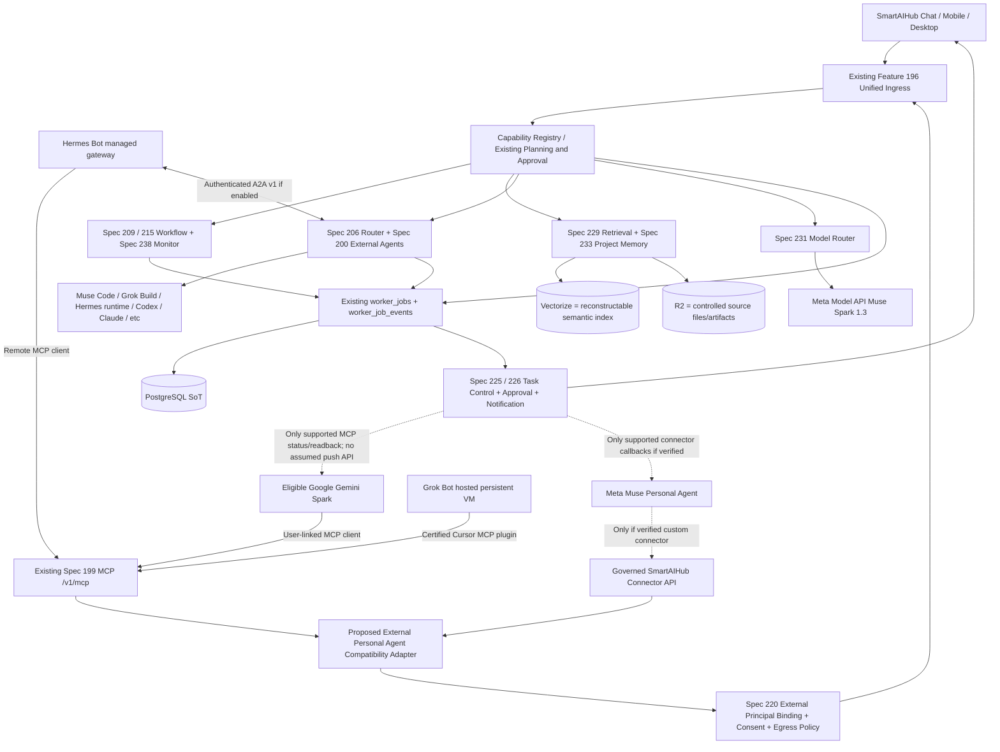
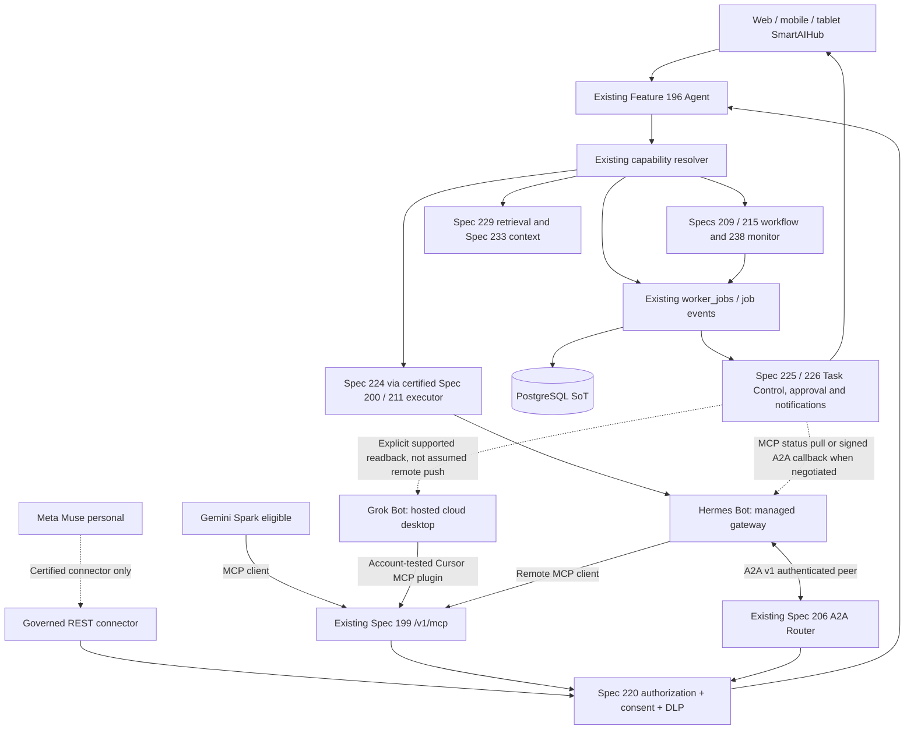

# SmartAIHub: Meta Muse × Gemini Spark × Grok Bot × Hermes Bot
## Cross-Spec Audit, Integration Architecture & Proposed Spec 239 (R2.0 Audited)

**Status warning.** This R2.0 document retains the expanded R1.1 design and adds authoritative Sections 22–36 after an independent 10-round review. This expanded R1.1 material compares Library-visible design artifacts and official vendor documentation as at 24 September 2026; Sections 22–36 supersede any incompatible R1.1 or R1.0 statements. Sections 13–21 supersede compatible R1.0 provider-scope examples. It has **not** inspected the live SmartSpecPro registry, Git branches/worktrees, deployment, database migration journal, provider accounts, or live entitlements. The number **239 is provisional**; reserve it only after repository checks. No code or original specs were changed. Earlier specifications are preserved as historical design inputs unless current source/deployment evidence proves a capability; do not retroactively rewrite them or mutate the currently in-progress Spec 224.

## 1. Decision summary

SmartAIHub should work in three independently useful modes:

1. **Native SmartAIHub Agent**: Feature 196 owns intent, goals, capability routing, long-term conversation, and approvals. Spec 238 monitors and Specs 209/214/215 workflows run when users close every vendor app; no external personal-agent subscription is required.
2. **External agent → SmartAIHub**: eligible Gemini Spark users connect the **existing SmartAIHub MCP endpoint `/v1/mcp`** through a rigorously scoped *Personal Agent Client Profile* with R2 OAuth/client-version negotiation. Meta Muse users may connect through supported/custom connectors **only when an official, user-verified connector pathway works**. Third-party agents are callers, not elevated SmartAIHub principals.
3. **SmartAIHub → provider capability**: Meta Model API `muse-spark-1.3` through Spec 231; Meta Muse Code through Spec 200 local/Runner `muse serve` session protocol or `muse exec --json`. Keep separate from **Meta Muse Personal Agent**, for which an authenticated public task-dispatch API has not been verified. Google Gemini API may be a model provider if independently supported by Spec 231; it is **not the same product as Gemini Spark**.

4. **Grok Bot and Hermes Bot interoperability**: certified inbound MCP profiles for both, plus a separately certified **Hermes A2A** inbound/outbound profile. Grok Bot remains a provider-hosted always-on computer and its own routines stay provider-owned; Hermes gateway/bot profiles can run on a user-managed or approved cloud host. Do not assume Grok Bot exposes a public task-dispatch API; xAI Grok API and Grok Build are distinct product surfaces.

Do not introduce `external_agent_jobs`, `spark_jobs`, a new personal memory store, an additional RAG pipeline, independent approval/billing, a voice-agent fork, or another scheduler/notification gateway. A provider's task state is a *foreign reference* to a canonical `worker_job` where SmartAIHub owns the work.

## 2. Verified vendor surfaces and operational caveats

| Product/surface | Officially documented interface or feature | Proposed SmartAIHub direction | Non-assumption |
|---|---|---|---|
| Meta Muse Personal Agent (launched 8 Sep 2026) | Per-user dedicated secure cloud VM/browser; connectors for Meta and external services; can develop custom connectors for services with APIs/CLIs; independent Sentinel mediates tool/egress | Expose narrowly scoped SmartAIHub REST API and approved connector instructions **for a user-validated connector if available**; adopt Sentinel-inspired security patterns | Not evidence of an accessible external agent task API, externally configurable MCP client for every user, or approved Meta distribution rights |
| Meta Muse Code | `muse serve` stable, versioned session protocol, `muse schema`, TypeScript SDK; `muse exec --json` JSONL/headless | Implement `MUSE_CODE` provider adapter in Spec 200; require Spec 224 to control software-development lifecycle | CLI turn completed/exit code 0 is not software verification; some platform features vary by build/OS |
| Meta Muse Spark model | Model API, standard `muse-spark-1.3`, Responses/Messages-compatible surface at `https://api.meta.ai/v1`; multimodal/model tool calls | Add model candidate/capabilities to Spec 231 after price, regional access, data-retention and tool tests | Does not grant access to a subscriber's hosted personal Muse, browser, memory, or VM |
| Google Gemini Spark | Schedules, Skills, proactive tasks, Google connected apps; *Custom Connected Apps* via MCP server URL | Build a `GEMINI_SPARK_MCP_CLIENT` compatibility profile for `/v1/mcp`; start read-only and explicit user consent | No independently verified Spark public dispatch/streaming task API from SmartAIHub into Spark |
| xAI Grok Bot (persistent hosted agent) | Provider-hosted cloud computer, browser/filesystem/terminal, per-bot memory/routines; inherits Cursor connector/MCP policy; connector setup and allowance vary by account/team | `GROK_BOT_CURSOR_MCP` inbound client profile at existing `/v1/mcp`, after real account/plugin conformance; return canonical SmartAIHub status/receipts | Do not equate Grok Chat custom connector or xAI API remote MCP with verified Grok Bot installation; no public hosted-Bot task dispatch API assumed |
| xAI Grok API / Grok Build (distinct) | xAI Responses remote MCP tools; Grok Build CLI offers headless and ACP, provider version-dependent | Grok inference via Spec 231; optional separate `GROK_BUILD` Spec 200/211 adapter only after protocol tests | xAI model API access does not grant a Grok Bot's cloud VM, memory, browser sessions or routines |
| Nous Research Hermes Bot / Hermes Agent | Hermes profiles/Bot Mode; remote HTTP/local stdio MCP; A2A v1 bidirectional peer support, independent gateway daemon and scheduler/cron | `HERMES_BOT_MCP` client at `/v1/mcp`; `HERMES_BOT_A2A` peer in Spec 206; optional self-hosted execution through Spec 200/211 Runner adapter | Desktop Bot Mode UI alone is not an always-on host. For 24/7 operation run Hermes gateway on an appropriately managed always-on host; verify installed version, endpoint exposure, auth and persistence |
| Gemini Spark Custom Connected Apps | Official Google help currently specifies US, personal Google Account, age 18+, Keep Activity on, English, and connection through Gemini web app; availability may differ from general Spark | Enable only after live entitlement/locale tests. US-based eligible pilot; Thai users continue through native SmartAIHub Agent and any independently available Google model API | Spark's broader availability in countries/languages does NOT establish custom MCP entitlement in Thailand |

**Date note:** Google's *current* English update page dates Custom Connected Apps to **29 June 2026**. Certain previously indexed translated search snippets have shown **17 July 2026**. Prefer the current full official change log over snippets; feature support is governed by current product help and account eligibility, not the announcement date.

Primary vendor sources:
- [Introducing Muse — Meta, 8 Sep 2026](https://about.fb.com/news/2026/09/introducing-muse-personal-ai-agent/)
- [How We Built Safety Into Muse — Meta, 8 Sep 2026](https://research.meta.ai/blog/security-and-safety-for-ai-agents-our-approach-with-muse)
- [Meta Model API overview](https://dev.meta.ai/docs/overview)
- [Muse Code protocol and SDK](https://dev.meta.ai/docs/muse-code)
- [Muse Code headless and CI](https://dev.meta.ai/docs/muse-code/extending)
- [Google Gemini Spark official help](https://support.google.com/gemini/answer/17094507?hl=en)
- [Google Spark current feature updates](https://support.google.com/gemini/answer/17171264?hl=en)
- [Google Custom Connected Apps requirements and risks](https://support.google.com/gemini/answer/17209137?hl=en)
- [xAI Grok Bot overview](https://docs.x.ai/grok-bot/overview)
- [xAI Grok Bot teams and MCP connector policy](https://docs.x.ai/grok-bot/teams-and-enterprises)
- [xAI Grok Bot announcement, 11 Aug 2026](https://x.ai/news/introducing-grok-bot)
- [xAI Grok API remote MCP documentation](https://docs.x.ai/developers/tools/remote-mcp)
- [Hermes Agent: MCP documentation](https://github.com/NousResearch/hermes-agent/blob/main/website/docs/user-guide/features/mcp.md)
- [Hermes Agent: bidirectional A2A documentation](https://github.com/NousResearch/hermes-agent/blob/main/website/docs/user-guide/messaging/a2a.md)
- [Hermes Agent: Bot Mode and gateway cron](https://github.com/NousResearch/hermes-agent/blob/main/website/docs/user-guide/bot-mode.md)

## 3. Existing-spec ownership and exact integration delta

| Existing spec | Unchanged authoritative responsibility | Additive integration delta |
|---|---|---|
| 186 / 195 / `worker_jobs` | Durable job identity, leases, idempotency, events, reconciliation, outbox | Add foreign agent attribution and idempotent external action references as child metadata; never duplicate jobs |
| **196** | Sole Agent/Goal Orchestrator, conversation, capability resolution | Normalize external caller context and map `request_goal`, `status`, `cancel`, `approve` to existing commands; no parallel personal-agent brain |
| **199** | Existing MCP gateway, upstream registry, OAuth, authorization, tool discovery | Dedicated minimal client profiles for Spark, Grok Bot and Hermes MCP, plus an equally scoped Meta connector profile if verified; feature/transport conformance, client isolation, version pinning |
| **200** | Provider-native External Agent Adapter | Add `MUSE_CODE` through `muse serve` / SDK with optional version-gated JSONL fallback; optional `GROK_BUILD` adapter after ACP/headless tests and optional Hermes self-hosted adapter; hosted Muse/Grok Bot outbound task APIs stay `UNVERIFIED` |
| **206** | A2A-first routing and external agent interop where supported | Use certified Hermes A2A v1 bidirectionally for a registered authenticated peer; capability-negotiate A2A for others only on verified endpoints; no A2A assumption for hosted Muse/Spark/Grok Bot |
| **207** | Platform credits/ledger | Meter actual SmartAIHub resource usage per linked user/tenant and originating provider; external Google/Meta subscription costs are outside platform billing unless explicitly integrated |
| **208 / 213** | Browser/computer-use selection and live certification | External agent browser actions do not count as SmartAIHub-certified browser results; prefer existing native/Runner browser and user handoff |
| **209 / 214 / 215** | AI-assisted authoring, canonical node catalog, compiled workflow and runtime | Optional ExternalAgentIngress/Callback typed compatibility adapter using existing node families; no vendor-specific workflow fork |
| **212 / 234** | Spec 212 design/corpus baseline pending runtime verification; additive use-case upgrades | Extend via Spec 234 after verified registry/deployed API; add reusable use-case templates but do not rewrite historical Spec 212 |
| **220** | Tenant/user/role/agent authorization and approval | External actor linkage, egress/DLP policy, least-privilege delegated scopes, revocation, policy snapshots and approval binding |
| **222** | Advisory learning and evaluation | Compare actual route quality by provider; never autonomously increase privileges or transmit private memories to vendors |
| **224 / 235** | In-progress autonomous development lifecycle and safe external-development bridge | Muse Code is just another Spec 200 executor; add after stable ingress contract, isolated worktree, independent build/test/final verification; never rewrite in-flight 224 |
| **225 / 226** | Mobile-first interaction, universal task control, compatibility ingress, Attention events, notifications | External Agent Connection Center, cross-device approval handoff, provenance shown in UI, revoke and Task Control history |
| **228** | Operational incident and feedback management | Ingest external connector failures, OAuth revocations, repeated access denials and provider outages without conflating task failures with system bugs |
| **229 / 230** | Only production Retrieval Broker / authorized Context Pack | Per-call minimum scoped RAG, redact/transform before third-party egress, stale/ACL checks and explicit inclusion of sources; no provider-native unscoped private index |
| **231** | Model selection, provider capabilities, privacy/cost/latency routing | Add Meta Muse Spark as **model**, independent of Meta Muse Personal Agent; certify structured tools, multimodal, region/privacy and vendor billing |
| **232** | Zero-downtime Cloudflare migration, PostgreSQL SoT and durable execution | Workers host APIs/MCP and short actions, Queues/Workflows as transports where approved, not a second ledger; long-lived Muse Code or desktop execution through authorized Runner/container |
| **233** | Living Project/Personal/Product Intelligence | User-selectable, consented context-pack export; local project memory retained by SmartAIHub; remote vendors receive minimal temporary snapshots, not wholesale memory replication |
| **236 R2 / 237 R2** | Live Commerce public media/QC and shared private multimodal Agent | External agent may help plan a show or prepare assets; may not route raw personal-agent speech directly to OBS or inherit merchant privileges |
| **238 R1** | Universal Intelligent Monitoring & Alert Builder | Optional provider-facing `monitor.create/status/revise` through canonical MonitorBlueprint; Spark schedules and SmartAIHub monitors remain separate authorities; do not silently create duplicate monitors |

**Revision caution:** Library-visible Spec 224 alignment file named `r20` has header revision 19. Confirm repo status at implementation time; do not use filenames or Library copies to declare deployed contract versions. Library-visible Specs 236/237 latest discovered here are **R2**, packaged as unnamed `spec(20260923-231517).md` (236) and `spec(20260923-231521).md` (237), and their R2 appendices supersede conflicting earlier examples. Spec 238 R1 exists, so **239 is merely the next proposed number**.

## 4. Target topology



**Authority rule:** external providers own their personal chat/VM/schedule state. SmartAIHub owns only SmartAIHub actions it has admitted and the corresponding local artifacts. No automatic bidirectional sync of all memories or chat transcripts.

## 5. Proposed add-on: External Personal Agent Compatibility Adapter

The adapter is a profile and ingress normalizer **inside existing 199/200/206/226 extension seams**; it must not be independently deployed as an authority for identity, scheduling, agent thinking or execution. Use a low-cardinality, controlled `provider_surface` registry distinct from model names.

Proposed identity and task contracts:

```typescript
// Proposal: map to deployed schemas before implementation.
type ExternalPrincipalBinding = {
  connection_id: string;
  provider_surface: 'GEMINI_SPARK_MCP' | 'META_MUSE_CONNECTOR' |
    'GROK_BOT_CURSOR_MCP' | 'HERMES_BOT_MCP' | 'HERMES_BOT_A2A';
  issuer: string; external_subject_hash: string;
  smartaihub_user_id: string; tenant_id: string;
  approved_scopes: string[];
  allowed_project_ids: string[];
  credential_ref: string; // secret broker reference, never token bytes
  policy_revision: string;
  expires_at: string; revoked_at?: string;
};

type ExternalTaskIntent = {
  schema_version: '1';
  external_connection_id: string;
  request_id: string; idempotency_key: string;
  action: 'capabilities.list' | 'goal.request' | 'job.status' |
          'job.cancel' | 'monitor.create' | 'monitor.status' |
          'artifact.get_metadata';
  project_id?: string; user_visible_purpose: string;
  input: Record<string, unknown>;
  data_sharing_consent_ref?: string;
  parent_job_id?: string;
  requested_budget?: { credits: number; wall_seconds: number };
};

type SmartAIHubTaskReceipt = {
  worker_job_id?: string; canonical_goal_id?: string;
  state: 'REJECTED' | 'AWAITING_APPROVAL' | 'ACCEPTED' |
         'RUNNING' | 'PAUSED' | 'SUCCEEDED' | 'FAILED' |
         'CANCELLED';
  cursor?: string; status_url?: string; next_poll_after_s?: number;
  policy_reason_code?: string;
};
```

**Contract details:** enforce exact principal mapping and trusted issuer on every call; no self-declared tenant or admin role; policy intersection = platform ∩ tenant ∩ user ∩ connection ∩ job; `external_subject_hash` is correlation, not authentication; idempotency scope includes tenant, connection, action and request id; every approval binds action hash + resource + target + spend ceiling + expiry + single-use or explicit bounded repeat. Provider approval UI does **not** substitute for SmartAIHub's own server-side approval. Monotonic task cursor and signed artifact links prevent stale/replayed callbacks. Avoid unbounded MCP discovery and uncontrolled dynamic skill execution.

### 5.1 Suggested MCP client-facing surface

**P0 read-only:** `smartaihub.capabilities.list`, `smartaihub.projects.list_authorized`, `smartaihub.jobs.status`, `smartaihub.jobs.result_metadata`, `smartaihub.monitors.list_authorized`, `smartaihub.project.search_scoped` (only with explicit source/consent grants).

**P1 bounded write:** `smartaihub.goal.request`, `smartaihub.jobs.cancel`, `smartaihub.monitor.create_draft`, `smartaihub.monitor.activate` and `smartaihub.artifact.create_request`. All writes require SmartAIHub policy and user approval as appropriate. Limit synchronous MCP duration; return canonical job receipt and polling status for durable effects.

**Explicitly excluded initially:** raw SQL, arbitrary shell/network calls, admin functions, unrestricted `worker_jobs` mutation, raw file download by default, full chat-history or memory export, autonomous checkout, arbitrary Git merge/deploy and `monitor.threshold_overwrite`.

### 5.2 Muse Personal Agent compatibility

Prepare a documented SmartAIHub OAuth-protected REST connector with JSON Schema and optional provider-specific Skill instructions, but mark it `UNVERIFIED_VENDOR_INSTALLATION`. Only activate after a real personal Muse account proves connector onboarding, API invocation, permission UI, revocation and egress controls. **Do not** use browser automation to bypass unpublished Muse APIs or simulate a supported managed-agent connector.

### 5.3 Muse Code adapter

Register `MUSE_CODE` as provider profile under existing Spec 200. Prefer versioned `muse serve` and the SDK/session protocol for structured progress, approval, interrupt, resume, diff and event cursor; permit `muse exec --json` for certified headless fallback. Pin binary, schema and protocol versions; use per-run isolated worktrees and runner policy. Never use `--yolo`, disable sandboxing or silently auto-approve protected edits in production. Exit code zero means the agent turn ended, **not** that Spec 224 Final Verify passed. Independent tests/review/policy gates remain mandatory. Windows requires platform feature probing (Meta documentation currently reports limits such as missing session messaging on Windows).

### 5.4 Meta Model API adapter

Implement separate `META_MUSE_SPARK_MODEL` inference provider inside Spec 231 using documented Meta Model API and `muse-spark-1.3`. Test Responses/Chat/structured tool calls, reasoning/caching, request/response redaction, privacy tier, regional account eligibility, per-model actual rates and failover. Model API cannot impersonate a hosted Muse subscription or transfer personal Muse's memory/VM/browser state.

### 5.5 Gemini Spark limitations

Gemini's official help describes `Custom Connected Apps` via an MCP server URL added from its web UI. Conformance requirements should include OAuth flow/CIMD where advertised and supported, preregistration or approved DCR fallback where offered, signed user-link completion, exact tenant association, basic tool discovery, write confirmation, disconnect/revoke, status/results and privacy notices. **Availability gate is per feature, not general Spark market availability**. Current help lists **US / English / personal account / age 18+ / Keep Activity**, so a Thai user may not be eligible for this custom-app path despite wider Spark rollout. If unavailable, keep SmartAIHub native agent functional and permit only independently verified Google model/Workspace capabilities under their own permission contracts.

## 6. Security borrowed from Meta Muse, adapted to existing ownership

Meta documents a Sentinel separated from the core agent, privileged connector workers, credential surrogation, network egress mediation, isolated VM, policy-bound approvals, and controls for prompt injection. SmartAIHub should use these as **design patterns**, not copy claims that its current stack has the same guarantees.

**New P0 controls for existing Spec 220 / Runner / gateway:**

- Strict tool method/purpose validation and shared policy checks before any effect.
- Secret broker credentials never included in prompts, model-visible logs, third-party connector code, RAG chunks or browser screenshots.
- Egress allowlists by tenant/connection/capability and exact destination; block SSRF, private IP rebound, arbitrary redirects and unreviewed downloads; server-enforced logs for actual destinations.
- Mark all outside tool, email, webpage, user-upload and third-party MCP content untrusted; enforce data-label-aware retrieval and outward redaction even if the model proposes otherwise.
- Distinguish `READ_PRIVATE` from `SEND_EXTERNAL`, including cross-app inference context transfer. The data shown to Spark may originate in Google chat, connected apps and websites; consent must cover data *coming into* SmartAIHub as well as data *leaving* it.
- Enforce managed connection-initiated OAuth, short-lived credentials, token rotation/revocation and exact user/tenant binding.
- Audit each requested action, denied/effective policy, approval decision, transformed context, outbound origin and canonical job receipt.
- Treat long-lived Muse Code or browser execution as needing isolated persistent Runner/Container/VM; Cloudflare Workers handle ingress and coordination, not interactive terminals or user dedicated cloud desktop by default.

**Proposed enhancement, not existing fact:** a central egress-enforcing proxy or sandbox broker patterned after Meta's Sentinel for high-risk, private-data-plus-network workloads. This is meaningful only if actual network paths cannot bypass it and red-team tests prove the boundary. Do not call it Sentinel security parity until independently evaluated.

## 7. UI/UX extensions through Spec 225/226

**Connections / External Personal Agents** in existing SmartAIHub Settings or Assistant (extend with R1.1 Grok Bot and Hermes cards):

- Connection card: Gemini Spark MCP, Meta Muse personal connector (disabled until certified), Grok Bot MCP, Hermes MCP/A2A, Meta Model API, Muse Code and independently version-gated Grok Build; show distinct product/surface, capability state, entitlement region, actual installed profile, scopes, consent/revoke and costs.
- User-readable `Why this permission?` sheet for each external capability. Project/source selection for read access, fine-grained write scopes, time/budget caps and automatic expiration.
- In AI Chat, `Task originated from Gemini Spark`, `Task originated from Muse`, `Task originated from Grok Bot`, `Task originated from Hermes Bot`, or `Running with Muse Code` badges with provider-verified vs user-entered distinction.
- Task Control: canonical job ID, external request ID (redacted), observed vs claimed state, immutable approval history, cost, result references, retry/cancel and last-sync cursor. If provider has no task callback, show `READBACK_ONLY` rather than fake real-time push.
- Mobile and tablet: same approval/notification/deep links; avoid login/delegate requiring a local desktop. Existing Spec 225 Notification Gateway is the only notification delivery owner.
- Admin view: enabled feature gates, server/client version, regional entitlement proof, consent health, DLP/egress denies, quota, retry and orphan-job alerts. User content shown only within existing admin/legal authorization boundaries.

## 8. Scenarios that validate the value

| Scenario | Correct owner and flow | Explicit boundary |
|---|---|---|
| Eligible Spark user: "Research my SmartAIHub project and start a report" | Spark → scoped MCP → existing Feature 196 → Spec 229 authorized retrieval → `worker_jobs` report → status pull | Do not expose whole personal/team memory or assert Spark availability in Thailand |
| Spark asks to monitor severe rain | Spark → `monitor.create_draft` → Spec 238 blueprint → source/capability validation → user approval → Spec 215 / `worker_jobs` → Spec 225 alerts | Do not run duplicate Spark and SmartAIHub watches silently; no unvalidated life-safety public advice |
| SmartAIHub user requests automated dev work using Muse | Feature 196 / Spec 224 → Spec 200 `MUSE_CODE` via Runner/SDK → durable events → independent tests and Final Verify | Muse CLI exit 0 is not completed Spec 224, and do not mutate a blocked in-flight 224 run |
| User talks to agent with camera while viewing room | Spec 237 voice/camera → Feature 196 → Spec 229 scoped project/context and catalog → approved Media Studio task | External Muse/Spark need not own realtime media or user screen stream |
| Merchant requests live-commerce show planning via external agent | External agent → scoped project/show draft → Spec 236 show owner + Spec 237 claim-gated approved voice → OBS | Never send unapproved raw speech or speculative product claims on air |
| User without third-party agent or PC | Native SmartAIHub mobile/web → Feature 196 / 225 → Cloudflare API + certified cloud execution → Spec 238/215 durable tasks | No compulsory Meta/Google subscription and no dependence on local-only Runner for cloud-ready features |

## 9. Rollout, feature flags and implementation gates

### Phase 0 — Read-only preflight and baseline freeze

Inspect real `specs` registry, implementation of Features 186/195/196, `/v1/mcp` OAuth/CIMD/preregistered/DCR-compatibility conformance, deployed Spec 199/200/220/225/226, `worker_jobs`, Spec 238 status, active Spec 224 worktree and migration journal. Confirm numeric slot before registering 239. Produce a code-line-level gap matrix. No production schema changes.

### Phase 1 — Vendor-independent inbound profile (can ship to Thai users)

Add canonical external-principal binding, minimum allowed tool subset and MCP compatibility tests to the existing gateway. Use a simulated independent MCP client to prove discovery, scopes, denial, user confirmation, cancellation, reconnection, idempotency and stale token handling. Expose a user Connections UI and admin observability behind disabled-by-default flags. Native SmartAIHub agent keeps working with everything off.

### Phase 2 — Real eligible Gemini Spark integration

With an **eligible and authorized account**, test real MCP URL entry, OAuth negotiated CIMD/preregistered/approved-DCR handshake, least-privilege read, human-approved bounded write, actual status readback, disconnect and revocation. Capture redacted receipts and feature-geography evidence. If unavailable, record `VENDOR_ENTITLEMENT_BLOCKED` rather than attempting to bypass controls.

### Phase 3 — Meta Muse Code + Meta Model API

Implement native provider adapter in Spec 200 for Muse Code `muse serve` with schema pinning, safe fallback to JSONL only when tested, and a separate Meta Model API provider entry in Spec 231. Start with a trivial isolated repo, deterministic fixtures and independent test results; only then admit optional use as executor for **future** Spec 224 work packages, respecting existing in-flight boundaries.

### Phase 4 — Muse personal connector proof

Publish safe OAuth REST and optional connector documentation. Do not call it supported until a real personal Muse installation passes all user-consent, method discovery, identity, action/approval, revocation and egress tests. Use no undocumented private endpoints.

### Phase 5 — Productize templates / billing

Offer one user-visible "Connect external agent" flow with precise independent feature states; add optional approved use-case templates through Spec 234 rather than changing the Spec 212 design/corpus baseline; reconcile provider cost projections and issue/alert telemetry. Enable marketplace publication only after permission and commercial terms are reviewed.

## 10. Conformance tests and non-goals

1. Existing SmartAIHub agent and all deployed workflows work with integration feature flag OFF.
2. External client cannot claim another `tenant_id`, `user_id`, role or project.
3. Same request/idempotency key creates at most one admitted `worker_job`.
4. Revoked access rejects calls and unread results immediately where technically possible.
5. Project ACL changes cause retrieval fail-closed, including already indexed Vectorize chunks and stale context packs.
6. OAuth DCR unsupported/client errors produce typed compatibility failure rather than silently widening grants.
7. Provider's own approval and SmartAIHub approval are separately enforced and reflected accurately.
8. `READ_PRIVATE` grant never implies network send or cross-app export.
9. Prompt injection inside returned search results, HTML, PDF or third-party tool descriptions cannot grant tools or bypass egress controls.
10. Destination/redirect/SSRF and DNS rebinding fail closed.
11. Every material outgoing result includes source/expiry or is explicitly labeled uncertain.
12. Agent-generated monitored tasks use only Spec 238 canonical monitor IDs and Spec 215 / `worker_jobs`.
13. External personal agent scheduler discontinuity does not delete SmartAIHub-owned durable work or create a competing alarm source.
14. `MUSE_CODE` replay/resume correctly maps protocol events without claiming test PASS from agent terminal success.
15. Provider absence/geo-restriction leaves native SmartAIHub mode fully functional.
16. Model adapter does not leak managed personal Muse credentials or attempt hosted Muse API calls.
17. Public live speech crosses Spec 236/237 approved artifact gates even when planning came from Spark/Muse.
18. Explicit cost ceiling enforced before billable SmartAIHub execution; retry cannot double-charge.
19. Admin/operator scopes never arise from external natural-language instructions.
20. Disable/rollback existing profile leaves historical events/receipts readable and no phantom jobs.

**Do not claim production grade** based on passing document validation. Require real endpoint contract tests, authorization adversarial tests, deployment/migration inspection, vendor entitlement proof, production-like staging and an independently documented release approval.

## 11. Resource and business evaluation

- **Fastest value:** connect existing MCP to external agent clients (where user entitlement allows) and integrate Muse Spark **model API** independently. Neither requires duplicating the Agent runtime.
- **General Thailand availability:** rely on native SmartAIHub mobile/web + managed cloud execution. External Spark custom MCP is optional under its presently documented US/English limits.
- **Highest security uplift:** enforce actual egress separation and secret-safe connector execution before exposing private project data to any third-party agent; Meta's published Sentinel design is a useful reference, not a certification shortcut.
- **Provider subscriptions:** separate end-user Meta/Google subscription costs from SmartAIHub-credit metering; disclose that SmartAIHub cannot inspect or reconcile every operation on a provider-owned VM.
- **Avoid unnecessary always-on VM cost:** persistent VM/Runner only for tasks genuinely requiring desktop/browser state; API, MCP ingress, scheduled evaluation and lightweight orchestration can run on currently certified Cloudflare services.

## 12. Implementation instruction for the development team

> Using this document as a **proposed additive spec**, first compare actual SmartSpecPro canonical registry/main/PR/worktrees and current deployed schemas/feature flags. If 239 is occupied, allocate another ID instead of overwriting. Pin R2 Specs 236/237 and R1 Spec 238 to the verified file versions, then produce code-level cross-spec gap and security-threat reports. Implement Phase 1 as a narrow integration through existing Specs 199/220/226 while preserving Feature 196 and `worker_jobs` authority. Add real external-provider flows only after official entitlement/capability probes. Treat Muse Code and Muse Spark Model API as **separate products** from Meta Muse Personal Agent. Do not alter blocked/in-progress Spec 224, rewrite Spec 212, run unapproved migrations, or invent unsupported provider task APIs. Independently verify the full negative tests and rollback before enabling tenant pilots.

---

# R1.1 NORMATIVE EXPANSION — Grok Bot + Hermes Bot

**Precedence.** This appendix expands the canonical Spec 239 candidate to cover four personal/autonomous agent surfaces. Where an earlier example or rollout table suggests that this specification is limited to Meta Muse and Gemini Spark, this R1.1 expansion takes precedence. Neither Grok Bot nor Hermes Bot is merely a model selection. Do not add a duplicate gateway, scheduler, memory store, approval service, or job ledger. The original P0 gateway/security requirements remain mandatory.

## 13. Product-family taxonomy and truthful capability negotiation

| Surface ID | Nature / execution host | Verified route **into** SmartAIHub | Verified route **from** SmartAIHub | Unverified or gated |
|---|---|---|---|---|
| `META_MUSE_CONNECTOR` | Meta-hosted Personal Agent, provider-owned compute/memory | Vendor connector only after account-specific real test | No verified hosted-personal-agent task API | Installation and account availability |
| `GEMINI_SPARK_MCP` | Google-hosted Spark, account eligibility dependent | Eligible account → remote SmartAIHub MCP | No verified consumer Spark task dispatch API | Geography, user/locale/feature entitlement |
| `GROK_BOT_CURSOR_MCP` | Grok Bot on persistent Cursor-hosted cloud computer, provider-owned routines | Grok Bot plugin using allowed Cursor MCP configuration → SmartAIHub `/v1/mcp` | **No verified public hosted-Bot per-task dispatch/stream API**; provider-side computer/UI usage is not an API contract | Account entitlement, plug-in installation, OAuth, enabled tool set; API != hosted Bot |
| `HERMES_BOT_MCP` | User/tenant-managed Hermes gateway/profile, local or cloud host | Hermes remote HTTP MCP client → SmartAIHub `/v1/mcp` | A standalone remote MCP server is not an agent inbox; use its independently verified A2A/gateway route | Hermes installed version, authenticated reachability and gateway uptime |
| `HERMES_BOT_A2A` | Same Hermes instance with A2A v1 platform plugin enabled | Hermes A2A peer → existing SmartAIHub Spec 206 A2A endpoint **only if deployed** | Existing Spec 206 A2A client → Hermes authenticated Agent Card/A2A endpoint | Plugin enabled; reachable host; per-peer token; authenticated Agent Card; streaming/webhook semantics |
| `XAI_MODEL_API` / `GROK_BUILD` | API inference / separate coding CLI, *not* Grok Bot | Grok API MCP available in compatible API requests; coding CLI through certified adapter | Spec 231 model call / Spec 200+211 provider-native execution respectively | Provider version, account rights, budget and test evidence |

**Do not conflate these three xAI surfaces:** Grok Bot (user's hosted persistent computer), Grok Chat/API (MCP-compatible model/chat product) and Grok Build (coding harness/ACP). Grok Chat custom-MCP support and API remote-MCP support are supporting evidence for the ecosystem, **not proof** that a given Grok Bot account has the identical connection UI or an externally callable Bot task API. Grok Bot's team documentation explicitly states it inherits Cursor connector policy and enterprise MCP allowlists, making a controlled plugin pilot viable; certify the *actual Bot product* before setting profile `READY`.

**Hermes deployment rule:** Bot Mode is a UI over named Hermes profiles (separate config, memory, skills and credentials). The Hermes gateway and cron scheduler are separate running services. A desktop bot card does not survive PC shutdown without a separately hosted gateway. An approved always-on Debian host, hardened container or durable cloud VM can run the Hermes gateway; do not require a dedicated VM per bot unless isolation/scale warrants it.

## 14. Four-direction relationship map and canonical authorities



**Direction A: external → SmartAIHub.** Grok Bot, Hermes, eligible Spark, or a certified Muse connector uses the same scoped public capability façade and obtains a canonical job/status/approval receipt. External agents never choose their own SmartAIHub tenant, grant or final success outcome.

**Direction B: SmartAIHub → external.** SmartAIHub can delegate to an authenticated Hermes A2A peer after capability/version/policy negotiation; Spec 206 owns interoperable routing, Spec 200 owns provider-native executable adapters, and Spec 224 owns software-development completion if the task family is development. For a hosted Grok Bot, do **not** describe public headless task dispatch as available until xAI publishes and the tenant validates a real compatible integration. Where no API exists, the user may start a task manually in Grok Bot and link a provenance-labeled external reference; SmartAIHub does not fabricate execution state.

**Direction C: model/tool provider.** xAI Grok API remote MCP, Grok models via Spec 231, and Grok Build through a separate coding adapter are independently registered capabilities; none borrows a Grok Bot's login, VM, memory or subscription accounting.

**Direction D: cross-agent collaboration.** Hermes may be an A2A peer and MCP client simultaneously, but prevent loops: propagated `parent_goal_id`, `hop_count`, `visited_agent_instance_ids`, origin signature and per-hop policy. Set bounded maximum hops/delegation depth and detect an identical objective already active before dispatch.

## 15. Canonical contract extensions; no new task source of truth

Add values to the R1.0 `ExternalPrincipalBinding.provider_surface` enum:

```typescript
type ExternalPersonalAgentSurface =
  | 'META_MUSE_CONNECTOR'
  | 'GEMINI_SPARK_MCP'
  | 'GROK_BOT_CURSOR_MCP'
  | 'HERMES_BOT_MCP'
  | 'HERMES_BOT_A2A';

type ForeignAgentReference = {
  connection_id: string;
  provider_surface: ExternalPersonalAgentSurface;
  provider_account_ref_hash?: string; // never raw credentials
  bot_profile_ref?: string; // user-mapped opaque bot/profile identity
  foreign_task_ref?: string; // vendor/local ID, may be absent
  foreign_thread_ref?: string;
  canonical_worker_job_id?: string; // present only for admitted SmartAIHub work
  mode: 'INBOUND_CLIENT' | 'OUTBOUND_PEER' | 'MANUAL_LINK';
  status_authority: 'SMARTAIHUB' | 'EXTERNAL_PROVIDER' | 'UNKNOWN';
  last_verified_cursor?: string;
  evidence_source?: 'MCP_RECEIPT' | 'A2A_EVENT' | 'PROVIDER_API' | 'USER_ASSERTED';
};

type ExternalAgentCapabilityManifest = {
  connection_id: string;
  surface: ExternalPersonalAgentSurface;
  transport: Array<'MCP_STREAMABLE_HTTP' | 'MCP_STDIO_LOCAL' | 'A2A_V1' | 'REST_VERIFIED'>;
  direction: Array<'CALL_SMARTAIHUB' | 'RECEIVE_SMARTAIHUB_TASK'>;
  supports_task_status_pull: boolean;
  supports_verified_cancel: boolean;
  supports_verified_resume: boolean;
  supports_authenticated_callbacks: boolean;
  supports_long_running_execution: boolean;
  approved_tool_ids: string[];
  evidence_at: string;
  software_version?: string;
  valid_until?: string;
};
```

This is a **proposed schema**, not proof that deployed migrations or APIs have these shapes. All fields are optional/feature-gated based on capability test. The `ForeignAgentReference` is child/projection metadata, not a new `external_agent_jobs` authority or job table. Reconcile state against `worker_jobs` only when SmartAIHub admitted a job. An external-only routine remains `status_authority=EXTERNAL_PROVIDER` and can at most be a linked observation in Task Control unless it emits verified interoperable evidence.

**Result attestation:** a provider text stating “done,” a browser screenshot, terminal exit 0, or a Bot's self-report is untrusted outcome data. Require canonical artifact checks/receipts and independent verifier where the owning spec demands them, especially Spec 213 browser certification and Spec 224 `FINAL_VERIFY`.

## 16. Scheduling and memory: anti-duplication and privacy

- Grok Bot routines and provider-owned hosted memory remain in Grok Bot; SmartAIHub monitors/schedules belong to Specs 238/215/225 and are never silently mirrored as Grok Bot routines.
- Hermes cron/routines remain Hermes-owned unless user explicitly migrates a routine into an authorized SmartAIHub MonitorBlueprint/Workflow. Imported schedules are **draft proposals** with last-updated timestamps, owner acknowledgment and conflict checking, not silent two-way synchronization.
- When an external bot requests SmartAIHub monitoring, return the canonical monitor ID and job status. Require explicit origin-linked dedupe fingerprint of `(tenant, user, goal, source scope, geography, cadence, recipient)` so repeated MCP or A2A requests cannot create parallel monitors.
- Memory is not automatically synchronized. `Spec 233` Project Memory is SmartAIHub-owned; Hermes per-profile memories and Grok Bot's hosted memories are external. Export only consented, scoped, redacted and time-bounded `Spec 229/230` context snapshots with immutable source revisions; no wholesale R2/Vectorize index copy.
- Never allow an inbound externally generated instruction to redefine the existing system's developer policy, bypass approval or request another user's data. An MCP/A2A transport identity must be bound to a SmartAIHub user and tenant, not merely trust a bot's declared name.

## 17. Deployment, uptime and costs

| Component | Execution / infrastructure | Who pays / availability risk |
|---|---|---|
| SmartAIHub `/v1/mcp`, OAuth, status and A2A gateway | Certified API runtime on Cloudflare Workers + existing auth/policy/backend | SmartAIHub ingress costs; no long-lived Bot process inside stateless Workers |
| SmartAIHub `worker_jobs`, workflow, approved monitor | Existing canonical job plane / certified queues and approved long-running runners | SmartAIHub credits/tenant budget; user PC may be off only for cloud-executable jobs |
| Grok Bot hosted browser/computer/routines | Provider-owned persistent cloud computer | User/organization subscription, vendor uptime and quota; SmartAIHub does not pretend to own or meter its internal compute |
| Hermes Bot gateway and cron | Registered user-owned Debian server or explicitly provisioned persistent tenant/container/VM, as permitted by resource and security policy | Host/network/provider inference bill; offline host makes local-only capabilities unavailable; heartbeat and restart policy needed |
| Hermes Bot Mode desktop UI | Desktop application frontend to Hermes profiles and gateway | UX client, not durable cloud runner |

No new compulsory per-user hosted VM in SmartAIHub just because an external agent runs one. Prefer a tenant-shared hardened Hermes host with profile/resource isolation only when permission tests prove it sufficient; high-sensitivity tenants may require per-tenant/per-run OS or VM isolation. Reject unlimited shell/computer use from unreviewed external profile registrations.

## 18. UI/UX and account-specific verification

**Connections → External Agents:** add `Grok Bot`, `Hermes Bot`, `Gemini Spark`, `Meta Muse Personal` and clearly separated `Models / Coding Harnesses` entries. Show five independent states per surface: `DOCUMENTED`, `ACCOUNT_ELIGIBLE`, `CONNECTED`, `CAPABILITY_CERTIFIED`, `READY`. A vendor documentation page is not evidence that the user's account is connected or that the endpoint is deployed.

For **Grok Bot**, guide the user through its actual Grok Bot / Cursor-approved plugin path. Expose only allowed SmartAIHub MCP tools for the authenticated mapped user; validate `capabilities.list`, status, an idempotent dry-run, human approval, revoke and loss of plugin permission. For multiple Grok Bots sharing one provider cloud computer, disclose that their account-level filesystem, logins AND permitted plugins are shared; never grant per-Bot isolation on a self-declared name.

For **Hermes Bot**, show profile ID, host/runner binding, gateway heartbeat, permitted MCP servers, authenticated A2A Agent Card URL if enabled, schedule owner, last verified request, callback/delivery health and model/provider spend. Support `INBOUND_ONLY`, `A2A_BIDIRECTIONAL`, `LOCAL_RUNNER_ONLY` and `DISCONNECTED` modes; never treat a publicly reachable unauthenticated Hermes peer as eligible. Do not leak a private Hermes host URL into public-discoverable MCP metadata.

In Task Control, badges must distinguish `Originated by Grok Bot`, `Originated by Hermes`, `Delegated to Hermes`, `Externally reported`, and `SmartAIHub verified`. A screenshot or unverified provider summary cannot render a green verified-completion badge. If no real callback exists, display `POLL/READBACK ONLY` or `MANUAL LINK` rather than invented live progress.

## 19. Concrete cross-spec changes and migration posture

| Existing spec | Additive delta for R1.1 | Gate |
|---|---|---|
| 199 MCP Gateway | Client profile `GROK_BOT_CURSOR_MCP`, `HERMES_BOT_MCP` and capability-filtered, versioned tool manifests | Account plugin and MCP conformance tests |
| 200 / 211 External Agent Runtime | Optional Hermes native gateway/CLI or separately certified `GROK_BUILD` headless/ACP adapter; never silently replace ongoing Codex/Claude adapters | Provider version and real worker/runner proof |
| 206 A2A | Inbound/outbound authenticated Hermes peer, Agent Card verification, stream/webhook callback integrity, loop guard and correlation | Endpoint/policy conformance; no assumption that hosted Grok Bot supports A2A |
| 220 Security | Provider/bot profile mapping, least-privilege, no cross-bot scope escalation, short-lived egress grants, A2A peer authentication and audit | Negative tests mandatory |
| 225 / 226 UI and cross-device | Grok Bot/Hermes connection cards, honest foreign-task state, mobile approval/revoke and no phantom verified completion | Does not rewrite implemented 195–213 contracts |
| 231 Inference | xAI Grok model provider distinct from Grok Bot; provider capabilities/cost/region/privacy routing | API and current-account certification |
| 233 Project Intelligence | Minimum signed/redacted consented context-pack export to either bot; never bidirectional wholesale memory replication | Source ACL + DLP recheck per export |
| 238 Monitoring | Bot request → proposed canonical MonitorBlueprint, explicit owner confirmation and cross-scheduler duplicate guard | Cannot change critical risk thresholds without domain approval |
| 212 / 234 | Add optional bot interoperability use cases through **234** only; implemented 212 unchanged | Deployed publication contract verified |
| 224 / 235 | Hermes/Grok Build future executor eligibility and provenance only after stable 224 ingress; no change to active blocked run | Real capability + independent Final Verify |

**Numbering:** Spec 239 stays provisional until actual authoritative registry, main, PR and worktree number checks; Specs 236/237 R2 and 238 R1 are Library-visible designs, not deployed contracts. No DDL or provider credentials until current schema/secret-owner approval is verified. No additional spec is necessary for provider profiles; allocate a distinct provider-specific spec later only for a genuinely independent runtime with new mandatory lifecycle requirements.

## 20. Rollout amendments and acceptance tests

**R1.1 implementation sequence:** First ship existing R1.0 vendor-agnostic inbound MCP and safety gates. In parallel, add a simulated Grok Bot-compatible MCP client and a real isolated Hermes test gateway. Promote Grok Bot's profile only after an actual approved Cursor/Grok Bot plugin installation verifies endpoint, identity, tool selection, approvals, readback and revocation. Promote Hermes A2A only after official v1 peer interop against the existing Spec 206 router, authenticated Agent Card retrieval, per-peer token tests, streaming/reconnection and signed callback replay tests. Then expand UI and approved Spec 234 template coverage. Treat all absent vendor/public task APIs as `NOT_AVAILABLE_UNVERIFIED`, not an implementation blocker for other profiles.

**Additional negative and positive tests** (all required for claimed R1.1 conformance):

21. Grok Chat MCP, xAI API remote MCP and Grok Bot Cursor-plugin support are registered and tested as *distinct* products; no cross-product entitlement or task API implied.
22. Grok Bot's account plugin `READY` state requires actual on-account invocation of read-only scoped SmartAIHub MCP tool.
23. A Grok Bot prompt cannot manufacture a SmartAIHub approval, admin role, cross-tenant access or unmetered job.
24. All of one Grok Bot account's bots sharing an external computer cannot gain SmartAIHub project access beyond their authenticated connection's explicit grants.
25. Hosted Grok Bot interruption, quota or deletion does not cancel a previously admitted SmartAIHub-owned job.
26. Hermes v1 A2A Agent Card, authentication, stream cursor, webhook signature, stale replay and wrong-peer rejection pass against the pinned installed build and SmartAIHub's actual Spec 206 endpoint.
27. Hermes inbound MCP and A2A calls sharing an idempotency origin cannot duplicate a canonical job.
28. Hermes-to-SmartAIHub-to-Hermes circular delegation terminates at the configured max hop count with an auditable loop-denied event.
29. Hermes gateway downtime changes **only** external executor availability; SmartAIHub's unrelated workflows and cloud monitors continue.
30. Closing Hermes desktop Bot Mode does not cause the UI to claim 24/7 availability; heartbeat reflects the actual gateway host.
31. Credential revocation takes effect on both Hermes MCP and A2A routes, including long-running callbacks and reconnects.
32. `MANUAL_LINK` external task results never count as Spec 224 Final Verify or Spec 213 browser certification.
33. Scheduler dedupe prevents Grok Bot routine + Hermes cron + SmartAIHub monitor from all independently creating the same SmartAIHub-owned alert without explicit user ownership choice.
34. Project memory export to any bot passes consent, ACL, rehydration freshness and external egress DLP checks; source revocation blocks future exports.
35. Future `GROK_BUILD` coding harness can be disabled independently from Grok Bot MCP and xAI Model API, with feature flag rollback not affecting active canonical jobs.
36. External agent UI shows provider account/region and each actual capability state; no `READY` inferred from a vendor announcement.

**Priority and release slices:** P0: vendor-neutral MCP identity/receipt and Hermes MCP fixture; P1: eligible Grok Bot real-plugin pilot and authenticated Hermes A2A peer; P2: optional Hermes managed-host templates, richer A2A progress and approved reusable Use Cases; P3: any future hosted Grok Bot or Muse reverse-task API only after official documented contract and live certification.

## 21. R1.1 implementation handoff

> Compare this R1.1 document with the live SmartSpecPro spec registry, actual deployed Spec 199 MCP gateway, Spec 206 A2A router, Spec 200/211 Runner providers, Spec 220 policy and Spec 225/226 UI bridge. Preserve the current Spec 224 blocked run and existing deployed 195–213 behavior. Prove a vendor-independent MCP dry-run; then implement and test `GROK_BOT_CURSOR_MCP` with actual account plugin rights and `HERMES_BOT_MCP` plus `HERMES_BOT_A2A` on a controlled gateway. Separate xAI Grok API, Grok Build and hosted Grok Bot. Never invent a hosted Grok Bot public task API or reuse external provider self-reported success as SmartAIHub Final Verify. Submit code-level evidence, adversarial permission checks, cost guardrails, migration/diff preview, replay/rollback and independently signed certification before release.

**Official R1.1 references:** [Grok Bot overview](https://docs.x.ai/grok-bot/overview); [Grok Bot enterprise connector inheritance](https://docs.x.ai/grok-bot/teams-and-enterprises); [Grok Bot routines](https://docs.x.ai/grok-bot/skills-routines-and-automations); [Grok custom connectors (separate Grok product)](https://docs.x.ai/grok/connectors); [xAI API Remote MCP](https://docs.x.ai/developers/tools/remote-mcp); [Hermes MCP](https://github.com/NousResearch/hermes-agent/blob/main/website/docs/user-guide/features/mcp.md); [Hermes A2A](https://github.com/NousResearch/hermes-agent/blob/main/website/docs/user-guide/messaging/a2a.md); [Hermes Bot Mode](https://github.com/NousResearch/hermes-agent/blob/main/website/docs/user-guide/bot-mode.md); [Hermes Cron](https://github.com/NousResearch/hermes-agent/blob/main/website/docs/user-guide/features/cron.md).

---

# R2.0 NORMATIVE CORRECTIONS — 10-ROUND CROSS-SPEC / PROVIDER / SECURITY AUDIT

**Precedence and scope (24 September 2026).** Sections 22–36 below supersede any conflicting contract, readiness claim, interface assumption, rollout sequence or example in Sections 1–21. Sections 1–21 remain as design background and traceable R1.1 history, but **R2 is the only implementation authority for Spec 239**. If an older example says DCR is required for every client, assumes a Bot has isolated connector credentials, describes a provider's reported completion as verified, or treats a draft companion spec as deployed, use R2 instead. This review inspected the accessible R1.1 artifact and published vendor/specification documents, **not** the live SmartSpecPro Git registry, deployed code, migration journal, or entitled provider accounts. All integrations remain proposed until each runtime gate is met.

## 22. Round 01 — Product taxonomy, real protocol direction and deployment capability

**Finding:** A product brand is not a protocol contract. Meta Muse Personal, Meta Muse Code, Meta Muse Spark model, Gemini Spark, Grok Bot, Grok Build, xAI model API and Hermes Agent must remain distinct records. Inbound MCP is **not** proof of a reverse task-dispatch API. Hermes offers documented MCP client and a separately enabled A2A v1 plugin; only the latter is a candidate for native inter-agent task delegation. A vendor's public announcement never sets an account to `READY`.

**R2 correction:** Each integration is a versioned `(vendor, product_surface, interface, transport, direction, tenant_connection, implementation_revision)` tuple. Replace globally inferred readiness with **per-operation, per-direction** proof. The compatibility registry SHALL use the following status states, none of which can be silently promoted:

`DESIGN_ONLY → DOCUMENTED → ACCOUNT_ELIGIBLE → AUTHENTICATED → ENDPOINT_REACHABLE → OPERATION_CONFORMANT → POLICY_APPROVED → READY`; also `BLOCKED_ENTITLEMENT`, `BLOCKED_POLICY`, `BLOCKED_VERSION`, `DEGRADED`, `REVOKED` and `UNKNOWN`. Readiness expires on vendor/protocol version changes, entitlement loss, OAuth issuer changes, new scope requests, materially changed tool schemas and policy revision changes. A specific permission-free read can be `READY` while `goal.request`, callbacks or reverse dispatch remain `NOT_SUPPORTED`.

| External surface | Verified published path to SmartAIHub | Published/verified reverse path from SmartAIHub | Runtime proof still required |
|---|---|---|---|
| Muse Personal | Custom connector only if user's actual Muse installation permits it; REST façade conditional | No public hosted-Personal task API verified | On-account connector installation and effect/revocation tests |
| Gemini Spark | Custom Connected App → remote MCP URL for eligible accounts | No public hosted-Spark task-dispatch API verified | Custom App eligibility, login/region, OAuth metadata and operation proof |
| Grok Bot | Cursor/Grok Bot-approved MCP plugin under actual account/team policy | No public Bot task API verified | Actual plugin install + effective scopes and tool invocation |
| Hermes Bot | Remote MCP client to `/v1/mcp`, separate authenticated A2A v1 peer | Authenticated Hermes A2A endpoint with version-pinned plugin | Live deployed Spec 206 endpoint, per-peer trust and streaming/callback conformance |
| Muse Code / Grok Build / Hermes local | Independently verified native adapter / CLI / ACP where implemented | Certified Spec 200/211 provider invocation | Actual binary/schema version and Runner proof |

Product documentation source evidence: [Meta Muse](https://about.fb.com/news/2026/09/introducing-muse-personal-ai-agent/), [Google Custom Apps](https://support.google.com/gemini/answer/17209137?co=GENIE.Platform%3DDesktop&hl=en-GA), [Grok Bot admin policies](https://docs.x.ai/grok-bot/teams-and-enterprises), [Hermes MCP](https://github.com/NousResearch/hermes-agent/blob/main/website/docs/user-guide/features/mcp.md), [Hermes A2A](https://github.com/NousResearch/hermes-agent/blob/main/website/docs/user-guide/messaging/a2a.md).

**Acceptance oracle R2-01:** Fake vendor documentation, successful model-only API calls or an installed Grok Chat connector must not promote a hosted personal-agent profile; reverse directions cannot appear as supported without actual dispatch evidence. Existing native SmartAIHub workflows remain usable without any vendor entitlement.

## 23. Round 02 — Identity, delegated permission and Grok Bot shared-host boundary

**Finding:** The R1.1 `bot_profile_ref` is informational, not an authenticated principal. Grok Bot's team documentation states **one per-user hosted VM and plugins/connectors shared by all of that user's Bots**. This invalidates any security design that relies on Bot names, different personalities or independent bot profile IDs to isolate data. A single user's Bot may also work across organizations where the connector grants allow it. Hermes profiles likewise must not be treated as OS isolation.

**R2 correction:** Authentication identities are `issuer + immutable issuer_subject + audience + authenticated OAuth client + verified SmartAIHub account link + tenant + connection_id`. Map Grok Bot to the **authenticated Cursor member/account connector principal**, never a self-declared Bot name. A `bot_hint` is UI/provenance only unless a vendor-signed per-Bot subject can be cryptographically verified and explicitly bound; absent that, assume every Bot of that Cursor member can exercise **all scopes of the shared connector**. Users requiring independent tenant/project boundaries must create independently authenticated connector accounts and, if required by the vendor policy, separate Cursor users/computers. For Hermes, gateway profile IDs similarly require independently enforced credentials or OS/VM isolation before claiming security isolation.

Server policy SHALL compute `effective_grants = intersection(platform_policy, tenant_policy, subject_roles, authenticated_connection_scopes, resource_ACL, purpose/egress, action_budget, current_approval)`. **Never trust** client-supplied tenant, user, role, bot label, project, forwarded headers, request origin or Agent Card display name. Validate authorization on enqueue, dequeue, data retrieval, effect execution and final artifact delivery; revoke an in-flight job's future effects when permissions disappear. For high-risk external read/write, distinguish `agent_initiator`, `authenticated_human_owner`, `actual_executor`, and `approver` in audit.

**Acceptance oracle R2-02:** Two Grok Bots sharing one Cursor member cannot obtain different SmartAIHub authorization simply by passing different `bot_id`; cross-tenant switched headers are rejected; consent and current ACLs override old connection grants; disabling one connector denies all Bots that share its credentials.

## 24. Round 03 — MCP 2026-07-28 interoperability and OAuth downgrade controls

**Finding:** R1.1 over-emphasized Dynamic Client Registration (DCR), whereas MCP `2026-07-28` makes **Client ID Metadata Documents (CIMD) preferred**, permits pre-registration, and retains DCR only as backward compatibility. Older HTTP+SSE and experimental task-API assumptions must not be smuggled into the new MCP profile. Spark and Grok Bot may implement only a subset of transport/authorization modes on a particular account.

**R2 correction:** `/v1/mcp` SHALL advertise the actual supported protocol revisions and maintain a pinned compatibility matrix for production clients. For modern HTTP authorization implement RFC9728 protected-resource metadata, correct `WWW-Authenticate` challenges, RFC8414/OIDC issuer discovery, issuer equality, authorization code + PKCE for public clients, `resource` indicators / audience-restricted tokens and enforced scopes. Prefer CIMD **only when the actual client and authorization server advertise it**; support preregistered clients and DCR fallback only where deployed and approved. Never downgrade from failed modern issuer/audience validation to unvalidated DCR. Validate absolute HTTPS redirect targets and anti-CSRF `state`; never allow cross-tenant token substitution, open redirects or token passthrough to upstream MCP servers.

Use Streamable HTTP where a given client proves conformance. Negotiate `MCP-Protocol-Version`, session IDs and supported methods per version; reject unsupported/malformed calls with typed errors. Expose asynchronous job receipts through ordinary bounded Tools `goal.request` and `jobs.status` at P0. Treat new MCP Tasks (`io.modelcontextprotocol/tasks`) as an **optional separately certified extension**, not proof every external client supports polling or callbacks. Any legacy SSE/DCR support requires a sunset date, compatibility tests and a distinct feature flag; do not confuse MCP transport SSE with an A2A streaming endpoint.

**Acceptance oracle R2-03:** CIMD client, pre-registered client, approved DCR legacy client, wrong issuer, wrong audience, missing `resource`, invalid PKCE, stale token, unsupported version, duplicate request and reconnect are exercised independently. Where an external client cannot negotiate one supported mode, mark that operation `BLOCKED_PROTOCOL` rather than silently weakening controls.

Standards: [MCP 2026-07-28 authorization](https://github.com/modelcontextprotocol/modelcontextprotocol/blob/main/docs/specification/2026-07-28/basic/authorization/index.mdx) and [MCP July revision](https://blog.modelcontextprotocol.io/posts/2026-07-28/).

## 25. Round 04 — Hermes A2A v1 security, reachability and interoperability

**Finding:** Hermes documents bidirectional A2A v1 through a plugin, but plugin existence does not establish that the SmartAIHub Spec 206 router is currently deployed, mutually compatible, publicly reachable or correctly secured. A discovered Agent Card or tool description is untrusted input. README examples and canonical spec examples may use different JSON-RPC method spellings; protocol implementation must be established through the **version-pinned SDK/spec and live contract suite**, not copied from documentation snippets.

**R2 correction:** Discover Hermes's Agent Card through an explicit admin/user-registered allowlisted HTTPS origin, never an arbitrary URL supplied by the model. Resolve DNS and defend against SSRF, link-local/private address access except deliberately authorized private network links, hostile redirects, oversized cards and DNS rebinding. Require per-peer token or mutually authenticated approved scheme; pin peer identity, advertised origin, interface version, supported skills and trusted network route. Treat remote tool descriptions, skill metadata and messages as untrusted content. Hermes by default binds localhost without a token; remote exposure requires configured authentication and a reviewed reverse proxy/TLS/network policy.

For each installed Hermes build certify discover, send, `GetTask`, optional streaming, cancellation, recovery, correlation and optional signed push notification *only if implemented by both peers*. Persist a canonical foreign-task mapping (as child metadata of existing jobs), `a2a_context_id`, `a2a_task_id`, `origin_connection_id`, `protocol_revision`, `peer_identity`, `event_cursor`, `event_hash` and callback receipt. Verify HMAC-SHA256 signatures and timestamp/nonces for configured push, reject wrong-peer signatures and out-of-order/replayed state, tolerate terminal result replay idempotently. For inbound A2A, restrict the advertised skills to vetted, scoped capabilities and re-evaluate grants at every effect. The A2A gateway must not itself become a second `worker_jobs` authority.

**Acceptance oracle R2-04:** Good peer works on the pinned build; wrong token/issuer, altered Agent Card, `127.0.0.1` SSRF, stale callback, malformed stream event, unsigned webhook and 206-not-deployed all fail closed; when 206 is unavailable, inbound Hermes MCP remains independently usable.

Source: [Hermes A2A user guide](https://github.com/NousResearch/hermes-agent/blob/main/website/docs/user-guide/messaging/a2a.md).

## 26. Round 05 — Authority, state machines, cancellation and reconciliation

**Finding:** R1.1's compact `SmartAIHubTaskReceipt` and `ForeignAgentReference` did not fully describe **cancel-requested vs canceled**, foreign self-reported completion, partial effects, orphaned callbacks and monotonic reconciliation. Conflating provider-owned tasks with canonical jobs may create phantom verified completions.

**R2 correction:** Keep SmartAIHub's real `worker_jobs` states unchanged; implement a *versioned external-facing projection* only. Proposed external receipt states: `REJECTED | AWAITING_SMARTAIHUB_APPROVAL | ACCEPTED | RUNNING | PAUSED | CANCEL_REQUESTED | CANCEL_CONFIRMED | FAILED | VERIFIED_SUCCEEDED | EXPIRED | UNKNOWN_EXTERNAL`. Only derive `VERIFIED_SUCCEEDED` from evidence accepted by the **owning canonical spec**; never convert provider `DONE`, CLI exit 0, screenshot or an A2A response into Spec 224 `FINAL_VERIFY` or Spec 213 browser certification. Foreign-only routines stay `EXTERNAL_OBSERVED` with `evidence_grade = USER_ASSERTED | VENDOR_SELF_REPORT | VERIFIED_PROTOCOL_EVENT | INDEPENDENT_VERIFIER` as applicable; a verified protocol event proves receipt integrity, **not** result correctness.

`goal.request` must be admitted transactionally with tenant-scoped idempotency and a canonical receipt before provider-facing success. Cancellation must be a *request* until the canonical executor acknowledges stopping and effect compensation is reconciled; do not state that a third-party hosted Bot task was canceled if no public cancellation API exists. Retry only with the same effective idempotency scope and payload hash, rejecting key reuse with changed payload. Maintain immutable terminal states, versioned compare-and-swap, at-least-once event processing + exactly-once **effect fences**, cursor replay and a reconciliation watchdog. Make reconciliation resilient to missing foreign task IDs and partial provider outages.

**Acceptance oracle R2-05:** Cancel while tool runs leaves `CANCEL_REQUESTED` until acknowledgment; duplicate callback/late stale success never overrides verified terminal state; replay after network failure produces one charged canonical effect; foreign-only manual links never present a `VERIFIED_SUCCEEDED` badge.

## 27. Round 06 — Approval, data egress and revocation across all providers

**Finding:** R1.1 identified consent but did not define all race conditions across externally generated plans, human review, token revocation and private-data egress. Provider approval UIs do not substitute for SmartAIHub's approval, nor does a project-read grant authorize copying that project's context to Google/Meta/xAI/Hermes hosts.

**R2 correction:** Model two independent permissions: `READ_WITHIN_SMARTAIHUB` and `EGRESS_TO_NAMED_EXTERNAL_PROVIDER` (plus separate `WRITE_EFFECT`). Each third-party context export requires explicit owner/project/tenant authority, purpose, destination surface, fields/source versions, expiry and retention notice. Prefer a short-lived redacted **minimal Context Pack** from Specs 229/230/233. Store user-approved source manifest + ACL/policy revision + content digest and encryption/TTL information in PostgreSQL; deliver any binary through R2 signed scoped URLs when authorized, without embedding global keys or trusting Vectorize ACL. The server must recheck ACL, source revocation, consent, DLP and budget **at the actual export/effect moment**. A revoked grant blocks all future exports/callback acceptance and triggers best-effort downstream deletion if the vendor supports it; SmartAIHub **cannot guarantee retroactive deletion** of data already delivered to a provider.

Approve a canonical action digest computed from immutable action kind, input hash, tenant, principal, exact resource, recipient/destination, budget ceiling, policy revision and expiry. `approval_receipt` is one-time by default, bound to job generation and any relevant session fencing; a materially changed draft requires reapproval. Approval by a vendor UI is *additional*, never a replacement. Prevent tool-output prompt injection, cross-app context laundering, SSRF and indirect egress via artifact URLs/logs/telemetry. For long-lived sessions, invalidate materialized cached context on revocation before reuse. Distinguish provider-owned remote-memory persistence from SmartAIHub-owned memory deletion.

**Acceptance oracle R2-06:** A signed approval for a draft email cannot authorize a different recipient/attachment; a revoked private source cannot reappear via stale context pack; status read with project grant cannot export private chat; blocked egress logs contain no sensitive payload; previously exported data is shown in user UI as historically shared, not falsely recalled.

## 28. Round 07 — Recursive delegation and cross-scheduler deduplication

**Finding:** Hermes can act as MCP client and A2A peer and can delegate to peers; Grok Bot has routines; Spark has schedules; SmartAIHub has Specs 215/238. The same requested monitor or tool may be reintroduced through different protocols, client retries or schedule owners. An unchecked A→B→A loop can multiply costs and effects.

**R2 correction:** All admitted tasks carry a server-generated `origin_goal_id`, `origin_connection_id`, `delegation_chain` with signed hop IDs, `max_hops` (proposed default **3**, configurable downward), `visited_execution_principals`, deadline, remaining cost/time budget and `scope_attenuation`; no child may increase privilege, privacy scope or budget. Reject looped principal/goal pairs, budget exhaustion and duplicate active effects. For monitor/schedule creation, the existing Spec 238/215 authority computes a tenant/user/project/normalized goal + source scope + cadence + recipients + timezone fingerprint **server side** and displays conflict proposals; user explicitly chooses `SMARTAIHUB_OWNED`, `PROVIDER_OWNED` or intentional dual execution. Unknown provider-side routines are **not** presumed discoverable or fully deduplicated. Do not claim global exactly-once across disconnected vendor infrastructures; guarantee at most one **SmartAIHub-admitted idempotent effect per matching scope** and surface external duplication risk.

**Acceptance oracle R2-07:** Hermes→SmartAIHub→Hermes recursion is rejected on second traversal; MCP retry + A2A retry of the same authenticated origin and action creates one job; a second Spark/Grok provider-owned watch is flagged as potentially overlapping, not silently canceled without a provider API.

## 29. Round 08 — Durable execution, cloud migration, quotas and provider outages

**Finding:** R1.1 assumed a general Workers/A2A readiness that has not been proven against current deployed Spec 232 cutover and Spec 213/224 unresolved operational evidence. Stateless Workers cannot host persistent Hermes gateway, browser, terminal or long A2A stream; external/provider outages can trigger retry storms and double charging.

**R2 correction:** Split **ingress/control** (existing Cloudflare Workers-certified route, MCP OAuth, short policy checks, admission) from **durable work** (existing `worker_jobs` and whichever Spec 232 transport is certified active) and **persistent executor** (registered local Runner, dedicated VM or appropriately isolated always-on Hermes host). No shadow queue dispatches live effects during Redis/BullMQ→Queues/Workflows migration; use outbox, one active transport per job family, fencing epochs, replay-safe reservations and a documented rollback route. Provider outages mark `DEGRADED` without cancelling already admitted unrelated work. Enforce per-tenant, per-connection, per-operation concurrency, rate, payload size, token/tool budget, monthly/period ceiling, callback retries with exponential backoff and bounded DLQ. Reserve/settle SmartAIHub credits through Spec 207; external subscription/compute spend is **estimated or out-of-band**, never misrepresented as part of SmartAIHub's audited bill. Quota exhaustion fails closed before side effects when a hard bound is reached.

**Acceptance oracle R2-08:** Redis and Cloudflare transport overlap yields one active executor; provider outage/backoff does not exceed budget; Hermes gateway offline does not halt native cloud monitors; SmartAIHub Workers restart preserves admitted task and approval state; unimplemented 206 A2A does not block plain MCP.

## 30. Round 09 — Development, computer use, real-time media and companion spec freeze

**Finding:** R1.1 described optional Muse Code, Grok Build and Hermes executor paths without a full statement of the *blocked* in-flight Spec 224 and uncertified computer-use/live-commerce boundaries. New provider support cannot be used as proof that existing development/browser/media workflows completed.

**R2 correction:** Spec 224 retains all original plan→implement→test→review→final-verify and human decision gates. Spec 239 may register a provider as an **optional future executor via Spec 200/211**, not alter Spec 224's lifecycle, current blocked worktree, migrations or Final Verify. Use a protected branch/worktree and version-pinned CLI/ACP or Hermes gateway adapter only after actual protocol capability tests and owner approval. No `--yolo`, broad local shell by default, silent Git merge/deploy, owner-secret ingestion or unreviewed tool installation. Spec 208/213 browser-use evidence requires SmartAIHub's own certification receipts; a successful Grok Bot browser run is an external observation, not a substitute. Spec 236/237 live-media/public-speech paths require their own signed approval/rights/claim QC; external agents can create **draft inputs** but cannot put audio on air. Proposed Spec 238 monitors remain conditional until actual deployment and user approval. Preserve the Spec 212 design/corpus baseline; use Spec 234's upgrade contract for new bot use cases.

**Acceptance oracle R2-09:** Provider adapters register while in-flight 224 run untouched; `muse exec` success or Hermes reported build pass cannot advance Final Verify; externally generated live-commerce answer stays off air until 236/237 receipt validation; hosted bot screenshot cannot satisfy 213 certification.

## 31. Round 10 — UI, accessibility, lifecycle, rollback and operability

**Finding:** R1.1's global five-stage connection badge does not fully communicate per-operation readiness, vendor-controlled tasks, missing callbacks, shared Grok account risk or user-safe deprovisioning. Readback-only tools and task cancellation must not look live or authoritative.

**R2 correction:** Extend the **existing** Spec 225/226 Connection Center and Task Control rather than launch a separate orchestration UI. Every connection card shows verified vendor product, authenticated account type, region/entitlement, per-operation direction/transport, evidence timestamp, provider-controlled vs SmartAIHub-owned work, data-sharing consent, allowed projects, spend cap, externally shared historical artifacts, token expiry, revoke/disconnect, local/remote host reachability and last verified callback. For Grok Bot show a persistent warning: **all Bots belonging to the same Cursor member share its VM and installed plugins**. For Hermes show gateway process heartbeat separately from desktop Bot Mode and per-peer A2A status. For Spark explain US/English restrictions specifically for Custom Connected Apps, not for the broader Spark product; allow disabled-but-explained UI for ineligible Thai accounts. All approvals work on mobile/tablet and accessible web without an obligatory local PC. Use typed provider error families (`ENTITLEMENT`, `AUTH`, `PROTOCOL`, `POLICY`, `PROVIDER_DOWN`, `RATE_LIMIT`, `MIGRATION_GATE`, `EVIDENCE_MISSING`) with actionable explanations that never leak credentials.

Admins get redacted, tenant-bounded dashboards for operation-readiness and age of evidence, deny reason, callback mismatch, retries, queue depth, stale approval, egress/DLP and billed vs externally estimated spend. Rollback means disable one provider/operation ingress, revoke token/grants, fence new effects, preserve immutable audit/canonical job state, let already admitted authorized jobs continue or gracefully cancel according to the owner and existing policy. Recovery exercises vendor credential changes, version drift, interrupted streaming, partial job success and complete account disconnect. No guarantee of external task cancellation or deletion unless the provider explicitly exposes verified APIs.

**Acceptance oracle R2-10:** Per-operation `READ_READY / WRITE_BLOCKED` works; stale vendor support is never green; Grok shared-plugin notice is visible; mobile approval and revoke work; a disabled integration cannot start new work but historical receipts remain viewable without disclosing unauthorized content.

## 32. R2 canonical integration contracts (replace ambiguous R1.1 examples)

The following proposed contracts are **logical DTOs**. Map them to actually deployed schemas/feature services after read-only repository and journal inventory. Never create a competing top-level execution ledger. Enums are public *projections*, not replacements for actual `worker_jobs` status.

```typescript
type Surface =
  | 'MUSE_PERSONAL_CONNECTOR' | 'GEMINI_SPARK_CUSTOM_MCP'
  | 'GROK_BOT_CURSOR_MCP' | 'HERMES_MCP' | 'HERMES_A2A'
  | 'MUSE_CODE' | 'GROK_BUILD' | 'XAI_MODEL_API' | 'META_MODEL_API';
type Direction = 'EXTERNAL_TO_SMARTAIHUB' | 'SMARTAIHUB_TO_EXTERNAL';
type IntegrationMode = 'MCP_TOOL' | 'A2A_TASK' | 'CERTIFIED_REST_CONNECTOR'
  | 'NATIVE_RUNNER' | 'MODEL_INFERENCE' | 'MANUAL_OBSERVATION';
type EvidenceGrade = 'USER_ASSERTED' | 'PROVIDER_SELF_REPORT'
  | 'AUTHENTICATED_PROTOCOL_EVENT' | 'SMARTAIHUB_RECEIPT' | 'INDEPENDENT_VERIFIER';

type ConnectionScope = {
  tenant_id: string; smartaihub_user_id: string;
  connection_id: string; surface: Surface;
  issuer: string; verified_issuer_subject_hash: string;
  authenticated_client_id: string;  // server-verified, never request-supplied
  credential_ref: string;  // secret broker only; never raw token
  verified_resource_audience: string;
  allowed_operations: string[]; allowed_project_ids: string[];
  consent_refs: string[]; permitted_egress_destinations: string[];
  max_credits: number; expires_at: string;
  policy_revision: string; revoked_at?: string;
  bot_hint?: string;  // presentation only; never authorization
};

type OperationReadiness = {
  connection_id: string; operation_id: string; direction: Direction;
  mode: IntegrationMode;
  stage: 'DESIGN_ONLY' | 'DOCUMENTED' | 'ACCOUNT_ELIGIBLE'
    | 'AUTHENTICATED' | 'ENDPOINT_REACHABLE' | 'OPERATION_CONFORMANT'
    | 'POLICY_APPROVED' | 'READY' | 'BLOCKED_ENTITLEMENT'
    | 'BLOCKED_POLICY' | 'BLOCKED_VERSION' | 'BLOCKED_PROTOCOL'
    | 'DEGRADED' | 'REVOKED' | 'UNKNOWN';
  evidence_ref?: string; tested_vendor_version?: string;
  protocol_revision?: string; validated_at?: string; valid_until?: string;
  callback_supported: boolean; verified_cancel_supported: boolean;
};

type NormalizedExternalIntent = {
  api_version: '2'; server_authenticated_connection_id: string;
  external_request_id: string; idempotency_key: string;
  action: string; payload_sha256: string; project_id?: string;
  purpose: string; consent_ref?: string; requested_budget_credits?: number;
  origin_goal_id?: string; parent_job_id?: string;
  delegation_hops_remaining: number;
};

type ExternalTaskProjection = {
  canonical_job_id?: string; // only when SmartAIHub admitted durable work
  connection_id: string; foreign_task_ref?: string;
  source: 'SMARTAIHUB_OWNED' | 'EXTERNAL_OBSERVED';
  state: 'REJECTED' | 'AWAITING_SMARTAIHUB_APPROVAL' | 'ACCEPTED'
    | 'RUNNING' | 'PAUSED' | 'CANCEL_REQUESTED' | 'CANCEL_CONFIRMED'
    | 'FAILED' | 'VERIFIED_SUCCEEDED' | 'EXPIRED' | 'UNKNOWN_EXTERNAL';
  evidence_grade: EvidenceGrade; canonical_event_cursor?: string;
  foreign_event_cursor?: string; job_generation?: number;
  observed_at: string; immutable_terminal_at?: string;
};

type ContextExportReceipt = {
  tenant_id: string; connection_id: string; request_id: string;
  recipient_surface: Surface; purpose: string;
  source_manifest_sha256: string; redacted_payload_sha256: string;
  source_acl_revision: string; policy_revision: string;
  consent_ref: string; approved_by_ref: string; expires_at: string;
  retained_by_vendor_after_delivery: 'UNKNOWN' | 'VENDOR_POLICY' | 'CONFIRMED_DELETED';
};
```

Additional invariants: all inbound DTO fields are untrusted until server-side identity, schema, scope and budget checks finish; reject unknown effectful action names, oversized JSON and unrecognized protocol versions. Never let `bot_hint`, `evidence_grade`, `verified_issuer_subject_hash`, `state` or `connection_id` passed by the provider override the server's authenticated values. Prevent token-in-logs and authorization-code leakage in redirected URLs. Every exported resource has an owner and expiry; remote provider credentials are opaque references, not SmartAIHub user credentials.

## 33. R2 dependency / ownership matrix and incompatible states

| Owner | R2 integration responsibility | Must **not** do | Release dependency |
|---|---|---|---|
| Feature 196 | Sole intent and canonical conversational Agent; external-ingress normalization | Spawn a second external-facing personal-agent brain | Inspect actual deployed entrypoint, preserve compatibility |
| 186/195 `worker_jobs` | Only durable SmartAIHub job authority | Replace jobs with foreign task table or direct provider states | Known migration journal, job fencing and outbox |
| 199 MCP | `/v1/mcp`, transport/OAuth metadata, scoped tool versions | Expose unrestricted admin endpoints or trust Bot name | MCP 2026-07-28 + per-client version proof |
| 200/211 | Optional native Muse Code, Hermes and separately verified Grok Build executors | Treat Grok Bot / xAI Model API as a coding harness | Version-pinned Runner/provider tests |
| 206 | Hermes v1 A2A gateway/peer transport after deployment | Assume a draft spec is a running A2A endpoint | Real endpoint, card, auth, event and callback conformance |
| 207 | SmartAIHub cost ledger / reservations | Pretend to bill provider subscription compute | Reserve/settle replay safety |
| 208/213 | Computer use and browser live evidence | Import hosted Bot screenshots as 213 certification | Independent existing certification gate |
| 209/214/215 | Workflow compilation/monitor execution | Create a vendor-specific parallel workflow engine | Real existing node/runtime schemas |
| 212/234 | Implemented catalog / additive use-case upgrade | Retroactively rewrite 212 | 234 publication compatibility tests |
| 220 | Identity, policy, approval, egress, DLP | Let vendor approval or text self-authorize | Consent and revocation test suite |
| 224/235 | Development lifecycle; optional future certified executor | Change the existing blocked run or declare Final Verify from agent response | Owner-authorized stable 224 ingress milestone |
| 225/226 | Accessible Connection Center, approval, notifications and history | Create a new independent notification/inbox SoT | Existing native Chat remains functional with flags OFF |
| 228 | Connector incident handling | Turn every foreign task failure into platform bug | Scoped telemetry/incident routing |
| 229/230/233 | Sole authorized retrieval and minimal context-package/export | Clone memory to every provider or use vector index for ACL | Versioned source ACL / lineage and export grant |
| 231 | Model API routing (xAI, Meta) | Conflate model use with hosted Muse/Grok Bot access | Current model/account/privacy/cost conformance |
| 232 | One active transport per job family; zero-downtime migration | Double-dispatch through legacy and Cloudflare queues | Live deployed migration stage verified |
| 236/237 | Media/live voice approval and broadcast-safe outputs | Inject raw external-generated public speech | Signed own-spec on-air receipts |
| 238 | User-owned MonitorBlueprint and dedupe if **implemented** | Assume provider-owned routines can be disabled automatically | Inspect actual 238 deployment/entitlement |
| 239 | Only additive interoperability profile, foreign reference and projection | Become an alternate scheduler, RAG, authorization or job SoT | All affected current deployed contracts identified |

**Required implementation preflight:** Check canonical spec number `239` in SmartSpecPro registry/main/PR/worktrees, identify real deployed migrations and schema; inspect OAuth and Spec 206 endpoints, Spec 213 certificate status, Spec 224 active blocked work, Spec 212 deployed publication contract, Spec 236/237 R2 design and Spec 238 R1 proposal. A Library file's `revision` or filename is *not* deployment proof. Any unreconciled ID collision or DB migration journal inconsistency is a stop for the affected schema migration, not grounds to disable all independent read-only work.

## 34. R2 minimal vertical slices and strict promote/rollback criteria

**P0a — Standalone fixture:** Fake authenticated third-party MCP client against disabled-by-default Spec 199 profile; demonstrate list authorized capabilities, project read scoped search, job receipt/status and secure denial without a live vendor account. Publish UI `SIMULATION_ONLY`. Ensure native Feature 196 and `worker_jobs` unaffected with flags OFF.

**P0b — Hermes MCP:** Harden remote MCP OAuth and test with actual pinned Hermes MCP client on isolated staging host. Inbound `READ_READY` may ship without outbound A2A. Host heartbeat and uptime tracked separately from Bot Mode. Admin approval before shared-tenant deployment.

**P1a — Grok Bot real plugin:** Have an eligible consenting user/tenant install the approved Cursor plugin. Prove real Bot→`/v1/mcp` read-only tool invocation, scopes, revoke and account-shared policy; human-approved write is a separate operation gate. If no real account/rights, leave `BLOCKED_ENTITLEMENT`, not `READY`.

**P1b — Hermes A2A:** Only after Spec 206's deployed endpoint is independently proven; pin Hermes build, publish strict Agent Card, per-peer auth, invoke/stream/status, callback replay, cancel request and loop-guard conformance. A2A enablement is independent from Hermes MCP.

**P1c — Eligible Gemini Spark:** Real eligible US/English personal-account Custom App test with authenticated SmartAIHub MCP. Spark's general geographic rollout must not be used as evidence of Thailand Custom App eligibility. Read-only first; all effectful operations separately approved.

**P2 — Meta Muse connector and model/coding separations:** Meta-hosted Personal connector only on real proven installation; Muse Code via independently authorized Spec 200 Runner; Meta Model API under Spec 231; xAI model/Grok Build independently certified. No reverse hosted Personal/Bot dispatch unless vendors document and an account pilot proves it.

**P3 — Marketplace/monitor/live:** Spec 234 use-case upgrade, certified Spec 238 owned monitoring, Spec 236/237 draft-safe show planning and optional Spec 224 future harness selection; none is a prerequisite for P0 proof. Use separate feature flags, migration rehearsal, redacted audit, staged tenant canary, on-call rollback owner and independent verifier for each phase. No provider outage should block unrelated tenants or native SmartAIHub paths.

Release gate `GO` only when (a) exact source and deployed code versions pinned; (b) affected old behavior regression-tested; (c) read/write/protocol/effect negatives pass; (d) real provider account evidence exists wherever readiness is claimed; (e) migration journal/owner permission is reconciled; (f) cost/retention and regional/legal terms are reviewed; (g) tenant/mobile UI and rollback drill pass; (h) independent reviewer signs off. Otherwise mark `BLOCKED` or `SIMULATION_ONLY` for that phase.

## 35. R2 new acceptance cases 37–72 (in addition to R1.1 1–36)

37. Product-mode registry does not translate Grok API into Grok Bot access or Muse Code into hosted Muse access.
38. Per-operation readiness expires on schema, entitlement, OAuth issuer, policy or provider-version changes.
39. Grok shared Cursor member account cannot obtain bot-level least privilege from a self-declared Bot name.
40. Hermes profiles under one process cannot claim OS isolation merely because the UI shows separate cards.
41. MCP CIMD authorization and issuer/resource-audience validation pass with compatible test client.
42. Pre-registered OAuth client works; DCR runs only when advertised, approved and explicitly compatible.
43. Invalid issuer, redirect, PKCE, resource parameter, protocol version and session cause typed fail-closed results.
44. MCP Tasks extension absence does not break the plain Tool receipt/status polling contract.
45. Arbitrary Agent Card URL and redirect cannot SSRF private cloud metadata addresses.
46. Hermes no-token gateway never binds to an external public interface unnoticed.
47. Wrong A2A peer credential or altered Agent Card cannot pass interoperability enrollment.
48. Signed A2A callbacks reject wrong peer, expired signature, stale timestamp and duplicate sequence.
49. No deployed Spec 206 endpoint ⇒ Hermes `MCP_READY`, `A2A_NOT_DEPLOYED` simultaneously.
50. Cancellation is only `CANCEL_REQUESTED` until executor evidence confirms stop or compensation.
51. Late provider self-reported success cannot override an immutable canonical terminal state.
52. Same tenant/connection/action/idempotency key with changed payload hash is rejected.
53. Durable recovery/reconnect cannot bill or execute the same effect twice.
54. Third-party context egress requires separate permission from in-platform private retrieval.
55. A revoked document or consent fails reauthorization even if a stale vector hit/context pack exists.
56. An approved send-recipient/action digest cannot be replayed against changed payload or spend ceiling.
57. Vendor memory deletion is never claimed complete without confirmed vendor support and evidence.
58. Hermes→SmartAIHub→Hermes circular delegation fails at depth and identity guard.
59. Delegated child cannot increase tenant scope, source visibility or credit ceiling.
60. Same authenticated origin/action over MCP and A2A coalesces to one admitted SmartAIHub effect.
61. External Spark/Grok-owned schedules are presented as potential overlaps, not silently modified.
62. During Spec 232 migration, one job family has one active dispatch transport and fencing epoch.
63. Offline Hermes gateway does not affect native cloud workflows or already admitted unrelated jobs.
64. Hard quota applies before billable side effects and cross-protocol retry storms are bounded.
65. Muse Code, Grok Build and Hermes reported success cannot satisfy Spec 224 Final Verify alone.
66. Grok Bot remote browser evidence never silently satisfies Spec 213 certified Computer Use.
67. External draft speech is rejected by Spec 236 until own-spec approved on-air artifact exists.
68. Connection UI distinguishes real Spark Custom App eligibility from general Spark availability.
69. Mobile/tablet consent, per-operation approval, revocation and Task Control readback work without PC.
70. Flags-OFF regression preserves the working baseline 195–213 and current Spec 224 work.
71. One-provider rollback preserves existing canonical jobs and correctly prevents new ingress.
72. Negative tests use redacted audit traces and independent release receipts; document checks do not count as production certification.

## 36. R2 audit closure and next handoff

Ten distinct audit dimensions were reviewed against R1.1; **all ten identified design-level gaps or missing normative detail and were corrected in Sections 22–31**. A separate `AUDIT_10_ROUNDS_SPEC239_R2.md` records each finding, exact remedy, failure test and dependency. This is **design audit closure only**: no running code, vendor-account compatibility, production migrations, deployment readiness or external-agent permissions were certified by the document audit.

**Developer handoff:** Treat this R2 artifact as the current candidate spec; first inspect repository registry/main/PR/worktrees and real deployed contracts. Implement P0a without credentials or migrations, compare harness/OAuth behavior, then P0b Hermes fixture. Prepare separate deploy tickets for Grok Bot, Hermes A2A, eligible Spark and any verified Muse connector. Before every P1/P2 step run negative identity/privacy/effect/replay tests. Preserve ongoing Spec 224 blocked work, the Spec 212 design/corpus baseline pending runtime verification, and Cloudflare/Vectorize architectural boundaries. Never promote a `DOCUMENTED` provider into a live `READY` state merely because this spec lists it.

---
# R2.1 NORMATIVE ADDENDUM — Meta Muse Capability Integration (2026-09-25)

> Status: additive design amendment to the Library-visible R2.0 candidate; repository registration, live entitlements and deployment remain unverified. **Sections 37–45 take precedence over earlier incompatible Meta-specific examples.** Do not treat documented Model API availability as evidence of a public, remotely controllable hosted Muse Personal Agent. No historical Spec 1–213, in-flight Spec 224 or actual deployment is changed by this document.

## 37. Product boundaries, ownership and rollout

| Product | Verified interface / delivery | System owner | Ship gate |
|---|---|---|---|
| Muse Personal Agent | Dedicated personal secure VM/browser, in-product/custom connector routes subject to the user's actual account and official terms. **No independently verified public inbound task-dispatch API.** | Spec 239 governed ingress + existing 199/220 and Feature 196 | `DISABLED_PENDING_VERIFIED_CONNECTOR`; user-verified OAuth/scopes and documented external access before enablement |
| Muse Code | Versioned `muse serve`/session protocol or approved headless CLI on authorized Runner/container | Spec 200 provider extension, governed by in-flight Spec 224 contract via additive Spec 235 compatibility | Version/schema probe, isolated execution, approval mapping, build/test/review evidence |
| Muse Spark | Meta Model API (`https://api.meta.ai/v1`), Model API authentication and provider billing | Existing model router (routing-spec owner must be verified in canonical registry) | Capabilities, residency/privacy, tool streaming, rate limit, cost/availability certification |
| Muse Image | Model API `muse-image-1.0`, generation `/v1/images/generations`, edits `/v1/images/edits`; multi-turn editing where certified | Existing Media Studio image-provider registry | Generation/edit format, signed URL expiry, tenant billing and safety/QC conformance |
| Muse Voice Transcribe | Model API `muse-voice-transcribe-1.0`; file `POST /v1/asr/transcribe`, streaming `wss://api.meta.ai/v1/asr/realtime` | Spec 247 speech gateway | STT only; region/language and Thai/mixed-language eval; turn timestamp + speaker attribution; no automatic TTS enrollment |
| Muse Glimmer | Downloaded open-weight model, not a hosted Model API model | Existing Local AI/Worker runtime | Hardware/license/format benchmarking and local isolation before listing |
| SAM 3.1 | Segmentation in Meta Model API where licensed and certified | Existing image/video analysis capability owner | Optional; not a prerequisite for Muse Personal Agent |

**No unverified AI glasses contract.** A future device SDK is a separate capture/consent transport to Spec 237; never claim access to the glasses camera, background recording or device controls without official developer access and device-side permission testing.

## 38. Feature discovery and explicit degraded-mode state machine

Each provider binding stores `provider_family=meta`, `product_surface`, `interface_kind`, `api_version`, `supported_operations`, `account_entitlement_evidence_id`, `credential_scope`, `region`, `retention_profile`, `certification_revision`, `last_verified_at`, `availability_state` and `verified_source_url`. Enumerations: `UNVERIFIED`, `DISCOVERED`, `CERTIFYING`, `CERTIFIED_DISABLED`, `ENABLED`, `DEGRADED`, `REVOKED`, `QUARANTINED`. Only `ENABLED` may receive production work. On schema drift, revoked tokens, policy change, access denial or certification expiry: block new effects, preserve canonical work, quarantine binding and require recertification. Do not silently fall back to a broader-scoped credential, another tenant or a third-party mirror.

A Muse Personal Agent connector must use a **documented, per-user-verified custom connector route**. Otherwise show a read-only handoff / user instructions; do not simulate a hosted agent API by browser automation or scrape the consumer interface. Separate `external_agent_client` from `model_provider` and `code_executor` identities in all UI, log and ledger records.

## 39. Canonical authorization and data contract

Meta-specific adapter is stateless with respect to orchestration. All side-effectful requests follow `external_identity -> existing Spec 220 authorization -> Feature 196 intent normalization -> existing approval -> canonical worker_jobs/workflow`. Adopt least privilege; account ownership proof; per-tool audience/scope; tenant/project/user binding; explicit consent and revocation; policy-version and expiration fence; deterministic idempotency key; no mass RAG sync; minimum redacted context-pack egress with provenance and TTL. Treat external Agent text, tool descriptions, images and transcripts as untrusted; prevent prompt-injection from acquiring privileges. Log consent and endpoint/version evidence without writing tokens or raw sensitive media to audit logs.

Foreign agent operations are *references* to the canonical `worker_job` where SmartAIHub owns work. If a provider owns its own job/schedule, expose only linked external reference + user-readable attribution; never create a second SmartAIHub scheduling, approvals or billing authority. Cancellation has `requested/acknowledged/confirmed/unknown` semantics with reconciliation before retry.

## 40. Muse Code executor compatibility contract

Register `MUSE_CODE` only as additive Spec 200 provider configuration. On connection run protocol/schema negotiation and version pinning, with independently verified streaming message parsing, session resume/reconnect and cancellation. Enforce trusted Runner/Container registration, workspace and worktree boundary, network egress allowlist, secret redaction, per-command and per-file approval mapping, bounded tool recursion, independent tests/review and reproducible final verification. An agent's self-reported completion or process exit 0 does not equal Spec 224 `COMPLETED`. Preserve Spec 224's active contracts; report incompatibilities through Spec 235 handoff rather than changing the in-flight 224 spec.

## 41. Muse Model API adapter acceptance matrix

| Capability | Positive conformance | Fail-closed negative case |
|---|---|---|
| Spark text/structured/tool | Model discovery, validated JSON schema, streamed tool argument assembly, token accounting | malformed partial tool stream, unsupported reasoning option, wrong tenant token |
| Image generation/edit | output MIME/size, prompt and input-image provenance, signed URL expiry and upload to tenant R2, QC | stale URL, unknown edits schema, unapproved external data transfer |
| Voice batch/realtime | normalized turn timestamps, diarization accuracy on evaluated languages, stream interruption/recovery, codec constraints | pretending word-level timings or TTS, Thai not certified, ambiguous provider accept/charge |
| Personal Agent connector | explicit documented connector auth and scope/revocation contract, request/response mapping | no verified API, broad token scope, cross-project egress or impersonated host |
| Code | session/schema probe, diff, test, crash/restart, approval/resume and attribution | unauthorized shell/network, ghost job, stale approval or unverified success |

Certification must be independently reproducible with recorded endpoint/doc version, supported region/account eligibility and observed test data; absence of evidence => `UNVERIFIED`, not `SUPPORTED`.

## 42. UI, operational telemetry and billing

Add a Meta family group to existing Provider/Agent Connection Center with distinct cards for Personal Agent, Code, Spark, Image, Voice and Local Glimmer. Show certification status, currently allowed operations, OAuth/key region restrictions, tested language, remote data retention summary, last check and revoke/disable controls. Do not imply one Meta subscription unlocks the others. Existing Spec 207 wallet bills only SmartAIHub-metered activity with provider-native cost passed through according to the existing policy; no double charging after retry/unknown acceptance. Operator dashboards count failed auth, stale schema, latency, quality and egress denial by `product_surface`, never combine personal-agent and model quotas.

## 43. Specific companion-spec deltas (non-mutating contracts)

- **Spec 247 (editable Proposed):** add `META_MUSE_VOICE_TRANSCRIBE` speech adapter; batch/stream STT only; native turn-level timestamps, speaker labels, optional biasing/VAD where proven, no word-level precision claim; language promotion behind human-reviewed eval, including Thai and Thai/English.
- **Spec 237 (editable Proposed R3):** define Meta speech adapter in realtime session only after capability negotiation; AI glasses = optional client transport subject to verifiable official SDK/consent; raw device/video cannot be exported to Muse Personal Agent by default.
- **Existing model routing spec / Media Studio:** additive Model API Spark and Image adapter change requests; **do not assume routing is canonical Spec 231** until repository cross-check because Library contains conflicting `spec-231-zero-downtime-redis-bullmq-cloudflare-migration-r1.md` naming. Bind by verified registry ID and owner, not a guessed number.
- **Specs 199/200/220 and Specs 1–213:** compatibility/backlog only, never retroactive edits. **Spec 224:** no in-flight rewrite; Spec 235 bridge/handoff only.

## 44. Release sequence and rollback

P0: freeze existing contracts, reconcile canonical registry, and perform per-product vendor/entitlement verification. P1: Model API Spark + Voice sandbox certifications and isolated Muse Code Runner spike. P2: image adapter and personal-agent connector only if actually exposed to this account. P3: optional device/AI-glasses experiments only after official SDK and consent certification. Canary per tenant, compare audit/ledger, enforce provider kill switches, do not swap provider mid-stream without user-visible discontinuity; rollback revokes the connector but retains durable tasks and immutable audit.

## 45. R2.1 acceptance cases (M73–M90)

M73 no public Muse Personal Agent API => no outbound dispatch; M74 verified user custom connector => bounded scope; M75 credential revocation blocks new work immediately; M76 external content prompt-injection cannot elevate; M77 cross-tenant context leak denied; M78 idempotent ingress under concurrent retries; M79 unacknowledged external cancellation remains UNKNOWN; M80 Code agent exit zero without tests remains unverified; M81 Code crash/restart respects approval fence; M82 Spark streamed tool fragments malformed fail closed; M83 Image signed URL expiration refresh/abort safe; M84 Voice streaming turn times monotonic or explicitly marked discontinuous; M85 Voice word-level request unsupported; M86 Voice Thai/English fallback requires consent and re-eval; M87 remote billing ambiguous timeout has no duplicate charge; M88 AI glasses without official SDK unsupported; M89 schema/entitlement drift quarantines provider; M90 rollback preserves existing worker_jobs and no privileged retry. All pass + independent verification evidence before production enablement.

**Primary vendor references:** https://about.fb.com/news/2026/09/introducing-muse-personal-ai-agent/ ; https://dev.meta.ai/docs/overview ; https://dev.meta.ai/docs/muse-code ; https://dev.meta.ai/docs/muse-code/changelog . Version/facts must be rechecked on implementation day.


---
# R2.2 NORMATIVE HARDENING — Independent Ten-Pass Meta Muse Cross-Spec Audit (2026-09-25)

**Precedence:** Sections 46–50 supersede contradictory earlier Meta-specific claims only. Preserve all prior universal security, job, ledger, approval and rollback invariants. This is a document audit, not evidence that an account, SDK, API call, deployment, or repository integration passed. The authoritative numbering and implemented baseline MUST be checked against the canonical repository before merge. References: https://dev.meta.ai/docs/overview , https://dev.meta.ai/docs/muse-code , https://dev.meta.ai/docs/speech-to-text , https://about.fb.com/news/2026/09/introducing-muse-personal-ai-agent/ .

## 46. Cross-product trust and capability boundary

1. The **consumer Muse Personal Agent**, **Meta Model API**, **Muse Code CLI**, **Muse Image**, **Muse Voice Transcribe**, optional **SAM 3.1**, and local **Muse Glimmer** are separate commercial and technical surfaces. Entitlement to one MUST NOT authorize another. In particular, API-key access is not evidence of programmatic remote control over a hosted Muse Personal Agent, its VM, private memory, glasses, or connectors. A connector deployment requires verified official developer path, per-account scope/consent, lawful eligibility and an observed end-to-end call. Otherwise maintain `DISABLED_PENDING_VERIFIED_CONNECTOR` and user-managed manual handoff.
2. For every entry store a **source-of-capability record**: `product_surface`, `model_or_cli_version`, `operation`, `endpoint_or_protocol_version`, `tenant`, `account_entitlement`, `region`, `terms_revision`, `data_processing_profile`, `credential_binding_id`, `source_url`, `source_checked_at`, `live_probe_at`, `conformance_evidence_id`, `expires_at`, `status`. Evidence/documentation alone yields `DOCUMENTED`; **only actual scoped functional tests** permit `CERTIFIED_DISABLED` and later explicit admin release to `ENABLED`. Expiry, revoked token, changed terms, schema drift, missing permission or region mismatch automatically prevents new external effects.
3. Live availability is **operation-scoped**: a certified file-transcription endpoint does not certify streaming, Thai accuracy, diarization, model routing, TTS, or Muse Personal Agent integration. The Provider UI must not merge subscriptions, pricing or account credentials across product surfaces.

## 47. Connector identity, delegation, data minimization and threat model

1. Connector identity consists of user + tenant + project + originating external agent + connector installation + scoped OAuth/token binding. Propagate `actor_chain` and `originating_request_id` across ingress, tool calls, callback, `worker_job`, ledger and audit. Apply existing Spec 220 checks **at call time**, not just connection time. Explicit deny for a user who is not a member of the project even when provider connectors share the same account. On project switch revoke outstanding context-pack grants and session-specific scopes.
2. Enforce audience-bound, least-privilege, short-lived credentials; prefer one-time delegated token exchange when actually supported; reject OAuth mix-up, token substitution, replay, unauthorized redirect URI and cross-tenant callbacks. Store sensitive tokens only in the existing secrets authority, never in prompts, provider transcripts, source artifacts, analytics or downloadable connector configuration.
3. The third-party provider is never a trusted approval authority. External content including natural-language instructions, search snippets, code diffs, transcript, image OCR, model tool lists and connector metadata is untrusted. Existing approvals bind actor, tenant/project, action hash, resource revision, session/lease epoch, expiry and policy revision. An attempted privilege escalation or instruction laundering is denied and audit recorded.
4. Data leaving SmartAIHub is gated per destination and purpose: explicit user approval as applicable; authorized, minimal, redacted retrieval context with TTL and resource revision; distinct settings for personal-agent memory, Muse Code source files, model inference, speech and image uploads. No silent full-project replication. Never treat Meta's stated vendor privacy policy as SmartAIHub's own deletion guarantee.

## 48. Durable provider invocation and independent result validation

1. Distinguish `model_provider_call`, `external_agent_call`, `coding_executor_run` and `personal_agent_connector_request` at API, event and UI levels. Use existing worker job/approval/ledger authorities; provider session and task IDs remain **foreign references**. Deduplication across inbound provider retry and outbound callbacks uses tenant-scoped canonical request key plus immutable effect hash; reject conflicting duplicate payloads.
2. For uncertain provider acceptance, cancellation, billing or timeout, record `UNKNOWN_EXTERNAL_STATE`, suspend effectful retry, reconcile with official provider status if available, otherwise require human resolution. Mark irreversible external effects explicitly non-retryable without evidence. Incoming webhook/callback requires signed/authenticated origin, replay window, correlated job and monotonic version; never trust a provider self-reported `COMPLETED` as Spec 224 Final Verify.
3. `MUSE_CODE` must probe actual installed CLI version, `muse schema` and `muse serve` session protocol (and any optional headless mode) **per operating system**; do not assume macOS/Linux session messaging features are present on Windows. Use isolated authorized worktree, shell/file/network approval, bounded concurrent tasks, strict tool output redaction and independent build/test/review. No change to active Spec 224 without its owner's approved bridge migration.
4. Cloudflare Workers handle short control operations only; long-lived process execution stays on the authorized Runner/container. The managed PostgreSQL database is SoT for job/identity/ledger; Cloudflare Vectorize remains derived index, R2 holds governed media. No second background scheduler, approval queue or external-agent job table.

## 49. Model and voice API interoperability correction

1. The Meta Model API's OpenAI-/Anthropic-compatible options **do not imply full feature parity**. For `muse-spark-1.3`, independently certify tool-call arguments/ordering, reasoning replay, prompt caching, content type, structured output, video/image constraints, token counting and billable units. Do not hard-code pricing, retention tier, regional eligibility or effective 1M-context behavior in policies; version these as provider metadata.
2. **Verified speech correction:** official speech documentation explicitly lists **Thai** among 25 supported languages, alongside code-switching. Mark Thai as `DOCUMENTED_LANGUAGE_SUPPORTED`, not `UNSUPPORTED`; production suitability remains `EVAL_PENDING` until human-reviewed Thai/Thai–English real-audio tests meet configured gates. Thai labels in Spec 237 and Spec 247 MUST match this distinction.
3. **Verified WebSocket correction:** Meta realtime ASR documents authentication inside the **WebSocket handshake frame**; the HTTP `Authorization` header is ignored. Any sample backend code that relies on a WebSocket authorization header is nonconformant. Server-controlled gateway must protect the provider key; never expose provider credentials to a browser, Mini App, wearable or personal-agent connector. Keep batch REST header authentication separate. Canonical endpoint details belong to Spec 247.
4. Muse Voice Transcribe is STT-only: no synthesized output, emotion recognition, sound event detection or word-level timestamps; speaker labeling, turn-level timestamps, vocabulary and language biasing require operation-level observed conformance. No conversion from confidence-free output into fabricated confidence. A composed voice assistant must register independent LLM/TTS providers and separate privacy, metering and user consent for each hop.

## 50. Ten-pass acceptance and staged release evidence

| Audit | Specific gap detected and normative fix | Release evidence / failing case |
|---|---|---|
| P239-01 Product taxonomy | Separate Personal Agent vs Model API/Code/Image/Voice/Glimmer/SAM entitlements (§46) | Attempt Muse Personal Agent dispatch with Model API key is denied |
| P239-02 Source-of-truth | Documentation vs account-probed operation state separated (§46) | Expired capability cannot enter `ENABLED` |
| P239-03 Tenant identity | Actor chain, audience and project revision checked per call (§47) | Cross-project connector token is denied |
| P239-04 Prompt injection | Untrusted provider media, connector metadata and tool descriptions (§47) | Malicious transcript cannot authorize tool effect |
| P239-05 Secret/egress | Destination- and purpose-scoped context-pack and token isolation (§47) | Provider prompt and logs reveal no credentials or entire private memory |
| P239-06 Job authority | Dedupe/fence and unknown external accept/cancel (§48) | Timeout does not duplicate purchase/email or debit |
| P239-07 Muse Code portability | Probe installed OS and protocol rather than infer feature parity (§48) | Windows unsupported session feature degrades without privilege bypass |
| P239-08 API capability | Format-specific Spark/Image/Voice discovery, no blanket compatibility (§49) | Absent tool stream/TTS cannot be advertised |
| P239-09 Speech facts | Thai documented but quality gated; realtime frame-auth not header (§49) | Thai eval pending; header-only WS test fails safely |
| P239-10 Rollout and recovery | Canary per surface/tenant, kill switch and audit-preserving rollback | Revoked connector/failed provider disables new effects; old jobs preserved |

**Release order:** (a) reconcile actual Spec IDs and active branches, (b) frozen existing authority checks, (c) offline negative fixtures, (d) read-only provider probes, (e) limited account/tenant functional tests, (f) effectful canary with explicit user approval, (g) independent security and billing verification, (h) operator-approved promotion. If provider access or canonical repository evidence is missing, remain `PROPOSED / NOT CERTIFIED`, without representing documentation or mocked tests as production proof.


---
# R2.3 NORMATIVE ADDENDUM — 10 additional independent gap-remediation passes (2026-09-25)

**Scope and precedence:** These are new passes 11–20 beyond the preceding ten-pass audit, not a re-count. This additive addendum prevails over inconsistent earlier Meta-specific examples; preserve all earlier stricter generic protections, canonical authority boundaries and implementation freezes. This is an **offline specification audit only**; the tests described below are acceptance requirements, NOT executed production/provider test results.

**Official recheck:** https://dev.meta.ai/docs/overview ; https://dev.meta.ai/docs/speech-to-text ; https://dev.meta.ai/docs/muse-code . Exact account entitlements and deployed SDK availability require live verification.

## 51. P239-11 — Protocol truth and capability revocation

**Identified gap:** The older manifest separates entitlement and conformance, but a cached supported flag can outlive a vendor docs change, exact account permission or disabled connector.

**Normative remediation:** Use an immutable `capability_evidence_revision` per `(tenant, product_surface, operation, region, credential_binding, schema_hash)` with `observed_at`, TTL, last probe outcome and issuer/URL. Cache TTL expiry must make effects `DISABLED_REVERIFY`; live failure to authenticate or changed scope invalidates the entire relevant tuple, not unrelated providers. Version the admin approval against evidence revision and surface downgraded read-only/manual handoff.

**Acceptance case `239-R3-T01`:** Simulate silent schema drift and scope downgrade after previously green connector; new effect request fails before invocation and unrelated certified Spark read operations remain usable.

## 52. P239-12 — Connector callback anti-forgery and provenance

**Identified gap:** Earlier scope/consent checks do not fully define a secure callback correlation contract for asynchronous custom connectors.

**Normative remediation:** Require callback signatures or verified OAuth/mTLS according to vendor-supported transport; check `aud`, `iss`, subject, nonce, timestamp skew and one-time receipt; map callback only to an existing `(tenant, user, external_reference, worker_job, invocation_generation)`. Do not infer trust from a Meta-looking hostname or sender string. Reject orphan, duplicate, expired and cross-project callbacks; quarantine opaque failures with redacted traces. If vendor offers no verifiable callback, use documented polling or manual status, not webhook claims.

**Acceptance case `239-R3-T02`:** Replay a valid signed completion and then submit same ID from another tenant; one state transition only, mismatched callback quarantined and no second charge.

## 53. P239-13 — Approval binding to immutable plan and arguments

**Identified gap:** Earlier approval controls exist but an external agent could vary tool arguments or data destination after an approval screen was shown.

**Normative remediation:** Mint single-use `effect_authorization` bound to canonicalized tool name, exact argument hash, destination allowlist, data-classification digest, approver, tenant/project, policy version, job generation and short expiry. No external agent may reinterpret human approval as a general-purpose delegation. Changed arguments, account, requested data or retry generation require a new approval; cancellation and expiration revoke unused authorization.

**Acceptance case `239-R3-T03`:** Approve a read-only lookup then change destination to purchase/egress during callback; authorization rejected with audit, and no effect committed.

## 54. P239-14 — Provider-side prompt and connector definition supply-chain

**Identified gap:** Tool descriptions and skill/connector metadata were labeled untrusted, but promotion of modified remote schemas is not pinned to approval and threat review.

**Normative remediation:** Store signed or hashed schema/tool manifests with origin and fetched_at; promote changes through schema diff, policy review, allowlisted tool capabilities and probe replay. Reject external descriptions that redefine SmartAIHub roles, request additional scopes, advertise hidden tool execution or point to new egress hosts. Discovery is informational until manifest approval.

**Acceptance case `239-R3-T04`:** Swap a benign remote connector schema for one requesting mailbox export and role override; registry quarantines it and cached prior grants cannot be reused for new capabilities.

## 55. P239-15 — Muse Code command environment and permission parity

**Identified gap:** Installed binaries may differ by OS and Muse Code supports session protocol and optional platform features; developer-owned test isolation was not explicit enough for Windows UAC.

**Normative remediation:** Record `muse --version`, schema hash, OS, approved command interpreter and actual installed feature flags per Runner. On Windows use PowerShell-specific quoting and deny unattended elevation/UAC; on macOS/Linux use respective sandbox tests. Probe `muse serve` and installed SDK before preferring it; fall back to certified headless only when approval, cancel, diff and independent verify semantics can be preserved. Session messaging and Windows voice are not assumed available.

**Acceptance case `239-R3-T05`:** A Windows agent asks for admin UAC and another attempts POSIX shell expansion; both blocked or require explicit interactive owner action; no silent privilege upgrade or fake successful verify.

## 56. P239-16 — Source code and artifacts non-exfiltration

**Identified gap:** Workspace boundaries exist but provider prompts and generated diffs may include credentials, licensed corpora, proprietary code or untrusted files.

**Normative remediation:** Classify each worktree and mount by data sensitivity; generate a minimized provider Context Pack, default-deny network egress except reviewed endpoints and block secret values in stdout, diffs, tool summaries and crash dumps. Protect R2 media/image artifacts from indirect URL injection or SSRF; preflight content license and tenant authorization for cross-system attachments. Cross-tenant pooled agents must never share local user home, credential cache or tool sessions.

**Acceptance case `239-R3-T06`:** Malicious repository README requests export of `.env`, SSH files and another tenant project; outgoing policy denies all and independent verifier flags attempted exfiltration.

## 57. P239-17 — Financial effects, remote uncertain state and split ownership

**Identified gap:** Existing job idempotency does not prove exactly-once third-party side effects after provider timeouts; external scheduler can race with SmartAIHub retry.

**Normative remediation:** Adopt `UNKNOWN_REMOTE_OUTCOME` with irreversible-action quarantine. Require provider-supplied idempotency token when available; otherwise run authoritative read-after-write reconciliation or human resolution before replay of purchases, emails, deletes and transfers. Separate SmartAIHub-owned scheduled job from provider-owned recurrence; the latter remains external reference only. Track settlement adjustment as append-only ledger reversal/adjustment, never overwrite historical balance.

**Acceptance case `239-R3-T07`:** Provider accepts purchase then drops response; three retries produce no duplicate order, no double debit and dashboard shows uncertain outcome until authoritative resolution.

## 58. P239-18 — Identity and audit during personal-agent account unlink

**Identified gap:** Previous revocation blocks new work but might not specify already queued tool approvals and post-unlink return payloads.

**Normative remediation:** On unlink fence all pending ingresses, not-yet-committed approvals, polling credentials and callback generations for that external identity. Existing user-owned SmartAIHub jobs continue only under an explicit independent SmartAIHub authorization and current project membership. Late vendor callbacks can be retained as redacted security evidence without disclosing payload to a newly linked user. Define connection-state transitions `ACTIVE->REVOKING->REVOKED`, with eventual vendor token revoke result separately reported.

**Acceptance case `239-R3-T08`:** Unlink, relink a different Meta account, then replay delayed callback from old account; old payload is not delivered, and old approval cannot authorize new effect.

## 59. P239-19 — Model API versus Personal Agent UI semantics and quotas

**Identified gap:** A unified Meta brand card risks implying that consumer Muse, hosted model use, Muse Code and native local inference share permissions, quotas and features.

**Normative remediation:** Create operation-specific UI/ledger dimension `(surface, model, credential_owner, billing_party, region, privacy_profile)` and independent provider allowlists. Spark streamed tool use, Muse Image signed URL output, Muse Voice transcribe, locally hosted Glimmer and Muse Code have distinct auth/rate/retention; consumer Personal Agent never enters model-routing fallback. Display explicit “no verified Personal Agent task API” when no certified connector exists and show separate source-checked timestamps.

**Acceptance case `239-R3-T09`:** Revoke Model API key and confirm consumer connector state does not claim automatic disable/enable; routing never selects consumer agent as LLM endpoint.

## 60. P239-20 — Compatibility, deployment and rollback contract

**Identified gap:** Earlier release plans do not define measurable stop/go for callback, financial and approval negative paths across all three updated specs.

**Normative remediation:** Before merge require canonical registry/owner check; CI schema-diff for existing Specs 199/200/220 and in-flight 224; shadow read-only ingest -> tenant-scoped canary -> limited side effects only after negative security tests. Rollback must pin schema/manifest versions, disable new calls, preserve canonical jobs/audit, reconcile UNKNOWN states and restore previous UI operation matrix. Freeze on privilege violation, wrong-tenant callback, double bill, unauthorized raw media or false success; require independent owner and security sign-off.

**Acceptance case `239-R3-T10`:** Canary injects a forged callback and stale approval; promotion denied, kill switch stops new effects while prior job and ledger remain queryable.

## 61. R2.3 audit decision and cross-spec traceability

Ten new checks completed at the **document/design level**: P239-11, P239-12, P239-13, P239-14, P239-15, P239-16, P239-17, P239-18, P239-19, P239-20. No claim of code implementation or account-backed certification. All ten gap findings are addressed by corresponding normative language and executable *planned* tests; unresolved operational evidence remains an explicit release blocker.

**Cross-spec invariants:** `external_identity` and callback validation are owned by Spec 239; Spec 247 owns Meta ASR protocol/event normalization; Spec 237 owns session/media composition; Feature 196 owns Agent goals and authorization; Spec 236 owns public broadcast commit; `worker_jobs`, existing approval and ledger remain canonical. Existing Specs 1–213 and in-flight Spec 224 must not be modified in place. Reconcile canonical repository registry and verify vendor docs on implementation day.
