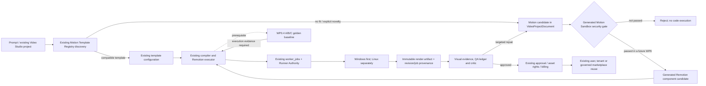

# SPEC-286 Motion Enhancement Dependency View — 2026-10-08

## Authority boundaries

- Project/timeline/revision: existing Spec 133 / Feature 143 owners.
- Motion candidates/template registry/compiler: existing Video Intelligence and Remotion packages.
- Durable execution, assignment and fencing: existing `worker_jobs` and Runner Authority (SPEC-224/267 contracts).
- QA and repair: existing `qaLedger`, quality loop and repair applier.
- Generated code: no execution until a separate security gate passes.
- Rights, approvals, billing, and promotion: existing authorities only.

WP0.4 blocks behavior-changing implementation: the three fixture outputs must be captured first through an authorized current Remotion runner. Static source checks and old parity artifacts are not golden render evidence.
