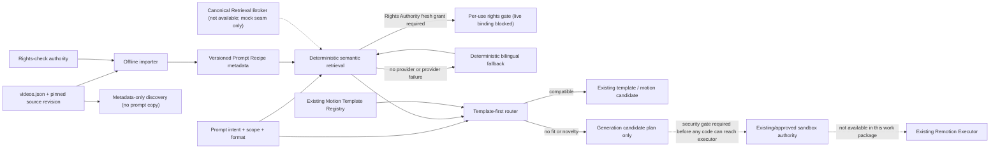

# SPEC-286 Prompt Recipe Library Work Package — 2026-10-08 (retrieval continuation)

## Work package status

| Work package                     | Status                                       | Evidence / remaining gate                                                                                                                                                                                                                                                                                                                                                                                      |
| -------------------------------- | -------------------------------------------- | -------------------------------------------------------------------------------------------------------------------------------------------------------------------------------------------------------------------------------------------------------------------------------------------------------------------------------------------------------------------------------------------------------------- |
| WP0.4 Golden Render Baseline     | **PARTIAL / BLOCKED**                        | The three fixtures remain defined, but no real Windows Runner receipts or rendered artifacts were produced in this work. Windows Runtime Verification is an external blocker owned by another session. Linux readiness remains separate and unverified.                                                                                                                                                        |
| WP-R1 Prompt Recipe contract     | **COMPLETED (bounded code + unit evidence)** | R1.7.x §166 now distinguishes verified/unverified compatibility; Draft-07 schema tests enforce that unverified values cannot claim capabilities.                                                                                                                                                                                                                                                               |
| WP-R2 offline catalog importer   | **PARTIAL**                                  | Preserved importer; immutable source SHA, attribution, digest, partial-prompt rejection, tenant scope, deduplication and recipe versions remain. Live catalog-specific Rights Authority is not connected. Metadata-only bilingual discovery does not return prompt/media/code.                                                                                                                                 |
| WP-R3 retrieval and routing      | **PARTIAL**                                  | Existing deterministic retrieval and Motion Template Registry routing retained. Added Thai/English intent tokens, tenant-scoped optional vector candidate fusion with deterministic fallback, relevance ordering, verified-only compatibility filtering, and per-use fail-closed rights recheck. Live Vectorize/Retrieval Broker invocation is blocked because SPEC-229 documents no canonical Broker runtime. |
| WP-R4 generated motion execution | **BLOCKED / NOT IMPLEMENTED**                | Candidate routing returns a plan only. No AI-generated Remotion source is executed; no sandbox security gate or authorized executor receipt was available in this lane.                                                                                                                                                                                                                                        |
| WP-R5 tests and QA               | **COMPLETED for bounded unit/mock scope**    | 18 fixture/mock tests pass in 10 consecutive focused Vitest QA rounds after the final freshness/ranking fixes. This is not live Broker/Rights Authority, runtime, render, or visual-quality evidence.                                                                                                                                                                                                          |

## Source and ownership audit

- Start source for this continuation: `origin/main` / `aaca5264ab366c556d9a24c6c11fa4a299a596ea`; isolated worktree branch `codex/spec286-hybrid-retrieval-20261008`.
- Before PR preparation, `origin/main` advanced to `c32a13652a04999646f8dc28f0b827c008a4320d` with unrelated public-homepage polish and SPEC-263 evidence/handoff; this worktree is reconciled to that tip before checkpoint promotion.
- This continuation did not modify Runner-owned worktrees or Windows/Linux Runner code.
- Runner-owned worktrees/branches were inventoried and left untouched. Windows Runner repair remains external.
- Latest pre-change canonical handoff at this continuation start: manifest generation 18, `DORMANT_UNRESOLVED`, `VALIDATION_PENDING`, `RECONCILIATION_REQUIRED`, 0/746 requirements passed; scoped validation had `valid=true`, `completion_eligible=false`. Reconciliation after the Spec amendment produced generation 19; evidence-based continuation update produced generation 20. All 756 current ledger rows remain unresolved; no requirement is marked PASS by mock evidence.
- Upstream source shape was inspected read-only at `yihui-dev/awesome-opus5-5-videos` commit `756290289742535eb0ac3817548f152e9759cc70` (2026-10-08T02:12:38Z). The fixture is synthetic; no upstream creator prompt/media was committed or imported.
- Existing authority reused: 13-entry Motion Template Registry metadata, `VideoProjectDocument.motionCandidates`, existing project revision flow, and `worker_jobs`/Runner Authority. No new database, queue, timeline, executor, or registry was added.

## Architecture and dependency path

The importer performs no network fetch, persistence, or execution. Rights evidence
is supplied by an injected authority. Marketplace recipes require the existing
promotion approval reference. Retrieval filters rights and reuse scope before
ranking. Generated code has no path from the returned plan to execution.

## Current dependency and authority audit

- **RetrievalBroker / Vectorize:** SPEC-229 `spec.md` says the canonical
  `RetrievalBroker`/`SAH-RETRIEVAL-2` runtime and consumer migration were not
  found. Existing direct Vectorize search is not a substitute for that Broker.
  This change implements only a provider-independent candidate seam and
  deterministic local fallback; live retrieval is **BLOCKED** pending the
  canonical Broker and approved recipe index contract. Tests use mock vector
  candidates only.
- **Rights Authority:** no source-catalog-specific live Rights Authority binding
  was found. Existing rights services are scoped to other data/assets and cannot
  grant reuse of these creator prompts. Full-prompt retrieval now requires a
  scoped, unexpired approved decision checked within the last 60 seconds per use and fails closed on
  absent/error/unknown/denied/revoked/expired responses. Live import and prompt
  use remain **BLOCKED** until the correct Authority is bound. Metadata-only
  source discovery is available.
- **Compatibility:** imported recipes now label aspect ratio and duration as
  unverified, with no unsupported values asserted. They do not gate discovery.
- **Execution:** routing returns an existing template choice or candidate plan;
  it does not execute generated code. Generated Motion Sandbox, Windows Runner,
  Linux Runner, Golden Render A/B/C and WP0.4 remain **BLOCKED/PARTIAL**.

## Execution and test evidence

- Focused command: `JWT_SECRET=test-jwt-secret-32-chars-minimum-1234567890 pnpm --filter @smartspec/web exec vitest run server/services/__tests__/promptRecipeLibrary.test.ts` — 18 passed, repeated for 10 consecutive QA rounds.
- The importer now rejects movable branch/tag names as `sourceRevision`; only immutable 40/64-hex Git commit SHAs pass schema and runtime validation.
- A shared read-only `node_modules` link from the clean primary checkout was used by the isolated worktree; no dependencies were installed or modified.
- These checks exercise mocked rights and vector-candidate seams plus local metadata ranking only. They are **not** live Broker, rights-authority, Runner, runtime, render, visual-quality, or production PASS evidence.
- `git diff --check` is part of the fast integration gate.

## Cost and quality comparison

No comparable golden render was executed, so measured cost/quality improvement is **not available**. The code path prefers the lowest declared `renderCost` among compatible existing templates and avoids a generation candidate when a template fits. Actual dollars, render time, quality, and repair burden require WP0.4 baseline/candidate receipts for fixtures A/B/C.

## Remaining blockers and next bounded work packages

1. **Lane A / WP0.4:** When the Windows Runner repair is complete, Lane A must publish readiness evidence through the canonical handoff: authorized executor identity/capability, artifact path, job identity, exact revision, and source-bound receipts for fixtures A/B/C. Integrate its handoff through the shared writer after reconciling the canonical SHA; do not merge overlapping worktree changes.
2. Assess Linux Runner readiness independently and record a blocker if unavailable.
3. Bind the new recipe/routing requirements to the canonical SPEC-286 identity after repository authority reconciliation is resolved.
4. Connect the disabled/pure library to an existing authorized Studio entry point behind existing feature-flag authority only after route, tenant, revision, approval, and billing bindings are identified.
5. Implement or bind the Generated Motion Sandbox security gate only through the currently approved sandbox authority. Until then, generated code stays non-executable and WP-R4 stays blocked.
6. Run baseline and candidate renders and produce actual cost/quality comparison evidence before claiming improvement or completing WP0.4.

Production deployment and database migration were not performed.
