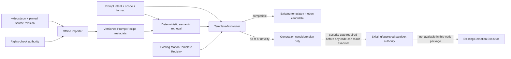

# SPEC-286 Prompt Recipe Library Work Package — 2026-10-08

## Work package status

| Work package | Status | Evidence / remaining gate |
|---|---|---|
| WP0.4 Golden Render Baseline | **PARTIAL / BLOCKED** | The three fixtures remain defined, but no real Windows Runner receipts or rendered artifacts were produced in this work. Windows Runtime Verification is an external blocker owned by another session. Linux readiness remains separate and unverified. |
| WP-R1 Prompt Recipe contract | **COMPLETED (spec/code checkpoint)** | R1.7.x additive contract in `spec.md` §166 and Draft-07 schema at `apps/web/shared/videoIntelligence/promptRecipe.schema.json`; schema tests pass. |
| WP-R2 offline catalog importer | **PARTIAL** | Pure importer implemented with source revision/path/attribution/digest, rights-check callback, default rejection when rights are not approved, partial prompt rejection, scope checks, deduplication, and version increments. No live rights authority or source catalog ingestion was run. |
| WP-R3 semantic retrieval and routing | **PARTIAL** | Deterministic tag/title retrieval and template-first routing use the existing Motion Template Registry metadata. This is a bounded baseline, not embedding/model quality evidence or Studio UI integration. |
| WP-R4 generated motion execution | **BLOCKED / NOT IMPLEMENTED** | Candidate routing returns a plan only. No AI-generated Remotion source is executed; no sandbox security gate or authorized executor receipt was available in this lane. |
| WP-R5 tests and QA | **COMPLETED for bounded code scope** | Fixture/mock tests cover schema, rights, attribution, versioning/deduplication, scope isolation, retrieval, routing, and the no-code-payload boundary. Ten focused QA iterations recorded separately. |

## Source and ownership audit

- Start source: `origin/main` / `5f965b9cccbe8849263b177cd0b41514372f4191`, clean canonical checkout.
- Active implementation worktree: `/home/dev/worktrees/spec286-motion-recipes-20261008`, branch `codex/spec286-motion-recipes-20261008`.
- Runner-owned worktrees/branches were inventoried and left untouched. Windows Runner repair remains external.
- Latest pre-change canonical handoff: manifest generation 13, `DORMANT_UNRESOLVED`, `VALIDATION_PENDING`, `RECONCILIATION_REQUIRED`, 0/719 requirements passed; shared validation had `valid=true`, `completion_eligible=false`.
- Upstream source shape was inspected read-only at `yihui-dev/awesome-opus5-5-videos` commit `756290289742535eb0ac3817548f152e9759cc70` (2026-10-08T02:12:38Z). The fixture is synthetic; no upstream creator prompt/media was committed or imported.
- Existing authority reused: 13-entry Motion Template Registry metadata, `VideoProjectDocument.motionCandidates`, existing project revision flow, and `worker_jobs`/Runner Authority. No new database, queue, timeline, executor, or registry was added.

## Architecture and dependency path

The importer performs no network fetch, persistence, or execution. Rights evidence
is supplied by an injected authority. Marketplace recipes require the existing
promotion approval reference. Retrieval filters rights and reuse scope before
ranking. Generated code has no path from the returned plan to execution.

## Execution and test evidence

- Focused command: `JWT_SECRET=test-jwt-secret-32-chars-minimum-1234567890 pnpm --filter @smartspec/web exec vitest run server/services/__tests__/promptRecipeLibrary.test.ts shared/videoIntelligence/__tests__/motionTemplates.select.test.ts`
- The importer now rejects movable branch/tag names as `sourceRevision`; only immutable 40/64-hex Git commit SHAs pass schema and runtime validation.
- A shared read-only `node_modules` link from the clean primary checkout was used by the isolated worktree; no dependencies were installed or modified.
- This command exercises mocked rights approval and local metadata routing only. It is **not** Runner, runtime, render, visual-quality, production, or rights-authority PASS evidence.
- `git diff --check` is part of the fast integration gate.

## Cost and quality comparison

No comparable golden render was executed, so measured cost/quality improvement is **not available**. The code path prefers the lowest declared `renderCost` among compatible existing templates and avoids a generation candidate when a template fits. Actual dollars, render time, quality, and repair burden require WP0.4 baseline/candidate receipts for fixtures A/B/C.

## Remaining blockers and next bounded work packages

1. **Lane A / WP0.4:** When the Windows Runner repair is complete, Lane A must publish readiness evidence through the canonical handoff: authorized executor identity/capability, artifact path, job identity, exact revision, and source-bound receipts for fixtures A/B/C. Integrate its handoff through the shared writer after reconciling the canonical SHA; do not merge overlapping worktree changes.
2. Assess Linux Runner readiness independently and record a blocker if unavailable.
3. Bind the new recipe/routing requirements to the canonical SPEC-286 identity after repository authority reconciliation is resolved.
4. Connect the disabled/pure library to an existing authorized Studio entry point behind existing feature-flag authority only after route, tenant, revision, approval, and billing bindings are identified.
5. Implement or bind the Generated Motion Sandbox security gate only through the currently approved sandbox authority. Until then, generated code stays non-executable and WP-R4 stays blocked.
6. Run baseline and candidate renders and produce actual cost/quality comparison evidence before claiming improvement or completing WP0.4.

Production deployment and database migration were not performed.
